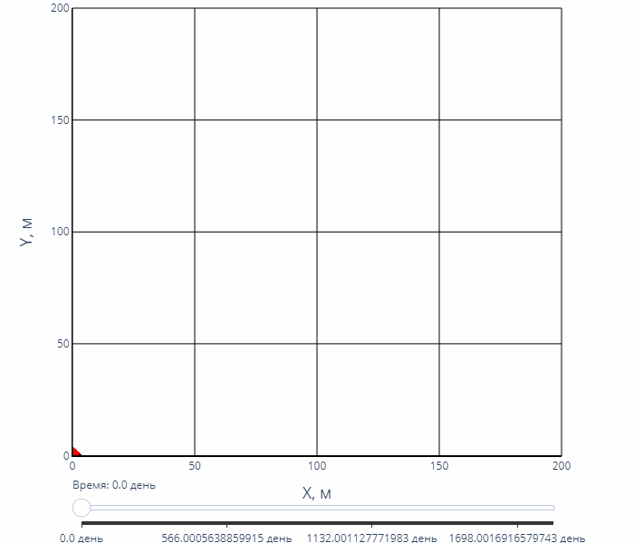
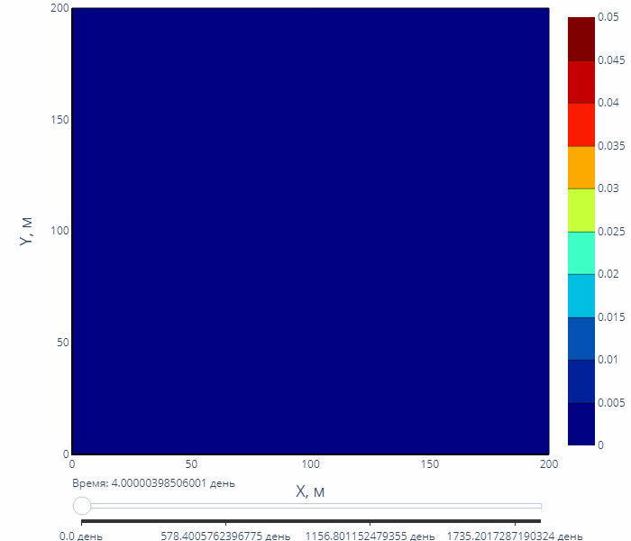
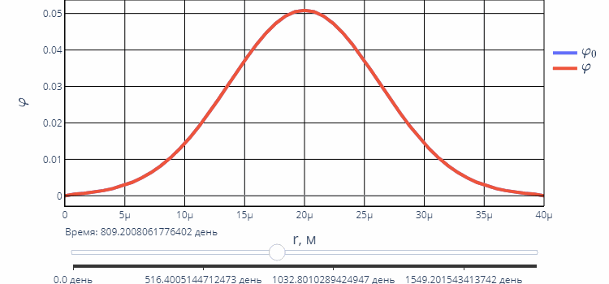

# Reservoir Simulator

Рекомендуемая версия Python: 3.10+

## 📝 Описание
-  Моделирование двухфазной фильтрации воды и нефти
-  Учет неизотермических процессов
-  Расчет процессов кольматации и суффозии (оседание/вынос парафиновых частиц в капиллярах)
-  Интерактивные plotly-отчеты по результатам

## 📚 Математическая модель
### Основные уравнения:
  - Сохранения массы (воды, нефти, парафина)
  - Движения (закон Дарси)
  - Сохранения полной энергии (вода, нефть, парафин, скелет пористой среды)
  - Уравнения фазовых переходов парафина
  - Изменения радиусов и блокирования капилляров
### Численные методы:
  - Метод конечных объемов (регулярная прямоугольная сетка)
  - Метод IMPES (неявный по давлению, явный по насыщенности)
  - Ленточное разложение Холецкого + PCG для решения СЛАУ давления (см. `PERFORMANCE_FINDINGS.md`)

# <u> Результаты </u>
🔴 — — — — Массовая доля растворенного парафина 0% 
⚫️ ━━━━━ Массовая доля растворенного парафина 5%

## Поле насыщенности

## Поле температуры

## Массовая доля выпавшего парафина

## Функция пор по размерам

## Изменение пористости

## Изменение проницаемости

