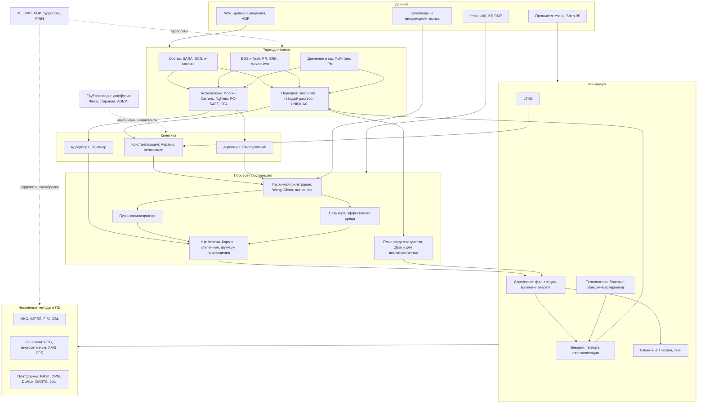

# Математическое и численное моделирование выпадения и осаждения парафинов, асфальтенов и смол при неизотермической фильтрации в пласте: литературный обзор

*Обзор к диссертационной работе (проект `reservoir-simulator`, модуль `paraphin`). Октябрь 2026 г. Ссылки в квадратных скобках — номера списка литературы; полные метаданные, аннотации и статусы доступа — в `sources_registry.csv`, `sources_annotated.md`, `references.bib`.*

# 1. Введение

## 1.1. Актуальность

Асфальтосмолопарафиновые отложения (АСПО) — одна из главных причин потери продуктивности скважин на месторождениях парафинистых и асфальтеновых нефтей. Пока отложения образуются в стволе и трубопроводах, их удаляют механически, химически или прогревом. Отложения в поровом пространстве пласта удалить труднее, а повреждение, которое они вызывают, распространяется на десятки метров от скважины и меняет охват заводнением. Причина выпадения одна: раствор тяжёлых компонентов в нефти теряет устойчивость при изменении температуры, давления или состава [1, 2]. Однако в пласте выпадение идёт одновременно с фильтрацией: фронт холода от закачиваемой воды, дросселирование у забоя и разгазирование меняют условия равновесия в каждой точке, а выпавшая твёрдая фаза меняет проницаемость и тем самым само поле течения [3, 4].

Практическая острота задачи хорошо видна на отечественных и казахстанских объектах. На месторождении Узень с содержанием парафина в нефти до 29 % многолетняя закачка холодной воды охладила пласт с 60–65 до 20–30 °C в зонах интенсивного заводнения — на 25–35 °C ниже температуры насыщения нефти парафином [5]. Это повторяет предупреждения, сделанные ещё в 1960-х годах по данным о температурном поле Узеня [6, 7], и опыт крупного опытного участка горячего заводнения там же [8]. В низкотемпературных (12–20 °C) пластах Восточной Сибири выпадение парафина у забоя вызывают уже сами режимы добычи [9]. Лабораторные опыты на кернах высокопарафинистых нефтей показывают необратимое снижение проницаемости ниже температуры начала кристаллизации (WAT, wax appearance temperature) и уменьшение открытой пористости в несколько раз [10, 11, 12, 13].

Для асфальтенов картина иная по физике, но сходна по последствиям: выпадение при снижении давления живой нефти или закачке газа ведёт к повреждению призабойной зоны, которое трудно предсказать без совместного расчёта термодинамики, осаждения и фильтрации [14, 15, 16].

## 1.2. Цель и задачи обзора

**Цель** — систематизировать математические модели выпадения и осаждения парафинов, асфальтенов и смол при неизотермической многофазной фильтрации в пласте и призабойной зоне, их численную реализацию и экспериментальное обоснование; на этой основе определить пробелы литературы и место разрабатываемого симулятора `paraphin`.

**Задачи** (исследовательские вопросы RQ1–RQ8, `01_scope.md`):

1. сравнить термодинамические модели выпадения парафинов и асфальтенов по точности, стоимости и числу параметров с точки зрения встраивания в пластовый симулятор (RQ1);
2. систематизировать механизмы и уравнения перехода «выпавшее → отложение в порах» в пористой среде: перенос к стенке, захват, закупорка горл, вынос, адсорбция (RQ2);
3. проанализировать замыкания, связывающие отложения с пористостью, проницаемостью, связностью и подвижностью нефти, и их опытную проверку (RQ3);
4. описать сопряжённые неизотермические модели АСПО в пласте и их допущения, в том числе теплообмен с вмещающими породами и тепловое неравновесие (RQ4);
5. рассмотреть численные схемы и решатели, применяемые к этому классу задач, и специфичные для него трудности (RQ5);
6. собрать лабораторные и промысловые данные, пригодные для количественной проверки моделей (RQ6);
7. оценить роль машинного обучения и гибридных моделей (RQ7);
8. позиционировать симулятор `paraphin` и сформулировать вклады диссертации (RQ8).

## 1.3. Методология поиска и отбора

**Исходные наработки.** Отправной точкой были материалы проекта: разбор полных текстов 18 работ и каталог около 75 опытных работ в `experiments/new` (`обзор_источников.md`, `README.md`), аннотированные списки литературы по темам (`resources/литература/*/README.md`), описание физической модели симулятора (`docs/*.md`, около 80 ссылок), три прежних обзора и систематический обзор `full_review.pdf` (105 источников). Все DOI, встречающиеся в этих файлах, собраны скриптом (`tools/harvest.py`): 250 уникальных DOI.

**Базы и инструменты.** Метаданные каждой записи проверены в OpenAlex (пакетные запросы по DOI) с запасным путём через Crossref (`tools/verify.py`); год выпуска тома, том, выпуск и страницы взяты из Crossref (`tools/enrich.py`). Расширенный поиск вёлся: (а) тематическими запросами к OpenAlex на английском (12 запросов: «paraffin deposition reservoir numerical simulation», «wax deposition porous media permeability», «cold damage waxy oil reservoir water injection», «wax appearance temperature porous media», «asphaltene deposition reservoir simulation kinetic model permeability» и др.) и русском языке (12 запросов: «асфальтосмолопарафиновые отложения пласт», «неизотермическая фильтрация парафинистой нефти», «выпадение парафина в пласте моделирование» и др.), с фильтром по годам 2005–2026; (б) просмотром библиометрического корпуса прежней работы (2020 записей с аннотациями; отобраны работы 2015–2026 гг. с тегом «пористая среда»); (в) поиском по названию для записей без DOI или с ошибочным DOI; (г) веб-поиском для отечественных монографий и диссертаций (каталоги библиотек, сайты вузов, Math-Net.ru, OSTI); (д) целевым добором классики по подтемам, которые в наработках отсутствовали (численные методы, решатели СЛАУ, модели порового пространства, реология в пористой среде, ПО). Версии и лицензии открытого ПО взяты из GitHub и GitLab API.

**Критерии включения:** работа относится хотя бы к одной из 16 подтем (`01_scope.md`); реальность и метаданные подтверждены (DOI разрешается и название совпадает, либо открыт URL, либо запись найдена в каталоге или выдаче поиска); для смежных областей (трубопроводы, CO2-МУН, ML) — только если работа даёт механизм, параметр или метод, применимый к пласту. **Критерии исключения:** ингибиторы и технологии удаления как таковые, неорганические отложения и гидраты без переносимых формулировок, трещиноватые среды и оптимизация разработки (кроме одной-двух ссылок для контекста), дубли докладов при наличии журнальной версии, записи с ошибочными DOI (если верная работа не найдена). **Период** — от классики (1893–1950-е гг.) до октября 2026 г., с упором на 2019–2026 гг.

**Второй круг (по указаниям к первой версии).** (е) Библиотека пользователя «Парафинистые нефти» (79 файлов) сверена с реестром: файлы без DOI опознаны по титульным страницам и проверены поиском, 25 работ добавлены (в том числе отечественные модели неизотермической фильтрации газированной парафинистой нефти и кольматации холодных пластов), лекционные слайды, конспекты и сгенерированный ИИ отчёт как источники не учитывались. (ж) Все DOI из папки `experiments/` проекта; добавлены опорные данные сравнения уравнений состояния. (з) Целевой поиск по теме диссертации на русском и английском языках (журнал веб-поиска — `data/web_findings.md`). (и) Поиск свежих работ 2022–2026 гг. по 33 запросам к Crossref (`tools/recent.py`); из 319 кандидатов отобраны 83 работы, прямо относящиеся к подтемам, и ещё 2 работы 2024 г. по алгоритмам flash, чтобы закрыть подтему T05. Работы из папки «Асфальтены» библиотеки по указанию автора использовались как образцы структуры описания модели и источник литературы. Старые работы оставлены там, где они первоисточники моделей и данных; упор сделан на свежие. **Третий круг (10.10.2026, специальность 1.1.9).** После сброса суточного лимита OpenAlex собраны списки литературы и цитирующие работы (с 2021 г.) для 23 опорных статей — пластовых моделей парафина и асфальтенов и работ папки «Асфальтены» (`tools/snowball.py`, 717 кандидатов). Добавлен поиск по 19 запросам к теме диссертации, в том числе пяти русскоязычным (`tools/recent.py --topic`, 123 кандидата). После отсева по ключевым словам и ручного отбора добавлены 106 работ. Это теория глубинной фильтрации и её аналитические решения, неизотермическое повреждение пласта частицами, отечественные модели термогидродинамики, трубные модели осаждения и классика асфальтенов. Свежие работы второго круга перепроверены по OpenAlex.

**Результат отбора.** Всего рассмотрено 746 кандидатов, включено 724, исключено 22 с указанием причины. Шесть исключений — ошибочные DOI в `full_review.pdf`, все шесть работ найдены по названию и включены с верными DOI (`03_full_review_digest.md`). Двенадцать записей помечены `[НЕ ПРОВЕРЕНО]` и как опора выводов не используются. Медиана года проверенных источников — 2018 (у `full_review` — 2014), доля работ 2020–2026 гг. — 44 %, работ 2023–2026 гг. — 190. Русскоязычных и отечественных работ — 65. Пиратские ресурсы (Sci-Hub, LibGen, Anna's Archive) не использовались: полные тексты брались из открытых копий, библиотеки пользователя и папки `experiments/new` (`assumptions.md`). Полный текст доступен для 146 работ; все PDF собраны в библиотеке пользователя `books/neft/Парафинистые нефти` (68 были там изначально, 62 скачанные открытые копии и 17 PDF из `experiments/new` перенесены туда 10.10.2026); по 34 ключевым работам составлены конспекты (`notes/`).

## 1.4. Структура обзора

Раздел 2 даёт исторический контекст. Разделы 3–9 идут по иерархии масштабов задачи: неизотермическая фильтрация (3), состав нефти и термодинамика парафина (4), асфальтены и смолы (5), кинетика кристаллизации и механизмы переноса к стенке (6), перенос частиц и вынос в пористой среде (7), модели порового пространства и реология (8), сопряжённые модели АСПО в пласте (9). Раздел 10 посвящён опытным данным, раздел 11 — численным методам и программным платформам, раздел 12 — машинному обучению. Разделы 13–14 содержат сквозной сравнительный анализ и открытые проблемы, раздел 15 — позиционирование `paraphin`, раздел 16 — заключение. Приложения: A — таблица всех источников реестра, B — глоссарий, C — хронология ключевых работ, D — карта связей направлений.

Обзор опирается на `full_review.pdf` как на ориентир структуры (трёхуровневая схема «термодинамика — кинетика — континуум», раздел 13) и источник ссылок, но написан заново. Он расширен в тех местах, где прежний обзор слаб: пластовые, а не трубные модели, модели порового пространства, реология в пористой среде, численные методы, керновые опыты, отечественная школа (`03_full_review_digest.md`, разд. 6). Где вывод взят из `full_review`, это оговорено.

# 2. Исторический контекст и эволюция методов

Модели АСПО в пласте сложились из четырёх линий, которые долго развивались раздельно: теории фильтрации и теплопереноса в пластах, термодинамики фазовых равновесий нефтей, теории переноса частиц в пористых средах и инженерных моделей отложений в трубах. Хронологическая шкала ключевых работ — в приложении C.

**Фильтрация и теплоперенос (1940–1980-е).** Основу двухфазной постановки заложила теория вытеснения Баклея–Леверетта [17]; к концу 1950-х годов появились первые численные схемы с неявным давлением и явной насыщенностью, позднее названные IMPES [18, 19]. Неизотермическая задача с теплообменом с кровлей и подошвой была решена аналитически Ловерье [20] и Марксом–Лангенхаймом [21]; двухтемпературная задача теплообмена фаз — ещё раньше, Шуманом [22]. Отечественная школа (Чекалюк, Рубинштейн, Баренблатт, Ентов, Рыжик) развила термодинамику пласта с дроссельным эффектом, теорию температурных полей и нелинейную фильтрацию с предельным градиентом [23, 24, 25]. К концу 1970-х годов термические симуляторы включали многофазный многокомпонентный перенос, а также твёрдую фазу (кокс) в балансах массы и энергии [26, 27]. Метод Винсома–Вестервельда сделал дешёвым расчёт теплопотерь в численных моделях [28].

**Термодинамика выпадения (1980–2000-е).** Модели выпадения парафина прошли путь от твёрдого раствора с параметрами растворимости [29] и его нефтяной параметризации по SCN [30, 31, 32] к модели множественной твёрдой фазы [33] и предиктивным моделям локального состава [34, 35]. Влияние давления и растворённого газа на WAT измерено и описано в конце 1990-х [36]. Для асфальтенов первая термодинамическая модель (Флори–Хаггинс с параметрами по EOS) появилась в 1984 г. [37], затем коллоидная модель [38], твёрдая модель Nghiem на кубическом EOS [39] и, в 2000-х, уравнения состояния SAFT/PC-SAFT [40, 41, 42]. Численная основа фазовых расчётов — тест устойчивости и flash Михельсена [43, 44].

**Перенос частиц и повреждение пласта (1970–2010-е).** Теория глубинной фильтрации [45, 46] и модель параллельных путей Грусбека–Коллинза с критической скоростью выноса [47] стали каркасом моделей органического повреждения. На эту основу Ванг и Циван положили совместное осаждение парафина и асфальтенов в керне [48, 49] и асфальтеновое повреждение при первичной добыче [50]; позднее Циван обобщил кинетику осаждения и выноса [51]. Бедриковецкий предложил функцию максимального удержания вместо кинетического выноса [52]. Глубинная фильтрация как количественная теория начинается с уравнения Ивасаки для песчаных фильтров [53], а коллоидная картина асфальтенов — с работы Пфайффера и Саала [54]. Органическое повреждение пласта как промысловая проблема систематизировано в 1980–1990-е годы [55, 56]; Циван предложил обобщённую модель повреждения с тепловым механизмом [57], а Нгием и соавт. ввели осаждение и закупорку асфальтенами в композиционный симулятор [58]. Пучок капилляров с распределением пор дал и относительные проницаемости [59]. Сетевые модели пор идут от Фатта [60], а приближение эффективной среды для сетей — от Киркпатрика [61]. В отечественной литературе кинетическое уравнение для функции распределения пор по размерам при осаждении частиц в двухфазном потоке получили Никифоров и Никаньшин [62].

**Отложения в трубах (1980–2010-е).** Классификация механизмов (молекулярная диффузия, сдвиговая дисперсия, броуновская диффузия) по Трансаляскинскому трубопроводу [63], инженерные модели Вайнгартена–Эйхнера и Свендсена [64, 65], старение гель-отложения встречной диффузией [66] и кинетическая модель Хуана–Фоглера [67] сформировали «трубную» теорию отложения. Её механизмы переносят в пласт, но с оговорками (раздел 6).

**Пластовые модели АСПО (с 1990-х).** Первая связанная модель «теплоперенос + выпадение + осаждение» для призабойной зоны — Ring et al. (1994) [3]. Асфальтены вошли в композиционные симуляторы в 2000-х [14, 15]. Неизотермические модели кольматации парафином при холодном заводнении — Nie и Yang (2014) [68], Никифоров и соавт. (2022) [4]. 2020-е годы принесли многокомпонентные модели растворения осадка при прогреве [69], модели повреждения при истощении, согласованные с керновыми опытами [70], и повреждения от охлаждения при закачке CO2 [71], а также первую волну ML-моделей WAT и давления начала выпадения асфальтенов (раздел 12).

**Отечественная школа (1990–2020-е).** Параллельно с зарубежными работами в России сложились три линии, близкие к теме. Казанская (А.И. Никифоров и соавт.) развивает модели переноса частиц двухфазным потоком с функцией распределения пор по размерам — от кинетического уравнения 1998 г. до моделей отложения парафина при закачке холодной воды и асфальтенов [4, 62, 72, 73]. Уфимско-тюменская описывает неизотермическую фильтрацию газированной парафинистой нефти с фазовыми переходами, кристаллизацию в скважинах и Р–Т-область устойчивости парафина [74, 75, 76]. Московская (ИПНГ РАН) строит модели кольматации холодных пластов Восточной Сибири, адаптированные к опытам [9, 77]. Экспериментальная база создана в Горном университете (И.А. Стручков, М.К. Рогачев, М.С. Сандыга) — WAT при давлении, керновые опыты с парафином и асфальтенами [12, 16, 78]. Статистика свойств парафинистых нефтей собрана в базе ИХН СО РАН [79, 80]. Казахстанские работы последних лет связаны с охлаждением пластов Узеня и Жетыбая и с тепловыми методами [5, 13, 81, 82].

**2022–2026 годы.** Свежая литература смещена к закачке CO2 и газа (выпадение асфальтенов, повреждение в плотных и сланцевых коллекторах), к поровому моделированию закупорки (CFD-DEM, решёточный метод Больцмана, сети с вязкопластичным течением) и к ML-суррогатам (разделы 5.7, 7.6, 8.5, 12.3). Неизотермических моделей парафина в пласте за эти годы появилось немного: [4, 69, 71, 77].

Общая тенденция — сближение линий: термодинамика переходит из PVT-пакетов в симуляторы, кинетика осаждения — из керновых опытов в пластовые модели, теплоперенос — из термических МУН в задачи холодного заводнения. Но целиком цепочку «состав → равновесие при T, P → кинетика → микроструктура пор → проницаемость → течение и температура» в одном пластовом симуляторе реализуют единицы работ (раздел 9).

# 3. Неизотермическая многофазная фильтрация и теплоперенос в пласте

## 3.1. Постановка

Модель АСПО в пласте строится поверх обычной модели многофазной фильтрации, к которой добавляются уравнение энергии и стоки компонентов в отложения. Для двухфазной системы «вода — нефтяная фаза» с несжимаемыми фазами балансы массы фаз записываются так:

$$\frac{\partial (m S_\alpha \rho_\alpha)}{\partial t} + \nabla\cdot(\rho_\alpha \mathbf{u}_\alpha) = \rho_\alpha q_\alpha - \dot m_\alpha^{dep}, \qquad \mathbf{u}_\alpha = -\frac{k\,k_{r\alpha}(S)}{\mu_\alpha(T,\ldots)}\nabla p, \qquad \alpha = w, o,$$

где $m$ — пористость (меняется при осаждении), $S_\alpha$ — насыщенности, $k$ — абсолютная проницаемость (тоже меняется), $k_{r\alpha}$ — относительные фазовые проницаемости (ОФП), $\mu_\alpha$ — вязкости, сильно зависящие от температуры, $\dot m^{dep}_\alpha$ — сток массы в отложения. Капиллярное давление и гравитацию в задачах площадного заводнения обычно опускают — это приближение Баклея–Леверетта [17]. ОФП чаще всего задают степенными функциями нормированной насыщенности (форма Кори) [83]. Сложение балансов фаз даёт эллиптическое уравнение давления, а перенос насыщенности — гиперболический; на этом расщеплении основана схема IMPES (раздел 11) [83, 84].

Уравнение энергии в приближении локального теплового равновесия порода — флюиды имеет вид

$$\frac{\partial}{\partial t}\Big[(1-m)\rho_r c_r T + m\sum_\alpha \rho_\alpha S_\alpha c_\alpha T\Big] + \nabla\cdot\Big(\sum_\alpha \rho_\alpha c_\alpha T\,\mathbf{u}_\alpha\Big) = \nabla\cdot(\lambda_{eff}\nabla T) + Q_{cr} + Q_{loss} + Q_{well},$$

где $\lambda_{eff}$ — эффективная теплопроводность насыщенной породы [85, 86], $Q_{cr}$ — теплота кристаллизации (выделяется при выпадении парафина, поглощается при растворении), $Q_{loss}$ — теплообмен с вмещающими породами, $Q_{well}$ — источник тепла от скважин. Работой сил давления и вязкой диссипацией при пластовых скоростях пренебрегают. Исключение — дроссельный эффект у забоя: при закачке CO2 через перфорации он охлаждает призабойную зону ниже WAT [71], а при добыче разгазирование у ствола даёт охлаждение, которое Ring et al. назвали главным фактором парафинового повреждения [3]. В отечественной литературе дроссельный эффект и адиабатическое расширение в пласте описаны Чекалюком [23].

## 3.2. Тепловой фронт отстаёт от фронта вытеснения

Ключевая для холодного заводнения особенность — тепловой фронт отстаёт от фронта воды. Поровое пространство занимает лишь долю объёма, а прогреть или охладить приходится и скелет породы. Скорость теплового фронта при пренебрежимой теплопроводности

$$v_T = \frac{\rho_w c_w\, u_w}{(1-m)\rho_r c_r + m\sum_\alpha \rho_\alpha S_\alpha c_\alpha},$$

что в типичных условиях в 2–4 раза меньше скорости фронта насыщенности [20, 21]. Отсюда вытекают два следствия. Первое: зона, где нефть охлаждается ниже WAT, лежит позади фронта вытеснения, в области уже повышенной водонасыщенности; выпадающий там парафин взаимодействует преимущественно с остаточной нефтью. Опыты Maloney и Oesthus на меле с остаточной нефтью показали, что при охлаждении от 66 до 10 °C приёмистость по воде не падает, а фазовая проницаемость по воде даже растёт [87]. Второе: при постоянной температуре закачки зона охлаждения растёт медленно и почти целиком определяется темпом закачки и теплообменом с вмещающими породами. Этим объясняется вывод промысловой работы Orodu и Tang: повреждение остаётся в призабойной зоне, а управляющий параметр — температура на перфорациях нагнетательной скважины [88].

Аналитика для температуры закачиваемой воды на забое [89] и промысловые измерения на Узене (установление забойной температуры за 4–10 суток [6]) дают граничное условие пластовой задачи. Многолетняя история Узеня показывает, к чему приводит накопленный эффект: охлаждённые зоны в 20–30 °C при WAT 57–60 °C [5].

## 3.3. Теплообмен с кровлей и подошвой

Для пласта толщиной $h$ при одномерном теплопереносе по нормали во вмещающие породы с теплопроводностью $K$ и температуропроводностью $a$ поток тепла на единицу площади кровли (подошвы) равен

$$q_{loss} = -K\left.\frac{\partial T_s}{\partial z}\right|_{z=0}, \qquad \frac{\partial T_s}{\partial t} = a\frac{\partial^2 T_s}{\partial z^2}.$$

Подходы к его расчёту:

- **Ступенчатая аппроксимация (Ловерье).** Скачок температуры на границе считается мгновенным, $q_{loss} \approx K\,\Delta T/\sqrt{\pi a t}$, где $t$ — время, прошедшее с прихода фронта в точку. Состояния не требуется, но при немонотонной истории температуры решение неверно [20].
- **Метод Винсома–Вестервельда.** Профиль температуры в породе задаётся пробной функцией $T_s(z,t) = (\theta + p z + q z^2)\,e^{-z/d}$ с глубиной проникновения $d = \sqrt{a t}/2$. Параметры обновляются по балансу тепла на каждом шаге, поэтому на ячейку нужно одно-два поля состояния. Обратный тепловой поток и циклические режимы учитываются, точность по сравнению с аналитическими решениями высокая [28]. Метод реализован в TOUGH2 [90] и в `paraphin`.
- **Сеточный расчёт в породах** — точнее, но добавляет на каждую ячейку пласта одномерную сетку.
- **Аналитические решения отечественной школы** для слоистых пластов и закачки теплоносителя [24].

Для задач АСПО теплообмен с вмещающими породами работает в обе стороны: при холодном заводнении он подогревает пласт и тормозит охлаждение, а при прогреве ПЗП отбирает тепло и ускоряет повторную кристаллизацию [69].

## 3.4. Тепловое неравновесие породы и флюида

Двухтемпературная модель (LTNE, local thermal non-equilibrium) вводит отдельные температуры скелета $T_r$ и флюида $T_f$ с межфазным обменом $h_{sf} a_{sf}(T_r - T_f)$ [91]. Коэффициент обмена дают корреляции для зернистых слоёв [92, 93]; эталонное аналитическое решение — задача Шумана [22]. Оценки характерного времени выравнивания температур для пластовых зёрен 0.1–1 мм дают доли секунды — на порядки меньше времени фильтрации. Поэтому для пласта LTNE существенно только в двух случаях: (а) у скважины при быстрых изменениях температуры закачки и (б) когда важно, где именно кристаллизуется парафин — на холодной породе (отложение на стенке) или в объёме нефти (взвесь). Второй случай для АСПО принципиален и в литературе почти не обсуждается: механизм «молекулярной диффузии к холодной стенке» из теории трубопроводов (раздел 6) в пласте требует разности температур стенки и потока, которой в равновесной постановке нет.

## 3.5. Неньютоновская фильтрация ниже WAT

Ниже WAT парафинистая нефть приобретает предел текучести и ведёт себя как вязкопластичная среда. Отечественная теория фильтрации с предельным градиентом [25, 94] и зарубежные решения для бингамовских жидкостей [95] показывают два следствия: начальный градиент давления и предельную насыщенность вытеснения выше остаточной по ОФП. Начальный градиент для высокопарафинистой нефти Хунцзе достигает 1 МПа/м — в 6–10 раз больше, чем для лёгких нефтей [10]. Свежие керновые опыты показали недарсиевскую фильтрацию высокозастывающей нефти при охлаждении [96]. Подробнее о законе Дарси для вязкопластичных жидкостей — в разделе 8.

## 3.6. Неизотермическая фильтрация с фазовым переходом: аналогии

Наиболее проработанная литература по неизотермической фильтрации с фазовым переходом и теплотой перехода относится к газовым гидратам [97]. Структура уравнений там та же (баланс массы со стоком, Дарси, энергия с источником теплоты перехода), различаются кинетика и термодинамика. Для парафина аналогичные постановки с аналитическими решениями температурного поля при растворении предложены Филипповым и соавт. [98]. Задачи вытеснения высокопарафинистой нефти холодной водой рассматривали казахстанские авторы [99]. Многие термические симуляторы термических МУН имеют нужную инфраструктуру — энергию, многокомпонентность, твёрдую фазу [26, 27, 100, 101], но кристаллизация парафина с осаждением в них не реализована.

**Скважина и пласт как одна тепловая система.** Для задач у забоя всё чаще решают сопряжённую задачу теплообмена «скважина — пласт». Пример — нефтенасыщенный пласт и добывающая скважина с греющим кабелем: численная модель оценивает, насколько прогревается призабойная зона [102]. Отложения там не моделируются (цель работы другая), но постановка — та же, что нужна для расчёта прогрева ПЗП против кольматации. Без неё нельзя связать температуру на перфорациях с распределением осадка в первых метрах пласта. Для неоднородных пластов Казахстана тепловые и химические методы рассмотрены вместе, на лабораторных данных и расчётах [82]. Закономерности фильтрации в призабойной зоне, которые учитываются при регулировании разработки, обобщены на промысловых данных Коми [103]. Эти работы показывают инженерную сторону задачи. Решения о прогреве и температуре закачки принимаются по упрощённым тепловым расчётам, без модели кольматации. Связать их с моделью осаждения — прикладная цель пластовой модели АСПО (раздел 15.4, п. 5).

**Термогидродинамика призабойной зоны.** Отечественная школа термометрии пластов развивает модели температурного поля с эффектами Джоуля–Томсона и адиабатическим для неоднородной призабойной зоны: неоднородность по углу даёт разную скорость установления температуры после пуска скважины [104]. Для двухфазной фильтрации нефть — вода проверена применимость метода Чекалюка к оценке радиуса и проницаемости изменённой зоны у скважины [105]. Для модели АСПО это возможный способ промысловой проверки: зона кольматации — та же «изменённая зона», и её параметры можно оценивать по термограммам. Полные замкнутые решения задачи Ловерье с накоплением, конвекцией, теплопроводностью, дисперсией и теплоотдачей в породы [106] дают эталоны для верификации тепловой части. Схемы для неизотермической фильтрации с фазовым переходом отработаны на закачке пара [107], а изменение петрофизических свойств при закачке теплоносителей сведено в обзоре [108].

**Тепловые эффекты фазовых переходов при истощении.** При разработке холодных пластов с газированной парафинистой нефтью охлаждение создаёт не закачка, а сам пласт: дроссельный эффект Джоуля–Томсона и адиабатическое расширение. К ним добавляется поглощение теплоты при разгазировании и выделение при кристаллизации. Численное моделирование показало, что многокомпонентность даёт несколько фронтов фазовых переходов. Теплота кристаллизации может вызывать затухающие или устойчивые колебания температуры в зависимости от начальной концентрации парафина [74]. В модели с кольматацией те же эффекты определяют, где и насколько снижается проницаемость [77]. Для заводнения эти эффекты вторичны, для истощения — главные.

Таблица 3.1. Подходы к тепловой части модели АСПО.

| Элемент | Варианты | Плюсы | Ограничения | Применимость к АСПО | Ссылки |
|---|---|---|---|---|---|
| Теплообмен с вмещающими породами | нет; Ловерье; Винсом–Вестервельд; сетка в породе | от нулевой стоимости до полной точности | Ловерье неверен при немонотонной истории | Винсом–Вестервельд — оптимум для прогрева и охлаждения | [20, 28, 90] |
| Порода — флюид | одна температура; LTNE | LTNE разделяет кристаллизацию на стенке и в объёме | лишнее поле и параметр обмена | нужен для механизма «кристаллизация на холодной стенке» | [91, 93] |
| Теплота кристаллизации | нет; по доле твёрдого (энтальпийно-пористый метод); по группам | согласованность с равновесием | при одной группе — эффективная теплота | существенна при больших долях парафина | [109, 110] |
| Реология ниже WAT | ньютоновская с вязкостью суспензии; предельный градиент; гель с тиксотропией | описание начального градиента | параметры переносятся из объёма в пору условно | ключевая для высокозастывающих нефтей | [95, 111, 112] |

## 3.7. Пробелы

1. Нет количественных данных о том, где кристаллизуется парафин при фильтрации — на скелете или в объёме нефти. Именно это разделяет механизмы «отложение на стенке» и «захват взвеси» и требует LTNE или поровых моделей теплообмена.
2. Влияние отставания теплового фронта на то, что парафин выпадает в основном из остаточной нефти, в моделях учитывается неявно: через насыщенность в стоке. Опытов с одновременным измерением насыщенности, температуры и проницаемости мало [87, 113].
3. Усадка нефти при охлаждении (несколько процентов объёма на десятки градусов) в моделях несжимаемых фаз не учитывается, хотя по величине сравнима с изменением насыщенности, наблюдаемым в опытах [87].

# 4. Состав нефти и термодинамика выпадения парафина

## 4.1. Характеризация состава

Любая модель выпадения начинается с описания состава. Прямой покомпонентный анализ тяжёлой части нефти невозможен, поэтому используют два взаимодополняющих представления. **SARA** делит нефть по растворимости и полярности на насыщенные углеводороды, ароматику, смолы и асфальтены; современные автоматизированные методики ВЭЖХ дают воспроизводимость лучше 1 % [114]. **SCN** (single carbon number) группирует плюс-фракцию по числу атомов углерода [115]. Мольное распределение C7+ задают экспоненциальным или гамма-распределением [116], свойства псевдокомпонентов — корреляциями Риази–Даубера и Кеслера–Ли [117, 118], а укрупнение в небольшое число псевдокомпонентов — по методикам группирования [119, 120, 121].

Для парафина важна не вся плюс-фракция, а распределение **нормальных** алканов внутри неё: кристаллизуются именно н-алканы, а изо- и циклоалканы того же числа углеродов остаются растворителем. Поэтому модели нефтей Северного моря делят каждую SCN-фракцию на «парафинообразующую» и остальную часть [31]. Предиктивные модели требуют хроматограммы н-алканов [122, 123]. Высокомолекулярные н-алканы (до C60) находят и в асфальтенах, и в скважинных АСПО [124]. Значит, разделение «парафин отдельно, асфальтены отдельно» условно уже на уровне состава.

## 4.2. Условие равновесия твёрдое — жидкость

Для компонента $i$ равенство летучестей в жидкости и твёрдой фазе с термодинамическим циклом плавления даёт

$$\ln\frac{x_i^S\gamma_i^S}{x_i^L\gamma_i^L} = \frac{\Delta H_{f,i}}{R T}\left(\frac{T}{T_{m,i}}-1\right) + \frac{\Delta H_{tr,i}}{R T}\left(\frac{T}{T_{tr,i}}-1\right) - \frac{\Delta C_{p,i}}{R}\left(\ln\frac{T_{m,i}}{T}-\frac{T_{m,i}}{T}+1\right) + \frac{\Delta v_i\,(P-P_0)}{R T},$$

где $T_{m,i}$, $\Delta H_{f,i}$ — температура и теплота плавления, $T_{tr,i}$, $\Delta H_{tr,i}$ — твёрдо-твёрдого перехода, $\Delta C_{p,i}$ — разность теплоёмкостей, $\Delta v_i = v_i^L - v_i^S$ — скачок объёма при плавлении (поправка Пойнтинга). Свойства плавления н-алканов систематизированы Бродхерстом [110] и Воном [29]. Модели различаются описанием коэффициентов активности $\gamma^S$, $\gamma^L$ и числом твёрдых фаз.

**Твёрдый раствор** (Вон). Осадок — одна неидеальная твёрдая фаза; неидеальность обеих фаз — через параметры растворимости, $\ln\gamma_i = V_i(\delta_i-\bar\delta)^2/RT$ [29]. Параметризация для нефтей — Хансен и соавт. (Флори–Хаггинс для жидкости, SCN из хроматографии) [30], Педерсен и соавт. [31, 32]. Модель Вона систематически завышает количество осадка; для широких смесей одна твёрдая фаза физически неверна.

**Множественная твёрдая фаза** (multi-solid, Лира-Галеана, Фирузабади, Праусниц). Каждый компонент, способный кристаллизоваться, образует свою чистую твёрдую фазу ($x_i^S\gamma_i^S = 1$); какие фазы присутствуют, определяет тест устойчивости. Жидкость описывается уравнением состояния. Подгоночных параметров смеси нет; выпадает часть со средним числом углеродов выше 25 [33]. Модель проста в реализации (условия независимы по компонентам) и опирается на наблюдаемое расслоение осадка. Практические настройки под конкретные нефти — например, по PNA-анализу [125].

**Локальный состав** (Кутиньо). Твёрдый раствор описывается уравнением Вильсона [34] или предиктивным UNIQUAC [35, 126] с параметрами из свойств чистых веществ; модель объясняет и одну твёрдую фазу близких н-алканов, и расслоение широких смесей. Для нефтей с известной хроматограммой н-алканов это самая точная из предиктивных моделей [122, 123]. Для синтетических смесей в растворителях её сочетание с Пенгом–Робинсоном описывает и растворимость, и калориметрические данные [127].

**SAFT-подход.** PC-SAFT для парафина с калибровкой по WAT [128] физически прозрачнее, но дороже и требует настройки на каждую нефть.

Систематическая проверка цепочки «EOS → модель твёрдой фазы → характеризация» на смесях возрастающей сложности показала, что потеря точности на реальных нефтях связана прежде всего с характеризацией, а не с моделью твёрдой фазы [129].

## 4.3. Давление и растворённый газ

Давление действует на WAT двумя путями. Через поправку Пойнтинга (рост WAT с давлением при $\Delta v > 0$) WAT дегазированной нефти растёт примерно на 0.1–0.3 °C/МПа. Через растворённый газ, который разбавляет жидкость и снижает WAT, живая нефть выше давления насыщения кристаллизуется при более низкой температуре, чем дегазированная [36]. Pan, Firoozabadi и Fotland показали, что модель с явным скачком объёма твёрдой фазы воспроизводит оба эффекта. Для газоконденсатов снижение давления может даже вызывать ретроградное выпадение [130]. Измерения подтверждают величины: WAT раствора парафина в керосине растёт на 0.16–0.24 °C/МПа в диапазоне 0.1–40 МПа [78]; насыщение метаном снижает WAT модельных смесей на величину того же порядка, что и эффект давления [131]; WAT живой нефти при 19.5 МПа на 1.6 °C ниже, чем дегазированной при атмосферном давлении [113]. Ультразвуковые методы позволяют мерить WAT живой тёмной нефти в пластовых условиях [132]. Подготовка пробы (фильтрация, растворённые газы) смещает WAT на градусы [133].

**Противоречие.** Вариант уравнения состояния, в котором летучесть твёрдой фазы берётся от чистой жидкости при системном давлении (то есть $v^S = v^L$), даёт $dWAT/dP$ на порядок меньше измеренного. Скачок объёма при кристаллизации обязателен — это показал ещё Pan et al. [36] и подтвердило сравнение модели `paraphin` с данными Sandyga/Struchkov (`experiments/уравнение_состояния/сравнение_EOS.md`).

## 4.4. Почему «измеренная WAT» не равна равновесной

WAT зависит от метода и скорости охлаждения: ДСК, микроскопия и вискозиметрия расходятся на несколько градусов [134, 135, 136, 137]. Кривую доли твёрдого от температуры даёт и импульсный ЯМР [138]. Измеренная WAT растёт при уменьшении скорости охлаждения — нелинейно, на величину до ~10 °C в диапазоне 0.5–20 °C/мин [139]. Для модельного раствора парафина в керосине она при 0.001 °C/с на 3.1 °C выше, чем при стандартных 0.042 °C/с [78]. Методы определения температуры начала кристаллизации для нефти Узеня тоже расходятся на несколько градусов [140].

Отсюда важный для пластовых моделей вывод. Утверждение «в порах парафин кристаллизуется на 3–4 °C выше, чем в объёме» [12, 141] может отражать не свойство пористой среды, а разницу скоростей охлаждения: в реометре — 1 °C/мин, в керне — 1 °C/ч. Минеральные частицы (гетерогенное зарождение) и узкий зазор реометра дают сдвиги того же порядка [78]. Опубликованные опыты эти три причины не разделяют (`обзор_источников.md`, разд. 2.1). Для модели это означает: равновесную кривую растворимости надо калибровать по медленным опытам, а запаздывание выпадения описывать кинетикой (раздел 6), а не вводить отдельную «WAT пористой среды».

## 4.5. Уравнения состояния и алгоритмы фазовых расчётов

Жидкость и газ в моделях выпадения описываются кубическими уравнениями состояния SRK [142] или Пенга–Робинсона [143] со сдвигом объёма [144] и коэффициентами парного взаимодействия метан — тяжёлые компоненты, коррелированными по плотности [115]. Асфальтенам и полярным компонентам больше подходят SAFT [145] и PC-SAFT [40] (раздел 5).

Надёжный фазовый расчёт начинается с теста устойчивости по касательной плоскости [43], затем выполняется flash [44] на основе уравнения Рачфорда–Райса [146]. Для трёх и более фаз используют многофазные варианты с гарантированной сходимостью [147, 148], для твёрдых фаз — совместные алгоритмы устойчивости и flash [149, 150]. В неизотермических симуляторах с энтальпией как первичной переменной нужен изоэнтальпийный flash [151]. Монография Михельсена и Моллерупа — стандартный справочник по реализации [152]; отечественный источник по алгоритмам равновесия пар–жидкость — диссертация Ющенко [153]. Равновесия с полициклическими соединениями рассмотрены в диссертации Ефимова [154].

**Стоимость.** Flash в каждой ячейке на каждом шаге — главная вычислительная нагрузка композиционных симуляторов. Её снижают табулированием в пространстве состава и температуры [100] и операторной линеаризацией [155]. Для модели АСПО с замороженным составом растворителя (концентрации парафина малы и почти не меняют летучести остальных компонентов) естественны таблицы равновесия по $(T, P)$ — так сделано в `paraphin`. Свежие работы ускоряют сам многофазный flash в композиционном симуляторе для системы углеводороды — CO2 — вода. Одна из них пропускает повторное определение фазового состояния там, где оно заведомо не изменилось [156]. Другая вводит «радиус фазового состояния» — окрестность, внутри которой фазовое состояние известно без теста устойчивости [157]. Для модели АСПО с твёрдой фазой это та же идея, что табулирование: не решать заново задачу, ответ которой почти не изменился. Твёрдую фазу эти работы не рассматривают.

Таблица 4.1. Модели равновесия твёрдое — жидкость для парафина.

| Модель | Твёрдая фаза | Жидкость | Параметры | Точность | Стоимость в ячейке | Ссылки |
|---|---|---|---|---|---|---|
| Идеальный раствор, один псевдокомпонент | одна чистая | идеальный раствор | 2 (Tm, ΔH) — подгонка по кривой выпадения | хорошая в диапазоне калибровки | замкнутая формула | [3, 64] |
| Твёрдый раствор (Вон, Хансен, Педерсен) | одна неидеальная | регулярный раствор / EOS | параметры растворимости по SCN | завышает количество осадка | итерации по одной фазе | [29, 30, 32] |
| Multi-solid (Лира-Галеана) | много чистых | EOS | нет подгоночных параметров смеси | хорошая по количеству, WAT зависит от характеризации | активное множество фаз | [33, 125] |
| Локальный состав (Вильсон, UNIQUAC) | твёрдые растворы | EOS / активность | из свойств чистых веществ | лучшая для синтетических смесей и нефтей с хроматограммой | многофазный SLE | [34, 35, 127] |
| PC-SAFT | чистые / раствор | PC-SAFT | сегментные параметры | хорошая при калибровке | высокая | [128] |

## 4.6. Новые результаты 2022–2026 и опорные данные

**Пластовые нефти и газоконденсаты.** Свойства газовой фазы при этом берут из стандартных корреляций, например вязкость природных газов по Ли–Гонсалесу–Икину [158]. Для нефти горизонта Ю-13 Узеня PVT-анализ с акустической резонансной системой и
метод «холодного стержня» дали три температурных интервала: начало кристаллизации парафина, массовая кристаллизация и
полное застывание [81]. Для пластовой модели это ценно вдвойне. Измерение сделано на живой
нефти при пластовом давлении. А разделение на интервалы прямо соответствует кривой выпадения, которую
калибрует multi-solid. Для казахстанской нефти свойства плавления н-алканов в модели множественной твёрдой фазы
корректировали отдельно [159]: табличные свойства Вона для реальной нефти без настройки не
годятся. Это совпадает с выводом раздела 4.2. Газоконденсаты Тарима показали, что WAT по ДСК зависит от скорости
охлаждения, а температура плавления — от скорости нагрева; давление тоже сдвигает обе [160, 161]. Термодинамика выпадения из живых нефтей, богатых CO2, и из пластовых флюидов других регионов
развивается в прикладных работах [162, 163]. Отечественная работа
строит P–T-диаграмму системы газ — нефть — парафин и вводит фотометрическую методику измерения температуры начала
кристаллизации [76].

**Опорные данные для синтетических смесей.** Количество и состав твёрдой фазы в смесях декана с н-алканами C18–C30
измерены изотермическим фильтрованием частично замёрзших смесей с хроматографией фаз [164, 165]. Эти данные — главный эталон для выбора между multi-solid, идеальным и неидеальным
твёрдым раствором. Ранее Коутиньо и соавт. исходили из того, что главная трудность расчёта — неидеальность жидкой фазы при
большой разнице размеров молекул. Они сравнили модели коэффициентов активности (Флори–Хаггинс, модифицированный
UNIFAC, модели свободного объёма) по температуре появления твёрдой фазы на базе из ~60 бинарных систем и оценили
погрешности обычных упрощающих допущений [166]. Критические
свойства длинных н-алканов для уравнений состояния берут из согласованных асимптотических корреляций
[167]; справочные свойства твёрдых парафинов сведены в монографии [168].
Альтернатива подходу через летучесть переохлаждённой жидкости — уравнение состояния самой твёрдой фазы с параметрами,
подобранными по чистым компонентам [169]; на нефтях оно проверено мало.

**Что из этого следует.** Свежие данные расширяют базу калибровки, но не меняют картину: для пластовой модели нужна
кривая выпадения при пластовом давлении (как у Узеня) и данные о скорости охлаждения при измерении WAT. Сопоставимых
данных о составе твёрдой фазы для реальных нефтей по-прежнему нет.

## 4.7. Пробелы

1. Нет согласованных наборов данных «хроматограмма н-алканов + кривая выпадения + WAT при нескольких скоростях охлаждения и давлениях» для одной нефти. Поэтому сравнить модели на реальной нефти, а не на синтетических смесях, почти невозможно.
2. Эффективные параметры одного псевдокомпонента, подобранные по кривой выпадения, не согласуются с калориметрической теплотой кристаллизации. Для уравнения энергии их приходится разделять.
3. Влияние воды и минеральной поверхности на зарождение кристаллов в порах описано качественно [78] и в моделях не используется.

# 5. Асфальтены и смолы: природа, термодинамика, выпадение

## 5.1. Природа асфальтенов

Асфальтены — класс растворимости: нерастворимы в лёгких н-алканах и растворимы в толуоле. Классические опорные точки — коллоидная картина битума как дисперсии асфальтенов, пептизированных смолами [54], и данные о растворимости асфальтенов в углеводородных растворителях [170]; современное состояние сведено в обзорах [171, 172]. Модель Йена–Маллинса описывает иерархию: молекула с одним конденсированным ароматическим ядром (~750 Да) → наноагрегат (~6 молекул) → кластер (~8 наноагрегатов) [173, 174]. Её подтверждают лазерная масс-спектрометрия [175] и градиенты состава в пластах: масса молекул и наноагрегатов постоянна по разрезу [176], кластеры наблюдаются в пластовых условиях [177]. Металлопорфирины и сера концентрируются в асфальтенах и усиливают агрегацию [178, 179, 180]. Смолы стабилизируют асфальтены, а парафин и асфальтены взаимодействуют: флокулированные асфальтены служат центрами кристаллизации парафина и меняют структуру его геля [181, 182, 183, 184]. Обзоры свойств и факторов устойчивости — [185, 186, 187].

## 5.2. Четыре парадигмы термодинамики

**1. Полимерный (регулярный) раствор.** Хиршберг и соавт. описали асфальтены как жидкую фазу, отделяющуюся по Флори–Хаггинсу; параметр растворимости среды берётся из уравнения состояния [37]:

$$\ln\frac{\phi_a}{1} = \frac{v_a}{v_m}\left[1-\frac{v_m}{v_a}-\frac{v_a}{R T}(\delta_a-\delta_m)^2\right].$$

Растворимость минимальна вблизи давления насыщения: выше него снижение давления уменьшает плотность и $\delta_m$, ниже — уход газа повышает $\delta_m$. Отсюда колоколообразная зависимость количества выпавшего от давления. Простой промысловый скрининг на этой основе — диаграмма де Бура с параметрами Гильдебранда [188]; связь начала выпадения с показателем преломления смеси дана в [189]. Развитие — двухкомпонентная модель по показателю преломления [190, 191], обобщённый регулярный раствор с распределением молярной массы асфальтенов [192], учёт ингибиторов [193].

**2. Коллоидная и мицеллярная.** Асфальтены — коллоиды, стабилизированные адсорбированными смолами; выпадение — флокуляция при их десорбции [38]. Молекулярно-термодинамическая теория на потенциале средней силы [194, 195] и мицеллярная модель [196] формализуют эту картину, термодинамика агрегации — её развитие [197, 198, 199, 200]. Коллоидный подход переносят и на осаждение в пористой среде [201].

**3. Твёрдая фаза на кубическом EOS (Nghiem).** Тяжёлый компонент делится на неосаждающийся и осаждающийся, выпавшие асфальтены — чистая плотная фаза с летучестью, привязанной к давлению начала выпадения [39]. Для первичного истощения модель воспроизводит колокол: выпадение начинается выше давления насыщения, максимально около него и убывает ниже [202]. Модель дешева и встроена в промышленные композиционные симуляторы [14, 15]; её улучшения — термодинамические корреляции параметров [203]. Правильная характеризация позволяет кубическому EOS не уступать PC-SAFT в давлении начала выпадения при закачке газа [204].

**4. Ассоциирующие уравнения состояния.** SAFT [41] и PC-SAFT описывают асфальтены цепочечными молекулами с дисперсией и (иногда) ассоциацией; параметры — по данным титрования и давлению начала выпадения [42, 205, 206]. Учёт полидисперсности улучшает экстраполяцию на разные нефти и растворители [207], переменные kij(T) — на разные газы закачки [208]. CPA добавляет ассоциацию с водой [209, 210]. PC-SAFT встроен в открытый композиционный модуль MRST [211].

Сравнительные обзоры [212, 213] и опыт промышленных симуляторов [214] показывают, что выбор парадигмы влияет на результат не меньше, чем качество входных данных: UTCOMP, GEM и ECLIPSE на одном наборе PVT расходятся в давлении начала выпадения и массе осадка.

## 5.3. Давление начала выпадения, количество и обратимость

Ключевые опытные величины — давление начала выпадения (AOP), количество выпавшего от давления и обратимость. Классические данные по живым нефтям с растворителями дали Burke и соавт. [215]; обратимость с гистерезисом при повышении давления — Hammami и соавт. [216]; кривые количества выпавшего от давления — Buenrostro-González и соавт. [217] и Ghasemi и соавт. [218]; рост порога выпадения с газовым фактором при высоких T и P — Xiong и соавт. [219]. Методики измерения AOP систематизированы в обзоре [220]. Выпадение кинетически ограничено: при титровании время появления осадка составляет от минут до месяцев, так что «порог» зависит от времени наблюдения [221]. Для пласта это означает, что равновесная флокуляция — лишь предел, к которому система идёт с конечной скоростью.

## 5.4. Асфальтены при закачке газа

Закачка CO2 и углеводородных газов сдвигает огибающую выпадения. Прогнозы по PC-SAFT [205] и кубическим EOS [222] показывают сильную зависимость от состава газа. Отечественный обзор осложнений CO2-МУН систематизирует механизмы повреждения [223]. Опыты в кернах при закачке CO2 и дымового газа (раздел 10) показывают повреждение у входа, но смешивают его с газовыми эффектами.

## 5.5. Характеризация тяжёлой фракции и инженерные корреляции

Каждая из четырёх парадигм опирается на разбиение тяжёлой фракции нефти на псевдокомпоненты, и прогноз выпадения асфальтенов к этому разбиению чувствителен не меньше, чем к самой модели. Альтернативная процедура характеризации под PC-SAFT показала, что смена способа разделения фракции C7+ на насыщенные, ароматические, смолы и асфальтены заметно меняет давление начала выпадения и количество осадка при смешении с осадителями [224]. Та же чувствительность есть у кубических уравнений состояния [204]. Типичная настройка PC-SAFT на конкретную нефть [225] подбирает параметры асфальтенов по титрованию и одной-двум точкам AOP. Перенос такой настройки на другие температуры и составы газа отдельно не проверяется.

Инженерная практика использует и более простые инструменты. Скейлинговое уравнение связывает количество выпавших асфальтенов с разбавлением и молярной массой осадителя по минимальному набору PVT-данных [226]. Это быстро, но вне диапазона калибровки корреляция ненадёжна. Индекс коллоидной неустойчивости CII — отношение суммы насыщенных и асфальтенов к сумме ароматики и смол — служит грубым скринингом риска по SARA. Его применяли вместе с лабораторными испытаниями ингибиторов, и промысловые результаты подтвердили ранжирование [227]. Для пластовой модели такие индексы полезны как проверка непротиворечивости: состав, который по CII устойчив, а по модели выпадает при пластовом давлении, указывает на ошибку калибровки.

Отдельная линия — поведение асфальтенов на границах раздела. Решёточно-газовая модель в рамках иерархии Йена–Маллинса описывает кооперативную адсорбцию наноагрегатов на границе нефть — вода [228]. В пласте эта граница есть в каждой поре заводнённой зоны. Поэтому межфазная адсорбция — ещё один путь удержания асфальтенов, кроме адсорбции на минералах (раздел 7.5) и захвата флокул. В пластовых моделях он не учитывается.

## 5.6. Какая парадигма нужна пластовой модели

Выбор модели асфальтенов для пластового симулятора определяется не точностью на эталонной нефти, а пятью практическими критериями.

1. **Данные для калибровки.** Регулярному раствору и модели Nghiem достаточно давления начала выпадения при пластовой температуре и, желательно, одной кривой количества выпавшего от давления. PC-SAFT требует титрования осадителем или нескольких AOP при разных температурах и составах [205, 207]. На промысловых нефтях Прикаспия и Западной Сибири таких наборов обычно нет. Поэтому дополнительные параметры PC-SAFT остаются неопределёнными, и его преимущество в экстраполяции не реализуется.
2. **Поведение выше и ниже давления насыщения.** Колоколообразную зависимость воспроизводят все парадигмы, если параметр растворимости или летучесть среды берутся из уравнения состояния с газом [37, 39]. Если газ из модели исключён, растворения ниже давления насыщения нет. Тогда при истощении пласта модель предсказывает необратимый рост осадка. Опыты с живыми нефтями этого не показывают: ниже давления насыщения количество осадка снижается [216, 217].
3. **Температура.** В регулярном растворе температура входит через $RT$ и через $\delta_m(T)$. В модели Nghiem летучесть твёрдой фазы в исходной форме привязана к одной опорной температуре, и учёт температуры требует дополнительных параметров. Для неизотермического заводнения это существенно: при охлаждении на 30–50 °C растворимость асфальтенов меняется, причём знак эффекта зависит от нефти (разделы 5.7 и 5.8).
4. **Стоимость в ячейке.** Регулярный раствор и Nghiem при замороженном составе сводятся к замкнутым формулам или одномерным таблицам по $(T, P)$. PC-SAFT требует итераций с ассоциацией на каждую ячейку и шаг, если не табулирован заранее. В композиционных симуляторах это и определило выбор кубического EOS с твёрдой фазой [14, 15].
5. **Совместимость с кинетикой.** Равновесная модель задаёт только предел, к которому идёт флокуляция (раздел 5.3). Если кинетика флокуляции и агрегации описывается отдельно (раздел 6.3), точность равновесной части важна лишь вблизи порога. Вдали от порога результат определяют кинетические константы.

Отсюда практический вывод: для пласта без закачки газа достаточно регулярного раствора или модели Nghiem, откалиброванных по AOP и кривой количества выпавшего. PC-SAFT оправдан при закачке углеводородного газа или CO2, когда состав среды меняется сильно и нужна экстраполяция по составу [204, 208].

## 5.7. Новые результаты 2022–2026

**Уравнения состояния.** Работа над PC-SAFT идёт в трёх направлениях. Первое — физика молекулы: учёт «твёрдого
ядра» [229] и полидисперсное описание асфальтенов, сопоставленное с Флори–Хаггинсом на одних
данных [230, 231]. Второе — вычислительная устойчивость: схема,
сочетающая характеризацию Панугонти с трёхфазным алгоритмом Рачфорда–Райса, снимает плохую сходимость PC-SAFT в
экстремальных условиях [232]. Это важно для пластовой модели, где расчёт в каждой ячейке должен
сходиться всегда. Третье — сравнение с упрощёнными подходами: прямые сравнения методов прогноза огибающей и кривой
выпадения на одних данных [233, 234] и сравнение PC-SAFT с ML-моделями
для давления начала выпадения [235]. ML здесь быстрее и требует меньше входных данных, но
теряет связь с составом.

**Температура.** Выпадение асфальтенов из живой нефти при снижении давления зависит от температуры и состава
[236]. Это прямо относится к пункту 2 раздела 5.8: неизотермическая пластовая модель
асфальтенов должна описывать температурную зависимость растворимости, а не только давление.

**Закачка CO2 и газа.** Самый активный блок свежей литературы. Осаждение асфальтенов при смешивающейся и
несмешивающейся закачке CO2 изучено в нанопорах сланца [237], в сверхнизкопроницаемых кернах с поровым
механизмом повреждения [238] и в тяжёлой нефти при разной концентрации растворённого CO2
[239]. Интегрированные модели связывают PVT, керновые опыты и симулятор при CO2 и при закачке богатого
газа [240, 241]. Добавка растворимого в CO2 толуола подавляет выпадение
[242]. Свежий обзор сводит кинетику выпадения и осаждения асфальтенов и её связь с CO2
[243], отечественный — повреждение пласта при CO2-МУН [244].

**Порог выпадения.** Отечественные работы впервые применили ультрамикроскопию для наблюдения агрегатов на самых ранних
стадиях титрования [245] и динамическое рассеяние света для порогов и кинетики
агрегации в модельных системах [246]. Обе методики снижают порог обнаружения, а значит,
уменьшают кинетическую неопределённость «порога выпадения» (раздел 5.3).

**Регулярный раствор: ревизия.** Обзор Яррантона и Рамос-Палларес подытоживает применение теории регулярного раствора к фазовому поведению с асфальтенами при изменении температуры, давления и состава [247]. Критический анализ показывает границы применимости: молекулы асфальтенов (архипелаг и остров) нелинейны и жёстки, что противоречит допущениям решёточных теорий Флори–Хаггинса [248]. На практике упрощённый регулярный раствор с корреляцией мольных объёмов SARA-фракций работает для нефтей и их смесей [249]. Эмпирические и скейлинговые корреляции огибающей ненадёжны вне диапазона данных, на которых построены [250, 251]; методы определения начала выпадения сведены в обзоре [252]. Процедура характеризации нефтей для PC-SAFT, на которую опираются свежие схемы, описана в [253]. Ещё в 1990-е годы предложены молекулярный прогноз начала и количества органических отложений при изменении T, P и введении растворителей [254] и единая P–T–x-диаграмма с огибающими осаждения асфальтенов и выпадения парафина [255]. Вторая идея прямо нужна неизотермической модели совместного осаждения.

**Температура и капиллярность.** Флокулированные асфальтены в нестабильной сланцевой нефти появляются в зависимости от температуры без внешнего воздействия [256]. В сланцевых коллекторах в равновесие асфальтенов вводят капиллярное давление [257]. Многомасштабный подход связывает лабораторный анализ живой нефти с расчётом [258]; для истощения предложены явные ML-корреляции [259]. Размер частиц, которые потом захватывает порода, измерен напрямую: первичные субмикронные частицы ранней стадии выпадения видны в микроскопии полного внутреннего отражения [260], распределение размеров первичных частиц и агрегатов при выпадении под действием растворителя — в [261]. Эти размеры задают вход оценки захвата раздела 7.7.

## 5.8. Противоречия и пробелы

1. **Жидкость или твёрдое.** Регулярный раствор и PC-SAFT описывают выпавшие асфальтены как плотную жидкую фазу, модель Nghiem — как твёрдую, коллоидная картина — как флокулы. Для осаждения в порах важна морфология (частицы и пористые агрегаты), которой нет ни в одной равновесной модели.
2. **Температура.** Растворимость асфальтенов от температуры немонотонна и слабо изучена; в большинстве пластовых моделей асфальтенов задача изотермическая.
3. **Плотность осадка.** Масса осадка и потерянный объём пор связаны эффективной плотностью отложения. Опыты дают для пористого осадка значения в 5–30 раз меньше плотности сплошных асфальтенов (Struchkov et al., Do; `обзор_источников.md`, разд. 2.3), но модели обычно используют плотность сплошного вещества.
4. **Смолы.** Удержание смол и полярных компонентов при течении нефти выше порога выпадения (раздел 7) в термодинамических моделях не описывается вообще.

# 6. Кинетика выпадения и механизмы переноса к стенке

## 6.1. Зачем кинетика, если есть равновесие

Термодинамика (разделы 4–5) говорит, **сколько** твёрдой фазы может выпасть при данных $T$, $P$ и составе. Где и когда она окажется — на стенке поры, в горле, во взвеси, вынесенной из ячейки, — определяют кинетика выпадения и перенос. В трубопроводной литературе это давно общее место: модель мгновенной растворимости завышает толщину отложения, а модель без кристаллизации в объёме — занижает; учёт кинетики кристаллизации как конкурирующего с отложением процесса даёт верные предсказания на трёх нефтях [67]. Для пласта вопрос стоит ещё острее: при скорости фильтрации ~1 м/сут нефть проходит ячейку за часы, а время установления равновесия кристаллизации — от минут до часов.

## 6.2. Кинетика кристаллизации парафина

Общая теория кинетики фазового перехода с зародышами и ростом (Аврами — Колмогоров) [262] даёт для доли превращения при изотермической кристаллизации $X(t) = 1-\exp(-K t^n)$. Её неизотермические обобщения параметризуют по ДСК при разных скоростях охлаждения [263]. Для пластовых моделей обычно достаточна релаксация первого порядка к равновесию,

$$\frac{\partial w_{s}}{\partial t} = k_{cr}\,(w_{p} - w_p^{eq}(T,P))^+ - k_{d}\,(w_p^{eq} - w_p)^+\,\mathbb{1}[w_s>0],$$

где $w_p$ и $w_s$ — растворённая и взвешенная доли, $k_{cr}$ и $k_d$ — константы кристаллизации и растворения. Кинетические кривые доли твёрдого получают ДСК [264, 265] и ЯМР с высоким временным разрешением [266]; гелеобразование в периодических опытах идёт с запаздыванием, зависящим от переохлаждения [267]. Молекулярная динамика описывает механизмы растворения, диффузии и агрегации кристаллов [268]. Кинетика объясняет зависимость измеренной WAT от скорости охлаждения (раздел 4.4) [78, 139]. При линейном охлаждении со скоростью $v$ и пороге обнаружения, соответствующем переохлаждению $\Delta T^*$, запаздывание WAT растёт как $\sqrt{2\Delta T^* v/k_{cr}}$ — это даёт независимую проверку $k_{cr}$, подобранной по керну (`обзор_источников.md`, разд. 2.1).

## 6.3. Кинетика выпадения и агрегации асфальтенов

Выпадение асфальтенов кинетически ограничено [221]; агрегаты растут по механизмам диффузионно- и реакционно-лимитированной агрегации. Распределение агрегатов по размерам описывает уравнение Смолуховского [269]:

$$\frac{\partial n_k}{\partial t} = \frac{1}{2}\sum_{i+j=k}\beta_{ij}n_in_j - n_k\sum_j\beta_{kj}n_j,$$

где $n_k$ — концентрация агрегатов из $k$ первичных частиц, $\beta_{ij}$ — ядро коагуляции. Кинетику агрегации в микрокапилляре [270] и методики раздельного измерения скоростей выпадения, агрегации и осаждения [271] используют для калибровки. Скорость осаждения на стенке капилляра растёт с пересыщением [272]. Совместное описание агрегации и захвата в пористой среде — интегрированная модель Su и соавт. [273]. Для практических расчётов популяционный баланс сравнивают с эмпирическим подходом: он точнее, но требует точных опытов для начальных и граничных условий [274]. Разработаны и ML-модели кинетики агрегации [275].

## 6.4. Механизмы переноса к стенке: что переносимо из трубы в пору

Трубная теория выделяет механизмы бокового переноса к холодной стенке [63]:

1. **молекулярная диффузия** растворённого парафина по градиенту концентрации, созданному градиентом температуры: $J = -D\,(dC_{eq}/dT)(\partial T/\partial r)$ [64, 65, 276]; коэффициент диффузии — по корреляциям Уилки–Ченга или Хайдука–Минхаса [277, 278], определение по опытам — [279];
2. **сдвиговая дисперсия** кристаллов с коэффициентом $D_{sh}\propto\dot\gamma a^2$ [280, 281, 282];
3. **броуновская диффузия** частиц $D_B = k_BT/(6\pi\mu a)$ [283];
4. **гравитационное оседание** — по закону Стокса;
5. **сдирание (эрозия)** отложения потоком.

Альтернатива диффузионной картине — аналогия с теплообменом, при которой отложение контролируется теплопередачей [284]. Отложение идёт и из взвеси кристаллов при «холодном течении» ниже WAT [285]. Обзоры механизмов отмечают, что одной молекулярной диффузии со старением недостаточно для объяснения наблюдаемой кинетики [286, 287, 288]. Энтальпийно-пористая формулировка объединяет отложение и теплоту фазового перехода в трубе [109].

**Перенос в пору.** В поре радиусом 10 мкм время диффузии поперёк канала $r^2/D \sim 0.1$ с, а время прохождения ячейки — часы. Поэтому радиальные градиенты концентрации и температуры внутри поры выравниваются практически мгновенно, и механизм «диффузии к холодной стенке» работает, только если стенка холоднее нефти (тепловое неравновесие, раздел 3.4). В пласте в равновесной тепловой постановке выпадение идёт в объёме нефти, а на стенки и в горла попадают частицы: броуновской диффузией (для микронных кристаллов), перехватом и седиментацией (для крупных) — то есть по механизмам глубинной фильтрации (раздел 7). Именно поэтому пластовые модели используют кинетику захвата частиц [3, 48], а не диффузию Фика к стенке. Литература это различие почти не обсуждает; `full_review` переносит трубные механизмы в пласт без оговорок.

## 6.5. Старение отложений

Свежее отложение парафина — гель с захваченной нефтью. Со временем доля твёрдого в нём растёт за счёт встречной диффузии: н-алканы тяжелее критического углеродного числа входят в гель, лёгкие выходят [66, 289]. Полидисперсность облегчает механическое гелеобразование [290]. Для асфальтеновых отложений старение (ароматизация, десорбция смол) описано в основном качественно. Для пласта старение важно по двум причинам: от доли твёрдого в отложении зависят занятый им объём пор при той же массе и прочность, а значит и порог выноса (раздел 7).

## 6.6. Скважинные модели как источник кинетических констант

**Коэффициент переноса частиц к стенке.** Трубные модели осаждения асфальтенов наследуют аэрозольную механику: модель «свободного полёта» частицы через пристенный слой Фридлендера и Джонстона [291], модель Била с броуновской и турбулентной диффузией и инерцией для частиц от молекулярных до ~100 мкм [292], модель вязкого подслоя Кливера и Йейтса [293]. На них построены модели осаждения тяжёлых органических частиц Эскобедо и Мансури [294] и скорости осаждения флокул Джамиалахмади и соавт. [295]; общая картина — в классическом обзоре Мансури [296]. Типичная структура описания такой модели — коэффициент переноса, вероятность прилипания, градиент концентрации частиц, термодинамическая модель выпадения, расчёт профиля отложения вдоль ствола. В пористой среде из этого набора остаются только вероятность прилипания и термодинамика: турбулентного пристенного слоя в поре нет (раздел 6.4).

Модели отложения асфальтенов в стволе — ADEPT [297, 298], MAD-ADEPT [299], многофазные модели ствола [300, 301] и CFD ствола и ПЗП [302] — калибруют кинетические константы по капиллярным опытам и проверяют на профилях отложений. Связка «выпадение — агрегация — осаждение» в стволе реализована в интегрированных моделях [303, 304], CFD-композиционном симуляторе ствола [305] и методе оценки риска закупорки скважин [306]. Лабораторная модель осаждения, настроенная в ячейке высокого давления, была перенесена на промысловые НКТ и выкидные линии и качественно совпала с наблюдаемым профилем отложения [307]. Сравнения нескольких моделей на одном промысловом случае показывают расхождения, растущие к забою [308], а переинтерпретация данных Марата — что падение давления не всегда означает рост слоя [309]. Для парафина в стволе — модели многофазного потока с эмульсией [310, 311, 312], эмпирические промысловые модели [313], модели стратифицированного течения [314] и обзоры [315, 316, 317, 318, 319, 320]. Первые систематические опыты по механизмам отложения парафина относятся к 1950-м годам [321]; кинетическая модель образования и отложения парафина с обзором программных средств — в [322]. Степень диспергирования асфальтенов меняет отложение парафина даже в статике [323]. Отечественные работы по АСПО в скважинах [324, 325, 326, 327] дают характеристики осадка и технологии.

## 6.7. Лабораторные методы трубной теории и их перенос

Кинетические константы трубной теории получают на трёх типах установок: холодный палец, проточная петля и капилляр. Их результаты несопоставимы напрямую. Сравнение на одних и тех же маслах показало, что поле течения меняет и скорость отложения, и даже ранжирование ингибиторов: холодный палец и петля дают разные выводы [328]. Для пласта из этого следует простое правило: брать из трубных работ механизмы и порядки величин, но не численные константы.

Чувствительность прогноза отложения в многофазном трубопроводе к характеризации парафина и к выбору инструмента (коммерческий симулятор против собственного кода) показана в магистерской работе [329]. Ранние промысловые методики (Conoco) связали измерение WAT и количества выпавшего парафина с термодинамической моделью и показали, как лёгкие компоненты меняют выпадение [330]. Эти работы — предшественники современного подхода, когда кривую выпадения калибруют по опыту, а не по корреляциям. Газоконденсатные системы расширяют диапазон составов к лёгким: выпадение парафина в стволах конденсатных скважин сведено в обзоре [331], а состав, агрегация и морфология осадка из газоконденсатов при охлаждении измерены в [332]. Обзор подводных трубопроводов [333] сводит технологии борьбы с отложениями. Тепловые методы контроля толщины слоя [334] дают способ проверять модели отложения по промысловым измерениям. Обзор flow assurance при энергопереходе переносит проточные петли и ML-методы на новые среды — водород, CO2, аммиак [335]. Для нашей задачи это показатель того, что лабораторная база трубной теории продолжает расти, а пластовая — нет.

## 6.8. Безразмерные оценки: когда нужна кинетика

Соотношение кинетики и переноса удобно оценить через число Дамкёлера $\mathrm{Da}_{cr} = t_{res}/t_{cr}$ — отношение времени пребывания нефти в расчётной ячейке или образце к характерному времени кристаллизации. Время пребывания $t_{res} = m L/u$, где $L$ — длина ячейки или керна, $u$ — скорость фильтрации.

- **Межскважинное пространство.** При $L = 10$ м, $m = 0.2$ и $u = 0.1$–$1$ м/сут время пребывания составляет 2–20 сут. По данным ДСК и ЯМР (раздел 6.2) время кристаллизации — минуты–часы, так что $\mathrm{Da}_{cr} \sim 10^2$–$10^4$. Равновесное приближение здесь достаточно.
- **Призабойная зона.** Скорость фильтрации растёт к скважине как $1/r$. При дебите 100 м³/сут и толщине пласта 10 м на расстоянии 1 м от оси $u \approx 1.6$ м/сут, на 0.1 м — около 16 м/сут. Расчётные ячейки здесь мельче (0.1–1 м), и $t_{res}$ падает до часов и минут, а $\mathrm{Da}_{cr}$ — до 1–10. Кинетика начинает определять, где выпадет осадок.
- **Керновый опыт.** При длине керна 0.1 м и скорости 5 м/сут время пребывания около 6 мин, $\mathrm{Da}_{cr} \sim 1$. Опыт идёт в кинетическом режиме.

Отсюда важное следствие: керновые опыты и пласт находятся в разных режимах. Константы, подобранные по керну, определяют результат расчёта призабойной зоны, но мало влияют на межскважинное пространство. Справедливо и обратное: ошибка в равновесной кривой, незаметная при подборе по керну (её маскирует кинетика), проявится в межскважинном пространстве в полную силу. Поэтому равновесную кривую надо калибровать отдельно — по медленным опытам выпадения в объёме [13, 78], а не вместе с кинетикой по керну.

Аналогично оценивается перенос внутри поры. Тепловое число Пекле $\mathrm{Pe}_T = u_p r/\alpha$ при скорости в поре $u_p = u/m \sim 10^{-4}$ м/с, радиусе поры $10^{-5}$ м и температуропроводности нефти $\alpha \sim 10^{-7}$ м²/с составляет около $10^{-2}$. Время выравнивания температуры зерна породы размером 0.2 мм — доли секунды. Поэтому градиентов температуры поперёк поры, которые создают диффузионный поток к стенке в трубе, в пласте практически нет, кроме зон резкого теплового воздействия (раздел 3.4). Наконец, отношение длины ячейки к длине захвата частиц, $\lambda L$, при оценках раздела 7.7 составляет от $10^1$ до $10^4$ для ячейки 10 м. Значит, кристаллы, выпавшие в ячейке, в ней же и захватываются, и скорость осаждения определяется не кинетикой захвата, а подводом выпадающей массы. Это обосновывает ограничение скорости осаждения подводом (раздел 11.7).

## 6.9. Новые результаты 2022–2026

**Молекулярный уровень.** Молекулярная динамика описывает агрегационную кристаллизацию парафина при охлаждении
[336] и совместное поведение асфальтенов и парафина в парафинистой нефти при разных тепловых
режимах [337]. Опытную сторону взаимодействия дают более ранние реологические опыты: асфальтены
разного происхождения и степени диспергирования меняют вязкость и предел текучести парафинистой нефти, причём по-разному в
статике и при течении [338]. Укрупнение (созревание) кристаллов парафина описано кинетической моделью с
параметрами из опытов на плёнках [339]. Для пластовой модели это означает, что размер кристалла —
а от него зависят и броуновская диффузия, и режим «сужение или закупорка» — меняется во времени, а не задаётся раз и
навсегда.

**Агрегация асфальтенов.** Режим агрегации (реакционно- или диффузионно-лимитированный, седиментационный) меняет
скорость термофоретического осаждения в стволе [340]. Для численного решения уравнения
Смолуховского сравнены методы решения уравнения популяционного баланса [341]. Для пластовой модели
важен выбор именно сокращённых методов (моментов, секционных). Они позволяют держать в каждой ячейке лишь несколько
переменных вместо полного распределения агрегатов по размерам.

**Старение и многокомпонентность отложения.** Многокомпонентная модель отложения на холодном пальце с термодинамикой
Коутиньо впервые предсказала одновременно рост толщины и старение за счёт избирательного выпадения тяжёлых компонентов
[342]. Для согласия с опытом авторам пришлось запретить повторное растворение отложившегося парафина. Это
прямая параллель с пластовой задачей, где неполное растворение осадка под водой — открытый вопрос (П5). Совместное
отложение парафина и асфальтенов на холодной пластине для газоконденсата растёт немонотонно: стабилизация, новый рост,
замедление [343]. Опыты на проточной петле для холодного климата [344],
промысловые данные о стволах глубоких газоконденсатных скважин [161], CFD отложения в трубе при
ламинарном течении [345] и модели осаждения асфальтенов в вертикальных стволах с учётом формы
частиц и энергий взаимодействия [346, 347, 348, 349] развивают трубную и скважинную линии.

**Отечественные кинетические формулы.** Эмпирическая формула толщины слоя парафина в трубопроводе от времени и
переохлаждения [350] и схемы описания кристаллизации в газонефтяных скважинах [75] — примеры
кинетики, привязанной к переохлаждению. Это та же форма, что релаксация к равновесию в разделе 6.2.

## 6.10. Пробелы

1. Константы кинетики кристаллизации парафина в пористой среде не измерялись напрямую. Их подбирают по керну вместе с параметрами осаждения, и разделить вклады нельзя без опытов при разных скоростях охлаждения.
2. Перенос трубных механизмов в пору не обоснован. Нужен явный критерий, когда на стенке поры возможно пересыщение (LTNE), а когда выпадение объёмное.
3. Растворение отложения при повторном нагреве — массообмен с числом Шервуда, неполное растворение под водой — описано единичными работами [69, 351].

# 7. Перенос и захват частиц в пористой среде: осаждение, закупорка, вынос, адсорбция

## 7.1. Уравнения глубинной фильтрации

Выпавшие кристаллы парафина и флокулы асфальтенов переносятся нефтью и задерживаются породой. Классическая система глубинной фильтрации [45, 46] для взвешенной концентрации $c$ и удержанной $\sigma$:

$$m\frac{\partial c}{\partial t} + u\frac{\partial c}{\partial x} = -\frac{\partial\sigma}{\partial t}, \qquad \frac{\partial\sigma}{\partial t} = \lambda(\sigma)\,u\,c - k_e(u,\sigma)\,\sigma,$$

где $\lambda$ — коэффициент фильтрации (у Ивасаки — постоянный, его и использовали Ring et al. [3]), $k_e$ — коэффициент выноса. Коэффициент захвата выражают через эффективность единичного коллектора — сумму вкладов броуновской диффузии, перехвата и седиментации [352, 353]; распространена корреляция Туфенкжи–Элимелеха [354]. Стохастическая модель связывает захват с распределением размеров пор и частиц и выводит макроуравнения апскейлингом [355, 356]; сетевые модели описывают ту же задачу на уровне пор [357, 358, 359, 360]. Переход от внутренней фильтрации к внешней корке у нагнетательных скважин рассмотрен Pang и Sharma [361]. Монографии по миграции частиц и повреждению пласта систематизируют эти модели [362, 363, 364, 365]. Механизмы снижения проницаемости песчаников при закачке жидкостей изучены опытно [366].

## 7.2. Модели Грусбека–Коллинза и Ванга–Цивана

Грусбек и Коллинз разделили поровые пути на закупоривающиеся и незакупоривающиеся. В первых частицы задерживаются с самоускорением (закупорка), во вторых — осаждаются на поверхности и выносятся выше критической скорости [47]. Ванг и Циван перенесли эту схему на органические отложения, различив три механизма [48, 50]:

$$\frac{\partial\sigma}{\partial t} = \underbrace{\alpha\,m\,c}_{\text{статическое}} + \underbrace{\beta\,c\,|u|}_{\text{поверхностное}} - \underbrace{\gamma\,\sigma\,(|u|-u_{cr})^+}_{\text{вынос}} + \underbrace{\delta\,c\,|u|\;\mathbb{1}[d_{th}<d_{cr}]}_{\text{закупорка горл}}.$$

Статическое осаждение возможно и без течения, но в потоке преобладает динамическое поверхностное. Закупорка горл идёт только при определённых соотношениях размеров частиц и горл [48]. Обобщённые формулировки Цивана вводят зависимость коэффициентов от скорости, ионной силы и функцию повреждения проницаемости [51]. Эта схема используется в асфальтеновых моделях пласта [367, 368, 369, 370] и в модели прогрева ПЗП [69]. Отечественный вариант — модель переноса частиц двухфазным потоком с уравнением для функции распределения пор [62] и её развитие с осаждением и срывом [72].

## 7.3. Вынос: кинетический против мгновенного

Выносом называют отрыв ранее осевших частиц потоком. Здесь есть два подхода.

- **Кинетический вынос** — член $k_e\sigma$ с порогом по скорости или напряжению сдвига [47, 50]. Его коэффициент подбирается.
- **Функция максимального удержания** $\sigma_{cr}(U)$ Бедриковецкого: удержание мгновенно ограничено сверху функцией скорости, рост скорости вызывает немедленный отрыв избытка; функция выводится из баланса моментов сил на частице [52]. При чередовании скоростей отрыв необратим [371]. Запаздывающий (кинетический) отрыв — промежуточный случай [372]. Порог зависит от температуры через вязкость и электростатику [373].

Опыты с органическими отложениями показывают обе картины. В щелевом капилляре асфальтены оседают и смываются циклами, причём счищают осадок удары флокул ~100 мкм [374]. В трубке со стеклообразными асфальтенами «диафрагма» осадка у входа растёт до критической скорости и держится в балансе с эпизодическими сбросами; удвоение расхода не меняет перепад [375]. Это прямой аналог функции максимального удержания. Капиллярные опыты показывают рост отложения с температурой и падение с расходом [376, 377, 378]. В трёхмерной упаковке при большом перепаде частицы оседают и смываются по всей длине, при малом — у входа с экспоненциальным профилем [379]. Поровые модели с пороговыми законами эрозии и осаждения показывают, что при постоянном перепаде исход двоичен (полная закупорка или размыв), а при постоянном расходе формируется устойчивый канал [380, 381].

**Следствие для пласта.** Режим управления скважиной меняет исход кольматации. Параметры выноса, подобранные по керну при постоянном расходе, нельзя без проверки переносить на скважину с заданным забойным давлением.

## 7.4. «Снежный ком» и закупорка горл

В микромоделях с регулярной сеткой пор закупорка отдельных горл асфальтенами идёт с самоускорением: осевшая частица служит центром захвата следующих [382]. Растворимость асфальтенов меняет баланс осаждения и смыва в порах [383]. В микрофлюидных опытах и поровом CFD сопоставлены механизмы закупорки [384, 385]; динамическая поровая модель описывает сужение пор [386].

## 7.5. Адсорбция полярных компонентов

Помимо захвата частиц, нефть теряет асфальтены и смолы адсорбцией на минералах. Изотерма Ленгмюра [387] и её параметры для асфальтенов на глинах, кремнезёме, карбонатах [388, 389] сведены в обзоре [390]. Динамическая адсорбция в потоке при пластовых температурах и давлениях даёт температурную зависимость ёмкости [391]. Кривые проскока кислотного и основного чисел насыщаются за 8–9 поровых объёмов [392]; ёмкость растёт с долей иллита [393]; адсорбция меняет смачиваемость [394, 395]. Фракционирование асфальтенов при адсорбции в потоке [396], адсорбция и её влияние на свойства порода — флюид [397], адсорбция против механического захвата в керне [398] дополняют картину. Свежие работы уточняют роль минералов и температуры: адсорбированные на глинах асфальтены усиливают повреждение при тепловой добыче, а глины в этих условиях сами меняются [399]; глинистые минералы влияют на осаждение асфальтенов в коллекторе [400]; на кварце асфальтены конкурируют за адсорбцию с н-гептаном [401]; модификация поверхности снижает адсорбцию и осаждение [402]. Удаление отложения асфальтенов сдвиговым потоком зависит от pH и ПАВ [403]. Это прямые данные о пороге выноса (раздел 7.3).

Важный факт: прокачка нефти без осадителя через песчаник снижает проницаемость на 72–98 %, а осадок обогащён асфальтенами и смолами [404]. Удержание выше порога выпадения отмечено и в керне живой нефти Самарской области [16]. Значит, удержание полярных компонентов — самостоятельный механизм повреждения, а не только следствие выпадения.

Таблица 7.1. Механизмы удержания и их формулировки.

| Механизм | Формулировка | Параметры | Опытная опора | Применимость | Ссылки |
|---|---|---|---|---|---|
| Глубинная фильтрация | $\partial\sigma/\partial t = \lambda u c$ | λ (подгонка или эффективность коллектора) | насыпные среды, керны | частицы мельче горл | [45, 354] |
| Поверхностное осаждение + вынос | Wang–Civan, Civan | α, β, γ, $u_{cr}$ | керны с асфальтенами | органические отложения | [48, 51] |
| Функция максимального удержания | $\sigma\le\sigma_{cr}(U)$ | $\sigma_{cr}(U)$ из баланса сил | ступенчатый расход | вынос при росте скорости | [52] |
| Закупорка горл | по отношению размеров | распределение горл | микромодели, керны | частицы ~ горла | [47, 382] |
| Адсорбция | Ленгмюр (кинетика LDF) | ёмкость, константа, энтальпия | кривые проскока | смолы, растворённые асфальтены | [391, 392] |

## 7.6. Новые результаты 2022–2026

**Закупорка и скорость.** Свежие работы по миграции мелких частиц уточняют, как скорость течения управляет
закупоркой. Обзор факторов миграции сводит формулировку отрыва через дисбаланс моментов гидродинамических и
адгезионных сил и математические модели [405]. В микромоделях при разных скоростях
фильтрации закупорка растёт по-разному в пространстве, и от этого зависит снижение проницаемости
[406]. Кластеры частиц — отдельный путь к закупорке [407]. Прямое
CFD-DEM-моделирование с полным набором сил (от электрохимических до образования мостиков в горлах) показывает механизмы
закупорки горла [408]. Колебательный режим закачки в зависимости от физико-химических
условий может и задержать, и ускорить закупорку [409]. Пороговые модели осаждения и эрозии,
давшие двоичный исход при заданном перепаде (раздел 7.3), перенесены на сети ветвящихся каналов
[410]. Классический механизм «отрыв — повторный захват» при смене солёности
[411] остаётся образцом для органических отложений: там роль солёности играет температура,
меняющая прочность отложения.

**Асфальтены в пористой среде.** Снижение проницаемости при осаждении асфальтенов во время естественного истощения
оценивают уже ML-моделями, обученными на опытах [412]. Динамику k/k0 в пористой среде тоже
описывают методами машинного обучения [413]. Есть и работы с изменением нефтеотдачи при
осаждении во время закачки газа [414]. В микромоделях места осаждения определяет геометрия
пор [415], CFD воспроизводит динамику осаждения в каналах разной формы
[416], а эмульсии, стабилизированные асфальтенами, сами захватываются в порах
[417]. Ранее совместная калибровка адсорбции и осаждения асфальтенов по керну была
выполнена оптимизацией параметров [418].

**Отечественные модели кольматации.** Модель кольматации призабойной зоны при закачке воды с частицами (балансы
частиц, Дарси, Козени–Карман, кинетика оседания, явная схема) показала стабилизированную зону у фронта вытеснения
[419]. Перколяционно-гидродинамическая модель учитывает строение порового пространства и
взаимодействие частиц с поверхностью пор [420]. Обе — минеральные или полимерные частицы,
но структура уравнений та же, что для кристаллов парафина.

## 7.7. Оценки коэффициента захвата для кристаллов парафина и флокул

Насколько быстро порода захватывает выпавшие частицы, можно оценить по теории единичного коллектора
[352, 353, 354]. Эффективность захвата зерном складывается из
трёх вкладов:

$$\eta \approx 4A_s^{1/3}\,\mathrm{Pe}^{-2/3} + 1.5A_s\left(\frac{d_p}{d_c}\right)^2 + \frac{v_s}{u},\qquad
\mathrm{Pe}=\frac{u\,d_c}{D_B},\quad D_B=\frac{k_BT}{3\pi\mu d_p},\quad v_s=\frac{\Delta\rho\,g\,d_p^2}{18\mu},$$

где $d_p$ и $d_c$ — диаметры частицы и зерна, $A_s$ — параметр Хаппеля, растущий с уменьшением пористости.
Коэффициент фильтрации $\lambda = \tfrac{3(1-m)}{2d_c}\,\alpha\,\eta$ включает долю удачных столкновений $\alpha \le 1$.

Возьмём зерно 200 мкм, пористость 0.2, скорость фильтрации 1 м/сут, вязкость нефти 5 мПа·с, разность плотностей
кристалла и нефти 100 кг/м³ и $A_s = 1$ (это нижняя оценка: при низкой пористости $A_s$ больше).

- Кристалл 1 мкм: $D_B \approx 9\cdot10^{-14}$ м²/с, $\mathrm{Pe}\approx 3\cdot10^{4}$. Диффузионный вклад
  $\approx 4\cdot10^{-3}$, перехват $\approx 4\cdot10^{-5}$, седиментация $\approx 10^{-3}$. Итого
  $\eta\approx 5\cdot10^{-3}$, $\lambda\approx 30\alpha$ м⁻¹, длина захвата $1/\lambda \approx 3/\alpha$ см.
- Кристалл или флокула 10 мкм: диффузия $\approx 10^{-3}$, перехват $\approx 4\cdot10^{-3}$, седиментация
  $\approx 0.1$. Итого $\eta\approx 0.1$, $\lambda\approx 600\alpha$ м⁻¹, длина захвата около $2/\alpha$ мм.

Даже при $\alpha = 0.1$ длина захвата — от миллиметров до десятков сантиметров, то есть много меньше расчётной
ячейки пластовой модели (1–10 м). Частицы, выпавшие в ячейке, в ней же и задерживаются, а скорость осаждения в
ячейке определяется подводом выпадающей массы, а не кинетикой захвата. На масштабе керна (5–30 см) длина захвата
сравнима с длиной образца. Поэтому в керне видны профили отложения по длине и концентрация у входа
[375, 379], а в пласте — нет.

Оценка показывает и другое. Для микронных кристаллов в нефти броуновская диффузия и седиментация сравнимы, а для
частиц крупнее нескольких микрон доминирует седиментация. В пласте с горизонтальным течением она прижимает частицы
к нижним стенкам пор. Перехват становится главным только для частиц, сравнимых с горлами. Тогда и включается
закупорка горл (раздел 7.4), которую теория единичного коллектора не описывает.

## 7.8. Математическая теория глубинной фильтрации и неизотермическое повреждение

**Основа и её развитие.** Уравнение Ивасаки — убыль концентрации взвеси по глубине пропорциональна самой
концентрации [53] — остаётся каркасом всех макромоделей. Теория единичного
коллектора и поверхностных сил систематизирована в монографии [421], нефтяные приложения
глубинной фильтрации — в обзоре [422] и монографии Цивана [423].
Для частиц, сравнимых с горлами, к прилипанию добавлено механическое застревание (straining) как отдельный,
необратимый и зависящий от глубины механизм [424]. Это прямой аналог режима «закупорка горла» в
пучке капилляров. Стохастический вывод уравнений [425] и поправка к записи дисперсии
[426] уточняют макроуравнения. Для отрыва частиц построены стохастическая модель с
осреднением [427] и теория влияния физико-химических условий на прилипание и отрыв
[428].

**Аналитические решения.** Для системы глубинной фильтрации с разными скоростями несущей жидкости и частиц
построены решения типа бегущей волны в квадратурах и найдены области их физической реализуемости
[429]. Для полидисперсной взвеси получены точные решения [430].
Эти решения нужны модели АСПО как эталоны верификации: фронт осаждения кристаллов в керне при постоянной
температуре — та же задача.

**Многокомпонентная и многозонная кинетика.** Узбекская школа (Хужаёров и соавт.) развивает модели фильтрации
суспензии в двухзонной среде (активная и пассивная зоны) с многостадийной кинетикой осаждения
[431], модифицированной кинетикой с обратимым и необратимым осаждением [432]
и двухкомпонентной взвесью [433, 434]. Казахстанская работа описывает
перенос частиц в двухзонной среде с конвекцией, продольной и поперечной диффузией и эволюцией пористости за счёт
конкурирующих кольматации и суффозии [435]. Для АСПО это готовый формализм нескольких
типов отложения (на стенках, в пробках, адсорбированное) с разной обратимостью.

**Поровая микромеханика захвата.** Лагранжево отслеживание частиц в трёхмерных трубках с сужениями разной геометрии
и ориентации относительно силы тяжести показывает, что прилипание определяется полным балансом сил
[436]. Это микромеханическое обоснование пучка капилляров с горлами (раздел 8.2) и оценки
седиментационного вклада (раздел 7.7). Поровое моделирование решёточным методом Больцмана описывает отрыв при
закупорке [437]. Изменение структуры пор при миграции частиц прослежено по ЯМР
[438].

**Температура как фактор повреждения частицами.** Здесь есть отдельная литература, близкая к теме диссертации, но в
обзорах АСПО почти не цитируемая. Повышенная температура усиливает отрыв и вынос глинистых частиц, так как меняет
баланс сил притяжения к поверхности пор [439]. Циван построил модель неизотермического снижения
проницаемости при миграции и осаждении частиц с дисперсионным переносом [440]. Ранее он
предложил обобщённую модель повреждения пласта с тепловым механизмом [57]. Закупорка при обратной
закачке охлаждённой воды в геотермальные песчаники [441, 442],
повреждение при SAGD [443] и совместное влияние солёности и теплового воздействия на
каолинит [444] — неизотермические аналоги нашей задачи. В них температура меняет не
количество выпадающей фазы, как у парафина, а силы прилипания. Модель АСПО должна учитывать оба эффекта: порог выноса
отложения зависит от температуры через прочность геля (раздел 7.3).

**Двухфазность и промысел.** Повреждение меняет и относительные фазовые проницаемости [445].
Приток к скважине при миграции частиц зависит от роста обводнённости [446]. Промысловые
данные о падении продуктивности обрабатываются через модель повреждения [447]. Переходные процессы
проницаемости керна при смене режима закачки — отдельный источник данных о кинетике [448]. Свежий
обзор миграции частиц сводит механизмы и модели [449].

## 7.9. Пробелы

1. Нет опытов, в которых вынос органического отложения измерен в пористой среде отдельно от осаждения, при разных режимах (расход и перепад).
2. Порог выноса парафинового отложения связан с прочностью геля, а она зависит от старения (раздел 6.5). Эта связь в моделях только начинает появляться.
3. Энтальпия и кинетика адсорбции смол и асфальтенов в потоке при разных температурах измерены единичными работами; их вклад в «холодное повреждение» нефтей с асфальтенами не отделён от кристаллизации парафина.

# 8. Поровое пространство, связь проницаемости с отложениями и реология

## 8.1. Почему k(φ) — центральное замыкание

Отложение $\sigma$ уменьшает пористость, $m = m_0 - \sigma/\rho_{dep}$, а проницаемость падает сильнее, чем пористость: осадок садится в горлах, которые дают основное гидравлическое сопротивление (по Пуазейлю ∝ r⁴), и сужение горл действует сильнее, чем потеря объёма пор [450, 451]. От выбора замыкания $k(m, \sigma, \ldots)$ прогноз продуктивности зависит не меньше, чем от термодинамики. Обзор для меняющегося порового пространства (минеральное и биологическое осаждение, растворение) показывает: универсальной связи нет, и выбор определяется тем, где именно идёт осаждение [452].

## 8.2. Классы замыканий

**Козени–Карман и степенные поправки.** Уравнение Козени–Кармана (исходная работа Козени 1927 г. цитируется по Карману) [453] в нормированной форме $k/k_0 = (m/m_0)^3[(1-m_0)/(1-m)]^2$ занижает повреждение мелкими частицами. Степенная модификация $k/k_0 = (m/m_0)^n$ с подбираемым $n$ лучше описывает опыты, причём $n$ может быть много больше 3 [451]. Модель Вермы–Прюсса вводит критическую пористость, ниже которой проницаемость обращается в ноль [454]. Модели с поправками на извилистость и удельную поверхность для асфальтенов воспроизводят резкое падение продуктивности [367].

**Функции повреждения.** $k/k_0 = f(\sigma)$ напрямую, без пересчёта через пористость [51]. Их удобно калибровать по керну, но они не переносятся между породами.

**Пучок капилляров с функцией распределения.** Поровое пространство — пучок цилиндрических капилляров с распределением радиусов $\varphi(r)$; проницаемость $k \propto \int r^4\varphi(r)\,dr$, пористость $m \propto \int r^2\varphi(r)\,dr$ [455]. Тот же подход Бёрдайн распространил на относительные фазовые проницаемости, выразив извилистость через свойства среды и насыщенности [59]; поэтому двухфазный вариант пучка опирается на ту же функцию распределения. Распределение задают логнормальным [456]. Осаждение сужает капилляры (перенос $\varphi$ по оси радиусов) или закупоривает горла, если частица крупнее $d/(2\gamma)$ [62]. Фрактальный пучок с кинетикой отложения даёт степенные k(φ) для солеотложения [457]. Модели повреждения асфальтенами с распределением пор и акцентом на закупорку горл [458, 459] развивают ту же идею. Пучок не описывает связность: закупоренный канал выключается целиком, хотя в реальной сети поток обошёл бы закупоренное горло.

**Сети пор и горл.** Сеть пор, соединённых горлами [60], на геологически реалистичных реконструкциях предсказывает свойства фильтрации [460, 461, 462]. Обзоры методов построения сетей и их применений — [463, 464]. Проводимость сети со случайно выключенными элементами без прямого расчёта даёт приближение эффективной среды Киркпатрика [61]: для решётки с координационным числом $z$ эффективная проводимость $g_m$ находится из

$$\Big\langle \frac{g_m - g}{g + (z/2-1)\,g_m}\Big\rangle = 0,$$

а перколяционный порог — $2/z$. Сетевые модели глубинной фильтрации [358, 359] прямо моделируют захват.

**Поровое моделирование по изображениям.** Микро-КТ с ЛБМ даёт k после осаждения непосредственно по геометрии осадка [465, 466]; поровые модели реактивного переноса (растворение кальцита [467]) и микромодели с минералами [468] развивают ту же методику. Для вычислительных моделей пласта это способ калибровки, а не замыкание.

## 8.3. Что говорят опыты о k(φ)

Пары «пористость — проницаемость» после осаждения резко различаются в зависимости от того, какие поры занял осадок (`обзор_источников.md`, разд. 2.4):

- **осадок в крупных порах** (флокулы асфальтенов из смеси с гептаном в карбонате): $m/m_0 \approx 0.61$ по разрешённым порам при $k/k_0 = 0.034$ [465];
- **осадок в мелких порах** (живая нефть у порога выпадения, терригенный керн): $m/m_0 = 0.80$ при $k/k_0 \approx 0.89$ [16];
- **парафин**: проницаемость падает быстрее пористости [11]; открытая пористость уменьшается с 9.0 до 2.1 %, кольматируются горла 20–70 мкм [12].

Одно степенное замыкание не описывает обе асфальтеновые границы. Пучок с порогом закупорки описывает случай мелких пор: потеря мелких каналов почти не стоит проводимости. Случай крупных пор требует сети: пробки в крупных порах перекрывают проводящие пути. ЯМР-исследования повреждения при закачке CO2 позволяют определить, какие классы пор теряют объём [469, 470, 471].

Таблица 8.1. Замыкания k(φ, σ).

| Замыкание | Что описывает | Параметры | Ограничения | Стоимость | Ссылки |
|---|---|---|---|---|---|
| Козени–Карман | однородная потеря объёма | нет | занижает повреждение горл | минимальная | [453] |
| Степенная $(m/m_0)^n$ | эмпирически — повреждение горл | n | не переносится между породами | минимальная | [451] |
| Верма–Прюсс | закупорка ниже критической пористости | $m_{cr}$, n | эмпирика | минимальная | [454] |
| Функция повреждения | k от σ напрямую | 2–3 | калибровка на керн | минимальная | [51] |
| Пучок капилляров с φ(r) | сужение и закупорку по размерам | φ(r), порог закупорки | нет связности | интеграл по r в ячейке | [62, 455] |
| Сеть + эффективная среда | связность, перколяцию | z, распределение горл | некоррелированный беспорядок | решение скалярного уравнения | [61] |
| Прямая сеть / ЛБМ по КТ | реальную геометрию | изображение | масштаб образца | высокая | [465] |

## 8.4. Реология парафинистой нефти и течение с пределом текучести

**В объёме.** Обзор математических моделей парафинистых нефтей (реология, гелеобразование, отложение) — [472]. Ниже WAT нефть — суспензия кристаллов. Её вязкость растёт с долей твёрдого (формула Кригера–Догерти [473], модель Педерсен–Рённингсен для нефтей [474]); при достаточной доле кристаллов возникает гель с пределом текучести. Его прочность зависит от доли твёрдого (скейлинг коллоидных гелей [475]; для нефтей [476]), от истории охлаждения и сдвига [477, 478], от полидисперсности парафина [290] и от асфальтенов [182]. Структурная интерпретация геля [479], морфология кристаллов при течении [480], тиксотропные определяющие законы [112, 481, 482], данные для перезапуска трубопроводов [483, 484], реология нефти Жетыбая [13], высокозастывающих нефтей [485] и влияние разбавления на тиксотропию [486] дают параметры. Вязкость под давлением описывается законом Баруса [487].

**В пористой среде.** Перенос предела текучести из объёма в пору нетривиален. Для бингамовской жидкости в пучке капилляров действует уравнение Букингема — Райнера (в изложении [95, 111]); на уровне пласта получаются начальный градиент и предельная насыщенность вытеснения [95]. Опыты с вязкопластичной модельной жидкостью в упаковках и численные модели показали: течение начинается при градиенте, пропорциональном пределу текучести, а выше него закон Дарси нелинеен из-за постепенного открытия каналов [111, 488, 489]. Обзор неньютоновской фильтрации — [490]. Для парафинистой нефти прямые данные редки. Al-Fariss и Pinder измерили расход от градиента для нефти ниже WAT в двух насыпных моделях и обобщили закон Дарси на жидкость Гершеля–Балкли [491]. Начальный градиент до 1 МПа/м приводят Yang и соавт. [10]. Недарсиевскую фильтрацию высокозастывающей нефти при охлаждении изучили Tang и соавт. [96]. Для тяжёлых нефтей нелинейность связана с асфальтенами [492]. Отечественная модель вытеснения вязкопластичной парафинистой нефти вводит «температуру полной закупорки» как порог [493].

**Противоречие.** Гель в пористой среде — это и отложение, и свойство подвижной нефти. Модели либо считают осадок неподвижным твёрдым (кольматация), либо присваивают нефти предел текучести (реология), но не то и другое согласованно. Опыт Li et al. на нефти Жетыбая показывает, что для одной и той же нефти нужно и то, и другое [13].

## 8.5. Новые результаты 2022–2026

**Замыкания k(φ) при кольматации.** Самые продвинутые замыкания сейчас создаются вне нефтяной тематики — для
выпадения минералов и биогеохимической кольматации. Модель «проницаемость — извилистость — пористость» рассчитана на
предельные случаи эволюции порового пространства, включая почти полную закупорку [494].
Поровое моделирование биогеохимической кольматации и выпадения минералов при реактивном переносе даёт соотношения
φ–k, которые зависят от того, где идёт рост осадка [495, 496]. Обзор
выпадения минералов в порах связывает термодинамику и кинетику зарождения с размером пор и свойствами поверхности
[497]. Этот вывод перекликается с «WAT в порах» (раздел 4.4): ограниченная геометрия меняет
условия фазового перехода. Физика переходов в цилиндрических порах изучена на конденсации и испарении
[498]. В сетевых моделях дано систематическое определение режимов фильтрации и закупорки
[499]. Для органических отложений поровое моделирование решёточным методом Больцмана уже
включает осаждение асфальтенов при вытеснении CO2 [500].

**Описание самого порового пространства.** Вычислительная топология (диаграммы персистентности) различает сценарии
изменения пор — фронт у входа, объёмное изменение, каналы [501]. Это готовый инструмент для
сравнения расчётных и томографических картин отложения. Перколяционно-гидродинамические модели учитывают строение пор
и удержание частиц на поверхности [420]. Дифференцируемая сетевая модель со встроенной
графовой нейросетью позволяет калибровать параметры сети по данным градиентными методами
[502]. Для пучка капилляров параметры логнормального распределения пор упаковок берут из
анализа критического пути [503], а фрактальный пучок даёт альтернативную параметризацию
распределения [504]. Понятие пористости в разных дисциплинах — эффективная, общая,
тупиковая — сведено в обзоре [505]. Это важно для моделей, в которых закупоренный канал
уходит из проводимости, но не из пористости.

**Течение вязкопластичных жидкостей в пористой среде.** Здесь за последние годы появилась строгая теория.
Вариационные гомогенизационные оценки дают закон фильтрации жидкости с пределом текучести [506],
определено обобщённое уравнение Дарси [507]. Сетевая модель течения Гершеля–Балкли в
неупорядоченной среде с замыканием по сужающемуся-расширяющемуся горлу показывает, что у порога текучести течение
каналируется, а закон фильтрации нелинеен [508]. Вытеснение вязкопластичной жидкости газом в сети — ещё
одна такая модель [509]. Ближе всего к подходу пучка двухмасштабная модель: член
взаимодействия жидкости и скелета выведен для цилиндрических пор и модели Гершеля–Балкли с распределением пор внутри
элементарного объёма [510]. По сути это обоснование того, как в `paraphin` гель входит в
проводимость пучка.

**Гель парафинистой нефти.** Свежие работы уточняют свойства, которые переносятся из объёма в пору. Структура геля
разрушается при сдвиге и восстанавливается в покое по мезоскопическому механизму [511].
Давление вызывает структурирование геля и влияет на предел текучести [512]. Стадия
охлаждения влияет на прочность геля при запуске течения [513]. Для пласта отсюда следуют три
оговорки. Предел текучести, измеренный при атмосферном давлении, нельзя без проверки переносить на пластовое. Гель,
сформированный медленным охлаждением пласта, может отличаться от полученного быстрым охлаждением в реометре.
Тиксотропная релаксация (`docs/физическая_модель.md`, разд. 8.4) нужна, а не избыточна.

## 8.6. Пробелы

1. Нет единой модели, переходящей от пучка к сети с одним набором параметров и проверенной на парах (m/m0, k/k0) для парафина и асфальтенов одновременно.
2. Пористость самого отложения (гель с нефтью, пористые флокулы) в замыканиях обычно не учитывается: объём, занимаемый массой осадка, считается по плотности сплошного вещества.
3. Закон Дарси для вязкопластичной нефти с меняющимся во времени пределом текучести (тиксотропия, старение) в пористой среде не исследован.

# 9. Сопряжённые модели АСПО в пласте и призабойной зоне

## 9.1. Общая структура

Полная модель складывается из блоков разделов 3–8: (1) балансы массы фаз и компонентов со стоками в отложения; (2) закон Дарси с проницаемостью и вязкостью, зависящими от отложений и температуры; (3) уравнение энергии с теплотой фазового перехода и теплообменом с породами; (4) равновесие выпадения; (5) кинетика осаждения и выноса; (6) замыкание k(φ, σ). Петля обратной связи — отложение → проницаемость → скорость и температура → условия выпадения — отличает эти модели от последовательного расчёта «сначала температура, потом повреждение» (`full_review`, разд. 4.3). Ниже модели сгруппированы по объекту.

## 9.2. Парафин в пласте

**Ring et al. (1994)** — первая связанная модель для призабойной зоны [3]. Растворимость — идеальный бинарный раствор (парафин и нефть с газом); осаждение — по Ивасаки с постоянным коэффициентом; снижение проницаемости — эмпирика от пористости; радиальная неизотермическая постановка с охлаждением при разгазировании и электропрогревом. Главные выводы: частицы парафина далеко не уходят, повреждение создают кристаллы, выпавшие у ствола; разгазирование у забоя даёт значимое охлаждение; прогрев быстро снимает скин, но при постоянном разгазировании повреждение непрерывно (конспект `notes/Ring1994Simulation.md`).

**Wang, Civan и соавт. (1999, 2005)** — совместное осаждение парафина и асфальтенов: одномерная трёхфазная четырёхкомпонентная модель со статическим и динамическим осаждением, закупоркой и выносом [48]; модельный анализ керновых опытов Sutton & Roberts [49, 514]. Параметры парафина и асфальтенов приняты одинаковыми, составы нефтей оценены. Это самый близкий к `paraphin` аналог по набору механизмов, но без термодинамики групп и микроструктуры пор.

**Nie и Yang (2014)** — неизотермическая двухфазная модель кольматации парафином при холодном заводнении: нефть ниже WAT становится двухфазной (жидкость — твёрдое), выпавший парафин снижает пористость и проницаемость; конечные разности на регулярной сетке [68]. Выпадение равновесное, связь k(φ) простая.

**Никифоров, Садовников, Никифоров (2022)** — неизотермическая двухфазная модель отложения парафина при закачке холодной воды: нефть из двух компонентов («нефть» и «парафин»), кинетика выпадения от переохлаждения [4]. Зона максимального отложения движется вместе с фронтом охлаждения. Работа продолжает казанскую линию моделей переноса частиц с функцией распределения пор [62, 72] и асфальтеновую модель тех же авторов [73].

**Лазарев и Никифоров (2026)** — модель отложения парафина при закачке холодной воды в пласт с парафинистой нефтью: фазовый переход при охлаждении и осаждение частиц, выпадение равновесное по идеальному раствору двухкомпонентной системы нефть — парафин, закупорка пор описана функцией распределения пор по размерам, МКО и IMPES [515]. Кольматация ухудшает ФЕС, снижает продуктивность скважин и коэффициент извлечения нефти, удлиняет разработку. Это опубликованная однокомпонентная версия модели, на основе которой развит `paraphin` (работа автора настоящего обзора).

**Bekibayev et al. (2026)** — радиальная модель термохимической очистки ПЗП: двухфазная фильтрация (IMPES), энергия с теплотой перехода, 8 н-алканов в трёх состояниях, растворение осадка массообменом, осадок под водой не растворяется, k = k0(φ/φ0)³ [69]. После прогрева скин за 10 ч выдержки возвращается к 80–90 % из-за повторной кристаллизации. Модель не проверена на опытах.

**Промысловые и инженерные модели.** Orodu и Tang — 17 лет холодного заводнения пласта с высоким содержанием парафина в термическом black-oil симуляторе: повреждение ограничено призабойной зоной, управляющий параметр — температура на перфорациях [88]. Gaydukov и Novikov — выпадение в низкотемпературных пластах Восточной Сибири при разных режимах [9]. В журнальной версии работы модель адаптирована к лабораторным опытам с системой нефть — газ — парафин и учитывает эффекты Джоуля–Томсона, адиабатического расширения и теплоту фазовых переходов [77]. Пласты там холодные (12–20 °C), нефть предельно насыщена парафином (до 5 %), и уже падение давления при истощении выделяет газ и охлаждает пласт. Снижение проницаемости зависит от концентрации парафина, газосодержания и коэффициента осаждения на стенки пор. Предшественник этой линии — модель многофронтовых фазовых переходов при неизотермической фильтрации газированной парафинистой нефти [74]. Многокомпонентность даёт там несколько фронтов разгазирования и кристаллизации, а теплота кристаллизации вызывает колебания температуры, которые затухают или нет в зависимости от начальной концентрации парафина. Adeyanju и Oyekunle реализовали схему Ванга–Цивана в полностью неявном одномерном трёхфазном симуляторе и связали осаждение со скин-фактором [516]. Trina et al. — интегрированное горизонтально-вертикальное течение с выпадением парафина [517]. Zhao et al. — «холодное повреждение» ПЗП от дроссельного охлаждения при закачке CO2 в пласты с высокой WAT [71]. Togasheva et al. — оценка риска АСПО при охлаждении Узеня по равновесному критерию [5]. Bedrikovetsky et al. — аналитика вытеснения неньютоновской парафинистой нефти холодной и горячей водой с приложением к опытному участку Узеня [8]. Ахмедов и Ахмедова — вытеснение вязкопластичной нефти с порогом «полной закупорки» по температуре [493]. Отечественный анализ влияния АСПО на ФЕС — [518].

**Свежие промысловые и инженерные работы (2023–2026).** Анализ кривых падения добычи трёх сланцевых скважин Пермского
бассейна дал первое промысловое свидетельство повреждения пласта отложениями парафина C60+ [519].
Это пример того, как кольматация проявляется в промысловых данных без прямых измерений в пласте. Для высокозастывающих
нефтей предложен алгоритм выбора температуры нагнетаемой воды, чтобы избежать «холодного повреждения» у скважин
[520]. Выбраны и параметры закачки и отбора при CO2-МУН на пласте Субэй A
[521]. Обе работы решают ту же инженерную задачу, что и прогрев в разделе 15 (Г3), но без
модели кольматации в пласте. Отечественная модель кольматации при истощении холодных пластов Восточной Сибири описана
выше [77]. Сопоставление температурного фронта и зоны углеводородной кольматации у забоя по
керновым опытам с высокопарафинистой нефтью Прикарпатья — в [522]. Там же показано, что нагрев призабойной
зоны на 40–50 °C в течение 3 ч повышает проницаемость в сотни раз.

## 9.3. Асфальтены в пласте

Модели асфальтенов в пласте намного многочисленнее, и почти все они изотермические.

- **В композиционных симуляторах:** первая реализация твёрдой модели с осаждением, закупоркой и выносом в композиционном симуляторе на уравнении состояния [58]; модель Nghiem в UTCOMP с кольматацией [14]; обратимая и необратимая твёрдые фазы в CMG [15]; CPA с ассоциацией с водой [523]; регулярный раствор в открытом симуляторе [524]; полностью неявный симулятор [525]; PC-SAFT в MRST [211]; упрощённая эффективная реализация [526]; межсимуляторное сравнение [214].
- **Модели повреждения ПЗП:** ранняя промысловая систематизация органического повреждения [55]; три механизма асфальтенового повреждения ПЗП — закупорка горл, адсорбция со сменой смачиваемости, эмульсии [56]; Leontaritis [527]; Almehaideb [528]; Wang и Civan [50, 529]; Monteagudo et al. — растворённые, флокулированные и осевшие асфальтены с модифицированным законом Козени [530]; Soulgani et al. — с изменением извилистости и удельной поверхности [367]; Solaimany-Nazar и Zonnouri — четырёхфазная black-oil модель, роль дебита и начальной проницаемости [368]; ZareNezhad и Parsa [369]; Kord et al. [370]; Ghadimi et al. — композитная радиальная модель [531]; Tabzar et al. — многофазная модель на Nghiem [532]; Su et al. — агрегация плюс осаждение [273]; Eskin — повреждение при истощении, согласованное с керновыми опытами [70].
- **Закачка газа:** композиционная проверка выпадения и осаждения при смешивающемся CO2 [533]; оценка влияния осаждения на заводнение месторождения B [534]; обзоры 2025–2026 гг. по CO2 [535, 536, 537]; [222, 538, 539, 540, 541, 542].
- **Связка скважина — пласт:** [543, 544, 545].
- **Промысловые случаи и неопределённость:** российское месторождение [546]; прогноз профилей добычи [547]; Монте-Карло-оценка риска [548].
- **Свежие пластовые модели асфальтенов (2022–2026):** полукомпозиционный подход к выпадению и осаждению асфальтенов при
  добыче битума с растворителем [549]; интегрированные модели закачки CO2 и богатого газа в
  тяжёлую нефть, настроенные на PVT и керн [240, 241]; поровое моделирование
  осаждения при вытеснении CO2 [500]; ML-оценки повреждения при истощении
  [412]. Насколько можно судить по аннотациям, связки с выпадением парафина и теплопереносом в
  них нет; это совпадает с выводом таблицы 9.1 (сверить по полным текстам).
- **Монографии и главы** об органическом повреждении: [550, 551]; обзоры моделирования — [2, 552].

## 9.4. Сводное сравнение

Таблица 9.1. Пластовые модели АСПО: какие блоки учтены. «+» — учтено, «±» — упрощённо, «−» — нет.

| Модель | Объект | Неизотермия | Термодинамика | Многокомпонентный осадок | Кинетика осаждения | Вынос | Микроструктура пор | Двухфазность | Проверка на опытах | Ссылки |
|---|---|---|---|---|---|---|---|---|---|---|
| Ring et al. 1994 | парафин, ПЗП | + | ± (1 компонент) | − | ± (Ивасаки) | − | − (эмпирика) | ± | ± (промысел) | [3] |
| Wang et al. 1999; Wang & Civan 2005 | парафин + асфальтены, керн | + | ± | ± (2 компонента) | + | + | − | + | + (Sutton & Roberts) | [48, 49] |
| Qin et al. 2000; Kohse & Nghiem 2004 | асфальтены, пласт | − | + (EOS) | − | + | + | − | + | ± | [14, 15] |
| Monteagudo et al. 2002 | асфальтены | − | ± | − | + | + | − | ± | ± | [530] |
| Nie & Yang 2014 | парафин, заводнение | + | ± (равновесие) | − | − | − | − | + | − | [68] |
| Tabzar et al. 2018 | асфальтены, ПЗП | − | + (Nghiem) | − | + | − | − | + (газ) | ± | [532] |
| Никифоров и др. 2022 | парафин, заводнение | + | ± | − | + | − | ± | + | − | [4] |
| Лазарев, Никифоров 2026 | парафин, заводнение | + | ± (идеальный раствор, 1 компонент) | − | − (равновесное выпадение) | − | + (функция распределения пор) | + | − | [515] |
| Eskin 2025 | асфальтены, керн | − | + | − | + | ± | ± | − | + | [70] |
| Bekibayev et al. 2026 | парафин, прогрев ПЗП | + | + (8 компонентов, твёрдый раствор) | + | + | − | − | + | − | [69] |
| Zhao et al. 2026 | парафин, CO2 у забоя | + (дроссель) | ± | − | ± | − | − | ± | ± | [71] |

Из таблицы видно главное: ни одна опубликованная модель не объединяет неизотермию, многокомпонентную термодинамику парафина и асфальтенов, кинетику осаждения с выносом, микроструктуру порового пространства (пучок или сеть) и проверку на керновых опытах обоих типов отложений.

## 9.5. Противоречия

1. **Где повреждение.** Ring et al. и Orodu и Tang ограничивают повреждение призабойной зоной [3, 88], а модели холодного заводнения дают движущуюся зону отложения вместе с фронтом охлаждения [4, 68]. Расхождение объясняется скорее постановкой (добывающая скважина с разгазированием против нагнетательной с холодной водой), чем физикой. Но прямой проверки обоих сценариев в одной модели нет.
2. **Повреждение при остаточной нефти.** Опыт Maloney и Oesthus не показал снижения приёмистости при охлаждении мела с остаточной нефтью [87], а модели холодного заводнения обычно предсказывают кольматацию. Возможное объяснение — парафин выпадает из малой доли остаточной нефти и ложится массами в части пор, не перекрывая путей для воды.
3. **Равновесное или кинетическое выпадение.** Промысловые оценки риска используют равновесный критерий «T < WAT» [5], а керновые модели требуют кинетики [49]. Для заводнения, где скорость охлаждения мала, равновесный предел ближе к истине, у забоя — нет.
4. **Закачка CO2: температура вне модели.** Свежие модели выпадения асфальтенов при закачке CO2 и газа настраиваются по PVT и керну при пластовой температуре [240, 241]. Между тем закачка холодного газа охлаждает призабойную зону дросселированием, и в пластах с высокой WAT это даёт «холодное повреждение» парафином [71]. Выпадение асфальтенов тоже зависит от температуры [236]. При закачке CO2 в пласт с парафинистой и асфальтеновой нефтью оба механизма действуют одновременно у одной скважины. Модель, учитывающая только один из них, недооценит повреждение, если вклады механизмов складываются, а не перекрываются. Проверить это можно только совместным расчётом, а таких расчётов в литературе нет.

# 10. Опытные данные и валидация моделей

## 10.1. Что можно проверить и на каких данных

Модель АСПО в пласте проверяется по уровням: термодинамика — по WAT, кривым выпадения, давлению начала выпадения асфальтенов (разделы 4–5); кинетика — по зависимости WAT от скорости охлаждения и по скоростям агрегации и осаждения (раздел 6); осаждение и повреждение — по керновым опытам с измеренными k/k0, профилями осадка и потерей пористости; связанная модель — по промысловым данным. Ценнее всего опыты, в которых на одной системе измерено несколько уровней. Таких работ немного.

## 10.2. Керновые опыты с парафином

- **Sutton & Roberts (1974)** — классические кривые снижения проницаемости керна при выпадении парафина из охлаждённой нефти (имитация охлаждения пласта жидкостью ГРП) [514]. По ним Wang и Civan калибровали модель совместного осаждения [49].
- **Yang et al. (2013)** — нефть Хунцзе: снижение эффективной проницаемости ниже WAT, начальный градиент до 1 МПа/м [10].
- **Sandyga et al. (2020, 2021)** — раствор парафина в керосине, охлаждение керна 1 °C/ч при постоянном расходе, градиент давления от температуры, микро-КТ до и после: открытая пористость 9.0 → 2.1 %, кольматируются горла 20–70 мкм; кристаллизация в порах фиксируется на 3–4 °C выше объёмной WAT [12, 141]; WAT той же системы от концентрации, давления и скорости охлаждения — [78]; диссертация с расширенными данными — [553].
- **Xie et al. (2020)** — холодное повреждение пласта Чанчуньлин: необратимое снижение эффективной проницаемости, изменение радиусов горл и ОФП [11].
- **Wang M. et al. (2021)** — КТ холодного заводнения неоднородного пласта высокозастывающей нефти: отложение у входа в слое средней проницаемости, каналы прорыва с «барьером» отложения [113].
- **Li et al. (2024)** — нефть Жетыбая: кривая выпадения, вязкость 25–90 °C, k/k0 при охлаждении, ОФП, ЯМР-вытеснение [13]; онлайн-ЯМР с распределением отложений по классам пор — препринт [554].
- **Дополнительные данные:** влияние жидкости ГРП на парафин в порах [555]; ОФП живой нефти Kingfisher [556]; закупорка и разблокировка при SC-CO2 в высокозастывающей нефти [557, 558]; CO2 против горячей воды [559]; длинные керны с CO2 при 139 °C [560]; наножидкостный чип [351]; методы определения WAT нефти Узеня [140]; закачка холодной воды в мел с остаточной нефтью [87].
- **Блокирование пор тяжёлыми компонентами и его обратимость (Пермь, 2023–2026):** фильтрация нефти с частицами парафина через породы снижает проницаемость. Акустические и ультразвуковые колебания её восстанавливают, наиболее эффективно на частоте 28 кГц. Промысловые данные показывают три стадии дебита после обработки: резкий рост, плато и экспоненциальный спад [561, 562, 563]. Это редкий набор данных о кинетике блокирования и разблокирования пор органическими частицами при фильтрации. Переходные процессы проницаемости керна при смене режима закачки — [448].
- **Новые данные (2022–2026) и отечественные опыты:** температурные интервалы начала кристаллизации, массовой кристаллизации и застывания пластовой нефти Узеня по PVT с акустическим резонансом [81]; фильтрация высокопарафинистой нефти Прикарпатья через керн с оценкой углеводородной кольматации и роли церезинов, смол и асфальтенов [522]; керновое вытеснение с ЯМР-томографией и численным моделированием как образец проверки модели по внутренним профилям, а не только по перепаду [564].

## 10.3. Керновые и поровые опыты с асфальтенами

- **Классические керновые данные без осадителя:** фильтрация нескольких асфальтеновых нефтей при пластовой температуре через породы разной минералогии с подтверждением отложений пиролизом по длине образцов [565]; визуальное исследование осаждения при CO2 и истощении [566]; осаждение асфальтенов в пористой среде и его удаление волновым воздействием [567].
- **Без осадителя:** живая нефть при снижении давления — Mendoza de la Cruz et al. (−24 % k, −20 % m) [568]; Mohammadzadeh et al. [569]; Struchkov et al. (полный набор на одной нефти: Pb, AOP, стадии прокачки, томография, масса осадка) [16]; Hamadou et al. (72–98 % снижения без осадителя) [404]; Minssieux (кривые k/k0 нескольких нефтей) [570]; адсорбция против захвата [398].
- **С осадителем и визуализацией:** микро-КТ карбоната [465, 466]; микро-КТ и флуоресценция [450]; микромодели [383, 571, 572]; карбонатные керны [573, 574, 575]; размер частиц и проницаемость [576]; давление и расход [577]; смена ОФП [578]; растворитель [579]; Марат [580]; песчаник [581, 582]; трещиноватые модели [583]; насыпной слой [584]; VAPEX [585].
- **При закачке газа:** длинный керн с CO2 и дымовым газом [586]; многократный контакт с метаном [587]; плотные песчаники [469, 470, 471, 588]; WAG с дымовым газом [589]; сверхнизкопроницаемые пласты [590]; КТ [591, 592]; многослойная адсорбция [593]; сланцы [594]; плотные пласты тяжёлой нефти [595]; диссертация с опытами CO2 [596]; обзоры методик [597, 598]. Свежие опыты при CO2: нанопоры сланца [237], сверхнизкопроницаемые керны с поровым механизмом повреждения [238], тяжёлая нефть при разной концентрации растворённого CO2 [239], закачка природного газа [414]; распределение закупорки по классам пор в плотных кернах по ЯМР [599]; циклическая закачка CO2 с газом [600]; удержание асфальтенов мембранами с порами 10 и 100 нм [601]; микрофлюидика как инструмент [602]; смена смачиваемости песчаника и карбоната осадком асфальтенов [603].

## 10.4. Промысловые данные

Промысловые данные для пластовых моделей редки. Есть температурное поле Узеня при холодной и горячей закачке [6, 7], опытный участок горячего заводнения [8], современное состояние XIII горизонта [5], история холодного заводнения Shen-95 [88], скважина с периодическими прогревами [3], сравнение лабораторных и промысловых данных по отложению парафина [604, 605]. Для асфальтенов в стволе — Марат [308, 309].

Мелкий низконапорный низкотемпературный пласт Ордосского бассейна (240–720 м, 4.1–6.0 МПа, около 30 °C) — ещё один объект с условиями «холодного повреждения» [606]. Свежие промысловые данные расширяют эту базу в двух направлениях. Первое — свойства пластовой нефти в пластовых
условиях. Для горизонта Ю-13 Узеня определены температурные интервалы начала кристаллизации, массовой кристаллизации и
застывания [81]. Вместе с оценкой риска АСПО для XIII горизонта [5] это
даёт для одного месторождения и термодинамику, и картину охлаждения. Второе — косвенные свидетельства кольматации в
динамике добычи. По кривым падения добычи сланцевых скважин Пермского бассейна выделено повреждение пласта отложениями
тяжёлого парафина [519]. Таких рядов, где динамика продуктивности сопоставлена с моделью кольматации,
по-прежнему почти нет. Поэтому промысловая проверка пластовой модели АСПО остаётся качественной: положение зоны отложения
и порядок снижения продуктивности, а не точная кривая.

## 10.5. Критический анализ качества данных

Разбор полных текстов (`обзор_источников.md`; конспекты `notes/`) выявил типичные дефекты, которые надо учитывать при подборе параметров.

1. **Несопоставимые проницаемости.** Проницаемости разных флюидов в одном опыте вычислены с одной вязкостью [16].
2. **Свободный газ.** Стадии ниже давления насыщения смешивают выпадение асфальтенов с фазовой проницаемостью по газу [16, 587].
3. **Флокулы образуются до керна.** При смешении с осадителем перед керном опыт становится глубинной фильтрацией суспензии, а не выпадением в порах [465, 571].
4. **Неверные формулы.** $K/K_i = \sqrt{\Delta P_i/\Delta P}$ вместо отношения перепадов [571].
5. **Изменения у предела точности.** Снижение k на 1–4 единицы последнего знака выдано за повреждение [588].
6. **Осадка больше, чем асфальтенов в нефти** — фон адсорбции и смол [586].
7. **Нормировка томографии.** Сухой исходный скан против скана после опыта с водой в порах (0.23 против 0.40 при нормировке на насыщенный скан) [12, 141]; промежуточный скан насыщенного образца приведён в статье Neftegaz.RU 2019 г., которую не удалось проверить по сети (`[НЕ ПРОВЕРЕНО]`, разобрана в `обзор_источников.md`).
8. **Повторяющийся текст.** Выводы Xie et al. (2020) почти дословно повторяют Yang et al. (2013) [10, 11].
9. **Ошибки атрибуции в проекте.** Статья о Чанчуньлине принадлежит Xie et al., а не «He et al.» (так она записана в документах проекта).

**Метрики сравнения.** Для керновых опытов — относительная ошибка k/k0 во времени (или от прокачанного объёма) и по профилю, ошибка конечной потери пористости, ошибка массы осадка. Для термодинамики — ошибка WAT (°C) и кривой выпадения (масс. %). Для промысла — скин или коэффициент продуктивности во времени. Рекомендуется разделять калибровочные и прогнозные опыты (так сделано в `experiments/сравнение_с_опытами.md`) и указывать точность оцифровки.

Таблица 10.1. Наиболее информативные опыты для проверки пластовой модели АСПО.

| Опыт | Что измерено | Что проверяет | Оговорка | Ссылки |
|---|---|---|---|---|
| Sutton & Roberts 1974 | k/k0 керна при охлаждении нефти | кинетику осаждения парафина и k(φ) | состав нефти не опубликован | [514] |
| Sandyga et al. 2020 | ∇p(T) при охлаждении, микро-КТ | WAT в керне, потерю пор по классам | нормировка КТ; скорость охлаждения | [12] |
| Struchkov & Rogachev 2017 | WAT(c, P, скорость охлаждения) | равновесие, давление, кинетику | быстрая стандартная скорость | [78] |
| Li et al. 2024 | кривая выпадения, вязкость, k/k0 | равновесие групп, гель, кольматацию | одна нефть | [13] |
| Struchkov et al. 2019 | AOP, k по стадиям, масса, КТ | асфальтены без осадителя | газ на одной стадии | [16] |
| Lin et al. 2021 | m/m0 и k/k0 по КТ и ЛБМ | замыкание k(φ) для осадка в крупных порах | флокулы до керна | [465] |
| Al-Fariss & Pinder 1987 | расход от градиента ниже WAT | закон Дарси для геля | насыпные модели | [491] |
| Piñerez Torrijos et al. 2020 | кривые проскока полярных компонентов | кинетику адсорбции | одна температура | [392] |
| Do 2021; Boek et al. 2008 | перепад во времени, масса осадка | вынос и самоограничение | трубка, не порода | [374, 375] |
| Maloney & Oesthus 2004 | k_rw при охлаждении с остаточной нефтью | двухфазность, отставание теплового фронта | три образца | [87] |

# 11. Численные методы и программные платформы

## 11.1. Дискретизация

Стандарт пластового моделирования — метод конечных объёмов (МКО) с двухточечной аппроксимацией потока (TPFA) и разностью против потока для подвижностей [83, 607, 608, 609]. МКО консервативен по каждому компоненту, что для моделей АСПО существенно: ошибка баланса парафина прямо искажает массу осадка. На ортогональных сетках с диагональной проницаемостью TPFA согласован; на неортогональных и при полной анизотропии нужна многоточечная аппроксимация (MPFA) [610]. Для явного переноса теория конечных объёмов гиперболических задач даёт устойчивость по условию Куранта–Фридрихса–Леви и показывает численную диффузию схем первого порядка [611, 612]. Схемы высокого порядка (разрывный Галёркин, смешанные КЭ) применяли к асфальтенам в стволе [613]. Полунеявные схемы с TVD-ограничителями — к композиционной фильтрации в анизотропных средах [614].

## 11.2. Схемы по времени: IMPES, последовательные, полностью неявные

**IMPES** — неявное давление, явные насыщенности и составы [18, 19]. Обобщённый IMPES Коутса получает уравнение давления линейной комбинацией балансов для любого числа уравнений сохранения [84]. Устойчивость ограничивает шаг; критерий для многомерного трёхфазного течения на любых сетках выведен в [615], а общая формулировка black-oil и композиционных моделей с IMPES и FIM — в [616]. **Полностью неявная схема** (FIM) с методом Ньютона безусловно устойчива и стандартна для промышленных симуляторов. Для асфальтенов есть полностью неявный композиционный симулятор [525]. **Операторная линеаризация** (OBL) табулирует нелинейные операторы на сетке параметров и избавляет от вывода якобиана [101, 155, 617]. **Многомасштабные методы** (MsFV) ускоряют давление на сильно неоднородных сетках [618, 619].

**Специфика АСПО.** (1) Кинетика осаждения жёсткая: константы захвата частиц (стоксовская диффузия микронных кристаллов) на порядки быстрее переноса. Явный шаг по кинетике загнал бы шаг в минимум. Варианты — неявное или полуаналитическое интегрирование стока в ячейке и ограничение стока подводом массы (нельзя осадить больше, чем останется после оттока). (2) Равновесие (flash) в каждой ячейке — главная стоимость; её снижают таблицы и OBL (раздел 4.5). (3) При закупорке проницаемость меняется на порядки: матрица давления становится плохо обусловленной, растут требования к решателю. (4) Пороговые эффекты (начальный градиент геля, порог выноса) дают нелинейности с изломами, плохие для метода Ньютона. В IMPES они обрабатываются явно, но ограничивают шаг. Литература по АСПО эти вопросы почти не обсуждает: большинство пластовых моделей — одномерные конечно-разностные или реализованы в коммерческих симуляторах как «чёрный ящик» [214].

## 11.3. Модели скважин

Связь скважины с ячейкой задаёт формула Писмана: дебит $q = J(p_{bh} - p_{cell})$ с коэффициентом продуктивности через эквивалентный радиус блока, $r_0 \approx 0.2\Delta x$ для квадратной сетки [620], с обобщением на неквадратные блоки и анизотропию [621]. Повреждение призабойной зоны описывают скин-фактором [622]. Для кольцевой зоны изменённой проницаемости $k_s$ радиуса $r_s$ скин по Хокинсу равен $S = (k/k_s - 1)\ln(r_s/r_w)$ [623]. В модели АСПО скин не задаётся, а возникает из рассчитанного поля $k(r, t)$; если продуктивность скважины считается по текущей проницаемости ячейки, кольматация ПЗП сама входит в модель скважины. Многосегментные модели нужны для горизонтальных скважин [517].

## 11.4. Решатели систем для давления

Матрица давления TPFA симметрична, положительно определена при скважинах на забойном давлении и для двумерной сетки пятидиагональна. Базовый метод — сопряжённые градиенты (CG) [624, 625] с предобусловливанием. Неполная факторизация (ILU) исторически первой применялась в термических симуляторах [626], но плохо масштабируется. **Многосеточные методы** имеют оптимальную сложность: геометрические [627, 628] и алгебраические — классический AMG Руге–Штюбена [629, 630], сглаженная агрегация [631], агрегация с K-циклом [632, 633]. При простой агрегации кусочно-постоянное продолжение недооценивает грубую поправку, и её масштабирование (переоценка) восстанавливает сходимость [634]. Для полностью неявных систем стандарт — двухступенчатый предобусловливатель CPR: AMG для давления плюс ILU для полной системы [635, 636, 637]. Python-реализация AMG доступна в PyAMG [638, 639].

**Начальное приближение.** На последовательности близких систем (шаги по времени) итерации экономит проекция на подпространство прошлых решений с минимумом ошибки в энергетической норме [640]. В IMPES-схемах с малыми изменениями давления между шагами это даёт доли итерации на шаг. В нефтегазовой литературе приём почти не используется.

**Новые результаты 2022–2026.** Обзор композиционного моделирования сводит формулировки и численные методы симуляторов на уравнении состояния [641]. Последовательная полностью неявная схема доведена до сходимости к FIM [642]; на ней же построен решатель реактивного переноса в MRST [643]. Адаптивная неявность с компактным шаблоном высокого разрешения снижает численную диффузию в композиционных задачах [644]. Для неизотермических полностью неявных систем предложен предобусловливатель CPTR (давление — температура) [645]; устойчивость CPR-подобных предобусловливателей исследована экспериментально [646]. Для нелинейной фильтрации с порогом в плотных коллекторах разработан AMG-CG [647]. Этот случай ближе всего к фильтрации вязкопластичной нефти ниже WAT. Решатели и предобусловливатели сравнены на эталонной задаче SPE11 в MRST [648]. Ни одна из этих работ не рассматривает матрицы с контрастом проницаемости от кольматации. Для IMPES-постановки с явной кинетикой задача решателя проще (одна симметричная система), и многосеточный PCG с проекцией начального приближения остаётся оправданным выбором.

## 11.5. Программные платформы

Таблица 11.1. Открытые платформы моделирования пласта (лицензии и версии по GitHub/GitLab на 09.10.2026).

| Платформа | Язык | Лицензия | Версия | Физика, связанная с АСПО | Ссылки |
|---|---|---|---|---|---|
| MRST | MATLAB/Octave | GPL-3.0 | 2026a | композиционный модуль, PC-SAFT для асфальтенов (расширение), термика | [211, 649, 650, 651] |
| OPM Flow | C++ | GPL-3.0 | 2026.04 | black-oil промышленного уровня, CPR-AMG | [652, 653] |
| DuMux | C++ (DUNE) | GPL-3.0 | 3.x | многофизика в пористых средах, неизотермия | [654, 655] |
| open-DARTS | C++/Python | Apache-2.0 | 2.0.0 | OBL, термокомпозиционные задачи | [656, 657] |
| JutulDarcy.jl | Julia | MIT | 0.3.12 | дифференцируемый симулятор (AD) | [658, 659] |
| PorePy | Python | GPL-3.0 | 1.13 | трещиноватые среды, многофизика | [660, 661] |
| GEOS | C++ | LGPL-2.1 | 1.2.0 | многофизика на CPU/GPU | [662, 663] |
| MOOSE | C++ | LGPL-2.1 | 1.0.0 | многофизика МКЭ | [664] |
| TOUGH2 | Fortran | ограниченная | 2 | неизотермическая многокомпонентная фильтрация, теплопотери Винсома–Вестервельда | [90] |

Коммерческие симуляторы (ECLIPSE, CMG GEM/STARS, INTERSECT, tNavigator) имеют модули выпадения асфальтенов (твёрдый раствор или модель Nghiem) и кольматации. Сравнение UTCOMP, GEM и ECLIPSE на одном флюиде показывает заметные расхождения [214]. Модулей кинетики осаждения парафина в пласте с микроструктурой пор в открытых и коммерческих платформах нет.

**Python и производительность.** Связка NumPy/SciPy [665, 666] с JIT-компиляцией Numba [667, 668] позволяет писать исследовательский симулятор на Python с производительностью компилируемых языков для циклов по ячейкам. Ограничения — отсутствие классов в скомпилированном коде и кэширование. Термокомпозиционный симулятор с табулированием равновесия на C++/Fortran — [100]; интегрированный симулятор скважина — пласт для flow assurance — [545].

## 11.6. Верификация и бенчмарки

Методология верификации и валидации (V&V): верификация кода — аналитические решения и порядок сходимости; верификация решения — сеточная сходимость; валидация — сравнение с опытом [669]. Для гидродинамической части есть сравнительные проекты SPE: SPE1 [670], SPE10 [671], SPE11 [672], а также ансамбли моделей для адаптации и оптимизации [673, 674]. Для тепловой части — аналитические решения Ловерье и Шумана (раздел 3). Для АСПО бенчмарков нет. Ближе всего к ним опыт Sutton & Roberts, на котором проверяли модели Wang и Civan и `paraphin`, и межсимуляторное сравнение асфальтеновых модулей [214].

## 11.7. Пробелы

1. Нет открытого бенчмарка для неизотермической кольматации АСПО (одномерный керн с охлаждением, двумерный пятиточечный элемент с холодным заводнением) с эталонными решениями.
2. Схемы интегрирования жёсткой кинетики осаждения в связке с IMPES и с ограничением подводом не анализировались на устойчивость и консервативность.
3. Влияние закупорки (контраст проницаемости в 10³–10⁶) на сходимость решателей давления не изучено.
4. Свежие работы по предобусловливателям для неизотермических задач (CPTR) и по AMG для нелинейной фильтрации с порогом решают полностью неявные системы; для IMPES-схем с переменной во времени и пространстве проводимостью (кольматация, гель) сравнение решателей и стратегий начального приближения не опубликовано.

# 12. Машинное обучение и суррогатные модели

## 12.1. Прогноз термодинамических величин

Основная масса ML-работ по АСПО прогнозирует интегральные величины по свойствам нефти. Это WAT и WDT — радиально-базисные сети с метаэвристиками, ансамбли, градиентный бустинг [675, 676, 677, 678, 679]. Это давление начала выпадения асфальтенов и риск повреждения — интегрированные модели, ансамбли, гибридные сети [680, 681, 682, 683]. Это скорость отложения парафина в трубопроводах — многослойные перцептроны, комитетные машины, рекуррентные сети [684, 685, 686, 687]. Выборки обычно содержат $10^1$–$10^2$ образцов из разнородных источников. Случайная перекрёстная проверка в этих условиях завышает качество, нужны схемы с группировкой по месторождению или лаборатории [688]. Связь детального состава (доли C1–C30+) со скоростью отложения показала, что градиентный бустинг точнее на обучающем диапазоне, а физически информированная сеть лучше экстраполирует [689]. ML применяли и к кинетике агрегации асфальтенов [275], повреждению пласта солями [690] и асфальтенами при закачке CO2 [691].

## 12.2. Физически информированные сети и нейрооператоры

PINN включают невязку уравнений в функцию потерь [692] и применяются к пластовым задачам с разреженными данными [693]. Систематизацию физически информированного ML в подземной инженерии дают обзоры [694, 695]. Ключевое ограничение для нашей задачи: на гиперболическом переносе со скачком (задача Баклея–Леверетта) PINN без искусственной диффузии не воспроизводит фронт [696]. Фронты насыщенности, температуры и отложения — именно такие. Нейрооператоры — DeepONet [697], U-FNO [698] — и суррогаты для адаптации и управления скважинами [699, 700] обучаются на расчётах симулятора и дают ускорение на порядки. Для задач АСПО они пока не применялись. Дифференцируемые симуляторы на автоматическом дифференцировании [658] открывают путь к градиентной калибровке кинетических констант по керновым и промысловым данным.

## 12.3. Новые результаты 2022–2026

**Термодинамика и повреждение.** Прямое сравнение PC-SAFT и ML для давления начала выпадения и давления насыщения
показало, что ML быстрее и требует меньше входных данных, а PC-SAFT физичнее [235]. ML
применяют для влияния состава живой нефти на выпадение асфальтенов при разных температурах [236],
для явных формул WDT по методам «белого ящика» [701] и для скорости отложения парафина
[702]. Для пористой среды ML-модели оценивают снижение проницаемости асфальтенами при
истощении [412] и динамику k/k0 [413]. Это первые работы, где ML
прогнозирует именно пластовое повреждение, а не трубные величины. Их обучающие данные — опыты одной-двух групп.

**Суррогаты и решатели.** Суррогаты симулятора стали применять к реальным трёхмерным месторождениям (оператор Купмана
с научной выборкой) [703] и регуляризовать уравнениями фильтрации, чтобы снизить требования к данным
[704]. Нейрооператоры обобщаются на разные параметры и условия фильтрации [705]. PINN
для двухфазной фильтрации в неоднородных и трещиноватых средах развиваются в сторону ускорения и устойчивости
[706, 707]. Насколько они решают проблему фронта Баклея–Леверетта, по
аннотациям судить нельзя. Дифференцируемая сетевая модель пор со встроенной графовой нейросетью
[502] — пример того, как ML встраивается внутрь механистической модели, а не заменяет её.
Для замыкания k(φ) в пластовой модели это наиболее перспективный путь.

## 12.4. Данные для ML и калибровки: аналитические методы

ML-модели ограничены малыми выборками. Расширяют их экспресс-методы анализа. Протонный ЯМР оценивает содержание
парафина в нефти и фракциях [708], низкопольная ЯМР-релаксометрия характеризует нефть без
пробоподготовки [709]. ЯМР с высоким временным разрешением даёт кинетику выпадения
[266]. ЯМР-релаксометрия смол показала гистерезис, характерный для фазового перехода
первого рода, у бензольных смол и не показала его у спиртобензольных. Это указывает на парафин, соосаждённый со
смолами при стандартном выделении [710]. Инструментальный контроль концентрации парафина в потоке развит для
трубопроводов [711]. Свойства парафинистых нефтей по большим базам данных (ИХН СО РАН) связаны с
фильтрационно-ёмкостными свойствами коллекторов [79, 80]. Такие базы — готовый
обучающий материал для суррогатов термодинамики, если в них есть кривые выпадения, а не только содержание парафина.

## 12.5. Оценка

Таблица 12.1. ML-подходы к задачам АСПО.

| Задача | Подходы | Данные | Сильные стороны | Ограничения | Ссылки |
|---|---|---|---|---|---|
| WAT/WDT по свойствам нефти | ансамбли, ИНС | 10¹–10² нефтей | замена дорогих измерений | экстраполяция, разнородность методик WAT | [676, 678] |
| AOP и риск асфальтенов | ансамбли, гибридные ИНС | PVT, SARA | быстрый скрининг | малые выборки, валидация | [681, 688] |
| Скорость отложения в трубе | MLP, RNN, бустинг, PINN | flow loop | связь с составом | трубная постановка | [684, 689] |
| Суррогат симулятора | нейрооператоры, E2C | расчёты симулятора | ускорение на порядки | нужны обучающие расчёты; не для АСПО | [698, 700] |
| Решение уравнений (PINN) | PINN | уравнения + данные | без сетки | плохо со скачками | [692, 696] |
| Калибровка параметров | дифференцируемые симуляторы | керн, промысел | градиенты по параметрам | только для гладких моделей | [658] |

**Вывод.** Для пластовой модели АСПО ML пока полезно в двух ролях: (а) суррогаты термодинамики (WAT, растворимость групп) вместо таблиц там, где таблицы по составу становятся многомерными; (б) суррогаты всего симулятора для анализа неопределённости и оптимизации режимов, обученные на механистической модели. Заменить механистическую модель ML не может: данных о кольматации в пласте слишком мало, а фронтовой характер решения неудобен для PINN. Вывод `full_review` (разд. 8) о перспективности PIML здесь уточняется: перспективны суррогаты, обученные на механистической модели, а не PINN, решающие уравнения переноса напрямую.

# 13. Сквозной сравнительный анализ

## 13.1. Четыре уровня описания

Вслед за `full_review` (заключение, трёхуровневая схема) задачу удобно разложить по уровням. Здесь между кинетическим и континуальным уровнями добавлен уровень порового пространства: литература показывает, что ему принадлежит главная неопределённость связи «масса осадка → проницаемость» (раздел 8).

Таблица 13.1. Уровни модели АСПО.

| Уровень | Вопрос | Парафин | Асфальтены и смолы | Главная неопределённость | Ключевые источники |
|---|---|---|---|---|---|
| Термодинамический | сколько твёрдого в равновесии | multi-solid, твёрдый раствор, UNIQUAC; Пойнтинг и газ | регулярный раствор, Nghiem, PC-SAFT, CPA | характеризация н-алканов и асфальтенов; скорость охлаждения при измерении WAT | [33, 36, 37, 39, 207] |
| Кинетический | как быстро выпадает и где закрепляется | релаксация к равновесию, Аврами; захват кристаллов | флокуляция, Смолуховский, адсорбция Ленгмюра | константы подбираются вместе с параметрами осаждения | [221, 269, 391] |
| Поровый | как осадок меняет проводимость | пучок капилляров: сужение и закупорка | сеть горл: пробки в крупных порах | где лежит осадок; пористость осадка | [61, 452, 465] |
| Континуальный | как осаждение влияет на течение и температуру | неизотермическая двухфазная фильтрация, теплопотери | композиционная фильтрация, газ | связь с режимом скважины, вынос, двухфазность | [3, 4, 14] |

## 13.2. Модели и симуляторы

Сравнение пластовых моделей приведено в таблице 9.1, открытых платформ — в таблице 11.1. Обобщённо модели АСПО в литературе делятся на четыре группы.

1. **Асфальтеновые модули композиционных симуляторов** [14, 15, 523, 525]. Термодинамика строгая, задача изотермическая, k(φ) эмпирическая.
2. **Модели повреждения ПЗП с кинетикой Wang–Civan** [50, 273, 367, 368]. Механизмы удержания подробны, термодинамика упрощена.
3. **Неизотермические модели парафина** [3, 4, 68, 69]. Теплоперенос есть, но поровое пространство и вынос описаны грубо.
4. **Скважинные и трубные модели** [67, 297]. Кинетика переноса развита, но к пласту она непосредственно неприменима.

## 13.3. Данные и бенчмарки

Таблица 13.2. Наборы данных для проверки моделей.

| Тип | Наборы | Что даёт | Доступность | Ссылки |
|---|---|---|---|---|
| WAT и кривые выпадения | нефти Северного моря; раствор парафина в керосине; Жетыбай; Узень | калибровку термодинамики | статьи (OA частично) | [13, 78, 136, 140] |
| Асфальтены: AOP и количество | Burke et al.; Hammami et al.; Ghasemi et al. | калибровку асфальтенов | статьи | [215, 216, 218] |
| Керн с парафином | Sutton & Roberts; Sandyga; Yang; Xie; Li | кольматацию и k/k0 | статьи (OA частично) | [12, 13, 514] |
| Керн с асфальтенами | Struchkov; Mendoza; Minssieux; Hamadou; Lin | повреждение, k(φ) | статьи | [16, 465, 568] |
| Вынос | Boek; Do; Bizmark | порог выноса, профили | статьи | [374, 375, 379] |
| Гидродинамические бенчмарки | SPE1, SPE10, SPE11, Egg | верификацию фильтрации | открытые | [670, 671, 672, 673] |
| Термические тесты | Ловерье, Шуман | верификацию теплопереноса | аналитика | [20, 22] |

Открытых стандартизированных баз по кольматации АСПО в пласте нет, бенчмарков для неизотермической кольматации тоже нет.

## 13.4. Сводное сравнение методов по стоимости и применимости

Таблица 13.3. Методы: стоимость на ячейку и шаг и применимость к пластовому симулятору (оценочно, по литературе).

| Блок | Дешёвый вариант | Дорогой вариант | Когда нужен дорогой | Ссылки |
|---|---|---|---|---|
| Равновесие парафина | идеальный раствор, 1 компонент (формула) | multi-solid по группам на EOS (итерации, таблицы) | живая нефть, давление и газ, широкий состав | [3, 33] |
| Асфальтены | регулярный раствор (формула) | PC-SAFT flash | закачка газа, смешение с растворителями | [37, 42] |
| Теплопотери | Ловерье (без состояния) | Винсом–Вестервельд (2 поля) / сетка в породе | немонотонная история температуры | [20, 28] |
| Поровое пространство | степенная k(φ) | пучок с φ(r) (интеграл по r) / сеть (эффективная среда) | закупорка горл, связность | [61, 451] |
| Давление | прямой решатель | многосеточный PCG / CPR-AMG | большие сетки | [630, 636] |

## 13.5. Расхождения между литературой и практикой

1. **Трубные механизмы в пласте** переносятся без обоснования (раздел 6.4).
2. **Термодинамика асфальтенов** развита гораздо сильнее, чем их осаждение в порах; для парафина картина обратная — осаждение в трубах развито лучше, чем термодинамика в пласте.
3. **Промысловые оценки риска** остаются равновесными, а лабораторные модели — кинетическими (раздел 9.5).
4. **ML-модели** обучены на трубных данных и интегральных величинах; для пласта данных нет (раздел 12).
5. **Смежные области обгоняют нефтяную.** Самые проработанные замыкания эволюции порового пространства и закона фильтрации с пределом текучести созданы для минеральной и биогеохимической кольматации и для неньютоновской гидродинамики (раздел 8.5). Модели АСПО в пласте их пока не используют и опираются на степенные k(φ) и эмпирический начальный градиент.
6. **Отечественная и зарубежная линии почти не пересекаются.** Работы по неизотермической фильтрации газированной парафинистой нефти, кольматации холодных пластов и переносу частиц с функцией распределения пор (раздел 2) редко цитируются в англоязычных обзорах, а отечественные модели мало используют уравнения состояния и кинетику Ванга–Цивана. Объединение этих линий — естественная ниша работы.

## 13.6. Сила доказательств по уровням модели

Литература неоднородна не только по объёму, но и по качеству доказательств. Ниже — оценка того, насколько каждый вывод обзора опирается на независимые опыты, а не на модели, откалиброванные по тем же данным.

- **Сильные доказательства.** Колоколообразная зависимость выпадения асфальтенов от давления с максимумом у давления насыщения подтверждена многими опытами с живыми нефтями [215, 216, 217]. Влияние давления на WAT (0.1–0.25 °C/МПа) измерено разными группами на разных системах [36, 78]. Зависимость измеренной WAT от метода и скорости охлаждения воспроизводима [134, 139, 160]. Отставание теплового фронта от фронта вытеснения следует из аналитики и подтверждено промыслом [20, 88].
- **Умеренные доказательства.** Снижение проницаемости керна при охлаждении парафинистой нефти воспроизводится, но величина k/k0 зависит от постановки (расход или перепад, скорость охлаждения), а составы нефтей часто не опубликованы [12, 13, 514]. Удержание полярных компонентов без осадителя показано несколькими группами, но механизм (адсорбция или захват) не разделён [16, 404]. Связь места осадка с k(φ) видна по томографии, но на единичных образцах [11, 465].
- **Слабые доказательства.** Перенос трубных механизмов в пору, константы кинетики осаждения в пористой среде, порог выноса органического отложения, предел текучести геля в поре, влияние двухфазности на кольматацию — либо модельные допущения, либо опираются на один-два опыта (разделы 6.10, 7.9, 8.6). Сюда же относится вывод «повреждение только у ПЗП против движущейся зоны»: у обеих сторон нет прямой проверки (раздел 9.5).

Для диссертации отсюда практическое правило. Выводы первой группы можно закладывать в модель как установленные. Выводы второй группы нужно проверять на нескольких опытах. Выводы третьей — вводить как гипотезы с параметрами и проверять чувствительность к ним (разделы 14 и 15.5).

# 14. Открытые проблемы и перспективные направления

Список собран из пробелов разделов 3–13. Он частично совпадает со списком `full_review` (переносимость кинетических констант, стоимость детальной кинетики, масштабирование лабораторных данных, базы данных, неопределённость, разделение вкладов) и дополняет его проблемами, специфичными для пласта.

**П1. Где кристаллизуется парафин при фильтрации.** На скелете (отложение на стенке) или в объёме нефти (взвесь, захватываемая порой)? Ответ зависит от теплового неравновесия, которое на масштабе пласта мало (раздел 3.4), и определяет, какую кинетику использовать. Нужны поровые опыты с контролем температуры стенки и потока и модели теплообмена на поровом масштабе.

**П2. Равновесная WAT против кинетической.** Сдвиг «WAT в порах» на 3–4 °C [12] сравним с эффектами скорости охлаждения и гетерогенного зарождения [78, 139]. Нужны опыты при одинаковой скорости охлаждения в объёме и в керне.

**П3. Связь массы осадка с проницаемостью.** Она зависит от того, какие поры занял осадок [16, 465], и от пористости самого осадка. Нужны модели, переходящие от пучка к сети, и опыты с одновременным измерением массы, распределения осадка по порам и k/k0.

**П4. Вынос и режим скважины.** Вынос органического отложения в пористой среде не измерен отдельно от осаждения. Исход кольматации зависит от того, задан расход или перепад [380], а параметры подбираются при постоянном расходе.

**П5. Двухфазность.** Выпадение при заводнении идёт в основном из остаточной нефти за фронтом вытеснения. Влияние на приёмистость может быть малым [87] или значительным [113]. Не учтены: распределение отложения между нефтенасыщенными и водонасыщенными порами, неполное растворение осадка под водой [69, 351], смена смачиваемости [466].

**П6. Совместное осаждение парафина, асфальтенов и смол.** Их взаимодействие (асфальтены как центры кристаллизации, смолы как стабилизаторы, высокомолекулярные парафины в асфальтенах) [124, 181, 183] в пластовых моделях учтено только в форме двух независимых стоков [49].

**П7. Удержание полярных компонентов выше порога выпадения.** Сильное снижение проницаемости без осадителя [404] и удержание асфальтенов при давлении выше AOP [16] требуют модели адсорбции и захвата смол, связанной с термодинамикой.

**П8. Реология в пористой среде.** Тиксотропный гель с меняющимся пределом текучести, перенесённым из объёма в пору, плохо описан и почти не проверен на кернах [96, 491].

**П9. Растворение и повторная кристаллизация при прогреве.** Модели появились недавно и не проверены [69]. Опыты на восстановление проницаемости прогревом единичны [712].

**П10. Численные бенчмарки.** Открытых эталонных задач для неизотермической кольматации нет. Устойчивость явных схем с жёсткой кинетикой и ограничением подводом не исследована (раздел 11.7).

**П11. Данные и неопределённость.** Кинетические константы подбираются по одному-двум опытам. Нужны байесовская калибровка и оценка неопределённости прогноза [548], а для этого — дифференцируемые симуляторы или суррогаты [658].

**П12. Промысловая проверка.** Динамически рассчитанный скин и продуктивность скважин с кольматацией почти нигде не сравнивались с промысловыми данными во времени. Доступные данные (Узень, Shen-95) пока используются только качественно [5, 88].

**Перспективные направления.** (1) Связка многокомпонентной термодинамики с табулированием равновесия и кинетикой в одном пластовом симуляторе. (2) Модели порового пространства, откалиброванные по микро-КТ и ЯМР-распределениям до и после осаждения. (3) Открытые бенчмарки от одномерного керна до элемента заводнения. (4) Суррогаты механистической модели для оценки неопределённости и оптимизации температуры и темпа закачки. (5) Систематические керновые опыты на одной нефти: кривая выпадения, WAT при разных скоростях охлаждения и давлениях, k/k0 при постоянном расходе и перепаде, КТ до и после.

## Приоритеты

Проблемы П1–П12 неравноценны для пластовой модели. Ниже они упорядочены по тому, насколько сильно меняют прогноз и насколько их можно закрыть расчётами и доступными данными.

1. **Высокий вклад, решаемо расчётом: П3, П5, П10.** Замыкание «масса осадка → проницаемость» и двухфазность определяют величину повреждения напрямую. Их можно исследовать моделью с явным поровым пространством на имеющихся парах (m/m0, k/k0) и опытах с остаточной нефтью [11, 87]. Открытый бенчмарк (П10) — побочный продукт такой работы: одномерный керн с охлаждением и двумерный элемент заводнения с эталонными решениями.
2. **Высокий вклад, нужны новые данные: П1, П2, П4.** Где кристаллизуется парафин, равновесна ли WAT и как ведёт себя вынос при разных режимах — без поровых опытов не решить. Расчётами можно показать, какие измерения различат гипотезы. Например: опыт при двух скоростях охлаждения отделяет кинетику от равновесия (раздел 6.8), опыт при постоянном расходе и при постоянном перепаде отделяет кинетический вынос от функции максимального удержания [380].
3. **Средний вклад: П6, П7, П8.** Взаимодействие парафина, асфальтенов и смол и реология в поре важны для конкретных нефтей (Жетыбай, Узень), но параметры для них оценочные. Свежие работы по молекулярной динамике, гелю под давлением и сетевым моделям вязкопластичного течения дают основу для замыканий [337, 508, 512].
4. **Перспектива: П9, П11, П12.** Растворение при прогреве, неопределённость и промысловая проверка требуют сначала решить пункты 1–2. Инструменты для них уже есть: модели прогрева ПЗП [69], дифференцируемые модели и суррогаты [502, 658], промысловые свидетельства кольматации по кривым падения добычи [519].

# 15. Позиционирование работы: симулятор `paraphin`

## 15.1. Что реализовано

По описанию модели (`docs/физическая_модель.md`, `docs/модель_АСПО.md`, `docs/кинетика_осаждения.md`) и коду `paraphin` — это двумерный исследовательский симулятор неизотермического заводнения с выпадением и осаждением тяжёлых компонентов нефти. В терминах обзора он содержит все четыре уровня (таблица 13.1). Однокомпонентная версия модели — идеальный раствор, функция распределения пор, МКО и IMPES — опубликована автором [515]; ниже описано её обобщение.

- **Континуальный уровень.** Двухфазная (вода — нефть) фильтрация по Дарси с ОФП Кори; уравнение энергии с теплотой кристаллизации по группам; теплообмен с кровлей и подошвой по Ловерье или Винсому–Вестервельду [20, 28]; опционально тепловое неравновесие порода — флюид; скважины по Писману в режимах давления и дебита [621].
- **Термодинамический уровень.** Состав — от одного псевдокомпонента парафина до групп SCN (экспоненциальное или гамма-распределение [116]); равновесие multi-solid [33] с идеальным раствором и эффективными параметрами или на Пенге–Робинсоне со скачком объёма твёрдой фазы [36], давление и растворённый газ; асфальтены по Хиршбергу (Флори–Хаггинс) [37] или по твёрдой модели Nghiem [39] с калибровкой по кривой выпадения.
- **Кинетический уровень.** Кинетика кристаллизации, перенос частиц к стенке (броуновский, сдвиговый), вынос по порогу напряжения сдвига, «снежный ком», агрегация флокул по Смолуховскому [269], адсорбция Ленгмюра с неявной кинетикой, смена смачиваемости, старение гель-отложения; скорость осаждения ограничена подводом.
- **Поровый уровень.** Пучок капилляров с функцией распределения по радиусам, сужением стенок переносом функции по оси радиусов и закупоркой горл крупнее $d/(2\gamma)$ (развитие подхода [62]); сеть горл с проводимостью по приближению эффективной среды Киркпатрика [61]; режим глубинной фильтрации с функциями повреждения [51].
- **Реология.** Вязкость суспензии кристаллов [474], давление по Барусу, гель с пределом текучести по доле твёрдого в поре и течением Букингема–Райнера в пучке [95, 111].
- **Численная схема.** МКО на регулярной сетке, IMPES [84] с адаптивным шагом по трём условиям Куранта [615]. Давление решает PCG с многосеточным V-циклом на агрегации 2×2 по Галёркину с масштабированием грубой поправки [632, 634] и проекцией начального приближения по прошлым решениям [640]. Код — Python с JIT-компиляцией Numba [667].
- **Проверка.** Балансы массы каждой группы до $10^{-16}$; побитовые регрессии; сравнение гидродинамики с эталонами MRST [649]; сравнение с опытами: Sutton & Roberts [514], Li et al. [13], Sandyga et al. [12], Xie et al. [11], da Silva et al. [127], Tabzar et al. [532], Maloney и Oesthus [87].

## 15.2. Отличия от существующих решений

По таблице 9.1 ни одна опубликованная пластовая модель не объединяет то, что объединено в `paraphin`.

1. **Многокомпонентная термодинамика парафина и асфальтенов в неизотермической пластовой модели.** Асфальтеновые модули композиционных симуляторов изотермичны [14, 15]; неизотермические модели парафина используют один псевдокомпонент [3, 4]. Ближайшая по составу модель [69] радиальна, использует идеальный твёрдый раствор и не проверена на опытах.
2. **Явная микроструктура порового пространства** с переходом «сужение — закупорка» по размеру частиц и связностью сети. Пластовые модели используют эмпирические k(φ) или функции повреждения [51, 451].
3. **Одна система уравнений для всех механизмов**, с однокомпонентной моделью как точным частным случаем общей и балансом каждого компонента до машинной точности. В литературе механизмы добавляют разрозненно, а балансы не публикуют.
4. **Проверка на нескольких семействах керновых опытов** (парафин при охлаждении, асфальтены, гель) с разделением калибровки и прогноза — против одного-двух опытов в типичной работе (раздел 10).
5. **Вычислительная эффективность исследовательского кода**: многосеточный решатель с проекцией начального приближения и параллельные ядра Numba. В литературе по АСПО численная сторона почти не обсуждается (раздел 11.2).

## 15.3. Какие пробелы закрывает работа

Сопоставление с проблемами раздела 14:

| Проблема | Что даёт `paraphin` | Что остаётся |
|---|---|---|
| П1 (где кристаллизуется) | LTNE и диффузия к холодной породе как опции; можно сравнивать сценарии | поровые опыты для выбора |
| П2 (WAT равновесная или кинетическая) | кинетика кристаллизации как отдельный параметр; проверка по WAT(скорость охлаждения) [78] | опыты с одинаковой скоростью охлаждения |
| П3 (масса → проницаемость) | пучок и сеть с одним набором параметров; пары (m/m0, k/k0) | пористость осадка как параметр, данные по классам пор |
| П4 (вынос и режим скважины) | вынос по напряжению сдвига; скважины на давлении и дебите | опыты выноса в пористой среде |
| П5 (двухфазность) | сток пропорционален доле нефтенасыщенных каналов | растворение под водой, усадка нефти |
| П6–П7 (совместное осаждение, полярные) | группы парафина, асфальтены, смолы, адсорбция | взаимодействие компонентов в осадке |
| П8 (реология) | гель с Букингемом в пучке, релаксация | тиксотропия в поре |
| П10 (бенчмарки) | эталоны MRST, аналитика Ловерье | открытый бенчмарк кольматации |

## 15.4. Вклады, которые логично заявить

1. **Математическая модель** неизотермической двухфазной фильтрации с выпадением парафинов (группы SCN, multi-solid), асфальтенов и смол, кинетикой осаждения и выноса и изменением порового пространства по функции распределения пор, с однокомпонентной моделью как частным случаем.
2. **Модель порового пространства**, связывающая механизм осаждения (сужение или закупорка) с размером частиц и пор и дающая k(φ) без эмпирических показателей, с расширением на сеть горл по эффективной среде.
3. **Численная схема** с ограничением скорости осаждения подводом, сохраняющая баланс каждого компонента до машинной точности, и решатель давления (многосеточный PCG с проекцией начального приближения) для этой задачи.
4. **Проверка модели** на семействах лабораторных опытов (парафин в керне при охлаждении, растворимость и WAT от давления, асфальтены, гель) с разделением калибровки и прогноза, и анализ расхождений.
5. **Прикладные результаты**: зона и степень кольматации при холодном заводнении парафинистых пластов (Узень, Жетыбай); влияние температуры закачки и режима скважин; эффект прогрева.

## 15.5. Гипотезы для проверки

- **Г1.** Сдвиг «WAT в порах» на 3–4 °C объясняется кинетикой кристаллизации при разных скоростях охлаждения, а не свойством пористой среды. Проверка: расчёт объёмной кристаллизации с константой, подобранной по керну, против WAT(скорость охлаждения) той же системы [78].
- **Г2.** Для парафина повреждение определяется закупоркой горл, сравнимых с размером кристаллов, а не равномерным слоем на стенках; поэтому k/k0 слабо зависит от потери пористости при одних размерах кристаллов и сильно — при других. Проверка: пары (m/m0, k/k0) [11, 12].
- **Г3.** При заводнении выпадение из остаточной нефти за тепловым фронтом мало снижает приёмистость, а основное повреждение возникает в зонах с высокой нефтенасыщенностью у добывающих скважин и в низкопроницаемых пропластках. Проверка: двумерные расчёты против [5, 87].
- **Г4.** Параметры выноса, подобранные при постоянном расходе, при скважине на забойном давлении ведут к качественно иному исходу (закупорка или канал) [380].
- **Г5.** Эффективная плотность асфальтенового отложения много меньше плотности сплошного вещества; учёт её меняет оценку потери пористости в разы [16].

## 15.6. Ограничения, которые надо оговорить в диссертации

Свободный газ не отслеживается (асфальтены ниже давления насыщения — только через термодинамику); капиллярное давление и гравитация не учитываются; область двумерная; фазы несжимаемы (усадка нефти не учтена); параметры асфальтенов для нефтей Узеня и Жетыбая оценочные; предел текучести переносится из объёма в пору с множителем, разным для разных нефтей. Все эти ограничения — общие для класса моделей (раздел 9) и честно оговорены в документации проекта.

## 15.7. Как обзор раскладывается по главам диссертации

Обзор написан шире, чем нужно для главы 1 диссертации, и служит базой для всех глав. Разбивка — в папке `chapters/`, обоснование структуры по образцам защищённых диссертаций — в `dissertation_structures.md`.

- **Введение** («степень разработанности темы») опирается на разделы 2, 9 и 13: школы, ключевые модели и то, чего в них нет (таблица 9.1).
- **Глава 1** — сжатие разделов 3–12 до 30–40 страниц с приёмом «наблюдаемое поведение / модель» в каждом параграфе и выводами, которые прямо задают задачи диссертации (разделы 13.6, 14).
- **Глава 2** (модель) повторяет схему опубликованных пластовых моделей: термодинамика, осаждение, пористость и проницаемость, течение к скважине. К ней добавлены блоки, которых в этих моделях нет: теплоперенос, многокомпонентный парафин, поровое пространство, гель. Каждое допущение обосновано ссылкой из разделов 3–8, безразмерные оценки — из разделов 6.8 и 7.7.
- **Глава 3** (численный метод и программы) опирается на раздел 11. Новизну надо показывать на фоне свежих работ по решателям для неизотермических и нелинейных задач (раздел 11, «Новые результаты»).
- **Глава 4** (проверка) использует таблицу 10.1 и критический анализ данных (раздел 10.5). Принцип раздельной калибровки равновесия и кинетики следует из раздела 6.8.
- **Глава 5** (приложения) проверяет гипотезы Г1–Г5 и противоречия раздела 9.5 на объектах раздела 10.4.

# 16. Заключение

1. **Предмет.** Моделирование АСПО в пласте — сопряжённая задача четырёх уровней: термодинамики выпадения, кинетики перехода выпавшего в отложение, изменения порового пространства и неизотермической многофазной фильтрации. Литература по каждому уровню обширна, но развивалась раздельно. Пластовых моделей, которые объединяют все уровни и проверены на опытах, единицы (таблица 9.1).

2. **Термодинамика (RQ1).** Для парафина компромисс точности и стоимости дают multi-solid по группам SCN с эффективными параметрами или с уравнением состояния и скачком объёма твёрдой фазы. Давление и растворённый газ меняют WAT на градусы и должны учитываться для живых нефтей. Измеренная WAT зависит от скорости охлаждения и метода, поэтому равновесную кривую надо калибровать по медленным опытам, а запаздывание описывать кинетикой. Для асфальтенов кубический EOS с твёрдой фазой (Nghiem) и регулярный раствор (Хиршберг) достаточны для пласта при калибровке по кривой выпадения; PC-SAFT нужен для закачки газа и растворителей.

3. **Кинетика и механизмы (RQ2).** Трубные механизмы переноса к холодной стенке в пористой среде работают иначе: из-за малого размера пор выпадение идёт в основном в объёме нефти, а закрепление — по механизмам глубинной фильтрации (броуновская диффузия, перехват, закупорка горл) с выносом выше порога. Скорость осаждения с физическими коэффициентами диффузии частиц на порядки выше скорости переноса и должна ограничиваться подводом массы. Удержание полярных компонентов (адсорбция смол и асфальтенов) — самостоятельный механизм повреждения, действующий и выше порога выпадения.

4. **Замыкания k(φ) (RQ3).** Связь массы осадка с проницаемостью определяется тем, какие поры занял осадок, и пористостью самого осадка. Эмпирические степенные k(φ) не переносятся между системами. Пучок капилляров с функцией распределения описывает закупорку мелких горл, сеть горл — пробки в крупных порах. Гель ниже WAT — одновременно отложение и свойство подвижной нефти: закон Дарси становится нелинейным с начальным градиентом.

5. **Сопряжённые модели (RQ4).** Тепловой фронт отстаёт от фронта вытеснения, поэтому при заводнении парафин выпадает в основном из остаточной нефти. Теплообмен с вмещающими породами существенен и эффективно описывается методом Винсома–Вестервельда; тепловое неравновесие на масштабе пласта мало, но определяет, где кристаллизуется парафин. Асфальтеновые модели пласта почти все изотермические, парафиновые — однокомпонентные.

6. **Численные методы (RQ5).** IMPES с МКО и адаптивным шагом по условиям Куранта подходит для двумерных исследовательских моделей. Специфика задачи — жёсткая кинетика осаждения, стоимость равновесия в ячейке, плохая обусловленность давления при закупорке, пороговые нелинейности. Многосеточные решатели и табулирование равновесия снимают основную вычислительную нагрузку. Бенчмарков для кольматации АСПО нет.

7. **Данные (RQ6).** Наиболее информативны керновые опыты с охлаждением (Sutton & Roberts, Sandyga, Li, Xie, Yang) и асфальтеновые опыты без осадителя (Struchkov, Mendoza, Hamadou, Minssieux). У многих опытов есть дефекты постановки, которые надо учитывать при калибровке (раздел 10.5). Систематических наборов на одной нефти, перекрывающих все уровни модели, нет.

8. **ML (RQ7).** ML-модели прогнозируют интегральные величины (WAT, AOP, скорость отложения в трубах) на малых выборках. Для пласта перспективны суррогаты механистической модели для анализа неопределённости и дифференцируемые симуляторы для калибровки, а не PINN, решающие уравнения переноса со фронтами.

9. **Позиционирование (RQ8).** Симулятор `paraphin` объединяет многокомпонентную термодинамику парафина и асфальтенов, кинетику осаждения и выноса, явную модель порового пространства и неизотермическую двухфазную фильтрацию с балансом массы до машинной точности и проверкой на нескольких семействах опытов. Это закрывает пробел, видимый в таблице 9.1. Логично заявить вклады в модель, замыкание порового пространства, численную схему и проверку на опытах (раздел 15.4) и проверить гипотезы Г1–Г5 (раздел 15.5).

10. **Ревизия предшествующего обзора.** `full_review.pdf` даёт верную общую архитектуру, но содержит 6 ошибочных DOI, слабо представляет пласт, модели пор, реологию в пористой среде, численные методы, керновые опыты и отечественную школу. Настоящий обзор исправляет и расширяет его: 712 проверенных источников (плюс 12 помеченных `[НЕ ПРОВЕРЕНО]`), медиана года 2018 против 2014 у `full_review`, 44 % работ 2020–2026 гг., 65 русскоязычных или отечественных, 146 с полным текстом, 34 конспекта.

11. **Что изменилось в 2022–2026 гг.** Свежая литература смещена к закачке CO2 и газа, поровому моделированию закупорки и ML-суррогатам. Неизотермических пластовых моделей парафина за эти годы появилось единицы, и ни одна свежая модель асфальтенов, насколько можно судить по аннотациям, не связана с теплопереносом. Самые полезные для темы новые результаты пришли из смежных областей. Это замыкания «проницаемость — извилистость — пористость» и сетевые определения закупорки из гидрогеологии, строгая теория течения вязкопластичных жидкостей в пористой среде и многокомпонентное старение отложения с термодинамикой по группам из трубной линии. Пробел, который закрывает диссертация, за последние годы не сузился.

12. **Для специальности 1.1.9.** Тема ложится на направления паспорта 8 (фильтрация), 9 (физико-химическая гидромеханика с фазовыми переходами), 16 (тепломассоперенос), 2 и 7 (реология и многофазные среды с суспензиями), 23 (коллоидные системы). Для механики жидкости обзор выделяет три теоретические опоры, которые пластовые модели АСПО почти не используют. Первая — математическая теория глубинной фильтрации с аналитическими решениями (бегущие волны, точные решения для полидисперсной взвеси). Вторая — модели неизотермического повреждения пласта частицами (Циван; Шембр и Ковшек). Третья — строгая теория фильтрации вязкопластичных жидкостей. Их соединение с термодинамикой выпадения и есть механическое ядро работы.

# Список литературы

*Оформление — ГОСТ Р 7.0.5–2008; нумерация по порядку первого упоминания; BibTeX — `references.bib`.*

1. Leontaritis K.J., Mansoori G.A. Asphaltene deposition: a survey of field experiences and research approaches // Journal of Petroleum Science and Engineering. 1988. Vol. 1, No. 3. P. 229–239. DOI: 10.1016/0920-4105(88)90013-7.
2. Alimohammadi S., Zendehboudi S., James L.A. A comprehensive review of asphaltene deposition in petroleum reservoirs: Theory, challenges, and tips // Fuel. 2019. Vol. 252. P. 753–791. DOI: 10.1016/j.fuel.2019.03.016.
3. Ring J.N., Wattenbarger R.A., Keating J.F. [et al.] Simulation of Paraffin Deposition in Reservoirs // SPE Production & Facilities. 1994. Vol. 9, No. 01. P. 36–42. DOI: 10.2118/24069-pa.
4. Nikiforov A.I., Sadovnikov R.V., Nikiforov G.A. Modeling of Paraffin Deposition During Oil Production by Cold Water Injection // Lobachevskii Journal of Mathematics. 2022. Vol. 43, No. 5. P. 1178–1183. DOI: 10.1134/s199508022208025x.
5. TOGASHEVA A., Bayamirova R., Saduakassov D. [et al.] Risk Assessment of Asphaltene–Resin–Paraffin Deposition During Reservoir Cooling in the XIII Horizon of the Uzen Oil Field // Eng—Advances in Engineering. 2026. Vol. 7, No. 4. P. 184. DOI: 10.3390/eng7040184.
6. Авдонин Н.А., Орлов В.С. Effect of cold and hot water injection on temperature distribution in Uzen Oil Field // Нефтяное хозяйство. 1967. Т. 45, № 5. С. 43–47. URL: https://www.osti.gov/etdeweb/biblio/6322845.
7. Ковалев А.Г., Лютин Л.В., Перевалов В.Г. Problems in waterflooding fields containing paraffinic crude oils // Нефтяное хозяйство. 1968. № 11. С. 49–51. URL: https://www.osti.gov/etdeweb/biblio/5602810.
8. Bedrikovetsky P. Improved Waterflooding in Reservoirs of Highly Paraffinic Oils // SPE conference paper 39083-MS. 1997. DOI: 10.2118/39083-ms.
9. Gaydukov L., Novikov A. Wax Precipitation Modelling In Low-Temperature Reservoir Under Different Production Regimes // Proceedings. 2018. DOI: 10.3997/2214-4609.201802189.
10. Yang S., Wu X., Wang Y.X. [et al.] Wax Deposition in Pores and the Permeability Change for High-wax Crude in a Sandstone Reservoir // Petroleum Science and Technology. 2013. Vol. 31, No. 18. P. 1891–1898. DOI: 10.1080/10916466.2011.588642.
11. Xie J., Hu X.Q., Liang H. [et al.] Cold damage from wax deposition in a shallow, low-temperature, and high-wax reservoir in Changchunling Oilfield // Scientific Reports. 2020. Vol. 10, No. 1. P. 14223–14223. DOI: 10.1038/s41598-020-71065-z.
12. Sandyga M.S., Стручков И.А., Rogachev M.K. Formation damage induced by wax deposition: laboratory investigations and modeling // Journal of Petroleum Exploration and Production Technology. 2020. Vol. 10, No. 6. P. 2541–2558. DOI: 10.1007/s13202-020-00924-2.
13. Li X., Zhao L., Fei R. [et al.] Cooling Damage Characterization and Chemical-Enhanced Oil Recovery in Low-Permeable and High-Waxy Oil Reservoirs // Processes. 2024. Vol. 12, No. 2. P. 421. DOI: 10.3390/pr12020421.
14. Qin X., Wang P., Sepehrnoori K. [et al.] Modeling Asphaltene Precipitation in Reservoir Simulation // Industrial & Engineering Chemistry Research. 2000. Vol. 39, No. 8. P. 2644–2654. DOI: 10.1021/ie990781g.
15. Kohse B., Nghiem L.X. Modelling Asphaltene Precipitation and Deposition in a Compositional Reservoir Simulator // SPE conference paper 89437-MS. 2004. DOI: 10.2118/89437-ms.
16. Стручков И.А., Rogachev M.K., Kalinin E.S. [et al.] Laboratory investigation of asphaltene-induced formation damage // Journal of Petroleum Exploration and Production Technology. 2019. Vol. 9, No. 2. P. 1443–1455. DOI: 10.1007/s13202-018-0539-z.
17. Buckley S.E., Leverett M. Mechanism of Fluid Displacement in Sands // Transactions of the AIME. 1942. Vol. 146, No. 01. P. 107–116. DOI: 10.2118/942107-g.
18. Sheldon J.W., Cardwell W. One-Dimensional, Incompressible, Noncapillary, Two-Phase Fluid Flow in a Porous Medium // Transactions of the AIME. 1959. Vol. 216, No. 01. P. 290–296. DOI: 10.2118/978-g.
19. Stone H.L., Garder A.O. Analysis of Gas-Cap or Dissolved-Gas Drive Reservoirs // Society of Petroleum Engineers Journal. 1961. Vol. 1, No. 02. P. 92–104. DOI: 10.2118/1518-g.
20. Lauwerier H. The transport of heat in an oil layer caused by the injection of hot fluid // Applied Scientific Research. 1955. Vol. 5, No. 2-3. P. 145–150. DOI: 10.1007/bf03184614.
21. Marx J., Langenheim R.H. Reservoir Heating by Hot Fluid Injection // Transactions of the AIME. 1959. Vol. 216, No. 01. P. 312–315. DOI: 10.2118/1266-g.
22. Schumann T. Heat transfer: A liquid flowing through a porous prism // Journal of the Franklin Institute. 1929. Vol. 208, No. 3. P. 405–416. DOI: 10.1016/s0016-0032(29)91186-8.
23. Чекалюк Э.Б. Термодинамика нефтяного пласта. М.: Недра, 1965. 238 с. URL: https://link.springer.com/article/10.1134/S0018151X17010114.
24. Рубинштейн Л.И. Температурные поля в нефтяных пластах. М.: Недра, 1972. URL: https://link.springer.com/article/10.1007/BF00859868.
25. Баренблатт Г.И., Ентов В.М., Рыжик В.М. Движение жидкостей и газов в природных пластах. М.: Недра, 1984. 208 с. URL: https://nb.lib.tsu.ru/bib/107490.
26. Crookston R., Culham W.E., Chen W.H. A Numerical Simulation Model for Thermal Recovery Processes // Society of Petroleum Engineers Journal. 1979. Vol. 19, No. 01. P. 37–58. DOI: 10.2118/6724-pa.
27. Coats K.H. In-Situ Combustion Model // Society of Petroleum Engineers Journal. 1980. Vol. 20, No. 06. P. 533–554. DOI: 10.2118/8394-pa.
28. Vinsome P., Westerveld J. A Simple Method For Predicting Cap And Base Rock Heat Losses In' Thermal Reservoir Simulators // Journal of Canadian Petroleum Technology. 1980. Vol. 19, No. 03. DOI: 10.2118/80-03-04.
29. Won K. Thermodynamics for solid solution-liquid-vapor equilibria: wax phase formation from heavy hydrocarbon mixtures // Fluid Phase Equilibria. 1986. Vol. 30. P. 265–279. DOI: 10.1016/0378-3812(86)80061-9.
30. Hansen J.H., Fredenslund A., Pedersen K.S. [et al.] A thermodynamic model for predicting wax formation in crude oils // AIChE Journal. 1988. Vol. 34, No. 12. P. 1937–1942. DOI: 10.1002/aic.690341202.
31. Pedersen K.S., Skovborg P., Roenningsen H.P. Wax precipitation from North Sea crude oils. 4. Thermodynamic modeling // Energy & Fuels. 1991. Vol. 5, No. 6. P. 924–932. DOI: 10.1021/ef00030a022.
32. Pedersen K.S. Prediction of Cloud Point Temperatures and Amount of Wax Precipitation // SPE Production & Facilities. 1995. Vol. 10, No. 01. P. 46–49. DOI: 10.2118/27629-pa.
33. Lira-Galeana C., Firoozabadi A., Prausnitz J.M. Thermodynamics of wax precipitation in petroleum mixtures // AIChE Journal. 1996. Vol. 42, No. 1. P. 239–248. DOI: 10.1002/aic.690420120.
34. Coutinho J.A.P., Stenby E.H. Predictive Local Composition Models for Solid/Liquid Equilibrium in n-Alkane Systems: Wilson Equation for Multicomponent Systems // Industrial & Engineering Chemistry Research. 1996. Vol. 35, No. 3. P. 918–925. DOI: 10.1021/ie950447u.
35. Coutinho J.A.P., Mirante F., Pauly J. A new predictive UNIQUAC for modeling of wax formation in hydrocarbon fluids // Fluid Phase Equilibria. 2006. Vol. 247, No. 1-2. P. 8–17. DOI: 10.1016/j.fluid.2006.06.002.
36. Pan H., Firoozabadi A., Fotland P. Pressure and Composition Effect on Wax Precipitation: Experimental Data and Model Results // SPE Production & Facilities. 1997. Vol. 12, No. 04. P. 250–258. DOI: 10.2118/36740-pa.
37. Hirschberg A., deJong L.N.J., Schipper B. [et al.] Influence of Temperature and Pressure on Asphaltene Flocculation // Society of Petroleum Engineers Journal. 1984. Vol. 24, No. 03. P. 283–293. DOI: 10.2118/11202-pa.
38. Leontaritis K.J., Mansoori G.A. Asphaltene Flocculation During Oil Production and Processing: A Thermodynamic Colloidal Model // SPE International Symposium on Oilfield Chemistry. 1987. DOI: 10.2118/16258-ms.
39. Nghiem L.X., Hassam M.S., Nutakki R. [et al.] Efficient Modelling of Asphaltene Precipitation // SPE Annual Technical Conference and Exhibition. 1993. DOI: 10.2118/26642-ms.
40. Groß J., Sadowski G. Perturbed-Chain SAFT: An Equation of State Based on a Perturbation Theory for Chain Molecules // Industrial & Engineering Chemistry Research. 2001. Vol. 40, No. 4. P. 1244–1260. DOI: 10.1021/ie0003887.
41. Ting P.D., Hirasaki G.J., Chapman W.G. Modeling of Asphaltene Phase Behavior with the SAFT Equation of State // Petroleum Science and Technology. 2003. Vol. 21, No. 3-4. P. 647–661. DOI: 10.1081/lft-120018544.
42. Vargas F.M., González D.L., Hirasaki G.J. [et al.] Modeling Asphaltene Phase Behavior in Crude Oil Systems Using the Perturbed Chain Form of the Statistical Associating Fluid Theory (PC-SAFT) Equation of State // Energy & Fuels. 2009. Vol. 23, No. 3. P. 1140–1146. DOI: 10.1021/ef8006678.
43. Michelsen M.L. The isothermal flash problem. Part I. Stability // Fluid Phase Equilibria. 1982. Vol. 9, No. 1. P. 1–19. DOI: 10.1016/0378-3812(82)85001-2.
44. Michelsen M.L. The isothermal flash problem. Part II. Phase-split calculation // Fluid Phase Equilibria. 1982. Vol. 9, No. 1. P. 21–40. DOI: 10.1016/0378-3812(82)85002-4.
45. Herzig J., Leclerc D., Goff P.L. Flow of Suspensions through Porous Media—Application to Deep Filtration // Industrial & Engineering Chemistry. 1970. Vol. 62, No. 5. P. 8–35. DOI: 10.1021/ie50725a003.
46. Tien C., Payatakes A.C. Advances in deep bed filtration // AIChE Journal. 1979. Vol. 25, No. 5. P. 737–759. DOI: 10.1002/aic.690250502.
47. Gruesbeck C., Collins R.E. Entrainment and Deposition of Fine Particles in Porous Media // Society of Petroleum Engineers Journal. 1982. Vol. 22, No. 06. P. 847–856. DOI: 10.2118/8430-pa.
48. Wang S., Civan F., Strycker A.R. Simulation of Paraffin and Asphaltene Deposition in Porous Media // SPE International Symposium on Oilfield Chemistry. 1999. DOI: 10.2118/50746-ms.
49. Wang S., Civan F. Model-Assisted Analysis of Simultaneous Paraffin and Asphaltene Deposition in Laboratory Core Tests // Journal of Energy Resources Technology. 2005. Vol. 127, No. 4. P. 318–322. DOI: 10.1115/1.1924466.
50. Wang S., Civan F. Modeling Formation Damage by Asphaltene Deposition During Primary Oil Recovery // Journal of Energy Resources Technology. 2005. Vol. 127, No. 4. P. 310–317. DOI: 10.1115/1.1924465.
51. Civan F. Modified Formulations of Particle Deposition and Removal Kinetics in Saturated Porous Media // Transport in Porous Media. 2016. Vol. 111, No. 2. P. 381–410. DOI: 10.1007/s11242-015-0600-z.
52. Bedrikovetsky P., Siqueira F.C., Furtado C.A. [et al.] Modified Particle Detachment Model for Colloidal Transport in Porous Media // Transport in Porous Media. 2011. Vol. 86, No. 2. P. 353–383. DOI: 10.1007/s11242-010-9626-4.
53. Iwasaki T. Some Notes on Sand Filtration // American Water Works Association. 1937. Vol. 29, No. 10. P. 1591–1597. DOI: 10.1002/j.1551-8833.1937.tb14014.x.
54. Pfeiffer J.P., Saal R.N.J. Asphaltic Bitumen as Colloid System // The Journal of Physical Chemistry. 1940. Vol. 44, No. 2. P. 139–149. DOI: 10.1021/j150398a001.
55. Newberry M.E., Barker K.M. Formation Damage Prevention through the Control of Paraffin and Asphaltene Deposition // SPE Production Operations Symposium. 1985. DOI: 10.2118/13796-ms.
56. Leontaritis K.J., Amaefule J.O., Charles R.E. A Systematic Approach for the Prevention and Treatment of Formation Damage Caused by Asphaltene Deposition // SPE Production & Facilities. 1994. Vol. 9, No. 03. P. 157–164. DOI: 10.2118/23810-pa.
57. Civan F. A Multi-Purpose Formation Damage Model // SPE Formation Damage Control Symposium. 1996. DOI: 10.2118/31101-ms.
58. Nghiem L.X., Coombe D., Ali S.F. Compositional Simulation of Asphaltene Deposition and Plugging // SPE Annual Technical Conference and Exhibition. 1998. DOI: 10.2118/48996-ms.
59. Burdine N. Relative Permeability Calculations From Pore Size Distribution Data // Journal of Petroleum Technology. 1953. Vol. 5, No. 03. P. 71–78. DOI: 10.2118/225-g.
60. Fatt I. The Network Model of Porous Media // Transactions of the AIME. 1956. Vol. 207, No. 01. P. 144–181. DOI: 10.2118/574-g.
61. Kirkpatrick S. Percolation and Conduction // Reviews of Modern Physics. 1973. Vol. 45, No. 4. P. 574–588. DOI: 10.1103/revmodphys.45.574.
62. Никифоров А.И., Никаньшин Д.П. Перенос частиц двухфазным фильтрационным потоком // Математическое моделирование. 1998. Т. 10, № 6. С. 42–52. URL: https://www.mathnet.ru/eng/mm1291.
63. Burger E.D., Perkins T.K., Striegler J. Studies of Wax Deposition in the Trans Alaska Pipeline // Journal of Petroleum Technology. 1981. Vol. 33, No. 06. P. 1075–1086. DOI: 10.2118/8788-pa.
64. Weingarten J.S., Euchner J. Methods for Predicting Wax Precipitation and Deposition // SPE Production Engineering. 1988. Vol. 3, No. 01. P. 121–126. DOI: 10.2118/15654-pa.
65. Svendsen J.A. Mathematical modeling of wax deposition in oil pipeline systems // AIChE Journal. 1993. Vol. 39, No. 8. P. 1377–1388. DOI: 10.1002/aic.690390815.
66. Singh P., Venkatesan R., Fogler H.S. [et al.] Formation and aging of incipient thin film wax‐oil gels // AIChE Journal. 2000. Vol. 46, No. 5. P. 1059–1074. DOI: 10.1002/aic.690460517.
67. Huang Z., Lee H.S., Senra M. [et al.] A fundamental model of wax deposition in subsea oil pipelines // AIChE Journal. 2011. Vol. 57, No. 11. P. 2955–2964. DOI: 10.1002/aic.12517.
68. Nie X., Yang S. Numerical simulation of paraffin wax deposition in waxy crude oil reservoir with cold water flooding // Geosystem Engineering. 2014. Vol. 17, No. 4. P. 219–225. DOI: 10.1080/12269328.2014.959623.
69. Bekibayev T., Bekbauov B.E., Boiko G.I. Thermochemical Removal of Near-Wellbore Paraffin Deposits Using the Activated Aluminum–Water Reaction: A Coupled Multi-Component Multistate Wax Model // Applied Sciences. 2026. Vol. 16, No. 17. P. 8546. DOI: 10.3390/app16178546.
70. Eskin D.G. Modeling porous media impairment by asphaltenes caused by pressure reduction // Fuel. 2026. Vol. 404. P. 136365. DOI: 10.1016/j.fuel.2025.136365.
71. Fa-jun Z., Wang T., Wu M. [et al.] Near-wellbore cold damage during CO2 injection in high-WAT waxy oil reservoirs: A non-adiabatic, non-isenthalpic Joule–Thomson model and temperature threshold // Petroleum Science. 2026. DOI: 10.1016/j.petsci.2026.08.009.
72. Никифоров А.И., Садовников Р.В., Никифоров Г.А. О переносе дисперсных частиц двухфазным фильтрационным потоком // Вычислительная механика сплошных сред. 2013. Т. 6, № 1. С. 47–53. URL: https://journal.permsc.ru/index.php/ccm/article/download/CCMv6n1a6/575/380.
73. Nikiforov A.I., Nikiforov G.A. Mathematical Model of Asphaltene Deposition During Oil Production // Lobachevskii Journal of Mathematics. 2024. Vol. 45, No. 5. P. 2111–2118. DOI: 10.1134/s1995080224602303.
74. Шарафутдинов Р.Ф. Multi–Front Phase Transitions During Nonisothermal Filtration of Live Paraffin–Base Crude // Journal of Applied Mechanics and Technical Physics. 2001. Vol. 42, No. 2. P. 284–289. DOI: 10.1023/a:1018832120659.
75. Мусакаев Н.Г. О математических схемах, описывающих процесс кристаллизации парафина в газонефтяных скважинах // Вычислительные технологии (спецвыпуск: труды конференции RDAMM-2001). 2001. Т. 6, № ч. 2. С. 318–322.
76. Кислицын А.А., Федорец А.А., Портнягина Е.В. [и др.] Экспериментальное и теоретическое исследование микрокристаллизации парафинов в нефти // Вестник Тюменского государственного университета. Физико-математическое моделирование. Нефть, газ, энергетика. 2015. Т. 1, № 3. С. 14–23. URL: https://vestnik.utmn.ru/eng/energy/vypuski/2015-tom-1/3-3/230681/.
77. Gaidukov L.A., Novikov A.V. Technologically Varied Reservoir Permeability during Nonisothermal Oil - Gas - Paraffin Filtering in the Case of Phase Transitions // Journal of Applied Mechanics and Technical Physics. 2021. Т. 62, № 6. С. 64–73. DOI: 10.15372/pmtf20210608.
78. Стручков И.А., Rogachev M.K. Wax precipitation in multicomponent hydrocarbon system // Journal of Petroleum Exploration and Production Technology. 2017. Vol. 7, No. 2. P. 543–553. DOI: 10.1007/s13202-016-0276-0.
79. Ильин А.Н., Полищук Ю.М., Ященко И.Г. Высокопарафинистые нефти: закономерности пространственных и временных изменений их свойств // Нефтегазовое дело (электронный научный журнал). 2007. С. 15.
80. Yashchenko I.G. Physicochemical and Rheological Properties of Viscous Paraffin Oils // Химия в интересах устойчивого развития. 2023. Т. 31, № 2. С. 243–254. DOI: 10.15372/khur2023462.
81. Нурлыбай Н., Zholbassarova A., TOGASHEVA A. [et al.] Paraffin formation in the reservoir oil of the Uzen deposit // Neft i gaz. 2026. Vol. 153, No. 3. P. 119–131. DOI: 10.37878/2708-0080/2026-3.09.
82. Абилева С.Ж. Совершенствование химических и тепловых методов увеличения добычи нефти из неоднородных пластов: дис. .. доктора философии (PhD): 8D07202. Алматы: КазНИТУ им. К.И. Сатпаева. 2025. 118 с. URL: https://official.satbayev.university/en/protection/abileva-saule-zhalgasbaikyzy.
83. Chen Z., Huan G., Ma Y. Computational Methods for Multiphase Flows in Porous Media. Society for Industrial and Applied Mathematics eBooks, 2006. DOI: 10.1137/1.9780898718942.
84. Coats K.H. A Note on IMPES and Some IMPES-Based Simulation Models // SPE Journal. 2000. Vol. 5, No. 03. P. 245–251. DOI: 10.2118/65092-pa.
85. Kaviany M. Principles of Heat Transfer in Porous Media. Mechanical engineering series, 1995. DOI: 10.1007/978-1-4612-4254-3.
86. Nield D.A., Bejan A. Convection in Porous Media. Springer eBooks, 2017. DOI: 10.1007/978-3-319-49562-0.
87. Maloney D., Oesthus A. Effects of paraffin wax precipitation during cold water injection in a fractured carbonate reservoir // Proceedings of the International Symposium of the Society of Core Analysts. Abu Dhabi. SCA2004-28. 2004. P. 1–12. URL: https://jgmaas.com/SCA/2004/SCA2004-28.pdf.
88. Orodu O.D., Tang Z. The Performance of a High Paraffin Reservoir Under Non-isothermal Waterflooding // Petroleum Science and Technology. 2014. Vol. 32, No. 3. P. 324–334. DOI: 10.1080/10916466.2011.565295.
89. Alishaev M.G., Beybalaev V.D., Aliev R.M. [et al.] Heating and cooling of water injected into the well // Thermal Science. 2021. Vol. 25, No. Spec. issue 2. P. 315–320. DOI: 10.2298/tsci21s2315a.
90. Pruess K., (US) U.A.S.F.E.E.A.R.E., Oldenburg C. [et al.] TOUGH2 User's Guide Version 2 // . 1999. DOI: 10.2172/751729.
91. Amiri A., Vafai K. Analysis of dispersion effects and non-thermal equilibrium, non-Darcian, variable porosity incompressible flow through porous media // International Journal of Heat and Mass Transfer. 1994. Vol. 37, No. 6. P. 939–954. DOI: 10.1016/0017-9310(94)90219-4.
92. Gunn D. Transfer of heat or mass to particles in fixed and fluidised beds // International Journal of Heat and Mass Transfer. 1978. Vol. 21, No. 4. P. 467–476. DOI: 10.1016/0017-9310(78)90080-7.
93. Wakao N., Kaguei S. Heat and Mass Transfer in Packed Beds. New York: Gordon and Breach, 1982. 364 p. URL: https://openalex.org/W616326739.
94. Barenblatt G.I., Entov V.M., Ryzhik V.M. Theory of Fluid Flows Through Natural Rocks. Theory and applications of transport in porous media, 1990. DOI: 10.1007/978-94-015-7899-8.
95. Wu Y., Pruess K., Witherspoon P. Flow and Displacement of Bingham Non-Newtonian Fluids in Porous Media // SPE Reservoir Engineering. 1992. Vol. 7, No. 03. P. 369–376. DOI: 10.2118/20051-pa.
96. Tang X., Li Y., Du X. [et al.] Internal causes and characteristics of high-pour-point oil non-Darcy percolation in porous media under cold damage: An analytical and experimental study // Fuel. 2025. Vol. 379. P. 133001. DOI: 10.1016/j.fuel.2024.133001.
97. Бородин С.Л., Musakaev N.G., Belskikh D.S. Mathematical Modeling of a Non-Isothermal Flow in a Porous Medium Considering Gas Hydrate Decomposition: A Review // Mathematics. 2022. Vol. 10, No. 24. P. 4674. DOI: 10.3390/math10244674.
98. Filippov A.I., Mikhaylov P., Salikhov R. Temperature fields during filtration wax oil in porous formation // Современная наука: идеи, исследования, результаты, технологии. 2017. Vol. 8, No. 1. P. 40–59. DOI: 10.23877/ms.ts.26.007.
99. Bayamirova R., Togasheva A., Zholbasarova A. [et al.] Displacement of high-parafin oil from formations by injected cold water // Engineering for Rural Development. 2024. Vol. 23. DOI: 10.22616/erdev.2024.23.tf219.
100. Zaydullin R., Voskov D., James S.C. [et al.] Fully compositional and thermal reservoir simulation // Computers & Chemical Engineering. 2014. Vol. 63. P. 51–65. DOI: 10.1016/j.compchemeng.2013.12.008.
101. Khait M., Voskov D. Integrated Framework for Modelling of Thermal-Compositional Multiphase Flow in Porous Media // SPE Reservoir Simulation Conference. 2019. DOI: 10.2118/193932-ms.
102. Leonov Y., Зорин Т., Lushnikov A.V. [et al.] Numerical simulation of coupled heat exchange in a producing reservoir // Diagnostics Resource and Mechanics of materials and structures. 2025. № 3. P. 31–42. DOI: 10.17804/2410-9908.2025.3.031-042.
103. Собин А.М. Регулирование разработки нефтяных месторождений на основе выявленных закономерностей фильтрации флюидов в призабойной зоне скважины: дис. .. канд. техн. наук: 25.00.17. Ухта: УГТУ. 2015. 137 с. URL: https://www.ugtu.net/sites/default/files/thesis/dissertaciya_sobina_a.m.pdf.
104. Suleimanova M.D., Шарафутдинов Р.Ф., Kanafin I.V. Investigation of the temperature distribution in a heterogeneous reservoir during fluid filtration, taking into account thermodynamic effects // Tyumen State University Herald Physical and Mathematical Modeling Oil Gas Energy. 2023. Vol. 9, No. 1. P. 6–21. DOI: 10.21684/2411-7978-2023-9-1-6-21.
105. Islamov D.F., Рамазанов А.Ш., Давлетшин Ф.Ф. [и др.] Modeling thermal field in two-phase oil-water filtration in a heterogeneous reservoir considering thermodynamic effects // Bulletin of the Tomsk Polytechnic University Geo Assets Engineering. 2026. Т. 337, № 6. С. 110–121. DOI: 10.18799/24131830/2026/6/5157.
106. Barends F.B.J. Complete Solution for Transient Heat Transport in Porous Media, Following Lauwerier's Concept // SPE Annual Technical Conference and Exhibition. 2010. DOI: 10.2118/134670-ms.
107. Bublik S.A., Semin M.A. Numerical Simulation of Phase Transitions in Porous Media with Three-Phase Flows Considering Steam Injection into the Oil Reservoir // Computation. 2022. Vol. 10, No. 12. P. 205. DOI: 10.3390/computation10120205.
108. Yang S., Yang E., Yang E. [et al.] Review on mechanisms of petrophysical properties variation during thermal fluids injection into heavy oil reservoirs // Geoenergy Science and Engineering. 2024. Vol. 240. P. 213050. DOI: 10.1016/j.geoen.2024.213050.
109. Banki R., Hoteit H., Firoozabadi A. Mathematical formulation and numerical modeling of wax deposition in pipelines from enthalpy–porosity approach and irreversible thermodynamics // International Journal of Heat and Mass Transfer. 2008. Vol. 51, No. 13-14. P. 3387–3398. DOI: 10.1016/j.ijheatmasstransfer.2007.11.012.
110. Broadhurst M.G. An analysis of the solid phase behavior of the normal paraffins // Journal of Research of the National Bureau of Standards Section A Physics and Chemistry. 1962. Vol. 66A, No. 3. P. 241. DOI: 10.6028/jres.066a.024.
111. Chevalier T., Chevalier C., Clain X. [et al.] Darcy’s law for yield stress fluid flowing through a porous medium // Journal of Non-Newtonian Fluid Mechanics. 2013. Vol. 195. P. 57–66. DOI: 10.1016/j.jnnfm.2012.12.005.
112. Dimitriou C.J., McKinley G.H. A comprehensive constitutive law for waxy crude oil: a thixotropic yield stress fluid // Soft Matter. 2014. Vol. 10, No. 35. P. 6619–6644. DOI: 10.1039/c4sm00578c.
113. Wang M., Yang S., Li J. [et al.] Cold water-flooding in a heterogeneous high-pour-point oil reservoir using computerized tomography scanning: Characteristics of flow channel and trapped oil distribution // Journal of Petroleum Science and Engineering. 2021. Vol. 202. P. 108594. DOI: 10.1016/j.petrol.2021.108594.
114. Atwah I., AlSaif M., Usman M. [et al.] Accelerating Saturate, Aromatic, Resin, Asphaltene (SARA) Analysis for High-Fidelity Petroleum Profiling via μSARA-HPLC // ACS Omega. 2025. Vol. 10, No. 26. P. 27806–27818. DOI: 10.1021/acsomega.5c00439.
115. Katz D., Firoozabadi A. Predicting Phase Behavior of Condensate/Crude-Oil Systems Using Methane Interaction Coefficients // Journal of Petroleum Technology. 1978. Vol. 30, No. 11. P. 1649–1655. DOI: 10.2118/6721-pa.
116. Whitson C.H. Characterizing Hydrocarbon Plus Fractions // Society of Petroleum Engineers Journal. 1983. Vol. 23, No. 04. P. 683–694. DOI: 10.2118/12233-pa.
117. Riazi M.R., Daubert T.E. Characterization parameters for petroleum fractions // Industrial & Engineering Chemistry Research. 1987. Vol. 26, No. 4. P. 755–759. DOI: 10.1021/ie00064a023.
118. Riazi M.R., Al-Sahhaf T.A. Physical properties of heavy petroleum fractions and crude oils // Fluid Phase Equilibria. 1996. Vol. 117, No. 1-2. P. 217–224. DOI: 10.1016/0378-3812(95)02956-7.
119. Hong K.C. Lumped-Component Characterization of Crude Oils for Compositional Simulation // SPE conference paper 10691-MS. 1982. DOI: 10.2118/10691-ms.
120. Pedersen K.S., Thomassen P., Fredenslund A. Thermodynamics of petroleum mixtures containing heavy hydrocarbons. 1. Phase envelope calculations by use of the Soave-Redlich-Kwong equation of state // Industrial & Engineering Chemistry Process Design and Development. 1984. Vol. 23, No. 1. P. 163–170. DOI: 10.1021/i200024a027.
121. Pedersen K.S., Pedersen K.S., Christensen P.L. [et al.] Phase Behavior of Petroleum Reservoir Fluids. CRC Press eBooks, 2006. DOI: 10.1201/9781420018257.
122. Coutinho J.A.P., Daridon J. Low-Pressure Modeling of Wax Formation in Crude Oils // Energy & Fuels. 2001. Vol. 15, No. 6. P. 1454–1460. DOI: 10.1021/ef010072r.
123. Coutinho J.A.P., Edmonds B., Moorwood T. [et al.] Reliable Wax Predictions for Flow Assurance // SPE conference paper 78324-MS. 2002. DOI: 10.2118/78324-ms.
124. Ganeeva Y.M., Yusupova T.N., Romanov G.V. Waxes in asphaltenes of crude oils and wax deposits // Petroleum Science. 2016. Vol. 13, No. 4. P. 737–745. DOI: 10.1007/s12182-016-0111-8.
125. Mansourpoor M., Azin R., Osfouri S. [et al.] Study of wax disappearance temperature using multi-solid thermodynamic model // Journal of Petroleum Exploration and Production Technology. 2019. Vol. 9, No. 1. P. 437–448. DOI: 10.1007/s13202-018-0480-1.
126. Coutinho J.A.P. Predictive UNIQUAC: A New Model for the Description of Multiphase Solid−Liquid Equilibria in Complex Hydrocarbon Mixtures // Industrial & Engineering Chemistry Research. 1998. Vol. 37, No. 12. P. 4870–4875. DOI: 10.1021/ie980340h.
127. da Silva V.M., do Carmo R.P., Fleming F.P. [et al.] Paraffin solubility and calorimetric data calculation using Peng-Robinson EoS and modified UNIQUAC models // Journal of Petroleum Science and Engineering. 2017. Vol. 156. P. 945–957. DOI: 10.1016/j.petrol.2017.06.064.
128. Behbahani T.J. Experimental study and a proposed new approach for thermodynamic modeling of wax precipitation in crude oil using a PC-SAFT model // Petroleum Science. 2016. Vol. 13, No. 1. P. 155–166. DOI: 10.1007/s12182-015-0071-4.
129. Ji H., Tohidi B., Danesh A. [et al.] Wax phase equilibria: developing a thermodynamic model using a systematic approach // Fluid Phase Equilibria. 2004. Vol. 216, No. 2. P. 201–217. DOI: 10.1016/j.fluid.2003.05.011.
130. Nichita D.V., Goual L., Firoozabadi A. Wax Precipitation in Gas Condensate Mixtures // SPE Production & Facilities. 2001. Vol. 16, No. 04. P. 250–259. DOI: 10.2118/74686-pa.
131. Helsper S., Liberatore M.W. Wax appearance temperature under shear in methane-saturated mineral oil + paraffin wax mixtures: Effects of concentration and pressure // Fuel. 2024. Vol. 357. P. 129671. DOI: 10.1016/j.fuel.2023.129671.
132. JIANG B., QIU L., Li X. [et al.] Measurement of the wax appearance temperature of waxy oil under the reservoir condition with ultrasonic method // Petroleum Exploration and Development. 2014. Vol. 41, No. 4. P. 509–512. DOI: 10.1016/s1876-3804(14)60059-8.
133. Khalighi J., Cheremisin А., Grishin P.A. [et al.] Measurement and evaluation of the effect of filtration and dissolved gases on the wax appearance temperature of waxy oil under the reservoir condition with high-pressure microscopy // Arabian Journal of Geosciences. 2022. Vol. 15, No. 11. DOI: 10.1007/s12517-022-10295-z.
134. Kök M.V., Létoffé J., CLAUDY P. [et al.] Comparison of wax appearance temperatures of crude oils by differential scanning calorimetry, thermomicroscopy and viscometry // Fuel. 1996. Vol. 75, No. 7. P. 787–790. DOI: 10.1016/0016-2361(96)00046-4.
135. Coutinho J.A.P., Daridon J. The Limitations of the Cloud Point Measurement Techniques and the Influence of the Oil Composition on Its Detection // Petroleum Science and Technology. 2005. Vol. 23, No. 9-10. P. 1113–1128. DOI: 10.1081/lft-200035541.
136. Roenningsen H.P., Bjoerndal B., Hansen A.B. [et al.] Wax precipitation from North Sea crude oils: 1. Crystallization and dissolution temperatures, and Newtonian and non-Newtonian flow properties // Energy & Fuels. 1991. Vol. 5, No. 6. P. 895–908. DOI: 10.1021/ef00030a019.
137. Japper-Jaafar A., Bhaskoro P.T., Mior Z. A new perspective on the measurements of wax appearance temperature: Comparison between DSC, thermomicroscopy and rheometry and the cooling rate effects // Journal of Petroleum Science and Engineering. 2016. Vol. 147. P. 672–681. DOI: 10.1016/j.petrol.2016.09.041.
138. Pedersen W.B., Hansen A.B., Larsen E. [et al.] Wax precipitation from North Sea crude oils. 2. Solid-phase content as function of temperature determined by pulsed NMR // Energy & Fuels. 1991. Vol. 5, No. 6. P. 908–913. DOI: 10.1021/ef00030a020.
139. Ruwoldt J., Kurniawan M., Oschmann H. Non-linear dependency of wax appearance temperature on cooling rate // Journal of Petroleum Science and Engineering. 2018. Vol. 165. P. 114–126. DOI: 10.1016/j.petrol.2018.02.011.
140. Bayamirova R., Togasheva A., Saduakassov D. [et al.] Comparative Analysis of Methods for Determining the Wax Crystallization Onset Temperature of High-Paraffin Crude Oil from the Uzen Field // Energies. 2026. Vol. 19, No. 5. P. 1309. DOI: 10.3390/en19051309.
141. Sandyga M.S., Стручков И.А., Rogachev M.K. Research of Temperature Conditions of Organic Sediments Formation in the Productive Formation at Paraffinic Oil Well Production // Вестник Пермского национального исследовательского политехнического университета Геология Нефтегазовое и горное дело. 2021. Vol. 21, No. 2. P. 84–93. DOI: 10.15593/2712-8008/2021.2.6.
142. Soave G.S. Equilibrium constants from a modified Redlich-Kwong equation of state // Chemical Engineering Science. 1972. Vol. 27, No. 6. P. 1197–1203. DOI: 10.1016/0009-2509(72)80096-4.
143. Peng D., Robinson D.B. A New Two-Constant Equation of State // Industrial & Engineering Chemistry Fundamentals. 1976. Vol. 15, No. 1. P. 59–64. DOI: 10.1021/i160057a011.
144. Péneloux A., Rauzy E., Fréze R. A consistent correction for Redlich-Kwong-Soave volumes // Fluid Phase Equilibria. 1982. Vol. 8, No. 1. P. 7–23. DOI: 10.1016/0378-3812(82)80002-2.
145. Chapman W.G., Gubbins K.E., Jackson G. [et al.] SAFT: Equation-of-state solution model for associating fluids // Fluid Phase Equilibria. 1989. Vol. 52. P. 31–38. DOI: 10.1016/0378-3812(89)80308-5.
146. Rachford H.H.J., Rice J. Procedure for Use of Electronic Digital Computers in Calculating Flash Vaporization Hydrocarbon Equilibrium // Journal of Petroleum Technology. 1952. Vol. 4, No. 10. P. 19–3. DOI: 10.2118/952327-g.
147. Nghiem L.X., Li Y. Computation of multiphase equilibrium phenomena with an equation of state // Fluid Phase Equilibria. 1984. Vol. 17, No. 1. P. 77–95. DOI: 10.1016/0378-3812(84)80013-8.
148. Okuno R., Johns R.T., Sepehrnoori K. A New Algorithm for Rachford-Rice for Multiphase Compositional Simulation // SPE Journal. 2010. Vol. 15, No. 02. P. 313–325. DOI: 10.2118/117752-pa.
149. De Guido G., Spatolisano E. Simultaneous Multiphase Flash and Stability Analysis Calculations Including Solid CO2 for CO2–CH4, CO2–CH4–N2, and CO2–CH4–N2–O2 Mixtures // Journal of Chemical & Engineering Data. 2021. Vol. 66, No. 11. P. 4132–4147. DOI: 10.1021/acs.jced.1c00330.
150. Li R., Li H.A. Robust Three-Phase Vapor–Liquid–Asphaltene Equilibrium Calculation Algorithm for Isothermal CO2 Flooding Applications // Industrial & Engineering Chemistry Research. 2019. Vol. 58, No. 34. P. 15666–15680. DOI: 10.1021/acs.iecr.9b02740.
151. Zhu, Okuno R. Robust Isenthalpic Flash for Multiphase Water/Hydrocarbon Mixtures // SPE Journal. 2015. Vol. 20, No. 06. P. 1350–1365. DOI: 10.2118/170092-pa.
152. Michelsen M.L., Mollerup J.M. Thermodynamic Models: Fundamentals and Computational Aspects. 2nd ed. Holte: Tie-Line Publications, 2007. 382 p. URL: https://openalex.org/W2613860550.
153. Ющенко Т.С. Математическое моделирование парожидкостного равновесия в многокомпонентных углеводородных системах: дис. .. канд. физ.-мат. наук: 01.02.05. М.: МФТИ. 2016. 130 с. URL: https://mai.ru/upload/iblock/fca/kandidatskaya-dissertatsiya_yushchenko-t.s.pdf.
154. Ефимов И.И. Физико-химическое описание равновесий конденсированных фаз в углеводородных системах с участием полициклических соединений: дис. .. канд. хим. наук: 1.4.4. СПб.: Санкт-Петербургский горный университет. 2023. 153 с. URL: https://dissercat.com/content/fiziko-khimicheskoe-opisanie-ravnovesii-kondensirovannykh-faz-v-uglevodorodnykh-sistemakh.
155. Voskov D. Operator-based linearization approach for modeling of multiphase multi-component flow in porous media // Journal of Computational Physics. 2017. Vol. 337. P. 275–288. DOI: 10.1016/j.jcp.2017.02.041.
156. Huang G., Yuan B., Zhang W. [et al.] Improved phase-state identification bypass approach of the hydrocarbons-CO2-H2O system for compositional reservoir simulation // Computers & Geosciences. 2024. Vol. 193. P. 105725. DOI: 10.1016/j.cageo.2024.105725.
157. Yuan B., Huang G., Zhang W. [et al.] A Phase-State-Radius-Based Multiphase-State Identification Acceleration Approach of the Hydrocarbons-CO2-H2O System for Compositional Reservoir Simulation // SPE Journal. 2025. Vol. 30, No. 02. P. 875–895. DOI: 10.2118/223947-pa.
158. Lee A.L., Gonzalez M.H., Eakin B.E. The Viscosity of Natural Gases // Journal of Petroleum Technology. 1966. Vol. 18, No. 08. P. 997–1000. DOI: 10.2118/1340-pa.
159. Ismailova J., Abdukarimov A., Delikesheva D.N. [et al.] EVALUATION OF MELTING PROPERTIES FOR PARAFFIN PREDICTION IN THE MULTI SOLID SOLUTION (MSS) MODEL // Neft i gaz. 2022. Vol. 130, No. 4. P. 126–139. DOI: 10.37878/2708-0080/2022-4.09.
160. Liu H., Wen Z., Zhou B. [et al.] Effects of temperature and pressure on wax precipitation and melting characteristics of oil-gas condensate: an experimental and simulation study // Petroleum Science and Technology. 2023. Vol. 41, No. 9. P. 978–998. DOI: 10.1080/10916466.2022.2091597.
161. Cao L., Sun J., Liu J. [et al.] Experiment and Application of Wax Deposition in Dabei Deep Condensate Gas Wells with High Pressure // Energies. 2022. Vol. 15, No. 17. P. 6200. DOI: 10.3390/en15176200.
162. Bidart A.M.F., Passarelli F.M., Pasqualette M.A. [et al.] Thermodynamic modelling and analysis of wax precipitation for CO2-rich Brazilian pre-salt live oils // Technical Papers .. Rio Oil & Gas. 2022. Vol. 22, No. 2022. P. 452–453. DOI: 10.48072/2525-7579.rog.2022.452.
163. Ahmed M.S., Rashak A.A., Resan M.E. Thermodynamic Modeling of Wax Deposition Phase Behavior for Reservoir Fluid in Southern Iraqi Oil Field // Journal of Petroleum Research and Studies. 2026. Vol. 16, No. 1. P. 59–74. DOI: 10.52716/jprs.v16i1.1023.
164. Pauly J., Dauphin C., Daridon J. Liquid–solid equilibria in a decane+multi-paraffins system // Fluid Phase Equilibria. 1998. Vol. 149, No. 1-2. P. 191–207. DOI: 10.1016/s0378-3812(98)00366-5.
165. Dauphin C., Daridon J., Coutinho J.A.P. [et al.] Wax content measurements in partially frozen paraffinic systems // Fluid Phase Equilibria. 1999. Vol. 161, No. 1. P. 135–151. DOI: 10.1016/s0378-3812(99)00155-7.
166. Coutinho J.A.P., Andersen S.I., Stenby E.H. Evaluation of activity coefficient models in prediction of alkane solid-liquid equilibria // Fluid Phase Equilibria. 1995. Vol. 103, No. 1. P. 23–39. DOI: 10.1016/0378-3812(94)02600-6.
167. Marano J.J., Holder G.D. General Equation for Correlating the Thermophysical Properties of n-Paraffins, n-Olefins, and Other Homologous Series. 2. Asymptotic Behavior Correlations for PVT Properties // Industrial & Engineering Chemistry Research. 1997. Vol. 36, No. 5. P. 1895–1907. DOI: 10.1021/ie960512f.
168. Paraffin Products - Properties, Technologies, Applications. Developments in petroleum science, 1982. DOI: 10.1016/s0376-7361(08)x7008-6.
169. Mousavi Dehghani S.A., Vafaie Sefti M., Mehdizadeh H. [et al.] Solid phase equation of state application for wax formation prediction in petroleum mixtures // Iranian Journal of Chemical Engineering. 2008. Vol. 5, No. 2. P. 23–33. URL: https://openalex.org/W2153900217.
170. Mitchell D.L., Speight J.G. The solubility of asphaltenes in hydrocarbon solvents // Fuel. 1973. Vol. 52, No. 2. P. 149–152. DOI: 10.1016/0016-2361(73)90040-9.
171. Mullins O.C. The Asphaltenes // Annual Review of Analytical Chemistry. 2011. Vol. 4, No. 1. P. 393–418. DOI: 10.1146/annurev-anchem-061010-113849.
172. Gray M.R., Yarranton H.W., Chacón-Patiño M.L. [et al.] Distributed Properties of Asphaltene Nanoaggregates in Crude Oils: A Review // Energy & Fuels. 2021. Vol. 35, No. 22. P. 18078–18103. DOI: 10.1021/acs.energyfuels.1c01837.
173. Mullins O.C. The Modified Yen Model // Energy & Fuels. 2010. Vol. 24, No. 4. P. 2179–2207. DOI: 10.1021/ef900975e.
174. Mullins O.C., Sabbah H., Eyssautier J. [et al.] Advances in Asphaltene Science and the Yen–Mullins Model // Energy & Fuels. 2012. Vol. 26, No. 7. P. 3986–4003. DOI: 10.1021/ef300185p.
175. Pomerantz A.E., Wu Q., Mullins O.C. [et al.] Laser-Based Mass Spectrometric Assessment of Asphaltene Molecular Weight, Molecular Architecture, and Nanoaggregate Number // Energy & Fuels. 2015. Vol. 29, No. 5. P. 2833–2842. DOI: 10.1021/ef5020764.
176. Wu Q., Seifert D.J., Pomerantz A.E. [et al.] Constant Asphaltene Molecular and Nanoaggregate Mass in a Gravitationally Segregated Reservoir // Energy & Fuels. 2014. Vol. 28, No. 5. P. 3010–3015. DOI: 10.1021/ef500281s.
177. Mullins O.C., Seifert D.J., Zuo J.Y. [et al.] Clusters of Asphaltene Nanoaggregates Observed in Oilfield Reservoirs // Energy & Fuels. 2013. Vol. 27, No. 4. P. 1752–1761. DOI: 10.1021/ef301338q.
178. Dunning H.N., Moore J.W., Bieber H. [et al.] Porphyrin, Nickel, Vanadium, and Nitrogen in Petroleum // Journal of Chemical & Engineering Data. 1960. Vol. 5, No. 4. P. 546–549. DOI: 10.1021/je60008a036.
179. Reynolds J.G. Chapter 10 Effects of Asphaltene Precipitation on the Size of Vanadium-, Nickel-, And Sulfur-Containing Compounds in Heavy Crude Oils and Residua // Developments in petroleum science. 1994. P. 233–248. DOI: 10.1016/s0376-7361(09)70257-2.
180. Sodero A.C.R., Silva H.S., Level P.G. [et al.] Investigation of the Effect of Sulfur Heteroatom on Asphaltene Aggregation // Energy & Fuels. 2016. Vol. 30, No. 6. P. 4758–4766. DOI: 10.1021/acs.energyfuels.6b00757.
181. Garcı́a M.C., Carbognani L. Asphaltene−Paraffin Structural Interactions. Effect on Crude Oil Stability // Energy & Fuels. 2001. Vol. 15, No. 5. P. 1021–1027. DOI: 10.1021/ef0100303.
182. Venkatesan R., Östlund J., Chawla H. [et al.] The Effect of Asphaltenes on the Gelation of Waxy Oils // Energy & Fuels. 2003. Vol. 17, No. 6. P. 1630–1640. DOI: 10.1021/ef034013k.
183. Joonaki E., Hassanpouryouzband A., Burgass R.W. [et al.] Effects of Waxes and the Related Chemicals on Asphaltene Aggregation and Deposition Phenomena: Experimental and Modeling Studies // ACS Omega. 2020. Vol. 5, No. 13. P. 7124–7134. DOI: 10.1021/acsomega.9b03460.
184. Lei Y., Wang H., Li S. [et al.] Effect of existence state of asphaltenes on the asphaltenes-wax interaction in wax deposition // Petroleum Science. 2023. Vol. 20, No. 1. P. 507–514. DOI: 10.1016/j.petsci.2022.08.028.
185. Pina A., Mougin P., Béhar E. Characterisation of Asphaltenes and Modelling of Flocculation – State of the Art // Oil & Gas Science and Technology – Revue d’IFP Energies nouvelles. 2006. Vol. 61, No. 3. P. 319–343. DOI: 10.2516/ogst:2006037a.
186. Fakher S.M., Ahdaya M.S., Elturki M. [et al.] Critical review of asphaltene properties and factors impacting its stability in crude oil // Journal of Petroleum Exploration and Production Technology. 2020. Vol. 10, No. 3. P. 1183–1200. DOI: 10.1007/s13202-019-00811-5.
187. Ahmed M.A., Abdul-Majeed G.H., Alhuraishawy A.K. An Integrated Review on Asphaltene: Definition, Chemical Composition, Properties, and Methods for Determining Onset Precipitation // SPE Production & Operations. 2023. Vol. 38, No. 02. P. 215–242. DOI: 10.2118/212310-pa.
188. de Boer R.B., Leerlooyer K., Eigner M.R.P. [et al.] Screening of Crude Oils for Asphalt Precipitation: Theory, Practice, and the Selection of Inhibitors // SPE Production & Facilities. 1995. Vol. 10, No. 01. P. 55–61. DOI: 10.2118/24987-pa.
189. Buckley J.S. Predicting the Onset of Asphaltene Precipitation from Refractive Index Measurements // Energy & Fuels. 1999. Vol. 13, No. 2. P. 328–332. DOI: 10.1021/ef980201c.
190. Wang J.X., Buckley J.S. A Two-Component Solubility Model of the Onset of Asphaltene Flocculation in Crude Oils // Energy & Fuels. 2001. Vol. 15, No. 5. P. 1004–1012. DOI: 10.1021/ef010012l.
191. Buckley J.S., Hirasaki G.J., LIU Y. [et al.] ASPHALTENE PRECIPITATION AND SOLVENT PROPERTIES OF CRUDE OILS // Petroleum Science and Technology. 1998. Vol. 16, No. 3-4. P. 251–285. DOI: 10.1080/10916469808949783.
192. Akbarzadeh K., Alboudwarej H., Svrcek W.Y. [et al.] A generalized regular solution model for asphaltene precipitation from n-alkane diluted heavy oils and bitumens // Fluid Phase Equilibria. 2005. Vol. 232, No. 1-2. P. 159–170. DOI: 10.1016/j.fluid.2005.03.029.
193. Eskini F., Dehaghani A.S., Shadman M.M. Modelling the effect of the inhibitors on asphaltene precipitation using Flory–Huggins theory // Scientific Reports. 2022. Vol. 12, No. 1. P. 18946–18946. DOI: 10.1038/s41598-022-23596-w.
194. Wu J., Prausnitz J.M., Firoozabadi A. Molecular‐thermodynamic framework for asphaltene‐oil equilibria // AIChE Journal. 1998. Vol. 44, No. 5. P. 1188–1199. DOI: 10.1002/aic.690440516.
195. Wu J., Prausnitz J.M., Firoozabadi A. Molecular thermodynamics of asphaltene precipitation in reservoir fluids // AIChE Journal. 2000. Vol. 46, No. 1. P. 197–209. DOI: 10.1002/aic.690460120.
196. Victorov A.I., Firoozabadi A. Thermodynamic micellizatin model of asphaltene precipitation from petroleum fluids // AIChE Journal. 1996. Vol. 42, No. 6. P. 1753–1764. DOI: 10.1002/aic.690420626.
197. Rogel E. Thermodynamic Modeling of Asphaltene Aggregation // Langmuir. 2004. Vol. 20, No. 3. P. 1003–1012. DOI: 10.1021/la035339o.
198. Duda Y., Lira-Galeana C. Thermodynamics of asphaltene structure and aggregation // Fluid Phase Equilibria. 2006. Vol. 241, No. 1-2. P. 257–267. DOI: 10.1016/j.fluid.2005.12.043.
199. Wang M., Hao Y., Islam M.R. [et al.] Aggregation thermodynamics for asphaltene precipitation // AIChE Journal. 2016. Vol. 62, No. 4. P. 1254–1264. DOI: 10.1002/aic.15173.
200. Islam M.R., Hao Y., Chen C. Aggregation thermodynamics of asphaltenes: Prediction of asphaltene precipitation in petroleum fluids with NRTL-SAC // Fluid Phase Equilibria. 2020. Vol. 520. P. 112655. DOI: 10.1016/j.fluid.2020.112655.
201. Nabzar L., Aguilera M. The Colloidal Approach. A Promising Route for Asphaltene Deposition Modelling // Oil & Gas Science and Technology – Revue d’IFP Energies nouvelles. 2008. Vol. 63, No. 1. P. 21–35. DOI: 10.2516/ogst:2007083.
202. Nghiem L.X., Coombe D. Modeling Asphaltene Precipitation During Primary Depletion // SPE Journal. 1997. Vol. 2, No. 02. P. 170–176. DOI: 10.2118/36106-pa.
203. Shoukry A.E., El-Banbi A.H., Sayyouh H. Enhancing asphaltene precipitation modeling by cubic-PR solid model using thermodynamic correlations and averaging techniques // Petroleum Science. 2020. Vol. 17, No. 1. P. 232–241. DOI: 10.1007/s12182-019-00377-1.
204. Abutaqiya M.I.L., Sisco C.J., Khemka Y. [et al.] Accurate Modeling of Asphaltene Onset Pressure in Crude Oils Under Gas Injection Using Peng–Robinson Equation of State // Energy & Fuels. 2020. Vol. 34, No. 4. P. 4055–4070. DOI: 10.1021/acs.energyfuels.9b04030.
205. González D.L., Ting P.D., Hirasaki G.J. [et al.] Prediction of Asphaltene Instability under Gas Injection with the PC-SAFT Equation of State // Energy & Fuels. 2005. Vol. 19, No. 4. P. 1230–1234. DOI: 10.1021/ef049782y.
206. Ting P.D., González D.L., Hirasaki G.J. [et al.] Application of the PC-SAFT Equation of State to Asphaltene Phase Behavior // Springer eBooks. 2007. P. 301–327. DOI: 10.1007/0-387-68903-6_12.
207. Tavakkoli M., Chen A., Vargas F.M. Rethinking the modeling approach for asphaltene precipitation using the PC-SAFT Equation of State // Fluid Phase Equilibria. 2016. Vol. 416. P. 120–129. DOI: 10.1016/j.fluid.2015.11.003.
208. Moghaddam A.K., Jamshidi S. Performance evaluation and improvement of PC-SAFT equation of state for the asphaltene precipitation modeling during mixing with various fluid types // Fluid Phase Equilibria. 2022. Vol. 554. P. 113340. DOI: 10.1016/j.fluid.2021.113340.
209. Jia W., Okuno R. Modeling of asphaltene and water associations in petroleum reservoir fluids using cubic‐plus‐association EOS // AIChE Journal. 2018. Vol. 64, No. 9. P. 3429–3442. DOI: 10.1002/aic.16191.
210. Li Z., Firoozabadi A. Modeling Asphaltene Precipitation by n -Alkanes from Heavy Oils and Bitumens Using Cubic-Plus-Association Equation of State // Energy & Fuels. 2010. Vol. 24, No. 2. P. 1106–1113. DOI: 10.1021/ef9009857.
211. Masoudi M., Parvin S., Miri R. [et al.] Implementation of PC-SAFT Equation of State Into MRST Compositional for Modelling of Asphaltene Precipitation // EAGE Annual Conference & Exhibition. 2021. P. 1–5. DOI: 10.3997/2214-4609.202011432.
212. Andersen S.I., Speight J.G. Thermodynamic models for asphaltene solubility and precipitation // Journal of Petroleum Science and Engineering. 1999. Vol. 22, No. 1-3. P. 53–66. DOI: 10.1016/s0920-4105(98)00057-6.
213. Subramanian S., Simon S., Sjöblom J. Asphaltene Precipitation Models: A Review // Journal of Dispersion Science and Technology. 2016. Vol. 37, No. 7. P. 1027–1049. DOI: 10.1080/01932691.2015.1065418.
214. Al-Qasim A.S., Aldawsari M. Comparison Study of Asphaltene Precipitation Models Using UTCOMP, CMG/GEM and ECLIPSE Simulators // SPE Oil and Gas India Conference and Exhibition. 2017. DOI: 10.2118/185370-ms.
215. Burke N.E., Hobbs R.E., Kashou S.F. Measurement and Modeling of Asphaltene Precipitation (includes associated paper 23831 ) // Journal of Petroleum Technology. 1990. Vol. 42, No. 11. P. 1440–1446. DOI: 10.2118/18273-pa.
216. Hammami A., Phelps C.H.K., Monger-McClure T.G. [et al.] Asphaltene Precipitation from Live Oils: An Experimental Investigation of Onset Conditions and Reversibility // Energy & Fuels. 2000. Vol. 14, No. 1. P. 14–18. DOI: 10.1021/ef990104z.
217. Buenrostro-González E., Lira-Galeana C., Gil‐Villegas A. [et al.] Asphaltene precipitation in crude oils: Theory and experiments // AIChE Journal. 2004. Vol. 50, No. 10. P. 2552–2570. DOI: 10.1002/aic.10243.
218. Ghasemi S., Behbahani T.J., Mohammadi M. [et al.] Experimental investigation and thermodynamic modeling of asphaltene precipitation during pressure depletion and gas injection at HPHT conditions in live oil using PC-SAFT EoS // Fluid Phase Equilibria. 2022. Vol. 562. P. 113549. DOI: 10.1016/j.fluid.2022.113549.
219. Xiong R., Guo J., Kiyingi W. [et al.] The deposition of asphaltenes under high-temperature and high-pressure (HTHP) conditions // Petroleum Science. 2023. Vol. 20, No. 1. P. 611–618. DOI: 10.1016/j.petsci.2022.08.026.
220. Fakher S.M., Yousef A., Al-Sakkaf A. [et al.] Asphaltene onset pressure measurement and calculation techniques: A review // Petroleum. 2024. Vol. 10, No. 2. P. 191–201. DOI: 10.1016/j.petlm.2023.04.001.
221. Maqbool T., Balgoa A.T., Fogler H.S. Revisiting Asphaltene Precipitation from Crude Oils: A Case of Neglected Kinetic Effects // Energy & Fuels. 2009. Vol. 23, No. 7. P. 3681–3686. DOI: 10.1021/ef9002236.
222. Mahmoudvand S., Shahsavani B., Parsaei R. [et al.] Prediction of asphaltene precipitation upon injection of various gases at near-wellbore conditions: A simulation study using PC-SAFT EoS // Oil & Gas Science and Technology – Revue d’IFP Energies nouvelles. 2019. Vol. 74. P. 63. DOI: 10.2516/ogst/2019037.
223. Волошин А.И., Volkov M.G., Dokichev V.A. TECHNOLOGICAL COMPLICATIONS (FORMATION DAMAGE) DURING CO2 INJECTION FOR ENHANCED OIL RECOVERY. Part 2. INTERACTION OF CO2 WITH FORMATION OIL: WETTABILITY CHANGE, ASPHALTENE PRECIPITATION AND DEPOSITION IN THE FORMATION // НАУЧНО-ТЕХНИЧЕСКИЙ ЖУРНАЛ «ПРОБЛЕМЫ СБОРА, ПОДГОТОВКИ И ТРАНСПОРТА НЕФТИ И НЕФТЕПРОДУКТОВ». 2024. № 4. P. 74–95. DOI: 10.17122/ntj-oil-2024-4-74-95.
224. Galicia-Narciso C., Bazúa-Rueda E.R. An alternate characterization procedure of crude oils and modeling of asphaltene precipitation using PC-SAFT equation of state: estimation of asphaltene-rich phase maximum // Brazilian Journal of Chemical Engineering. 2023. Vol. 40, No. 4. P. 1115–1132. DOI: 10.1007/s43153-022-00296-6.
225. Soltani B., Esteghamat S., Kharrat R. Asphaltene Precipitation Modeling by Using of PC-SAFT Equation of State // Proceedings. 2017. DOI: 10.3997/2214-4609.201701511.
226. Jamialahmadi M., Ahmadi K. A New Scaling Equation for Modeling of Asphaltene Precipitation // Nigeria Annual International Conference and Exhibition. 2003. DOI: 10.2118/85673-ms.
227. Yen A.T., Yin Y.R., Asomaning S. Evaluating Asphaltene Inhibitors: Laboratory Tests and Field Studies // SPE International Symposium on Oilfield Chemistry. 2001. DOI: 10.2118/65376-ms.
228. Darjani S., Jagadisan A., Koplik J. [et al.] Lattice-Gas Model for Asphaltene Interactions Observed at Interfaces in the Context of the Yen-Mullins Model // Energy & Fuels. 2022. Vol. 36, No. 16. P. 8778–8785. DOI: 10.1021/acs.energyfuels.2c01413.
229. Cañas-Marín W.A., Hoyos B., González D.L. The hard-core effect on PC-SAFT to model asphaltene precipitation in petroleum reservoir fluids // Fluid Phase Equilibria. 2023. Vol. 563. P. 113590. DOI: 10.1016/j.fluid.2022.113590.
230. Mousavian M., Assareh M. Asphaltene precipitation modeling using PC-SAFT and Flory–Huggins theory considering polydisperse asphaltene description // Brazilian Journal of Chemical Engineering. 2024. Vol. 41, No. 1. P. 543–567. DOI: 10.1007/s43153-023-00335-w.
231. Khaleel A.T., Sisco C.J., Tavakkoli M. [et al.] An Investigation of the Effect of Asphaltene Polydispersity on Asphaltene Precipitation and Deposition Tendencies // Energy & Fuels. 2022. Vol. 36, No. 16. P. 8799–8808. DOI: 10.1021/acs.energyfuels.2c01064.
232. Liu J., Gun M. Improvement of PC-SAFT-Based Asphaltene Prediction Model and Simulation of Phase Behavior Under Multiple Operating Conditions // Applied Sciences. 2026. Vol. 16, No. 13. P. 6437. DOI: 10.3390/app16136437.
233. Ali A.A., Abdul-Majeed G.H., Mohmmed A.O. Modeling of asphaltene precipitation - part I: comparative study for asphaltene precipitation envelope prediction methods // Iraqi Journal of Chemical and Petroleum Engineering. 2024. Vol. 25, No. 4. P. 1–14. DOI: 10.31699/ijcpe.2024.4.1.
234. Ali A.A., Abdul-Majeed G.H. Modeling Asphaltene Precipitation-Part II: Comparative Study for Asphaltene Precipitation Curve Prediction Methods // Journal of Engineering. 2025. Vol. 31, No. 1. P. 38–53. DOI: 10.31026/j.eng.2025.01.03.
235. Tazikeh S., Davoudi A., Shafiei A. [et al.] A Comparison between the Perturbed-Chain Statistical Associating Fluid Theory Equation of State and Machine Learning Modeling Approaches in Asphaltene Onset Pressure and Bubble Point Pressure Prediction during Gas Injection // ACS Omega. 2022. Vol. 7, No. 34. P. 30113–30124. DOI: 10.1021/acsomega.2c03192.
236. Ali S.I., Lalji S.M., Zahoor A. [et al.] Understanding live oil composition effect on asphaltene precipitation as a function of temperature change during depressurization using machine learning techniques // Chemical Papers. 2025. Vol. 79, No. 1. P. 353–364. DOI: 10.1007/s11696-024-03784-w.
237. Elturki M., Imqam A. Asphaltene Precipitation and Deposition under Miscible and Immiscible Carbon Dioxide Gas Injection in Nanoshale Pore Structure // SPE Journal. 2022. Vol. 27, No. 06. P. 3643–3659. DOI: 10.2118/210592-pa.
238. Yin D., Li Q., Zhao D. Investigating Asphaltene Precipitation and Deposition in Ultra-Low Permeability Reservoirs during CO2-Enhanced Oil Recovery // Sustainability. 2024. Vol. 16, No. 10. P. 4303. DOI: 10.3390/su16104303.
239. Li Q., Zhou Z., Zhang P. [et al.] Characteristics of Asphaltene Deposition and Formation Damage Mechanisms in Heavy Oil Under Different CO2 Dissolution Concentrations // Energies. 2026. Vol. 19, No. 18. P. 4481. DOI: 10.3390/en19184481.
240. Gao X., Zhang L., Qin L. [et al.] Integrated Simulation of CO2 Injection in Heavy Oil Reservoirs with Asphaltene Precipitation Effects // Processes. 2025. Vol. 13, No. 6. P. 1838. DOI: 10.3390/pr13061838.
241. Shakibasefat N., Malayeri M., Riazi M. Integrated experimental and simulation study of asphaltene precipitation during miscible-rich gas injection in heavy oil reservoirs // Petroleum. 2026. DOI: 10.1016/j.petlm.2026.06.006.
242. Gandomkar A., Torabi F., Nasriani H.R. [et al.] Decreasing Asphaltene Precipitation and Deposition during Immiscible Gas Injection Via the Introduction of a CO2-Soluble Asphaltene Inhibitor // SPE Journal. 2023. Vol. 28, No. 05. P. 2316–2328. DOI: 10.2118/214698-pa.
243. Quainoo K.A., Baojun B., Mingzhen W. Review on asphaltene precipitation and deposition kinetics and CO2 interactions // Advances in Colloid and Interface Science. 2025. Vol. 341. P. 103488. DOI: 10.1016/j.cis.2025.103488.
244. Gallyamova R., Волошин А.И., Dokichev V.A. Formation damage to oil reservoir caused by СО2 injection for enhanced oil recovery // Petroleum Research. 2026. DOI: 10.1016/j.ptlrs.2026.07.003.
245. Kuryakov V.N. Determining the onset of asphaltene precipitation in a model oil system toluene–asphaltene–heptane by ultramicroscopy method // Actual Problems of Oil and Gas. 2024. Vol. 15, No. 4. P. 338–348. DOI: 10.29222/ipng.2078-5712.2024-15-4.art2.
246. Kuryakov V.N. Onset Points and Kinetics of Asphaltene Aggregation in Model Petroleum Systems: Investigation Using Dynamic Light Scattering and Ultramicroscopy // Petroleum Chemistry. 2025. Vol. 65, No. 6. P. 654–658. DOI: 10.1134/s0965544125601024.
247. Yarranton H.W., Ramos-Pallares F. Regular solution theory applied to asphaltene related phase behaviour // The Canadian Journal of Chemical Engineering. 2021. Vol. 99, No. 5. P. 1050–1067. DOI: 10.1002/cjce.24059.
248. Choi P.Y.K. On the applicability of regular solution and Flory‐Huggins theories to asphaltene liquid mixtures // The Canadian Journal of Chemical Engineering. 2022. Vol. 100, No. 6. P. 1374–1383. DOI: 10.1002/cjce.24247.
249. Macías A., Hernández E.A., Sámano V. [et al.] Simplified regular solution model for asphaltenes precipitation in crude oil blends // Petroleum Science and Technology. 2024. Vol. 42, No. 24. P. 3580–3594. DOI: 10.1080/10916466.2023.2210164.
250. Ali S.I., Haneef J., Tirmizi S.T. [et al.] Prediction of Asphaltene Precipitation Envelope (APE) Using Empirical Equations and Equation of State Model // Petroleum Chemistry. 2021. Vol. 61, No. 11. P. 1217–1227. DOI: 10.1134/s0965544121110219.
251. Ali S.I., Lalji S.M., Haneef J. [et al.] Asphaltene precipitation modeling in dead crude oils using scaling equations and non-scaling models: comparative study // Journal of Petroleum Exploration and Production Technology. 2021. Vol. 11, No. 9. P. 3599–3614. DOI: 10.1007/s13202-021-01233-y.
252. Soleymanzadeh A., Yousefi M., Kord S. [et al.] A review on methods of determining onset of asphaltene precipitation // Journal of Petroleum Exploration and Production Technology. 2019. Vol. 9, No. 2. P. 1375–1396. DOI: 10.1007/s13202-018-0533-5.
253. Panuganti S.R., Vargas F.M., González D.L. [et al.] PC-SAFT characterization of crude oils and modeling of asphaltene phase behavior // Fuel. 2012. Vol. 93. P. 658–669. DOI: 10.1016/j.fuel.2011.09.028.
254. Kawanaka S., Park S.J., Mansoori G.A. Organic Deposition From Reservoir Fluids: A Thermodynamic Predictive Technique // SPE Reservoir Engineering. 1991. Vol. 6, No. 02. P. 185–192. DOI: 10.2118/17376-pa.
255. Leontaritis K.J. The Asphaltene and Wax Deposition Envelopes // Fuel Science and Technology International. 1996. Vol. 14, No. 1-2. P. 13–39. DOI: 10.1080/08843759608947560.
256. dos Santos M.P., Paredes M.L., Lima E.R.A. Effect of temperature on the appearance of flocculated asphaltene in an unperturbed unstable American shale oil: Insights from a colloidal modeling // Colloids and Surfaces A Physicochemical and Engineering Aspects. 2023. Vol. 679. P. 132467. DOI: 10.1016/j.colsurfa.2023.132467.
257. Chen Z., Li R., Yang S. [et al.] A novel algorithm for asphaltene precipitation modeling in shale reservoirs with the consideration of capillary pressure during the CCUS processes // Applied Thermal Engineering. 2024. Vol. 248. P. 123217. DOI: 10.1016/j.applthermaleng.2024.123217.
258. Ravi S.G., Riazi M., Malayeri M. A multiscale investigation of asphaltene precipitation in live oil: integrating laboratory analysis with computational molecular dynamics // Fuel. 2027. Vol. 427. P. 139686. DOI: 10.1016/j.fuel.2026.139686.
259. Sahebalzamani S., Mohammadi M., Piroozi G. [et al.] White-box modeling of asphaltene precipitation during natural depletion of oil reservoirs // Scientific Reports. 2026. Vol. 16, No. 1. DOI: 10.1038/s41598-026-55015-9.
260. Meng J., You J.B., Hao H. [et al.] Primary submicron particles from early stage asphaltene precipitation revealed in situ by total internal reflection fluorescence microscopy in a model oil system // Fuel. 2021. Vol. 296. P. 120584. DOI: 10.1016/j.fuel.2021.120584.
261. Meng J., Sontti S.G., Sadeghi M. [et al.] Size distribution of primary submicron particles and larger aggregates in solvent-induced asphaltene precipitation in a model oil system // Fuel. 2022. Vol. 322. P. 124057. DOI: 10.1016/j.fuel.2022.124057.
262. Avrami M. Kinetics of Phase Change. I General Theory // The Journal of Chemical Physics. 1939. Vol. 7, No. 12. P. 1103–1112. DOI: 10.1063/1.1750380.
263. Li B., Liu G., Ren S. [et al.] Non-isothermal crystallization kinetics of waxy crude oil // Petroleum Science and Technology. 2019. Vol. 37, No. 3. P. 282–289. DOI: 10.1080/10916466.2018.1539755.
264. Létoffé J.M., CLAUDY P., Kök M.V. [et al.] Crude oils: characterization of waxes precipitated on cooling by d.s.c. and thermomicroscopy // Fuel. 1995. Vol. 74, No. 6. P. 810–817. DOI: 10.1016/0016-2361(94)00006-d.
265. Hansen A.B., Larsen E., Pedersen W.B. [et al.] Wax precipitation from North Sea crude oils. 3. Precipitation and dissolution of wax studied by differential scanning calorimetry // Energy & Fuels. 1991. Vol. 5, No. 6. P. 914–923. DOI: 10.1021/ef00030a021.
266. Savulescu G.C., Simon S., Sørland G.H. [et al.] Novel Nuclear Magnetic Resonance Techniques To Assess the Wax Precipitation Evolution in Crude Oil Systems // Energy & Fuels. 2023. Vol. 37, No. 1. P. 291–300. DOI: 10.1021/acs.energyfuels.2c03309.
267. Merino-García D., Margarone M., Correra S. Kinetics of Waxy Gel Formation from Batch Experiments // Energy & Fuels. 2007. Vol. 21, No. 3. P. 1287–1295. DOI: 10.1021/ef060385s.
268. Gan Y., Cheng Q., Wang Z. [et al.] Molecular dynamics simulation of the microscopic mechanisms of the dissolution, diffusion and aggregation processes for waxy crystals in crude oil mixtures // Journal of Petroleum Science and Engineering. 2019. Vol. 179. P. 56–69. DOI: 10.1016/j.petrol.2019.04.059.
269. Smoluchowski M. Versuch einer mathematischen Theorie der Koagulationskinetik kolloider Lösungen // Zeitschrift für Physikalische Chemie. 1918. Vol. 92U, No. 1. P. 129–168. DOI: 10.1515/zpch-1918-9209.
270. Li X., Guo Y., Boek E.S. [et al.] Experimental Study on Kinetics of Asphaltene Aggregation in a Microcapillary // Energy & Fuels. 2017. Vol. 31, No. 9. P. 9006–9015. DOI: 10.1021/acs.energyfuels.7b01170.
271. Enayat S., Babu N.R., Kuang J. [et al.] On the development of experimental methods to determine the rates of asphaltene precipitation, aggregation, and deposition // Fuel. 2020. Vol. 260. P. 116250. DOI: 10.1016/j.fuel.2019.116250.
272. Hoepfner M.P., Limsakoune V., Chuenmeechao V. [et al.] A Fundamental Study of Asphaltene Deposition // Energy & Fuels. 2013. Vol. 27, No. 2. P. 725–735. DOI: 10.1021/ef3017392.
273. Su X., Moghanloo R.G., Qi M. [et al.] An Integrated Simulation Approach To Predict Permeability Impairment under Simultaneous Aggregation and Deposition of Asphaltene Particles // SPE Journal. 2021. Vol. 26, No. 02. P. 959–972. DOI: 10.2118/205028-pa.
274. Yerkenov T., Tazikeh S., Tatar A. [et al.] Asphaltene Precipitation Prediction during Bitumen Recovery: Experimental Approach versus Population Balance and Connectionist Models // ACS Omega. 2022. Vol. 7, No. 37. P. 33123–33137. DOI: 10.1021/acsomega.2c03249.
275. Sharifzadegan A., Behnamnia M., Monfared A.D. Artificial intelligence-based framework for precise prediction of asphaltene particle aggregation kinetics in petroleum recovery // Scientific Reports. 2023. Vol. 13, No. 1. P. 18525–18525. DOI: 10.1038/s41598-023-45685-0.
276. Brown T.S., Niesen V.G., Erickson D.D. Measurement and Prediction of the Kinetics of Paraffin Deposition // SPE Annual Technical Conference and Exhibition. 1993. DOI: 10.2118/26548-ms.
277. Wilke C.R., Chang P. Correlation of diffusion coefficients in dilute solutions // AIChE Journal. 1955. Vol. 1, No. 2. P. 264–270. DOI: 10.1002/aic.690010222.
278. Hayduk W., Minhas B.S. Correlations for prediction of molecular diffusivities in liquids // The Canadian Journal of Chemical Engineering. 1982. Vol. 60, No. 2. P. 295–299. DOI: 10.1002/cjce.5450600213.
279. Correra S., Fasano A., Fusi L. [et al.] Wax diffusivity under given thermal gradient: a mathematical model // ZAMM ‐ Journal of Applied Mathematics and Mechanics / Zeitschrift für Angewandte Mathematik und Mechanik. 2007. Vol. 87, No. 1. P. 24–36. DOI: 10.1002/zamm.200510293.
280. Eckstein E.C., Bailey D.G., Shapiro A.H. Self-diffusion of particles in shear flow of a suspension // Journal of Fluid Mechanics. 1977. Vol. 79, No. 1. P. 191–208. DOI: 10.1017/s0022112077000111.
281. Leighton D.T., Acrivos A. The shear-induced migration of particles in concentrated suspensions // Journal of Fluid Mechanics. 1987. Vol. 181. P. 415–439. DOI: 10.1017/s0022112087002155.
282. Wang Z., Xu Y., Zhao Y. [et al.] Role of Shearing Dispersion and Stripping in Wax Deposition in Crude Oil Pipelines // Energies. 2019. Vol. 12, No. 22. P. 4325. DOI: 10.3390/en12224325.
283. Einstein A. Über die von der molekularkinetischen Theorie der Wärme geforderte Bewegung von in ruhenden Flüssigkeiten suspendierten Teilchen // Annalen der Physik. 1905. Vol. 322, No. 8. P. 549–560. DOI: 10.1002/andp.19053220806.
284. Bidmus H.O., Mehrotra A.K. Heat-Transfer Analogy for Wax Deposition from Paraffinic Mixtures // Industrial & Engineering Chemistry Research. 2004. Vol. 43, No. 3. P. 791–803. DOI: 10.1021/ie030573v.
285. Bidmus H.O., Mehrotra A.K. Solids Deposition during “Cold Flow” of Wax−Solvent Mixtures in a Flow-loop Apparatus with Heat Transfer // Energy & Fuels. 2009. Vol. 23, No. 6. P. 3184–3194. DOI: 10.1021/ef900224r.
286. Zhu H., Lei Y., Yu P. [et al.] Wax Deposition during the Transportation of Waxy Crude Oil: Mechanisms, Influencing Factors, Modeling, and Outlook // Energy & Fuels. 2024. Vol. 38, No. 11. P. 9131–9152. DOI: 10.1021/acs.energyfuels.3c04687.
287. Sousa A., Matos H.A., Guerreiro L.P. Wax deposition mechanisms and the effect of emulsions and carbon dioxide injection on wax deposition: Critical review // Petroleum. 2020. Vol. 6, No. 3. P. 215–225. DOI: 10.1016/j.petlm.2019.09.004.
288. Ma Y., He K., Su D. [et al.] Research progress on wax deposition mechanisms, influencing factors, prediction models, and wax removal and prevention measures in petroleum systems // Energy Exploration & Exploitation. 2025. Vol. 43, No. 6. P. 2715–2744. DOI: 10.1177/01445987251343732.
289. Singh P., Venkatesan R., Fogler H.S. [et al.] Morphological evolution of thick wax deposits during aging // AIChE Journal. 2001. Vol. 47, No. 1. P. 6–18. DOI: 10.1002/aic.690470103.
290. Paso K.G., Senra M., Yi Y. [et al.] Paraffin Polydispersity Facilitates Mechanical Gelation // Industrial & Engineering Chemistry Research. 2005. Vol. 44, No. 18. P. 7242–7254. DOI: 10.1021/ie050325u.
291. Friedlander S.K., Johnstone H.F. Deposition of Suspended Particles from Turbulent Gas Streams // Industrial & Engineering Chemistry. 1957. Vol. 49, No. 7. P. 1151–1156. DOI: 10.1021/ie50571a039.
292. Beal S.K. Deposition of Particles in Turbulent Flow on Channel or Pipe Walls // Nuclear Science and Engineering. 1970. Vol. 40, No. 1. P. 1–11. DOI: 10.13182/nse70-a18874.
293. Cleaver J.W., Yates B.F. A sub layer model for the deposition of particles from a turbulent flow // Chemical Engineering Science. 1975. Vol. 30, No. 8. P. 983–992. DOI: 10.1016/0009-2509(75)80065-0.
294. Escobedo J., Mansoori G.A. Asphaltene and Other Heavy-Organic Particle Deposition During Transfer and Production Operations // SPE Annual Technical Conference and Exhibition. 1995. DOI: 10.2118/30672-ms.
295. Jamialahmadi M., Soltani B., Muller-Steinhagen H.M.G. [et al.] Measurement and prediction of the rate of deposition of flocculated asphaltene particles from oil // International Journal of Heat and Mass Transfer. 2009. Vol. 52, No. 19-20. P. 4624–4634. DOI: 10.1016/j.ijheatmasstransfer.2009.01.049.
296. Mansoori G.A. Modeling of asphaltene and other heavy organic depositions // Journal of Petroleum Science and Engineering. 1997. Vol. 17, No. 1-2. P. 101–111. DOI: 10.1016/s0920-4105(96)00059-9.
297. Kurup A.S., Vargas F.M., Wang J. [et al.] Development and Application of an Asphaltene Deposition Tool (ADEPT) for Well Bores // Energy & Fuels. 2011. Vol. 25, No. 10. P. 4506–4516. DOI: 10.1021/ef200785v.
298. Kurup A.S., Wang J., Subramani H.J. [et al.] Revisiting Asphaltene Deposition Tool (ADEPT): Field Application // Energy & Fuels. 2012. Vol. 26, No. 9. P. 5702–5710. DOI: 10.1021/ef300714p.
299. Naseri S., Jamshidi S., Taghikhani V. A new multiphase and dynamic asphaltene deposition tool (MAD-ADEPT) to predict the deposition of asphaltene particles on tubing wall // Journal of Petroleum Science and Engineering. 2020. Vol. 195. P. 107553. DOI: 10.1016/j.petrol.2020.107553.
300. Alhosani A., Daraboina N. Modeling of asphaltene deposition during oil/gas flow in wellbore // Fuel. 2020. Vol. 280. P. 118617. DOI: 10.1016/j.fuel.2020.118617.
301. Alhosani A., Daraboina N. Effect of multi-phase flow on asphaltene deposition: Field case application of integrated simulator // Journal of Petroleum Science and Engineering. 2021. Vol. 206. P. 108972. DOI: 10.1016/j.petrol.2021.108972.
302. Babu N.R., Lin P., Abutaqiya M.I.L. [et al.] Systematic Investigation of Asphaltene Deposition in the Wellbore and Near-Wellbore Region of a Deepwater Oil Reservoir under Gas Injection. Part 2: Computational Fluid Dynamics Modeling of Asphaltene Deposition // Energy & Fuels. 2019. Vol. 33, No. 5. P. 3645–3661. DOI: 10.1021/acs.energyfuels.8b03239.
303. Qi M., Moghanloo R.G., Su X. [et al.] An Integrated Simulation Approach for Wellbore Blockage Considering Precipitation, Aggregation, and Deposition of Asphaltene Particles // SPE Journal. 2021. Vol. 26, No. 05. P. 3151–3166. DOI: 10.2118/205368-pa.
304. Salehzadeh M., Husein M.M., Ghotbi C. [et al.] An integrated approach for predicting asphaltenes precipitation and deposition along wellbores // Journal of Petroleum Science and Engineering. 2021. Vol. 203. P. 108486. DOI: 10.1016/j.petrol.2021.108486.
305. Fallahnejad G., Rasaei M.R., Bahramian A. [et al.] Development of a Computational Fluid Dynamics Compositional Wellbore Simulator for Modeling of Asphaltene Deposition // ACS Omega. 2021. Vol. 6, No. 37. P. 24196–24208. DOI: 10.1021/acsomega.1c03759.
306. Yang Y., Zhang D., Wang H. [et al.] A New Method to Simulate and Evaluate Asphaltene Plugging Risk in Oil Wells // SPE Journal. 2025. Vol. 30, No. 02. P. 896–912. DOI: 10.2118/223951-pa.
307. Akbarzadeh K., Eskin D.G., Ratulowski J. [et al.] Asphaltene Deposition Measurement and Modeling for Flow Assurance of Tubings and Flow Lines // Energy & Fuels. 2012. Vol. 26, No. 1. P. 495–510. DOI: 10.1021/ef2009474.
308. Kor P., Kharrat R., Ayoubi A. Comparison and evaluation of several models in prediction of asphaltene deposition profile along an oil well: a case study // Journal of Petroleum Exploration and Production Technology. 2017. Vol. 7, No. 2. P. 497–510. DOI: 10.1007/s13202-016-0269-z.
309. Kargarpour M.A., Dandekar A.Y. Analysis of asphaltene deposition in Marrat oil well string: a new approach // Journal of Petroleum Exploration and Production Technology. 2016. Vol. 6, No. 4. P. 845–856. DOI: 10.1007/s13202-015-0221-7.
310. Ochieng F.O., Kinyanjui M., Abonyo J.O. [et al.] Mathematical Modeling of Wax Deposition in Field-Scale Crude Oil Pipeline Systems // Journal of Applied Mathematics. 2022. Vol. 2022. P. 1–13. DOI: 10.1155/2022/2845221.
311. Ochieng F.O., Kinyanjui M., Kiogora P.R. [et al.] Numerical Study of Wax Deposition from Multiphase Flow in Oil Pipelines with Heat and Mass Transfer // Mathematical Problems in Engineering. 2023. Vol. 2023, No. 1. DOI: 10.1155/2023/1173505.
312. Ochieng F.O. Modeling and analysis of wax deposition from multiphase flow in field-scale crude oil pipeline transport systems: PhD thesis (Applied Mathematics). Jomo Kenyatta University of Agriculture and Technology. 2024. 188 p.
313. Ilushin P., Vyatkin K.A., Kozlov A. Development of a New Model for the Formation of Wax Deposits through the Passage of Crude Oil within the Well // Sustainability. 2023. Vol. 15, No. 12. P. 9616. DOI: 10.3390/su15129616.
314. Duan J., Liu H., Guan J. [et al.] Wax deposition modeling of oil/gas stratified smooth pipe flow // AIChE Journal. 2016. Vol. 62, No. 7. P. 2550–2562. DOI: 10.1002/aic.15223.
315. Huang Z.H., Zheng S., Fogler H.S. Wax Deposition. CRC Press eBooks, 2016. DOI: 10.1201/b18482.
316. Kiyingi W., Guo J., Xiong R. [et al.] Crude oil wax: A review on formation, experimentation, prediction, and remediation techniques // Petroleum Science. 2022. Vol. 19, No. 5. P. 2343–2357. DOI: 10.1016/j.petsci.2022.08.008.
317. Sousa A., Matos H.A., Guerreiro L.P. Preventing and removing wax deposition inside vertical wells: a review // Journal of Petroleum Exploration and Production Technology. 2019. Vol. 9, No. 3. P. 2091–2107. DOI: 10.1007/s13202-019-0609-x.
318. van der Geest C., Melchuna A.M., Bizarre L. [et al.] Critical review on wax deposition in single-phase flow // Fuel. 2021. Vol. 293. P. 120358. DOI: 10.1016/j.fuel.2021.120358.
319. Li B., Guo Z., Zheng L. [et al.] A comprehensive review of wax deposition in crude oil systems: Mechanisms, influencing factors, prediction and inhibition techniques // Fuel. 2024. Vol. 357. P. 129676. DOI: 10.1016/j.fuel.2023.129676.
320. El-Dalatony M.M., Jeon B., Salama E. [et al.] Occurrence and Characterization of Paraffin Wax Formed in Developing Wells and Pipelines // Energies. 2019. Vol. 12, No. 6. P. 967. DOI: 10.3390/en12060967.
321. Shock D.A., Sudbury J.D., Crockett J. Studies of the Mechanism of Paraffin Deposition and Its Control // Journal of Petroleum Technology. 1955. Vol. 7, No. 09. P. 23–28. DOI: 10.2118/384-g.
322. Manafov M.R., Aliyev G.S., Rustamova A. [et al.] ANALYSIS OF THE CURRENT STATE OF RESEARCHES OF THE DEPOSITION OF ASPHALT-RESINOUS SUBSTANCES, PARAFFIN, AND MODELING METHODS. REVIEW PART II: WAX DEPOSITION // Azerbaijan Chemical Journal. 2021. № 2. P. 13–23. DOI: 10.32737/0005-2531-2021-2-13-23.
323. Lei Y., Han S., Zhang J. Effect of the dispersion degree of asphaltene on wax deposition in crude oil under static conditions // Fuel Processing Technology. 2016. Vol. 146. P. 20–28. DOI: 10.1016/j.fuproc.2016.02.005.
324. Юрьевич К.Г., Парфенов Д.В., Нгуен В.Т. МЕХАНИЗМЫ ОБРАЗОВАНИЯ АСФАЛЬТОСМОЛОПАРАФИНОВЫХ ОТЛОЖЕНИЙ И ФАКТОРЫ ИНТЕНСИВНОСТИ ИХ ФОРМИРОВАНИЯ // Bulletin of the Tomsk Polytechnic University Geo Assets Engineering. 2023. Т. 334, № 4. С. 103–116. DOI: 10.18799/24131830/2023/4/3940.
325. Korobov G.Y., Rogachev M.K., Krylov V. Mechanisms of Asphaltene–Resin–Paraffin Deposit Formation and Prevention in Oil Production: From Physicochemical Processes to Inhibition and Delivery Strategies // Eng—Advances in Engineering. 2026. Vol. 7, No. 3. P. 116. DOI: 10.3390/eng7030116.
326. Александров А.Н. Обоснование комплексной технологии предупреждения образования асфальтосмолопарафиновых отложений при добыче высокопарафинистой нефти погружными электроцентробежными насосами из многопластовых залежей: дис. .. канд. техн. наук: 2.8.4. СПб.: Санкт-Петербургский горный университет. 2022. 179 с. URL: https://spmi.ru/sites/default/files/imci_images/sciens/dissertacii/2022/aleksandrov-dissertaciya.pdf.
327. Хайбуллина К.Ш. Обоснование комплексной технологии удаления и предупреждения органических отложений в скважинах на поздней стадии разработки нефтяного месторождения: дис. .. канд. техн. наук: 25.00.17. СПб.: Санкт-Петербургский горный университет. 2019. 98 с. URL: https://spmi.ru/sites/default/files/imci_images/sciens/dissertacii/2019/%D0%94%D0%98%D0%A1%D0%A1%D0%95%D0%A0%D0%A2%D0%90%D0%A6%D0%98%D0%AF_%D0%A5%D0%B0%D0%B9%D0%B1%D1%83%D0%BB%D0%BB%D0%B8%D0%BD%D0%B0%20%D0%9A.%D0%A8.pdf.
328. Chi Y., Daraboina N., Sarica C. Effect of the Flow Field on the Wax Deposition and Performance of Wax Inhibitors: Cold Finger and Flow Loop Testing // Energy & Fuels. 2017. Vol. 31, No. 5. P. 4915–4924. DOI: 10.1021/acs.energyfuels.7b00253.
329. Montero F. Wax deposition analysis for oil and gas multiphase flow in pipelines: Master thesis. Esbjerg: Aalborg University. 2020. 82 p. URL: https://projekter.aau.dk/projekter/files/335444794/K10_OG_2_F20.pdf.
330. Erickson D.D., Niesen V.G., Brown T.S. Thermodynamic Measurement and Prediction of Paraffin Precipitation in Crude Oil // SPE Annual Technical Conference and Exhibition. 1993. DOI: 10.2118/26604-ms.
331. Wang Y., Liu X., Huang Z. [et al.] Characterization of Wax Precipitation and Deposition Behavior of Condensate Oil in Wellbore: A Comprehensive Review of Modeling, Experiment, and Molecular Dynamics Simulation // Energies. 2022. Vol. 15, No. 11. P. 4018. DOI: 10.3390/en15114018.
332. Cao L., Ren Y., Wu H. [et al.] Temperature-Dependent Wax Precipitation Characteristics in Gas Condensates: Composition, Aggregation, and Crystallization Patterns // ACS Omega. 2025. Vol. 10, No. 5. P. 4809–4826. DOI: 10.1021/acsomega.4c10044.
333. Olajire A.A. Review of wax deposition in subsea oil pipeline systems and mitigation technologies in the petroleum industry // Chemical Engineering Journal Advances. 2021. Vol. 6. P. 100104. DOI: 10.1016/j.ceja.2021.100104.
334. Alnaimat F., Mathew B., Ziauddin M. Thermal Testing of Wax Layer Thickness in Crude Oil Pipeline // Journal of Physics Conference Series. 2019. Vol. 1276, No. 1. P. 012058. DOI: 10.1088/1742-6596/1276/1/012058.
335. Mahmoud A., AL-Dogail A.S., Gajbhiye R.N. A Comprehensive Review of Flow Assurance in the Energy Transition: Flow Loop Platforms and AI-Driven Solutions for Hydrogen, CO2, and Ammonia Transport // Arabian Journal for Science and Engineering. 2026. Vol. 51, No. 12. P. 14587–14612. DOI: 10.1007/s13369-025-10758-x.
336. Cao H., Cao X., Zhao X. [et al.] Molecular dynamics simulation of wax molecules aggregational crystallization behavior during cooling of crude oil mixture // Case Studies in Thermal Engineering. 2022. Vol. 37. P. 102298. DOI: 10.1016/j.csite.2022.102298.
337. Zhu H., Huang G., Chen H. [et al.] Molecular dynamics simulation of asphaltene aggregation and wax crystallization in waxy crude oil under different thermal treatment temperatures // Fuel. 2026. Vol. 404. P. 136285. DOI: 10.1016/j.fuel.2025.136285.
338. Kříž P., Andersen S.I. Effect of Asphaltenes on Crude Oil Wax Crystallization // Energy & Fuels. 2005. Vol. 19, No. 3. P. 948–953. DOI: 10.1021/ef049819e.
339. Pechook S., Katsman A., Pokroy B. Paraffin Wax Crystal Coarsening: Effects of Strain and Wax Crystal Shape // Crystal Growth & Design. 2016. Vol. 16, No. 7. P. 3932–3939. DOI: 10.1021/acs.cgd.6b00499.
340. Nikoo A.H., Ghaedi M., Malayeri M. Impact of various aggregation kinetics on thermophoretic velocity of asphaltene deposition // Scientific Reports. 2024. Vol. 14, No. 1. P. 18430–18430. DOI: 10.1038/s41598-024-69503-3.
341. Mohebi S., Bahrami M. Solution techniques for population balance equation: A case study for asphaltene aggregation // Egyptian Journal of Petroleum. 2022. Vol. 31, No. 3. P. 65–70. DOI: 10.1016/j.ejpe.2022.07.003.
342. Ogunwale S.A., Mahir L.H.A., Larson R.G. Modeling multicomponent wax deposition and aging on cold surfaces with application to pipeline fouling // AIChE Journal. 2024. Vol. 70, No. 5. DOI: 10.1002/aic.18374.
343. Wang Z., Shi B., Song Y. An insight into wax/asphaltene deposition behavior in the wellbore regions of gas condensate reservoirs // Petroleum Science and Technology. 2024. Vol. 42, No. 25. P. 4072–4095. DOI: 10.1080/10916466.2023.2239284.
344. Fan K., Li P., Yu C. [et al.] Wax deposition behaviour and prediction modelling of high‐wax crude oil transport in cold regions // The Canadian Journal of Chemical Engineering. 2026. Vol. 104, No. 1. P. 508–520. DOI: 10.1002/cjce.25772.
345. Boucetta R., Haddad Z., Zamoum M. [et al.] Numerical investigation of wax deposition features in a pipeline under laminar flow conditions // Journal of Petroleum Science and Engineering. 2022. Vol. 217. P. 110929. DOI: 10.1016/j.petrol.2022.110929.
346. Xiong R., Guo J., Kiyingi W. [et al.] Numerical model of asphaltene deposition in vertical wellbores: Considerations of particle shape and drag force // Powder Technology. 2024. Vol. 448. P. 120284. DOI: 10.1016/j.powtec.2024.120284.
347. Nikoo A.H., Ghaedi M., Malayeri M. [et al.] Analysis of wellbore clogging by asphaltene deposition using interaction energies // Fuel. 2023. Vol. 352. P. 129111. DOI: 10.1016/j.fuel.2023.129111.
348. Al-Safran E.M., Al-Ali B. Modeling asphaltene deposition in vertical oil wells // Geoenergy Science and Engineering. 2023. Vol. 221. P. 111277. DOI: 10.1016/j.petrol.2022.111277.
349. Iranzi J., Jang Y., Son H.A. Simulation of asphaltene deposition in vertical oil wells: A computational approach // Energy Reports. 2025. Vol. 13. P. 4236–4246. DOI: 10.1016/j.egyr.2025.04.001.
350. Маркин А.Н., Суховерхов С.В. Исследование кинетики выделения парафинов из нефти // Вестник ДВО РАН. 2011. № 5. С. 66–71. URL: https://openalex.org/W2589446298.
351. Lu Z., Wan Y., Xu L. [et al.] Nanofluidic Study of Multiscale Phase Transitions and Wax Precipitation in Shale Oil Reservoirs // Energies. 2024. Vol. 17, No. 10. P. 2415. DOI: 10.3390/en17102415.
352. Yao K., Habibian M.T., O’Melia C.R. Water and waste water filtration. Concepts and applications // Environmental Science & Technology. 1971. Vol. 5, No. 11. P. 1105–1112. DOI: 10.1021/es60058a005.
353. Rajagopalan R., Tien C. Trajectory analysis of deep‐bed filtration with the sphere‐in‐cell porous media model // AIChE Journal. 1976. Vol. 22, No. 3. P. 523–533. DOI: 10.1002/aic.690220316.
354. Tufenkji N., Elimelech M. Correlation Equation for Predicting Single-Collector Efficiency in Physicochemical Filtration in Saturated Porous Media // Environmental Science & Technology. 2004. Vol. 38, No. 2. P. 529–536. DOI: 10.1021/es034049r.
355. Bedrikovetsky P., Santos A., Siqueira A.G. [et al.] A Stochastic Model for Deep Bed Filtration and Well Impairment // SPE European Formation Damage Conference. 2003. DOI: 10.2118/82230-ms.
356. Bedrikovetsky P. Upscaling of Stochastic Micro Model for Suspension Transport in Porous Media // Transport in Porous Media. 2008. Vol. 75, No. 3. P. 335–369. DOI: 10.1007/s11242-008-9228-6.
357. Sharma M.M., Yortsos Y.C. Transport of particulate suspensions in porous media: Model formulation // AIChE Journal. 1987. Vol. 33, No. 10. P. 1636–1643. DOI: 10.1002/aic.690331007.
358. Rege S., Fogler H.S. A network model for deep bed filtration of solid particles and emulsion drops // AIChE Journal. 1988. Vol. 34, No. 11. P. 1761–1772. DOI: 10.1002/aic.690341102.
359. Imdakm A., Sahimi M. Computer simulation of particle transport processes in flow through porous media // Chemical Engineering Science. 1991. Vol. 46, No. 8. P. 1977–1993. DOI: 10.1016/0009-2509(91)80158-u.
360. Sahimi M., Imdakm A. Hydrodynamics of particulate motion in porous media // Physical Review Letters. 1991. Vol. 66, No. 9. P. 1169–1172. DOI: 10.1103/physrevlett.66.1169.
361. Pang S., Sharma M.M. A Model for Predicting Injectivity Decline in Water-Injection Wells // SPE Formation Evaluation. 1997. Vol. 12, No. 03. P. 194–201. DOI: 10.2118/28489-pa.
362. Khilar K.C., Fogler H.S. Migrations of Fines in Porous Media. Theory and applications of transport in porous media, 1998. DOI: 10.1007/978-94-015-9074-7.
363. Reservoir Formation Damage. Elsevier eBooks, 2016. DOI: 10.1016/c2014-0-01087-8.
364. Civan F. Formation Damage Mechanisms and Their Phenomenological Modeling—An Overview // SPE European Formation Damage Conference. 2007. DOI: 10.2118/107857-ms.
365. Frimmel F.H., von der Kammer F., Flemming H. Colloidal Transport in Porous Media. Springer eBooks, 2007. DOI: 10.1007/978-3-540-71339-5.
366. Ochi J., Vernoux J. Permeability decrease in sandstone reservoirs by fluid injection // Journal of Hydrology. 1998. Vol. 208, No. 3-4. P. 237–248. DOI: 10.1016/s0022-1694(98)00169-3.
367. Soulgani B.S., Tohidi B., Jamialahmadi M. [et al.] Modeling Formation Damage due to Asphaltene Deposition in the Porous Media // Energy & Fuels. 2011. Vol. 25, No. 2. P. 753–761. DOI: 10.1021/ef101195a.
368. Solaimany-Nazar A.R., Zonnouri A. Modeling of asphaltene deposition in oil reservoirs during primary oil recovery // Journal of Petroleum Science and Engineering. 2011. Vol. 75, No. 3-4. P. 251–259. DOI: 10.1016/j.petrol.2010.11.017.
369. ZareNezhad B., Parsa H. A Rigorous Kinetic Model for Description of Asphaltene Deposition in Porous Media of Petroleum Reservoirs // Petroleum Science and Technology. 2015. Vol. 33, No. 23-24. P. 1853–1860. DOI: 10.1080/10916466.2015.1107846.
370. Kord S., Mohammadzadeh O., Miri R. [et al.] Further investigation into the mechanisms of asphaltene deposition and permeability impairment in porous media using a modified analytical model // Fuel. 2014. Vol. 117. P. 259–268. DOI: 10.1016/j.fuel.2013.09.038.
371. Bedrikovetsky P., Zeinijahromi A., Siqueira F.C. [et al.] Particle Detachment Under Velocity Alternation During Suspension Transport in Porous Media // Transport in Porous Media. 2012. Vol. 91, No. 1. P. 173–197. DOI: 10.1007/s11242-011-9839-1.
372. Russell T., Bedrikovetsky P. Colloidal-suspension flows with delayed fines detachment: Analytical model & laboratory study // Chemical Engineering Science. 2018. Vol. 190. P. 98–109. DOI: 10.1016/j.ces.2018.05.062.
373. You Z., Bedrikovetsky P., Badalyan A. [et al.] Particle mobilization in porous media: Temperature effects on competing electrostatic and drag forces // Geophysical Research Letters. 2015. Vol. 42, No. 8. P. 2852–2860. DOI: 10.1002/2015gl063986.
374. Boek E.S., Ladva H.K.J., Crawshaw J.P. [et al.] Deposition of Colloidal Asphaltene in Capillary Flow: Experiments and Mesoscopic Simulation // Energy & Fuels. 2008. Vol. 22, No. 2. P. 805–813. DOI: 10.1021/ef700670f.
375. Do N. Effect of temperature on asphaltene deposition mechanisms in horizontal flow: MSc thesis (Chemical Engineering). Calgary: University of Calgary. 2021. 139 p. URL: https://prism.ucalgary.ca.
376. Bemani A., Poozesh A., Bahrami M. [et al.] Experimental study of asphaltene deposition: Focus on critical size and temperature effect // Journal of Petroleum Science and Engineering. 2019. Vol. 181. P. 106186. DOI: 10.1016/j.petrol.2019.106186.
377. Li X., Guo Y., Sun Q. [et al.] Experimental study for the impacts of flow rate and concentration of asphaltene precipitant on dynamic asphaltene deposition in microcapillary medium // Journal of Petroleum Science and Engineering. 2018. Vol. 162. P. 333–340. DOI: 10.1016/j.petrol.2017.12.031.
378. Hashmi S.M., Loewenberg M., Firoozabadi A. Colloidal asphaltene deposition in laminar pipe flow: Flow rate and parametric effects // Physics of Fluids. 2015. Vol. 27, No. 8. DOI: 10.1063/1.4927221.
379. Bizmark N., Schneider J., Priestley R.D. [et al.] Multiscale dynamics of colloidal deposition and erosion in porous media // Science Advances. 2020. Vol. 6, No. 46. DOI: 10.1126/sciadv.abc2530.
380. Jäger R., Mendoza M., Herrmann H.J. Channelization in porous media driven by erosion and deposition // Physical review. E. 2017. Vol. 95, No. 1. P. 013110–013110. DOI: 10.1103/physreve.95.013110.
381. Kahza H.E., Sanaei P. Mathematical modeling of erosion and deposition in porous media // Physical Review Fluids. 2024. Vol. 9, No. 2. DOI: 10.1103/physrevfluids.9.024301.
382. Onaka Y., Satô K. Dynamics of pore-throat plugging and snow-ball effect by asphaltene deposition in porous media micromodels // Journal of Petroleum Science and Engineering. 2021. Vol. 207. P. 109176. DOI: 10.1016/j.petrol.2021.109176.
383. Lin Y., He P., Tavakkoli M. [et al.] Examining Asphaltene Solubility on Deposition in Model Porous Media // Langmuir. 2016. Vol. 32, No. 34. P. 8729–8734. DOI: 10.1021/acs.langmuir.6b02376.
384. Mahdavifar M., Roozshenas A.A., Miri R. Microfluidic experiments and numerical modeling of pore-scale Asphaltene deposition: Insights and predictive capabilities // Energy. 2023. Vol. 283. P. 129210. DOI: 10.1016/j.energy.2023.129210.
385. Yamchi H.S., Zirrahi M., Hassanzadeh H. [et al.] Numerical simulation of asphaltene deposition in porous media induced by solvent injection // International Journal of Heat and Mass Transfer. 2021. Vol. 181. P. 121889. DOI: 10.1016/j.ijheatmasstransfer.2021.121889.
386. Nikooey A., Manshad A.K., Ashoori S. Dynamic Pore Scale Modeling of Asphaltene Deposition in Porous Media // Petroleum Science and Technology. 2015. Vol. 33, No. 8. P. 908–919. DOI: 10.1080/10916466.2011.585366.
387. Langmuir I. THE ADSORPTION OF GASES ON PLANE SURFACES OF GLASS, MICA AND PLATINUM // Journal of the American Chemical Society. 1918. Vol. 40, No. 9. P. 1361–1403. DOI: 10.1021/ja02242a004.
388. Dubey S., Waxman M.H. Asphaltene Adsorption and Desorption From Mineral Surfaces // SPE Reservoir Engineering. 1991. Vol. 6, No. 03. P. 389–395. DOI: 10.2118/18462-pa.
389. Acevedo S.A. Adsorption of asphaltenes and resins on organic and inorganic substrates and their correlation with precipitation problems in production well tubing // Fuel. 1995. Vol. 74, No. 4. P. 595–598. DOI: 10.1016/0016-2361(95)98363-j.
390. Adams J.J. Asphaltene Adsorption, a Literature Review // Energy & Fuels. 2014. Vol. 28, No. 5. P. 2831–2856. DOI: 10.1021/ef500282p.
391. Nassar N.N., Montoya T., Franco C.A. [et al.] A New Model for Describing the Adsorption of Asphaltenes on Porous Media at a High Pressure and Temperature under Flow Conditions // Energy & Fuels. 2015. Vol. 29, No. 7. P. 4210–4221. DOI: 10.1021/acs.energyfuels.5b00693.
392. Piñerez Torrijos I.D., Mamonov A., Strand S. [et al.] The role of polar organic components in dynamic crude oil adsorption on sandstones and carbonates // CT&F - Ciencia Tecnología y Futuro. 2020. Vol. 10, No. 2. P. 5–16. DOI: 10.29047/01225383.251.
393. Mamonov A., Aslanidis P., Fazilani N. [et al.] Influence of Sandstone Mineralogy on the Adsorption of Polar Crude Oil Components and Its Effect on Wettability // Energy & Fuels. 2022. Vol. 36, No. 18. P. 10785–10793. DOI: 10.1021/acs.energyfuels.2c01540.
394. Puntervold T., Mamonov A., Torrijos I.D.P. [et al.] Adsorption of Crude Oil Components onto Carbonate and Sandstone Outcrop Rocks and Its Effect on Wettability // Energy & Fuels. 2021. Vol. 35, No. 7. P. 5738–5747. DOI: 10.1021/acs.energyfuels.0c03003.
395. Xu Y., Yan G., Hou B. [et al.] Different effects of resins and asphaltenes concentration of crude oil on sandstone wettability // Fuel. 2024. Vol. 370. P. 131825. DOI: 10.1016/j.fuel.2024.131825.
396. Taheri-Shakib J., Hosseini S.A., Kazemzadeh E. [et al.] Experimental and mathematical model evaluation of asphaltene fractionation based on adsorption in porous media: Dolomite reservoir rock // Fuel. 2019. Vol. 245. P. 570–585. DOI: 10.1016/j.fuel.2019.02.057.
397. Hematfar V. Experimental Study of Asphaltene Adsorption in Porous Media and Its Effects on Rock-Fluid Properties and Displacement Performance of Waterflooding: Libraries and Cultural Resources (University of Calgary). 2015. DOI: 10.11575/prism/26067.
398. Papadimitriou N.I., Romanos G.E., Charalambopoulou G. [et al.] Experimental investigation of asphaltene deposition mechanism during oil flow in core samples // Journal of Petroleum Science and Engineering. 2007. Vol. 57, No. 3-4. P. 281–293. DOI: 10.1016/j.petrol.2006.10.007.
399. He Y., Niu W., Gao Z. [et al.] Adsorption Behavior of Asphaltene on Clay Minerals and Quartz in a Heavy Oil Sandstone Reservoir with Thermal Damage // Clays and Clay Minerals. 2022. Vol. 70, No. 1. P. 120–134. DOI: 10.1007/s42860-022-00178-5.
400. Punase A.D., Prakoso A., Hasçakir B. Effect of clay minerals on asphaltene deposition in reservoir rock: Insights from experimental investigations // Fuel. 2023. Vol. 351. P. 128835. DOI: 10.1016/j.fuel.2023.128835.
401. Hong X., Yu H., Xu H. [et al.] Competitive adsorption of asphaltene and n-heptane on quartz surfaces and its effect on crude oil transport through nanopores // Journal of Molecular Liquids. 2022. Vol. 359. P. 119312. DOI: 10.1016/j.molliq.2022.119312.
402. Sarsito H., Alkafeef S.F., Berg J.C. Suppression of Asphaltene Adsorption and Deposition in Porous Media // Energy & Fuels. 2021. Vol. 35, No. 20. P. 16553–16561. DOI: 10.1021/acs.energyfuels.1c02550.
403. Rizvi S.H.A., Bharatbhai S.J., Gupta S. [et al.] Effect of pH and surfactants on shear induced asphaltene removal // Journal of Petroleum Science and Engineering. 2022. Vol. 211. P. 110134. DOI: 10.1016/j.petrol.2022.110134.
404. Hamadou R., Khodja M., Kartout M. [et al.] Permeability reduction by asphaltenes and resins deposition in porous media // Fuel. 2008. Vol. 87, No. 10-11. P. 2178–2185. DOI: 10.1016/j.fuel.2007.12.009.
405. Yang Y., Yuan W., Hou J. [et al.] Review on physical and chemical factors affecting fines migration in porous media // Water Research. 2022. Vol. 214. P. 118172. DOI: 10.1016/j.watres.2022.118172.
406. Han G., Kwon T. Effect of Seepage Velocity on Pore Clogging Growth Behavior and Its Effect on Permeability Reduction During Fines Migration in Porous Media // Water Resources Research. 2023. Vol. 59, No. 3. DOI: 10.1029/2022wr033537.
407. Xie Z., Wang S., Shen Y. Roles of clusters in the migration of fines through porous media // Chemical Engineering Science. 2023. Vol. 265. P. 118217. DOI: 10.1016/j.ces.2022.118217.
408. Liu S., Shikhov I., Arns C.H. Mechanisms of Pore-Clogging Using a High-Resolution CFD-DEM Colloid Transport Model // Transport in Porous Media. 2024. Vol. 151, No. 4. P. 831–851. DOI: 10.1007/s11242-024-02072-1.
409. Okaybi W., Roman S., Soulaine C. From Clogging Mitigation to Clogging Acceleration: Particle Deposition Under Oscillatory Flow in Microfluidic Porous Media // Transport in Porous Media. 2026. Vol. 153, No. 5. P. 66–66. DOI: 10.1007/s11242-026-02318-0.
410. Mazi E.P., Kahza H.E., Sanaei P. Mathematical modeling of deposition and erosion in porous media with branching channels // Physical Review Fluids. 2024. Vol. 9, No. 11. DOI: 10.1103/physrevfluids.9.114301.
411. Khilar K.C., Fogler H.S. Permeability Reduction in Water Sensitivity of Sandstones // Springer eBooks. 1981. P. 721–740. DOI: 10.1007/978-1-4757-0337-5_34.
412. Davoudi A., Kalantariasl A., Parsaei R. [et al.] Estimating permeability impairment due to asphaltene deposition during the natural oil depletion process using machine learning techniques // Geoenergy Science and Engineering. 2023. Vol. 230. P. 212225. DOI: 10.1016/j.geoen.2023.212225.
413. Elrahmani A., Al‐Raoush R.I., Ayari M.A. Modeling of permeability impairment dynamics in porous media: A machine learning approach // Powder Technology. 2024. Vol. 433. P. 119272. DOI: 10.1016/j.powtec.2023.119272.
414. Mohammadi S., Alemi F.M. Permeability impairment and oil recovery changes in porous media due to asphaltenes deposition during natural gas injection: An experimental study // Fuel Communications. 2023. Vol. 17. P. 100096. DOI: 10.1016/j.jfueco.2023.100096.
415. Fedrizzi R.M., SPINELLI L.S., Balbino T.A. Geometry-driven asphaltene deposition in heterogeneous porous media micromodels // Chemical Engineering and Processing - Process Intensification. 2026. Vol. 221. P. 110724. DOI: 10.1016/j.cep.2026.110724.
416. Mohammadghasemi H., Mozaffari S., Kalfati M.S. [et al.] Prediction of Asphaltene Deposition Dynamics in Various Microfluidic Geometries Using Computational Fluid Dynamics // Energy & Fuels. 2024. Vol. 38, No. 9. P. 7786–7800. DOI: 10.1021/acs.energyfuels.4c00502.
417. Lin Y., Zhang Z., Biswal S.L. Entrapment of Asphaltene-Stabilized Emulsions in Microfluidic Porous Media // Energy & Fuels. 2022. Vol. 36, No. 16. P. 8760–8768. DOI: 10.1021/acs.energyfuels.2c01340.
418. Kariznovi M., Nourozieh H., Abedi J. [et al.] Experimental, modelling and optimisation of asphaltene deposition and adsorption in porous media // The Canadian Journal of Chemical Engineering. 2012. Vol. 90, No. 5. P. 1356–1368. DOI: 10.1002/cjce.20577.
419. Arhipova E., Gilmanov A.Y., Shevelev A.P. Modeling colmatation of a porous medium during the injection of water with impurity particles // Computational Continuum Mechanics. 2023. Vol. 16, No. 2. P. 171–178. DOI: 10.7242/1999-6691/2023.16.2.14.
420. Кадет В., Васильев И.В. Математическая модель движения полимерных систем с наноагрегатами в поровом пространстве нефтяного коллектора // Computational Continuum Mechanics. 2025. Т. 18, № 3. С. 249–263. DOI: 10.7242/1999-6691/2025.18.3.18.
421. Elimelech M., Gregory J., Jia X. [et al.] Particle Deposition and Aggregation. Elsevier eBooks, 1995. DOI: 10.1016/c2013-0-04548-3.
422. Zamani A., Maini B.B. Flow of dispersed particles through porous media — Deep bed filtration // Journal of Petroleum Science and Engineering. 2009. Vol. 69, No. 1-2. P. 71–88. DOI: 10.1016/j.petrol.2009.06.016.
423. Civan F. Porous Media Transport Phenomena. Wiley eBooks, 2011. DOI: 10.1002/9781118086810.
424. BRADFORD S.A., Šimůnek J., Bettahar M. [et al.] Modeling Colloid Attachment, Straining, and Exclusion in Saturated Porous Media // Environmental Science & Technology. 2003. Vol. 37, No. 10. P. 2242–2250. DOI: 10.1021/es025899u.
425. Santos A., Bedrikovetsky P. A Stochastic Model for Particulate Suspension Flow in Porous Media // Transport in Porous Media. 2006. Vol. 62, No. 1. P. 23–53. DOI: 10.1007/s11242-005-5175-7.
426. Altoé Filho J.E., Bedrikovetsky P., Siqueira A.G. [et al.] Correction of basic equations for deep bed filtration with dispersion // Journal of Petroleum Science and Engineering. 2006. Vol. 51, No. 1-2. P. 68–84. DOI: 10.1016/j.petrol.2005.11.010.
427. Hashemi A., Nguyen C., Loi G. [et al.] Colloidal detachment in porous media: Stochastic model and upscaling // Chemical Engineering Journal. 2023. Vol. 474. P. 145436. DOI: 10.1016/j.cej.2023.145436.
428. BRADFORD S.A., Lin D. A theoretical model to predict the influence of physicochemical conditions on colloid transport, attachment, detachment, and blocking in porous media // Journal of Hydrology. 2025. Vol. 650. P. 132483. DOI: 10.1016/j.jhydrol.2024.132483.
429. Leontiev N.E., Taurbaeva K. Traveling Wave Solutions to Equations of Two-Velocity Deep Bed Filtration // Moscow University Mechanics Bulletin. 2023. Vol. 78, No. 6. P. 159–164. DOI: 10.3103/s0027133023060018.
430. Kuzmina L.I., Osipov Y., KOLOKOLTSEVA T. Exact solutions for transport of distributed colloids in porous media // Advances in Water Resources. 2026. Vol. 213. P. 105335. DOI: 10.1016/j.advwatres.2026.105335.
431. Khuzhayorov B.K., Makhmudov J., Fayziev B. [et al.] Some Model of a Suspension Filtration in a Porous Media That Accounts for the Two-Zone and Multistage Character of Deposition Kinetics // Journal of Applied and Industrial Mathematics. 2020. Vol. 14, No. 3. P. 513–523. DOI: 10.1134/s1990478920030102.
432. Fayziev B., Ibragimov G.I., Khuzhayorov B.K. [et al.] Numerical Study of Suspension Filtration Model in Porous Medium with Modified Deposition Kinetics // Symmetry. 2020. Vol. 12, No. 5. P. 696. DOI: 10.3390/sym12050696.
433. Khuzhayorov B.K., Fayziev B., Ibragimov G.I. [et al.] A Deep Bed Filtration Model of Two-Component Suspension in Dual-Zone Porous Medium // Applied Sciences. 2020. Vol. 10, No. 8. P. 2793. DOI: 10.3390/app10082793.
434. Fayziev B., Makhmudov J., Mustofoqulov J. [et al.] Numerical Investigation of the Two-Component Suspension Filtration in a Porous Medium Taking into Account Changes in the Characteristics of the Porous Medium // WSEAS TRANSACTIONS ON FLUID MECHANICS. 2023. Vol. 18. P. 214–220. DOI: 10.37394/232013.2023.18.20.
435. SULEIMENOVA R., Moldabayeva G.Z., KOZLOVSKIY A. [et al.] Numerical analysis of particle transport in a porous medium under colmation processes // Neft i gaz. 2026. Vol. 151, No. 1. P. 145–156. DOI: 10.37878/2708-0080/2026-1.11.
436. Tang D.W., Raoof A. Colloid Transport and Retention in Constricted Tube Pore Spaces With Diverse Geometries and Orientations // Water Resources Research. 2024. Vol. 60, No. 1. DOI: 10.1029/2023wr035456.
437. Parvan A., Jafari S., Rahnama M.B. [et al.] Insight into particle detachment in clogging of porous media; a pore scale study using lattice Boltzmann method // Advances in Water Resources. 2021. Vol. 151. P. 103888. DOI: 10.1016/j.advwatres.2021.103888.
438. Haoxuan T., Chunsheng J., Wang Z. [et al.] Evolution of pore structure during fines migration in sand pack: NMR experimental and numerical investigations // Frontiers in Energy Research. 2024. Vol. 12. DOI: 10.3389/fenrg.2024.1399477.
439. Schembre J.M., Kovscek A.R. Mechanism of Formation Damage at Elevated Temperature // Journal of Energy Resources Technology. 2005. Vol. 127, No. 3. P. 171–180. DOI: 10.1115/1.1924398.
440. Civan F. Non-isothermal Permeability Impairment by Fines Migration and Deposition in Porous Media including Dispersive Transport // Transport in Porous Media. 2010. Vol. 85, No. 1. P. 233–258. DOI: 10.1007/s11242-010-9557-0.
441. Xia J., Tian H., Dou B. [et al.] Experimental Review: Particle clogging in porous sandstone geothermal reservoirs during tail water reinjection // Journal of Hydrology. 2023. Vol. 625. P. 130066. DOI: 10.1016/j.jhydrol.2023.130066.
442. Cui G., Ning F., Dou B. [et al.] Particle migration and formation damage during geothermal exploitation from weakly consolidated sandstone reservoirs via water and CO2 recycling // Energy. 2022. Vol. 240. P. 122507. DOI: 10.1016/j.energy.2021.122507.
443. Miri R., Salimi M., Lange C.F. [et al.] Permeability decline by fines migration near sand control screens in steam assisted gravity drainage: A numerical assessment // Fuel. 2023. Vol. 334. P. 126578. DOI: 10.1016/j.fuel.2022.126578.
444. Barbosa F.R., Miri R., Salimi M. [et al.] An experimental–modelling framework to assess the impact of salinity and thermal stimulation on kaolinitic fines mobilisation // Applied Thermal Engineering. 2026. Vol. 298. P. 130935. DOI: 10.1016/j.applthermaleng.2026.130935.
445. Ligeiro T.S., JUNIOR A.S.V., Chequer L. Forecasting the impact of formation damage on relative permeability during low-salinity waterflooding // Journal of Petroleum Science and Engineering. 2022. Vol. 208. P. 109500. DOI: 10.1016/j.petrol.2021.109500.
446. Nguyen C., Loi G., Russell T. [et al.] Well inflow performance under fines migration during water-cut increase // Fuel. 2022. Vol. 327. P. 124887. DOI: 10.1016/j.fuel.2022.124887.
447. Loi G., Nguyen C., Chequer L. [et al.] Treatment of Oil Production Data under Fines Migration and Productivity Decline // Energies. 2023. Vol. 16, No. 8. P. 3523. DOI: 10.3390/en16083523.
448. Kozhevnikov E.V., Turbakov M.S., Gladkikh E.A. [et al.] Colloid Migration as a Reason for Porous Sandstone Permeability Degradation during Coreflooding // Energies. 2022. Vol. 15, No. 8. P. 2845. DOI: 10.3390/en15082845.
449. Khan S., Jaafar M.Z., Risal A.R. [et al.] Fines migration in porous media: A critical review of mechanisms, impacts, and mitigation strategies in subsurface energy operations // Physics of Fluids. 2025. Vol. 37, No. 12. DOI: 10.1063/5.0294684.
450. Feng X., Zeng J., Ma Y. [et al.] Asphaltene Deposition Preference and Permeability Reduction Mechanisms in Oil Reservoirs: Evidence from Combining X-ray Microtomography with Fluorescence Microscopy // Energy & Fuels. 2017. Vol. 31, No. 10. P. 10467–10478. DOI: 10.1021/acs.energyfuels.7b01389.
451. Krauss E.D., Mays D.C. Modification of the Kozeny-Carman Equation To Quantify Formation Damage by Fines in Clean, Unconsolidated Porous Media // SPE Reservoir Evaluation & Engineering. 2014. Vol. 17, No. 04. P. 466–472. DOI: 10.2118/165148-pa.
452. Hommel J., Coltman E., Class H. Porosity–Permeability Relations for Evolving Pore Space: A Review with a Focus on (Bio-)geochemically Altered Porous Media // Transport in Porous Media. 2018. Vol. 124, No. 2. P. 589–629. DOI: 10.1007/s11242-018-1086-2.
453. Carman P.C. Fluid flow through granular beds // Process Safety and Environmental Protection. 1997. Vol. 75. P. S32–S48. DOI: 10.1016/s0263-8762(97)80003-2.
454. Verma A., Pruess K. Thermohydrological conditions and silica redistribution near high‐level nuclear wastes emplaced in saturated geological formations // Journal of Geophysical Research Atmospheres. 1988. Vol. 93, No. B2. P. 1159–1173. DOI: 10.1029/jb093ib02p01159.
455. Purcell W. Capillary Pressures - Their Measurement Using Mercury and the Calculation of Permeability Therefrom // Journal of Petroleum Technology. 1949. Vol. 1, No. 02. P. 39–48. DOI: 10.2118/949039-g.
456. Kosugi K. Lognormal Distribution Model for Unsaturated Soil Hydraulic Properties // Water Resources Research. 1996. Vol. 32, No. 9. P. 2697–2703. DOI: 10.1029/96wr01776.
457. Civan F. Scale effect on porosity and permeability: Kinetics, model, and correlation // AIChE Journal. 2001. Vol. 47, No. 2. P. 271–287. DOI: 10.1002/aic.690470206.
458. Davudov D., Moghanloo R.G. A new model for permeability impairment due to asphaltene deposition // Fuel. 2019. Vol. 235. P. 239–248. DOI: 10.1016/j.fuel.2018.07.079.
459. Ghadimi M., Ghaedi M., Malayeri M. [et al.] A new approach to model asphaltene induced permeability damage with emphasis on pore blocking mechanism // Journal of Petroleum Science and Engineering. 2020. Vol. 184. P. 106512. DOI: 10.1016/j.petrol.2019.106512.
460. Valvatne P.H., Blunt M.J. Predictive pore‐scale modeling of two‐phase flow in mixed wet media // Water Resources Research. 2004. Vol. 40, No. 7. DOI: 10.1029/2003wr002627.
461. Blunt M.J. Flow in porous media — pore-network models and multiphase flow // Current Opinion in Colloid & Interface Science. 2001. Vol. 6, No. 3. P. 197–207. DOI: 10.1016/s1359-0294(01)00084-x.
462. Blunt M.J. Multiphase Flow in Permeable Media. Cambridge University Press eBooks, 2016. DOI: 10.1017/9781316145098.
463. Xiong Q., Baychev T.G., Jivkov A.P. Review of pore network modelling of porous media: Experimental characterisations, network constructions and applications to reactive transport // Journal of Contaminant Hydrology. 2016. Vol. 192. P. 101–117. DOI: 10.1016/j.jconhyd.2016.07.002.
464. Simonov O.A., Erina Y.Y., Ponomarev A.A. Review of modern models of porous media for numerical simulation of fluid flows // Heliyon. 2023. Vol. 9, No. 12. P. e22292. DOI: 10.1016/j.heliyon.2023.e22292.
465. Lin Q., Akai T., Blunt M.J. [et al.] Pore-scale imaging of asphaltene-induced pore clogging in carbonate rocks // Fuel. 2021. Vol. 283. P. 118871. DOI: 10.1016/j.fuel.2020.118871.
466. Zhang Y., Lin Q., Raeini A.Q. [et al.] Pore-scale imaging of asphaltene deposition with permeability reduction and wettability alteration // Fuel. 2022. Vol. 316. P. 123202. DOI: 10.1016/j.fuel.2022.123202.
467. Molins S., Trebotich D.P., Yang L. [et al.] Pore-Scale Controls on Calcite Dissolution Rates from Flow-through Laboratory and Numerical Experiments // Environmental Science & Technology. 2014. Vol. 48, No. 13. P. 7453–7460. DOI: 10.1021/es5013438.
468. Liefferink R.W., Naillon A., Bonn D. [et al.] Single layer porous media with entrapped minerals for microscale studies of multiphase flow // Lab on a Chip. 2018. Vol. 18, No. 7. P. 1094–1104. DOI: 10.1039/c7lc01377a.
469. Qian K., Yang S., Dou H. [et al.] Formation damage due to asphaltene precipitation during CO 2 flooding processes with NMR technique // Oil & Gas Science and Technology – Revue d’IFP Energies nouvelles. 2019. Vol. 74. P. 11. DOI: 10.2516/ogst/2018084.
470. Wang C., Li T., Gao H.L. [et al.] Quantitative study on the blockage degree of pores due to asphaltene precipitation in low-permeability reservoirs with NMR technique // Journal of Petroleum Science and Engineering. 2018. Vol. 163. P. 703–711. DOI: 10.1016/j.petrol.2017.11.021.
471. Shen Z., Sheng J.J. Experimental study of permeability reduction and pore size distribution change due to asphaltene deposition during CO2huff and puff injection in Eagle Ford shale // Asia-Pacific Journal of Chemical Engineering. 2017. Vol. 12, No. 3. P. 381–390. DOI: 10.1002/apj.2080.
472. Fasano A., Fusi L., Correra S. Mathematical Models for Waxy Crude Oils // Meccanica. 2004. Vol. 39, No. 5. P. 441–482. DOI: 10.1023/b:mecc.0000046444.98941.3c.
473. Krieger I.M., Dougherty T.J. A Mechanism for Non-Newtonian Flow in Suspensions of Rigid Spheres // Transactions of the Society of Rheology. 1959. Vol. 3, No. 1. P. 137–152. DOI: 10.1122/1.548848.
474. Pedersen K.S., Rønningsen H.P. Effect of Precipitated Wax on ViscosityA Model for Predicting Non-Newtonian Viscosity of Crude Oils // Energy & Fuels. 2000. Vol. 14, No. 1. P. 43–51. DOI: 10.1021/ef9901185.
475. Shih W., Shih W.Y., Kim S.I. [et al.] Scaling behavior of the elastic properties of colloidal gels // Physical Review A. 1990. Vol. 42, No. 8. P. 4772–4779. DOI: 10.1103/physreva.42.4772.
476. Zhao Y., Paso K.G., Sjöblom J. Thermal behavior and solid fraction dependent gel strength model of waxy oils // Journal of Thermal Analysis and Calorimetry. 2014. Vol. 117, No. 1. P. 403–411. DOI: 10.1007/s10973-014-3660-3.
477. Venkatesan R., Nagarajan N., Paso K.G. [et al.] The strength of paraffin gels formed under static and flow conditions // Chemical Engineering Science. 2005. Vol. 60, No. 13. P. 3587–3598. DOI: 10.1016/j.ces.2005.02.045.
478. Chang C., Boger D.V., Nguyen Q.D. The Yielding of Waxy Crude Oils // Industrial & Engineering Chemistry Research. 1998. Vol. 37, No. 4. P. 1551–1559. DOI: 10.1021/ie970588r.
479. Visintin R.F.G., Lapasin R., Vignati E. [et al.] Rheological Behavior and Structural Interpretation of Waxy Crude Oil Gels // Langmuir. 2005. Vol. 21, No. 14. P. 6240–6249. DOI: 10.1021/la050705k.
480. Kané M., Djabourov M., Volle J. [et al.] Morphology of paraffin crystals in waxy crude oils cooled in quiescent conditions and under flow // Fuel. 2003. Vol. 82, No. 2. P. 127–135. DOI: 10.1016/s0016-2361(02)00222-3.
481. de Souza Mendes P.R., Thompson R.L. A unified approach to model elasto-viscoplastic thixotropic yield-stress materials and apparent yield-stress fluids // Rheologica Acta. 2013. Vol. 52, No. 7. P. 673–694. DOI: 10.1007/s00397-013-0699-1.
482. Magda J.J., El‐Gendy H., Oh K. [et al.] Time-Dependent Rheology of a Model Waxy Crude Oil with Relevance to Gelled Pipeline Restart // Energy & Fuels. 2009. Vol. 23, No. 3. P. 1311–1315. DOI: 10.1021/ef800628g.
483. Wardhaugh L.T., Boger D.V. Flow characteristics of waxy crude oils: Application to pipeline design // AIChE Journal. 1991. Vol. 37, No. 6. P. 871–885. DOI: 10.1002/aic.690370610.
484. Fakroun A.A., Benkreira H. Rheology of waxy crude oils in relation to restart of gelled pipelines // Chemical Engineering Science. 2020. Vol. 211. P. 115212. DOI: 10.1016/j.ces.2019.115212.
485. Tang X., Li Y., Hu Z. [et al.] Rheological behavior of high-pour-point oil: Insights into viscosity–temperature prediction and viscoelastic-yielding transition // Physics of Fluids. 2024. Vol. 36, No. 3. DOI: 10.1063/5.0201385.
486. Стручков И.А., Roschin P.V., Litvin V. [et al.] Investigations of temperature and dilution effect on rheological properties of waxy crude oil // Journal of Petroleum Exploration and Production Technology. 2020. Vol. 10, No. 2. P. 755–767. DOI: 10.1007/s13202-019-00779-2.
487. Barus C. Isothermals, isopiestics and isometrics relative to viscosity // American Journal of Science. 1893. Vol. s3-45, No. 266. P. 87–96. DOI: 10.2475/ajs.s3-45.266.87.
488. Liu C., De Luca A., Rosso A. [et al.] Darcy’s Law for Yield Stress Fluids // Physical Review Letters. 2019. Vol. 122, No. 24. P. 245502–245502. DOI: 10.1103/physrevlett.122.245502.
489. Talon L., Bauer D. On the determination of a generalized Darcy equation for yield-stress fluid in porous media using a Lattice-Boltzmann TRT scheme // The European Physical Journal E. 2013. Vol. 36, No. 12. P. 139–139. DOI: 10.1140/epje/i2013-13139-3.
490. Sochi T. Non-Newtonian flow in porous media // Polymer. 2010. Vol. 51, No. 22. P. 5007–5023. DOI: 10.1016/j.polymer.2010.07.047.
491. Al‐Fariss T.F., Pinder K.L. Flow through porous media of a shear‐thinning liquid with yield stress // The Canadian Journal of Chemical Engineering. 1987. Vol. 65, No. 3. P. 391–405. DOI: 10.1002/cjce.5450650306.
492. Dong X., Liu H., Wang Q. [et al.] Non-Newtonian flow characterization of heavy crude oil in porous media // Journal of Petroleum Exploration and Production Technology. 2013. Vol. 3, No. 1. P. 43–53. DOI: 10.1007/s13202-012-0043-9.
493. Akhmedov S.A., Akhmedova Z. Mathematical modeling of the problems of displacement of the paraffin oil with water, taking into account the water injection technology // HERALD of Dagestan State University. 2019. Vol. 34, No. 1. P. 32–39. DOI: 10.21779/2542-0321-2019-34-1-32-39.
494. Cao W., Yan G., Hofmann H. [et al.] A Novel Permeability–Tortuosity–Porosity Model for Evolving Pore Space and Mineral-Induced Clogging in Porous Medium // Geotechnics. 2025. Vol. 5, No. 1. P. 2. DOI: 10.3390/geotechnics5010002.
495. Nassiri S., van Paassen L., Mahabadi N. Evolution of porous media and porosity–permeability relations during biogeochemical clogging processes: A pore-scale simulation study // Computers and Geotechnics. 2026. Vol. 198. P. 108292. DOI: 10.1016/j.compgeo.2026.108292.
496. Li H., Wang F., Wu T. [et al.] Pore-scale simulation of permeability evolution induced by mineral precipitation during reactive transport // ADVANCES IN GEO-ENERGY RESEARCH. 2025. Vol. 18, No. 2. P. 109–120. DOI: 10.46690/ager.2025.11.02.
497. Deng H., Poonoosamy J. Mineral precipitation in porous media systems: Controlling factors and impacts on porous media evolution // Advances in Colloid and Interface Science. 2026. Vol. 348. P. 103745. DOI: 10.1016/j.cis.2025.103745.
498. Bonnet F., Wolf P.E. Thermally Activated Condensation and Evaporation in Cylindrical Pores // The Journal of Physical Chemistry C. 2019. Vol. 123, No. 2. P. 1335–1347. DOI: 10.1021/acs.jpcc.8b11012.
499. Artigaut M., Sufian A. Filtration and clogging behaviour: A systematic definition in the pore network // Computers and Geotechnics. 2026. Vol. 191. P. 107759. DOI: 10.1016/j.compgeo.2025.107759.
500. Da Q., Duan C., Zhang X. [et al.] Pore-scale MRT-LBM simulation of CO2-oil interactions, asphaltene deposition, near-miscible and miscible flooding behaviors in deep reservoirs // Petroleum Science. 2026. DOI: 10.1016/j.petsci.2026.09.012.
501. Lisitsa V.V., Bazaikin Y., Khachkova T.S. Computational topology-based characterization of pore space changes due to chemical dissolution of rocks // Applied Mathematical Modelling. 2020. Vol. 88. P. 21–37. DOI: 10.1016/j.apm.2020.06.037.
502. Zhao Q., Xiao H. An end-to-end differentiable, graph neural network-embedded pore network model for permeability prediction // Journal of Hydrology. 2026. Vol. 675. P. 135602. DOI: 10.1016/j.jhydrol.2026.135602.
503. Ghanbarian B. Applications of critical path analysis to uniform grain packings with narrow conductance distributions: II. Water relative permeability // Advances in Water Resources. 2020. Vol. 137. P. 103524. DOI: 10.1016/j.advwatres.2020.103524.
504. Yu B., Cheng P. A fractal permeability model for bi-dispersed porous media // International Journal of Heat and Mass Transfer. 2002. Vol. 45, No. 14. P. 2983–2993. DOI: 10.1016/s0017-9310(02)00014-5.
505. Dippenaar M.A. Porosity Reviewed: Quantitative Multi-Disciplinary Understanding, Recent Advances and Applications in Vadose Zone Hydrology // Geotechnical and Geological Engineering. 2014. Vol. 32, No. 1. P. 1–19. DOI: 10.1007/s10706-013-9704-9.
506. Castañeda P.P. Variational linear comparison homogenization estimates for the flow of yield stress fluids through porous media // Journal of Non-Newtonian Fluid Mechanics. 2023. Vol. 321. P. 105104. DOI: 10.1016/j.jnnfm.2023.105104.
507. Talon L. On the determination of a generalized Darcy equation for yield stress fluid in porous media // Science Talks. 2022. Vol. 3. P. 100042. DOI: 10.1016/j.sctalk.2022.100042.
508. Fonte C.P., Sutton E., Ohie K. [et al.] Network modeling of yield-stress fluid flow in randomly disordered porous media // Applied Physics Letters. 2026. Vol. 128, No. 24. DOI: 10.1063/5.0333161.
509. Pourzahedi A., Frigaard I. A network model for gas invasion into porous media filled with yield-stress fluid // Journal of Non-Newtonian Fluid Mechanics. 2024. Vol. 323. P. 105155. DOI: 10.1016/j.jnnfm.2023.105155.
510. Motta A.B.G., Thompson R.L. INTRA-REV PORE DISTRIBUTION MODELING IN THE FLOW OF YIELD-STRESS FLUIDS IN POROUS MEDIA // Journal of Porous Media. 2025. Vol. 28, No. 10. P. 77–99. DOI: 10.1615/jpormedia.2025056714.
511. Guo L., Zhang K., Wang L. [et al.] Mesoscopic mechanism of shear breakdown and static recovery characteristics of waxy crude oil gel structures // Petroleum Science. 2026. Vol. 23, No. 6. P. 3634–3646. DOI: 10.1016/j.petsci.2026.01.035.
512. Martín-Alfonso M.J., Martínez-Boza F.J., Partal P. [et al.] Pressure-induced structuring and yield stress of waxy crude oils // Results in Engineering. 2026. Vol. 31. P. 111610. DOI: 10.1016/j.rineng.2026.111610.
513. Ventura V.F., Mitre J.F., Thompson R.L. A non-isothermal approach to evaluate the impact of the cooling stage on the startup flow of waxy crude oils // Journal of Non-Newtonian Fluid Mechanics. 2022. Vol. 304. P. 104793. DOI: 10.1016/j.jnnfm.2022.104793.
514. Sutton G., Roberts L.D. Paraffin Precipitation During Fracture Stimulation // Journal of Petroleum Technology. 1974. Vol. 26, No. 09. P. 997–1004. DOI: 10.2118/4411-pa.
515. Lazarev I.S., Nikiforov A.I. Modeling of Paraffin Deposition During Flooding of Oil Reservoirs with Cold Water // Lobachevskii Journal of Mathematics. 2026. Vol. 47, No. 6. P. 2671–2680. DOI: 10.1134/s1995080226618424.
516. Adeyanju O.A., Oyekunle L.O. Simulation of paraffin deposition in petroleum reservoirs // Advances in Sustainable Petroleum Engineering Science. 2011. Vol. 2, No. 3. URL: https://openalex.org/W2981267691.
517. Trina S., Johansen T.E. An Integrated Horizontal- and Vertical-Flow Simulation With Application to Wax Precipitation // SPE Journal. 2015. Vol. 20, No. 06. P. 1185–1199. DOI: 10.2118/156555-pa.
518. Baskatanov V.M. The Effect of Sedimentation of Asphaltene-Resin-Paraffinic Components of Oil on the Flow-Capacity Properties of Reservoir Rocks // Geologicheskii vestnik. 2026. № 1. P. 99–104. DOI: 10.31084/2619-0087/2026-1-9.
519. Carpenter C. Formation Damage Caused by Wax Deposition Results in Shale Production Decline // Journal of Petroleum Technology. 2023. Vol. 75, No. 03. P. 93–95. DOI: 10.2118/0323-0093-jpt.
520. Peng Y., Zhang S. An Algorithm to Optimize Water Injection Temperature for Thermal Recovery of High Pour Point Oil // Petrophysics – The SPWLA Journal of Formation Evaluation and Reservoir Description. 2023. Vol. 64, No. 1. P. 107–114. DOI: 10.30632/pjv64n1-2023a8.
521. Xia W., Zhao X., Li Q. [et al.] Model and application of CO2-EOR injection and production parameters for high pour-point oil reservoirs: A case study of SUBEI A reservoir // Unconventional Resources. 2025. Vol. 8. P. 100243. DOI: 10.1016/j.uncres.2025.100243.
522. Пустогов В.И., Орфанова М.Мик., Орфанова М.Мих. Вуглеводнева кольматація пористого середовища привибійної зони пласта // Науковий вісник Івано-Франківського національного технічного університету нафти і газу. 2011. № 3(29). С. 46–52. URL: https://nv.nung.edu.ua/index.php/nv/article/download/623/626/2506.
523. Nasrabadi H., Moortgat J., Firoozabadi A. A New Three-Phase Multicomponent Compositional Model for Asphaltene Precipitation Using CPA-EOS // SPE Reservoir Simulation Symposium. 2013. DOI: 10.2118/163587-ms.
524. Gonzalez K., Barrufet M.A., Nasrabadi H. Development of a Compositional Reservoir Simulator Including Asphaltene Precipitation from a Thermodynamic Consistent Model // SPE Latin American and Caribbean Petroleum Engineering Conference. 2014. DOI: 10.2118/169401-ms.
525. Fallahnejad G., Kharrat R. Fully implicit compositional simulator for modeling of asphaltene deposition during natural depletion // Fluid Phase Equilibria. 2015. Vol. 398. P. 15–25. DOI: 10.1016/j.fluid.2015.03.045.
526. Akter F., Imtiaz S.A., Zendehboudi S. [et al.] An effective approach to implement asphaltene precipitation in reservoir simulation // Geoenergy Science and Engineering. 2025. Vol. 246. P. 213507. DOI: 10.1016/j.geoen.2024.213507.
527. Leontaritis K.J. Asphaltene Near-wellbore Formation Damage Modeling // SPE conference paper 39446-MS. 1998. DOI: 10.2118/39446-ms.
528. Almehaideb R.A. Asphaltene precipitation and deposition in the near wellbore region: a modeling approach // Journal of Petroleum Science and Engineering. 2004. Vol. 42, No. 2-4. P. 157–170. DOI: 10.1016/j.petrol.2003.12.008.
529. Wang S., Civan F. Productivity Decline of Vertical and Horizontal Wells by Asphaltene Deposition in Petroleum Reservoirs // SPE International Symposium on Oilfield Chemistry. 2001. DOI: 10.2118/64991-ms.
530. Monteagudo J.E., Rajagopal K., Lage P.L. Simulating oil flow in porous media under asphaltene deposition // Chemical Engineering Science. 2002. Vol. 57, No. 3. P. 323–337. DOI: 10.1016/s0009-2509(01)00407-9.
531. Ghadimi M., Amani M.J., Ghaedi M. [et al.] Modeling of formation damage due to asphaltene deposition in near wellbore region using a cylindrical compositional simulator // Journal of Petroleum Science and Engineering. 2019. Vol. 173. P. 630–639. DOI: 10.1016/j.petrol.2018.10.058.
532. Tabzar A., Fathinasab M., Salehi A. [et al.] Multiphase flow modeling of asphaltene precipitation and deposition // Oil & Gas Science and Technology – Revue d’IFP Energies nouvelles. 2018. Vol. 73. P. 51. DOI: 10.2516/ogst/2018039.
533. Syed F.I., Neghabhan S., Zolfaghari A. [et al.] Numerical Validation of Asphaltene Precipitation and Deposition during CO2 miscible flooding // Petroleum Research. 2020. Vol. 5, No. 3. P. 235–243. DOI: 10.1016/j.ptlrs.2020.04.002.
534. Li C. Reservoir Simulation Assessment for the Effect of Asphaltene Deposition on Waterflooding in B Oilfield // International Petroleum Technology Conference. 2023. DOI: 10.2523/iptc-22974-ms.
535. Tan J., Fan J., Hu H. [et al.] Prediction, mechanisms, and management of asphaltene deposition associated with CO2‑EOR: a review // Fuel. 2027. Vol. 429. P. 140668. DOI: 10.1016/j.fuel.2026.140668.
536. He Y., Qiu S., Qin J. [et al.] Challenges to CO2-Enhanced Oil Recovery and Geological Storage in Porous Media: A Review of Asphaltene-Induced Formation Damage and Interfacial Dynamics // SPE Journal. 2026. Vol. 31, No. 09. P. 6415–6440. DOI: 10.2118/234703-pa.
537. Xu S., Zhang X., Da Lu C. [et al.] A Mini-Review on Asphaltene Deposition Experiments, Numerical Simulations, and Mathematical Models in Shale Oil under CO2 // Energy & Fuels. 2025. Vol. 39, No. 24. P. 11455–11468. DOI: 10.1021/acs.energyfuels.5c00840.
538. Feng S., Yi L., Liu W. [et al.] Numerical Simulation of Asphaltene Precipitation and Deposition during Natural Gas and CO2 Injection // Fluid dynamics & materials processing. 2024. Vol. 20, No. 2. P. 275–292. DOI: 10.32604/fdmp.2023.041825.
539. Li L., Wang M., Su Y. [et al.] Investigation of Asphaltene Precipitation and Reservoir Damage during CO2 Flooding in High-Pressure, High-Temperature Sandstone Oil Reservoirs // SPE Journal. 2024. Vol. 29, No. 08. P. 4179–4193. DOI: 10.2118/214805-pa.
540. Tazikeh S., Mohammadzadeh O., Zendehboudi S. Characterization and multiphase flow of Oil/CO2 systems in porous media focusing on asphaltene precipitation: A systematic review // Geoenergy Science and Engineering. 2025. Vol. 247. P. 213554. DOI: 10.1016/j.geoen.2024.213554.
541. Chen S., Dong P., Adoum A.Y. [et al.] Numerical modeling of asphaltene deposition in CO2-flooded porous media // Physics of Fluids. 2025. Vol. 37, No. 1. DOI: 10.1063/5.0251349.
542. Chen S., Dong P., Zhang Y. [et al.] Mechanisms of asphaltene deposition and formation damage during CO2 flooding at the reservoir scale // Physics of Fluids. 2026. Vol. 38, No. 5. DOI: 10.1063/5.0332781.
543. Darabi H., Shirdel M., Kalaei M.H. [et al.] Aspects of Modeling Asphaltene Deposition in a Compositional Coupled Wellbore/Reservoir Simulator // SPE/DOE Improved Oil Recovery Symposium. 2014. DOI: 10.2118/169121-ms.
544. Ghasemi M., Al-Safran E.M. Integrated reservoir/wellbore production model for oil field asphaltene deposition management // Journal of Petroleum Science and Engineering. 2020. Vol. 192. P. 107213. DOI: 10.1016/j.petrol.2020.107213.
545. Abouie A. Development of an integrated compositional wellbore-reservoir simulator for flow assurance problems: . 2019. DOI: 10.26153/tsw/13507.
546. Tananykhin D., Стручков И.А., Khormali A. [et al.] Investigation of the influences of asphaltene deposition on oilfield development using reservoir simulation // Petroleum Exploration and Development. 2022. Vol. 49, No. 5. P. 1138–1149. DOI: 10.1016/s1876-3804(22)60338-0.
547. Olkhovskaya V., Стручков И.А., Evich K. ESTIMATION OF FIELD PRODUCTION PROFILES IN CASE OF ASPHALTENE DEPOSITION // Resource-Efficient Technologies. 2020. № 1. P. 16–31. DOI: 10.18799/24056537/2020/1/249.
548. Carvalhal A.S., Costa G.M.N., de Melo S.A.V. Monte Carlo Risk Assessment of Formation Damage Caused by Asphaltene Deposition // SPE Production & Operations. 2021. Vol. 36, No. 04. P. 886–893. DOI: 10.2118/205510-pa.
549. Chai M., Nourozieh H., Chen Z. [et al.] A semi-compositional approach to model asphaltene precipitation and deposition in solvent-based bitumen recovery processes // Applied Energy. 2022. Vol. 328. P. 120197. DOI: 10.1016/j.apenergy.2022.120197.
550. Civan F. Formation Damage by Organic Deposition // Elsevier eBooks. 2016. P. 501–590. DOI: 10.1016/b978-0-12-801898-9.00017-5.
551. Moghanloo R.G., Davudov D., Akita E. Formation Damage by Organic Deposition // Elsevier eBooks. 2018. P. 243–273. DOI: 10.1016/b978-0-12-813782-6.00006-3.
552. Alhosani A., Ravichandran S., Daraboina N. Review of Asphaltene Deposition Modeling in Oil and Gas Production // Energy & Fuels. 2021. Vol. 35, No. 2. P. 965–986. DOI: 10.1021/acs.energyfuels.0c02981.
553. Сандыга М.С. Предотвращение образования органических отложений в системе «пласт – скважина» на поздней стадии разработки нефтяного месторождения: дис. .. канд. техн. наук: 2.8.4. СПб.: Санкт-Петербургский горный университет. 2022. 118 с. URL: https://spmi.ru/sites/default/files/imci_images/sciens/dissertacii/2022/sandyga_dissertaciya.pdf.
554. Fei R., Li M., Yuan S. [et al.] Intrinsic Causes and Characteristics of Cold Injury in the Flow of Highly Waxy Crude Oil within Porous Media in Low Permeability Sandstone Reservoirs: An Analytical and Experimental Study // SSRN Electronic Journal. 2025. DOI: 10.2139/ssrn.5335415.
555. Wang G., Gong Y., Cao Z. [et al.] Effect of paraffin precipitation on core flow in porous media capacity during fracturing // E3S Web of Conferences. 2022. Vol. 352. P. 01075. DOI: 10.1051/e3sconf/202235201075.
556. Wang L., He Y., Chen H. [et al.] Experimental investigation of the live oil-water relative permeability and displacement efficiency on Kingfisher waxy oil reservoir // Journal of Petroleum Science and Engineering. 2019. Vol. 178. P. 1029–1043. DOI: 10.1016/j.petrol.2019.04.027.
557. Yu P. Study of Wax-Solid Deposition and Release-Blockage Effects on SC-CO2 Displacement Dynamics of High-Pour-Point Oil Through Slim Tube Experiments // Processes. 2026. Vol. 14, No. 2. P. 230. DOI: 10.3390/pr14020230.
558. Yu P. Exploration of blockage and release blockage mechanism of porous media under the influence of SC-CO2-high pour point oil permeation fluid system // Journal of Petroleum Exploration and Production Technology. 2025. Vol. 15, No. 9. DOI: 10.1007/s13202-025-02056-x.
559. Yu P. Comparison of mining performance of carbon dioxide displacement and hot water displacement for high pour point oil based on index variation characteristics // Science Progress. 2026. Vol. 109, No. 1. P. 368504261428354–368504261428354. DOI: 10.1177/00368504261428354.
560. Wang H., Wang S., Wang Z. [et al.] Enhancing Oil Recovery and CO2 Sequestration Efficiency in Ultra-Deep Heterogeneous Waxy Reservoirs: A Comparative Experimental Study // Energies. 2026. Vol. 19, No. 7. P. 1777. DOI: 10.3390/en19071777.
561. Riabokon E.P., Gladkikh E.A., Turbakov M.S. [et al.] The Effect of Ultrasonic Alternating Loads on Restoration of Permeability of Sedimentary Rocks during Crude Paraffinic Oil Flow // Applied Sciences. 2023. Vol. 13, No. 21. P. 11821. DOI: 10.3390/app132111821.
562. Riabokon E.P., Yin Q., Guzev M.A. [et al.] Resonance‐induced restoration of rock permeability degraded by heavy components of crude oil // Deep Underground Science and Engineering. 2026. Vol. 5, No. 2. P. 556–566. DOI: 10.1002/dug2.70020.
563. Riabokon E.P., Turbakov M.S., Kozhevnikov E.V. [et al.] Experimental investigation on the impact of acoustic vibrations on rock permeability while filtration of crude petroleum with wax particles // Petroleum Research. 2026. DOI: 10.1016/j.ptlrs.2026.03.004.
564. Siavashi J., Najafi A., Sharifi M. [et al.] An insight into core flooding experiment via NMR imaging and numerical simulation // Fuel. 2022. Vol. 318. P. 123589. DOI: 10.1016/j.fuel.2022.123589.
565. Minssieux L., Nabzar L., Chauveteau G. [et al.] Permeability Damage Due to Asphaltene Deposition : Experimental and Modeling Aspects // Revue de l Institut Français du Pétrole. 1998. Vol. 53, No. 3. P. 313–327. DOI: 10.2516/ogst:1998027.
566. Zanganeh P., Ayatollahi S., Alamdari A. [et al.] Asphaltene Deposition during CO 2 Injection and Pressure Depletion: A Visual Study // Energy & Fuels. 2012. Vol. 26, No. 2. P. 1412–1419. DOI: 10.1021/ef2012744.
567. Taheri-Shakib J., Shekarifard A., Naderi H. Experimental investigation of the asphaltene deposition in porous media: Accounting for the microwave and ultrasonic effects // Journal of Petroleum Science and Engineering. 2018. Vol. 163. P. 453–462. DOI: 10.1016/j.petrol.2018.01.017.
568. Mendoza de la Cruz J.L., Argüelles-Vivas F.J., Matías-Pérez V. [et al.] Asphaltene-Induced Precipitation and Deposition During Pressure Depletion on a Porous Medium: An Experimental Investigation and Modeling Approach // Energy & Fuels. 2009. Vol. 23, No. 11. P. 5611–5625. DOI: 10.1021/ef9006142.
569. Mohammadzadeh O., Taylor S.D., Eskin D.G. [et al.] Experimental Investigation of Asphaltene-Induced Formation Damage Caused by Pressure Depletion of Live Reservoir Fluids in Porous Media // SPE Journal. 2019. Vol. 24, No. 01. P. 01–20. DOI: 10.2118/187053-pa.
570. Minssieux L. Core Damage From Crude Asphaltene Deposition // International Symposium on Oilfield Chemistry. 1997. DOI: 10.2118/37250-ms.
571. Mahmoudi M., Esmaeilian N., Zokaee Ashtiani F. [et al.] Asphaltene deposition in porous media micromodels: experimental studies and comprehensive permeability-reducing mechanisms // Iranian Journal of Oil and Gas Science and Technology. 2022. Vol. 11, No. 2. P. 75–90. URL: http://ijogst.put.ac.ir.
572. Song Z., Zhu W., Wang X. [et al.] 2-D Pore-Scale Experimental Investigations of Asphaltene Deposition and Heavy Oil Recovery by CO2 Flooding // Energy & Fuels. 2018. Vol. 32, No. 3. P. 3194–3201. DOI: 10.1021/acs.energyfuels.7b03805.
573. Kord S., Miri R., Ayatollahi S. [et al.] Asphaltene Deposition in Carbonate Rocks: Experimental Investigation and Numerical Simulation // Energy & Fuels. 2012. Vol. 26, No. 10. P. 6186–6199. DOI: 10.1021/ef300692e.
574. Ali M.M.S., Islam M.R. The Effect of Asphaltene Precipitation on Carbonate-Rock Permeability: An Experimental and Numerical Approach // SPE Production & Facilities. 1998. Vol. 13, No. 03. P. 178–183. DOI: 10.2118/50963-pa.
575. Behbahani T.J., Ghotbi C., Taghikhani V. [et al.] Experimental Study and Mathematical Modeling of Asphaltene Deposition Mechanism in Core Samples // Oil & Gas Science and Technology – Revue d’IFP Energies nouvelles. 2015. Vol. 70, No. 6. P. 1051–1074. DOI: 10.2516/ogst/2013128.
576. Sim S., Takabayashi K., Okatsu K. [et al.] Asphaltene-Induced Formation Damage: Effect of Asphaltene Particle Size and Core Permeability // SPE Annual Technical Conference and Exhibition. 2005. DOI: 10.2118/95515-ms.
577. Lo P.A., Tinni A.O., Milad B. Experimental study on the influences of pressure and flow rates in the deposition of asphaltenes in a sandstone core sample // Fuel. 2022. Vol. 310. P. 122420. DOI: 10.1016/j.fuel.2021.122420.
578. Hosseini E. Experimental investigation of effect of asphaltene deposition on oil relative permeability, rock wettability alteration, and recovery in WAG process // Petroleum Science and Technology. 2019. Vol. 37, No. 20. P. 2150–2159. DOI: 10.1080/10916466.2018.1482335.
579. Kordestany A., Hassanzadeh H., Abedi J. An experimental approach to investigating permeability reduction caused by solvent‐induced asphaltene deposition in porous media // The Canadian Journal of Chemical Engineering. 2019. Vol. 97, No. 1. P. 361–371. DOI: 10.1002/cjce.23238.
580. Rahmani N.H., Gao J., Ibrahim M.N. [et al.] Core Flood Investigation Into Asphaltene Deposition Tendencies in the Marrat Reservoir, South East Kuwait // SPE International Symposium on Oilfield Chemistry. 2009. DOI: 10.2118/121414-ms.
581. Mehana M., Abraham J.J., Fahes M. The impact of asphaltene deposition on fluid flow in sandstone // Journal of Petroleum Science and Engineering. 2019. Vol. 174. P. 676–681. DOI: 10.1016/j.petrol.2018.11.056.
582. Bolouri S.H., Ghoodjani E. Permeability Impairment Study Due to Asphaltene Deposition: Experimental and Modeling Approach // Transport in Porous Media. 2012. Vol. 91, No. 3. P. 999–1012. DOI: 10.1007/s11242-011-9887-6.
583. Telmadarreie A., Trivedi J.J. Dynamic Behavior of Asphaltene Deposition and Distribution Pattern in Fractured Porous Media during Hydrocarbon Solvent Injection: Pore-Level Observations // Energy & Fuels. 2017. Vol. 31, No. 9. P. 9067–9079. DOI: 10.1021/acs.energyfuels.7b01347.
584. Vilas Bôas Fávero C., Hanpan A., Phichphimok P. [et al.] Mechanistic Investigation of Asphaltene Deposition // Energy & Fuels. 2016. Vol. 30, No. 11. P. 8915–8921. DOI: 10.1021/acs.energyfuels.6b01289.
585. Haghighat P., Maini B.B. Role of Asphaltene Precipitation in Vapex Process // Canadian International Petroleum Conference. 2008. DOI: 10.2118/2008-087.
586. Jalili Darbandi Sofla M., Dermanaki Farahani Z., Ghorbanizadeh S. [et al.] Experimental study of asphaltene deposition during CO2 and flue gas injection EOR methods employing a long core // Scientific Reports. 2024. Vol. 14, No. 1. P. 3772–3772. DOI: 10.1038/s41598-024-54395-0.
587. Zhang H., Liu Y., Han P. [et al.] Quantification of Methane-Induced Asphaltene Precipitation in a Multiple Contact Process // ACS Omega. 2022. Vol. 7, No. 50. P. 46613–46622. DOI: 10.1021/acsomega.2c05480.
588. Wang C., Cui M., Wang K. [et al.] Full-Scale Experimental Study on the Effect of CO2 Flooding on Storage-Seepage Capacity of Tight Sandstone Reservoirs // ACS Omega. 2023. Vol. 8, No. 13. P. 11897–11907. DOI: 10.1021/acsomega.2c07247.
589. Wang Z., Zhang Y., Liao H. Experimental investigation on precipitation damage during water alternating flue gas injection // Oil & Gas Science and Technology – Revue d’IFP Energies nouvelles. 2020. Vol. 75. P. 45. DOI: 10.2516/ogst/2020041.
590. Li R., Xin-wei L., Jian-dong Z. [et al.] Asphaltene Deposition during CO2 Flooding in Ultralow Permeability Reservoirs: A Case Study from Changqing Oil Field // Geofluids. 2021. Vol. 2021. P. 1–14. DOI: 10.1155/2021/6626114.
591. Wang T., Song Y., Zhao Y. [et al.] Measurement of Immiscible CO2 Flooding Processes and Permeability Reduction due to Asphaltene Precipitation by X-ray CT Imaging // Energy Procedia. 2013. Vol. 37. P. 6920–6927. DOI: 10.1016/j.egypro.2013.06.624.
592. Zhao Y., Wang T., Song Y. [et al.] Visualization of asphaltene deposition effects on porosity and permeability during CO2 flooding in porous media // Journal of Visualization. 2016. Vol. 19, No. 4. P. 603–614. DOI: 10.1007/s12650-016-0346-x.
593. Behbahani T.J., Ghotbi C., Taghikhani V. [et al.] Investigation on Asphaltene Deposition Mechanisms during CO2Flooding Processes in Porous Media: A Novel Experimental Study and a Modified Model Based on Multilayer Theory for Asphaltene Adsorption // Energy & Fuels. 2012. Vol. 26, No. 8. P. 5080–5091. DOI: 10.1021/ef300647f.
594. Elturki M., Imqam A. Experimental Investigation of Asphaltene Deposition and Its Impact on Oil Recovery in Eagle Ford Shale during Miscible and Immiscible CO2 Huff-n-Puff Gas Injection // Energy & Fuels. 2023. Vol. 37, No. 4. P. 2993–3010. DOI: 10.1021/acs.energyfuels.2c03359.
595. Shakibasefat N., Malayeri M., Riazi M. Asphaltene deposition during miscible and immiscible gas injection in tight heavy oil reservoir: Implications for formation damage // Petroleum Research. 2026. Vol. 11, No. 2. P. 516–528. DOI: 10.1016/j.ptlrs.2025.11.001.
596. Seifried C.M. Asphaltene precipitation and deposition from crude oil with CO2 and hydrocarbons: experimental investigation and numerical simulation: Spiral (Imperial College London). 2016. DOI: 10.25560/45663.
597. Milad B., Tinni A.O., Lo P.A. [et al.] Extended Review and Experimental Setup Development for Continuous Solvent and Oil Coinjection for Asphaltene Deposition in Porous Media // Energy & Fuels. 2024. Vol. 38, No. 13. P. 11562–11581. DOI: 10.1021/acs.energyfuels.4c00252.
598. Mohammed I., Mahmoud M., El‐Husseiny A. [et al.] Impact of Asphaltene Precipitation and Deposition on Wettability and Permeability // ACS Omega. 2021. Vol. 6, No. 31. P. 20091–20102. DOI: 10.1021/acsomega.1c03198.
599. Wang W., Huang W., Sang Q. [et al.] Quantitative study on the blockage degree of pores due to asphaltene precipitation during CO2 flooding in tight reservoirs with NMR // Journal of Industrial and Engineering Chemistry. 2025. DOI: 10.1016/j.jiec.2025.10.032.
600. Wang Q., Shen J., Glover P. [et al.] Oil production enhancement, asphaltene precipitation and permeability damage during CO2-SAG flooding of multi-layer sandstone reservoirs // Journal of Petroleum Science and Engineering. 2022. Vol. 212. P. 110241. DOI: 10.1016/j.petrol.2022.110241.
601. Fakher S., Khlaifat A. Asphaltene-Induced Permeability Reduction in Micro- And Nanopores and Its Mitigation Using Hydrocarbon-Based Chemicals // SPE conference paper 232223-MS. 2026. DOI: 10.2118/232223-ms.
602. Sharma M.K., Hartman R.L. Perspectives on Microfluidics for the Study of Asphaltenes in Upstream Hydrocarbon Production: A Minireview // Energy & Fuels. 2022. Vol. 36, No. 16. P. 8591–8606. DOI: 10.1021/acs.energyfuels.2c00884.
603. Farajollahi S., Bazvand M., Tahernejad E. Asphaltene deposition effects on reservoir rock wettability and modification strategies // Heliyon. 2024. Vol. 10, No. 21. P. e38436. DOI: 10.1016/j.heliyon.2024.e38436.
604. Hammami A., Raines M.A. Paraffin Deposition From Crude Oils: Comparison of Laboratory Results With Field Data // SPE Journal. 1999. Vol. 4, No. 01. P. 9–18. DOI: 10.2118/54021-pa.
605. Hammami A., Raines M.A. Paraffin Deposition from Crude Oils: Comparison of Laboratory Results to Field Data // SPE Annual Technical Conference and Exhibition. 1997. DOI: 10.2118/38776-ms.
606. Li Y., Yuan L., Wang T. [et al.] Analysis of Geological Characteristics and Reservoir Potential Formation Damage Factors of Shallow Low‐Temperature Low‐Pressure Low‐Permeability Sandstone Reservoir // Energy Science & Engineering. 2025. Vol. 13, No. 4. P. 1544–1554. DOI: 10.1002/ese3.2027.
607. Aziz K., Settari A. Petroleum Reservoir Simulation. London: Applied Science Publishers, 1979. 476 p. URL: https://ese.stanford.edu/research-impact/ebooks.
608. Peaceman D.W. Fundamentals of Numerical Reservoir Simulation. Amsterdam: Elsevier (Developments in Petroleum Science; 6), 1977. 176 p. URL: https://shop.elsevier.com/books/fundamentals-of-numerical-reservoir-simulation/peaceman/978-0-444-41578-3.
609. Eymard R., Gallouët T., Herbin R. Finite volume methods // Handbook of numerical analysis. 2000. P. 713–1018. DOI: 10.1016/s1570-8659(00)07005-8.
610. Aavatsmark I. An Introduction to Multipoint Flux Approximations for Quadrilateral Grids // Computational Geosciences. 2002. Vol. 6, No. 3-4. P. 405–432. DOI: 10.1023/a:1021291114475.
611. LeVeque R.J. Finite Volume Methods for Hyperbolic Problems. Cambridge University Press eBooks, 2002. DOI: 10.1017/cbo9780511791253.
612. Courant R., Friedrichs K.O., Lewy H. �ber die partiellen Differenzengleichungen der mathematischen Physik // Mathematische Annalen. 1928. Vol. 100, No. 1. P. 32–74. DOI: 10.1007/bf01448839.
613. Zidane A., Firoozabadi A. Higher-order compositional simulation of asphaltene damage and removal in the wellbore by the CPA-EOS // Fuel. 2022. Vol. 307. P. 121776. DOI: 10.1016/j.fuel.2021.121776.
614. Echavarría-Montaña S., Chanci S.V., Bueno N. [et al.] Semi-Implicit Finite Volume Procedure for Compositional Subsurface Flow Simulation in Highly Anisotropic Porous Media // Fluids. 2021. Vol. 6, No. 10. P. 341. DOI: 10.3390/fluids6100341.
615. Coats K.H. IMPES Stability: Selection of Stable Timesteps // SPE Journal. 2003. Vol. 8, No. 02. P. 181–187. DOI: 10.2118/84924-pa.
616. Coats K.H., Coats K.H., Thomas L.K. [et al.] Compositional and Black Oil Reservoir Simulation // SPE Reservoir Simulation Symposium. 1995. DOI: 10.2118/29111-ms.
617. Khait M., Voskov D. Adaptive Parameterization for Solving of Thermal/Compositional Nonlinear Flow and Transport With Buoyancy // SPE Journal. 2018. Vol. 23, No. 02. P. 522–534. DOI: 10.2118/182685-pa.
618. Jenny P., Lee S.H., Tchelepi H.A. Multi-scale finite-volume method for elliptic problems in subsurface flow simulation // Journal of Computational Physics. 2003. Vol. 187, No. 1. P. 47–67. DOI: 10.1016/s0021-9991(03)00075-5.
619. Hajibeygi H., Tchelepi H.A. Compositional Multiscale Finite-Volume Formulation // SPE Reservoir Simulation Symposium. 2013. DOI: 10.2118/163664-ms.
620. Peaceman D.W. Interpretation of Well-Block Pressures in Numerical Reservoir Simulation(includes associated paper 6988 ) // Society of Petroleum Engineers Journal. 1978. Vol. 18, No. 03. P. 183–194. DOI: 10.2118/6893-pa.
621. Peaceman D.W. Interpretation of Well-Block Pressures in Numerical Reservoir Simulation With Nonsquare Grid Blocks and Anisotropic Permeability // Society of Petroleum Engineers Journal. 1983. Vol. 23, No. 03. P. 531–543. DOI: 10.2118/10528-pa.
622. van Everdingen A. The Skin Effect and Its Influence on the Productive Capacity of a Well // Journal of Petroleum Technology. 1953. Vol. 5, No. 06. P. 171–176. DOI: 10.2118/203-g.
623. Hawkins M.F. A Note on the Skin Effect // Journal of Petroleum Technology. 1956. Vol. 8, No. 12. P. 65–66. DOI: 10.2118/732-g.
624. Hestenes M.R., Stiefel E.L. Methods of conjugate gradients for solving linear systems // Journal of research of the National Bureau of Standards. 1952. Vol. 49, No. 6. P. 409. DOI: 10.6028/jres.049.044.
625. Saad Y.E. Iterative Methods for Sparse Linear Systems. Society for Industrial and Applied Mathematics eBooks, 2003. DOI: 10.1137/1.9780898718003.
626. Wallis J.R. Incomplete Gaussian Elimination as a Preconditioning for Generalized Conjugate Gradient Acceleration // SPE Reservoir Simulation Symposium. 1983. DOI: 10.2118/12265-ms.
627. Brandt A. Multi-level adaptive solutions to boundary-value problems // Mathematics of Computation. 1977. Vol. 31, No. 138. P. 333–390. DOI: 10.1090/s0025-5718-1977-0431719-x.
628. Trottenberg U., Oosterlee C.W., Schüller A. Multigrid. San Diego: Academic Press, 2001. 631 p. URL: https://shop.elsevier.com/books/multigrid/trottenberg/978-0-08-047956-9.
629. Ruge J.W., Stüben K. 4. Algebraic Multigrid // Society for Industrial and Applied Mathematics eBooks. 1987. P. 73–130. DOI: 10.1137/1.9781611971057.ch4.
630. Stüben K. A review of algebraic multigrid // Journal of Computational and Applied Mathematics. 2001. Vol. 128, No. 1-2. P. 281–309. DOI: 10.1016/s0377-0427(00)00516-1.
631. Vaněk P., Mandel J., Brezina M. Algebraic multigrid by smoothed aggregation for second and fourth order elliptic problems // Computing. 1996. Vol. 56, No. 3. P. 179–196. DOI: 10.1007/bf02238511.
632. Notay Y. An aggregation-based algebraic multigrid method // Electronic Transactions on Numerical Analysis. 2010. Vol. 37. P. 123–146. URL: https://etna.math.kent.edu/vol.37.2010/pp123-146.dir/pp123-146.pdf.
633. Notay Y., Vassilevski P.S. Recursive Krylov‐based multigrid cycles // Numerical Linear Algebra with Applications. 2008. Vol. 15, No. 5. P. 473–487. DOI: 10.1002/nla.542.
634. Braess D. Towards algebraic multigrid for elliptic problems of second order // Computing. 1995. Vol. 55, No. 4. P. 379–393. DOI: 10.1007/bf02238488.
635. Wallis J.R., Kendall R.P., Little T.E. Constrained Residual Acceleration of Conjugate Residual Methods // SPE Reservoir Simulation Symposium. 1985. DOI: 10.2118/13536-ms.
636. Cao H., Tchelepi H.A., WALLIS J.J. [et al.] Parallel Scalable Unstructured CPR-Type Linear Solver for Reservoir Simulation // SPE Annual Technical Conference and Exhibition. 2005. DOI: 10.2118/96809-ms.
637. Gries S., Stüben K., Brown G.L. [et al.] Preconditioning for Efficiently Applying Algebraic Multigrid in Fully Implicit Reservoir Simulations // SPE Journal. 2014. Vol. 19, No. 04. P. 726–736. DOI: 10.2118/163608-pa.
638. Bell N., Olson L.N., Schroder J.B. PyAMG: Algebraic Multigrid Solvers in Python // The Journal of Open Source Software. 2022. Vol. 7, No. 72. P. 4142. DOI: 10.21105/joss.04142.
639. PyAMG developers. PyAMG - algebraic multigrid solvers in Python (v5.3.0) [Электронный ресурс]: программное обеспечение; лицензия MIT. 2026. URL: https://github.com/pyamg/pyamg.
640. Fischer P. Projection techniques for iterative solution of with successive right-hand sides // Computer Methods in Applied Mechanics and Engineering. 1998. Vol. 163, No. 1-4. P. 193–204. DOI: 10.1016/s0045-7825(98)00012-7.
641. Young L.C. Compositional Reservoir Simulation: A Review // SPE Journal. 2022. Vol. 27, No. 05. P. 2746–2792. DOI: 10.2118/208610-pa.
642. Lee S., Tomin P., Efendiev Y.R. Convergent sequential fully implicit method for reservoir simulation // Journal of Computational Physics. 2023. Vol. 492. P. 112442. DOI: 10.1016/j.jcp.2023.112442.
643. Moslehi S., Fazeli H., Doster F. [et al.] Development of a reactive transport solver in MATLAB Reservoir Simulation Toolbox using the fully-implicit sequential iterative approach // ADVANCES IN GEO-ENERGY RESEARCH. 2025. Vol. 16, No. 2. P. 114–130. DOI: 10.46690/ager.2025.05.04.
644. Deucher R.H., Franc J., Møyner O. [et al.] Compositional reservoir simulation with a high-resolution compact stencil adaptive implicit method // Journal of Computational Physics. 2025. Vol. 521. P. 113558. DOI: 10.1016/j.jcp.2024.113558.
645. Cremon M.A., Franc J., Hamon F.P. Constrained pressure-temperature residual (CPTR) preconditioner performance for large-scale thermal CO$$_2$$ injection simulation // Computational Geosciences. 2024. Vol. 28, No. 4. P. 645–659. DOI: 10.1007/s10596-024-10292-z.
646. Meng X., He X., Hu C. [et al.] Robustness and Performance of the CPRW Preconditioner in Reservoir Simulation: An Experimental Study // Advances in Engineering Software. 2026. Vol. 219. P. 104215. DOI: 10.1016/j.advengsoft.2026.104215.
647. Li L., Zhong J., Qinghua F. [et al.] Algebraic multigrid method for tight oil reservoir simulation with nonlinear seepage // Geosystem Engineering. 2025. Vol. 28, No. 2. P. 112–118. DOI: 10.1080/12269328.2025.2462903.
648. Temizel C., Karcıoğlu G., Behzadan A. [et al.] A Comparative Study of Solvers and Preconditioners for an SPE CO2 Storage Benchmark Reservoir Simulation Model // Geosciences. 2025. Vol. 15, No. 5. P. 169. DOI: 10.3390/geosciences15050169.
649. Lie K. An Introduction to Reservoir Simulation Using MATLAB/GNU Octave. Cambridge University Press eBooks, 2019. DOI: 10.1017/9781108591416.
650. Berge R.L., Klemetsdal Ø.S., Lie K. [et al.] Advanced Modeling with the MATLAB Reservoir Simulation Toolbox. Cambridge University Press eBooks, 2021. DOI: 10.1017/9781009019781.
651. SINTEF Digital. MRST - MATLAB Reservoir Simulation Toolbox (release 2026a) [Электронный ресурс]: программное обеспечение; лицензия GPL-3.0. 2026. URL: https://github.com/SINTEF-AppliedCompSci/MRST.
652. Rasmussen A.F., Sandve T.H., Bao K. [et al.] The Open Porous Media Flow reservoir simulator // Computers & Mathematics with Applications. 2021. Vol. 81. P. 159–185. DOI: 10.1016/j.camwa.2020.05.014.
653. OPM Initiative. OPM Flow - Open Porous Media reservoir simulator (release 2026.04) [Электронный ресурс]: программное обеспечение; лицензия GPL-3.0. 2026. URL: https://github.com/OPM/opm-simulators.
654. Koch T., Gläser D., Weishaupt K. [et al.] DuMux 3 – an open-source simulator for solving flow and transport problems in porous media with a focus on model coupling // Computers & Mathematics with Applications. 2021. Vol. 81. P. 423–443. DOI: 10.1016/j.camwa.2020.02.012.
655. DuMux developers. DuMux - DUNE for multi-phase/component/scale/physics flow and transport in porous media [Электронный ресурс]: программное обеспечение; лицензия GPL-3.0. 2026. URL: https://git.iws.uni-stuttgart.de/dumux-repositories/dumux.
656. Saifullin I.S., Voskov D., Novikov A. [et al.] DARTS Open-Source Reservoir Simulation Framework // ECMOR 2024. 2024. P. 1–19. DOI: 10.3997/2214-4609.202437086.
657. Voskov D. et al. (TU Delft). open-DARTS - Delft Advanced Research Terra Simulator (версия 2.0.0 в PyPI) [Электронный ресурс]: программное обеспечение; лицензия Apache-2.0. 2026. URL: https://gitlab.com/open-darts/open-darts.
658. Møyner O. JutulDarcy.jl - a fully differentiable high-performance reservoir simulator based on automatic differentiation // Computational Geosciences. 2025. Vol. 29, No. 4. DOI: 10.1007/s10596-025-10366-6.
659. Møyner O. (SINTEF). JutulDarcy.jl - differentiable reservoir simulator in Julia (v0.3.12) [Электронный ресурс]: программное обеспечение; лицензия MIT. 2026. URL: https://github.com/sintefmath/JutulDarcy.jl.
660. Keilegavlen E., Berge R.L., Fumagalli A. [et al.] PorePy: an open-source software for simulation of multiphysics processes in fractured porous media // Computational Geosciences. 2021. Vol. 25, No. 1. P. 243–265. DOI: 10.1007/s10596-020-10002-5.
661. PorePy developers (University of Bergen). PorePy - simulation of multiphysics processes in fractured porous media (v1.13) [Электронный ресурс]: программное обеспечение; лицензия GPL-3.0. 2026. URL: https://github.com/pmgbergen/porepy.
662. Settgast R.R., Aronson R.M., Besset J. [et al.] GEOS: A performance portable multi-physics simulation framework for subsurface applications // The Journal of Open Source Software. 2024. Vol. 9, No. 102. P. 6973. DOI: 10.21105/joss.06973.
663. GEOS developers. GEOS - multiphysics simulation framework for subsurface applications (v1.2.0) [Электронный ресурс]: программное обеспечение; лицензия LGPL-2.1. 2026. URL: https://github.com/GEOS-DEV/GEOS.
664. Idaho National Laboratory. MOOSE - Multiphysics Object-Oriented Simulation Environment (v1.0.0) [Электронный ресурс]: программное обеспечение; лицензия LGPL-2.1. 2026. URL: https://github.com/idaholab/moose.
665. Harris C.R., Millman K.J., van der Walt S.J. [et al.] Array programming with NumPy // Nature. 2020. Vol. 585, No. 7825. P. 357–362. DOI: 10.1038/s41586-020-2649-2.
666. Virtanen P., Gommers R., Oliphant T.E. [et al.] SciPy 1.0: fundamental algorithms for scientific computing in Python // Nature Methods. 2020. Vol. 17, No. 3. P. 261–272. DOI: 10.1038/s41592-019-0686-2.
667. Lam S.K., Pitrou A., Seibert S. Numba // Proceedings of the Second Workshop on the LLVM Compiler Infrastructure in HPC. 2015. P. 1–6. DOI: 10.1145/2833157.2833162.
668. Numba developers (Anaconda). Numba - JIT compiler for Python (v0.68.0) [Электронный ресурс]: программное обеспечение; лицензия BSD-2-Clause. 2026. URL: https://github.com/numba/numba.
669. Oberkampf W.L., Roy C.J. Verification and Validation in Scientific Computing. Cambridge University Press eBooks, 2010. DOI: 10.1017/cbo9780511760396.
670. Odeh A.S. Comparison of Solutions to a Three-Dimensional Black-Oil Reservoir Simulation Problem (includes associated paper 9741 ) // Journal of Petroleum Technology. 1981. Vol. 33, No. 01. P. 13–25. DOI: 10.2118/9723-pa.
671. Christie M.A., Blunt M.J. Tenth SPE Comparative Solution Project: A Comparison of Upscaling Techniques // SPE Reservoir Evaluation & Engineering. 2001. Vol. 4, No. 04. P. 308–317. DOI: 10.2118/72469-pa.
672. Nordbotten J.M., Fernø M.A., Flemisch B. [et al.] The 11th Society of Petroleum Engineers Comparative Solution Project: Problem Definition // SPE Journal. 2024. Vol. 29, No. 05. P. 2507–2524. DOI: 10.2118/218015-pa.
673. Jansen J., Fonseca R., Kahrobaei S. [et al.] The egg model – a geological ensemble for reservoir simulation // Geoscience Data Journal. 2014. Vol. 1, No. 2. P. 192–195. DOI: 10.1002/gdj3.21.
674. Fonseca R.M., Rossa E.D., Emerick A.A. [et al.] Introduction to the special issue: Overview of OLYMPUS Optimization Benchmark Challenge // Computational Geosciences. 2020. Vol. 24, No. 6. P. 1933–1941. DOI: 10.1007/s10596-020-10003-4.
675. Benamara C., Gharbi K., Amar M.N. [et al.] Prediction of Wax Appearance Temperature Using Artificial Intelligent Techniques // Arabian Journal for Science and Engineering. 2020. Vol. 45, No. 2. P. 1319–1330. DOI: 10.1007/s13369-019-04290-y.
676. Benamara C., Amar M.N., Gharbi K. [et al.] Modeling Wax Disappearance Temperature Using Advanced Intelligent Frameworks // Energy & Fuels. 2019. Vol. 33, No. 11. P. 10959–10968. DOI: 10.1021/acs.energyfuels.9b03296.
677. Bian X., Huang J., Wang Y. [et al.] Prediction of Wax Disappearance Temperature by Intelligent Models // Energy & Fuels. 2019. Vol. 33, No. 4. P. 2934–2949. DOI: 10.1021/acs.energyfuels.8b04286.
678. Kouhi M.M., Shafiei A., Bekkuzhina T. [et al.] New intelligent models for predicting wax appearance temperature using experimental data – Flow assurance implications // Fuel. 2025. Vol. 380. P. 133146. DOI: 10.1016/j.fuel.2024.133146.
679. Yadav A., Karamti H., Sur D.H. [et al.] Toward accurate modeling of wax appearance temperature (WAT) using intelligent ensemble techniques: Application to heavy crude oil production // Chemical Engineering Science. 2026. Vol. 319. P. 122296. DOI: 10.1016/j.ces.2025.122296.
680. Moncayo-Riascos I., Guerrero-Benavides C., Giraldo J. [et al.] Integrated Machine Learning Model for Predicting Asphaltene Damage Risk and the Asphaltene Onset Pressure // Energy & Fuels. 2022. Vol. 36, No. 23. P. 14243–14252. DOI: 10.1021/acs.energyfuels.2c03319.
681. Khalighi J., Cheremisin А. Robust asphaltene onset pressure prediction using ensemble learning // Results in Engineering. 2024. Vol. 24. P. 103483. DOI: 10.1016/j.rineng.2024.103483.
682. Sulaimon A.A., Turkson J.N., Umar A.A. [et al.] Asphaltene Stability Prediction Using Hybrid Artificial Neural Network Modeling Approach // SPE Nigeria Annual International Conference and Exhibition. 2024. DOI: 10.2118/221598-ms.
683. Akbari A., Ghazi F., Kazemzadeh Y. [et al.] Predicting Asphaltene Stability Using Machine Learning Models Based on SARA Analysis // International Journal of Chemical Engineering. 2025. Vol. 2025, No. 1. DOI: 10.1155/ijce/2664958.
684. Amar M.N., Ghahfarokhi A.J., Ng C.S.W. Predicting wax deposition using robust machine learning techniques // Petroleum. 2022. Vol. 8, No. 2. P. 167–173. DOI: 10.1016/j.petlm.2021.07.005.
685. Amar M.N., Ghahfarokhi A.J. Machine Learning for Wax Deposition Prediction // EAGE Digitalization Conference and Exhibition. 2020. P. 1–5. DOI: 10.3997/2214-4609.202032021.
686. Gholami A., Ansari H.R., Ahmadi S. Combining of intelligent models through committee machine for estimation of wax deposition // Journal of the Chinese Chemical Society. 2018. Vol. 65, No. 8. P. 925–931. DOI: 10.1002/jccs.201700329.
687. Chen Z., Wang N., Jin W. [et al.] Prediction Model of Wax Deposition Rate in Waxy Crude Oil Pipelines by Elman Neural Network Based on Improved Reptile Search Algorithm // Energy Engineering. 2024. Vol. 121, No. 4. P. 1007–1026. DOI: 10.32604/ee.2023.045270.
688. Khalighi J., Cheremisin А. Comparative study of machine learning algorithms in predicting asphaltene precipitation with a novel validation technique // Earth Science Informatics. 2023. Vol. 16, No. 4. P. 3097–3111. DOI: 10.1007/s12145-023-01075-8.
689. Ahmadi M.A. From composition to deposition: A machine learning framework for wax deposition prediction in petroleum fluids using compositional properties // Physics of Fluids. 2025. Vol. 37, No. 7. DOI: 10.1063/5.0276315.
690. Ahmadi M.A., Chen Z. Machine learning-based models for predicting permeability impairment due to scale deposition // Journal of Petroleum Exploration and Production Technology. 2020. Vol. 10, No. 7. P. 2873–2884. DOI: 10.1007/s13202-020-00941-1.
691. Eghtedari K., Darvishi P., Lashanizadegan A. [et al.] Carbon dioxide sequestration integrity: Laboratory-calibrated AI modeling of asphaltene-induced damage in carbonate formations under flue gas injection scenarios // Results in Engineering. 2026. Vol. 30. P. 110481. DOI: 10.1016/j.rineng.2026.110481.
692. Raissi M., Perdikaris P.G., Karniadakis G.E. Physics-informed neural networks: A deep learning framework for solving forward and inverse problems involving nonlinear partial differential equations // Journal of Computational Physics. 2019. Vol. 378. P. 686–707. DOI: 10.1016/j.jcp.2018.10.045.
693. Han J., Xue L., Wei Y. [et al.] Physics-informed neural network-based petroleum reservoir simulation with sparse data using domain decomposition // Petroleum Science. 2023. Vol. 20, No. 6. P. 3450–3460. DOI: 10.1016/j.petsci.2023.10.019.
694. Sinha U., Dindoruk B. Review of physics-informed machine learning (PIML) methods applications in subsurface engineering // Geoenergy Science and Engineering. 2025. Vol. 250. P. 213713. DOI: 10.1016/j.geoen.2025.213713.
695. Samnioti A., Gaganis V.I. Applications of Machine Learning in Subsurface Reservoir Simulation—A Review—Part II // Energies. 2023. Vol. 16, No. 18. P. 6727. DOI: 10.3390/en16186727.
696. Fuks O., Tchelepi H.A. LIMITATIONS OF PHYSICS INFORMED MACHINE LEARNING FOR NONLINEAR TWO-PHASE TRANSPORT IN POROUS MEDIA // Journal of Machine Learning for Modeling and Computing. 2020. Vol. 1, No. 1. P. 19–37. DOI: 10.1615/jmachlearnmodelcomput.2020033905.
697. Lu L., Jin P., Pang G. [et al.] Learning nonlinear operators via DeepONet based on the universal approximation theorem of operators // Nature Machine Intelligence. 2021. Vol. 3, No. 3. P. 218–229. DOI: 10.1038/s42256-021-00302-5.
698. Wen G., Li Z., Azizzadenesheli K. [et al.] U-FNO—An enhanced Fourier neural operator-based deep-learning model for multiphase flow // Advances in Water Resources. 2022. Vol. 163. P. 104180. DOI: 10.1016/j.advwatres.2022.104180.
699. Tang M., Liu Y., Durlofsky L.J. A deep-learning-based surrogate model for data assimilation in dynamic subsurface flow problems // Journal of Computational Physics. 2020. Vol. 413. P. 109456. DOI: 10.1016/j.jcp.2020.109456.
700. Jin Z., Liu Y., Durlofsky L.J. Deep-learning-based surrogate model for reservoir simulation with time-varying well controls // Journal of Petroleum Science and Engineering. 2020. Vol. 192. P. 107273. DOI: 10.1016/j.petrol.2020.107273.
701. Amar M.N., Zeraibi N., Benamara C. [et al.] Modeling wax disappearance temperature using robust white-box machine learning // Fuel. 2024. Vol. 376. P. 132703. DOI: 10.1016/j.fuel.2024.132703.
702. Ahmadi M.A. Data-driven approaches for predicting wax deposition // Energy. 2023. Vol. 265. P. 126296. DOI: 10.1016/j.energy.2022.126296.
703. Ye T., Chen Z., Dai C. Full-scale surrogate reservoir model based on scientific sampling and Koopman operator for actual three-dimensional oil reservoirs with fine waterflood operations // Physics of Fluids. 2026. Vol. 38, No. 3. DOI: 10.1063/5.0311306.
704. Zeng T., Zeng N., Deng C. [et al.] A data-physical dual-driven surrogate model for reservoir simulation // Physics of Fluids. 2025. Vol. 37, No. 2. DOI: 10.1063/5.0253146.
705. Lin R., Song T., Li J. Feature attention-based deep neural operator for solving seepage flow equations in porous media reservoir simulation // Physics of Fluids. 2025. Vol. 37, No. 6. DOI: 10.1063/5.0272866.
706. Yan X., Lin J., Wang S. [et al.] Physics-informed neural network simulation of two-phase flow in heterogeneous and fractured porous media // Advances in Water Resources. 2024. Vol. 189. P. 104731. DOI: 10.1016/j.advwatres.2024.104731.
707. Lin J., Yan X., Zhang K. [et al.] Anchored Physics-Informed Neural Network for Two-Phase Flow Simulation in Heterogeneous Porous Media // InterPore Journal. 2025. Vol. 2, No. 3. P. IPJ250825–5. DOI: 10.69631/ipj.v2i3nr67.
708. Saxena H., Majhi A., Behera B. Prediction of wax content in crude oil and petroleum fraction by proton NMR // Petroleum Science and Technology. 2019. Vol. 37, No. 2. P. 226–233. DOI: 10.1080/10916466.2018.1536713.
709. Ok S., Fazlyyyakhmatov M.G. Crude Oil Analysis by Low‐Field NMR Relaxometry // Magnetic Resonance in Chemistry. 2026. Vol. 64, No. 6. P. 568–583. DOI: 10.1002/mrc.70096.
710. Казбаев Т.А., Иванов Д.С. Исследование нефтяных парафинов и смол методом ЯМР релаксации // Учёные записки физического факультета Московского университета. 2023. № 4. С. 2340901. URL: http://uzmu.phys.msu.ru/abstract/2023/4/2340901/.
711. Дементьев А.С. Метод контроля концентрации парафинов при транспортировке нефти магистральными трубопроводами на основе применения радиоизотопного излучения: дис. .. канд. техн. наук: 05.11.13. СПб.: Санкт-Петербургский горный университет. 2020. 100 с. URL: https://spmi.ru/sites/default/files/imci_images/sciens/dissertacii/2020/dementev_dissertaciya.pdf.
712. Rocha N.O., Khalil C.N., Leite L.C.F. [et al.] A Thermochemical Process for Wax Damage Removal // International Symposium on Oilfield Chemistry. 2003. DOI: 10.2118/80266-ms.

# Приложение A. Таблица всех источников реестра

*724 записей `sources_registry.csv`; «№» — номер в списке литературы, если работа цитируется в тексте. Полные метаданные, аннотации и статусы — в реестре и `sources_annotated.md`.*

| Ключ | № | Год | Первый автор | Название | Подтемы | Релевантность | Доступ |
|---|---|---|---|---|---|---|---|
| Barus1893Isothermals | 487 | 1893 | Barus C. | Isothermals, isopiestics and isometrics relative to viscosity | T09 | средняя | failed |
| Einstein1905Uber | 283 | 1905 | Einstein A. | Über die von der molekularkinetischen Theorie der Wärme geforderte Bew | T07 | средняя | failed |
| Langmuir1918Adsorption | 387 | 1918 | Langmuir I. | THE ADSORPTION OF GASES ON PLANE SURFACES OF GLASS, MICA AND PLATINUM. | T07 | средняя | paywalled |
| Smoluchowski1918Versuch | 269 | 1918 | Smoluchowski M. | Versuch einer mathematischen Theorie der Koagulationskinetik kolloider | T06;T07 | высокая | failed |
| Buckingham1921Plastic |  | 1921 | Buckingham E. | On plastic flow through capillary tubes | T09 | средняя | unverified |
| Kozeny1927Uber |  | 1927 | Kozeny J. | Über kapillare Leitung des Wassers im Boden | T08 | средняя | unverified |
| Courant1928Partiellen | 612 | 1928 | Courant R. | �ber die partiellen Differenzengleichungen der mathematischen Physik | T12 | средняя | paywalled |
| Schumann1929Heat | 22 | 1929 | Schumann T. | Heat transfer: A liquid flowing through a porous prism | T01 | средняя | paywalled |
| Iwasaki1937Some | 53 | 1937 | Iwasaki T. | Some Notes on Sand Filtration | T07 | высокая | paywalled |
| Avrami1939Kinetics | 262 | 1939 | Avrami M. | Kinetics of Phase Change. I General Theory | T06 | высокая | paywalled |
| Pfeiffer1940Asphaltic | 54 | 1940 | Pfeiffer J.P. | Asphaltic Bitumen as Colloid System. | T07 | средняя | paywalled |
| Buckley1942Mechanism | 17 | 1942 | Buckley S.E. | Mechanism of Fluid Displacement in Sands | T01;T12 | высокая | failed |
| Purcell1949Capillary | 455 | 1949 | Purcell W. | Capillary Pressures - Their Measurement Using Mercury and the Calculat | T08 | средняя | paywalled |
| Hestenes1952Methods | 624 | 1952 | Hestenes M.R. | Methods of conjugate gradients for solving linear systems | T12 | средняя | local_books |
| Rachford1952Procedure | 146 | 1952 | Rachford H.H.J. | Procedure for Use of Electronic Digital Computers in Calculating Flash | T05 | средняя | failed |
| Burdine1953Relative | 59 | 1953 | Burdine N. | Relative Permeability Calculations From Pore Size Distribution Data | T08;T01 | высокая | paywalled |
| Everdingen1953Skin | 622 | 1953 | van Everdingen A. | The Skin Effect and Its Influence on the Productive Capacity of a Well | T12 | средняя | paywalled |
| Corey1954Interrelation |  | 1954 | Corey A.T. | The interrelation between gas and oil relative permeabilities | T01 | средняя | unverified |
| Lauwerier1955Transport | 20 | 1955 | Lauwerier H. | The transport of heat in an oil layer caused by the injection of hot f | T01 | высокая | paywalled |
| Shock1955Studies | 321 | 1955 | Shock D.A. | Studies of the Mechanism of Paraffin Deposition and Its Control | T03 | средняя | paywalled |
| Wilke1955Correlation | 277 | 1955 | Wilke C.R. | Correlation of diffusion coefficients in dilute solutions | T07 | средняя | paywalled |
| Fatt1956Network | 60 | 1956 | Fatt I. | The Network Model of Porous Media | T08 | высокая | paywalled |
| Hawkins1956Note | 623 | 1956 | Hawkins M.F. | A Note on the Skin Effect | T12 | средняя | paywalled |
| Friedlander1957Deposition | 291 | 1957 | Friedlander S.K. | Deposition of Suspended Particles from Turbulent Gas Streams | T07 | средняя | paywalled |
| Krieger1959Mechanism | 473 | 1959 | Krieger I.M. | A Mechanism for Non-Newtonian Flow in Suspensions of Rigid Spheres | T09 | средняя | paywalled |
| Marx1959Reservoir | 21 | 1959 | Marx J. | Reservoir Heating by Hot Fluid Injection | T01 | средняя | paywalled |
| Sheldon1959Onedimensional | 18 | 1959 | Sheldon J.W. | One-Dimensional, Incompressible, Noncapillary, Two-Phase Fluid Flow in | T12 | средняя | paywalled |
| Dunning1960Porphyrin | 178 | 1960 | Dunning H.N. | Porphyrin, Nickel, Vanadium, and Nitrogen in Petroleum. | T04 | низкая | paywalled |
| Stone1961Analysis | 19 | 1961 | Stone H.L. | Analysis of Gas-Cap or Dissolved-Gas Drive Reservoirs | T12 | средняя | paywalled |
| Broadhurst1962Analysis | 110 | 1962 | Broadhurst M.G. | An analysis of the solid phase behavior of the normal paraffins | T03 | средняя | local_books |
| Chekalyuk1965Termodinamika | 23 | 1965 | Чекалюк Э.Б. | Термодинамика нефтяного пласта | T01;RU | средняя | no_pdf |
| Lee1966Viscosity | 158 | 1966 | Lee A.L. | The Viscosity of Natural Gases | T02 | низкая | local_books |
| Avdonin1967Effect | 6 | 1967 | Авдонин Н.А. | Effect of cold and hot water injection on temperature distribution in  | T01;T11;RU | средняя | no_pdf |
| Kovalev1968Problems | 7 | 1968 | Ковалев А.Г. | Problems in waterflooding fields containing paraffinic crude oils | T11;RU | низкая | no_pdf |
| Beal1970Deposition | 292 | 1970 | Beal S.K. | Deposition of Particles in Turbulent Flow on Channel or Pipe Walls | T07 | средняя | paywalled |
| Herzig1970Flow | 45 | 1970 | Herzig J. | Flow of Suspensions through Porous Media—Application to Deep Filtratio | T07 | средняя | paywalled |
| Tronov1970Mekhanizm |  | 1970 | Тронов В.П. | Механизм образования смоло-парафиновых отложений и борьба с ними | T14;RU | низкая | unverified |
| Yao1971Water | 352 | 1971 | Yao K. | Water and waste water filtration. Concepts and applications | T07 | средняя | failed |
| Rubinshteyn1972Temperaturnye | 24 | 1972 | Рубинштейн Л.И. | Температурные поля в нефтяных пластах | T01;RU | средняя | no_pdf |
| Soave1972Equilibrium | 142 | 1972 | Soave G.S. | Equilibrium constants from a modified Redlich-Kwong equation of state | T05 | средняя | paywalled |
| Kirkpatrick1973Percolation | 61 | 1973 | Kirkpatrick S. | Percolation and Conduction | T08 | высокая | paywalled |
| Mitchell1973Solubility | 170 | 1973 | Mitchell D.L. | The solubility of asphaltenes in hydrocarbon solvents | T04 | средняя | paywalled |
| Sutton1974Paraffin | 514 | 1974 | Sutton G. | Paraffin Precipitation During Fracture Stimulation | T11 | высокая | paywalled |
| Cleaver1975Layer | 293 | 1975 | Cleaver J.W. | A sub layer model for the deposition of particles from a turbulent flo | T07 | средняя | paywalled |
| Devlikamov1975Anomalnye |  | 1975 | Девликамов В.В. | Аномальные нефти | T09;RU | средняя | unverified |
| Kesler1976Improve |  | 1976 | Kesler M.G. | Improve prediction of enthalpy of fractions | T02 | низкая | unverified |
| Peng1976Twoconstant | 143 | 1976 | Peng D. | A New Two-Constant Equation of State | T05 | высокая | paywalled |
| Rajagopalan1976Trajectory | 353 | 1976 | Rajagopalan R. | Trajectory analysis of deep‐bed filtration with the sphere‐in‐cell por | T07 | средняя | paywalled |
| Brandt1977Multilevel | 627 | 1977 | Brandt A. | Multi-level adaptive solutions to boundary-value problems | T12 | средняя | failed |
| Eckstein1977Selfdiffusion | 280 | 1977 | Eckstein E.C. | Self-diffusion of particles in shear flow of a suspension | T07 | средняя | paywalled |
| Peaceman1977Fundamentals | 608 | 1977 | Peaceman D.W. | Fundamentals of Numerical Reservoir Simulation | T12 | средняя | no_pdf |
| Gunn1978Transfer | 92 | 1978 | Gunn D. | Transfer of heat or mass to particles in fixed and fluidised beds | T01 | средняя | paywalled |
| Katz1978Predicting | 115 | 1978 | Katz D. | Predicting Phase Behavior of Condensate/Crude-Oil Systems Using Methan | T02;T05 | средняя | paywalled |
| Peaceman1978Interpretation | 620 | 1978 | Peaceman D.W. | Interpretation of Well-Block Pressures in Numerical Reservoir Simulati | T12 | средняя | paywalled |
| Aziz1979Petroleum | 607 | 1979 | Aziz K. | Petroleum Reservoir Simulation | T12;T01 | высокая | no_pdf |
| Crookston1979Numerical | 26 | 1979 | Crookston R. | A Numerical Simulation Model for Thermal Recovery Processes | T01;T13 | средняя | paywalled |
| Tien1979Advances | 46 | 1979 | Tien C. | Advances in deep bed filtration | T07 | средняя | paywalled |
| Coats1980Insitu | 27 | 1980 | Coats K.H. | In-Situ Combustion Model | T01;T13 | средняя | paywalled |
| Vinsome1980Simple | 28 | 1980 | Vinsome P. | A Simple Method For Predicting Cap And Base Rock Heat Losses In' Therm | T01 | высокая | paywalled |
| Burger1981Studies | 63 | 1981 | Burger E.D. | Studies of Wax Deposition in the Trans Alaska Pipeline | T14 | средняя | paywalled |
| Khilar1981Permeability | 411 | 1981 | Khilar K.C. | Permeability Reduction in Water Sensitivity of Sandstones | T07 | средняя | paywalled |
| Odeh1981Comparison | 670 | 1981 | Odeh A.S. | Comparison of Solutions to a Three-Dimensional Black-Oil Reservoir Sim | T13 | средняя | paywalled |
| Anon1982Paraffin | 168 | 1982 |  | Paraffin Products - Properties, Technologies, Applications | T02;T16 | средняя | local_books |
| Gruesbeck1982Entrainment | 47 | 1982 | Gruesbeck C. | Entrainment and Deposition of Fine Particles in Porous Media | T07 | высокая | paywalled |
| Hayduk1982Correlations | 278 | 1982 | Hayduk W. | Correlations for prediction of molecular diffusivities in liquids | T07 | средняя | paywalled |
| Hong1982Lumpedcomponent | 119 | 1982 | Hong K.C. | Lumped-Component Characterization of Crude Oils for Compositional Simu | T02 | средняя | paywalled |
| Michelsen1982Isothermal | 43 | 1982 | Michelsen M.L. | The isothermal flash problem. Part I. Stability | T05 | высокая | paywalled |
| Michelsen1982Isothermala | 44 | 1982 | Michelsen M.L. | The isothermal flash problem. Part II. Phase-split calculation | T05 | высокая | paywalled |
| Peneloux1982Consistent | 144 | 1982 | Péneloux A. | A consistent correction for Redlich-Kwong-Soave volumes | T05 | средняя | paywalled |
| Wakao1982Heat | 93 | 1982 | Wakao N. | Heat and Mass Transfer in Packed Beds | T01 | средняя | no_pdf |
| Peaceman1983Interpretation | 621 | 1983 | Peaceman D.W. | Interpretation of Well-Block Pressures in Numerical Reservoir Simulati | T12 | высокая | local_books |
| Wallis1983Incomplete | 626 | 1983 | Wallis J.R. | Incomplete Gaussian Elimination as a Preconditioning for Generalized C | T12 | средняя | paywalled |
| Whitson1983Characterizing | 116 | 1983 | Whitson C.H. | Characterizing Hydrocarbon Plus Fractions | T02 | высокая | paywalled |
| Barenblatt1984Dvizhenie | 25 | 1984 | Баренблатт Г.И. | Движение жидкостей и газов в природных пластах | T01;T09;RU | средняя | local_books |
| Hirschberg1984Influence | 37 | 1984 | Hirschberg A. | Influence of Temperature and Pressure on Asphaltene Flocculation | T04 | высокая | paywalled |
| Nghiem1984Computation | 147 | 1984 | Nghiem L.X. | Computation of multiphase equilibrium phenomena with an equation of st | T05 | средняя | paywalled |
| Pedersen1984Thermodynamics | 120 | 1984 | Pedersen K.S. | Thermodynamics of petroleum mixtures containing heavy hydrocarbons. 1. | T02 | средняя | paywalled |
| Newberry1985Formation | 55 | 1985 | Newberry M.E. | Formation Damage Prevention through the Control of Paraffin and Asphal | T04 | средняя | paywalled |
| Wallis1985Constrained | 635 | 1985 | Wallis J.R. | Constrained Residual Acceleration of Conjugate Residual Methods | T12 | средняя | paywalled |
| Won1986Thermodynamics | 29 | 1986 | Won K. | Thermodynamics for solid solution-liquid-vapor equilibria: wax phase f | T03 | высокая | paywalled |
| Alfariss1987Flow | 491 | 1987 | Al‐Fariss T.F. | Flow through porous media of a shear‐thinning liquid with yield stress | T09;T11 | высокая | paywalled |
| Leighton1987Shearinduced | 281 | 1987 | Leighton D.T. | The shear-induced migration of particles in concentrated suspensions | T07 | средняя | paywalled |
| Leontaritis1987Asphaltene | 38 | 1987 | Leontaritis K.J. | Asphaltene Flocculation During Oil Production and Processing: A Thermo | T04 | средняя | paywalled |
| Riazi1987Characterization | 117 | 1987 | Riazi M.R. | Characterization parameters for petroleum fractions | T02 | средняя | paywalled |
| Ruge1987Algebraic | 629 | 1987 | Ruge J.W. | 4. Algebraic Multigrid | T12 | средняя | paywalled |
| Sharma1987Transport | 357 | 1987 | Sharma M.M. | Transport of particulate suspensions in porous media: Model formulatio | T07 | средняя | paywalled |
| Hansen1988Thermodynamic | 30 | 1988 | Hansen J.H. | A thermodynamic model for predicting wax formation in crude oils | T03 | высокая | paywalled |
| Leontaritis1988Asphaltene | 1 | 1988 | Leontaritis K.J. | Asphaltene deposition: a survey of field experiences and research appr | T04;T16 | средняя | paywalled |
| Rege1988Network | 358 | 1988 | Rege S. | A network model for deep bed filtration of solid particles and emulsio | T08;T07 | средняя | failed |
| Verma1988Thermohydrological | 454 | 1988 | Verma A. | Thermohydrological conditions and silica redistribution near high‐leve | T08 | средняя | failed |
| Weingarten1988Methods | 64 | 1988 | Weingarten J.S. | Methods for Predicting Wax Precipitation and Deposition | T14;T03 | средняя | local_books |
| Chapman1989Saft | 145 | 1989 | Chapman W.G. | SAFT: Equation-of-state solution model for associating fluids | T05;T04 | средняя | paywalled |
| Barenblatt1990Theory | 94 | 1990 | Barenblatt G.I. | Theory of Fluid Flows Through Natural Rocks | T01;RU | средняя | paywalled |
| Burke1990Measurement | 215 | 1990 | Burke N.E. | Measurement and Modeling of Asphaltene Precipitation (includes associa | T04;T11 | высокая | paywalled |
| Shih1990Scaling | 475 | 1990 | Shih W. | Scaling behavior of the elastic properties of colloidal gels | T09 | средняя | paywalled |
| Dubey1991Asphaltene | 388 | 1991 | Dubey S. | Asphaltene Adsorption and Desorption From Mineral Surfaces | T07 | средняя | paywalled |
| Hansen1991Precipitation | 265 | 1991 | Hansen A.B. | Wax precipitation from North Sea crude oils. 3. Precipitation and diss | T03 | средняя | paywalled |
| Imdakm1991Computer | 359 | 1991 | Imdakm A. | Computer simulation of particle transport processes in flow through po | T08;T07 | средняя | paywalled |
| Kawanaka1991Organic | 254 | 1991 | Kawanaka S. | Organic Deposition From Reservoir Fluids: A Thermodynamic Predictive T | T16 | средняя | paywalled |
| Pedersen1991Precipitation | 31 | 1991 | Pedersen K.S. | Wax precipitation from North Sea crude oils. 4. Thermodynamic modeling | T03 | высокая | paywalled |
| Pedersen1991Precipitationa | 138 | 1991 | Pedersen W.B. | Wax precipitation from North Sea crude oils. 2. Solid-phase content as | T03 | средняя | paywalled |
| Roenningsen1991Precipitation | 136 | 1991 | Roenningsen H.P. | Wax precipitation from North Sea crude oils: 1. Crystallization and di | T03;T06 | средняя | paywalled |
| Sahimi1991Hydrodynamics | 360 | 1991 | Sahimi M. | Hydrodynamics of particulate motion in porous media | T08;T07 | средняя | local_books |
| Wardhaugh1991Flow | 483 | 1991 | Wardhaugh L.T. | Flow characteristics of waxy crude oils: Application to pipeline desig | T09 | средняя | paywalled |
| Wu1992Flow | 95 | 1992 | Wu Y. | Flow and Displacement of Bingham Non-Newtonian Fluids in Porous Media | T09;T12 | высокая | local_books |
| Brown1993Measurement | 276 | 1993 | Brown T.S. | Measurement and Prediction of the Kinetics of Paraffin Deposition | T14 | средняя | paywalled |
| Erickson1993Thermodynamic | 330 | 1993 | Erickson D.D. | Thermodynamic Measurement and Prediction of Paraffin Precipitation in  | T03 | средняя | paywalled |
| Nghiem1993Efficient | 39 | 1993 | Nghiem L.X. | Efficient Modelling of Asphaltene Precipitation | T04;T05 | высокая | paywalled |
| Svendsen1993Mathematical | 65 | 1993 | Svendsen J.A. | Mathematical modeling of wax deposition in oil pipeline systems | T14 | средняя | paywalled |
| Amiri1994Analysis | 91 | 1994 | Amiri A. | Analysis of dispersion effects and non-thermal equilibrium, non-Darcia | T01 | высокая | paywalled |
| Leontaritis1994Systematic | 56 | 1994 | Leontaritis K.J. | A Systematic Approach for the Prevention and Treatment of Formation Da | T04 | средняя | paywalled |
| Reynolds1994Chapter | 179 | 1994 | Reynolds J.G. | Chapter 10 Effects of Asphaltene Precipitation on the Size of Vanadium | T04 | низкая | paywalled |
| Ring1994Simulation | 3 | 1994 | Ring J.N. | Simulation of Paraffin Deposition in Reservoirs | T10;T01 | высокая | local_books |
| Acevedo1995Adsorption | 389 | 1995 | Acevedo S.A. | Adsorption of asphaltenes and resins on organic and inorganic substrat | T07 | низкая | paywalled |
| Boer1995Screening | 188 | 1995 | de Boer R.B. | Screening of Crude Oils for Asphalt Precipitation: Theory, Practice, a | T16 | средняя | paywalled |
| Braess1995Towards | 634 | 1995 | Braess D. | Towards algebraic multigrid for elliptic problems of second order | T12 | высокая | paywalled |
| Coats1995Compositional | 616 | 1995 | Coats K.H. | Compositional and Black Oil Reservoir Simulation | T12;T02 | средняя | paywalled |
| Coutinho1995Evaluation | 166 | 1995 | Coutinho J.A.P. | Evaluation of activity coefficient models in prediction of alkane soli | T03 | средняя | local_books |
| Elimelech1995Particle | 421 | 1995 | Elimelech M. | Particle Deposition and Aggregation | T07 | средняя | paywalled |
| Escobedo1995Asphaltene | 294 | 1995 | Escobedo J. | Asphaltene and Other Heavy-Organic Particle Deposition During Transfer | T07 | средняя | paywalled |
| Kaviany1995Principles | 85 | 1995 | Kaviany M. | Principles of Heat Transfer in Porous Media | T01;T16 | средняя | paywalled |
| Letoffe1995Crude | 264 | 1995 | Létoffé J.M. | Crude oils: characterization of waxes precipitated on cooling by d.s.c | T06;T03 | средняя | failed |
| Pedersen1995Prediction | 32 | 1995 | Pedersen K.S. | Prediction of Cloud Point Temperatures and Amount of Wax Precipitation | T03 | высокая | paywalled |
| Civan1996Multipurpose | 57 | 1996 | Civan F. | A Multi-Purpose Formation Damage Model | T07;T10 | средняя | paywalled |
| Coutinho1996Predictive | 34 | 1996 | Coutinho J.A.P. | Predictive Local Composition Models for Solid/Liquid Equilibrium in n- | T03 | средняя | paywalled |
| Kok1996Comparison | 134 | 1996 | Kök M.V. | Comparison of wax appearance temperatures of crude oils by differentia | T06;T03 | средняя | failed |
| Kosugi1996Lognormal | 456 | 1996 | Kosugi K. | Lognormal Distribution Model for Unsaturated Soil Hydraulic Properties | T08 | средняя | paywalled |
| Leontaritis1996Asphaltene | 255 | 1996 | Leontaritis K.J. | The Asphaltene and Wax Deposition Envelopes | T03;T04 | высокая | paywalled |
| Liragaleana1996Thermodynamics | 33 | 1996 | Lira-Galeana C. | Thermodynamics of wax precipitation in petroleum mixtures | T03 | высокая | local_books |
| Riazi1996Physical | 118 | 1996 | Riazi M.R. | Physical properties of heavy petroleum fractions and crude oils | T02 | средняя | paywalled |
| Vanek1996Algebraic | 631 | 1996 | Vaněk P. | Algebraic multigrid by smoothed aggregation for second and fourth orde | T12 | средняя | paywalled |
| Victorov1996Thermodynamic | 196 | 1996 | Victorov A.I. | Thermodynamic micellizatin model of asphaltene precipitation from petr | T04 | средняя | paywalled |
| Bedrikovetsky1997Improved | 8 | 1997 | Bedrikovetsky P. | Improved Waterflooding in Reservoirs of Highly Paraffinic Oils | T10;T01;RU | высокая | paywalled |
| Carman1997Fluid | 453 | 1997 | Carman P.C. | Fluid flow through granular beds | T08 | средняя | paywalled |
| Hammami1997Paraffin | 605 | 1997 | Hammami A. | Paraffin Deposition from Crude Oils: Comparison of Laboratory Results  | T11;T14 | средняя | local_books |
| Mansoori1997Modeling | 296 | 1997 | Mansoori G.A. | Modeling of asphaltene and other heavy organic depositions | T04 | средняя | paywalled |
| Marano1997General | 167 | 1997 | Marano J.J. | General Equation for Correlating the Thermophysical Properties of n-Pa | T02;T05 | средняя | paywalled |
| Minssieux1997Core | 570 | 1997 | Minssieux L. | Core Damage From Crude Asphaltene Deposition | T11 | высокая | paywalled |
| Nghiem1997Modeling | 202 | 1997 | Nghiem L.X. | Modeling Asphaltene Precipitation During Primary Depletion | T04;T05 | высокая | paywalled |
| Pan1997Pressure | 36 | 1997 | Pan H. | Pressure and Composition Effect on Wax Precipitation: Experimental Dat | T03 | высокая | paywalled |
| Pang1997Model | 361 | 1997 | Pang S. | A Model for Predicting Injectivity Decline in Water-Injection Wells | T07 | средняя | paywalled |
| Ali1998Effect | 574 | 1998 | Ali M.M.S. | The Effect of Asphaltene Precipitation on Carbonate-Rock Permeability: | T11 | средняя | paywalled |
| Buckley1998Asphaltene | 191 | 1998 | Buckley J.S. | ASPHALTENE PRECIPITATION AND SOLVENT PROPERTIES OF CRUDE OILS | T04 | средняя | paywalled |
| Chang1998Yielding | 478 | 1998 | Chang C. | The Yielding of Waxy Crude Oils | T09 | средняя | paywalled |
| Coutinho1998Predictive | 126 | 1998 | Coutinho J.A.P. | Predictive UNIQUAC: A New Model for the Description of Multiphase Soli | T03 | средняя | paywalled |
| Fischer1998Projection | 640 | 1998 | Fischer P. | Projection techniques for iterative solution of with successive right- | T12 | высокая | paywalled |
| Khilar1998Migrations | 362 | 1998 | Khilar K.C. | Migrations of Fines in Porous Media | T07;T16 | средняя | paywalled |
| Leontaritis1998Asphaltene | 527 | 1998 | Leontaritis K.J. | Asphaltene Near-wellbore Formation Damage Modeling | T10 | средняя | paywalled |
| Minssieux1998Permeability | 565 | 1998 | Minssieux L. | Permeability Damage Due to Asphaltene Deposition : Experimental and Mo | T04 | средняя | failed |
| Nghiem1998Compositional | 58 | 1998 | Nghiem L.X. | Compositional Simulation of Asphaltene Deposition and Plugging | T10;T04 | средняя | paywalled |
| Nikiforov1998Perenos | 62 | 1998 | Никифоров А.И. | Перенос частиц двухфазным фильтрационным потоком | T07;T08;RU | высокая | no_pdf |
| Ochi1998Permeability | 366 | 1998 | Ochi J. | Permeability decrease in sandstone reservoirs by fluid injection | T16 | средняя | paywalled |
| Pauly1998Liquid | 164 | 1998 | Pauly J. | Liquid–solid equilibria in a decane+multi-paraffins system | T03;T11 | средняя | local_books |
| Wu1998Molecular | 194 | 1998 | Wu J. | Molecular‐thermodynamic framework for asphaltene‐oil equilibria | T04 | средняя | local_books |
| Andersen1999Thermodynamic | 212 | 1999 | Andersen S.I. | Thermodynamic models for asphaltene solubility and precipitation | T04 | средняя | paywalled |
| Buckley1999Predicting | 189 | 1999 | Buckley J.S. | Predicting the Onset of Asphaltene Precipitation from Refractive Index | T04 | средняя | paywalled |
| Dauphin1999Content | 165 | 1999 | Dauphin C. | Wax content measurements in partially frozen paraffinic systems | T03;T11 | средняя | paywalled |
| Hammami1999Paraffin | 604 | 1999 | Hammami A. | Paraffin Deposition From Crude Oils: Comparison of Laboratory Results  | T11;T14 | средняя | local_books |
| Pruess1999Tough | 90 | 1999 | Pruess K. | TOUGH2 User's Guide Version 2 | T01;T13 | высокая | failed |
| Wang1999Simulation | 48 | 1999 | Wang S. | Simulation of Paraffin and Asphaltene Deposition in Porous Media | T10;T07 | высокая | local_books |
| Coats2000Note | 84 | 2000 | Coats K.H. | A Note on IMPES and Some IMPES-Based Simulation Models | T12 | высокая | paywalled |
| Eymard2000Finite | 609 | 2000 | Eymard R. | Finite volume methods | T12 | средняя | failed |
| Hammami2000Asphaltene | 216 | 2000 | Hammami A. | Asphaltene Precipitation from Live Oils: An Experimental Investigation | T04;T11 | средняя | paywalled |
| Pedersen2000Effect | 474 | 2000 | Pedersen K.S. | Effect of Precipitated Wax on ViscosityA Model for Predicting Non-Newt | T09 | высокая | paywalled |
| Persiyantsev2000Dobycha |  | 2000 | Персиянцев М.Н. | Добыча нефти в осложненных условиях | T14;RU | низкая | unverified |
| Qin2000Modeling | 14 | 2000 | Qin X. | Modeling Asphaltene Precipitation in Reservoir Simulation | T10;T04 | высокая | paywalled |
| Singh2000Formation | 66 | 2000 | Singh P. | Formation and aging of incipient thin film wax‐oil gels | T06;T09 | высокая | failed |
| Whitson2000Phase |  | 2000 | Whitson C.H. | Phase Behavior | T02;T05 | средняя | unverified |
| Wu2000Molecular | 195 | 2000 | Wu J. | Molecular thermodynamics of asphaltene precipitation in reservoir flui | T04 | средняя | paywalled |
| Blunt2001Flow | 461 | 2001 | Blunt M.J. | Flow in porous media — pore-network models and multiphase flow | T08 | средняя | paywalled |
| Christie2001Tenth | 671 | 2001 | Christie M.A. | Tenth SPE Comparative Solution Project: A Comparison of Upscaling Tech | T13 | средняя | paywalled |
| Civan2001Scale | 457 | 2001 | Civan F. | Scale effect on porosity and permeability: Kinetics, model, and correl | T08;T07 | высокая | paywalled |
| Coutinho2001Lowpressure | 122 | 2001 | Coutinho J.A.P. | Low-Pressure Modeling of Wax Formation in Crude Oils | T03 | средняя | paywalled |
| Garca2001Asphaltene | 181 | 2001 | Garcı́a M.C. | Asphaltene−Paraffin Structural Interactions. Effect on Crude Oil Stabi | T04;T03 | средняя | paywalled |
| Gro2001Perturbedchain | 40 | 2001 | Groß J. | Perturbed-Chain SAFT: An Equation of State Based on a Perturbation The | T05;T04 | высокая | paywalled |
| Musakaev2001Matematicheskikh | 75 | 2001 | Мусакаев Н.Г. | О математических схемах, описывающих процесс кристаллизации парафина в | T14;T06;RU | низкая | local_books |
| Nichita2001Precipitation | 130 | 2001 | Nichita D.V. | Wax Precipitation in Gas Condensate Mixtures | T03 | средняя | paywalled |
| Sharafutdinov2001Multi | 74 | 2001 | Шарафутдинов Р.Ф. | Multi–Front Phase Transitions During Nonisothermal Filtration of Live  | T10;T01;RU | средняя | paywalled |
| Singh2001Morphological | 289 | 2001 | Singh P. | Morphological evolution of thick wax deposits during aging | T06;T09 | средняя | failed |
| Stuben2001Review | 630 | 2001 | Stüben K. | A review of algebraic multigrid | T12 | средняя | failed |
| Trottenberg2001Multigrid | 628 | 2001 | Trottenberg U. | Multigrid | T12 | средняя | no_pdf |
| Wang2001Productivity | 529 | 2001 | Wang S. | Productivity Decline of Vertical and Horizontal Wells by Asphaltene De | T10 | средняя | paywalled |
| Wang2001Twocomponent | 190 | 2001 | Wang J.X. | A Two-Component Solubility Model of the Onset of Asphaltene Flocculati | T04 | средняя | paywalled |
| Yen2001Evaluating | 227 | 2001 | Yen A.T. | Evaluating Asphaltene Inhibitors: Laboratory Tests and Field Studies | T04 | низкая | paywalled |
| Aavatsmark2002Introduction | 610 | 2002 | Aavatsmark I. | An Introduction to Multipoint Flux Approximations for Quadrilateral Gr | T12 | средняя | paywalled |
| Coutinho2002Reliable | 123 | 2002 | Coutinho J.A.P. | Reliable Wax Predictions for Flow Assurance | T03 | средняя | local_books |
| Leveque2002Finite | 611 | 2002 | LeVeque R.J. | Finite Volume Methods for Hyperbolic Problems | T12 | средняя | paywalled |
| Monteagudo2002Simulating | 530 | 2002 | Monteagudo J.E. | Simulating oil flow in porous media under asphaltene deposition | T10;T07 | высокая | paywalled |
| Yu2002Fractal | 504 | 2002 | Yu B. | A fractal permeability model for bi-dispersed porous media | T08 | средняя | paywalled |
| Bedrikovetsky2003Stochastic | 355 | 2003 | Bedrikovetsky P. | A Stochastic Model for Deep Bed Filtration and Well Impairment | T07 | средняя | paywalled |
| Bradford2003Modeling | 424 | 2003 | BRADFORD S.A. | Modeling Colloid Attachment, Straining, and Exclusion in Saturated Por | T07;T08 | средняя | paywalled |
| Coats2003Impes | 615 | 2003 | Coats K.H. | IMPES Stability: Selection of Stable Timesteps | T12 | высокая | paywalled |
| Jamialahmadi2003Scaling | 226 | 2003 | Jamialahmadi M. | A New Scaling Equation for Modeling of Asphaltene Precipitation | T04 | средняя | paywalled |
| Jenny2003Multiscale | 618 | 2003 | Jenny P. | Multi-scale finite-volume method for elliptic problems in subsurface f | T12 | средняя | paywalled |
| Kane2003Morphology | 480 | 2003 | Kané M. | Morphology of paraffin crystals in waxy crude oils cooled in quiescent | T09;T06 | средняя | paywalled |
| Rocha2003Thermochemical | 712 | 2003 | Rocha N.O. | A Thermochemical Process for Wax Damage Removal | T11;T01 | средняя | paywalled |
| Saad2003Iterative | 625 | 2003 | Saad Y.E. | Iterative Methods for Sparse Linear Systems | T12 | средняя | paywalled |
| Ting2003Modeling | 41 | 2003 | Ting P.D. | Modeling of Asphaltene Phase Behavior with the SAFT Equation of State | T04;T05 | средняя | paywalled |
| Venkatesan2003Effect | 182 | 2003 | Venkatesan R. | The Effect of Asphaltenes on the Gelation of Waxy Oils | T09;T04 | средняя | paywalled |
| Almehaideb2004Asphaltene | 528 | 2004 | Almehaideb R.A. | Asphaltene precipitation and deposition in the near wellbore region: a | T10 | средняя | paywalled |
| Bidmus2004Heattransfer | 284 | 2004 | Bidmus H.O. | Heat-Transfer Analogy for Wax Deposition from Paraffinic Mixtures | T14 | средняя | paywalled |
| Buenrostrogonzalez2004Asphaltene | 217 | 2004 | Buenrostro-González E. | Asphaltene precipitation in crude oils: Theory and experiments | T04 | средняя | paywalled |
| Fasano2004Mathematical | 472 | 2004 | Fasano A. | Mathematical Models for Waxy Crude Oils | T03 | средняя | paywalled |
| Ji2004Phase | 129 | 2004 | Ji H. | Wax phase equilibria: developing a thermodynamic model using a systema | T03;T05 | средняя | paywalled |
| Kohse2004Modelling | 15 | 2004 | Kohse B. | Modelling Asphaltene Precipitation and Deposition in a Compositional R | T10 | высокая | paywalled |
| Maloney2004Effects | 87 | 2004 | Maloney D. | Effects of paraffin wax precipitation during cold water injection in a | T11;T01 | высокая | local_books |
| Rogel2004Thermodynamic | 197 | 2004 | Rogel E. | Thermodynamic Modeling of Asphaltene Aggregation | T04 | средняя | paywalled |
| Tufenkji2004Correlation | 354 | 2004 | Tufenkji N. | Correlation Equation for Predicting Single-Collector Efficiency in Phy | T07 | средняя | paywalled |
| Valvatne2004Predictive | 460 | 2004 | Valvatne P.H. | Predictive pore‐scale modeling of two‐phase flow in mixed wet media | T08 | средняя | failed |
| Akbarzadeh2005Generalized | 192 | 2005 | Akbarzadeh K. | A generalized regular solution model for asphaltene precipitation from | T04 | средняя | local_books |
| Cao2005Parallel | 636 | 2005 | Cao H. | Parallel Scalable Unstructured CPR-Type Linear Solver for Reservoir Si | T12 | средняя | paywalled |
| Coutinho2005Limitations | 135 | 2005 | Coutinho J.A.P. | The Limitations of the Cloud Point Measurement Techniques and the Infl | T06;T03 | средняя | paywalled |
| Gonzalez2005Prediction | 205 | 2005 | González D.L. | Prediction of Asphaltene Instability under Gas Injection with the PC-S | T04;T05 | средняя | paywalled |
| Kriz2005Effect | 338 | 2005 | Kříž P. | Effect of Asphaltenes on Crude Oil Wax Crystallization | T06;T04 | средняя | local_books |
| Paso2005Paraffin | 290 | 2005 | Paso K.G. | Paraffin Polydispersity Facilitates Mechanical Gelation | T09 | средняя | paywalled |
| Schembre2005Mechanism | 439 | 2005 | Schembre J.M. | Mechanism of Formation Damage at Elevated Temperature | T07;T01 | высокая | paywalled |
| Sim2005Asphalteneinduced | 576 | 2005 | Sim S. | Asphaltene-Induced Formation Damage: Effect of Asphaltene Particle Siz | T11 | средняя | paywalled |
| Venkatesan2005Strength | 477 | 2005 | Venkatesan R. | The strength of paraffin gels formed under static and flow conditions | T09 | средняя | paywalled |
| Visintin2005Rheological | 479 | 2005 | Visintin R.F.G. | Rheological Behavior and Structural Interpretation of Waxy Crude Oil G | T09 | средняя | paywalled |
| Wang2005Modelassisted | 49 | 2005 | Wang S. | Model-Assisted Analysis of Simultaneous Paraffin and Asphaltene Deposi | T10;T11 | высокая | local_books |
| Wang2005Modeling | 50 | 2005 | Wang S. | Modeling Formation Damage by Asphaltene Deposition During Primary Oil  | T10;T07 | высокая | paywalled |
| Chen2006Computational | 83 | 2006 | Chen Z. | Computational Methods for Multiphase Flows in Porous Media | T12;T16 | высокая | paywalled |
| Coutinho2006Predictive | 35 | 2006 | Coutinho J.A.P. | A new predictive UNIQUAC for modeling of wax formation in hydrocarbon  | T03 | средняя | paywalled |
| Duda2006Thermodynamics | 198 | 2006 | Duda Y. | Thermodynamics of asphaltene structure and aggregation | T04 | средняя | paywalled |
| Filho2006Correction | 426 | 2006 | Altoé Filho J.E. | Correction of basic equations for deep bed filtration with dispersion | T07 | средняя | paywalled |
| Pedersen2006Phase | 121 | 2006 | Pedersen K.S. | Phase Behavior of Petroleum Reservoir Fluids | T02;T05 | средняя | paywalled |
| Pina2006Characterisation | 185 | 2006 | Pina A. | Characterisation of Asphaltenes and Modelling of Flocculation – State  | T04;T16 | средняя | failed |
| Santos2006Stochastic | 425 | 2006 | Santos A. | A Stochastic Model for Particulate Suspension Flow in Porous Media | T07 | средняя | paywalled |
| Civan2007Formation | 364 | 2007 | Civan F. | Formation Damage Mechanisms and Their Phenomenological Modeling—An Ove | T07;T16 | средняя | paywalled |
| Correra2007Diffusivity | 279 | 2007 | Correra S. | Wax diffusivity under given thermal gradient: a mathematical model | T14;T07 | средняя | paywalled |
| Frimmel2007Colloidal | 365 | 2007 | Frimmel F.H. | Colloidal Transport in Porous Media | T07 | средняя | paywalled |
| Ilin2007Vysokoparafinistye | 79 | 2007 | Ильин А.Н. | Высокопарафинистые нефти: закономерности пространственных и временных  | T02;RU | низкая | local_books |
| Merinogarcia2007Kinetics | 267 | 2007 | Merino-García D. | Kinetics of Waxy Gel Formation from Batch Experiments | T06;T09 | средняя | paywalled |
| Michelsen2007Thermodynamic | 152 | 2007 | Michelsen M.L. | Thermodynamic Models: Fundamentals and Computational Aspects. 2nd ed. | T05 | средняя | no_pdf |
| Papadimitriou2007Experimental | 398 | 2007 | Papadimitriou N.I. | Experimental investigation of asphaltene deposition mechanism during o | T11;T07 | средняя | local_books |
| Ting2007Application | 206 | 2007 | Ting P.D. | Application of the PC-SAFT Equation of State to Asphaltene Phase Behav | T04;T05 | средняя | paywalled |
| Banki2008Mathematical | 109 | 2008 | Banki R. | Mathematical formulation and numerical modeling of wax deposition in p | T14;T01 | средняя | paywalled |
| Bedrikovetsky2008Upscaling | 356 | 2008 | Bedrikovetsky P. | Upscaling of Stochastic Micro Model for Suspension Transport in Porous | T07 | средняя | paywalled |
| Boek2008Deposition | 374 | 2008 | Boek E.S. | Deposition of Colloidal Asphaltene in Capillary Flow: Experiments and  | T07;T11 | высокая | local_books |
| Dehghani2008Solid | 169 | 2008 | Mousavi Dehghani S.A. | Solid phase equation of state application for wax formation prediction | T03;T05 | низкая | local_books |
| Haghighat2008Role | 585 | 2008 | Haghighat P. | Role of Asphaltene Precipitation in Vapex Process | T11 | низкая | paywalled |
| Hamadou2008Permeability | 404 | 2008 | Hamadou R. | Permeability reduction by asphaltenes and resins deposition in porous  | T11 | высокая | paywalled |
| Nabzar2008Colloidal | 201 | 2008 | Nabzar L. | The Colloidal Approach. A Promising Route for Asphaltene Deposition Mo | T04;T07 | высокая | failed |
| Notay2008Recursive | 633 | 2008 | Notay Y. | Recursive Krylov‐based multigrid cycles | T12 | средняя | failed |
| Bidmus2009Solids | 285 | 2009 | Bidmus H.O. | Solids Deposition during “Cold Flow” of Wax−Solvent Mixtures in a Flow | T14;T03 | низкая | paywalled |
| Cruz2009Asphalteneinduced | 568 | 2009 | Mendoza de la Cruz J.L. | Asphaltene-Induced Precipitation and Deposition During Pressure Deplet | T11 | высокая | paywalled |
| Jamialahmadi2009Measurement | 295 | 2009 | Jamialahmadi M. | Measurement and prediction of the rate of deposition of flocculated as | T07 | средняя | paywalled |
| Magda2009Timedependent | 482 | 2009 | Magda J.J. | Time-Dependent Rheology of a Model Waxy Crude Oil with Relevance to Ge | T09 | средняя | paywalled |
| Maqbool2009Revisiting | 221 | 2009 | Maqbool T. | Revisiting Asphaltene Precipitation from Crude Oils: A Case of Neglect | T06;T04 | высокая | paywalled |
| Rahmani2009Core | 580 | 2009 | Rahmani N.H. | Core Flood Investigation Into Asphaltene Deposition Tendencies in the  | T11 | средняя | paywalled |
| Vargas2009Modeling | 42 | 2009 | Vargas F.M. | Modeling Asphaltene Phase Behavior in Crude Oil Systems Using the Pert | T04;T05 | средняя | paywalled |
| Zamani2009Flow | 422 | 2009 | Zamani A. | Flow of dispersed particles through porous media — Deep bed filtration | T07 | средняя | paywalled |
| Barends2010Complete | 106 | 2010 | Barends F.B.J. | Complete Solution for Transient Heat Transport in Porous Media, Follow | T01;T13 | высокая | paywalled |
| Civan2010Nonisothermal | 440 | 2010 | Civan F. | Non-isothermal Permeability Impairment by Fines Migration and Depositi | T07;T01 | высокая | paywalled |
| Li2010Modeling | 210 | 2010 | Li Z. | Modeling Asphaltene Precipitation by n -Alkanes from Heavy Oils and Bi | T04;T05 | средняя | paywalled |
| Mullins2010Modified | 173 | 2010 | Mullins O.C. | The Modified Yen Model | T04 | средняя | paywalled |
| Notay2010Aggregationbased | 632 | 2010 | Notay Y. | An aggregation-based algebraic multigrid method | T12 | средняя | no_pdf |
| Oberkampf2010Verification | 669 | 2010 | Oberkampf W.L. | Verification and Validation in Scientific Computing | T13 | средняя | paywalled |
| Okuno2010Algorithm | 148 | 2010 | Okuno R. | A New Algorithm for Rachford-Rice for Multiphase Compositional Simulat | T05 | средняя | paywalled |
| Sochi2010Nonnewtonian | 490 | 2010 | Sochi T. | Non-Newtonian flow in porous media | T09;T16 | средняя | failed |
| Adeyanju2011Simulation | 516 | 2011 | Adeyanju O.A. | Simulation of paraffin deposition in petroleum reservoirs | T10;T07 | средняя | local_books |
| Bedrikovetsky2011Modified | 52 | 2011 | Bedrikovetsky P. | Modified Particle Detachment Model for Colloidal Transport in Porous M | T07 | высокая | paywalled |
| Civan2011Porous | 423 | 2011 | Civan F. | Porous Media Transport Phenomena | T07;T16 | средняя | paywalled |
| Huang2011Fundamental | 67 | 2011 | Huang Z. | A fundamental model of wax deposition in subsea oil pipelines | T14;T06 | высокая | failed |
| Kurup2011Development | 297 | 2011 | Kurup A.S. | Development and Application of an Asphaltene Deposition Tool (ADEPT) f | T14;T04 | средняя | paywalled |
| Markin2011Issledovanie | 350 | 2011 | Маркин А.Н. | Исследование кинетики выделения парафинов из нефти | T06;T14;RU | средняя | local_books |
| Mullins2011Asphaltenes | 171 | 2011 | Mullins O.C. | The Asphaltenes | T04 | средняя | paywalled |
| Pustogov2011Vuglevodneva | 522 | 2011 | Пустогов В.И. | Вуглеводнева кольматація пористого середовища привибійної зони пласта | T11;T10;RU | средняя | no_pdf |
| Solaimanynazar2011Modeling | 368 | 2011 | Solaimany-Nazar A.R. | Modeling of asphaltene deposition in oil reservoirs during primary oil | T10 | высокая | local_books |
| Soulgani2011Modeling | 367 | 2011 | Soulgani B.S. | Modeling Formation Damage due to Asphaltene Deposition in the Porous M | T10;T08 | высокая | paywalled |
| Akbarzadeh2012Asphaltene | 307 | 2012 | Akbarzadeh K. | Asphaltene Deposition Measurement and Modeling for Flow Assurance of T | T14 | средняя | paywalled |
| Bedrikovetsky2012Particle | 371 | 2012 | Bedrikovetsky P. | Particle Detachment Under Velocity Alternation During Suspension Trans | T07 | средняя | paywalled |
| Behbahani2012Investigation | 593 | 2012 | Behbahani T.J. | Investigation on Asphaltene Deposition Mechanisms during CO2Flooding P | T11;T07 | средняя | paywalled |
| Bolouri2012Permeability | 582 | 2012 | Bolouri S.H. | Permeability Impairment Study Due to Asphaltene Deposition: Experiment | T11;T10 | средняя | paywalled |
| Kariznovi2012Experimental | 418 | 2012 | Kariznovi M. | Experimental, modelling and optimisation of asphaltene deposition and  | T07 | средняя | paywalled |
| Kord2012Asphaltene | 573 | 2012 | Kord S. | Asphaltene Deposition in Carbonate Rocks: Experimental Investigation a | T11;T10 | средняя | paywalled |
| Kurup2012Revisiting | 298 | 2012 | Kurup A.S. | Revisiting Asphaltene Deposition Tool (ADEPT): Field Application | T14;T04 | средняя | paywalled |
| Mullins2012Advances | 174 | 2012 | Mullins O.C. | Advances in Asphaltene Science and the Yen–Mullins Model | T04 | средняя | paywalled |
| Panuganti2012Pcsaft | 253 | 2012 | Panuganti S.R. | PC-SAFT characterization of crude oils and modeling of asphaltene phas | T04 | средняя | paywalled |
| Zanganeh2012Asphaltene | 566 | 2012 | Zanganeh P. | Asphaltene Deposition during CO 2 Injection and Pressure Depletion: A  | T04 | средняя | paywalled |
| Chevalier2013Darcy | 111 | 2013 | Chevalier T. | Darcy’s law for yield stress fluid flowing through a porous medium | T09;T08 | высокая | failed |
| Dong2013Nonnewtonian | 492 | 2013 | Dong X. | Non-Newtonian flow characterization of heavy crude oil in porous media | T09 | средняя | local_books |
| Hajibeygi2013Compositional | 619 | 2013 | Hajibeygi H. | Compositional Multiscale Finite-Volume Formulation | T12 | средняя | paywalled |
| Hoepfner2013Fundamental | 272 | 2013 | Hoepfner M.P. | A Fundamental Study of Asphaltene Deposition | T06;T14 | средняя | paywalled |
| Mendes2013Unified | 481 | 2013 | de Souza Mendes P.R. | A unified approach to model elasto-viscoplastic thixotropic yield-stre | T09 | средняя | paywalled |
| Mullins2013Clusters | 177 | 2013 | Mullins O.C. | Clusters of Asphaltene Nanoaggregates Observed in Oilfield Reservoirs | T04 | средняя | paywalled |
| Nasrabadi2013Threephase | 523 | 2013 | Nasrabadi H. | A New Three-Phase Multicomponent Compositional Model for Asphaltene Pr | T10;T04 | средняя | paywalled |
| Nikiforov2013Perenose | 72 | 2013 | Никифоров А.И. | О переносе дисперсных частиц двухфазным фильтрационным потоком | T07;RU | средняя | local_books |
| Talon2013Determination | 489 | 2013 | Talon L. | On the determination of a generalized Darcy equation for yield-stress  | T09;T08 | средняя | failed |
| Wang2013Measurement | 591 | 2013 | Wang T. | Measurement of Immiscible CO2 Flooding Processes and Permeability Redu | T11 | низкая | failed |
| Yang2013Deposition | 10 | 2013 | Yang S. | Wax Deposition in Pores and the Permeability Change for High-wax Crude | T11 | высокая | local_books |
| Adams2014Asphaltene | 390 | 2014 | Adams J.J. | Asphaltene Adsorption, a Literature Review | T07;T16 | средняя | paywalled |
| Darabi2014Aspects | 543 | 2014 | Darabi H. | Aspects of Modeling Asphaltene Deposition in a Compositional Coupled W | T10;T14 | средняя | paywalled |
| Dimitriou2014Comprehensive | 112 | 2014 | Dimitriou C.J. | A comprehensive constitutive law for waxy crude oil: a thixotropic yie | T09 | высокая | failed |
| Dippenaar2014Porosity | 505 | 2014 | Dippenaar M.A. | Porosity Reviewed: Quantitative Multi-Disciplinary Understanding, Rece | T08 | низкая | local_books |
| Gonzalez2014Development | 524 | 2014 | Gonzalez K. | Development of a Compositional Reservoir Simulator Including Asphalten | T10;T13 | средняя | paywalled |
| Gries2014Preconditioning | 637 | 2014 | Gries S. | Preconditioning for Efficiently Applying Algebraic Multigrid in Fully  | T12 | средняя | paywalled |
| Jansen2014Model | 673 | 2014 | Jansen J. | The egg model – a geological ensemble for reservoir simulation | T13 | низкая | failed |
| Jiang2014Measurement | 132 | 2014 | JIANG B. | Measurement of the wax appearance temperature of waxy oil under the re | T03;T11 | средняя | failed |
| Kord2014Further | 370 | 2014 | Kord S. | Further investigation into the mechanisms of asphaltene deposition and | T10;T08 | высокая | local_books |
| Krauss2014Modification | 451 | 2014 | Krauss E.D. | Modification of the Kozeny-Carman Equation To Quantify Formation Damag | T08 | высокая | paywalled |
| Molins2014Porescale | 467 | 2014 | Molins S. | Pore-Scale Controls on Calcite Dissolution Rates from Flow-through Lab | T08 | низкая | local_books |
| Nie2014Numerical | 68 | 2014 | Nie X. | Numerical simulation of paraffin wax deposition in waxy crude oil rese | T10;T01 | высокая | paywalled |
| Orodu2014Performance | 88 | 2014 | Orodu O.D. | The Performance of a High Paraffin Reservoir Under Non-isothermal Wate | T10;T01 | высокая | local_books |
| Wu2014Constant | 176 | 2014 | Wu Q. | Constant Asphaltene Molecular and Nanoaggregate Mass in a Gravitationa | T04 | средняя | paywalled |
| Zaydullin2014Fully | 100 | 2014 | Zaydullin R. | Fully compositional and thermal reservoir simulation | T13;T01 | высокая | local_books |
| Zhao2014Thermal | 476 | 2014 | Zhao Y. | Thermal behavior and solid fraction dependent gel strength model of wa | T09 | средняя | paywalled |
| Behbahani2015Experimental | 575 | 2015 | Behbahani T.J. | Experimental Study and Mathematical Modeling of Asphaltene Deposition  | T11;T07 | средняя | failed |
| Fallahnejad2015Fully | 525 | 2015 | Fallahnejad G. | Fully implicit compositional simulator for modeling of asphaltene depo | T10;T12 | высокая | local_books |
| Hashmi2015Colloidal | 378 | 2015 | Hashmi S.M. | Colloidal asphaltene deposition in laminar pipe flow: Flow rate and pa | T14 | низкая | paywalled |
| Hematfar2015Experimental | 397 | 2015 | Hematfar V. | Experimental Study of Asphaltene Adsorption in Porous Media and Its Ef | T07;T11 | средняя | failed |
| Kislitsyn2015Eksperimentalnoe | 76 | 2015 | Кислицын А.А. | Экспериментальное и теоретическое исследование микрокристаллизации пар | T03;T06;RU | средняя | local_books |
| Lam2015Numba | 667 | 2015 | Lam S.K. | Numba | T13 | высокая | paywalled |
| Nassar2015Model | 391 | 2015 | Nassar N.N. | A New Model for Describing the Adsorption of Asphaltenes on Porous Med | T07 | высокая | paywalled |
| Nikooey2015Dynamic | 386 | 2015 | Nikooey A. | Dynamic Pore Scale Modeling of Asphaltene Deposition in Porous Media | T08;T07 | средняя | paywalled |
| Pomerantz2015Laserbased | 175 | 2015 | Pomerantz A.E. | Laser-Based Mass Spectrometric Assessment of Asphaltene Molecular Weig | T04 | средняя | paywalled |
| Sobin2015Regulirovanie | 103 | 2015 | Собин А.М. | Регулирование разработки нефтяных месторождений на основе выявленных з | T11;RU | низкая | local_books |
| Trina2015Integrated | 517 | 2015 | Trina S. | An Integrated Horizontal- and Vertical-Flow Simulation With Applicatio | T10;T14 | высокая | failed |
| You2015Particle | 373 | 2015 | You Z. | Particle mobilization in porous media: Temperature effects on competin | T07 | средняя | failed |
| Zarenezhad2015Rigorous | 369 | 2015 | ZareNezhad B. | A Rigorous Kinetic Model for Description of Asphaltene Deposition in P | T10;T07 | средняя | paywalled |
| Zhu2015Robust | 151 | 2015 | Zhu | Robust Isenthalpic Flash for Multiphase Water/Hydrocarbon Mixtures | T05;T01 | средняя | paywalled |
| Anon2016Reservoir | 363 | 2016 |  | Reservoir Formation Damage | T07;T16 | высокая | paywalled |
| Behbahani2016Experimental | 128 | 2016 | Behbahani T.J. | Experimental study and a proposed new approach for thermodynamic model | T03;T05 | средняя | local_books |
| Blunt2016Multiphase | 462 | 2016 | Blunt M.J. | Multiphase Flow in Permeable Media | T08;T16 | средняя | paywalled |
| Civan2016Formation | 550 | 2016 | Civan F. | Formation Damage by Organic Deposition | T10;T16 | средняя | paywalled |
| Civan2016Modified | 51 | 2016 | Civan F. | Modified Formulations of Particle Deposition and Removal Kinetics in S | T07 | высокая | paywalled |
| Duan2016Deposition | 314 | 2016 | Duan J. | Wax deposition modeling of oil/gas stratified smooth pipe flow | T14 | низкая | paywalled |
| Favero2016Mechanistic | 584 | 2016 | Vilas Bôas Fávero C. | Mechanistic Investigation of Asphaltene Deposition | T14;T11 | средняя | paywalled |
| Ganeeva2016Waxes | 124 | 2016 | Ganeeva Y.M. | Waxes in asphaltenes of crude oils and wax deposits | T02;RU | средняя | local_books |
| Huang2016Deposition | 315 | 2016 | Huang Z.H. | Wax Deposition | T14;T16 | средняя | local_books |
| Japperjaafar2016Perspective | 137 | 2016 | Japper-Jaafar A. | A new perspective on the measurements of wax appearance temperature: C | T06 | средняя | paywalled |
| Kargarpour2016Analysis | 309 | 2016 | Kargarpour M.A. | Analysis of asphaltene deposition in Marrat oil well string: a new app | T14;T04 | средняя | local_books |
| Lei2016Effect | 323 | 2016 | Lei Y. | Effect of the dispersion degree of asphaltene on wax deposition in cru | T14 | средняя | paywalled |
| Lin2016Examining | 383 | 2016 | Lin Y. | Examining Asphaltene Solubility on Deposition in Model Porous Media | T11;T08 | средняя | local_books |
| Pechook2016Paraffin | 339 | 2016 | Pechook S. | Paraffin Wax Crystal Coarsening: Effects of Strain and Wax Crystal Sha | T06 | средняя | local_books |
| Seifried2016Asphaltene | 596 | 2016 | Seifried C.M. | Asphaltene precipitation and deposition from crude oil with CO2 and hy | T11;T04 | средняя | failed |
| Sodero2016Investigation | 180 | 2016 | Sodero A.C.R. | Investigation of the Effect of Sulfur Heteroatom on Asphaltene Aggrega | T04 | низкая | paywalled |
| Subramanian2016Asphaltene | 213 | 2016 | Subramanian S. | Asphaltene Precipitation Models: A Review | T04;T16 | средняя | local_books |
| Tavakkoli2016Rethinking | 207 | 2016 | Tavakkoli M. | Rethinking the modeling approach for asphaltene precipitation using th | T04;T05 | средняя | paywalled |
| Wang2016Aggregation | 199 | 2016 | Wang M. | Aggregation thermodynamics for asphaltene precipitation | T04 | средняя | paywalled |
| Xiong2016Review | 463 | 2016 | Xiong Q. | Review of pore network modelling of porous media: Experimental charact | T08;T16 | средняя | local_books |
| Yushchenko2016Matematicheskoe | 153 | 2016 | Ющенко Т.С. | Математическое моделирование парожидкостного равновесия в многокомпоне | T05;RU | средняя | local_books |
| Zhao2016Visualization | 592 | 2016 | Zhao Y. | Visualization of asphaltene deposition effects on porosity and permeab | T11 | низкая | paywalled |
| Alqasim2017Comparison | 214 | 2017 | Al-Qasim A.S. | Comparison Study of Asphaltene Precipitation Models Using UTCOMP, CMG/ | T13;T04 | средняя | paywalled |
| Chi2017Effect | 328 | 2017 | Chi Y. | Effect of the Flow Field on the Wax Deposition and Performance of Wax  | T14 | низкая | paywalled |
| Feng2017Asphaltene | 450 | 2017 | Feng X. | Asphaltene Deposition Preference and Permeability Reduction Mechanisms | T11;T08 | средняя | paywalled |
| Filippov2017Temperature | 98 | 2017 | Filippov A.I. | Temperature fields during filtration wax oil in porous formation | T01;T10;RU | высокая | failed |
| Jager2017Channelization | 380 | 2017 | Jäger R. | Channelization in porous media driven by erosion and deposition | T07;T08 | средняя | local_books |
| Kor2017Comparison | 308 | 2017 | Kor P. | Comparison and evaluation of several models in prediction of asphalten | T14;T04 | средняя | local_books |
| Li2017Experimental | 270 | 2017 | Li X. | Experimental Study on Kinetics of Asphaltene Aggregation in a Microcap | T06;T04 | средняя | failed |
| Nield2017Convection | 86 | 2017 | Nield D.A. | Convection in Porous Media | T01;T16 | средняя | paywalled |
| Shen2017Experimental | 471 | 2017 | Shen Z. | Experimental study of permeability reduction and pore size distributio | T11 | средняя | paywalled |
| Silva2017Paraffin | 127 | 2017 | da Silva V.M. | Paraffin solubility and calorimetric data calculation using Peng-Robin | T03;T05 | высокая | local_books |
| Soltani2017Asphaltene | 225 | 2017 | Soltani B. | Asphaltene Precipitation Modeling by Using of PC-SAFT Equation of Stat | T04;T05 | средняя | paywalled |
| Struchkov2017Precipitation | 78 | 2017 | Стручков И.А. | Wax precipitation in multicomponent hydrocarbon system | T03;T06;RU | высокая | local_books |
| Telmadarreie2017Dynamic | 583 | 2017 | Telmadarreie A. | Dynamic Behavior of Asphaltene Deposition and Distribution Pattern in  | T11 | низкая | paywalled |
| Voskov2017Operatorbased | 155 | 2017 | Voskov D. | Operator-based linearization approach for modeling of multiphase multi | T12;T13 | средняя | failed |
| Gaydukov2018Precipitation | 9 | 2018 | Gaydukov L. | Wax Precipitation Modelling In Low-Temperature Reservoir Under Differe | T10;RU | высокая | paywalled |
| Gholami2018Combining | 686 | 2018 | Gholami A. | Combining of intelligent models through committee machine for estimati | T15 | низкая | paywalled |
| Hommel2018Porosity | 452 | 2018 | Hommel J. | Porosity–Permeability Relations for Evolving Pore Space: A Review with | T08;T16 | высокая | local_books |
| Jia2018Modeling | 209 | 2018 | Jia W. | Modeling of asphaltene and water associations in petroleum reservoir f | T04;T05 | средняя | paywalled |
| Khait2018Adaptive | 617 | 2018 | Khait M. | Adaptive Parameterization for Solving of Thermal/Compositional Nonline | T13;T12 | средняя | failed |
| Li2018Experimental | 377 | 2018 | Li X. | Experimental study for the impacts of flow rate and concentration of a | T14;T11 | средняя | paywalled |
| Liefferink2018Single | 468 | 2018 | Liefferink R.W. | Single layer porous media with entrapped minerals for microscale studi | T08 | низкая | local_books |
| Moghanloo2018Formation | 551 | 2018 | Moghanloo R.G. | Formation Damage by Organic Deposition | T10;T16 | низкая | paywalled |
| Russell2018Colloidalsuspension | 372 | 2018 | Russell T. | Colloidal-suspension flows with delayed fines detachment: Analytical m | T07 | средняя | paywalled |
| Ruwoldt2018Nonlinear | 139 | 2018 | Ruwoldt J. | Non-linear dependency of wax appearance temperature on cooling rate | T06;T03 | высокая | failed |
| Song2018Porescale | 572 | 2018 | Song Z. | 2-D Pore-Scale Experimental Investigations of Asphaltene Deposition an | T11 | низкая | paywalled |
| Tabzar2018Multiphase | 532 | 2018 | Tabzar A. | Multiphase flow modeling of asphaltene precipitation and deposition | T10;T04 | высокая | local_books |
| Taherishakib2018Experimental | 567 | 2018 | Taheri-Shakib J. | Experimental investigation of the asphaltene deposition in porous medi | T11 | средняя | paywalled |
| Wang2018Quantitative | 470 | 2018 | Wang C. | Quantitative study on the blockage degree of pores due to asphaltene p | T11 | средняя | paywalled |
| Abouie2019Development | 545 | 2019 | Abouie A. | Development of an integrated compositional wellbore-reservoir simulato | T13;T10 | средняя | failed |
| Akhmedov2019Mathematical | 493 | 2019 | Akhmedov S.A. | Mathematical modeling of the problems of displacement of the paraffin  | T10;T09;RU | средняя | local_books |
| Alimohammadi2019Comprehensive | 2 | 2019 | Alimohammadi S. | A comprehensive review of asphaltene deposition in petroleum reservoir | T16;T04 | высокая | paywalled |
| Alnaimat2019Thermal | 334 | 2019 | Alnaimat F. | Thermal Testing of Wax Layer Thickness in Crude Oil Pipeline | T14 | низкая | local_books |
| Babu2019Systematic | 302 | 2019 | Babu N.R. | Systematic Investigation of Asphaltene Deposition in the Wellbore and  | T14;T04 | средняя | paywalled |
| Bemani2019Experimental | 376 | 2019 | Bemani A. | Experimental study of asphaltene deposition: Focus on critical size an | T14;T11 | средняя | paywalled |
| Benamara2019Modeling | 676 | 2019 | Benamara C. | Modeling Wax Disappearance Temperature Using Advanced Intelligent Fram | T15;T03 | средняя | paywalled |
| Bian2019Prediction | 677 | 2019 | Bian X. | Prediction of Wax Disappearance Temperature by Intelligent Models | T15 | средняя | local_books |
| Bonnet2019Thermally | 498 | 2019 | Bonnet F. | Thermally Activated Condensation and Evaporation in Cylindrical Pores | T08 | низкая | local_books |
| Davudov2019Model | 458 | 2019 | Davudov D. | A new model for permeability impairment due to asphaltene deposition | T08 | средняя | paywalled |
| Eldalatony2019Occurrence | 320 | 2019 | El-Dalatony M.M. | Occurrence and Characterization of Paraffin Wax Formed in Developing W | T14 | средняя | failed |
| Gan2019Molecular | 268 | 2019 | Gan Y. | Molecular dynamics simulation of the microscopic mechanisms of the dis | T06;T03 | средняя | local_books |
| Ghadimi2019Modeling | 531 | 2019 | Ghadimi M. | Modeling of formation damage due to asphaltene deposition in near well | T10 | средняя | paywalled |
| Hosseini2019Experimental | 578 | 2019 | Hosseini E. | Experimental investigation of effect of asphaltene deposition on oil r | T11 | средняя | paywalled |
| Khait2019Integrated | 101 | 2019 | Khait M. | Integrated Framework for Modelling of Thermal-Compositional Multiphase | T13;T01 | высокая | failed |
| Khaybullina2019Obosnovanie | 327 | 2019 | Хайбуллина К.Ш. | Обоснование комплексной технологии удаления и предупреждения органичес | T14;RU | низкая | local_books |
| Kordestany2019Experimental | 579 | 2019 | Kordestany A. | An experimental approach to investigating permeability reduction cause | T11 | средняя | paywalled |
| Li2019Nonisothermal | 263 | 2019 | Li B. | Non-isothermal crystallization kinetics of waxy crude oil | T06 | средняя | paywalled |
| Li2019Robust | 150 | 2019 | Li R. | Robust Three-Phase Vapor–Liquid–Asphaltene Equilibrium Calculation Alg | T05;T04 | средняя | paywalled |
| Lie2019Introduction | 649 | 2019 | Lie K. | An Introduction to Reservoir Simulation Using MATLAB/GNU Octave | T13;T12 | высокая | local_books |
| Liu2019Darcy | 488 | 2019 | Liu C. | Darcy’s Law for Yield Stress Fluids | T09;T08 | высокая | local_books |
| Mahmoudvand2019Prediction | 222 | 2019 | Mahmoudvand S. | Prediction of asphaltene precipitation upon injection of various gases | T04;T10 | средняя | failed |
| Mansourpoor2019Study | 125 | 2019 | Mansourpoor M. | Study of wax disappearance temperature using multi-solid thermodynamic | T03 | средняя | local_books |
| Mehana2019Impact | 581 | 2019 | Mehana M. | The impact of asphaltene deposition on fluid flow in sandstone | T11 | средняя | paywalled |
| Mohammadzadeh2019Experimental | 569 | 2019 | Mohammadzadeh O. | Experimental Investigation of Asphaltene-Induced Formation Damage Caus | T11 | высокая | paywalled |
| Qian2019Formation | 469 | 2019 | Qian K. | Formation damage due to asphaltene precipitation during CO 2 flooding  | T11 | средняя | failed |
| Raissi2019Physicsinformed | 692 | 2019 | Raissi M. | Physics-informed neural networks: A deep learning framework for solvin | T15 | средняя | local_books |
| Rogachev2019Porodykollektory |  | 2019 | Рогачев М.К. | Породы-коллекторы. Исследование условий образования органических отлож | T11;T03;RU | высокая | unverified |
| Saxena2019Prediction | 708 | 2019 | Saxena H. | Prediction of wax content in crude oil and petroleum fraction by proto | T11 | низкая | paywalled |
| Soleymanzadeh2019Review | 252 | 2019 | Soleymanzadeh A. | A review on methods of determining onset of asphaltene precipitation | T04 | средняя | failed |
| Sousa2019Preventing | 317 | 2019 | Sousa A. | Preventing and removing wax deposition inside vertical wells: a review | T14;T16 | средняя | local_books |
| Struchkov2019Laboratory | 16 | 2019 | Стручков И.А. | Laboratory investigation of asphaltene-induced formation damage | T11;T04;RU | высокая | local_books |
| Taherishakib2019Experimental | 396 | 2019 | Taheri-Shakib J. | Experimental and mathematical model evaluation of asphaltene fractiona | T07 | средняя | paywalled |
| Wang2019Experimental | 556 | 2019 | Wang L. | Experimental investigation of the live oil-water relative permeability | T11 | средняя | paywalled |
| Wang2019Role | 282 | 2019 | Wang Z. | Role of Shearing Dispersion and Stripping in Wax Deposition in Crude O | T14 | низкая | local_books |
| Abutaqiya2020Accurate | 204 | 2020 | Abutaqiya M.I.L. | Accurate Modeling of Asphaltene Onset Pressure in Crude Oils Under Gas | T04;T05 | средняя | paywalled |
| Ahmadi2020Machine | 690 | 2020 | Ahmadi M.A. | Machine learning-based models for predicting permeability impairment d | T15 | низкая | local_books |
| Alhosani2020Modeling | 300 | 2020 | Alhosani A. | Modeling of asphaltene deposition during oil/gas flow in wellbore | T14;T04 | средняя | paywalled |
| Amar2020Machine | 685 | 2020 | Amar M.N. | Machine Learning for Wax Deposition Prediction | T15 | низкая | paywalled |
| Benamara2020Prediction | 675 | 2020 | Benamara C. | Prediction of Wax Appearance Temperature Using Artificial Intelligent  | T15;T03 | средняя | paywalled |
| Bizmark2020Multiscale | 379 | 2020 | Bizmark N. | Multiscale dynamics of colloidal deposition and erosion in porous medi | T07;T11 | высокая | local_books |
| Dementev2020Metod | 711 | 2020 | Дементьев А.С. | Метод контроля концентрации парафинов при транспортировке нефти магист | T14;T11;RU | низкая | local_books |
| Enayat2020Development | 271 | 2020 | Enayat S. | On the development of experimental methods to determine the rates of a | T06;T11 | средняя | paywalled |
| Fakher2020Critical | 186 | 2020 | Fakher S.M. | Critical review of asphaltene properties and factors impacting its sta | T04;T16 | средняя | local_books |
| Fakroun2020Rheology | 484 | 2020 | Fakroun A.A. | Rheology of waxy crude oils in relation to restart of gelled pipelines | T09 | средняя | failed |
| Fayziev2020Numerical | 432 | 2020 | Fayziev B. | Numerical Study of Suspension Filtration Model in Porous Medium with M | T07 | средняя | failed |
| Fonseca2020Introduction | 674 | 2020 | Fonseca R.M. | Introduction to the special issue: Overview of OLYMPUS Optimization Be | T13 | низкая | local_books |
| Fuks2020Limitations | 696 | 2020 | Fuks O. | LIMITATIONS OF PHYSICS INFORMED MACHINE LEARNING FOR NONLINEAR TWO-PHA | T15 | средняя | failed |
| Ghadimi2020Approach | 459 | 2020 | Ghadimi M. | A new approach to model asphaltene induced permeability damage with em | T08 | средняя | paywalled |
| Ghanbarian2020Applications | 503 | 2020 | Ghanbarian B. | Applications of critical path analysis to uniform grain packings with  | T08 | средняя | local_books |
| Ghasemi2020Integrated | 544 | 2020 | Ghasemi M. | Integrated reservoir/wellbore production model for oil field asphalten | T10;T14 | средняя | paywalled |
| Harris2020Array | 665 | 2020 | Harris C.R. | Array programming with NumPy | T13 | средняя | local_books |
| Islam2020Aggregation | 200 | 2020 | Islam M.R. | Aggregation thermodynamics of asphaltenes: Prediction of asphaltene pr | T04 | средняя | paywalled |
| Jin2020Deeplearningbased | 700 | 2020 | Jin Z. | Deep-learning-based surrogate model for reservoir simulation with time | T15 | низкая | paywalled |
| Joonaki2020Effects | 183 | 2020 | Joonaki E. | Effects of Waxes and the Related Chemicals on Asphaltene Aggregation a | T04;T03 | средняя | failed |
| Khuzhayorov2020Deep | 433 | 2020 | Khuzhayorov B.K. | A Deep Bed Filtration Model of Two-Component Suspension in Dual-Zone P | T07 | средняя | failed |
| Khuzhayorov2020Some | 431 | 2020 | Khuzhayorov B.K. | Some Model of a Suspension Filtration in a Porous Media That Accounts  | T07;RU | средняя | paywalled |
| Lisitsa2020Computational | 501 | 2020 | Lisitsa V.V. | Computational topology-based characterization of pore space changes du | T08 | средняя | local_books |
| Montero2020Deposition | 329 | 2020 | Montero F. | Wax deposition analysis for oil and gas multiphase flow in pipelines | T14 | низкая | local_books |
| Naseri2020Multiphase | 299 | 2020 | Naseri S. | A new multiphase and dynamic asphaltene deposition tool (MAD-ADEPT) to | T14;T04 | средняя | paywalled |
| Olkhovskaya2020Estimation | 547 | 2020 | Olkhovskaya V. | ESTIMATION OF FIELD PRODUCTION PROFILES IN CASE OF ASPHALTENE DEPOSITI | T10;T04;RU | средняя | failed |
| Sandyga2020Formation | 12 | 2020 | Sandyga M.S. | Formation damage induced by wax deposition: laboratory investigations  | T11;T03;RU | высокая | local_books |
| Shoukry2020Enhancing | 203 | 2020 | Shoukry A.E. | Enhancing asphaltene precipitation modeling by cubic-PR solid model us | T04;T05 | средняя | local_books |
| Sousa2020Deposition | 287 | 2020 | Sousa A. | Wax deposition mechanisms and the effect of emulsions and carbon dioxi | T14 | низкая | failed |
| Struchkov2020Investigations | 486 | 2020 | Стручков И.А. | Investigations of temperature and dilution effect on rheological prope | T09;RU | средняя | local_books |
| Syed2020Numerical | 533 | 2020 | Syed F.I. | Numerical Validation of Asphaltene Precipitation and Deposition during | T04 | средняя | failed |
| Tang2020Deeplearningbased | 699 | 2020 | Tang M. | A deep-learning-based surrogate model for data assimilation in dynamic | T15 | низкая | local_books |
| Torrijos2020Role | 392 | 2020 | Piñerez Torrijos I.D. | The role of polar organic components in dynamic crude oil adsorption o | T07;T11 | высокая | local_books |
| Virtanen2020Scipy | 666 | 2020 | Virtanen P. | SciPy 1.0: fundamental algorithms for scientific computing in Python | T13 | средняя | local_books |
| Wang2020Experimental | 589 | 2020 | Wang Z. | Experimental investigation on precipitation damage during water altern | T11 | низкая | failed |
| Xie2020Cold | 11 | 2020 | Xie J. | Cold damage from wax deposition in a shallow, low-temperature, and hig | T11;T08 | высокая | local_books |
| Alhosani2021Effect | 301 | 2021 | Alhosani A. | Effect of multi-phase flow on asphaltene deposition: Field case applic | T14;T10 | средняя | paywalled |
| Alhosani2021Review | 552 | 2021 | Alhosani A. | Review of Asphaltene Deposition Modeling in Oil and Gas Production | T16;T04 | высокая | paywalled |
| Ali2021Asphaltene | 251 | 2021 | Ali S.I. | Asphaltene precipitation modeling in dead crude oils using scaling equ | T04 | средняя | local_books |
| Ali2021Prediction | 250 | 2021 | Ali S.I. | Prediction of Asphaltene Precipitation Envelope (APE) Using Empirical  | T05 | средняя | paywalled |
| Alishaev2021Heating | 89 | 2021 | Alishaev M.G. | Heating and cooling of water injected into the well | T01;RU | низкая | failed |
| Berge2021Advanced | 650 | 2021 | Berge R.L. | Advanced Modeling with the MATLAB Reservoir Simulation Toolbox | T13 | средняя | failed |
| Carvalhal2021Monte | 548 | 2021 | Carvalhal A.S. | Monte Carlo Risk Assessment of Formation Damage Caused by Asphaltene D | T10;T15 | средняя | paywalled |
| Do2021Effect | 375 | 2021 | Do N. | Effect of temperature on asphaltene deposition mechanisms in horizonta | T14;T11 | средняя | local_books |
| Echavarriamontana2021Semiimplicit | 614 | 2021 | Echavarría-Montaña S. | Semi-Implicit Finite Volume Procedure for Compositional Subsurface Flo | T12 | средняя | local_books |
| Fallahnejad2021Development | 305 | 2021 | Fallahnejad G. | Development of a Computational Fluid Dynamics Compositional Wellbore S | T13 | средняя | failed |
| Gaidukov2021Technologically | 77 | 2021 | Gaidukov L.A. | Technologically Varied Reservoir Permeability during Nonisothermal Oil | T10;T01;RU | высокая | local_books |
| Geest2021Critical | 318 | 2021 | van der Geest C. | Critical review on wax deposition in single-phase flow | T14 | средняя | paywalled |
| Gray2021Distributed | 172 | 2021 | Gray M.R. | Distributed Properties of Asphaltene Nanoaggregates in Crude Oils: A R | T04 | средняя | failed |
| Guido2021Simultaneous | 149 | 2021 | De Guido G. | Simultaneous Multiphase Flash and Stability Analysis Calculations Incl | T05 | низкая | failed |
| Keilegavlen2021Porepy | 660 | 2021 | Keilegavlen E. | PorePy: an open-source software for simulation of multiphysics process | T13 | средняя | local_books |
| Koch2021Dumux | 654 | 2021 | Koch T. | DuMux 3 – an open-source simulator for solving flow and transport prob | T13 | средняя | local_books |
| Li2021Asphaltene | 590 | 2021 | Li R. | Asphaltene Deposition during CO2 Flooding in Ultralow Permeability Res | T11 | низкая | failed |
| Lin2021Porescale | 465 | 2021 | Lin Q. | Pore-scale imaging of asphaltene-induced pore clogging in carbonate ro | T11;T08 | высокая | local_books |
| Lu2021Learning | 697 | 2021 | Lu L. | Learning nonlinear operators via DeepONet based on the universal appro | T15 | низкая | local_books |
| Manafov2021Analysis | 322 | 2021 | Manafov M.R. | ANALYSIS OF THE CURRENT STATE OF RESEARCHES OF THE DEPOSITION OF ASPHA | T16;T14 | средняя | local_books |
| Masoudi2021Implementation | 211 | 2021 | Masoudi M. | Implementation of PC-SAFT Equation of State Into MRST Compositional fo | T13;T04 | средняя | paywalled |
| Meng2021Primary | 260 | 2021 | Meng J. | Primary submicron particles from early stage asphaltene precipitation  | T07 | средняя | failed |
| Mohammed2021Impact | 598 | 2021 | Mohammed I. | Impact of Asphaltene Precipitation and Deposition on Wettability and P | T11;T16 | средняя | failed |
| Olajire2021Review | 333 | 2021 | Olajire A.A. | Review of wax deposition in subsea oil pipeline systems and mitigation | T14;T16 | низкая | failed |
| Onaka2021Dynamics | 382 | 2021 | Onaka Y. | Dynamics of pore-throat plugging and snow-ball effect by asphaltene de | T07;T08 | средняя | failed |
| Parvan2021Insight | 437 | 2021 | Parvan A. | Insight into particle detachment in clogging of porous media; a pore s | T08 | средняя | failed |
| Puntervold2021Adsorption | 394 | 2021 | Puntervold T. | Adsorption of Crude Oil Components onto Carbonate and Sandstone Outcro | T07;T11 | низкая | failed |
| Qi2021Integrated | 303 | 2021 | Qi M. | An Integrated Simulation Approach for Wellbore Blockage Considering Pr | T07 | средняя | paywalled |
| Rasmussen2021Open | 652 | 2021 | Rasmussen A.F. | The Open Porous Media Flow reservoir simulator | T13 | средняя | local_books |
| Ryskeld2021Povyshenie |  | 2021 | Рыскелді Д.Б. | Повышение технологической эффективности и увеличение дебита скважины з | T14;RU | низкая | unverified |
| Salehzadeh2021Integrated | 304 | 2021 | Salehzadeh M. | An integrated approach for predicting asphaltenes precipitation and de | T14 | средняя | paywalled |
| Sandyga2021Research | 141 | 2021 | Sandyga M.S. | Research of Temperature Conditions of Organic Sediments Formation in t | T11;T03;RU | высокая | local_books |
| Sarsito2021Suppression | 402 | 2021 | Sarsito H. | Suppression of Asphaltene Adsorption and Deposition in Porous Media | T07 | средняя | paywalled |
| Su2021Integrated | 273 | 2021 | Su X. | An Integrated Simulation Approach To Predict Permeability Impairment u | T10;T06 | высокая | paywalled |
| Wang2021Cold | 113 | 2021 | Wang M. | Cold water-flooding in a heterogeneous high-pour-point oil reservoir u | T11;T01 | высокая | local_books |
| Yamchi2021Numerical | 385 | 2021 | Yamchi H.S. | Numerical simulation of asphaltene deposition in porous media induced  | T10;T08 | средняя | paywalled |
| Yarranton2021Regular | 247 | 2021 | Yarranton H.W. | Regular solution theory applied to asphaltene related phase behaviour | T04 | средняя | paywalled |
| Aleksandrov2022Obosnovanie | 326 | 2022 | Александров А.Н. | Обоснование комплексной технологии предупреждения образования асфальто | T14;T09;RU | средняя | local_books |
| Amar2022Predicting | 684 | 2022 | Amar M.N. | Predicting wax deposition using robust machine learning techniques | T15 | средняя | failed |
| Bell2022Pyamg | 638 | 2022 | Bell N. | PyAMG: Algebraic Multigrid Solvers in Python | T13 | средняя | local_books |
| Bidart2022Thermodynamic | 162 | 2022 | Bidart A.M.F. | Thermodynamic modelling and analysis of wax precipitation for CO2-rich | T03 | средняя | paywalled |
| Borodin2022Mathematical | 97 | 2022 | Бородин С.Л. | Mathematical Modeling of a Non-Isothermal Flow in a Porous Medium Cons | T01;RU | средняя | local_books |
| Boucetta2022Numerical | 345 | 2022 | Boucetta R. | Numerical investigation of wax deposition features in a pipeline under | T14 | средняя | paywalled |
| Bublik2022Numerical | 107 | 2022 | Bublik S.A. | Numerical Simulation of Phase Transitions in Porous Media with Three-P | T16 | средняя | failed |
| Cao2022Experiment | 161 | 2022 | Cao L. | Experiment and Application of Wax Deposition in Dabei Deep Condensate  | T14 | средняя | paywalled |
| Cao2022Molecular | 336 | 2022 | Cao H. | Molecular dynamics simulation of wax molecules aggregational crystalli | T06 | средняя | paywalled |
| Chai2022Semicompositional | 549 | 2022 | Chai M. | A semi-compositional approach to model asphaltene precipitation and de | T10;T04 | средняя | paywalled |
| Choi2022Applicability | 248 | 2022 | Choi P.Y.K. | On the applicability of regular solution and Flory‐Huggins theories to | T04 | средняя | paywalled |
| Cui2022Particle | 442 | 2022 | Cui G. | Particle migration and formation damage during geothermal exploitation | T07;T01 | средняя | paywalled |
| Darjani2022Latticegas | 228 | 2022 | Darjani S. | Lattice-Gas Model for Asphaltene Interactions Observed at Interfaces i | T04 | низкая | paywalled |
| Elturki2022Asphaltene | 237 | 2022 | Elturki M. | Asphaltene Precipitation and Deposition under Miscible and Immiscible  | T04 | средняя | paywalled |
| Eskini2022Modelling | 193 | 2022 | Eskini F. | Modelling the effect of the inhibitors on asphaltene precipitation usi | T04 | низкая | local_books |
| Ghasemi2022Experimental | 218 | 2022 | Ghasemi S. | Experimental investigation and thermodynamic modeling of asphaltene pr | T04;T11 | средняя | paywalled |
| He2022Adsorption | 399 | 2022 | He Y. | Adsorption Behavior of Asphaltene on Clay Minerals and Quartz in a Hea | T07;T04 | средняя | paywalled |
| Hong2022Competitive | 401 | 2022 | Hong X. | Competitive adsorption of asphaltene and n-heptane on quartz surfaces  | T07 | средняя | paywalled |
| Ismailova2022Evaluation | 159 | 2022 | Ismailova J. | EVALUATION OF MELTING PROPERTIES FOR PARAFFIN PREDICTION IN THE MULTI  | T03 | средняя | local_books |
| Khaleel2022Investigation | 231 | 2022 | Khaleel A.T. | An Investigation of the Effect of Asphaltene Polydispersity on Asphalt | T04 | средняя | paywalled |
| Khalighi2022Measurement | 133 | 2022 | Khalighi J. | Measurement and evaluation of the effect of filtration and dissolved g | T03 | низкая | paywalled |
| Kiyingi2022Crude | 316 | 2022 | Kiyingi W. | Crude oil wax: A review on formation, experimentation, prediction, and | T16;T03 | средняя | local_books |
| Kozhevnikov2022Colloid | 448 | 2022 | Kozhevnikov E.V. | Colloid Migration as a Reason for Porous Sandstone Permeability Degrad | T07;RU | средняя | local_books |
| Ligeiro2022Forecasting | 445 | 2022 | Ligeiro T.S. | Forecasting the impact of formation damage on relative permeability du | T16 | средняя | paywalled |
| Lin2022Entrapment | 417 | 2022 | Lin Y. | Entrapment of Asphaltene-Stabilized Emulsions in Microfluidic Porous M | T04 | средняя | paywalled |
| Lo2022Experimental | 577 | 2022 | Lo P.A. | Experimental study on the influences of pressure and flow rates in the | T11 | средняя | paywalled |
| Mahmoudi2022Asphaltene | 571 | 2022 | Mahmoudi M. | Asphaltene deposition in porous media micromodels: experimental studie | T11 | низкая | local_books |
| Mamonov2022Influence | 393 | 2022 | Mamonov A. | Influence of Sandstone Mineralogy on the Adsorption of Polar Crude Oil | T07;T11 | средняя | failed |
| Meng2022Size | 261 | 2022 | Meng J. | Size distribution of primary submicron particles and larger aggregates | T07 | средняя | paywalled |
| Moghaddam2022Performance | 208 | 2022 | Moghaddam A.K. | Performance evaluation and improvement of PC-SAFT equation of state fo | T04;T05 | средняя | paywalled |
| Mohebi2022Solution | 341 | 2022 | Mohebi S. | Solution techniques for population balance equation: A case study for  | T04 | средняя | paywalled |
| Moncayoriascos2022Integrated | 680 | 2022 | Moncayo-Riascos I. | Integrated Machine Learning Model for Predicting Asphaltene Damage Ris | T15;T04 | средняя | paywalled |
| Nguyen2022Well | 446 | 2022 | Nguyen C. | Well inflow performance under fines migration during water-cut increas | T07 | средняя | paywalled |
| Nikiforov2022Modeling | 4 | 2022 | Nikiforov A.I. | Modeling of Paraffin Deposition During Oil Production by Cold Water In | T10;T01;RU | высокая | paywalled |
| Ochieng2022Mathematical | 310 | 2022 | Ochieng F.O. | Mathematical Modeling of Wax Deposition in Field-Scale Crude Oil Pipel | T14 | низкая | failed |
| Rizvi2022Effect | 403 | 2022 | Rizvi S.H.A. | Effect of pH and surfactants on shear induced asphaltene removal | T04 | средняя | paywalled |
| Sandyga2022Predotvrashchenie | 553 | 2022 | Сандыга М.С. | Предотвращение образования органических отложений в системе «пласт – с | T11;T10;RU | высокая | local_books |
| Sharma2022Perspectives | 602 | 2022 | Sharma M.K. | Perspectives on Microfluidics for the Study of Asphaltenes in Upstream | T04 | средняя | paywalled |
| Siavashi2022Insight | 564 | 2022 | Siavashi J. | An insight into core flooding experiment via NMR imaging and numerical | T06 | средняя | paywalled |
| Talon2022Determination | 507 | 2022 | Talon L. | On the determination of a generalized Darcy equation for yield stress  | T09 | средняя | paywalled |
| Tananykhin2022Investigation | 546 | 2022 | Tananykhin D. | Investigation of the influences of asphaltene deposition on oilfield d | T10;T04;RU | средняя | failed |
| Tazikeh2022Comparison | 235 | 2022 | Tazikeh S. | A Comparison between the Perturbed-Chain Statistical Associating Fluid | T15;T04 | средняя | paywalled |
| Ventura2022Nonisothermal | 513 | 2022 | Ventura V.F. | A non-isothermal approach to evaluate the impact of the cooling stage  | T03 | средняя | paywalled |
| Wang2022Characterization | 331 | 2022 | Wang Y. | Characterization of Wax Precipitation and Deposition Behavior of Conde | T14 | низкая | local_books |
| Wang2022Effect | 555 | 2022 | Wang G. | Effect of paraffin precipitation on core flow in porous media capacity | T11 | средняя | failed |
| Wang2022Production | 600 | 2022 | Wang Q. | Oil production enhancement, asphaltene precipitation and permeability  | T04 | средняя | local_books |
| Wen2022Ufno | 698 | 2022 | Wen G. | U-FNO—An enhanced Fourier neural operator-based deep-learning model fo | T15 | низкая | failed |
| Yang2022Review | 405 | 2022 | Yang Y. | Review on physical and chemical factors affecting fines migration in p | T07 | средняя | paywalled |
| Yerkenov2022Asphaltene | 274 | 2022 | Yerkenov T. | Asphaltene Precipitation Prediction during Bitumen Recovery: Experimen | T04 | средняя | local_books |
| Young2022Compositional | 641 | 2022 | Young L.C. | Compositional Reservoir Simulation: A Review | T12;T16 | средняя | paywalled |
| Zhang2022Porescale | 466 | 2022 | Zhang Y. | Pore-scale imaging of asphaltene deposition with permeability reductio | T11;T08 | средняя | failed |
| Zhang2022Quantification | 587 | 2022 | Zhang H. | Quantification of Methane-Induced Asphaltene Precipitation in a Multip | T11 | низкая | local_books |
| Zidane2022Higherorder | 613 | 2022 | Zidane A. | Higher-order compositional simulation of asphaltene damage and removal | T12;T10 | средняя | paywalled |
| Ahmadi2023Datadriven | 702 | 2023 | Ahmadi M.A. | Data-driven approaches for predicting wax deposition | T15 | средняя | paywalled |
| Ahmed2023Integrated | 187 | 2023 | Ahmed M.A. | An Integrated Review on Asphaltene: Definition, Chemical Composition,  | T04;T16 | средняя | paywalled |
| Alsafran2023Modeling | 348 | 2023 | Al-Safran E.M. | Modeling asphaltene deposition in vertical oil wells | T04 | средняя | paywalled |
| Arhipova2023Modeling | 419 | 2023 | Arhipova E. | Modeling colmatation of a porous medium during the injection of water  | T07;RU | средняя | paywalled |
| Canasmarin2023Hardcore | 229 | 2023 | Cañas-Marín W.A. | The hard-core effect on PC-SAFT to model asphaltene precipitation in p | T04 | средняя | paywalled |
| Carpenter2023Formation | 519 | 2023 | Carpenter C. | Formation Damage Caused by Wax Deposition Results in Shale Production  | T14 | средняя | paywalled |
| Castaneda2023Variational | 506 | 2023 | Castañeda P.P. | Variational linear comparison homogenization estimates for the flow of | T09 | средняя | paywalled |
| Davoudi2023Estimating | 412 | 2023 | Davoudi A. | Estimating permeability impairment due to asphaltene deposition during | T07;T15 | средняя | paywalled |
| Efimov2023Fizikokhimicheskoe | 154 | 2023 | Ефимов И.И. | Физико-химическое описание равновесий конденсированных фаз в углеводор | T03;T04;RU | средняя | local_books |
| Elturki2023Experimental | 594 | 2023 | Elturki M. | Experimental Investigation of Asphaltene Deposition and Its Impact on  | T11 | низкая | paywalled |
| Fayziev2023Numerical | 434 | 2023 | Fayziev B. | Numerical Investigation of the Two-Component Suspension Filtration in  | T07 | средняя | local_books |
| Galicianarciso2023Alternate | 224 | 2023 | Galicia-Narciso C. | An alternate characterization procedure of crude oils and modeling of  | T02;T04 | средняя | paywalled |
| Gandomkar2023Decreasing | 242 | 2023 | Gandomkar A. | Decreasing Asphaltene Precipitation and Deposition during Immiscible G | T04 | средняя | paywalled |
| Han2023Effect | 406 | 2023 | Han G. | Effect of Seepage Velocity on Pore Clogging Growth Behavior and Its Ef | T07 | высокая | paywalled |
| Han2023Physicsinformed | 693 | 2023 | Han J. | Physics-informed neural network-based petroleum reservoir simulation w | T15 | средняя | failed |
| Hashemi2023Colloidal | 427 | 2023 | Hashemi A. | Colloidal detachment in porous media: Stochastic model and upscaling | T07 | средняя | paywalled |
| Ilushin2023Development | 313 | 2023 | Ilushin P. | Development of a New Model for the Formation of Wax Deposits through t | T14;RU | низкая | local_books |
| Kazbaev2023Issledovanie | 710 | 2023 | Казбаев Т.А. | Исследование нефтяных парафинов и смол методом ЯМР релаксации | T02;T11;RU | низкая | local_books |
| Khalighi2023Comparative | 688 | 2023 | Khalighi J. | Comparative study of machine learning algorithms in predicting asphalt | T15;T04 | низкая | paywalled |
| Lee2023Convergent | 642 | 2023 | Lee S. | Convergent sequential fully implicit method for reservoir simulation | T16 | средняя | paywalled |
| Lei2023Effect | 184 | 2023 | Lei Y. | Effect of existence state of asphaltenes on the asphaltenes-wax intera | T03;T04 | средняя | failed |
| Leontiev2023Traveling | 429 | 2023 | Leontiev N.E. | Traveling Wave Solutions to Equations of Two-Velocity Deep Bed Filtrat | T07;RU | высокая | paywalled |
| Li2023Reservoir | 534 | 2023 | Li C. | Reservoir Simulation Assessment for the Effect of Asphaltene Depositio | T04 | средняя | paywalled |
| Liu2023Effects | 160 | 2023 | Liu H. | Effects of temperature and pressure on wax precipitation and melting c | T03 | средняя | paywalled |
| Lobanov2023Effektivnost |  | 2023 | Лобанов И.С. | Эффективность применения методов борьбы с парафиновыми отложениями на  | T14;RU | низкая | unverified |
| Loi2023Treatment | 447 | 2023 | Loi G. | Treatment of Oil Production Data under Fines Migration and Productivit | T07 | средняя | local_books |
| Mahdavifar2023Microfluidic | 384 | 2023 | Mahdavifar M. | Microfluidic experiments and numerical modeling of pore-scale Asphalte | T08;T11 | средняя | paywalled |
| Miri2023Permeability | 443 | 2023 | Miri R. | Permeability decline by fines migration near sand control screens in s | T07 | средняя | paywalled |
| Mohammadi2023Permeability | 414 | 2023 | Mohammadi S. | Permeability impairment and oil recovery changes in porous media due t | T04 | средняя | paywalled |
| Nikoo2023Analysis | 347 | 2023 | Nikoo A.H. | Analysis of wellbore clogging by asphaltene deposition using interacti | T14 | средняя | paywalled |
| Ochieng2023Numerical | 311 | 2023 | Ochieng F.O. | Numerical Study of Wax Deposition from Multiphase Flow in Oil Pipeline | T14 | низкая | failed |
| Peng2023Algorithm | 520 | 2023 | Peng Y. | An Algorithm to Optimize Water Injection Temperature for Thermal Recov | T01 | средняя | paywalled |
| Punase2023Effect | 400 | 2023 | Punase A.D. | Effect of clay minerals on asphaltene deposition in reservoir rock: In | T04 | средняя | paywalled |
| Riabokon2023Effect | 561 | 2023 | Riabokon E.P. | The Effect of Ultrasonic Alternating Loads on Restoration of Permeabil | T11;RU | средняя | failed |
| Samnioti2023Applications | 695 | 2023 | Samnioti A. | Applications of Machine Learning in Subsurface Reservoir Simulation—A  | T15;T16 | средняя | local_books |
| Santos2023Effect | 256 | 2023 | dos Santos M.P. | Effect of temperature on the appearance of flocculated asphaltene in a | T07 | средняя | paywalled |
| Savulescu2023Novel | 266 | 2023 | Savulescu G.C. | Novel Nuclear Magnetic Resonance Techniques To Assess the Wax Precipit | T06;T11 | средняя | failed |
| Sharifzadegan2023Artificial | 275 | 2023 | Sharifzadegan A. | Artificial intelligence-based framework for precise prediction of asph | T15 | средняя | local_books |
| Simonov2023Review | 464 | 2023 | Simonov O.A. | Review of modern models of porous media for numerical simulation of fl | T08;RU | средняя | local_books |
| Suleimanova2023Investigation | 104 | 2023 | Suleimanova M.D. | Investigation of the temperature distribution in a heterogeneous reser | T01;RU | средняя | local_books |
| Wang2023Fullscale | 588 | 2023 | Wang C. | Full-Scale Experimental Study on the Effect of CO2 Flooding on Storage | T11 | низкая | local_books |
| Wang2023Wateroilsolid |  | 2023 | Wang M. | Water-oil-solid multi-phase flow law of high-pour-point oil reservoir | T11;T09 | средняя | unverified |
| Xia2023Experimental | 441 | 2023 | Xia J. | Experimental Review: Particle clogging in porous sandstone geothermal  | T07;T01 | средняя | paywalled |
| Xie2023Roles | 407 | 2023 | Xie Z. | Roles of clusters in the migration of fines through porous media | T07 | средняя | paywalled |
| Xiong2023Deposition | 219 | 2023 | Xiong R. | The deposition of asphaltenes under high-temperature and high-pressure | T04;T11 | средняя | local_books |
| Yashchenko2023Physicochemical | 80 | 2023 | Yashchenko I.G. | Physicochemical and Rheological Properties of Viscous Paraffin Oils | T02;T09;RU | средняя | local_books |
| Yurevich2023Mekhanizmy | 324 | 2023 | Юрьевич К.Г. | МЕХАНИЗМЫ ОБРАЗОВАНИЯ АСФАЛЬТОСМОЛОПАРАФИНОВЫХ ОТЛОЖЕНИЙ И ФАКТОРЫ ИНТ | T16;RU | средняя | local_books |
| Ali2024Modeling | 233 | 2024 | Ali A.A. | Modeling of asphaltene precipitation - part I: comparative study for a | T04 | средняя | paywalled |
| Amar2024Modeling | 701 | 2024 | Amar M.N. | Modeling wax disappearance temperature using robust white-box machine  | T15 | средняя | paywalled |
| Bayamirova2024Displacement | 99 | 2024 | Bayamirova R. | Displacement of high-parafin oil from formations by injected cold wate | T01;T11 | низкая | local_books |
| Chen2024Novel | 257 | 2024 | Chen Z. | A novel algorithm for asphaltene precipitation modeling in shale reser | T04 | средняя | paywalled |
| Chen2024Prediction | 687 | 2024 | Chen Z. | Prediction Model of Wax Deposition Rate in Waxy Crude Oil Pipelines by | T15 | низкая | local_books |
| Cremon2024Constrained | 645 | 2024 | Cremon M.A. | Constrained pressure-temperature residual (CPTR) preconditioner perfor | T01 | средняя | paywalled |
| Elrahmani2024Modeling | 413 | 2024 | Elrahmani A. | Modeling of permeability impairment dynamics in porous media: A machin | T07;T15 | средняя | paywalled |
| Fakher2024Asphaltene | 220 | 2024 | Fakher S.M. | Asphaltene onset pressure measurement and calculation techniques: A re | T04;T16 | средняя | failed |
| Farajollahi2024Asphaltene | 603 | 2024 | Farajollahi S. | Asphaltene deposition effects on reservoir rock wettability and modifi | T04 | средняя | paywalled |
| Feng2024Numerical | 538 | 2024 | Feng S. | Numerical Simulation of Asphaltene Precipitation and Deposition during | T10;T04 | средняя | failed |
| Haoxuan2024Evolution | 438 | 2024 | Haoxuan T. | Evolution of pore structure during fines migration in sand pack: NMR e | T07 | средняя | failed |
| Helsper2024Appearance | 131 | 2024 | Helsper S. | Wax appearance temperature under shear in methane-saturated mineral oi | T03 | средняя | paywalled |
| Huang2024Improved | 156 | 2024 | Huang G. | Improved phase-state identification bypass approach of the hydrocarbon | T05;T12 | средняя | paywalled |
| Kahza2024Mathematical | 381 | 2024 | Kahza H.E. | Mathematical modeling of erosion and deposition in porous media | T07;T08 | средняя | paywalled |
| Khalighi2024Robust | 681 | 2024 | Khalighi J. | Robust asphaltene onset pressure prediction using ensemble learning | T15 | низкая | failed |
| Kuryakov2024Determining | 245 | 2024 | Kuryakov V.N. | Determining the onset of asphaltene precipitation in a model oil syste | T04;T11;RU | средняя | paywalled |
| Li2024Comprehensive | 319 | 2024 | Li B. | A comprehensive review of wax deposition in crude oil systems: Mechani | T14 | средняя | paywalled |
| Li2024Cooling | 13 | 2024 | Li X. | Cooling Damage Characterization and Chemical-Enhanced Oil Recovery in  | T11;T09 | высокая | local_books |
| Li2024Investigation | 539 | 2024 | Li L. | Investigation of Asphaltene Precipitation and Reservoir Damage during  | T10;T04 | средняя | paywalled |
| Liu2024Mechanisms | 408 | 2024 | Liu S. | Mechanisms of Pore-Clogging Using a High-Resolution CFD-DEM Colloid Tr | T07 | средняя | paywalled |
| Lu2024Nanofluidic | 351 | 2024 | Lu Z. | Nanofluidic Study of Multiscale Phase Transitions and Wax Precipitatio | T11 | низкая | local_books |
| Macias2024Simplified | 249 | 2024 | Macías A. | Simplified regular solution model for asphaltenes precipitation in cru | T04 | средняя | paywalled |
| Mazi2024Mathematical | 410 | 2024 | Mazi E.P. | Mathematical modeling of deposition and erosion in porous media with b | T16 | высокая | paywalled |
| Milad2024Extended | 597 | 2024 | Milad B. | Extended Review and Experimental Setup Development for Continuous Solv | T11;T16 | средняя | paywalled |
| Mohammadghasemi2024Prediction | 416 | 2024 | Mohammadghasemi H. | Prediction of Asphaltene Deposition Dynamics in Various Microfluidic G | T04 | средняя | paywalled |
| Mousavian2024Asphaltene | 230 | 2024 | Mousavian M. | Asphaltene precipitation modeling using PC-SAFT and Flory–Huggins theo | T04 | средняя | paywalled |
| Nikiforov2024Mathematical | 73 | 2024 | Nikiforov A.I. | Mathematical Model of Asphaltene Deposition During Oil Production | T10;T04;RU | высокая | paywalled |
| Nikoo2024Impact | 340 | 2024 | Nikoo A.H. | Impact of various aggregation kinetics on thermophoretic velocity of a | T06 | средняя | paywalled |
| Nordbotten2024Society | 672 | 2024 | Nordbotten J.M. | The 11th Society of Petroleum Engineers Comparative Solution Project:  | T13 | средняя | failed |
| Ochieng2024Modeling | 312 | 2024 | Ochieng F.O. | Modeling and analysis of wax deposition from multiphase flow in field- | T14 | низкая | local_books |
| Ogunwale2024Modeling | 342 | 2024 | Ogunwale S.A. | Modeling multicomponent wax deposition and aging on cold surfaces with | T14;T06 | высокая | paywalled |
| Pourzahedi2024Network | 509 | 2024 | Pourzahedi A. | A network model for gas invasion into porous media filled with yield-s | T08 | средняя | paywalled |
| Saifullin2024Darts | 656 | 2024 | Saifullin I.S. | DARTS Open-Source Reservoir Simulation Framework | T13 | средняя | paywalled |
| Settgast2024Geos | 662 | 2024 | Settgast R.R. | GEOS: A performance portable multi-physics simulation framework for su | T13 | средняя | local_books |
| Sofla2024Experimental | 586 | 2024 | Jalili Darbandi Sofla M. | Experimental study of asphaltene deposition during CO2 and flue gas in | T11 | средняя | local_books |
| Sulaimon2024Asphaltene | 682 | 2024 | Sulaimon A.A. | Asphaltene Stability Prediction Using Hybrid Artificial Neural Network | T15 | низкая | paywalled |
| Tang2024Colloid | 436 | 2024 | Tang D.W. | Colloid Transport and Retention in Constricted Tube Pore Spaces With D | T08;T07 | высокая | local_books |
| Tang2024Rheological | 485 | 2024 | Tang X. | Rheological behavior of high-pour-point oil: Insights into viscosity–t | T09 | средняя | paywalled |
| Voloshin2024Technological | 223 | 2024 | Волошин А.И. | TECHNOLOGICAL COMPLICATIONS (FORMATION DAMAGE) DURING CO2 INJECTION FO | T04;T11;RU | средняя | failed |
| Wang2024Insight | 343 | 2024 | Wang Z. | An insight into wax/asphaltene deposition behavior in the wellbore reg | T14 | средняя | paywalled |
| Xiong2024Numerical | 346 | 2024 | Xiong R. | Numerical model of asphaltene deposition in vertical wellbores: Consid | T07 | средняя | paywalled |
| Xu2024Different | 395 | 2024 | Xu Y. | Different effects of resins and asphaltenes concentration of crude oil | T07;T11 | низкая | paywalled |
| Yan2024Physicsinformed | 706 | 2024 | Yan X. | Physics-informed neural network simulation of two-phase flow in hetero | T15 | средняя | paywalled |
| Yang2024Review | 108 | 2024 | Yang S. | Review on mechanisms of petrophysical properties variation during ther | T01 | средняя | paywalled |
| Yin2024Investigating | 238 | 2024 | Yin D. | Investigating Asphaltene Precipitation and Deposition in Ultra-Low Per | T04 | средняя | paywalled |
| Zhu2024Deposition | 286 | 2024 | Zhu H. | Wax Deposition during the Transportation of Waxy Crude Oil: Mechanisms | T16;T14 | средняя | paywalled |
| Abileva2025Sovershenstvovanie | 82 | 2025 | Абилева С.Ж. | Совершенствование химических и тепловых методов увеличения добычи нефт | T01;T11;RU | средняя | local_books |
| Ahmadi2025From | 689 | 2025 | Ahmadi M.A. | From composition to deposition: A machine learning framework for wax d | T15;T14 | средняя | paywalled |
| Akbari2025Predicting | 683 | 2025 | Akbari A. | Predicting Asphaltene Stability Using Machine Learning Models Based on | T15 | низкая | failed |
| Akter2025Effective | 526 | 2025 | Akter F. | An effective approach to implement asphaltene precipitation in reservo | T10;T12 | средняя | failed |
| Ali2025Modeling | 234 | 2025 | Ali A.A. | Modeling Asphaltene Precipitation-Part II: Comparative Study for Aspha | T04 | средняя | paywalled |
| Ali2025Understanding | 236 | 2025 | Ali S.I. | Understanding live oil composition effect on asphaltene precipitation  | T04;T15 | средняя | paywalled |
| Atwah2025Accelerating | 114 | 2025 | Atwah I. | Accelerating Saturate, Aromatic, Resin, Asphaltene (SARA) Analysis for | T02;T11 | средняя | failed |
| Bradford2025Theoretical | 428 | 2025 | BRADFORD S.A. | A theoretical model to predict the influence of physicochemical condit | T07 | средняя | failed |
| Cao2025Novel | 494 | 2025 | Cao W. | A Novel Permeability–Tortuosity–Porosity Model for Evolving Pore Space | T16 | высокая | paywalled |
| Cao2025Temperaturedependent | 332 | 2025 | Cao L. | Temperature-Dependent Wax Precipitation Characteristics in Gas Condens | T03 | низкая | failed |
| Chen2025Numerical | 541 | 2025 | Chen S. | Numerical modeling of asphaltene deposition in CO2-flooded porous medi | T10;T04 | средняя | paywalled |
| Deucher2025Compositional | 644 | 2025 | Deucher R.H. | Compositional reservoir simulation with a high-resolution compact sten | T16 | средняя | paywalled |
| Fei2025Intrinsic | 554 | 2025 | Fei R. | Intrinsic Causes and Characteristics of Cold Injury in the Flow of Hig | T11 | средняя | failed |
| Gao2025Integrated | 240 | 2025 | Gao X. | Integrated Simulation of CO2 Injection in Heavy Oil Reservoirs with As | T04 | средняя | paywalled |
| Iranzi2025Simulation | 349 | 2025 | Iranzi J. | Simulation of asphaltene deposition in vertical oil wells: A computati | T04 | средняя | paywalled |
| Kadet2025Matematicheskaya | 420 | 2025 | Кадет В. | Математическая модель движения полимерных систем с наноагрегатами в по | T08;RU | средняя | paywalled |
| Khan2025Fines | 449 | 2025 | Khan S. | Fines migration in porous media: A critical review of mechanisms, impa | T07 | средняя | paywalled |
| Kouhi2025Intelligent | 678 | 2025 | Kouhi M.M. | New intelligent models for predicting wax appearance temperature using | T15 | низкая | failed |
| Kuryakov2025Onset | 246 | 2025 | Kuryakov V.N. | Onset Points and Kinetics of Asphaltene Aggregation in Model Petroleum | T06;T04;RU | средняя | paywalled |
| Leonov2025Numerical | 102 | 2025 | Leonov Y. | Numerical simulation of coupled heat exchange in a producing reservoir | T01;RU | низкая | local_books |
| Li2025Algebraic | 647 | 2025 | Li L. | Algebraic multigrid method for tight oil reservoir simulation with non | T12 | средняя | paywalled |
| Li2025Analysis | 606 | 2025 | Li Y. | Analysis of Geological Characteristics and Reservoir Potential Formati | T01 | средняя | failed |
| Li2025Porescale | 496 | 2025 | Li H. | Pore-scale simulation of permeability evolution induced by mineral pre | T08 | средняя | paywalled |
| Lin2025Anchored | 707 | 2025 | Lin J. | Anchored Physics-Informed Neural Network for Two-Phase Flow Simulation | T15 | средняя | paywalled |
| Lin2025Feature | 705 | 2025 | Lin R. | Feature attention-based deep neural operator for solving seepage flow  | T15 | средняя | paywalled |
| Ma2025Research | 288 | 2025 | Ma Y. | Research progress on wax deposition mechanisms, influencing factors, p | T16;T14 | средняя | failed |
| Moslehi2025Development | 643 | 2025 | Moslehi S. | Development of a reactive transport solver in MATLAB Reservoir Simulat | T13 | средняя | paywalled |
| Motta2025Intrarev | 510 | 2025 | Motta A.B.G. | INTRA-REV PORE DISTRIBUTION MODELING IN THE FLOW OF YIELD-STRESS FLUID | T16 | высокая | paywalled |
| Myner2025Jutuldarcy | 658 | 2025 | Møyner O. | JutulDarcy.jl - a fully differentiable high-performance reservoir simu | T13;T15 | средняя | local_books |
| Quainoo2025Review | 243 | 2025 | Quainoo K.A. | Review on asphaltene precipitation and deposition kinetics and CO2 int | T06;T04;T16 | высокая | paywalled |
| Sinha2025Review | 694 | 2025 | Sinha U. | Review of physics-informed machine learning (PIML) methods application | T15;T16 | средняя | paywalled |
| Tang2025Internal | 96 | 2025 | Tang X. | Internal causes and characteristics of high-pour-point oil non-Darcy p | T09;T11 | высокая | paywalled |
| Tazikeh2025Characterization | 540 | 2025 | Tazikeh S. | Characterization and multiphase flow of Oil/CO2 systems in porous medi | T10;T04 | средняя | failed |
| Temizel2025Comparative | 648 | 2025 | Temizel C. | A Comparative Study of Solvers and Preconditioners for an SPE CO2 Stor | T16 | средняя | paywalled |
| Wang2025Quantitative | 599 | 2025 | Wang W. | Quantitative study on the blockage degree of pores due to asphaltene p | T04 | средняя | paywalled |
| Xia2025Model | 521 | 2025 | Xia W. | Model and application of CO2-EOR injection and production parameters f | T16 | средняя | paywalled |
| Xu2025Minireview | 537 | 2025 | Xu S. | A Mini-Review on Asphaltene Deposition Experiments, Numerical Simulati | T04 | средняя | paywalled |
| Yang2025Method | 306 | 2025 | Yang Y. | A New Method to Simulate and Evaluate Asphaltene Plugging Risk in Oil  | T04 | средняя | paywalled |
| Yu2025Exploration | 558 | 2025 | Yu P. | Exploration of blockage and release blockage mechanism of porous media | T11 | средняя | local_books |
| Yuan2025Phasestateradiusbased | 157 | 2025 | Yuan B. | A Phase-State-Radius-Based Multiphase-State Identification Acceleratio | T05;T12 | средняя | paywalled |
| Zeng2025Dataphysical | 704 | 2025 | Zeng T. | A data-physical dual-driven surrogate model for reservoir simulation | T15 | средняя | paywalled |
| Ahmed2026Thermodynamic | 163 | 2026 | Ahmed M.S. | Thermodynamic Modeling of Wax Deposition Phase Behavior for Reservoir  | T14 | средняя | paywalled |
| Anaconda2026Numba | 668 | 2026 | Numba developers (Anaconda) | Numba - JIT compiler for Python (v0.68.0) | T13 | высокая | no_pdf |
| Artigaut2026Filtration | 499 | 2026 | Artigaut M. | Filtration and clogging behaviour: A systematic definition in the pore | T08 | средняя | paywalled |
| Barbosa2026Experimental | 444 | 2026 | Barbosa F.R. | An experimental–modelling framework to assess the impact of salinity a | T07 | средняя | paywalled |
| Baskatanov2026Effect | 518 | 2026 | Baskatanov V.M. | The Effect of Sedimentation of Asphaltene-Resin-Paraffinic Components  | T10;RU | средняя | failed |
| Bayamirova2026Comparative | 140 | 2026 | Bayamirova R. | Comparative Analysis of Methods for Determining the Wax Crystallizatio | T03;T11 | средняя | local_books |
| Bekibayev2026Thermochemical | 69 | 2026 | Bekibayev T. | Thermochemical Removal of Near-Wellbore Paraffin Deposits Using the Ac | T10;T01 | высокая | local_books |
| Bergen2026Porepy | 661 | 2026 | PorePy developers (University of Bergen) | PorePy - simulation of multiphysics processes in fractured porous medi | T13 | низкая | no_pdf |
| Chen2026Mechanisms | 542 | 2026 | Chen S. | Mechanisms of asphaltene deposition and formation damage during CO2 fl | T10;T04 | средняя | paywalled |
| Da2026Porescale | 500 | 2026 | Da Q. | Pore-scale MRT-LBM simulation of CO2-oil interactions, asphaltene depo | T08;T04 | средняя | paywalled |
| Delft2026Opendarts | 657 | 2026 | Voskov D. et al. (TU Delft) | open-DARTS - Delft Advanced Research Terra Simulator (версия 2.0.0 в P | T13 | средняя | no_pdf |
| Deng2026Mineral | 497 | 2026 | Deng H. | Mineral precipitation in porous media systems: Controlling factors and | T16 | средняя | paywalled |
| Developers2026Dumux | 655 | 2026 | DuMux developers | DuMux - DUNE for multi-phase/component/scale/physics flow and transpor | T13 | средняя | no_pdf |
| Developers2026Geos | 663 | 2026 | GEOS developers | GEOS - multiphysics simulation framework for subsurface applications ( | T13 | низкая | no_pdf |
| Developers2026Pyamg | 639 | 2026 | PyAMG developers | PyAMG - algebraic multigrid solvers in Python (v5.3.0) | T13;T12 | средняя | no_pdf |
| Digital2026Mrst | 651 | 2026 | SINTEF Digital | MRST - MATLAB Reservoir Simulation Toolbox (release 2026a) | T13 | высокая | no_pdf |
| Eghtedari2026Carbon | 691 | 2026 | Eghtedari K. | Carbon dioxide sequestration integrity: Laboratory-calibrated AI model | T15;T04 | низкая | failed |
| Eskin2026Modeling | 70 | 2026 | Eskin D.G. | Modeling porous media impairment by asphaltenes caused by pressure red | T10;T07 | высокая | paywalled |
| Fajun2026Nearwellbore | 71 | 2026 | Fa-jun Z. | Near-wellbore cold damage during CO2 injection in high-WAT waxy oil re | T10;T01 | высокая | failed |
| Fakher2026Asphalteneinduced | 601 | 2026 | Fakher S. | Asphaltene-Induced Permeability Reduction in Micro- And Nanopores and  | T04 | средняя | paywalled |
| Fan2026Deposition | 344 | 2026 | Fan K. | Wax deposition behaviour and prediction modelling of high‐wax crude oi | T14 | средняя | paywalled |
| Fedrizzi2026Geometrydriven | 415 | 2026 | Fedrizzi R.M. | Geometry-driven asphaltene deposition in heterogeneous porous media mi | T04 | средняя | paywalled |
| Fonte2026Network | 508 | 2026 | Fonte C.P. | Network modeling of yield-stress fluid flow in randomly disordered por | T08 | высокая | paywalled |
| Gallyamova2026Formation | 244 | 2026 | Gallyamova R. | Formation damage to oil reservoir caused by СО2 injection for enhanced | T10;T04;RU | средняя | paywalled |
| Guo2026Mesoscopic | 511 | 2026 | Guo L. | Mesoscopic mechanism of shear breakdown and static recovery characteri | T09 | средняя | paywalled |
| He2026Challenges | 536 | 2026 | He Y. | Challenges to CO2-Enhanced Oil Recovery and Geological Storage in Poro | T04 | средняя | paywalled |
| Initiative2026Flow | 653 | 2026 | OPM Initiative | OPM Flow - Open Porous Media reservoir simulator (release 2026.04) | T13 | средняя | no_pdf |
| Islamov2026Modeling | 105 | 2026 | Islamov D.F. | Modeling thermal field in two-phase oil-water filtration in a heteroge | T01;T11;RU | средняя | local_books |
| Korobov2026Mechanisms | 325 | 2026 | Korobov G.Y. | Mechanisms of Asphaltene–Resin–Paraffin Deposit Formation and Preventi | T16;RU | средняя | local_books |
| Kuzmina2026Exact | 430 | 2026 | Kuzmina L.I. | Exact solutions for transport of distributed colloids in porous media | T07;RU | средняя | paywalled |
| Laboratory2026Moose | 664 | 2026 | Idaho National Laboratory | MOOSE - Multiphysics Object-Oriented Simulation Environment (v1.0.0) | T13 | низкая | no_pdf |
| Lazarev2026Modeling | 515 | 2026 | Lazarev I.S. | Modeling of Paraffin Deposition During Flooding of Oil Reservoirs with | T10;T01;T08;RU | высокая | paywalled |
| Li2026Characteristics | 239 | 2026 | Li Q. | Characteristics of Asphaltene Deposition and Formation Damage Mechanis | T04 | средняя | paywalled |
| Liu2026Improvement | 232 | 2026 | Liu J. | Improvement of PC-SAFT-Based Asphaltene Prediction Model and Simulatio | T04;T05 | средняя | paywalled |
| Mahmoud2026Comprehensive | 335 | 2026 | Mahmoud A. | A Comprehensive Review of Flow Assurance in the Energy Transition: Flo | T15;T14 | низкая | paywalled |
| Martinalfonso2026Pressureinduced | 512 | 2026 | Martín-Alfonso M.J. | Pressure-induced structuring and yield stress of waxy crude oils | T09 | средняя | paywalled |
| Meng2026Robustness | 646 | 2026 | Meng X. | Robustness and Performance of the CPRW Preconditioner in Reservoir Sim | T16 | средняя | paywalled |
| Nassiri2026Evolution | 495 | 2026 | Nassiri S. | Evolution of porous media and porosity–permeability relations during b | T08 | средняя | paywalled |
| Nurlybay2026Paraffin | 81 | 2026 | Нурлыбай Н. | Paraffin formation in the reservoir oil of the Uzen deposit | T11;T03;RU | высокая | paywalled |
| Ok2026Crude | 709 | 2026 | Ok S. | Crude Oil Analysis by Low‐Field NMR Relaxometry | T11 | низкая | failed |
| Okaybi2026From | 409 | 2026 | Okaybi W. | From Clogging Mitigation to Clogging Acceleration: Particle Deposition | T07 | средняя | paywalled |
| Riabokon2026Experimental | 563 | 2026 | Riabokon E.P. | Experimental investigation on the impact of acoustic vibrations on roc | T11;RU | средняя | failed |
| Riabokon2026Resonance | 562 | 2026 | Riabokon E.P. | Resonance‐induced restoration of rock permeability degraded by heavy c | T11;RU | средняя | failed |
| Sahebalzamani2026Whitebox | 259 | 2026 | Sahebalzamani S. | White-box modeling of asphaltene precipitation during natural depletio | T04 | средняя | local_books |
| Shakibasefat2026Asphaltene | 595 | 2026 | Shakibasefat N. | Asphaltene deposition during miscible and immiscible gas injection in  | T11;T04 | низкая | failed |
| Shakibasefat2026Integrated | 241 | 2026 | Shakibasefat N. | Integrated experimental and simulation study of asphaltene precipitati | T04 | средняя | paywalled |
| Sintef2026Jutuldarcy | 659 | 2026 | Møyner O. (SINTEF) | JutulDarcy.jl - differentiable reservoir simulator in Julia (v0.3.12) | T13;T15 | средняя | no_pdf |
| Suleimenova2026Numerical | 435 | 2026 | SULEIMENOVA R. | Numerical analysis of particle transport in a porous medium under colm | T07;RU | средняя | local_books |
| Togasheva2026Risk | 5 | 2026 | TOGASHEVA A. | Risk Assessment of Asphaltene–Resin–Paraffin Deposition During Reservo | T10;T01 | высокая | local_books |
| Wang2026Enhancing | 560 | 2026 | Wang H. | Enhancing Oil Recovery and CO2 Sequestration Efficiency in Ultra-Deep  | T11 | низкая | local_books |
| Yadav2026Toward | 679 | 2026 | Yadav A. | Toward accurate modeling of wax appearance temperature (WAT) using int | T15 | низкая | paywalled |
| Ye2026Fullscale | 703 | 2026 | Ye T. | Full-scale surrogate reservoir model based on scientific sampling and  | T15 | средняя | paywalled |
| Yu2026Comparison | 559 | 2026 | Yu P. | Comparison of mining performance of carbon dioxide displacement and ho | T11;T01 | средняя | local_books |
| Yu2026Study | 557 | 2026 | Yu P. | Study of Wax-Solid Deposition and Release-Blockage Effects on SC-CO2 D | T11 | средняя | local_books |
| Zhao2026Endtoend | 502 | 2026 | Zhao Q. | An end-to-end differentiable, graph neural network-embedded pore netwo | T08;T15 | средняя | paywalled |
| Zhu2026Molecular | 337 | 2026 | Zhu H. | Molecular dynamics simulation of asphaltene aggregation and wax crysta | T06 | средняя | paywalled |
| Ravi2027Multiscale | 258 | 2027 | Ravi S.G. | A multiscale investigation of asphaltene precipitation in live oil: in | T04 | средняя | paywalled |
| Tan2027Prediction | 535 | 2027 | Tan J. | Prediction, mechanisms, and management of asphaltene deposition associ | T04 | средняя | paywalled |

# Приложение B. Глоссарий терминов и сокращений

| Термин | Расшифровка и значение в обзоре |
|---|---|
| АСПО | асфальтосмолопарафиновые отложения: твёрдые органические отложения из парафинов, асфальтенов и смол |
| ПЗП | призабойная зона пласта |
| ОФП | относительные фазовые проницаемости $k_{r\alpha}(S)$ |
| ФЕС | фильтрационно-ёмкостные свойства (пористость, проницаемость) |
| МУН | методы увеличения нефтеотдачи |
| WAT | wax appearance temperature — температура начала кристаллизации (появления) парафина; зависит от метода и скорости охлаждения |
| WDT | wax disappearance temperature — температура полного растворения парафина при нагреве |
| AOP | asphaltene onset pressure — давление начала выпадения асфальтенов |
| SARA | групповой состав: насыщенные (saturates), ароматика, смолы (resins), асфальтены |
| SCN | single carbon number — псевдокомпоненты по числу атомов углерода |
| PNA/PIONA | структурно-групповой состав: парафины, нафтены, ароматика (+ изопарафины, олефины) |
| SLE, VLE, SLVE | равновесие твёрдое — жидкость, пар — жидкость, твёрдое — жидкость — пар |
| multi-solid | модель множественной твёрдой фазы: каждый кристаллизующийся компонент — отдельная чистая твёрдая фаза |
| Твёрдый раствор | модель, в которой осадок — одна (неидеальная) твёрдая фаза переменного состава |
| UNIQUAC, Вильсон | модели локального состава для коэффициентов активности |
| EOS | equation of state — уравнение состояния (PR — Пенга–Робинсона, SRK — Соаве–Редлиха–Квонга) |
| SAFT, PC-SAFT | статистическая теория ассоциирующих флюидов, её вариант с возмущённой цепью |
| CPA | cubic-plus-association — кубическое EOS с ассоциативным членом |
| flash | расчёт фазового разделения при заданных условиях (изотермический — при T, P; изоэнтальпийный — при H, P) |
| TPD | tangent plane distance — критерий устойчивости фазы по касательной плоскости |
| Поправка Пойнтинга | влияние давления на летучесть конденсированной фазы через мольный объём; скачок объёма при плавлении |
| Глубинная фильтрация | захват частиц в объёме пористой среды (deep bed filtration) |
| Вынос (entrainment) | отрыв осевших частиц потоком выше порога скорости или напряжения сдвига |
| Функция максимального удержания | $\sigma_{cr}(U)$ — предельное удержание частиц при заданной скорости (Бедриковецкий) |
| Снежный ком | самоускоряющаяся закупорка горла: осевшая частица захватывает следующие |
| Пучок капилляров | модель пористой среды из параллельных капилляров с распределением радиусов $\varphi(r)$ |
| Сеть пор и горл | модель пористой среды из пор, соединённых горлами в решётку |
| Эффективная среда (EMA) | приближение Киркпатрика для проводимости случайной сети |
| Козени–Карман | связь проницаемости с пористостью и удельной поверхностью для зернистой среды |
| Функция повреждения | эмпирическая зависимость $k/k_0$ от удержания $\sigma$ |
| Скин-фактор | безразмерное дополнительное сопротивление призабойной зоны |
| Гель | структурированная суспензия кристаллов парафина с пределом текучести |
| Начальный (предельный) градиент | градиент давления, ниже которого вязкопластичная нефть не течёт |
| Тиксотропия | обратимое разрушение и восстановление структуры геля во времени |
| Старение (aging) | рост доли твёрдого в отложении встречной диффузией |
| LTNE | local thermal non-equilibrium — тепловое неравновесие породы и флюида |
| Метод Ловерье | аналитическое решение для прогрева пласта с теплопотерями в кровлю и подошву |
| Метод Винсома–Вестервельда | полуаналитический расчёт теплопотерь в численных симуляторах с пробным профилем температуры |
| МКО, TPFA, MPFA | метод конечных объёмов; двухточечная и многоточечная аппроксимация потока |
| IMPES | implicit pressure, explicit saturation — неявное давление, явные насыщенности |
| FIM | fully implicit method — полностью неявная схема |
| OBL | operator-based linearization — операторная линеаризация (DARTS) |
| MsFV | multiscale finite volume — многомасштабный метод конечных объёмов |
| CFL | условие Куранта–Фридрихса–Леви для устойчивости явных схем |
| CG, PCG | метод сопряжённых градиентов, предобусловленный |
| AMG, SA-AMG | алгебраический многосеточный метод, со сглаженной агрегацией |
| CPR | constrained pressure residual — двухступенчатый предобусловливатель для полностью неявных систем |
| ILU | неполная LU-факторизация |
| Формула Писмана | связь дебита скважины с давлением в блоке через эквивалентный радиус |
| V&V | верификация и валидация |
| SPE CSP | сравнительные проекты SPE (SPE1, SPE10, SPE11) |
| PINN | physics-informed neural network — нейросеть с невязкой уравнений в функции потерь |
| FNO, U-FNO, DeepONet | нейрооператоры для суррогатного моделирования |
| ML, PIML | машинное обучение; физически информированное машинное обучение |
| ДСК | дифференциальная сканирующая калориметрия |
| КТ, микро-КТ | (микро)компьютерная томография |
| ЯМР | ядерный магнитный резонанс (релаксометрия, распределение T2) |
| ЛБМ | метод решёточных уравнений Больцмана |
| SRD | stochastic rotation dynamics — мезоскопический метод моделирования коллоидов |
| ГФ | газовый фактор |
| Pb | давление насыщения нефти газом |

# Приложение C. Хронологическая шкала ключевых работ

*Работы высокой релевантности, процитированные в тексте, по годам (из реестра).*

- **1918** — Smoluchowski M.: уравнение коагуляции Смолуховского [269].
- **1937** — Iwasaki T.: уравнение Ивасаки — основа глубинной фильтрации [53].
- **1939** — Avrami M.: кинетика Аврами [262].
- **1942** — Buckley S.E.: теория Баклея–Леверетта: функция Баклея–Леверетта, фронт вытеснения [17].
- **1953** — Burdine N.: модель Бёрдайна — пучок капилляров с распределением пор как основа ОФП [59].
- **1955** — Lauwerier H.: аналитическое решение неизотермической закачки с теплообменом с вмещающими породами [20].
- **1956** — Fatt I.: первая сетевая модель пор [60].
- **1973** — Kirkpatrick S.: приближение эффективной среды Киркпатрика [61].
- **1974** — Sutton G.: классический керновый опыт кольматации парафином [514].
- **1976** — Peng D.: уравнение состояния Пенга–Робинсона [143].
- **1979** — Aziz K.: стандартный учебник [607].
- **1980** — Vinsome P.: дешёвая полуаналитическая замена сеточного расчёта теплообмена с вмещающими породами [28].
- **1982** — Michelsen M.L.: тест устойчивости Михельсена (TPD) [43].
- **1982** — Michelsen M.L.: робастный двухфазный flash [44].
- **1982** — Gruesbeck C.: модель Грусбека–Коллинза [47].
- **1983** — Whitson C.H.: гамма-характеризация фракции C7+ [116].
- **1983** — Peaceman D.W.: формула Писмана для анизотропии и неквадратных блоков [621].
- **1984** — Hirschberg A.: модель Хиршберга [37].
- **1986** — Won K.: модель Вона и корреляции Tm, ΔHf н-алканов [29].
- **1987** — Al‐Fariss T.F.: обобщённый Дарси для парафинистой нефти с пределом текучести [491].
- **1988** — Hansen J.H.: первая практическая модель WAT по детальному составу нефти [30].
- **1990** — Burke N.E.: данные Burke et al. по живым нефтям [215].
- **1991** — Pedersen K.S.: модель Педерсен с делением SCN на парафиновую и непарафиновую части [31].
- **1992** — Wu Y.: двухфазная фильтрация бингамовской жидкости [95].
- **1993** — Nghiem L.X.: твёрдая модель Nghiem [39].
- **1994** — Ring J.N.: первая пластовая модель парафиновой кольматации ПЗП [3].
- **1994** — Amiri A.: критерии применимости локального теплового равновесия [91].
- **1995** — Pedersen K.S.: практическая VLS-модель для нефтей [32].
- **1995** — Braess D.: агрегационный AMG с масштабированием грубой поправки [634].
- **1996** — Lira-Galeana C.: модель множественной твёрдой фазы (multi-solid) с точным активным множеством фаз [33].
- **1996** — Leontaritis K.J.: огибающие осаждения асфальтенов и парафина на одной диаграмме [255].
- **1997** — Bedrikovetsky P.: аналитика заводнения высокопарафинистых пластов (Узень) [8].
- **1997** — Pan H.: эффект давления и растворённого газа на WAT; скачок объёма твёрдой фазы [36].
- **1997** — Nghiem L.X.: модель Нгиема–Кумба: колокол выпадения при истощении [202].
- **1997** — Minssieux L.: кривые k/k0 для нескольких нефтей [570].
- **1998** — Никифоров А.И.: кинетическое уравнение для функции распределения пор [62].
- **1998** — Fischer P.: проекция по прошлым решениям для начального приближения [640].
- **1999** — Wang S.: первая модель совместного осаждения парафина и асфальтенов [48].
- **1999** — Pruess K.: документированный неизотермический симулятор и его численная схема [90].
- **2000** — Qin X.: асфальтены в композиционном симуляторе UTCOMP [14].
- **2000** — Singh P.: механизм старения отложения встречной диффузией [66].
- **2000** — Coats K.H.: обобщённый IMPES Коутса [84].
- **2000** — Pedersen K.S.: модель вязкости суспензии кристаллов парафина [474].
- **2001** — Groß J.: уравнение состояния PC-SAFT [40].
- **2001** — Civan F.: k–φ из фрактального пучка капилляров с кинетикой отложения [457].
- **2002** — Monteagudo J.E.: трёхсостоянийная модель асфальтенов в пористой среде [530].
- **2003** — Coats K.H.: критерий устойчивости шага IMPES [615].
- **2004** — Kohse B.: обратимая и необратимая твёрдые фазы асфальтенов в симуляторе [15].
- **2004** — Maloney D.: контрпример повреждения при остаточной нефти; отставание теплового фронта [87].
- **2005** — Wang S.: совместное осаждение парафина и асфальтенов в керне [49].
- **2005** — Wang S.: модель Ванга–Цивана для асфальтенов [50].
- **2005** — Schembre J.M.: температура как фактор отрыва частиц и повреждения пласта [439].
- **2006** — Chen Z.: систематизация численных методов фильтрации [83].
- **2008** — Nabzar L.: перенос коллоидной теории осаждения на асфальтены в пористой среде [201].
- **2008** — Boek E.S.: циклы осаждения и смыва в канале [374].
- **2008** — Hamadou R.: сильное повреждение без осадителя, SARA осадка [404].
- **2009** — Maqbool T.: кинетика выпадения асфальтенов [221].
- **2009** — Mendoza de la Cruz J.L.: керновые данные при истощении [568].
- **2010** — Barends F.B.J.: полное аналитическое решение задачи Ловерье — эталон верификации [106].
- **2010** — Civan F.: неизотермическая модель повреждения пласта частицами (Циван) [440].
- **2011** — Bedrikovetsky P.: функция максимального удержания Бедриковецкого [52].
- **2011** — Huang Z.: кинетика кристаллизации в объёме в модели отложения [67].
- **2011** — Soulgani B.S.: модель с изменением извилистости и удельной поверхности [367].
- **2011** — Solaimany-Nazar A.R.: модель осаждения асфальтенов при истощении [368].
- **2013** — Yang S.: керновые данные кольматации парафином [10].
- **2013** — Chevalier T.: закон Дарси для вязкопластичной жидкости [111].
- **2014** — Nie X.: пластовая модель кольматации парафином при холодном заводнении [68].
- **2014** — Orodu O.D.: промысловый масштаб холодного заводнения парафинистого пласта [88].
- **2014** — Zaydullin R.: термокомпозиционный симулятор [100].
- **2014** — Dimitriou C.J.: тиксотропная упруговязкопластичная модель [112].
- **2014** — Kord S.: модифицированная аналитическая модель повреждения [370].
- **2014** — Krauss E.D.: степенная модификация Козени–Кармана [451].
- **2015** — Nassar N.N.: адсорбция асфальтенов в потоке при пластовых T, P [391].
- **2015** — Trina S.: связь пласт–скважина с выпадением парафина [517].
- **2015** — Fallahnejad G.: FIM-симулятор с асфальтенами [525].
- **2015** — Lam S.K.: JIT-компиляция числового Python [667].
- **2016** — Civan F.: обобщённая кинетика осаждения/выноса Цивана [51].
- **2016** — : систематизация моделей повреждения пласта [363].
- **2017** — Стручков И.А.: WAT(c, P, скорость охлаждения) одной модельной системы [78].
- **2017** — Filippov A.I.: аналитические решения температурной задачи с растворением парафина [98].
- **2017** — da Silva V.M.: PR + UNIQUAC для растворимости и теплот [127].
- **2018** — Gaydukov L.: выпадение парафина в низкотемпературных пластах Восточной Сибири [9].
- **2018** — Ruwoldt J.: нелинейная зависимость WAT от скорости охлаждения [139].
- **2018** — Hommel J.: систематизация k(φ) для меняющегося порового пространства [452].
- **2018** — Tabzar A.: многофазная модель выпадения и осаждения асфальтенов [532].
- **2019** — Alimohammadi S.: обзор асфальтенового повреждения пласта [2].
- **2019** — Стручков И.А.: керновый опыт с асфальтенами без осадителя на одной нефти [16].
- **2019** — Khait M.: OBL-фреймворк для термокомпозиционных задач [101].
- **2019** — Liu C.: нелинейный закон Дарси для вязкопластичных жидкостей [488].
- **2019** — Mohammadzadeh O.: керновые данные при истощении живой нефти [569].
- **2019** — Lie K.: учебник и документация MRST [649].
- **2020** — Xie J.: керновые данные холодного повреждения парафином [11].
- **2020** — Sandyga M.S.: керновый опыт кольматации парафином при охлаждении с томографией [12].
- **2020** — Bizmark N.: два режима профиля осадка и пороговая эрозия [379].
- **2020** — Piñerez Torrijos I.D.: кривые проскока полярных компонентов [392].
- **2021** — Gaidukov L.A.: отечественная неизотермическая модель кольматации при истощении с газом и теплотами фазовых переходов [77].
- **2021** — Wang M.: КТ-данные холодного заводнения высокозастывающей нефти [113].
- **2021** — Sandyga M.S.: WAT в порах и потеря пористости [141].
- **2021** — Su X.: агрегация + осаждение в одной модели [273].
- **2021** — Lin Q.: пара (m/m0, k/k0) и распределение осадка по порам [465].
- **2021** — Alhosani A.: обзор моделей осаждения асфальтенов [552].
- **2022** — Nikiforov A.I.: неизотермическая двухфазная модель отложения парафина (Казанская школа) [4].
- **2022** — Сандыга М.С.: опыты и технология предотвращения АСПО в пласте [553].
- **2023** — Han G.: зависимость картины закупорки от скорости [406].
- **2023** — Leontiev N.E.: аналитические решения двухскоростной глубинной фильтрации (школа МГУ) [429].
- **2024** — Li X.: кривая выпадения и керновые k/k0 при охлаждении [13].
- **2024** — Nikiforov A.I.: отечественная модель асфальтеновой кольматации [73].
- **2024** — Ogunwale S.A.: многокомпонентное старение отложения с термодинамикой по группам [342].
- **2024** — Mazi E.P.: развитие пороговых моделей осаждения и эрозии на ветвящихся сетях [410].
- **2024** — Tang D.W.: захват частиц в трубках с сужениями — микромеханика пучка с горлами [436].
- **2025** — Tang X.: недарсиевская фильтрация высокозастывающей нефти при охлаждении [96].
- **2025** — Quainoo K.A.: свежий обзор кинетики асфальтенов [243].
- **2025** — Cao W.: замыкание k(φ, τ) для кольматации [494].
- **2025** — Motta A.B.G.: вывод закона фильтрации по распределению пор — аналог подхода пучка [510].
- **2026** — TOGASHEVA A.: оценка риска АСПО при охлаждении Узеня [5].
- **2026** — Bekibayev T.: многокомпонентная модель растворения и повторной кристаллизации парафина в ПЗП [69].
- **2026** — Eskin D.G.: модель повреждения при истощении, согласованная с керновыми опытами [70].
- **2026** — Fa-jun Z.: холодное повреждение ПЗП от дросселирования CO2 [71].
- **2026** — Нурлыбай Н.: свежие данные о кристаллизации парафина в пластовой нефти Узеня [81].
- **2026** — Fonte C.P.: начальный градиент и каналы из сетевой модели [508].
- **2026** — Lazarev I.S.: базовая (однокомпонентная) неизотермическая модель кольматации парафином с функцией распределения пор — работа автора диссертации [515].
- **2026** — SINTEF Digital: открытая платформа быстрого прототипирования [651].
- **2026** — Numba developers (Anaconda): инфраструктура производительности [668].

# Приложение D. Карта связей направлений

**Как читать.** Сплошные стрелки — прямые зависимости в модели: равновесие задаёт движущую силу кинетики, кинетика — удержание, удержание через модель пор — проницаемость, проницаемость — течение и температуру, температура — снова равновесие. Это петля обратной связи, отличающая сопряжённые модели. Пунктир — заимствование из смежных областей: трубная теория даёт механизмы и константы, ML — суррогаты. Данные (нижний блок) калибруют отдельные уровни: термодинамику — WAT и кривые выпадения, поровый уровень — керн с КТ и ЯМР, вынос — капилляры и микромодели, континуум — промысел. Наименее заполненные связи (кандидаты в пробелы): «LTNE → кристаллизация на стенке», «промысел → континуум», «керн с КТ → сеть горл».

