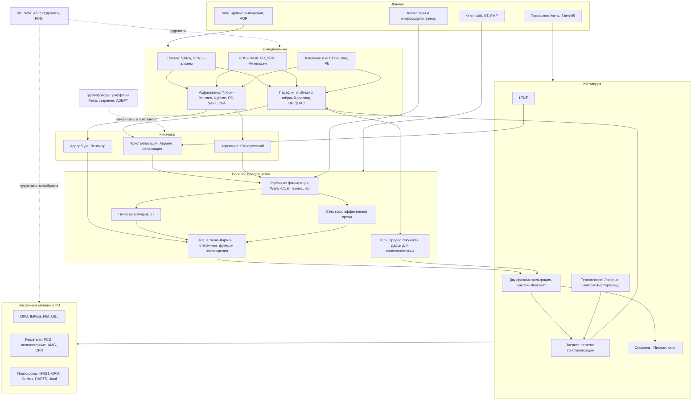

# Приложение D. Карта связей направлений

**Как читать.** Сплошные стрелки — прямые зависимости в модели: равновесие задаёт движущую силу кинетики, кинетика — удержание, удержание через модель пор — проницаемость, проницаемость — течение и температуру, температура — снова равновесие. Это петля обратной связи, отличающая сопряжённые модели. Пунктир — заимствование из смежных областей: трубная теория даёт механизмы и константы, ML — суррогаты. Данные (нижний блок) калибруют отдельные уровни: термодинамику — WAT и кривые выпадения, поровый уровень — керн с КТ и ЯМР, вынос — капилляры и микромодели, континуум — промысел. Наименее заполненные связи (кандидаты в пробелы): «LTNE → кристаллизация на стенке», «промысел → континуум», «керн с КТ → сеть горл».
