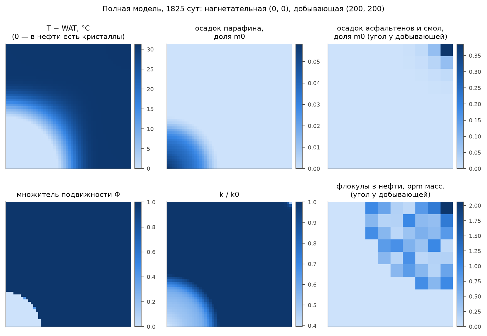
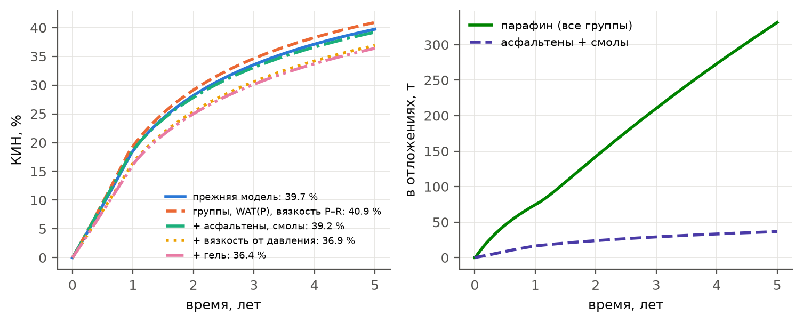

Постановка — элемент заводнения, как в `start.py`: пласт 200 x 200 x 10 м, сетка 50 x 50. Нагнетательная
скважина в углу (0, 0) закачивает воду при 20 °C и забойном давлении 17 МПа, добывающая в углу (200, 200)
работает при 7 МПа. Начальное давление 12 МПа, начальная температура 70 °C. Давление насыщения 9.5 МПа
(Узень XIII), давление начала осаждения асфальтенов 11 МПа (демонстрационное): у добывающей скважины давление
проходит оба порога. Состав — нефть Жетыбая (раздел 2). Расчет на 5 лет (`python demo_composition.py`)
выполнен в пяти вариантах: к прежней модели механизмы добавляются по одному, и разность соседних строк
табл. 2 — вклад одного механизма.

Таблица 2. Результаты на конец расчета: КИН и его изменение относительно предыдущей строки, закачано воды,
наибольший осадок парафина (доля начального порового объема), проницаемость у нагнетательной и у добывающей
скважин.

| Вариант | КИН, % | ΔКИН, п.п. | закачано, тыс. м³ | осадок парафина, % m0 | k/k0 нагнет. | k/k0 добыв. |
|---|---|---|---|---|---|---|
| прежняя модель | 39.7 |  | 148 | 7.5 | 0.32 | 1.00 |
| группы, WAT(P), вязкость P–R | 40.9 | +1.2 | 170 | 5.5 | 0.41 | 1.00 |
| + асфальтены, смолы | 39.2 | -1.7 | 140 | 5.5 | 0.41 | 0.44 |
| + вязкость от давления | 36.9 | -2.3 | 127 | 5.7 | 0.40 | 0.45 |
| + гель | 36.4 | -0.5 | 120 | 5.8 | 0.40 | 0.48 |

Карты полной модели на конец расчета — рис. 8, КИН и отложения во времени — рис. 9.

- **Группы парафина, WAT(P), вязкость P–R** (+1.2 п.п.). Прежняя модель
  описывает дегазированную нефть, а в пласте нефть живая: растворенный газ разбавляет раствор. При
  20 °C и 12 МПа выпадает 11.4 % масс. парафина против 16.2 % у дегазированной
  нефти. Осадок у нагнетательной скважины меньше, ее приемистость выше, КИН растет.
- **Асфальтены и смолы** (-1.7 п.п.). Флокулы образуются там, где давление
  опускается к давлению насыщения, — в окрестности добывающей скважины (наименьшее давление в пласте
  9.4 МПа). Они оседают почти сразу, как образовались (осаждение ограничено подводом), поэтому их доля
  в нефти не превышает 2.1e-04 % масс. Зато осадок асфальтенов со смолами
  копится в ячейке скважины: в полной модели это 39 % начального порового объема.
  Это классическое повреждение призабойной зоны асфальтенами при снижении давления. Всего в осадке
  37 т асфальтенов и смол.
- **Вязкость от давления** (-2.3 п.п.). Множитель Баруса при 12 МПа —
  1.20. Это оценка сверху: снижение вязкости растворенным газом не учтено (раздел 12).
- **Гель** (-0.5 п.п.). Множитель подвижности Φ < 0.5 на
  6 % площади — в остывшей и закольматированной зоне у нагнетательной
  скважины. Там нефть почти неподвижна (подвижность ограничена снизу долей 0.05 от пластической),
  и вода ее обходит. Вклад геля в КИН мал: неподвижная нефть заперта в зоне, которую вода уже прошла.
  Предел текучести в поре взят объемным (`gel_tau_mult` = 1): так его подтверждает керн той же нефти
  (`docs/валидация_АСПО.docx`, раздел 5). Для легких нефтей он в десятки раз меньше.

WAT в полной модели. В начале расчета WAT составляет 38.7–40.0 °C: при 12 МПа
поправка Пойнтинга не перекрывает понижения растворенным газом (рис. 4), и WAT ниже, чем у дегазированной нефти
(45.3 °C). К концу расчета WAT лежит в пределах 20.0–39.1 °C. Минимум — в холодной зоне у
нагнетательной скважины: там тяжелые группы выпали и осели, а оставшаяся нефть насыщена при местной
температуре, так что ее WAT совпадает с температурой пласта.

Состав осадка. Всего осело 331 т парафина, по группам C17–22 / C23–30 / C31–40 / C41–60 —
1 / 24 / 31 / 45 %. Больше всего оседает тяжелых парафинов и восков, а мягкие
парафины при 20 °C почти целиком остаются в растворе.

Рис. 8. Полная модель на конец расчета: превышение температуры над местной WAT (ноль — в нефти есть
кристаллы); осадок парафина (доля начального порового объема); множитель подвижности геля Φ; проницаемость
k/k0. Осадок асфальтенов со смолами и флокулы в нефти сосредоточены у добывающей скважины и показаны для
угла 40 x 40 м.

Рис. 9. КИН пяти вариантов (слева) и масса отложений в пласте в полной модели (справа).
