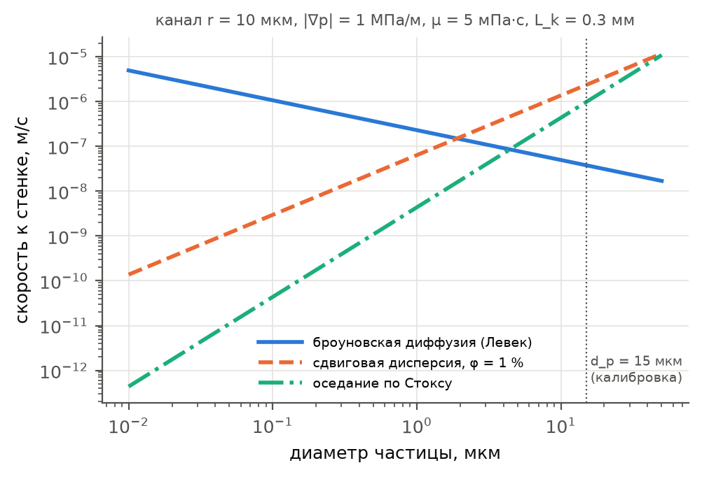
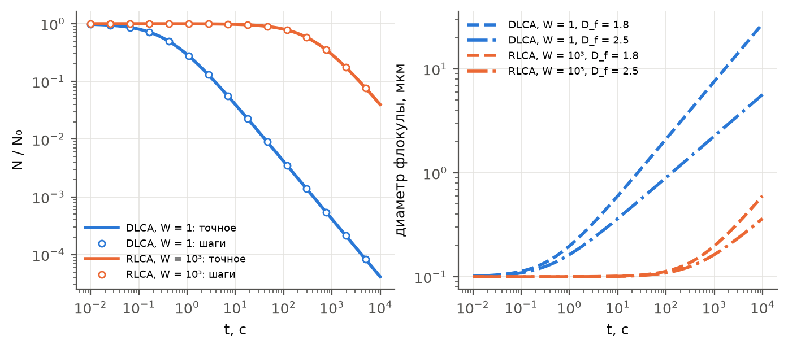
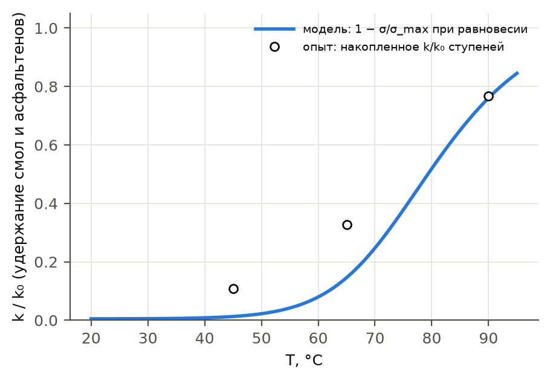
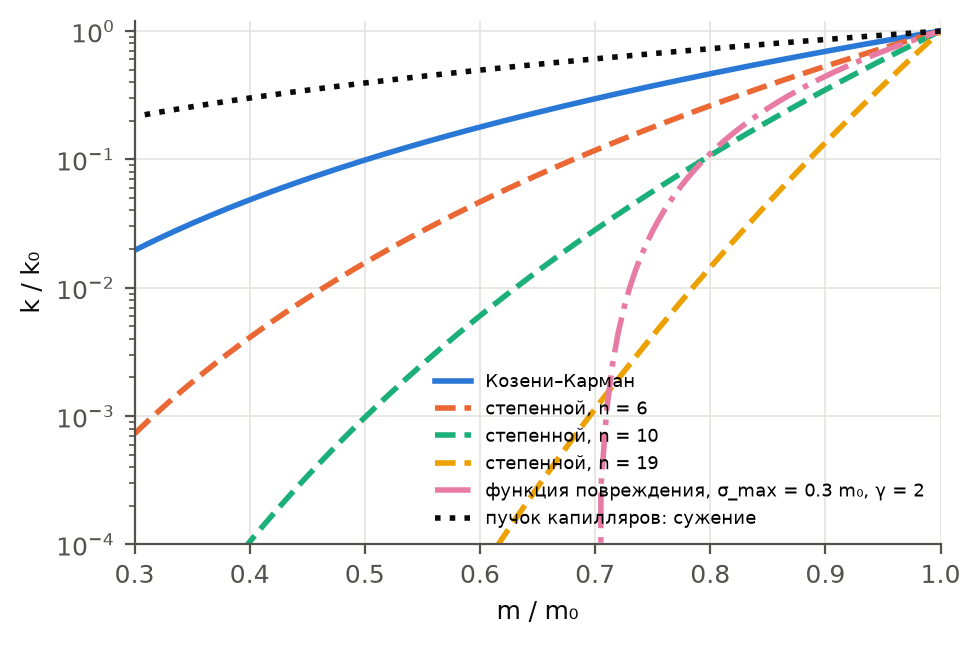
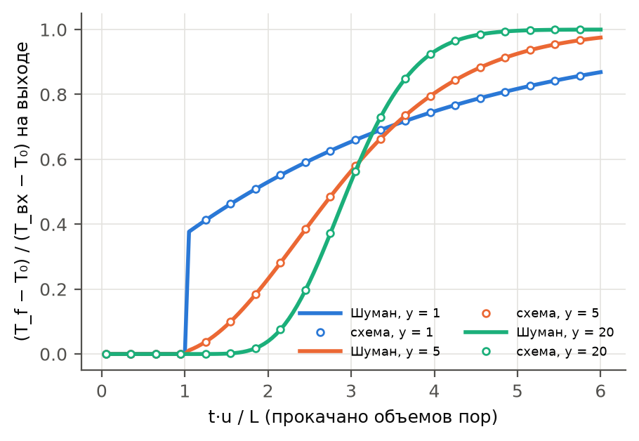
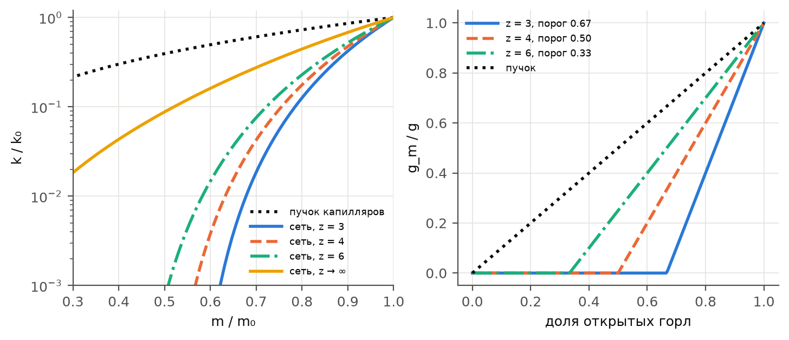

Разделы 2–7 описывают, **сколько** твердой фазы образуется (равновесие) и как отложения меняют пористость, проницаемость и подвижность нефти. Здесь описано, **с какой скоростью и где** выпавшее оседает. Это кинетическая часть модели по обзору (`твт_статья_АСПО/материалы/full_review.pdf`, разд. 2, 3.6, 4, 5.4). Каждый механизм включается своим флагом в `paraphin/constants.py`; по умолчанию все выключены. Любой из флагов переводит расчет кольматации на ядро `paraphin/equations/Deposition.py`. Числовые параметры механизмов — начальные значения runtime-вектора `solver.kin` (`paraphin/kinetics_params.py`): калибровка по опытам меняет его без перекомпиляции.

| Флаг | Механизм | Источник | Формулы |
|---|---|---|---|
| `wax_kinetics` | конечная скорость кристаллизации в объеме и на стенках пор | Huang et al., 2011 | (39)–(41) |
| `wall_transport` | перенос частиц к стенке: сдвиговая дисперсия, гравитационное оседание | Burger et al., 1981; Leighton, Acrivos, 1987 | (42)–(44) |
| `entrainment` | вынос отложений потоком | Gruesbeck, Collins, 1982; Wang, Civan, 2001 | (45) |
| `asph_aggregation` | агрегация флокул, закупорка горл флокулами | Смолуховский; Maqbool et al., 2009 | (46)–(48) |
| `snowball` | «снежный ком» | Onaka, Sato, 2021 | (49) |
| `adsorption` | адсорбция и удержание асфальтенов и смол в горлах | Ленгмюр; Civan, 2015 | (50)–(51) |
| `wettability` | смена смачиваемости | Qin et al., 2000 | (52) |
| `deposit_aging` | отложение — гель с захваченной нефтью, старение встречной диффузией | Singh et al., 2000 | (53)–(54) |
| `deposition_model = 'filtration'` | континуальная глубинная фильтрация и корреляции k(φ, σ) | Civan, 2015; Krauss, Mays, 2013 | (55)–(56) |
| `thermal_nonequilibrium` | локальное тепловое неравновесие и диффузия по Фику к холодной породе | Wakao, Kaguei, 1982 | (57)–(59) |
| — | скин-фактор скважины | Hawkins, 1956 | (60) |
| `pore_network` | сеть пор и горл: проводимость по эффективной среде | Fatt, 1956; Kirkpatrick, 1973 | (61)–(63) |

## 13.1. Одна схема для всех механизмов

В модели пучка капилляров (разд. 6) все механизмы сводятся к двум величинам для каждого радиуса r:

- скорости изменения радиуса капилляра u(r) — сужение (u < 0) или вынос (u > 0);
- коэффициенту блокирования b(r).

Функция пор переносится по оси радиусов той же неявной схемой против потока, что и в базовой модели:

$$\frac{\partial \varphi}{\partial t} + \frac{\partial (u\,\varphi)}{\partial r} = -b(r)\,\varphi, \qquad u = \sum_x \lambda_x u_x(r), \quad b = \sum_x \lambda_x b_x(r), \qquad (38a)$$

где $x$ — механизм, а $\lambda_x \le 1$ — ограничитель подводом. За шаг не может осесть больше частиц, чем останется в ячейке после оттока нефти через грани и скважину: $(m S_o - \Delta t\,Q_{out}/V)\,w_x$.

Убыль проводящих каналов за шаг делится между механизмами пропорционально их оценкам до прогонки. Вынос берется явно. Поэтому сумма скоростей потери порового объема по чистым материалам совпадает с изменением пористости:

$$(q_{p1} + q_{p2} + q_{pa} + q_w + q_g + q_{ada} + q_{adr})\,\Delta t = m - m^{new}. \qquad (38b)$$

Здесь:

- $q_{p1}$, $q_{p2}$ — осадок и пробки парафина;
- $q_{pa}$ — осадок асфальтенов со смолами;
- $q_w$ — стеночная кристаллизация;
- $q_g$ — старение;
- $q_{ada}$, $q_{adr}$ — адсорбция асфальтенов и смол.

На тождество (38b) опираются уравнения насыщенности, переноса компонентов и энергии, поэтому масса каждого компонента сохраняется до округления.

Скорости переноса в кинетическом ядре считаются по текущему слою. В прежних ядрах они брались с прошлого шага, и запаздывание вместе с ограничителем подводом давало колебания доли флокул (разд. 12, п. 8).

## 13.2. Кинетика кристаллизации (флаг `wax_kinetics`)

Равновесная модель (разд. 3) предполагает, что пересыщение снимается мгновенно. Huang et al. (2011) показали, что обе предельные модели ошибаются: одна вообще не учитывает кристаллизации в потоке, другая предполагает мгновенную растворимость. Первая недооценивает толщину отложений, вторая переоценивает. Точный прогноз дает учет конечной скорости кристаллизации в объеме нефти, конкурирующей с отложением на стенке.

В модели взвешенные кристаллы каждой группы $w_{s,k}$ — отдельная переносимая величина, релаксирующая к равновесной взвеси $w_{s,k}^{eq}$ из (6):

$$\frac{d w_{s,k}}{dt} = k_{cr}\,(w_{s,k}^{eq} - w_{s,k}) \quad (w_{s,k} < w_{s,k}^{eq}), \qquad \frac{d w_{s,k}}{dt} = k_{diss}\,(w_{s,k}^{eq} - w_{s,k}) \quad (w_{s,k} > w_{s,k}^{eq}). \qquad (39)$$

Пересыщение $\Delta_k = w_{s,k}^{eq} - w_{s,k} > 0$ — растворенный парафин сверх предела растворимости. Оно расходуется двумя параллельными путями первого порядка: рост кристаллов в объеме ($k_{cr}$) и кристаллизация прямо на стенках пор ($k_w$). За шаг на стенки уходит

$$\Delta_k^{wall} = \frac{k_w}{k_w + k_{cr}}\left(1 - e^{-(k_w + k_{cr})\Delta t}\right)\Delta_k. \qquad (40)$$

Кристаллизация на стенках сужает все проводящие каналы одинаково. Объем кристаллов за единицу времени $q_w = m S_o \rho_o \sum_k \Delta_k^{wall}/(\rho_p \Delta t)$ распределяется по удельной поверхности каналов $a = 2 m_0 \int r\varphi\,dr / \int r^2\varphi_0\,dr$:

$$u_w = -\frac{q_w}{a}. \qquad (41)$$

Это принципиальное отличие от захвата взвеси: частицы размера $d_p$ затыкают узкие каналы ($r < d_p/2\gamma$) и оседают в широких, то есть сортируют поры по размеру. Кристаллизация на стенках от размера пор не зависит. Томография Sandyga et al. (2020) показала, что при охлаждении керна все классы пор потеряли 76–87 % объема. Такое равномерное повреждение — признак стеночной кристаллизации (`experiments/`).

Равновесный предел: при $k_{cr} \to \infty$, $k_w = 0$ получается модель разд. 3. Скрытая теплота выделяется при любом уходе растворенного парафина — в объем или на стенку. Носитель $H_l$ (разд. 8) считается по фактически растворенному парафину.

## 13.3. Перенос частиц к стенке (флаг `wall_transport`)

Burger et al. (1981) выделили механизмы переноса частиц воска к стенке: молекулярную диффузию, сдвиговую дисперсию и броуновскую диффузию. Позже к ним добавили гравитационное оседание (обзор 2.2).

Базовая модель считает скорость осаждения частиц в широком капилляре по решению Левека для ламинарного течения с броуновской диффузией:

$$u_x(r) = -S_o^* w_x \left[\left(\frac{2 u_m D_x^2}{r L_k}\right)^{1/3} + \varepsilon_g u_s\right], \qquad u_m = \frac{|\nabla p|\,r^2}{8 \eta \mu}. \qquad (42)$$

Коэффициент переноса частиц — сумма броуновской диффузии (Стокс–Эйнштейн) и сдвиговой дисперсии (Leighton, Acrivos, 1987; Eckstein et al., 1977):

$$D_x = \frac{k_B T}{3\pi\mu d_x} + c_{sh}\,\phi_x^2\,\dot\gamma_w\,a_x^2, \qquad \dot\gamma_w = \frac{4 u_m}{r}. \qquad (43)$$

Гравитационное оседание — скорость Стокса:

$$u_s = \frac{2 a_x^2 |\rho_x - \rho_o|\,g}{9\mu}. \qquad (44)$$

Поток на стенку горизонтального капилляра — $c\,u_s/\pi$. Для изотропно ориентированного пучка среднее $\sin\theta = \pi/4$, отсюда $\varepsilon_g = 1/4$. Сдвиговая дисперсия существенна только при заметной объемной доле частиц. Гравитационное оседание крупных кристаллов (15 мкм, $\Delta\rho = 260$ кг/м³) дает скорость порядка $10^{-5}$ м/с и при медленном течении превосходит броуновский перенос на порядки. Это проверяется на керновых опытах.

Рис. 13.1. Скорость переноса частиц к стенке канала радиуса 10 мкм по формулам (42)–(44) (`docs/make_kinetics_figures.py`). Броуновская диффузия доминирует для частиц мельче 1–2 мкм, сдвиговая дисперсия и оседание — для крупных кристаллов. У калиброванного размера $d_p$ = 15 мкм оседание и сдвиговая дисперсия дают перенос в 25–60 раз быстрее броуновского.

## 13.4. Вынос отложений (флаг `entrainment`)

Отложения — мягкий гель, и поток сдирает его, когда касательное напряжение на стенке превышает предел прочности. Баланс толщины отложения (обзор 2.2.5; Gruesbeck, Collins, 1982; Wang, Civan, 2001):

$$\frac{dh}{dt}\bigg|_{ent} = -k_e\left(\frac{\tau_w}{\tau_{cr}} - 1\right)_+ h, \qquad \tau_w = \frac{r\,|\nabla p|}{2\eta}. \qquad (45)$$

Вынесенный осадок возвращается в нефть в своем составе: парафин — во взвесь, асфальтены и смолы — во флокулы. Толщина отложения в капилляре $h(r)$ копится как $-\int u\,dt$. Совместно с осаждением вынос дает стационарное плато $k/k_0$. Такое плато наблюдается в опытах Sutton, Roberts (1974) и Li et al. (2024) при 45–90 °C, а у упрощенной модели его не было.

## 13.5. Агрегация асфальтенов и закупорка горл флокулами (флаг `asph_aggregation`)

Выпадающие асфальтены — первичные частицы размера $d_0 \sim 0.1$ мкм. Они растут агрегацией до микрон за минуты и часы (Maqbool et al., 2009); рост определяется режимом столкновений (обзор 2.3.3, 5.2).

Число флокул в единице объема нефти $N$ переносится с нефтью. Оно меняется по уравнению Смолуховского с броуновским ядром:

$$\frac{dN}{dt} = -\frac{K}{2}N^2 + \frac{\dot w_{af}^+ \rho_o}{m_0}, \qquad K = \frac{8 k_B T}{3\mu W}, \qquad N(t + \Delta t) = \frac{N}{1 + K N \Delta t/2}. \qquad (46)$$

Коэффициент устойчивости Фукса $W = 1$ соответствует диффузионно-лимитированной агрегации (DLCA), $W \gg 1$ — реакционно-лимитированной (RLCA). Размер флокулы — из массы фрактального агрегата:

$$d_f = d_0\left(\frac{w_{af}\rho_o}{N m_0}\right)^{1/D_f}, \qquad m_0 = \rho_a\frac{\pi d_0^3}{6}. \qquad (47)$$

Здесь $D_f = 1.8$–$2.1$. Флокула диаметра $d_f$ проходит горло радиуса $\gamma r$ только при $r \ge d_f/2\gamma$, а более узкие каналы затыкает. Коэффициент блокирования и объем пробки такие же, как у кристаллов парафина (разд. 6):

$$b_a(r) = S_o^* w_{af}\,\frac{6\beta}{d_f^3}\,u_m r^2, \qquad V_{plug} = \frac{\pi d_f^3}{6}. \qquad (48)$$

Без агрегации флокулы имели постоянный размер `D_asph` и только сужали каналы (разд. 12, п. 4).

Рис. 13.2. Агрегация асфальтенов при объемной доле 0.1 % и 70 °C. Слева — число флокул: шаги схемы (46) совпадают с точным решением $N_0/(1 + K N_0 t/2)$ при любом шаге. Справа — диаметр фрактальной флокулы (47). При DLCA флокулы вырастают до микрон за минуты, при RLCA ($W = 10^3$) — за часы, как в опытах Maqbool et al. (2009).

## 13.6. «Снежный ком» (флаг `snowball`)

Опыты на стеклянных микромоделях показали, что осевшая частица асфальтена становится центром захвата следующих. Закупорка горла идет с ускорением (Onaka, Sato, 2021). В модели коэффициенты захвата (сужение и блокирование) растут с долей потерянного порового объема:

$$u_x, b_x \;\to\; u_x, b_x \left(1 + a_s\,\frac{m_0 - m}{m_0}\right). \qquad (49)$$

## 13.7. Адсорбция и удержание асфальтенов и смол (флаг `adsorption`)

Растворенные асфальтены и смолы адсорбируются на минеральной поверхности, на песчаниках — единицы мг/м² (Dubey, Waxman, 1991). Вместе с ними в горлах пор механически удерживаются агрегаты. Кинетика — линейная движущая сила к изотерме Ленгмюра, константа — по Вант-Гоффу:

$$\frac{d\Gamma}{dt} = k_{ads}\,(\Gamma_{eq} - \Gamma), \qquad \Gamma_{eq} = \Gamma_{max}\frac{K c}{1 + K c}, \qquad K(T) = K_{ref}\exp\left[-\frac{\Delta H_{ads}}{R}\left(\frac{1}{T} - \frac{1}{T_{ref}}\right)\right]. \qquad (50)$$

$\Gamma_{max} = \Gamma_s a_0$ пропорциональна удельной поверхности породы $a_0 = 2m_0\int r\varphi_0\,dr/\int r^2\varphi_0\,dr$ (`paraphin.surf_0`), а адсорбция экзотермична ($\Delta H_{ads} < 0$). Емкость берется по исходной поверхности, а не по поверхности текущих проводящих каналов: ее измеряют на единицу массы породы, и адсорбированное в канале, который потом заткнул парафин, остается на месте. Пока емкость считалась по проводящим каналам, она падала вместе с закупоркой парафином, смолы десорбировались, и на ступени 45 °C опыта Li et al. (2024) проницаемость к концу ступени росла (СКО 0.30 вместо 0.06 после исправления).

Скорость $k_{ads}$ — массообмен к стенке (линейная движущая сила Глюкауфа), $k_{ads} \sim D_m/\delta^2$. Коэффициент молекулярной диффузии по Уилки–Чангу $D_m \sim T/\mu$, поэтому

$$k_{ads}(T) = k_{ads,ref}\,\frac{T}{T_{ref}}\,\frac{\mu(T_{ref})}{\mu(T)} = k_{ads,ref}\,\frac{T}{T_{ref}}\exp\left[\frac{E_\mu}{R}\left(\frac{1}{T_{ref}} - \frac{1}{T}\right)\right], \qquad (50а)$$

где $E_\mu$ — энергия активации вязкого течения жидкой основы нефти (`E_activation`). В нефти Жетыбая ($E_\mu$ = 21.3 кДж/моль) скорость от 90 до 45 °C падает в 3.1 раза. В опыте Li et al. это видно: на 90 °C плато достигается за 1.5 PV, на 45 °C — за 2.3 PV при меньшем приросте удержания.

Уравнение (50) — линейная движущая сила со стороны твердой фазы: скорость пропорциональна недобору до равновесия, и удержание подходит к насыщению экспоненциально. Если лимитирует массообмен со стороны нефти (пленка у стенки), движущая сила — пересыщение раствора относительно равновесной концентрации при текущем удержании $c^*(\Gamma)$ — обратной изотермы Ленгмюра:

$$\frac{d\Gamma}{dt} = k_{ads}\,m S_o \rho_o\,\bigl(c - c^*(\Gamma)\bigr), \qquad c^*(\Gamma) = \frac{\Gamma}{K(\Gamma_{max} - \Gamma)}. \qquad (50б)$$

При линейной изотерме ($Kc \ll 1$) формы (50) и (50б) совпадают. При выпуклой ($Kc \gg 1$) они различаются качественно: $c^*$ остается малой почти до насыщения, поэтому удержание по (50б) идет с постоянной скоростью и резко останавливается. Выбор формы — runtime-параметр `ads_film` (0 — (50), 1 — (50б)). Уравнение (50б) жесткое при большой $K$ и интегрируется неявным Эйлером: $\Gamma^{n+1}$ — меньший корень квадратного уравнения, он всегда лежит в $[0, \Gamma_{max})$ (`Kinetics_math.langmuir_film_step`).

В опыте Li et al. (2024) различие между формами видно прямо. На ступенях 65 и 45 °C подобранная изотерма выпуклая ($Kc$ = 2–20), и проницаемость падает почти линейно, а к 2.2 PV резко выходит на плато. На ступени 90 °C изотерма линейная ($Kc \approx 0.15$), и подход к плато экспоненциальный. Сравнение форм — в `experiments/сравнение_с_опытами.md`.

**Шаг по времени.** Уравнение (50) интегрируется неявно по концентрации в нефти ячейки:

$$\Delta\Gamma = f\,\bigl[\Gamma_{eq}(c - \Delta\Gamma/a) - \Gamma\bigr], \qquad f = 1 - e^{-k_{ads}\Delta t}, \qquad (50в)$$

где $a$ — масса нефти, оставшейся в ячейке после оттока за шаг (на единицу объема породы). Это квадратное уравнение
относительно $x = c - \Delta\Gamma/a$ с одним положительным корнем (`Kinetics_math.langmuir_ldf_step`). При малом
$f\,\Gamma_{max}K/a$ шаг совпадает с явным, при $f = 1$ — равновесие закрытой ячейки. Явная запись
$\Delta\Gamma = f(\Gamma_{eq}(c) - \Gamma)$ годилась для керна, где нефть течет непрерывно, но в заводненной зоне
пласта остаточной нефти мало ($a c \ll \Gamma_{max}$). Там явный шаг выбирал всю растворенную фракцию, на
следующем шаге при $c = 0$ десорбировал, и шаги колебались — с шахматным узором проницаемости и выбросами $k/k_0$
выше 1. Неявный шаг не пересекает равновесия закрытой ячейки и не делает концентрацию отрицательной, поэтому
отдельный ограничитель подводом ему не нужен. В опытах Li et al. смена схемы меняет СКО ступеней меньше чем
на $10^{-4}$. Пленочная форма (50б) сохранила явное $c$ и ограничитель подводом.

**Начальное удержание в пласте.** Керн в опыте чистый, а в пласте нефть и порода в контакте геологическое время:
$k_0$ пласта измерена уже с удержанным слоем. Флаг `ads_init_equilibrium` задает начальное удержание равновесным
при $T_0$ (изотерма (50) с концентрациями начальной нефти), и повреждение (51) отсчитывается от него:
$k \propto D(\sigma)/D(\sigma_0)$. Пористость начальным удержанием не уменьшается, тождество (38б) выполняется
для прироста $\Gamma - \Gamma_0$.

Рис. 13.3. Равновесное удержание смол и асфальтенов от температуры — изотерма (50) при параметрах, подобранных по ступенчатому опыту Li et al. (2024) (`experiments/li2024.py`), и накопленная проницаемость ступеней опыта. Удержание растет при охлаждении. При 65 и 45 °C равновесие лежит ниже плато опыта: за 5 PV ступени удержание до равновесия не доходит, его ограничивают подвод асфальтенов и смол и кинетика. Поэтому параметры подбираются прогонами всего протокола, а не по равновесным плато: такой подбор дает при 65 и 45 °C СКО 0.25 и 0.16 вместо 0.03 и 0.04.

Где сидит удержанное, решает баланс массы. Равномерный слой на стенках всех каналов дает потерю проводимости, пропорциональную потере порового объема. В опыте Li et al. (2024) проницаемость керна выше WAT падает до 0.33, и для этого слоем пришлось бы удержать около 80 кг асфальтенов и смол на 1 м³ породы, тогда как за 2.4 PV их подводится не более 23 кг/м³. Поэтому удержанное сидит в горлах: малый объем дает большую потерю проводимости — структурный эффект обзора (разд. 4.1). В модели пучка проводимость умножается на функцию повреждения Civan (2015) по объему удержанного, а поровый объем уменьшается на этот объем:

$$k = k_{bundle}(\varphi)\left(1 - \beta\frac{\sigma_{ret}}{\sigma_{max} m_0}\right)^{\gamma_d}, \qquad \sigma_{ret} = \frac{\Gamma_a + \Gamma_r}{\rho_{ad}}. \qquad (51)$$

Смолы удерживаются с предельной емкостью, пропорциональной асфальтеновой (`ads_resin`). Мономолекулярная адсорбция (несколько мг/м²) дает повреждение на порядки меньше наблюдаемого. Подобранная по опыту емкость $\Gamma_s$ — это удержание агрегатов, а не монослой; в `experiments/` это видно по величинам.

## 13.8. Смена смачиваемости (флаг `wettability`)

Адсорбированные асфальтены делают поверхность нефтесмачиваемой. Qin et al. (2000) показали, что учет изменения относительных проницаемостей из-за осевшего асфальтена меняет прогноз продуктивности кардинально (обзор 5.5). ОФП интерполируются между водосмачиваемым (базовая модель) и нефтесмачиваемым наборами по доле покрытия поверхности:

$$k_{r\alpha} = (1 - \omega)\,k_{r\alpha}^{ww}(S) + \omega\,k_{r\alpha}^{ow}(S), \qquad \omega = \min\left(\frac{\Gamma_a}{\Gamma_{max}}, 1\right). \qquad (52)$$

Нефтесмачиваемый набор имеет меньшую связанную воду и меньшую остаточную нефть, вода в нем подвижнее. Опытов для проверки в репозитории нет — только предельные случаи.

## 13.9. Гель-отложение и его старение (флаг `deposit_aging`)

Отложение парафина — не сплошной кристалл, а гель: трехмерная сетка кристаллов, в которой захвачена нефть. После образования молекулы воска продолжают диффундировать в гель, и доля твердого в нем растет. Это старение встречной диффузией с критическим углеродным числом (Singh et al., 2000; обзор 2.4). Молодой гель содержит несколько процентов парафина, состарившийся — десятки.

В модели новое отложение — гель с долей парафина $C_0$. Сужение проводящих каналов идет по объему геля, то есть в $1/C_0$ раз быстрее, чем по объему кристаллов:

$$u_{gel}(r) = \frac{u_x(r)}{C_0}, \qquad \frac{dV_{gel}}{dt} = \frac{q_{p1} + q_w}{C_0}. \qquad (53)$$

Пористость $m$ теряет только объем кристаллов. Захваченная нефть остается в поровом пространстве неподвижной — как нефть блокированных каналов (разд. 6). Проводящая пористость $m_c = m_0\int r^2\varphi\,dr/\int r^2\varphi_0\,dr$ падает при этом много сильнее $m$. Именно ее видит томография, для которой гель в порах — отложение: у Sandyga et al. (2020) пористость упала с 9 % до 2.1 % при объеме кристаллов в несколько раз меньшем.

Старение — рост доли парафина в геле при постоянном объеме геля за счет растворенного парафина групп, насыщенных при местной температуре:

$$\frac{dC}{dt} = k_{age}\,(C_{max} - C), \qquad C = \frac{M_{wax}}{\rho_p V_{gel}}. \qquad (54)$$

## 13.10. Глубинная фильтрация и корреляции проницаемости (`deposition_model = 'filtration'`)

Наряду с пучком капилляров в литературе стандартна континуальная модель с раздельными балансами взвешенной и осевшей фаз (Gruesbeck, Collins, 1982; Civan, 2015; обзор 3.6, 5.4). Масса отложений $\sigma$ в единице объема породы:

$$\frac{\partial\sigma}{\partial t} = k_d\,m S_o\,c + k_{pl}\,|u_o|\,c - k_e\,\sigma\,(|u_o| - u_{cr})_+, \qquad (55)$$

где:

- $c$ — масса взвеси (кристаллов или флокул) в 1 м³ нефти;
- $k_d$ — коэффициент поверхностного осаждения;
- $k_{pl}$ — коэффициент закупорки горл;
- $k_e$ — коэффициент выноса.

Пористость — за вычетом объема отложений. Проницаемость задается одной из корреляций (обзор 4.2):

$$\frac{k}{k_0} = \left(\frac{m}{m_0}\right)^3\left(\frac{1 - m_0}{1 - m}\right)^2, \quad \left(\frac{m}{m_0}\right)^n, \quad \left(1 - \beta\frac{\sigma}{\sigma_{max}}\right)^{\gamma_d}, \quad \frac{(m/m_0)^3((1 - m_0)/(1 - m))^2}{(1 + \alpha\sigma_v/m_0)^2}. \qquad (56)$$

Это Козени–Карман, степенная поправка Krauss, Mays (2013) с $n = 8$–$19$, функция повреждения Civan (2015) и Козени–Карман с ростом удельной поверхности отложениями. Модель глубинной фильтрации не требует распределения пор. Ее параметры подбираются по кривой $k/k_0$(PV) — так поступали Wang, Civan (2005) для опытов Sutton, Roberts.

Рис. 13.4. Корреляции проницаемости (56) и пучок капилляров при равномерном сужении всех каналов. Пучок дает самую пологую связь: у широких каналов проводимость теряется медленнее объема. Пары $(m/m_0, k/k_0)$ кернов He et al. (2020) ложатся на степенной закон с $n \approx 6$ (`experiments/he2020.py`), то есть ниже диапазона 8–19 из обзора.

## 13.11. Тепловое неравновесие и диффузия к холодной породе (флаг `thermal_nonequilibrium`)

У породы своя температура $T_s$, теплообмен с флюидами — с объемным коэффициентом по корреляции Wakao, Kaguei (1982):

$$C_f\frac{\partial T}{\partial t} = \ldots - h_v(T - T_s), \qquad C_s\frac{\partial T_s}{\partial t} = h_v(T - T_s), \qquad h_v = \frac{6(1 - m)}{d_g}\,\frac{\mathrm{Nu}\,\lambda_f}{d_g}, \quad \mathrm{Nu} = 2 + 1.1\,\mathrm{Re}^{0.6}\mathrm{Pr}^{1/3}. \qquad (57)$$

Обмен жесткий: время релаксации $C/h_v$ — доли секунды для зерен 0.1–1 мм. Поэтому он берется точным решением за шаг, сохраняющим энергию:

$$T_{eq} = \frac{C_f T + C_s T_s}{C_f + C_s}, \qquad (T - T_s)\big|_{t + \Delta t} = (T - T_s)\big|_t\,e^{-h_v(1/C_f + 1/C_s)\Delta t}. \qquad (58)$$

Если порода холоднее нефти, у стенки нефть пересыщена относительно равновесия при $T_s$, и растворенный парафин диффундирует к стенке по Фику (обзор 2.2.1). Коэффициент массоотдачи — по той же корреляции с числом Шервуда $\mathrm{Sh} = 2$ при малых числах Рейнольдса:

$$\dot w^{wall}_k = \frac{\mathrm{Sh}\,D_m}{d_g}\,\frac{6(1 - m)}{d_g}\,\frac{1}{m S_o}\left(w^{dis}_k - w^{dis}_k(T_s)\right)_+. \qquad (59)$$

Модель проверяется решением Шумана (Schumann, 1929). Оценка времени релаксации показывает, насколько оправдано допущение о тепловом равновесии (разд. 1, допущение 1): в пласте разность $T - T_s$ исчезает за доли секунды, и механизм (59) заметен только на фронте охлаждения при больших скоростях.

Рис. 13.5. Температура флюида на выходе из слоя: схема (перенос с числом Куранта 1 и точный обмен (58) за шаг) против решения Шумана для трех значений безразмерной длины слоя $y = h_v L/(C_f u)$. Расхождение — меньше $10^{-3}$ (`tests/test_kinetics_math.py`).

## 13.12. Скин-фактор скважины

В выгрузку скважин добавлен скин-фактор ячейки скважины по схеме Хокинса (обзор 4.3). Поврежденная зона — ячейка скважины с эквивалентным радиусом Писмана $r_e$:

$$S = \left(\frac{k_0}{k_{cell}} - 1\right)\ln\frac{r_e}{r_w}. \qquad (60)$$

## 13.13. Сеть пор и горл (флаг `pore_network`)

Пучок капилляров — самая простая модель порового пространства: параллельные независимые каналы. В ней закупоренный канал выпадает из проводимости целиком, а обходного пути у потока нет. Проводимость пучка — сумма проводимостей каналов, $k \sim \int r^4\varphi\,dr$. Fatt (1956) показал, что пучок не воспроизводит наблюдаемых свойств пород, и предложил сеть: поры — узлы, соединенные горлами. Сетевые модели и их динамические варианты, где радиусы горл меняются по мере отложения (Nikooey et al., 2015 — для асфальтенов), в обзорах считаются наиболее физичными для кольматации. Там же отмечено, что пучок почти не видит главного для отложений: закупорки в горлах, связности и перераспределения потока (`resources/всякие статьи/модели ПС/`).

В модели функция $\varphi(r)$ остается распределением пор по размерам, а сеть добавляет две вещи.

**Горла.** Проводимость дают горла, а не поры. Горло поры исходного радиуса $r_0$ имеет радиус $\gamma_t r_0$. Тот же слой отложения толщины $h$, который сужает пору до $r = r_0 - h$, сужает горло до

$$r_t = \gamma_t (r + h) - h, \qquad g(r) \sim r_t^4 \quad (r_t > 0). \qquad (61)$$

При $\gamma_t < 1$ слой закрывает горло раньше, чем заполняет пору: проводимость падает быстрее пористости. Толщина слоя $h(r)$ копится в ядре как $-\int u\,dt$ (разд. 13.4).

**Связность.** Горла соединены в сеть с координационным числом $z$. Закрытое горло (отложением или блокированием частицей) не выключает путь: поток обходит его по соседним горлам. Эффективная проводимость $g_m$ сети — по приближению эффективной среды (Kirkpatrick, 1973):

$$\sum_i w_i\,\frac{g_m - g_i}{g_i + (z/2 - 1)\,g_m} + \frac{w_b}{z/2 - 1} = 0, \qquad \frac{k}{k_0} = \frac{g_m}{g_m^0}. \qquad (62)$$

Здесь:

- $w_i = \varphi_i\,\Delta r_i$ — доля горл класса $i$ среди исходных;
- $w_b = 1 - \sum w_i$ — доля закрытых (блокированные каналы уходят из $\varphi$);
- $g_m^0$ — та же величина для исходной сети.

Для одинаковых горл, открытых с долей $p$, из (62) следует

$$g_m = g\,\frac{p - 2/z}{1 - 2/z}. \qquad (63)$$

Проводимость исчезает на пороге протекания $p_c = 2/z$, а не при закрытии всех каналов. При $z \to \infty$ сеть переходит в пучок: $g_m$ — среднее арифметическое. Корень (62) ищется бисекцией по $\lg g_m$: левая часть монотонна по $g_m$ (`Kinetics_math.ema_conductance`, тесты — `tests/test_kinetics_math.py`).

Параметры `net_z` и `net_gamma` runtime-параметры, как и остальные параметры кинетики. Для песчаников $z = 3$–$6$, отношение радиусов горла и поры 0.3–0.6. Отношение горла к поре — та же величина $\gamma$, что задает порог блокирования частицей $d_p/(2\gamma)$ (разд. 6), поэтому по умолчанию `net_gamma = gamma = 0.4`. Пористость и тождество (qp1 + qp2 + ...)$\,dt = m - m_{new}$ сеть не меняет: объем отложения считается по порам, как в пучке.

Проверка — пары $(m/m_0, k/k_0)$ четырех кернов He et al. (2020) после отложения парафина (`experiments/he2020.py`):

- пучок при сужении дает СКО $k/k_0$ 0.28;
- сеть с $z = 4$–$8$ и отношением горла к поре 0.40–0.49 дает 0.044–0.046;
- степенной закон с подобранным показателем $n = 5.7$ дает 0.039.

У сети подобрано одно число (отношение горла к поре), показателя нет. Лучшее значение при $z = 8$ — 0.40, ровно отношение, откалиброванное для блокирования по Sutton & Roberts.

Все потомки пучка из обзора (`resources/всякие статьи/модели ПС/`) сравниваются с теми же парами He et al. при одинаковом сужении слоем отложения (`experiments/pore_models.py`). СКО $k/k_0$:

| Модель | СКО $k/k_0$ | Подобрано |
|---|---|---|
| пучок капилляров | 0.281 | — |
| фрактальный пучок, $N(>r) \sim r^{-D_f}$ | 0.305 | $D_f$ (уходит на границу) |
| пучок с периодическими сужениями ($z \to \infty$) | 0.037 | горло 0.25 |
| сеть пор и горл, эффективная среда, $z = 6$ | 0.044 | горло 0.42 |
| стохастическая решетка $z = 6$ (прямой расчет) | 0.046 | — (горло то же) |
| степенной закон $(m/m_0)^n$ | 0.039 | $n = 5.7$ |

Итоги сравнения:

- **Фрактальное распределение не помогает.** Связь $k(m)$ при сужении определяют горла, а не ширина распределения пор.
- **Горла решают дело.** Модели с горлами — сужения в пучке или сеть — попадают в разброс опыта. Им хватает одного геометрического числа, а степенному закону нужен подобранный показатель.
- **Эффективная среда проверена прямым расчетом.** Проводимость сети по (62) совпадает с прямым расчетом случайной решетки $14^3$ (разреженная СЛАУ, три реализации) до 0.008 по $k/k_0$.
- **Пучок с сужениями не видит порога протекания.** Он близок к сети по $k(m)$, но закупорка частицами у него выключает канал целиком. Порог протекания есть только у сети, и он проявляется в опытах с блокированием (Sutton & Roberts, Sandyga).

Рис. 13.6. Связь проницаемости с пористостью при равномерном сужении: пучок капилляров и сеть пор и горл с горлами 0.4 от пор при разном координационном числе. Слева — связь $k(m)$, справа — проводимость сети одинаковых горл от доли открытых (63) с порогами протекания $2/z$.
