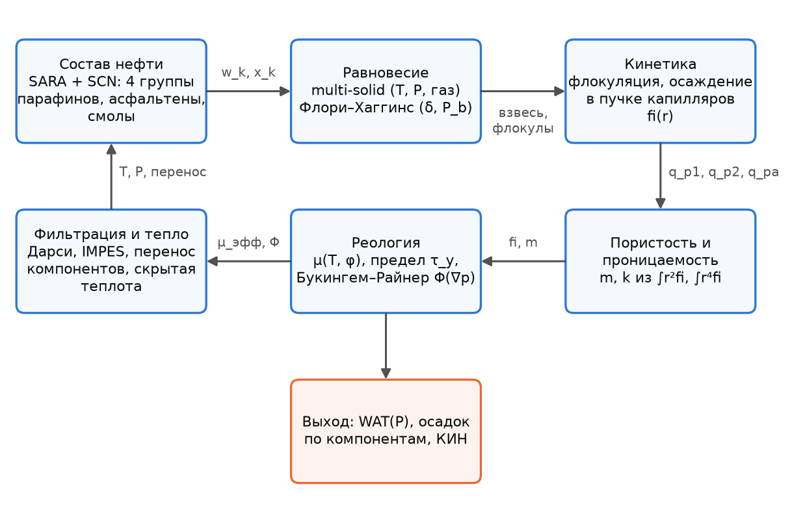
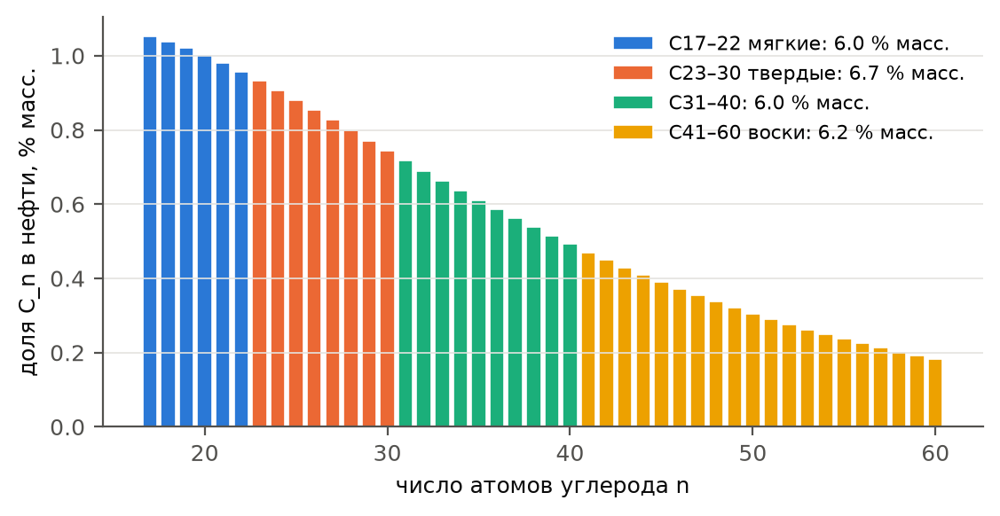
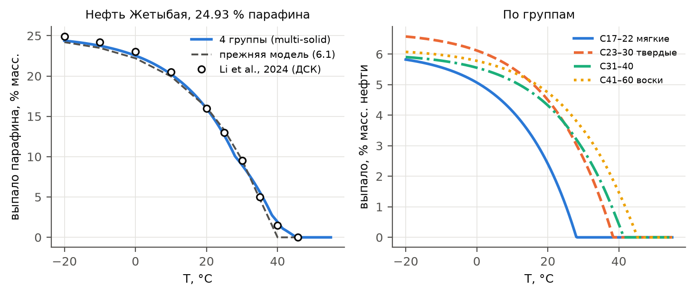
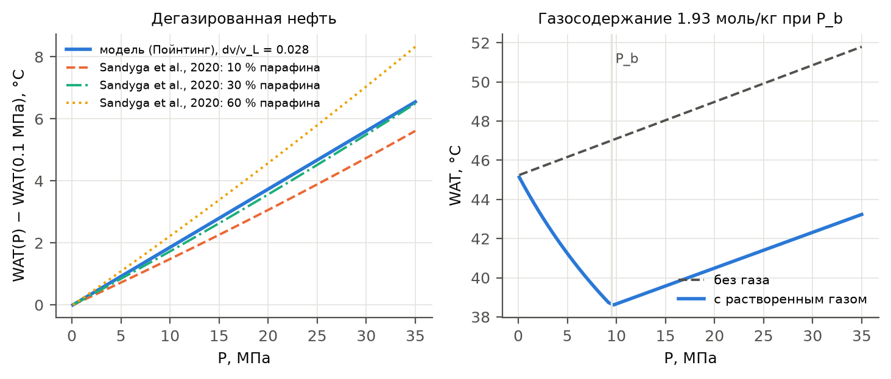
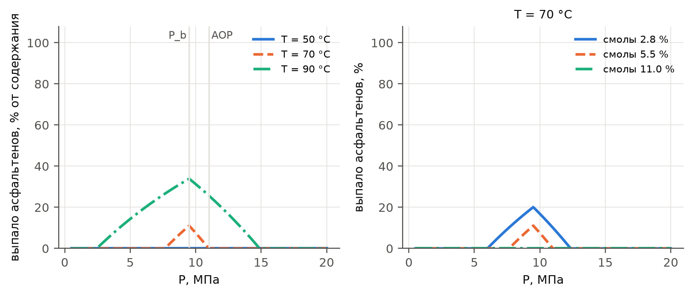
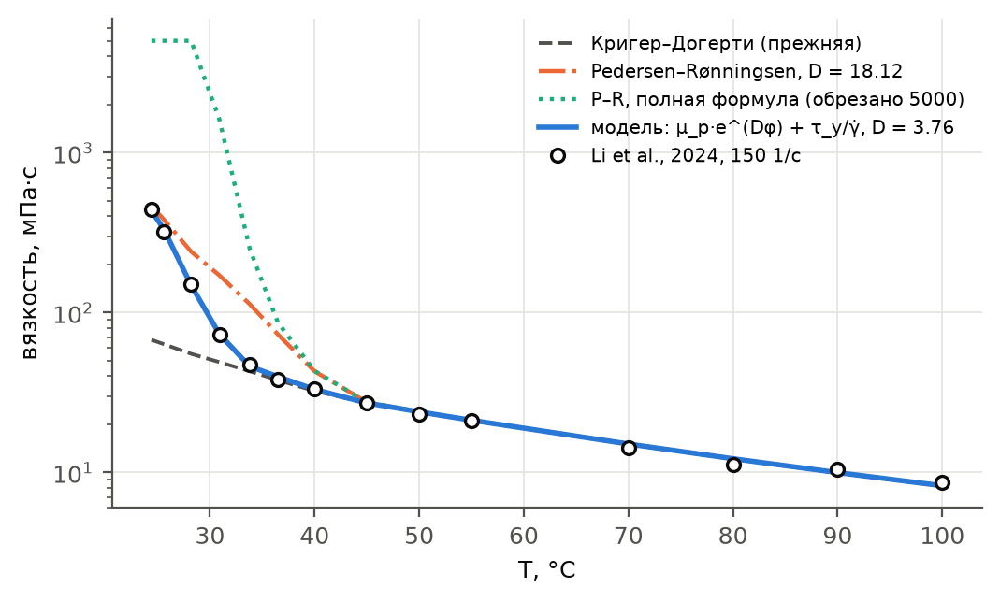
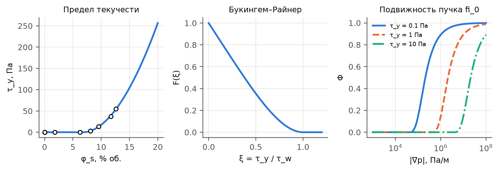

# МАТЕМАТИЧЕСКАЯ МОДЕЛЬ НЕИЗОТЕРМИЧЕСКОЙ ФИЛЬТРАЦИИ НЕФТИ С ДЕТАЛЬНЫМ УЧЕТОМ ПАРАФИНОВ, ВОСКОВ, АСФАЛЬТЕНОВ И СМОЛ

*Описание модели симулятора `paraphin` с флагами детального состава нефти. Документ собирается из `docs/модель_АСПО.md` командой `python docs/build_docx.py`; рисунки — `python docs/make_model_figures.py`, калибровка по опытам — `python experiments/calibrate.py`.*

# 1. НАЗНАЧЕНИЕ И ОБЩАЯ СХЕМА

Базовая модель симулятора описывает двухфазную (вода — нефть) неизотермическую фильтрацию при заводнении холодной водой. Парафин в ней представлен одним эффективным псевдокомпонентом, который находится в нефти в растворенном и взвешенном состоянии и оседает в порах. Пористая среда описана пучком капилляров с распределением по радиусам $\varphi(r)$; осаждение кристаллов сужает широкие капилляры и закупоривает узкие, а пористость и проницаемость пересчитываются из моментов $\int r^2 \varphi\,dr$ и $\int r^4 \varphi\,dr$ (постановка — статья `твт_статья/article.md`, уравнения (1)–(20)).

Модель расширена в соответствии с обзором «Математическое моделирование осаждения парафинов, асфальтенов и других тяжелых компонентов нефти при неизотермической фильтрации» (`твт_статья/full_review.pdf`). Добавлены пять механизмов, каждый включается своим флагом в `paraphin/constants.py`:

| Флаг | Механизм | Раздел |
|---|---|---|
| `wax_components` | состав нефти по SARA и SCN: четыре группы н-алканов (парафины и воски), асфальтены (растворенные и флокулы), смолы; перенос каждого компонента | 2, 5 |
| `wax_pressure` | влияние давления на равновесие парафина (поправка Пойнтинга) и растворенного газа | 3 |
| `asphaltenes` | растворимость асфальтенов по Флори–Хаггинсу, флокуляция, осаждение флокул в порах, соосаждение смол | 4, 6 |
| `gelation` | предел текучести геля и течение Букингема–Райнера в пучке капилляров | 7 |
| `wax_viscosity`, `pressure_viscosity` | вязкость суспензии кристаллов (Pedersen–Rønningsen), вязкость от давления (Барус) | 7 |

По умолчанию все флаги выключены, и расчет побитово совпадает с базовой моделью. Это проверяет тест `tests/test_regression_flags_off.py`.

Взаимосвязь блоков показана на рис. 1. Термодинамика по локальным $T$, $P$ и составу определяет долю выпавших кристаллов и флокул. Кинетика переводит их в отложения в капиллярах. Отложения меняют пористость и проницаемость, а гель — подвижность нефти. Это меняет поля скорости, давления и температуры, которые снова определяют равновесие.

Рис. 1. Схема связей блоков модели (обзор, разд. 4.3–4.4: обратная связь «осаждение — проницаемость — течение — условия осаждения»).

**Основные допущения:**

1. Фильтрация двухфазная (вода и нефтяная фаза), фазы несжимаемы, капиллярными и гравитационными силами пренебрегается (как в базовой модели).
2. Растворенный газ влияет только на термодинамику нефти: он разбавляет раствор парафина и понижает параметр растворимости мальтенов. Свободная газовая фаза в течении не отслеживается, поэтому при $P < P_b$ модель условна: газ из нефти уходит, но ее объем и подвижность не меняются. Для сценария поддержания пластового давления заводнением это допустимо.
3. Равновесие парафина мгновенное (кинетика кристаллизации быстрее переноса), асфальтенов — с конечной скоростью флокуляции.
4. Температура одна для породы и флюидов.
5. Массовые доли компонентов относятся к нефтяной фазе с одной плотностью $\rho_o$. Кристаллы, флокулы и отложения имеют свои плотности $\rho_p$, $\rho_{ad}$.

# 2. СОСТАВ НЕФТИ: SARA И SCN-ХАРАКТЕРИЗАЦИЯ

## 2.1. Компоненты нефтяной фазы

Нефть состоит из углеводородов нескольких структурных классов (обзор, разд. 1.2–1.3).

- **Насыщенные** углеводороды: н-алканы $C_nH_{2n+2}$ (кристаллизуются при охлаждении) и изо- и циклоалканы (растворитель).
- **Ароматические** углеводороды — растворитель. Они повышают параметр растворимости мальтенов и тем стабилизируют асфальтены.
- **Смолы** — полярные пептизаторы асфальтенов (Leontaritis, Mansoori, 1987).
- **Асфальтены** — коллоидная фракция: наноагрегаты и их кластеры, модель Йена–Маллинса (Mullins et al., 2012). Нерастворимы в легких н-алканах.

SARA-состав задает макроструктуру нефти, SCN-характеризация (single carbon number) — распределение н-алканов по числу атомов углерода (Katz, Firoozabadi, 1978; Whitson, 1983). В модели нефтяная фаза описывается массовыми долями $w_c$ компонентов:

| Индекс | Компонент | Состояния |
|---|---|---|
| $k = 1 \ldots N_w$ | группы н-алканов | растворенная $w_k^{d}$ и взвешенная $w_k^{s}$, $w_k = w_k^{d} + w_k^{s}$ |
| $a$ | асфальтены | растворенные $w_{ad}$ и флокулы $w_{af}$ |
| $r$ | смолы | растворены |
| — | остаток: ненормальные насыщенные и ароматика | растворитель |

Остаток $w_{rest} = 1 - \sum_k w_k - w_{ad} - w_{af} - w_r$ переносится как одно целое, доля насыщенных в нем постоянна: $f_{sat} = (S_0 - W_0)/(1 - W_0 - A_0 - R_0)$. Здесь $S_0$, $A_0$, $R_0$ — доли насыщенных, асфальтенов и смол по SARA, $W_0$ — содержание парафина.

По умолчанию взята нефть месторождения Жетыбай (Li et al., 2024): парафин $W_0 = 24.93$ %, смолы $R_0 = 5.52$ %, асфальтены $A_0 = 0.91$ %. Ароматика 28 % — оценка для парафинистых нефтей Мангышлака. Индекс коллоидной неустойчивости

$$CII = \frac{S + A}{Ar + R} = 1.98 \qquad (1)$$

больше 0.9, то есть асфальтены по SARA-составу потенциально неустойчивы (Yen, Yin, Asomaning, 2001). Нефть Узеня (Togasheva et al., 2026) отличается большим содержанием смол (до 21 %) и асфальтенов (до 3 %). Для нее меняются только `sara_*` в `constants.py`.

## 2.2. Распределение н-алканов и группы

Мольные доли н-алканов в плюс-фракции убывают экспоненциально (Pedersen et al., 1991):

$$z_n \propto e^{-s n}, \qquad M_n = 14.027 n + 2.016, \qquad w_n = W_0 \frac{z_n M_n}{\sum_{n'} z_{n'} M_{n'}}, \qquad n = 17 \ldots 60. \qquad (2)$$

Н-алканы укрупняются в $N_w = 4$ группы (Whitson, 1983) с разными кристаллическими свойствами:

| Группа | Число атомов C | Класс |
|---|---|---|
| 1 | 17–22 | мягкие парафины |
| 2 | 23–30 | твердые (макрокристаллические) парафины |
| 3 | 31–40 | тяжелые парафины |
| 4 | 41–60 | микрокристаллические воски (церезины) |

Доля группы, ее среднечисловая молярная масса, температура плавления и калориметрическая теплота плавления:

$$w_k = \sum_{n \in k} w_n, \qquad M_k = \frac{w_k}{\sum_{n \in k} w_n / M_n}, \qquad (3)$$

$$T_{m,k} = \frac{1}{w_k} \sum_{n \in k} w_n\, T_m^{Won}(M_n) + \Delta T_m, \qquad L_k = \frac{1}{w_k} \sum_{n \in k} w_n \frac{\Delta H^{Won}(M_n)}{M_n}, \qquad (4)$$

где по корреляциям Won (1986)

$$T_m^{Won} = 374.5 + 0.02617 M - \frac{20172}{M}\ \mathrm{[K]}, \qquad \Delta H^{Won} = 0.1426\, M\, T_m^{Won}\ \mathrm{[кал/моль]}. \qquad (5)$$

Корреляция (5) воспроизводит измеренные температуры плавления н-алканов C20, C30, C40 (Broadhurst, 1962) с точностью 1–2 °C (тест `test_won_correlation`).

Сдвиг $\Delta T_m$ и эффективная теплота $\Delta H_{eff}$ в законе растворимости (раздел 3) — эффективные параметры. Реальная нефть — неидеальный растворитель, и идеальный multi-solid с калориметрическими $\Delta H^{Won}$ дает WAT на 12 °C выше измеренной. Та же идея уже заложена в базовую модель: эффективная $T_m = 82.8$ °C против 62.9 °C по Won. Калориметрическая $L_k$ при этом идет в уравнение энергии (раздел 8).

Распределение и группы показаны на рис. 2, свойства групп — в табл. 1.

Рис. 2. SCN-распределение н-алканов нефти Жетыбая ($s = 0.07$) и группы.

Таблица 1. Свойства групп парафина (`python -m paraphin.oil_composition`).

| Группа | $w_k$, % масс. | $M_k$, г/моль | $T_m^{Won}$, °C | $T_{m,k}$ эфф., °C | $L_k$, кДж/кг | $\Delta v_k$, см³/моль |
|---|---|---|---|---|---|---|
| C17–22 | 6.06 | 272.7 | 34.5 | 87.0 | 183.7 | 9.89 |
| C23–30 | 6.73 | 368.6 | 56.3 | 108.7 | 196.7 | 13.37 |
| C31–40 | 6.03 | 491.9 | 73.2 | 125.7 | 206.8 | 17.85 |
| C41–60 | 6.18 | 678.8 | 89.4 | 142.0 | 216.6 | 24.63 |

# 3. РАВНОВЕСИЕ ПАРАФИНА: MULTI-SOLID, ДАВЛЕНИЕ, ГАЗ

## 3.1. Предел растворимости группы

Каждая группа, выпадая, образует свою чистую твердую фазу (multi-solid: Lira-Galeana, Firoozabadi, Prausnitz, 1996; Pan, Firoozabadi, Fotland, 1997). Для чистой твердой фазы активность равна единице, и из равенства летучестей $x_k^L \gamma_k^L f_k^{L,pure} = f_k^{S,pure}$ (обзор, разд. 1.4) при $\gamma_k^L = 1$ получается предел растворимости:

$$\ln x_k^{sat} = -\frac{\Delta H_{eff}}{R}\left(\frac{1}{T} - \frac{1}{T_{m,k}}\right) - \frac{\Delta v_k\,(P - P_{ref})}{R T}, \qquad x_k^{sat} \le 1. \qquad (6)$$

Второе слагаемое — поправка Пойнтинга. Твердый парафин плотнее расплава, $\Delta v_k = v_k^L - v_k^S > 0$, поэтому давление понижает растворимость и повышает температуру начала кристаллизации. Скачок объема задан долей мольного объема расплава: $\Delta v_k = \delta_v M_k / \rho_{wl}$, где $\rho_{wl} = 780$ кг/м³.

## 3.2. Раствор и точное решение

Раствор — все, что не выпало. На грамм нефтяной фазы в нем находятся растворитель (молярная масса $M_o$), растворенный газ $n_g(P)$ и растворенные группы. Число молей раствора и мольная доля группы:

$$n_L = \frac{1 - \sum_k w_k}{M_o} + n_g(P) + \sum_k \frac{w_k^d}{M_k}, \qquad x_k = \frac{w_k^d}{M_k\, n_L}. \qquad (7)$$

Группа насыщена, если $w_k / M_k > x_k^{sat} n_L$. Тогда

$$w_k^d = x_k^{sat}\, n_L\, M_k, \qquad w_k^s = w_k - w_k^d; \qquad (8)$$

иначе группа растворена целиком. Для множества насыщенных групп $\mathcal{S}$ система (7)–(8) решается явно:

$$n_L = \frac{n_0 + \sum_{k \notin \mathcal{S}} w_k/M_k}{1 - \sum_{k \in \mathcal{S}} x_k^{sat}}, \qquad n_0 = \frac{1 - \sum_k w_k}{M_o} + n_g(P). \qquad (9)$$

Насыщение группы только уменьшает $n_L$. Поэтому $\mathcal{S}$ набирается жадно, по убыванию порога $t_k = w_k/(M_k x_k^{sat})$, пока $t_k > n_L$. Это не более $N_w$ шагов без итераций и выделения памяти (`Thermo_wax.sle_split`). Решение совпадает с перебором всех $2^{N_w}$ множеств (тест `test_kernel_matches_enumeration`). При одной группе (9) переходит в прежнюю формулу (6.1)–(6.2) базовой модели (тест `test_single_group_is_legacy_formula`, расхождение менее $10^{-12}$).

## 3.3. Температура начала кристаллизации и давление

Пока все растворено, $x_k = (w_k/M_k)/n_L$. Первой насыщается группа с наибольшей температурой, при которой (6) обращается в равенство:

$$WAT = \max_k \frac{\Delta H_{eff} + \Delta v_k (P - P_{ref})}{\Delta H_{eff}/T_{m,k} - R \ln x_k}. \qquad (10)$$

Дифференцирование (10) при постоянном составе дает уравнение Клапейрона–Клаузиуса для точки кристаллизации:

$$\frac{dWAT}{dP} = \frac{WAT \cdot \Delta v_k}{\Delta H_{eff}}. \qquad (11)$$

У дегазированной нефти WAT растет с давлением на 0.15–0.25 °C/МПа (Sandyga et al., 2020). Растворенный газ действует в обратную сторону: он добавляет моли в раствор (7), снижает $x_k$ и понижает WAT (эффект состава; у Pan et al., 1997 — до 15 K от атмосферного давления до давления насыщения). Газосодержание принято линейным по давлению до давления насыщения $P_b$:

$$n_g(P) = \frac{R_{s,b}\, P_{sc}}{R\, T_{sc}\, \rho_o} \min\left(\frac{P}{P_b}, 1\right). \qquad (12)$$

В итоге WAT живой нефти зависит от давления V-образно (рис. 4): ниже $P_b$ растворение газа понижает WAT, выше $P_b$ сжатие ее повышает.

Рис. 3. Кривая выпадения парафина нефти Жетыбая: опыт (ДСК, Li et al., 2024), четыре группы и прежняя однокомпонентная модель (слева); выпадение по группам (справа).

Рис. 4. Слева: сдвиг WAT с давлением у дегазированной нефти — модель (11) и регрессии Sandyga et al. (2020). Справа: WAT живой нефти с растворенным газом ($P_b = 9.5$ МПа, $R_{s,b} = 40$ м³/м³).

# 4. АСФАЛЬТЕНЫ И СМОЛЫ

## 4.1. Устойчивость: полимерный раствор Флори–Хаггинса

Асфальтены — коллоид, устойчивость которого определяется сродством к растворителю (обзор, разд. 1.5.4, 5.1–5.3). В модели Хиршберга (Hirschberg et al., 1984) асфальтен — полимероподобный компонент в растворителе-мальтенах. Предельная объемная доля растворенных асфальтенов:

$$\phi_a^{max} = \exp\left[\frac{v_a}{v_m} - 1 - \frac{v_a\,(\delta_a - \delta_m)^2}{R T}\right], \qquad (13)$$

где $v_a$, $v_m$ — мольные объемы асфальтенов и мальтенов, $\delta_a$, $\delta_m$ — их параметры растворимости. Объемная доля переводится в массовую по плотностям:

$$w_a^{max} = \frac{\phi_a^{max} \rho_a}{\phi_a^{max} \rho_a + (1 - \phi_a^{max}) \rho_o}. \qquad (14)$$

## 4.2. Параметр растворимости мальтенов

Параметр растворимости жидкой части смешивается по долям SARA-фракций. Параметры фракций взяты у Akbarzadeh et al. (2005): $\delta_{sat} = 16.4$, $\delta_{aro} = 20.3$, $\delta_{res} = 19.3$ МПа$^{0.5}$. Результат масштабируется плотностью — правило «одной трети» (Buckley et al., 1998; Wang, Buckley, 2001): параметр растворимости пропорционален плотности. Затем он смешивается с растворенным газом по объемной доле:

$$\delta_L = \frac{w_{sat}\delta_{sat} + w_{aro}\delta_{aro} + w_r\delta_{res}}{w_{sat} + w_{aro} + w_r}\left[1 + c_o (P - P_{ref}) - \beta_o (T - 25)\right], \qquad (15)$$

$$\delta_m = (1 - \phi_g)\,\delta_L + \phi_g\,\delta_g, \qquad \phi_g = \frac{n_g(P)\, v_g}{n_g(P)\, v_g + (w_{sat} + w_{aro} + w_r)/\rho_o}, \qquad (16)$$

где $w_{sat} = f_{sat}\, w_{rest} + \sum_k w_k^d$ — насыщенные: остаток и растворенный парафин, без кристаллов.

Выше $P_b$ снижение давления расширяет нефть и уменьшает $\delta_m$. Ниже $P_b$ уходит газ с малым $\delta_g$, и $\delta_m$ растет. Поэтому растворимость асфальтенов минимальна у давления насыщения, и зависимость выпадения от давления колоколообразная (Leontaritis, Mansoori, 1987). Зона наибольшего осаждения лежит не на забое, а там, где $P \approx P_b$ (Darabi et al., 2014; Tabzar et al., 2018). Смолы повышают $\delta_m$: чем их больше, тем ниже давление начала осаждения (рис. 5).

## 4.3. Калибровка на давление начала осаждения

Параметр $\delta_a$ определяется при импорте из условия, что при давлении начала осаждения $P_{onset}$ и пластовой температуре начальная доля асфальтенов ровно насыщающая:

$$\delta_a = \delta_m(P_{onset}, T_0) + \sqrt{\frac{R T_0}{v_a}\left(\frac{v_a}{v_m} - 1 - \ln \phi_{a,0}\right)}. \qquad (17)$$

При $P_{onset} = 11$ МПа, $T_0 = 70$ °C и $v_a = 10^{-3}$ м³/моль получается $\delta_m = 16.94$ и $\delta_a = 21.54$ МПа$^{0.5}$. Это в диапазоне значений для асфальтенов, 19.5–22 МПа$^{0.5}$. Значение $P_{onset}$ демонстрационное: замеров давления начала осаждения для нефтей Жетыбая и Узеня нет.

Рис. 5. Выпадение асфальтенов в зависимости от давления при трех температурах (слева) и при разном содержании смол (справа). Колокол с максимумом у давления насыщения; при 50 °C асфальтены устойчивы во всем диапазоне давлений.

## 4.4. Флокуляция

Выпадение асфальтенов не мгновенно: флокулы растут часами и сутками (Maqbool, Balgoa, Fogler, 2009). Доля флокул релаксирует к равновесной $w_{af}^{eq} = \max(0,\ w_{ad} + w_{af} - w_a^{max})$:

$$\frac{d w_{af}}{d t} = -k\,(w_{af} - w_{af}^{eq}), \qquad k = \begin{cases} k_{floc}, & w_{af} < w_{af}^{eq},\\ k_{redis}, & w_{af} > w_{af}^{eq}. \end{cases} \qquad (18)$$

Обратное растворение медленнее, $k_{redis} < k_{floc}$ — это частичная необратимость, отмеченная Leontaritis и Mansoori (1987). На шаге $\Delta t$ берется точное решение, безусловно устойчивое:

$$w_{af}^{n+1} = w_{af}^{eq} + (w_{af}^{*} - w_{af}^{eq})\, e^{-k \Delta t}. \qquad (19)$$

# 5. ПЕРЕНОС КОМПОНЕНТОВ

Все компоненты движутся с нефтяной фазой с одной скоростью, поэтому уравнение сохранения массы компонента $c$ (обзор, разд. 3.2, 6.1) одно и то же:

$$\frac{\partial}{\partial t}\left(m S_o \rho_o w_c\right) + \nabla\cdot\left(\rho_o w_c \mathbf{U}_o\right) = q_o \rho_o w_c - \rho_o s_c, \qquad (20)$$

где $\mathbf{U}_o$ — скорость фильтрации нефтяной фазы, $q_o$ — дебит нефти скважины, $s_c$ — сток в отложения. Стоки выражены через скорости потери порового объема $q_{p1}$ (осадок парафина на стенках), $q_{p2}$ (пробки) и $q_{pa}$ (осадок асфальтенов и смол), раздел 6:

$$s_k = \frac{\rho_p}{\rho_o}\,(q_{p1} + q_{p2})\,\frac{w_k^s}{\sum_j w_j^s}, \qquad s_{af} = \frac{\rho_{ad}}{\rho_o}(1 - f_r)\, q_{pa}, \qquad s_r = \frac{\rho_{ad}}{\rho_o} f_r\, q_{pa}, \qquad s_{ad} = 0, \qquad (21)$$

то есть оседают взвешенные кристаллы — каждая группа в своей доле. Осадок асфальтенов содержит долю смол $f_r = 0.3$: пептизирующие смолы уходят вместе с асфальтенами.

Дискретизация — метод конечных объемов с разностью против потока, явная по времени, как для суммарного парафина в базовой модели:

$$\left(m S_o w_c\right)^{n+1} = \left(m S_o w_c\right)^{n} + \frac{\Delta t}{|V|}\left[\sum_{f} F_f\, w_{c,up} + q_o w_c\right] - \Delta t\, s_c, \qquad (22)$$

где $F_f$ — объемный поток нефтяной фазы через грань $f$ (записывается при расчете перетоков), $w_{c,up}$ — доля вверх по потоку. Потоки через общую грань двух ячеек равны и противоположны, поэтому (22) консервативна для каждого компонента. Шаг ограничен прежним условием Куранта по переносу в нефтяной фазе.

После переноса вычисляется равновесие (8)–(9) для групп парафина и релаксация (19) для асфальтенов. Суммы $w_p = \sum_k w_k^d$ и $w_{ps} = \sum_k w_k^s$ используются всеми прежними уравнениями (вязкость, скорости осаждения, теплоемкость), поэтому замыкающее соотношение $w_o + w_p + w_{ps} = 1$ сохраняется.

Балансы массы каждой группы, асфальтенов и смол в расчете выполняются с точностью $10^{-16}$ (тест `test_composition_flags_on.py::test_conservation`). При одной группе с прежними параметрами (режим `wax_characterization = 'single'`) расчет совпадает с базовой моделью до $10^{-13}$ за 100 суток.

# 6. ОСАЖДЕНИЕ В ПУЧКЕ КАПИЛЛЯРОВ

## 6.1. Кристаллы парафина (базовая модель)

Функция распределения капилляров по радиусам $\varphi(r, t)$ переносится по оси радиусов скоростью сужения $u_r(r) < 0$, а узкие капилляры закупориваются со скоростью $b(r)\varphi$:

$$\frac{\partial \varphi}{\partial t} + \frac{\partial (u_r \varphi)}{\partial r} = -b(r)\,\varphi. \qquad (23)$$

Сужение — формула типа Левека для диффузионного осаждения из потока в капилляре, с броуновской диффузией частиц по Стоксу–Эйнштейну: $u_r = -S_o^* w_{ps} (2 u_m D_p^2/(r L_k))^{1/3}$, $u_m = |\nabla P|\, r^2/(8 \eta \mu)$. Пористость и проницаемость:

$$m = m_0 \frac{\int r^2 \varphi\, dr}{\int r^2 \varphi_0\, dr} + m_{тупик}, \qquad k = k_0 \frac{\int r^4 \varphi\, dr}{\int r^4 \varphi_0\, dr}. \qquad (24)$$

## 6.2. Флокулы асфальтенов

Флокулы проходят горла шире $r_{pass,a} = d_a/(2\gamma)$ и оседают на стенках по той же формуле, с броуновской диффузией флокулы $D_a = k_B T/(3\pi \mu_p d_a)$:

$$u_a(r) = -S_o^* w_{af}\left(\frac{2 u_m D_a^2}{r L_k}\right)^{1/3} = U_a\, r^{1/3}. \qquad (25)$$

Это поверхностное осаждение модели Wang, Civan (2001, 2005), выведенное из течения в капилляре; их член закупорки соответствует нашему блокированию $b(r)$. При $d_a = 1$ мкм радиус $r_{pass,a} = 1.25$ мкм меньше первого узла сетки радиусов, поэтому флокулы только сужают капилляры. Скорость изменения радиуса — сумма вкладов:

$$u(r) = \lambda_w u_r(r) + \lambda_a U_a r^{1/3}, \qquad b(r) = \lambda_w b_w(r), \qquad (26)$$

где $\lambda_w$, $\lambda_a \le 1$ — ограничители подводом. За шаг не может осесть больше кристаллов, чем их взвешено ($m S_o w_{ps}$), и больше осадка асфальтены + смолы, чем есть флокул и смол:

$$\lambda_a = \min\left(1,\ \frac{m S_o}{\Delta t}\,\min\left(\frac{w_{af}}{1 - f_r},\ \frac{w_r}{f_r}\right) \bigg/ \frac{\rho_{ad}}{\rho_o} I_a\right), \qquad I_a = -2 \frac{m_0 U_a}{\int r^2 \varphi_0 dr} \int r^{4/3} \varphi\, dr. \qquad (27)$$

Уравнение (23) с суммарной скоростью решается неявной прогонкой по радиусам. Убыль проводящих каналов от сужения делится между парафином и асфальтенами пропорционально оценкам до прогонки:

$$q_{pa} = q_{сужение}\,\frac{\lambda_a I_a}{\lambda_w I_w + \lambda_a I_a}, \qquad q_{p1} = q_{сужение} - q_{pa}, \qquad (q_{p1} + q_{p2} + q_{pa})\,\Delta t = m^n - m^{n+1}. \qquad (28)$$

Тождество (28) выполняется точно (с точностью $10^{-16}$). Вместе с (21) оно дает замыкание объема отложений:

$$\sum_k \frac{D_k}{\rho_p} + \frac{D_{af} + D_r}{\rho_{ad}} = m_0 - m, \qquad (29)$$

где $D_c$ — накопленные отложения компонента, кг/м³ породы. Это поле `Dep` в решателе.

# 7. РЕОЛОГИЯ И ГЕЛЕОБРАЗОВАНИЕ

## 7.1. Вязкость суспензии кристаллов

Pedersen и Rønningsen (2000) предложили для вязкости нефти с выпавшим парафином

$$\mu = \mu_L \exp\left(D \phi_s + E\frac{\phi_s^4}{\sqrt{\dot\gamma}} + F \frac{\phi_s^4}{\dot\gamma}\right), \qquad D = 18.12,\ E = 405.1,\ F = 7.876\cdot 10^6. \qquad (30)$$

Слагаемые с $\dot\gamma$ описывают структуру геля. При пластовых скоростях сдвига ($\sim 1$ с$^{-1}$) они расходятся: уже при 150 с$^{-1}$ и 24 °C формула дает $2.5 \cdot 10^8$ мПа·с против измеренных 443 (рис. 6). Поэтому структура геля описана пределом текучести (раздел 7.2), а в вязкость жидкости с кристаллами входит только ньютоновская часть:

$$\mu_p = \mu_L(T)\, e^{D \phi_s} \left[e^{\alpha_p (P - P_{ref})}\right], \qquad \mu_L(T) = \mu_{ref} \exp\left[\frac{E_a}{R}\left(\frac{1}{T} - \frac{1}{T_{ref}}\right)\right], \qquad (31)$$

где $\phi_s$ — объемная доля взвешенных кристаллов. Множитель Баруса в квадратных скобках учитывается при флаге `pressure_viscosity`.

## 7.2. Предел текучести

Ниже точки гелеобразования кристаллы сцепляются в сетку, и нефть становится вязкопластичной. Гель возникает при нескольких процентах выпавшего парафина (Létoffé et al., 1995; Venkatesan et al., 2005). Предел текучести растет с долей твердой фазы степенным образом, как у фрактальных гелей (Shih et al., 1990; Visintin et al., 2005):

$$\tau_y = \tau_{ref}\left(\frac{\phi_s - \phi_{gel}}{\phi_{ref} - \phi_{gel}}\right)^{n_g}, \qquad \phi_s > \phi_{gel}. \qquad (32)$$

В объеме (в реометре) $\phi_s$ — доля взвешенных кристаллов. В поре иначе: кристаллы, выпавшие из протекающей нефти, почти сразу оседают на стенках (осаждение лимитируется подводом), и взвеси остается доли процента. Но осадок на стенке и есть гель парафин–нефть с захваченной нефтью (Singh et al., 2000). Поэтому в поре сетку образуют и осадок, и взвесь:

$$\phi_s^{pore} = \frac{m S_o \phi_s + V_{dep}}{m S_o + V_{dep}}, \qquad V_{dep} = m_0 - m - \frac{D_{af} + D_r}{\rho_{ad}}. \qquad (33)$$

## 7.3. Течение Букингема–Райнера в пучке капилляров

В капилляре радиуса $r$ с градиентом давления вдоль него $G = |\nabla P|/\eta$ (та же извилистость $\eta$, что согласует пучок с $k_0$) напряжение на стенке равно $\tau_w = r|\nabla P|/(2\eta)$. Расход бингамовской жидкости отличается от пуазейлевского множителем Букингема–Райнера:

$$F(\xi) = 1 - \frac{4}{3}\xi + \frac{1}{3}\xi^4, \quad \xi = \frac{\tau_y}{\tau_w} < 1; \qquad F = 0,\ \xi \ge 1. \qquad (34)$$

Проницаемость пучка пропорциональна $\int r^4 \varphi\, dr$, отсюда множитель подвижности нефти

$$\Phi_{eq} = \frac{\int r^4 \varphi(r)\, F\left(\tau_y/\tau_w(r)\right) dr}{\int r^4 \varphi(r)\, dr}. \qquad (35)$$

$\Phi$ плавно падает от 1 до 0: сначала перестают течь узкие капилляры, потом широкие. Так в модели возникает «начальный градиент давления» (Wu, Pruess, Witherspoon, 1992; Chevalier et al., 2013; Liu et al., 2019), наблюдавшийся и на Узене. Интегралы в (35) берутся точно при кусочно-линейной $\varphi$ (веса `w4_cv`).

$\Phi$ зависит от градиента давления, поэтому берется с прошлого шага: матрица давления остается симметричной и положительно определенной. Чистое запаздывание дает колебания «застыл — сорвался»: застывшая ячейка принимает на себя перепад, гель срывается, перепад падает, гель снова застывает. Поэтому $\Phi$ релаксирует к равновесному (тиксотропия: Dimitriou, McKinley, 2014):

$$\Phi^{n+1} = \Phi_{eq} + (\Phi^n - \Phi_{eq})\, e^{-\Delta t / t_{gel}}, \qquad \mu_o = \frac{\mu_p}{\max(\Phi,\ \Phi_{min})}. \qquad (36)$$

Гель входит в эффективную вязкость нефти $\mu_o$. Через нее он согласованно попадает в матрицу давления, продуктивность скважин (формула Писмана), обводненность и перетоки. Нижняя граница $\Phi_{min} = 0.05$ сохраняет положительную определенность матрицы. Броуновская диффузия частиц берется с $\mu_p$: гель на подвижность частиц в жидкости не влияет.

Рис. 6. Вязкость нефти Жетыбая при охлаждении (Li et al., 2024, 150 с$^{-1}$): прежний множитель Кригера–Догерти, формула (30), ее ньютоновская часть и модель (31)–(32) с бингамовским разложением $\mu = \mu_p + \tau_y/\dot\gamma$.

Рис. 7. Предел текучести (32), восстановленный из вязкости Li et al. (точки); множитель Букингема–Райнера (34); подвижность пучка (35) с начальным распределением пор.

# 8. УРАВНЕНИЕ ЭНЕРГИИ

Скрытая теплота кристаллизации у каждой группы своя (калориметрическая, Won, 1986). В уравнение энергии базовой модели вместо $w_p$ входит носитель

$$H_l = \sum_k \frac{L_k}{L_0}\, w_k^d, \qquad L_0 = 200.6\ \mathrm{кДж/кг}. \qquad (37)$$

Объемная энтальпия нефти равна $h_o = c_o T + L_0 \rho_o H_l$. Накопление скрытой теплоты в ячейке:

$$Q_{lat} = L_0 \rho_o \frac{(m S_o H_l)^n - (m S_o H_l)^{n+1}}{\Delta t}|V|. \qquad (38)$$

Растворенный парафин переносит скрытую теплоту с потоком нефти и выносит ее скважиной. Осадок асфальтенов в теплоемкости породы учитывается как парафин — пренебрежимо при их доле менее 1 %.

# 9. АЛГОРИТМ ШАГА ПО ВРЕМЕНИ

Схема IMPES, шаг $\Delta t$ по условию Куранта:

1. Подвижности фаз с эффективной вязкостью нефти $\mu_o = \mu_p/\Phi$.
2. Уравнение давления: матрица симметрична и положительно определена, ленточный Холецкий с PCG.
3. Дебиты и забойные давления скважин.
4. Цикл по ячейкам, параллельный:
   - средняя скорость в капилляре;
   - скорости сужения и блокирования кристаллами и флокулами (25);
   - обновление $\varphi$, $m$, $k$ и скоростей $q_{p1}$, $q_{p2}$, $q_{pa}$ (23)–(28);
   - перетоки через грани, в том числе потоки нефти $F_f$;
   - насыщенность;
   - перенос компонентов (22), равновесие (8)–(9), флокуляция (19);
   - температура (38).
5. Обмен слоев. Вязкость $\mu_p$ (31) по новой температуре и взвеси, предел текучести (32)–(33), множитель $\Phi$ (35)–(36).
6. Следующий шаг по условию Куранта. Оценка $\max |df_w/dS|$ учитывает рост вязкости до $\mu_p/\Phi_{min}$.

Все новые механизмы — ветви на константах модуля, которые numba выбрасывает при компиляции. С выключенными флагами машинный код цикла по граням и шага совпадает с прежним: A/B-замер скорости дает 3.36 и 3.39 мс на шаг на сетке 75×75, разница в пределах шума.

# 10. КАЛИБРОВКА ПО ОПУБЛИКОВАННЫМ ДАННЫМ

Все значения получены скриптом `python experiments/calibrate.py`, результаты — в `experiments/results/calibration.json`.

**А. Группы парафина по кривой выпадения.** Использованы кривая нефти Жетыбая (ДСК, Li et al., 2024) в интервале 10–45 °C и WAT по ДСК 45.65 °C. При наклоне SCN-распределения $s = 0.07$ получено $\Delta H_{eff} = 41.86$ кДж/моль и $\Delta T_m = 52.4$ K.

| Показатель | 4 группы | прежняя модель (6.1) |
|---|---|---|
| максимальное отклонение, % масс. | 0.62 | 1.5 |
| СКО, % масс. | 0.39 | 0.62 |
| WAT, °C (ДСК 45.65) | 45.3 | 38.8 |

Прежняя модель занижала WAT на 7 °C: одна группа не может дать одновременно раннее начало выпадения и пологий хвост. В модели групп кристаллизацию начинают воски C41–60, а мягкие парафины C17–22 выпадают только ниже 28 °C (рис. 3). Сканирование по наклону и числу групп (3, 4, 6) показало, что при $s = 0.07$–0.08 СКО составляет 0.25–0.4 %.

**Б. Давление.** Средний наклон регрессий WAT(P) Sandyga et al. (2020) на 0.1–20 МПа составляет 0.154, 0.179 и 0.230 °C/МПа при 10, 30 и 60 % парафина, в среднем 0.188. По (11) это дает $\delta_v = \Delta v/v_L = 0.0283$ (рис. 4). С растворенным газом ($R_{s,b} = 40$ м³/м³, $P_b = 9.5$ МПа — Узень XIII) WAT составляет 45.2 °C при атмосферном давлении, 38.6 °C у $P_b$ и 40.5 °C при 20 МПа. Для сравнения: WAT на проточной установке для нефти Узеня при 10 МПа — 41–44 °C (Togasheva et al., 2026).

**В. Вязкость и гель.** Жидкая основа — формула Аррениуса по точкам выше 40 °C: $\mu(25\ °C) = 46.6$ мПа·с, $E_a = 21.3$ кДж/моль. Ниже вязкость при 150 с$^{-1}$ разложена по-бингамовски, $\mu = \mu_p + \tau_y/\dot\gamma$. Получено: $D = 3.76$, $\phi_{gel} = 6.9$ % об., $\tau_{ref} = 17.4$ Па при $\phi_{ref} = 10$ %, $n_g = 1.88$. СКО по $\ln \mu$ — 0.027 во всем диапазоне 24–100 °C.

| T, °C | опыт, мПа·с | Кригер–Догерти | P–R, D = 18.12 | модель | $\phi_s$, % об. |
|---|---|---|---|---|---|
| 24.4 | 443 | 67.5 | 464 | 434 | 12.6 |
| 25.6 | 321 | 63.4 | 381 | 331 | 11.7 |
| 28.2 | 150 | 55.2 | 240 | 148 | 9.6 |
| 30.9 | 73 | 49.0 | 171 | 73.3 | 8.1 |
| 33.8 | 47.5 | 42.9 | 113 | 46.1 | 6.2 |
| 36.5 | 38 | 37.8 | 73.0 | 39.7 | 4.2 |

Порог гелеобразования по реометру (6.9 % об.) выше статических 2 % масс. (Létoffé et al., 1995), потому что сдвиг частично разрушает гель (Venkatesan et al., 2005). В поре гель прочнее или слабее объемного — заранее неизвестно, для этого есть множитель `gel_tau_mult`. Его проверка на кернах — в `experiments/состав/валидация_АСПО.docx`: для нефти Жетыбая множитель 1 подтверждается.

Качественно модель согласуется с Узенем: объемная кристаллизация при 33.5–35 °C, потеря текучести при 25–34 °C (Togasheva et al., 2026). По модели гель ($\phi_s > 6.9$ %) начинается около 33 °C, а $\tau_y$ растет с 3 Па при 31 °C до 54 Па при 24 °C.

**Г. Асфальтены.** Давление начала осаждения, мольный объем, параметры растворимости и кинетические константы — литературные и демонстрационные. Для калибровки нужны титрование н-гептаном или замер давления начала осаждения на глубинной пробе. Проверочный опыт для совместного осаждения парафина и асфальтенов — керны Sutton и Roberts в интерпретации Wang и Civan (2005). Сами опыты уже используются в `experiments/исходная_модель/core_flood.py` для калибровки $d_p$ и $L_k$, но состав нефти по асфальтенам нужно взять из статьи: PDF в репозитории нет, и в расчет эти данные пока не введены. Сравнение новой модели с опытами — отдельный документ `experiments/состав/валидация_АСПО.docx`.

# 11. ДЕМОНСТРАЦИОННЫЙ РАСЧЕТ

{{DEMO}}

# 12. ОГРАНИЧЕНИЯ И НАПРАВЛЕНИЯ РАЗВИТИЯ

1. **Свободный газ не отслеживается.** Ниже $P_b$ модель учитывает только уход газа из раствора (WAT и $\delta_m$), но не газовую фазу. Следующий шаг — трехфазная black-oil постановка с $R_s(P)$.
2. **Неидеальность раствора — эффективными параметрами.** $\Delta H_{eff}$ и $\Delta T_m$ связаны с выбранным разбиением на группы: при другом числе групп их надо подбирать заново (`experiments/calibrate.py`). Строгая альтернатива — коэффициенты активности (Won, 1986; Coutinho, Stenby, 1996) или уравнение состояния PC-SAFT (обзор, разд. 1.6).
3. **Нет выноса отложений потоком.** Член выноса модели Wang–Civan не включен, как и суффозия парафина (флаг `suffusion` выключен). Нет и старения отложений — встречной диффузии в геле (Singh et al., 2000).
4. **Нет закупорки горл флокулами** на сетке радиусов с шагом 1.33 мкм. При более крупных флокулах нужна отдельная скорость блокирования.
5. **Предел текучести перенесен из объема в пору** через (33). Сравнение с опытами на кернах (`experiments/состав/валидация_АСПО.docx`) показало, что закон переносится не для всех нефтей. Керн той же нефти Жетыбая (Li et al., 2024) подтверждает множитель `gel_tau_mult` = 1, а легкие нефти Sutton и Roberts допускают не больше 0.03. Порог гелеобразования в поре, по-видимому, ближе к статическому (около 2 %), чем к полученному из вязкости при сдвиге (6.9 %). Закон предела текучести нужно определять для каждой нефти.
6. **Параметры асфальтенового блока — оценочные**, как и газосодержание. Давление начала осаждения и $R_{s,b}$ нужно брать из PVT-исследований глубинной пробы.
7. **Вязкость живой нефти.** Множитель Баруса (31) ложится на вязкость дегазированной нефти (Li et al., 2024), а снижение вязкости растворенным газом не учтено. Поэтому с флагом `pressure_viscosity` вязкость в пласте — оценка сверху: в демонстрационном расчете она выше на 20 % при 12 МПа (раздел 11). Для согласования с термодинамикой, где газ уже учтен, нужна корреляция вязкости живой нефти от $R_s$.
8. **Доля флокул в нефти зависит от шага по времени.** Когда осаждение флокул ограничено подводом, за шаг оседают все флокулы, которые были в ячейке, и к концу шага в нефти остаются только образовавшиеся за этот шаг: $w_{af} \approx w_{af}^{eq}\,k_{floc}\,\Delta t$. Скорость осаждения и накопленный осадок от шага не зависят (образовавшееся оседает на следующем шаге), а доля флокул в нефти — зависит. В демонстрационном расчете с гелем шаг меняется, и доля флокул у добывающей скважины скачет между уровнями 0.7, 1.5 и 2.2 ppm; без геля шаг ровный, и она гладкая. Сама эта доля — миллионные доли, на осадок и проницаемость она не влияет.

# СПИСОК ЛИТЕРАТУРЫ

Источники с пометкой [OA] находятся в открытом доступе. PDF скачивает `python resources/литература/fetch_open_access.py`, описание — в README папок `resources/литература/{состав_нефти, давление_WAT, асфальтены, реология_гель}`.

1. Akbarzadeh K., Alboudwarej H., Svrcek W.Y., Yarranton H.W. A generalized regular solution model for asphaltene precipitation from n-alkane diluted heavy oils and bitumens // Fluid Phase Equilib. 2005. V. 232. P. 159–170. [OA]
2. Broadhurst M.G. An analysis of the solid phase behavior of the normal paraffins // J. Res. NBS. 1962. V. 66A. P. 241–249. [OA]
3. Buckingham E. On plastic flow through capillary tubes // Proc. ASTM. 1921. V. 21. P. 1154–1156.
4. Buckley J.S. et al. Asphaltene precipitation and solvent properties of crude oils // Pet. Sci. Technol. 1998. V. 16. P. 251–285.
5. Chevalier T. et al. Darcy's law for yield stress fluid flowing through a porous medium // J. Non-Newton. Fluid Mech. 2013. V. 195. P. 57–66.
6. Darabi H., Shirdel M., Kalaei M.H., Sepehrnoori K. Aspects of modeling asphaltene deposition in a compositional coupled wellbore/reservoir simulator // SPE 169121. 2014.
7. Dimitriou C.J., McKinley G.H. A comprehensive constitutive law for waxy crude oil: a thixotropic yield stress fluid // Soft Matter. 2014. V. 10. P. 6619–6644.
8. Hirschberg A., deJong L.N.J., Schipper B.A., Meijer J.G. Influence of temperature and pressure on asphaltene flocculation // SPE J. 1984. V. 24. P. 283–293.
9. Katz D.L., Firoozabadi A. Predicting phase behavior of condensate/crude-oil systems using methane interaction coefficients // J. Pet. Technol. 1978. V. 30. P. 1649–1655.
10. Leontaritis K.J., Mansoori G.A. Asphaltene flocculation during oil production and processing: a thermodynamic colloidal model // SPE 16258. 1987.
11. Létoffé J.M. et al. Crude oils: characterization of waxes precipitated on cooling by d.s.c. and thermomicroscopy // Fuel. 1995. V. 74. P. 810–817.
12. Li X. et al. Cooling damage characterization and chemical-enhanced oil recovery in low-permeable and high-waxy oil reservoirs // Processes. 2024. V. 12. P. 421. [OA]
13. Lira-Galeana C., Firoozabadi A., Prausnitz J.M. Thermodynamics of wax precipitation in petroleum mixtures // AIChE J. 1996. V. 42. P. 239–248.
14. Liu C., De Luca A., Rosso A., Talon L. Darcy's law for yield stress fluids // Phys. Rev. Lett. 2019. V. 122. 245502. [OA, arXiv:1811.09494]
15. Maqbool T., Balgoa A.T., Fogler H.S. Revisiting asphaltene precipitation from crude oils: a case of neglected kinetic effects // Energy Fuels. 2009. V. 23. P. 3681–3686.
16. Mullins O.C. et al. Advances in asphaltene science and the Yen–Mullins model // Energy Fuels. 2012. V. 26. P. 3986–4003.
17. Pan H., Firoozabadi A., Fotland P. Pressure and composition effect on wax precipitation: experimental data and model results // SPE Prod. Facil. 1997. V. 12. P. 250–258.
18. Pedersen K.S., Skovborg P., Rønningsen H.P. Wax precipitation from North Sea crude oils. 4. Thermodynamic modeling // Energy Fuels. 1991. V. 5. P. 924–932.
19. Pedersen K.S., Rønningsen H.P. Effect of precipitated wax on viscosity — a model for predicting non-Newtonian viscosity of crude oils // Energy Fuels. 2000. V. 14. P. 43–51.
20. Sandyga M.S., Struchkov I.A., Rogachev M.K. Formation damage induced by wax deposition: laboratory investigations and modeling // J. Pet. Explor. Prod. Technol. 2020. V. 10. P. 2541–2558. [OA]
21. Shih W.-H. et al. Scaling behavior of the elastic properties of colloidal gels // Phys. Rev. A. 1990. V. 42. P. 4772–4779.
22. Singh P., Venkatesan R., Fogler H.S., Nagarajan N. Formation and aging of incipient thin film wax-oil gels // AIChE J. 2000. V. 46. P. 1059–1074.
23. Tabzar A. et al. Multiphase flow modeling of asphaltene precipitation and deposition // Oil Gas Sci. Technol. 2018. V. 73. P. 51. [OA]
24. Togasheva A. et al. Risk assessment of asphaltene–resin–paraffin deposition during reservoir cooling in the XIII horizon of the Uzen oil field // Eng. 2026. V. 7. P. 184. [OA]
25. Venkatesan R. et al. The strength of paraffin gels formed under static and flow conditions // Chem. Eng. Sci. 2005. V. 60. P. 3587–3598.
26. Visintin R.F.G. et al. Rheological behavior and structural interpretation of waxy crude oil gels // Langmuir. 2005. V. 21. P. 6240–6249.
27. Wang J.X., Buckley J.S. A two-component solubility model of the onset of asphaltene flocculation in crude oils // Energy Fuels. 2001. V. 15. P. 1004–1012.
28. Wang S., Civan F. Productivity decline of vertical and horizontal wells by asphaltene deposition in petroleum reservoirs // SPE 64991. 2001.
29. Wang S., Civan F. Model-assisted analysis of simultaneous paraffin and asphaltene deposition in laboratory core tests // J. Energy Resour. Technol. 2005. V. 127. P. 318–322.
30. Whitson C.H. Characterizing hydrocarbon plus fractions // SPE J. 1983. V. 23. P. 683–694.
31. Won K.W. Thermodynamics for solid solution-liquid-vapor equilibria: wax phase formation from heavy hydrocarbon mixtures // Fluid Phase Equilib. 1986. V. 30. P. 265–279.
32. Wu Y.-S., Pruess K., Witherspoon P.A. Flow and displacement of Bingham non-Newtonian fluids in porous media // SPE Reserv. Eng. 1992. V. 7. P. 369–376.
33. Yen A., Yin Y.R., Asomaning S. Evaluating asphaltene inhibitors: laboratory tests and field studies // SPE 65376. 2001.
34. Математическое моделирование осаждения парафинов, асфальтенов и других тяжелых компонентов нефти при неизотермической фильтрации в пористой среде: систематический обзор литературы. 2026 (`твт_статья/full_review.pdf`).
