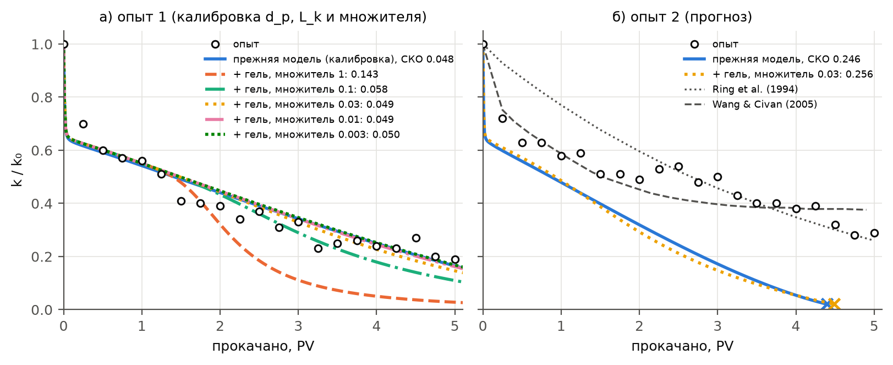
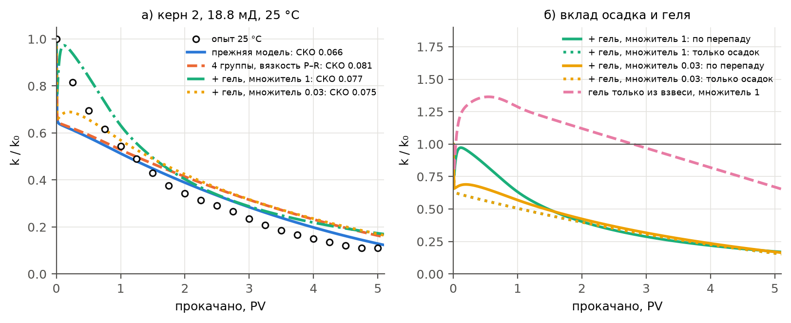
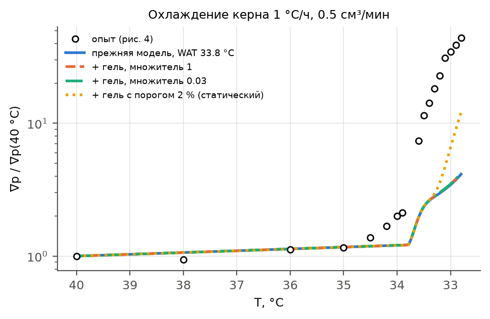
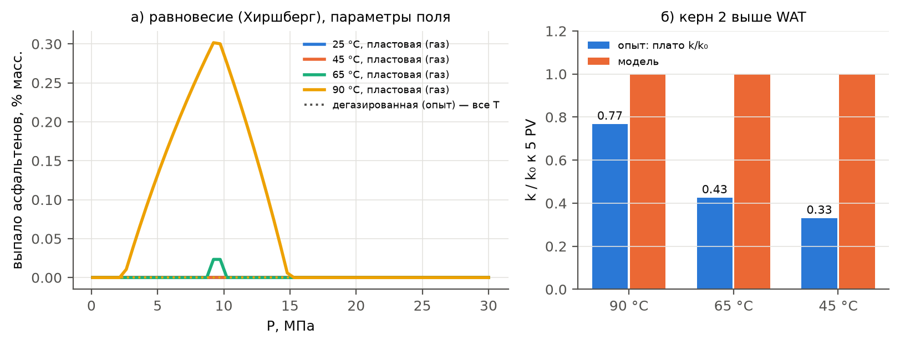

# СРАВНЕНИЕ МОДЕЛИ ДЕТАЛЬНОГО СОСТАВА НЕФТИ С ЭКСПЕРИМЕНТАЛЬНЫМИ ДАННЫМИ

*Проверка механизмов модели `paraphin` с детальным составом нефти (описание — `docs/модель_АСПО.docx`) по опубликованным лабораторным опытам. Документ собирается из `experiments/состав/валидация_АСПО.md` командой `python docs/build_docx.py валидация_АСПО`; прогоны керна и рисунки — `python experiments/состав/validate.py`, калибровка — `python experiments/calibrate.py`. Сравнение механизмов кинетики осаждения с теми же опытами — `experiments/сравнение_с_опытами.docx`.*

# 1. ЧТО И КАК СРАВНИВАЕТСЯ

Модель проверяется на двух уровнях.

- **Равновесие и реология** — формулы модели без расчета течения: кривая выпадения парафина, температура начала кристаллизации (WAT) при разных давлениях, вязкость при охлаждении, выпадение асфальтенов.
- **Прокачка нефти через керн** — полный расчет симулятором: одномерный керн, постоянный расход, измеряемая величина та же, что в опыте, — $k/k_0 = \Delta P_0/\Delta P$ или рост градиента давления при охлаждении. Эти расчеты проверяют связку «равновесие — осаждение в пучке капилляров — проницаемость — гель».

Параметры делятся на подобранные по опыту (калибровка) и взятые без подбора. Совпадение с опытом, по которому параметр подобран, — не проверка, а качество подгонки. Проверкой считается только прогноз на данных, не использованных при подборе. В табл. 1 указано, какую роль играет каждый опыт.

Таблица 1. Опыты и их роль.

| Опыт | Что измерено | Что проверяется | Роль |
|---|---|---|---|
| Li et al., 2024, нефть Жетыбая | кривая выпадения (ДСК), WAT 45.65 °C | группы парафина, multi-solid | калибровка при 10–45 °C; проверка при 0…−20 °C |
| Li et al., 2024 | вязкость при охлаждении, 150 с⁻¹ | Pedersen–Rønningsen + предел текучести | калибровка |
| Sandyga et al., 2020 | WAT(P) раствора парафина до 35 МПа | поправка Пойнтинга | калибровка $\delta_v$ |
| Togasheva et al., 2026, нефть Узеня | WAT при 10 МПа, потеря текучести | давление и газ в WAT, начало геля | проверка (качественная: другая нефть) |
| Sutton & Roberts, 1974, опыт 1 | $k/k_0$ керна Berea от прокачанных PV | осаждение в пучке капилляров, гель в поре | калибровка $d_p$, $L_k$ и множителя предела текучести |
| Sutton & Roberts, 1974, опыт 2 | то же, другая нефть | то же | проверка (прогноз) |
| Li et al., 2024, керн 2, 25 °C | $k/k_0$ от PV | группы парафина, вязкость, гель на нефти Жетыбая | проверка (прогноз) |
| Sandyga et al., 2020, охлаждение керна | градиент давления от температуры | гель при охлаждении | проверка (прогноз) |
| Li et al., 2024, керн 2, 45–90 °C | $k/k_0$ выше WAT | асфальтены | проверка |

Кинетика осаждения во всех прогонах одна — калибровка упрощенной модели по опыту 1 Sutton & Roberts: $d_p = 15$ мкм, $L_k = 0.3$ мм. Сравнение упрощенной модели с этими и другими опытами подробно разобрано в `experiments/исходная_модель/VALIDATION.md`; здесь к нему добавлены механизмы детального состава, и каждый опыт считается прежней и новой моделью.

Каждый вариант считается в копии пакета с поправленными константами (`tests/_patched_copy.py`), так что флаги модели не трогают основной код. Постановка керна та же, что в `experiments/исходная_модель/core_flood.py`: 60 ячеек вдоль керна, однофазная нефть, постоянный расход поддерживается перепадом на входе. На вход подается нефть с тем же составом и равновесной взвесью, что в керне.

Гель в опыте отличается от поля одним параметром — временем тиксотропной релаксации: {{GEL_TIME}} с вместо суток. Опыт длится часы, а структура парафинистой нефти восстанавливается за минуты (Dimitriou, McKinley, 2014). Нефть в керне в начале опыта уже гелирована: до начала прокачки множитель подвижности $\Phi$ приводится к равновесию с перепадом при заданном расходе. Опыт нормирует проницаемость на начало ступени, поэтому и в расчете $k/k_0 = 1$ в начале.

# 2. РАВНОВЕСИЕ ПАРАФИНА

## 2.1. Кривая выпадения и WAT нефти Жетыбая

Li et al. (2024) измерили кривую выпадения парафина нефти Жетыбая методом ДСК (24.93 % парафина, WAT 45.65 °C). Группы парафина (наклон SCN-распределения, общая эффективная теплота и сдвиг температуры плавления) подобраны по точкам 10–45 °C и WAT. Точки 0, −10 и −20 °C в подбор не входили — это проверка.

Таблица 2. Кривая выпадения: выпало парафина, % масс. нефти.

| T, °C | опыт | 4 группы | упрощенная модель |
|---|---|---|---|
| 40 | 1.5 | 1.9 | 0.0 |
| 35 | 5.0 | 5.7 | 4.8 |
| 30 | 9.5 | 9.0 | 9.6 |
| 25 | 13.0 | 12.7 | 13.3 |
| 20 | 16.0 | 16.1 | 16.1 |
| 10 | 20.5 | 20.3 | 20.0 |
| 0 | 23.0 | 22.6 | 22.2 |
| −10 | 24.2 | 23.8 | 23.5 |
| −20 | 24.9 | 24.4 | 24.2 |
| WAT, °C | 45.65 | 45.3 | 38.8 |

- В интервале подбора (10–45.65 °C) СКО 0.38 % масс. у групп против 0.62 % у упрощенной модели.
- На проверочных точках 0…−20 °C группы ошибаются на 0.38–0.45 % масс., упрощенная модель — на 0.70–0.80 %. Обе модели занижают выпадение при глубоком охлаждении, группы — вдвое меньше.
- WAT упрощенной модели на 7 °C ниже измеренной. Одна группа не может дать одновременно раннее начало кристаллизации и пологий хвост: в модели групп кристаллизацию начинают воски C41–60 (рис. 1).

Рис. 1. Кривая выпадения парафина нефти Жетыбая: опыт (ДСК, Li et al., 2024), четыре группы и упрощенная однокомпонентная модель (слева); выпадение по группам (справа).

## 2.2. WAT под давлением

**Дегазированная нефть.** По регрессиям Sandyga et al. (2020) WAT растворов парафина растет с давлением на 0.154, 0.179 и 0.230 °C/МПа (10, 30 и 60 % парафина; 0.1–20 МПа). Поправка Пойнтинга калибруется по среднему наклону 0.188 °C/МПа и дает $\delta_v = 0.028$. Разброс наклонов по концентрации (±0.04 °C/МПа) модель с одним $\delta_v$ не передает: это погрешность калибровки, а не проверка (рис. 2, слева).

**Живая нефть.** Растворенный газ понижает WAT. У модели с газосодержанием 40 м³/м³ и давлением насыщения 9.5 МПа (Узень XIII) WAT составляет 45.2 °C при атмосферном давлении, 38.6 °C при давлении насыщения и 40.5 °C при 20 МПа (рис. 2, справа). Togasheva et al. (2026) на проточной установке при 10 МПа получили для нефти Узеня WAT 41–44 °C. Модель с составом Жетыбая при 10 МПа дает 47.1 °C для дегазированной нефти и 38.7 °C для насыщенной газом, и опыт лежит между ними. Это согласуется с тем, что проба на проточной установке содержит меньше газа, чем пластовая нефть. Количественно сравнивать нельзя: нефть другая, а газосодержание пробы не указано.

Рис. 2. Слева: сдвиг WAT с давлением у дегазированной нефти — модель и регрессии Sandyga et al. (2020). Справа: WAT живой нефти с растворенным газом.

# 3. ВЯЗКОСТЬ И ГЕЛЬ

Вязкость нефти Жетыбая при охлаждении (Li et al., 2024, 150 с⁻¹) разложена по-бингамовски: $\mu = \mu_p + \tau_y/\dot\gamma$. Пластическая вязкость — формула Pedersen–Rønningsen, предел текучести — степенной закон от доли кристаллов. Все параметры подобраны по этой таблице, поэтому совпадение (СКО $\ln\mu$ 0.027 при 24–100 °C) — качество подгонки (рис. 3). Прежний множитель Кригера–Догерти занижал вязкость при 24 °C в 6.5 раза.

Независимая качественная проверка — нефть Узеня (Togasheva et al., 2026): объемная кристаллизация при 33.5–35 °C, потеря текучести при 25–34 °C. По модели гель начинается около 33 °C, а предел текучести растет с 3 Па при 31 °C до 54 Па при 24 °C. У нефтей Чанчуньлина (He et al., 2020) температура застывания на 7–11 °C ниже WAT; у модели начало геля на 12 °C ниже WAT.

Рис. 3. Вязкость нефти Жетыбая при охлаждении (Li et al., 2024): прежний множитель Кригера–Догерти, формула Pedersen–Rønningsen и модель с бингамовским разложением.

Главный вопрос реологии в пласте — какой предел текучести у геля в поре. Реометр измеряет объемный гель при сдвиге, а в поре кристаллы оседают на стенках и образуют осадок — гель парафин–нефть с захваченной нефтью (Singh et al., 2000). В модели предел текучести в поре считается по доле твердого в поровом объеме нефти (взвесь плюс осадок) по тому же закону, что в объеме, с множителем `gel_tau_mult`. Этот множитель — единственный свободный параметр геля. Его допустимый диапазон дают опыты на кернах (разделы 4–6).

# 4. ПРОКАЧКА ЧЕРЕЗ КЕРН: SUTTON И ROBERTS (1974)

В опытах Sutton и Roberts парафинистая нефть прокачивалась через керн Berea при 21.1 °C ниже точки помутнения, измерялось падение проницаемости от прокачанных поровых объемов (PV). Опыт 1 — нефть Shannon Sand (4.1 % парафина), опыт 2 — нефть Muddy (6.1 %). Постановка и свойства нефтей — по Ring et al. (1994). По опыту 1 откалибрована кинетика упрощенной модели ($d_p$, $L_k$), опыт 2 для нее — прогноз.

Взвеси в этих легких нефтях 2.7 и 4.0 % об. — меньше порога гелеобразования нефти Жетыбая (6.9 %). Поэтому гель здесь может возникнуть только за счет осадка на стенках, который модель считает частью геля (Singh et al., 2000). Это прямая проверка переноса предела текучести из объема в пору. Напряжение на стенке капилляров в этом керне мало: при расходе опыта $\tau_w = r|\nabla p|/(2\eta) \approx 0.8$ Па в каналах 12 мкм и 2.6 Па в каналах 40 мкм.

Таблица 3. Опыты Sutton и Roberts: упрощенная модель и гель с разными множителями предела текучести.

{{T_SR}}

Рис. 4. Опыты Sutton и Roberts: калибровка множителя предела текучести по опыту 1 (а) и прогноз опыта 2 (б). Для сравнения — модели Ring et al. (1994) и Wang, Civan (2005). Крест — закупорка керна.

- **Объемный гель в поре противоречит опыту.** При множителе 1 после 1.5 PV осадок занимает около 10 % порового объема. Предел текучести геля при такой доле твердого — десятки паскалей, на порядок больше $\tau_w$. Подвижность падает до 0.13, и $k/k_0$ к 5 PV — 0.03 против 0.19 в опыте (СКО 0.143 против 0.048).
- **Множитель до 0.03 калибровку не портит:** СКО 0.049–0.050. При 0.1 СКО растет до 0.058. Поэтому для этих нефтей гель в поре должен быть по крайней мере в 30 раз слабее объемного геля нефти Жетыбая.
- **Прогноз опыта 2 гель не меняет:** СКО 0.256 при множителе 0.03 против 0.246 у упрощенной модели. Расхождение прогноза с опытом — ранняя закупорка к 4.4 PV вместо плавного спада — прежнее. Его причина — сверхлинейный отклик модели на количество взвеси, а не гель (`experiments/исходная_модель/VALIDATION.md`).
- Если гель образует только взвесь (осадок в твердую фазу геля не входит), геля в этих опытах нет, и расчет совпадает с упрощенной моделью.

# 5. КЕРН НЕФТИ ЖЕТЫБАЯ ПРИ 25 °C (LI ET AL., 2024)

Это самая прямая проверка: нефть та же, по которой подобраны группы парафина, вязкость и предел текучести, а прокачка через керн в подборе не участвовала. Керн 2: 18.8 мД, пористость 16.9 %, длина 5 см, расход 0.1 мл/мин. Керн охлаждался ступенями 90 → 65 → 45 → 25 °C, на каждой ступени прокачивалась нефть той же температуры, $k/k_0$ нормирован на начало ступени. Распределение пор керна не измерено; принято распределение керна Berea (радиус моды 12 мкм) — вариант, при котором упрощенная модель переносится на этот керн без подбора (`experiments/исходная_модель/VALIDATION.md`).

Кроме СКО $k/k_0$, считается СКО отношения $k(25\ °C)/k(90\ °C)$ при том же PV. При 90 °C парафин не выпадает, а $k/k_0$ все равно падает до 0.77 — это повреждение другой природы (раздел 7), и оно есть на каждой ступени. Отношение его вычитает и оставляет парафиновую часть.

При 25 °C в нефти 12.7 % масс. взвеси (12 % об.), гель есть уже во втекающей нефти. Предел текучести по модели — 44 Па, напряжение на стенке — 4 Па в каналах 12 мкм и 14 Па в каналах 40 мкм. Поэтому в начале прокачки гелированная нефть течет в 8 раз хуже ньютоновской той же пластической вязкости (последний столбец табл. 4).

Таблица 4. Керн 2 Li et al. при 25 °C.

{{T_LI}}

Рис. 5. Керн нефти Жетыбая при 25 °C: опыт и варианты модели (а); проницаемость по перепаду давления и только по осадку (б).

- **Группы парафина без геля** дают почти то же, что упрощенная модель: взвеси при 25 °C чуть меньше (12.7 % против 13.3 %), и спад $k/k_0$ немного слабее.
- **Гель с объемным пределом текучести** меняет начало кривой. Когда блокируются узкие каналы, при постоянном расходе растет градиент, гель в широких каналах срывается, и кажущаяся проницаемость первые 0.5 PV почти не падает: 0.94 при 0.25 PV против 0.81 в опыте и 0.61 у упрощенной модели. Упрощенная модель давала мгновенный провал, которого в опыте нет. Дальше спад определяет осадок, и кривые с гелем и без сходятся (рис. 5б).
- По отношению $k(25)/k(90)$ гель с множителем 1 описывает опыт в 2.6 раза лучше упрощенной модели (СКО 0.041 против 0.108). По самому $k/k_0$ СКО 0.077 против 0.066: гель не описывает повреждение, которое есть и при 90 °C, а упрощенная модель частично компенсировала его избыточным начальным провалом.
- **Гель только из взвеси отвергнут опытом:** взвесь оседает у входа, гель ниже по керну «тает», и $k/k_0$ растет до 1.36. Осадок должен входить в гель, как принято в модели.
- **Противоречие с разделом 4.** Керн нефти Жетыбая требует множителя порядка 1, керн Sutton и Roberts — не больше 0.03. Закон предела текучести у каждой нефти свой. Для легких нефтей Sutton и Roberts (молярная масса 104–123 г/моль) реологии нет, и закон Жетыбая к ним переносится только как допущение. В `constants.py` оставлен множитель 1: он подтвержден керном той же нефти, для которой построен демонстрационный расчет.

# 6. ОХЛАЖДЕНИЕ КЕРНА (SANDYGA ET AL., 2020)

Раствор 20 % парафина C20–C40 в керосине прокачивался через песчаник (пористость 9 %, 0.5 см³/мин), пока весь стенд охлаждался от 40 °C со скоростью 1 °C/ч. Измерялся градиент давления: он плавно растет до 34 °C и затем за 1.2 °C увеличивается в 44 раза. Упрощенная модель с WAT пористой среды (33.8 °C) угадывает начало роста, но дает лишь 4.1 раза. Поры — по томографии авторов, кинетика — с керна Berea.

Таблица 5. Охлаждение керна: рост градиента давления.

{{T_SD}}

Рис. 6. Рост градиента давления при охлаждении керна: опыт Sandyga et al. (2020) и варианты модели.

- **С порогом гелеобразования нефти Жетыбая (6.9 %) гель не образуется.** При 32.8 °C взвеси 2.1 %, осадок — 4 % порового объема, и доля твердого в поре не доходит до порога. Кривые совпадают с упрощенной моделью.
- **Со статическим порогом 2 %** (Létoffé et al., 1995) гель появляется около 33.3 °C, и градиент к 32.8 °C растет в 12.1 раза. Гель закрывает около трети расхождения в логарифме (СКО $\lg(\nabla p/\nabla p_0)$ 0.52 против 0.64). Порог 6.9 % получен из реометрии при сдвиге 150 с⁻¹, частично разрушающем гель. В медленно текущей нефти в поре ближе статический порог.
- Гель только из взвеси и здесь ничего не дает: взвесь оседает.
- Оставшееся расхождение (12 раз против 44) требует еще более раннего или прочного геля. У раствора парафина в керосине закон предела текучести свой, а закон Жетыбая перенесен без подбора. Томография после опыта показала поры, заполненные парафином (пористость 2.1 % из 9 %), — это согласуется с тем, что осадок входит в гель.

# 7. АСФАЛЬТЕНЫ: ПОВРЕЖДЕНИЕ КЕРНА ВЫШЕ WAT (LI ET AL., 2024)

На ступенях 90, 65 и 45 °C парафин не выпадает (WAT модели 45.3 °C, опыта — 45.65 °C), а $k/k_0$ выходит на плато 0.77, 0.43 и 0.33. Li et al. связывают это повреждение со смолами и асфальтенами (5.52 и 0.91 % масс.). Индекс коллоидной неустойчивости нефти по SARA — 1.98, больше 0.9, то есть по этому признаку асфальтены потенциально неустойчивы (Yen et al., 2001).

Асфальтеновый блок модели откалиброван на давление начала осаждения живой нефти в пласте (11 МПа при 70 °C, демонстрационное значение). В опыте нефть дегазирована. Для нее по модели Хиршберга выпадение рассчитано при тех же параметрах, но без растворенного газа.

Таблица 6. Выпадение асфальтенов по модели, % масс. нефти, и плато $k/k_0$ в опыте.

{{T_ASPH}}

Рис. 7. Выпадение асфальтенов по модели Хиршберга с параметрами поля: живая нефть (сплошные линии) и дегазированная нефть опыта (пунктир — нуль при всех температурах) (а); плато $k/k_0$ в опыте и по модели (б).

- **Дегазированная нефть по модели устойчива** при всех температурах и давлениях 0.1–30 МПа. Асфальтены выпадают только из живой нефти вблизи давления насыщения, и больше при высокой температуре (0.3 % масс. при 90 °C), потому что параметр растворимости мальтенов с нагревом падает. Повреждения керна выше WAT модель не дает, а в опыте оно самое сильное из наблюдавшихся (до $k/k_0 = 0.33$).
- Индекс CII и модель растворимости здесь противоречат друг другу. CII — оценка по составу, а модель откалибрована на демонстрационное давление начала осаждения. Решить, какая из оценок верна, может только титрование дегазированной нефти н-гептаном или замер начала осаждения на глубинной пробе.
- Вероятнее, повреждение в опыте не связано с термодинамическим выпадением. Авторы пишут о задержке «макромолекулярных веществ» в горлах пор, то есть об адсорбции и механическом удержании агрегатов смол и асфальтенов. Такого механизма в модели нет. Это главное неописанное повреждение, и его вклад на керне больше парафинового.

# 8. ВЫВОДЫ

Таблица 7. Итог сравнения.

| Механизм | Опыт | Результат |
|---|---|---|
| Группы парафина, multi-solid | Li et al., кривая выпадения | точнее упрощенной модели: СКО 0.38 % против 0.62 %, на проверочных точках 0…−20 °C ошибка вдвое меньше; WAT 45.3 °C против 38.8 °C (опыт 45.65 °C) |
| Давление в WAT | Sandyga et al., Togasheva et al. | наклон 0.19 °C/МПа — калибровка; WAT Узеня при 10 МПа (41–44 °C) лежит между дегазированной (47.1 °C) и живой (38.7 °C) нефтью модели |
| Вязкость и предел текучести | Li et al., реометр | калибровка, СКО $\ln\mu$ 0.027; начало геля около 33 °C согласуется с потерей текучести нефти Узеня при 25–34 °C |
| Гель в поре, нефть Жетыбая | Li et al., керн при 25 °C | прогноз без подбора; с объемным пределом текучести повреждение от парафина описано в 2.6 раза точнее (СКО отношения 0.041 против 0.108), воспроизведено медленное начало спада |
| Гель в поре, легкие нефти | Sutton, Roberts | закон Жетыбая с множителем больше 0.03 противоречит опыту; при 0.03 калибровка и прогноз не меняются |
| Гель при охлаждении | Sandyga et al. | с порогом 6.9 % гель не образуется; со статическим порогом 2 % рост градиента в 12 раз против 4 у упрощенной модели и 44 в опыте |
| Гель только из взвеси | Li et al., Sutton, Roberts, Sandyga | отвергнут: на керне Жетыбая $k/k_0$ растет выше 1 |
| Асфальтены | Li et al., 45–90 °C | повреждение выше WAT (0.33–0.77) не воспроизводится: дегазированная нефть по модели устойчива |

1. **Равновесие парафина по группам подтверждено** на той же нефти, включая точки вне интервала подбора. Это самая надежная часть детального состава.
2. **Гель в поре — главный неопределенный параметр модели.** Керн той же нефти подтверждает объемный предел текучести, легкие нефти требуют в 30 раз более слабого, раствор в керосине — более раннего порога. Закон предела текучести нужно определять для каждой нефти, а порог гелеобразования для пласта брать по статическим опытам, а не по вязкости при сдвиге.
3. **Осадок входит в гель.** Вариант, где гель образует только взвесь, противоречит опыту Li et al. качественно.
4. **Повреждение выше WAT модель не описывает.** В опыте на нефти Жетыбая оно сравнимо с парафиновым и, по-видимому, связано с удержанием смол и асфальтенов в горлах, а не с их выпадением. Это следующий механизм, который нужно добавить в модель, если выше WAT повреждение важно.
5. **Для калибровки асфальтенового блока нужны** давление начала осаждения глубинной пробы и титрование дегазированной нефти. Для геля — реометрия при малых скоростях сдвига (статический предел текучести) и керновые опыты с начальным градиентом давления.

# СПИСОК ЛИТЕРАТУРЫ

1. Dimitriou C.J., McKinley G.H. A comprehensive constitutive law for waxy crude oil: a thixotropic yield stress fluid // Soft Matter. 2014. V. 10. P. 6619–6644.
2. He Y. et al. Cold damage from wax deposition in a shallow, low-temperature, and high-wax reservoir in Changchunling Oilfield // Sci. Rep. 2020. V. 10. P. 14223. [OA]
3. Hirschberg A., deJong L.N.J., Schipper B.A., Meijer J.G. Influence of temperature and pressure on asphaltene flocculation // SPE J. 1984. V. 24. P. 283–293.
4. Létoffé J.M. et al. Crude oils: characterization of waxes precipitated on cooling by d.s.c. and thermomicroscopy // Fuel. 1995. V. 74. P. 810–817.
5. Li X. et al. Cooling damage characterization and chemical-enhanced oil recovery in low-permeable and high-waxy oil reservoirs // Processes. 2024. V. 12. P. 421. [OA]
6. Ring J.N., Wattenbarger R.A., Keating J.F., Peddibhotla S. Simulation of paraffin deposition in reservoirs // SPE Prod. Facil. 1994. V. 9. P. 36–42.
7. Sandyga M.S., Struchkov I.A., Rogachev M.K. Formation damage induced by wax deposition: laboratory investigations and modeling // J. Pet. Explor. Prod. Technol. 2020. V. 10. P. 2541–2558. [OA]
8. Singh P., Venkatesan R., Fogler H.S., Nagarajan N. Formation and aging of incipient thin film wax-oil gels // AIChE J. 2000. V. 46. P. 1059–1074.
9. Sutton G.D., Roberts L.D. Paraffin precipitation during fracture stimulation // J. Pet. Technol. 1974. V. 26. P. 997.
10. Togasheva A. et al. Risk assessment of asphaltene–resin–paraffin deposition during reservoir cooling in the XIII horizon of the Uzen oil field // Eng. 2026. V. 7. P. 184. [OA]
11. Venkatesan R. et al. The strength of paraffin gels formed under static and flow conditions // Chem. Eng. Sci. 2005. V. 60. P. 3587–3598.
12. Wang S., Civan F. Model-assisted analysis of simultaneous paraffin and asphaltene deposition in laboratory core tests // J. Energy Resour. Technol. 2005. V. 127. P. 318–322.
13. Yen A., Yin Y.R., Asomaning S. Evaluating asphaltene inhibitors: laboratory tests and field studies // SPE 65376. 2001.
