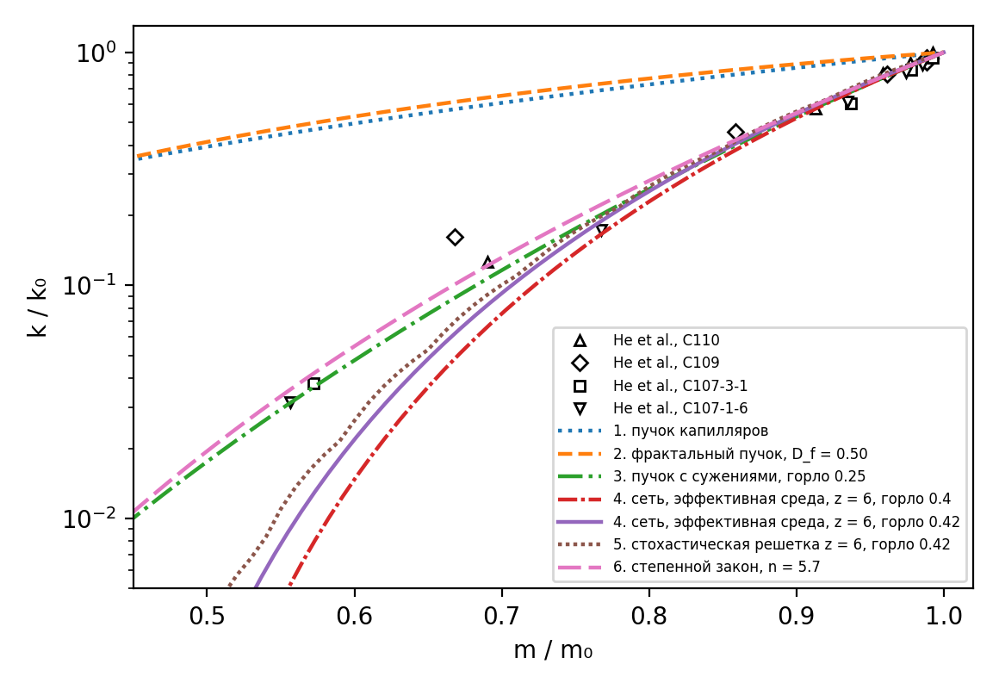
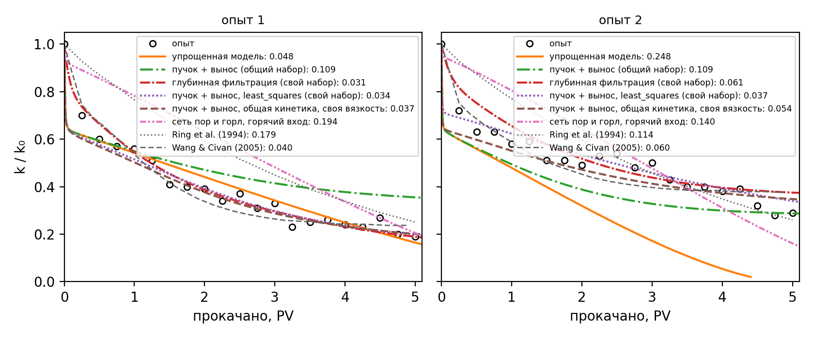
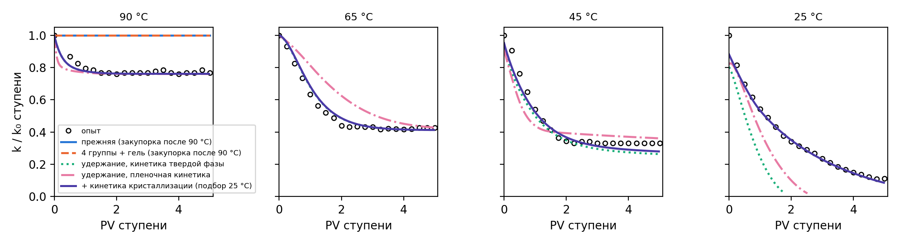
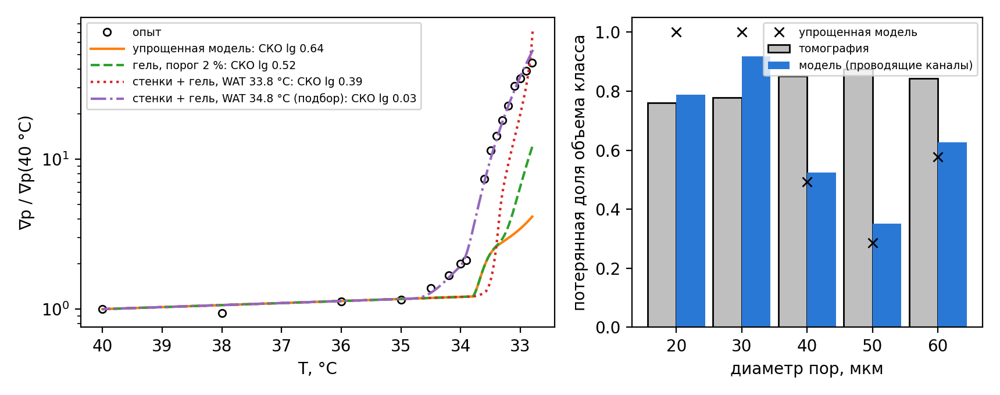
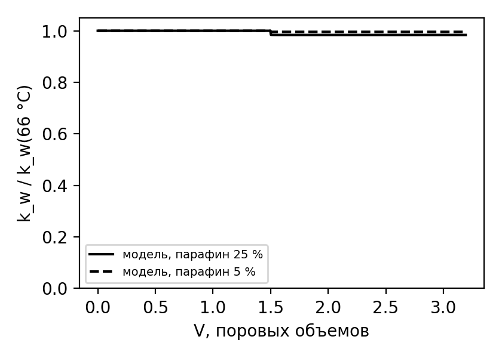

# СРАВНЕНИЕ МОДЕЛИ С ЭКСПЕРИМЕНТАЛЬНЫМИ ДАННЫМИ: КИНЕТИКА ОСАЖДЕНИЯ, УДЕРЖАНИЕ, СЕТЬ ПОР

*Проверка механизмов кинетики осаждения и моделей порового пространства симулятора `paraphin` по опубликованным керновым опытам. Описание моделей: `docs/кинетика_осаждения.docx` и `docs/модель_АСПО.docx`. Документ собирается из `experiments/сравнение_с_опытами.md` командой `python docs/build_docx.py сравнение_с_опытами`. Все прогоны и таблицы воспроизводит `python experiments/run_all.py`; с итоговыми параметрами из `params.json` это `--quick`, около 20 мин на 4 ядрах.*

# 1. ЧТО И КАК СРАВНИВАЕТСЯ

Опыты — одномерные керны с прокачкой нефти, измеряемая величина — проницаемость $k/k_0$ (или рост градиента давления) от прокачанного объема или температуры. Модель считает керн полным расчетом симулятора в копии пакета с поправленными константами-флагами (`experiments/core_runner.py`), параметры кинетики меняются без перекомпиляции.

**Метрика — СКО $k/k_0$ по точкам опыта; цель — 0.05.** Там, где собственный разброс точек опыта (шумовой порог) больше, цель — порог. Порог оценивается по вторым разностям точек (метод фон Неймана), а у Sandyga et al. — по точности оцифровки обеих осей.

**Калибровка и прогноз разделены.** Параметры кинетики подбираются по семействам опытов:

- Sutton & Roberts 1 + 2 — общий набор; дополнительно набор на каждый опыт (так подбирали Wang & Civan) и перекрестный прогноз;
- Li et al. выше WAT (90, 65, 45 °C) — удержание смол и асфальтенов;
- Li et al. ниже WAT (25 °C) — отдельно;
- Sandyga et al. — рост градиента, а томография пор — проверка.

Пары $(m/m_0, k/k_0)$ He et al. не подбираются: по ним проверяются модели порового пространства.

**Механизмы по опытам.** Какие механизмы включены в каждом сравнении и почему — табл. 1.

Таблица 1. Учтенные механизмы («подбор» — механизм включен, его параметры подобраны по опыту; «проверен» — механизм включался, но опыт он не улучшил).

| Механизм | Sutton & Roberts | Li, 90–45 °C | Li, 25 °C | Sandyga | He |
|---|---|---|---|---|---|
| равновесие SLE | одна группа | 4 группы | 4 группы | одна группа | — |
| вязкость, гель в поре | — (предел текучести ≤ 0.03 объемного) | Pedersen, гель | Pedersen, гель | гель, порог 2 % | — |
| постановка | изотермическая и горячий вход 54 °C | ступени | ступени | охлаждение 1 °C/ч | — |
| кинетика кристаллизации (объем, стенки) | — (равновесная взвесь) | — (парафин растворен) | подбор | подбор | — |
| перенос частиц к стенке (Левек) | подбор: $d_p$, множитель диффузии | — | подбор: $d_p$, множитель диффузии | Броун | — |
| вынос отложений | подбор | — | — | — | — |
| удержание смол и асфальтенов (Ленгмюр, функция повреждения) | — (состав не приведен) | подбор, две формы кинетики | из подбора выше WAT | — (керосин) | — |
| гель-отложение ($C_0$) | — | — | — | проверен ($C_0 = 1$) | проверен |
| глубинная фильтрация, $k(\varphi, \sigma)$ | подбор (сравнение с Wang & Civan) | — | — | — | проверен |
| сеть пор и горл | проверен (хуже пучка) | — | — | проверен (хуже пучка) | подбор горла |
| тепловое неравновесие | — (медленная фильтрация: LTE до $10^{-12}$) | — | — | — | — |
| смачиваемость | — (однофазная прокачка) | — | — | — | — |

# 2. МОДЕЛИ ПОРОВОГО ПРОСТРАНСТВА: ПАРЫ (m/m₀, k/k₀) HE ET AL. (2020)

Керны четырех скважин месторождения Чанчуньлин охлаждались с прокачкой парафинистой нефти. При каждой температуре измерены пористость (гелиевый порозиметр) и проницаемость. Пары $(m/m_0, k/k_0)$ задают связь проницаемости с отложением независимо от кинетики, и на них сравниваются потомки пучка капилляров из обзора (`resources/всякие статьи/модели ПС/`). Во всех моделях одинаковый слой отложения на стенках.

Таблица 2. Модели порового пространства против пар He et al.

{{PORE}}

Эффективная среда против прямого расчета случайной решетки $14^3$ (та же геометрия): СКО $k/k_0$ = {{EMA_LATTICE}}.

Рис. 1. Пары $(m/m_0, k/k_0)$ He et al. (2020) и модели порового пространства.

- **Пучок капилляров не годится для связи $k(m)$.** Он теряет проницаемость много медленнее пористости: СКО 0.28. Сжатие каналов проводимость почти не отнимает, пока каналы не закрылись. Фрактальное распределение радиусов этого не меняет.
- **Нужны горла.** Проницаемость падает быстрее пористости, если проводимость дают горла, которые тот же слой отложения закрывает раньше пор. Пучок с сужениями дает 0.037, сеть пор и горл — 0.044–0.046, с одним подобранным числом — отношением горла к поре. Это в пределах цели 0.05 и сопоставимо со степенным законом с подобранным показателем (0.039).
- **Горло сети — то же, что в пороге блокирования.** Лучшее отношение горла к поре у сети при $z = 8$ — 0.40, ровно отношение $\gamma$, откалиброванное для блокирования кристаллами по Sutton & Roberts.
- **Эффективная среда точна.** Она совпадает с прямым расчетом случайной решетки до 0.008 по $k/k_0$, поэтому сеть в пакете считается по ней, без решения сетевой задачи в каждой ячейке.

Таблица 3. Зависимости $k(m)$ пакета: пучок, гель-отложение, сеть пор и горл, замыкания глубинной фильтрации.

{{HE}}

# 3. ОПЫТЫ SUTTON & ROBERTS (1974)

Прокачка парафинистой нефти через керн Berea ниже точки помутнения, два опыта с разными нефтями. Данные — Ring et al. (1994) и Wang & Civan (2005), там же — кривые их моделей. Эти кривые оценены той же метрикой по тем же точкам.

Таблица 4. СКО $k/k_0$ по опытам Sutton & Roberts.

{{SR}}

Рис. 2. Опыты Sutton & Roberts и модели.

- **Свой набор на опыт — в пределах цели.** Пучок с выносом отложений и подбором least_squares по диаметру кристалла, множителю диффузии и параметрам выноса дает 0.034 и 0.037 при шуме опытов 0.029 и 0.025. Это лучше Wang & Civan (0.040 и 0.060), которые тоже подбирали коэффициенты на каждый опыт. Глубинная фильтрация со своим набором — 0.031 и 0.061.
- **Общий набор на оба опыта дает 0.10–0.13.** Прогноз одного опыта по другому — 0.10–0.23. Опыт 2 теряет проницаемость медленнее опыта 1, хотя взвеси в нем больше: у нефтей разная кинетика осаждения. Упрощенная модель предсказывала для опыта 2 закупорку к 4.4 PV (0.248).
- **Общая кинетика и своя вязкость нефти дают 0.037 и 0.054.** Вязкость ни одной из нефтей не измерена: 3 мПа·с — допущение Ring et al. Если оставить общими диаметр кристалла и параметры выноса, а множитель броуновской диффузии ($D \sim 1/\mu$) взять свой для каждой нефти, то множители — 3.1 и 0.30. Это вязкость около 1 и 10 мПа·с — разница в десять раз для нефтей разных пластов правдоподобна. Опыт 2 чуть выше цели (0.054 при шуме 0.025).
- **Неизотермическая постановка — на результат почти не влияет.** В опыте нефть входит горячей, а охлаждается выходной конец керна; со своим набором это дает 0.036 для опыта 2. Опыт 1 так описывается хуже (0.16): ранний провал проницаемости в первые 0.25 PV дают только кристаллы, пришедшие со взвесью.
- **Сеть пор и горл здесь хуже пучка** (0.14–0.21). Кристаллы 15 мкм блокируют горла большей части каналов, и сеть переходит порог протекания почти сразу. Если уменьшить диаметр кристалла, пропадает ранний провал.

# 4. ОПЫТ LI ET AL. (2024): СТУПЕНЧАТОЕ ОХЛАЖДЕНИЕ

Один керн нефти Жетыбая охлаждается ступенями 90 → 65 → 45 → 25 °C. На каждой ступени нефть той же температуры прокачивается до стабилизации перепада. Перед ступенью керн и нефть охлаждали без прокачки (Li et al., разд. 2.2.3), а $k/k_0$ нормирован на начало ступени. В модели протокол повторяется целиком, и повреждение копится от ступени к ступени.

Таблица 5. СКО $k/k_0$ по ступеням.

{{LI}}

Рис. 3. Ступени опыта Li et al. и модели.

- **Протокол ступени.** Перед каждой ступенью керн и нефть охлаждали без прокачки, а начальную проницаемость ступени мерили уже по охлажденной нефти (Li et al., разд. 2.2.3). В модели это выдержка 1 ч без перепада перед нормировкой: в поровой нефти выпадает взвесь, идут гель и адсорбция, а перенос и блокирование стоят. Без выдержки взвесь 11 % выпадала в поровой нефти после нормировки. Рост вязкости принимался за повреждение, и при 25 °C модель сразу теряла две трети проницаемости. Выдержка — поправка постановки, а не параметр подбора. С ней и с подбором ступени 25 °C (ниже) — {{LI_HOLD_25}}.
- **Выше WAT (90, 65, 45 °C) повреждение дает удержание смол и асфальтенов.** Парафин при этих температурах растворен. Удержание — Ленгмюр с $K(T)$ по Вант-Гоффу, повреждение — функция Civan (разд. 13.7 описания). Подобраны предельное удержание, константа Ленгмюра, энтальпия и скорость. Емкость удержания отнесена к поверхности породы, а не текущих каналов, а скорость растет как $T/\mu$ (Уилки–Чанг). Кинетика со стороны твердой фазы описывает три ступени с СКО {{LI_SOLID}}, пленочная — {{LI_FILM}}: крутой спад и резкий выход на плато в опыте (65 и 45 °C) пленочная форма не улучшила.
- **Энтальпия удержания — эффективная.** Подобранная величина {{LI_DH}} кДж/моль заметно больше энтальпии физической адсорбции асфальтенов (десятки кДж/моль). Удержание в горлах — не только адсорбция: при охлаждении растут ассоциация смол и асфальтенов и их осаждение на уже адсорбированном слое. Поэтому $\Delta H$ здесь — параметр температурной зависимости удержания, а не калориметрическая величина.
- **Ниже WAT (25 °C)** — {{LI_COLD_TEXT}}

# 5. ОПЫТ SANDYGA ET AL. (2020): ОХЛАЖДЕНИЕ КЕРНА

Раствор 20 % парафина в керосине прокачивается через песчаник, весь стенд охлаждается от 40 °C на 1 °C/ч. Градиент давления растет в 44 раза за 1.2 °C. По томографии после опыта пористость упала с 9 до 2.1 %, все классы пор потеряли 76–87 % объема.

Таблица 6. Рост градиента давления и проводящая пористость.

{{SD}}

Таблица 7. Доля объема, потерянная классами пор томографии.

{{SD_PORES}}

Рис. 4. Опыт Sandyga et al. и модели: градиент давления (слева), потери по классам пор (справа).

- **Рост градиента — в пределах цели.** Кристаллизация пересыщенного раствора на стенках пор ($k_w = 1.1\cdot10^{-3}$ с⁻¹) при медленной кристаллизации в объеме ($3.7\cdot10^{-4}$ с⁻¹) воспроизводит рост в 44 раза. СКО $\lg$ — 0.034 при шумовом пороге 0.119, СКО $k/k_0$ — 0.036. Во всех пяти точках критерия расхождение не больше 1.19 раза. Упрощенная модель давала рост в 4 раза (СКО $k/k_0$ 0.26).
- **WAT пористой среды подобрана: 34.8 °C.** Авторы дают 33.8 °C, но градиент в опыте растет уже с 34.5 °C (в 1.4 раза при 34.5 °C и в 2 раза при 34.0 °C). С WAT 33.8 °C лучший набор дает СКО $\lg$ 0.39: на такой крутой кривой начало роста решает все. Сдвиг на 1 °C — в пределах разброса определения WAT по керну. Разницу с объемной WAT (30 °C, реометр; Rogachev, Sandyga 2019) объясняет скорость охлаждения, см. ниже «Проверка: WAT от скорости охлаждения».
- **Исходный скан томографии.** 0.23 = 2.1/9.0 отсчитано от сухого керна. Тот же керн, насыщенный водой перед опытом, дал 5.3 % (Rogachev, Sandyga 2019), и после опыта в нем тоже вода: от этого скана отношение 0.40, и модель (0.17) теряет поры сильнее опыта. Какой скан брать, решает сегментация томограмм (`new/обзор_источников.md`, разд. 2.2).
- **Отложение — сплошной кристалл, а не гель.** Подбор выбрал $C_0 = 1$, гель-отложение ($C_0 < 1$) рост градиента не улучшает.
- **Сеть пор и горл хуже пучка.** Проводимость у нее рушится на пороге протекания раньше, чем растет градиент в опыте.
- **Проводящая пористость после опыта — 0.17** против 0.23 ± 0.03 по томографии, чуть ниже диапазона. По классам пор модель отнимает объем в основном у узких и средних (0.79–0.92), а широкие теряют 0.35–0.63. Томография показывает 0.76–0.88 во всех классах. Равномерное сужение слоем одной толщины широкие поры в той же доле не заполняет. Нужна неоднородность отложения по поре (гель во всем объеме поры, а не на стенке) — это следующий шаг модели.

**Прогноз: скорость охлаждения.** С параметрами подбора при 1 °C/ч керн пересчитан при других скоростях охлаждения
(табл. 8). Кристаллизация в объеме конечна ($1/k_{cr}$ = 45 мин), и число Дамкелера $Da = k_{cr}/v_{охл}$ (время
охлаждения на 1 °C к времени кристаллизации) при скорости опыта близко к единице. Поэтому результат опыта
чувствителен к скорости: при медленном охлаждении пересыщение успевает сняться на стенках у самой WAT и керн
закупоривается, при быстром оно отстает от равновесия, и к концу охлаждения на стенках оседает меньше. Это проверяемое предсказание:
опыт при 0.5 и 2 °C/ч отделил бы кинетику кристаллизации от равновесной модели.

Таблица 8. Прогноз роста градиента давления при разных скоростях охлаждения.

{{SD_RATES}}

**Проверка: WAT от скорости охлаждения** (Struchkov, Rogachev 2017, `data/sandyga2020.json`, блок `wat_cooling_rate`;
`sandyga2020.wat_rate`). Тот же раствор в керосине без керна: WAT 30 %-го раствора по реометру растет с 33.1 до
36.2 °C при замедлении охлаждения с 0.042 до 0.001 °C/с. Расчет: доля кристаллов релаксирует к равновесной с
$k_{cr}$ (как в `components_equation`), реометр видит их с доли thr; thr и сдвиг равновесной WAT 30 %-го раствора
подбираются (одна группа в идеальном растворе завышает рост WAT с концентрацией). Запаздывание ~ $\sqrt{thr\,v/k_{cr}}$,
поэтому опыт задает thr/$k_{cr}$, и проверка - в правдоподобии порога (табл. 8а). С $k_{cr}$ Sandyga порог -
десятые доли процента кристаллов; с $k_{cr}$ Li - не меньше 10 % (треть парафина раствора), неправдоподобно. Та же
модель дает объемную WAT 20 %-го раствора {{SD_BULK20}}: подобранная «WAT пористой среды» 34.8 °C - это объемная
WAT при медленном охлаждении, а не особый механизм.

Таблица 8а. WAT 30 %-го раствора от скорости охлаждения: порог видимости кристаллов при $k_{cr}$ подборов.

{{SD_WAT_RATE}}

# 6. ОПЫТ MALONEY & OESTHUS (2004): ХОЛОДНАЯ ВОДА ПРИ ОСТАТОЧНОЙ НЕФТИ

Мел 3.8 x 7.6 см, пористость 35 %, проницаемость 1.5 мД. Заводнение при 66 °C до $S_w$ = 0.62, затем закачка воды
0.5 мл/ч при ступенчатом охлаждении до 10 °C и еще 3 сут при 10 °C. Точка помутнения нефти 25 °C. $k_{rw}$ растет
с 0.05 до 0.10 к 26 °C (усадка нефти, $S_w$ 0.62 → 0.64), ниже точки помутнения почти не меняется: 0.09 и 0.10.

Прогноз без подбора (`maloney2004.py`): модель пласта (нефть Жетыбая, кинетика Li et al.), температуры плавления
групп сдвинуты под WAT 25 °C, содержание парафина 24.9 % (верхняя оценка) и 5 %, пучок с медианным радиусом
0.5 мкм. В прогоне керна (`core_runner`, `exp["water"]`) течет одна вода, остаточная нефть неподвижна.

Таблица 9. Проницаемость по воде ниже точки помутнения.

{{ML}}

Рис. 5. Опыт Maloney & Oesthus: проницаемость по воде при охлаждении керна с остаточной нефтью.

- **Повреждения нет, как и в опыте.** Неподвижная остаточная нефть не подводит взвесь к каналам, выпавший парафин
  отнимает не больше 1.2 % порового объема. Повреждение у нагнетательной скважины в расчете пласта набирается, пока
  через охлажденную зону течет нефть, а не из остаточной нефти.
- **Рост $k_{rw}$ выше точки помутнения не воспроизводится.** Фазы в модели несжимаемы, усадки нефти нет.

# 7. ИТОГИ

Таблица 10. СКО $k/k_0$ по всем опытам, цель 0.05 (у He et al. — связь $k(m)$, у Sandyga et al. — $k/k_0 = \nabla p_0/\nabla p$).

{{SUMMARY}}

**Что дало приближение к опытам.**

- **Постановка опытов.** Ступенчатый протокол Li et al. с выдержкой перед ступенью и WAT пористой среды у Sandyga et al. Без них подбор параметров компенсировал ошибку постановки.
- **Удержание смол и асфальтенов в горлах.** Только оно объясняет повреждение выше WAT (Li et al.): парафин при 45–90 °C растворен.
- **Кристаллизация на стенках пор при медленной кристаллизации в объеме.** Она дает рост градиента в 44 раза у Sandyga et al. Упрощенная модель давала 4 раза.
- **Горла в модели порового пространства.** Связь $k(m)$ He et al. без них не описать, пучок капилляров дает СКО 0.28.
- **Множитель диффузии частиц.** Вязкость нефтей Sutton & Roberts не измерена, и множитель ее заменяет. С общей кинетикой и своей вязкостью нефти опыты описываются с СКО 0.037 и 0.054.

**Что осталось.**

- **Перенос между нефтями.** Общий набор кинетики на обе нефти Sutton & Roberts без различия вязкости дает 0.10–0.13. Кинетика осаждения зависит от нефти, и прогноз для новой нефти без хотя бы одного кернового опыта ненадежен.
- **Поры после опыта Sandyga et al.** Равномерное сужение слоем одной толщины недобирает объем широких пор: проводящая пористость 0.17 против 0.23 (от сухого скана; от насыщенного водой - 0.40, и тогда модель теряет поры сильнее опыта).
- **Сеть пор и горл в опытах с блокированием.** Для связи $k(m)$ она лучшая, но в опытах, где закупорку дают кристаллы (Sutton & Roberts, Sandyga), хуже пучка: сеть рано переходит порог протекания. Нужно разделить блокирование горл частицами и сужение горл отложением.
- **Энтальпия удержания — эффективная.** Ее величина ({{LI_DH}} кДж/моль) требует отдельной проверки на опытах с адсорбцией при разных температурах.
