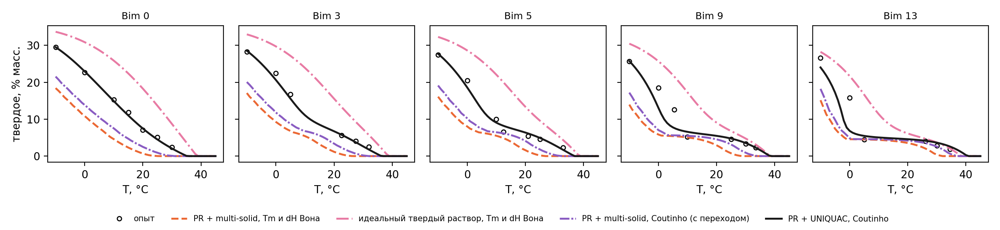
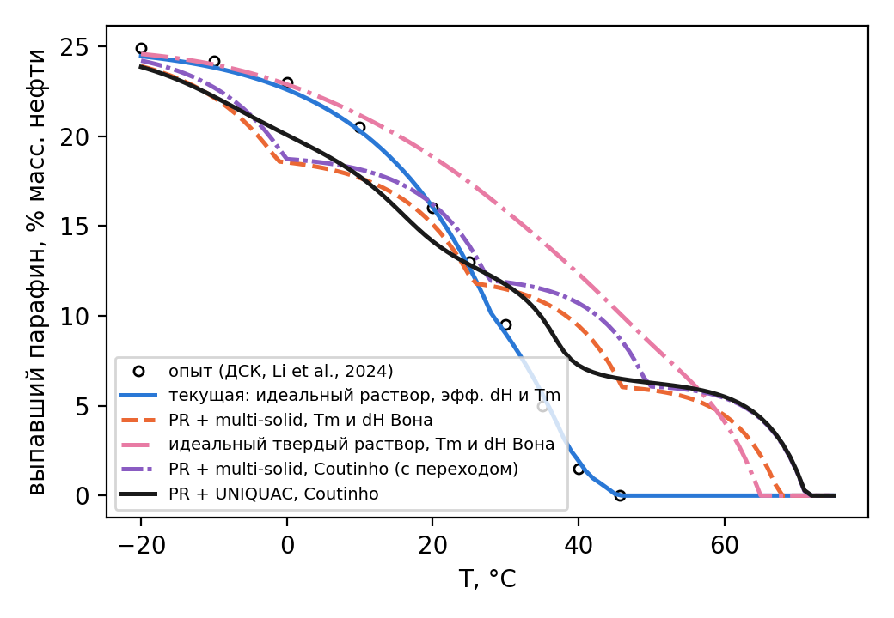
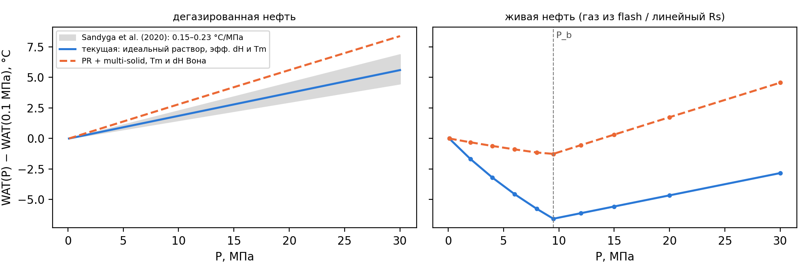
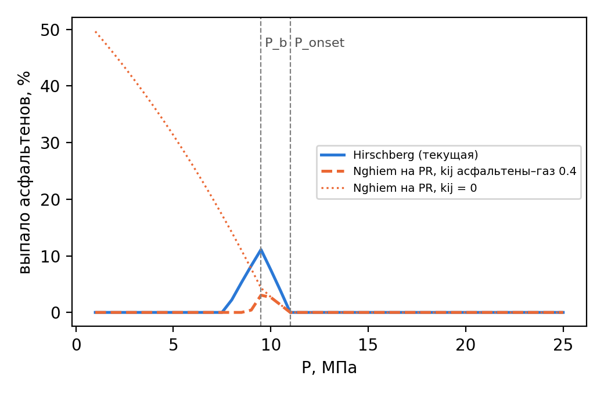
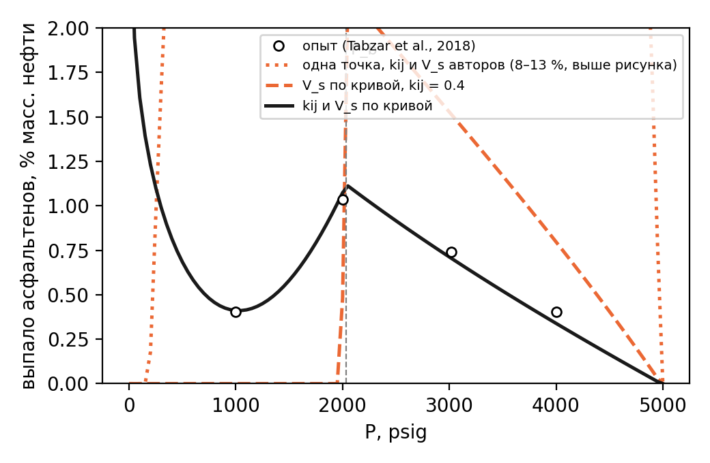

# Модели на уравнении состояния: сравнение с опытами и моделями других авторов

Воспроизвести: `python experiments/уравнение_состояния/compare.py` (несколько минут) → `results.json`,
рисунки `figures/*.png` и этот файл. Модели — `paraphin/thermo` (флаги `wax_eos`, `asph_nghiem`); описание —
`docs/модель_АСПО.md`, разд. 3.4 и 4.5.

Во всех рисунках цвет и стиль закреплены за моделью: синяя сплошная — текущая модель симулятора, оранжевая
штриховая — уравнение состояния Пенга–Робинсона с multi-solid (или Nghiem для асфальтенов), зеленая
пунктирная — идеальный multi-solid, розовая штрихпунктирная — идеальный твердый раствор, фиолетовая — PR +
multi-solid с плавлением по Coutinho, черная сплошная — PR + твердый раствор UNIQUAC; кружки — опыт.

## A. Синтетические смеси н-алканов в н-декане (da Silva et al., 2017)

Пять смесей C18–C36 в н-декане (64–66 % масс. растворителя; Dauphin et al., 1999; Fleming et al., 2017): одна
непрерывная (Bim 0) и четыре бимодальные. Составы — Table 1 статьи, температура исчезновения парафина (WDT) —
Table 3, доля твердого — оцифровка рис. 4b–8b (около 0.7 % масс., 0.7 °C; `experiments/data/dasilva2017_sle.json`).
Здесь проверяется сама термодинамика без характеризации нефти. Свойства компонентов — те же, что в симуляторе:
Tc, Pc по Riazi–Daubert, ω по Kesler–Lee, kij = 0; плавление — по Won или по Coutinho (SPE 78324, 2002:
температура и теплота плавления и перехода ротаторной фазы в орторомбическую, `coutinho_nalkane`). Твердый
раствор UNIQUAC — предсказательный, по Coutinho: параметры решетки и энергии взаимодействия из теплот сублимации
н-алканов, без подбора (`solids.UniquacSolidWax`). У авторов свойства по Marano & Holder, плавление и переходы
по Coutinho et al. (2006), kij по Pan et al. (1997).

Таблица A1. WDT, °C.

| Смесь | опыт | PR + multi-solid, Вон | идеальный multi-solid, Вон | идеальный тв. раствор, Вон | PR + multi-solid, Coutinho | PR + UNIQUAC | UNIQUAC, идеальная жидкость | PR + multi-solid (авторы) | PR + UNIQUAC (авторы) |
|---|---|---|---|---|---|---|---|---|---|
| Bim 0 | 35.60 | 25.21 | 23.60 | 38.59 | 31.00 | 35.18 | 33.90 | 31.94 | 36.65 |
| Bim 3 | 36.50 | 26.26 | 24.61 | 38.61 | 31.96 | 36.27 | 34.95 | 32.90 | 37.77 |
| Bim 5 | 37.22 | 26.95 | 25.27 | 38.55 | 32.59 | 36.88 | 35.52 | 33.53 | 38.42 |
| Bim 9 | 38.18 | 28.73 | 26.97 | 38.35 | 34.21 | 38.35 | 36.92 | 35.14 | 39.90 |
| Bim 13 | 39.66 | 31.92 | 30.09 | 38.29 | 37.11 | 40.50 | 38.98 | 38.00 | 41.87 |

Таблица A2. Отклонение доли твердого от опыта, % масс.: СКО по моделям, у UNIQUAC также среднее абсолютное
(AAD) — в нем авторы приводят свою модель (Table 5).

| Смесь | PR + multi-solid, Вон | идеальный multi-solid, Вон | идеальный тв. раствор, Вон | PR + multi-solid, Coutinho | PR + UNIQUAC | UNIQUAC, идеальная жидкость | AAD PR + UNIQUAC | AAD PR + UNIQUAC (авторы) |
|---|---|---|---|---|---|---|---|---|
| Bim 0 | 8.8 | 9.3 | 8.8 | 6.5 | 0.5 | 0.9 | 0.40 | 0.84 |
| Bim 3 | 8.6 | 9.0 | 6.8 | 6.7 | 0.9 | 1.4 | 0.74 | 0.98 |
| Bim 5 | 7.1 | 7.5 | 8.4 | 5.4 | 1.1 | 1.3 | 0.91 | 1.27 |
| Bim 9 | 7.4 | 7.7 | 6.6 | 6.2 | 2.8 | 3.1 | 1.75 | 1.25 |
| Bim 13 | 6.7 | 7.1 | 5.6 | 5.7 | 3.9 | 4.0 | 2.35 | 1.45 |

Рис. A. Доля твердого в синтетических смесях: опыт (da Silva et al., 2017) и модели с параметрами симулятора.

Multi-solid на PR с плавлением по Вону занижает WDT в среднем на 9.6 °C, у авторов — на 3.1 °C.
Неидеальность жидкости по PR сдвигает WDT вверх лишь на 1.7 °C относительно идеального раствора: смесь
н-алканов почти атермична. Значит, разница с авторами — в свойствах плавления. Корреляция Вона не содержит
твердо-твердого перехода н-алканов (ротаторная фаза), и полная теплота перехода у нее меньше калориметрической:
у C24 65 кДж/моль против 54.9 + 31.3 = 86 кДж/моль плавления и переходов (Broadhurst, 1962, табл. 3).

Переход по Coutinho сокращает занижение WDT multi-solid до -4.6…-2.5 °C и СКО доли твердого до
5.4–6.7 % масс. (по Вону -10.4…-7.7 °C и 6.7–8.8 %). Скачок теплоемкости по Pedersen et al.
(1991) поверх перехода ухудшает WDT до -7.6…-4.8 °C: корреляция выведена для multi-solid с плавлением
по Вону и в паре с переходом учитывает одно и то же дважды, поэтому в модели он не включен (аргумент `mw`
`MultiSolidWax` остается для проверки).

Твердый раствор UNIQUAC с жидкостью по PR — лучшая модель и здесь: WDT -0.4…+0.8 °C (у авторов
+1.0…+2.2 °C), СКО доли твердого 0.5–3.9 % масс. Хуже всего он описывает бимодальные смеси с
глубоким провалом между модами (Bim 9 и Bim 13): у них возможно расслоение на два твердых раствора, а здесь
раствор один. С идеальной жидкостью WDT ниже на 1–2 °C (-1.7…-0.7 °C).

## B. Нефть Жетыбая (Li et al., 2024): кривая выпадения и WAT по ДСК

Таблица B. WAT (ДСК — 45.65 °C) и СКО кривой выпадения, % масс. нефти.

| Модель | WAT, °C | СКО 10–45 °C | СКО −20…45 °C |
|---|---|---|---|
| текущая (идеальный раствор, эфф. dH = 41.9 кДж/моль, сдвиг Tm +52.4 K; подбор по этой кривой) | 45.3 | 0.38 | 0.39 |
| PR + multi-solid, Tm и dH Вона | 67.6 | 4.63 | 4.19 |
| идеальный multi-solid, Tm и dH Вона | 64.1 | 4.18 | 3.88 |
| идеальный твердый раствор, Tm и dH Вона | 64.9 | 7.30 | 6.11 |
| PR + multi-solid, Coutinho с переходом | 71.2 | 5.55 | 4.87 |
| PR + UNIQUAC, Coutinho | 71.3 | 4.06 | 3.59 |

Рис. B. Кривая выпадения нефти Жетыбая: опыт и модели. Группы те же (SCN C17–C60, `scn_slope` = 0.07).

Все модели с калориметрическими свойствами плавления завышают WAT на
18–26 °C.
Уравнение состояния картину не исправляет: PR добавляет к идеальному multi-solid еще
3.5 °C. Переход по Coutinho и твердый раствор UNIQUAC, лучшие на
синтетических смесях, здесь дают СКО 5.6 и 4.1 % масс. (multi-solid по
Вону — 4.6): переход делает твердое устойчивее и повышает WAT, а она у н-алканов и так выше,
чем у «парафина» этой нефти.
Подбор одной характеризации — наклона SCN-распределения и последнего SCN — при UNIQUAC без эффективных параметров
дает СКО 3.2 % масс. (наклон 0.080, последний SCN 48, WAT
62 °C) против 0.38 % у текущей модели.
Пологая кривая ДСК (1.5 % при 40 °C и 24.9 % при −20 °C) у нефти с 25 % «парафина» указывает, что в эту долю входят
изо- и циклоалканы с меньшей теплотой плавления, а не только н-алканы, а распределение н-алканов не измерено.
Для такой нефти эффективные параметры (текущая модель) остаются нужны, и в симуляторе по умолчанию остается она.
Уравнение состояния полезно там, где модель должна предсказывать, а не воспроизводить: давление, газ, состав.

## C. WAT от давления

Таблица C. Наклон WAT дегазированной нефти на 0.1–20 МПа и ход WAT живой нефти.

| Модель | dWAT/dP, °C/МПа | WAT(P_b) − WAT(0.1 МПа), °C | dWAT/dP выше P_b, °C/МПа |
|---|---|---|---|
| опыт: Sandyga et al. (2020), дегазированная нефть | 0.15–0.23 | — | — |
| текущая (Пойнтинг с dv = 0.028 v_L, подбор по Sandyga; газ линейно по Rs) | 0.187 | -6.6 | 0.182 |
| PR + multi-solid, dv = 0.13 v_L по плотностям расплава и кристаллов, без подбора | 0.281 | -1.3 | 0.285 |
| PR + multi-solid без скачка объема (вариант пакета research) | 0.017 | — | — |

Рис. C. Сдвиг WAT с давлением: дегазированная нефть (слева, серая полоса — регрессии Sandyga et al., 2020) и
живая нефть с R_s = 40 м³/м³, P_b = 9.5 МПа (справа).

В пакете research фугитивность твердого бралась от чистой жидкости при системном давлении. Так твердое молча
получает объем жидкости, и наклон выходит на порядок меньше измеренного (0.017 °C/МПа).
С поправкой Пойнтинга на скачок объема (Pan et al., 1997) и физическим dv = v_L − v_S по плотностям 780 и
900 кг/м³ наклон 0.28 °C/МПа — того же порядка, что опыт, без подбора. Эффективная модель
попадает в опыт подбором dv при заниженной dH, модель на PR — с калориметрической dH и физическим dv.

Растворенный газ понижает WAT живой нефти к P_b на 1.3 °C по PR и на 6.6 °C по линейному Rs.
У Pan et al. (1997) снижение доходило до 15 K; оно растет с газосодержанием, а здесь R_s всего 40 м³/м³. Газ по PR
(kij газ–нефть = -0.0031, подобран по P_b) действует на группы слабее, чем в идеальном растворе: метан
повышает коэффициенты фугитивности тяжелых компонентов и частично снимает эффект разбавления.

## D. Асфальтены: Hirschberg против Nghiem

Обе модели откалиброваны по одной точке: при 70 °C и P_onset = 11 МПа нефть ровно
насыщена асфальтенами; P_b = 9.5 МПа.

Таблица D. Выпадение асфальтенов при 70 °C.

| Модель | максимум, % от содержания | при P, МПа | интервал выпадения, МПа |
|---|---|---|---|
| Hirschberg (Флори–Хаггинс), текущая | 11.1 | 9.5 | 8.0–10.5 |
| Nghiem на PR, kij асфальтены–газ 0.4 (Tabzar et al., 2018) | 3.0 | 9.5 | 9.0–10.5 |
| Nghiem на PR, kij = 0 | 49.6 | 1.0 | 1.0–10.5 |

Рис. D. Доля выпавших асфальтенов в зависимости от давления.

Обе модели дают колокол с максимумом у давления насыщения: выше P_b асфальтены выпадают при расширении нефти,
ниже — растворяются вновь, потому что уходит газ-осадитель. У Nghiem колокол держится на kij асфальтены–газ:
при kij = 0 выпадение растет монотонно до 50 % при 1 МПа и ниже
P_b не растворяется, что противоречит опытам (Burke et al., 1990; Tabzar et al., 2018). Значение 0.4 взято у
Tabzar et al. (2018), где оно подобрано по замерам выпадения. Амплитуды колокола у моделей разные:
11 и 3 % содержания. Одна точка начала осаждения их не задает: нужна
кривая количества выпавших асфальтенов от давления (гравиметрия или HPM на глубинной пробе). Если она есть, ее
задает константа `asph_curve`: по ней подбираются v_a у Hirschberg или V_s и kij асфальтены–газ у Nghiem (давление
начала осаждения по-прежнему держит P_onset_asph). Для Жетыбая и Узеня кривой нет; проверка — в разделе E.

## E. Асфальтены Nghiem: одна точка против кривой выпавших (Tabzar et al., 2018)

Живая нефть Tabzar et al. (2018) по данным Jamaluddin et al.: 16 компонентов (Table 3), асфальтены — часть фракции
C31+ (C31B+, 16.1 % масс. живой нефти), 212 °F (100 °C), давление начала осаждения 5000 psia,
насыщения 2050 psia; выпавшие асфальтены при четырех давлениях (Table 4). PR с kij = 0 дает давление насыщения
2668 psia, поэтому во всех вариантах kij метан–C7+ подобран по 2050 psia (у авторов давление
насыщения модели 2009 psia), а f_s* — по давлению начала осаждения.

Таблица E. Выпавшие асфальтены, % масс. живой нефти, и параметры. v̄_a — парциальный мольный объем асфальтенов
в нефти при давлении начала осаждения, л/моль.

| Вариант | kij асфальтены–легкие | V_s, л/моль | V_s − v̄_a | 1000 psig | 2000 psig | 3020 psig | 4000 psig | СКО |
|---|---|---|---|---|---|---|---|---|
| опыт | — | — | — | 0.403 | 1.037 | 0.742 | 0.402 | — |
| одна точка, kij и V_s авторов | 0.400 | 0.8000 | +0.1499 | 8.48 | 13.21 | 11.80 | 8.97 | 10.114 |
| V_s по кривой, kij авторов | 0.400 | 0.6555 | +0.0054 | 0.00 | 0.48 | 1.51 | 0.80 | 0.552 |
| kij и V_s по кривой | 0.035 | 0.6535 | +0.0071 | 0.41 | 1.07 | 0.70 | 0.34 | 0.041 |

Рис. E. Выпадение асфальтенов из живой нефти при 212 °F: опыт (Tabzar et al., 2018, Table 4) и модель Nghiem на
PR с калибровкой по одной точке и по кривой.

Количество выпавших задает не сам V_s, а его разность с парциальным объемом асфальтенов в нефти: снижение давления
на ΔP от точки начала осаждения пересыщает нефть в exp[(v̄_a − V_s)ΔP/RT] раз. При V_s = 0.8 л/моль авторов эта
разность на нашем PR (без сдвига объема, со своими kij) другая, и выпадает 8–13 %
вместо 0.4–1 %: параметры одной модели не переносятся в другую, и одна точка начала осаждения количества не задает.
V_s, подобранный по кривой, отличается от v̄_a на 1.1 %. kij
асфальтены–легкие задает форму колокола ниже P_b: при 0.4 растворение ниже давления насыщения слишком быстрое
(при 1000 psig выпавших нет), лучшее значение — 0.035, и тогда кривая воспроизводит все четыре
точки со СКО 0.041 % масс. Ниже 1000 psig замеров нет, и рост выпадения у атмосферного давления
на рис. E — экстраполяция: при малом kij уход газа почти не растворяет асфальтены, и снова преобладает расширение
нефти. В симуляторе тот же подбор делает `tables.fit_nghiem_curve` по `asph_curve`.

## F. PVT нефти модели по уравнению состояния

Газ, растворитель и группы парафина на PR (`paraphin/thermo/pvt.py`, `python -m paraphin.thermo.pvt`); kij
газ–нефть = -0.0031 подобран по P_b = 9.5 МПа при 70 °C. Вязкость газа —
Lee, Gonzalez & Eakin (1966). V_g/V_L — объем выделившегося газа на объем нефти при пластовых условиях: в
симуляторе газ растворен всегда, и это поле ('Free gas' в выгрузке при `wax_eos` и `wax_pressure`) показывает,
где модель держит в нефти газ, который выделился бы.

Таблица F. PVT при 70 °C.

| P, МПа | R_s по PR, м³/м³ | R_s линейный (симулятор) | B_o | B_g | ρ_g, кг/м³ | μ_g, мкПа·с | V_g/V_L |
|---|---|---|---|---|---|---|---|
| 0.5 | 1.8 | 2.1 | 1.0212 | 0.2356 | 2.8 | 13.2 | 6.795 |
| 2.0 | 7.4 | 8.4 | 1.0307 | 0.0578 | 11.5 | 13.4 | 1.409 |
| 4.0 | 15.3 | 16.8 | 1.0442 | 0.0282 | 23.6 | 13.6 | 0.514 |
| 6.0 | 23.8 | 25.3 | 1.0584 | 0.0184 | 36.2 | 14.0 | 0.218 |
| 8.0 | 32.8 | 33.7 | 1.0736 | 0.0136 | 49.1 | 14.4 | 0.070 |
| 9.5 | 40.0 | 40.0 | 1.0856 | 0.0113 | 59.0 | 14.8 | 0.000 |
| 12.0 | 40.0 | 40.0 | 1.0825 | — | — | — | 0 |
| 20.0 | 40.0 | 40.0 | 1.0739 | — | — | — | 0 |
| 30.0 | 40.0 | 40.0 | 1.0651 | — | — | — | 0 |

Линейный R_s симулятора выше R_s по PR не больше чем на 14 % (при
0.5 МПа, где газа в нефти мало): для растворенного газа в уравнениях равновесия парафина и
асфальтенов линейного закона достаточно. Свободный газ ниже P_b быстро набирает объем: при 6 МПа
V_g/V_L = 0.22, при 2 МПа — 1.4. Там, где давление падает заметно ниже P_b,
модель с растворенным газом неточна по подвижности фаз; это ограничение постановки, а не термодинамики.

## Выводы

1. Порт термодинамики из пакета research верен: числа совпадают с исходным кодом до 1e-8 (`tests/test_thermo_eos.py`).
2. На синтетических смесях multi-solid на PR с корреляциями Вона занижает WDT на 7–10 °C. Твердо-твердый переход
   по Coutinho сокращает занижение до -4.6…-2.5 °C, твердый раствор UNIQUAC с жидкостью по PR дает
   -0.4…+0.8 °C и СКО доли твердого 0.5–3.9 % масс. — на уровне лучшей модели авторов.
3. На нефти Жетыбая ни переход, ни UNIQUAC, ни подбор характеризации не заменяют эффективные параметры
   (СКО 3.2 % против 0.38 %): нужна хроматограмма н-алканов и учет изо- и
   циклоалканов.
4. Скачок объема при кристаллизации обязателен в multi-solid на уравнении состояния; с физическим dv наклон
   dWAT/dP совпадает с опытом по порядку без подбора. Поправка внесена в `paraphin/thermo/solids.py`.
5. Колокол выпадения асфальтенов по Nghiem появляется только с kij асфальтены–газ. Калибровка по одной точке
   начала осаждения количества не задает (на опыте Tabzar — ошибка на порядок), калибровка по кривой выпавших
   (`asph_curve`) воспроизводит опыт со СКО 0.04 % масс.
6. PVT по уравнению состояния подтверждает линейный R_s симулятора (отклонение до 14 %).
