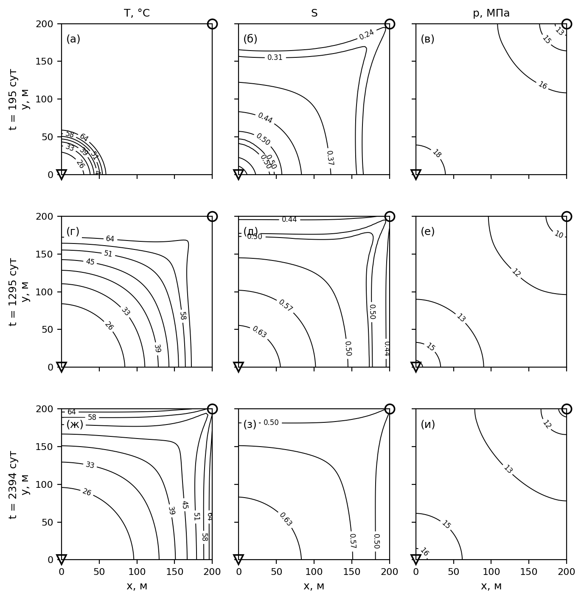
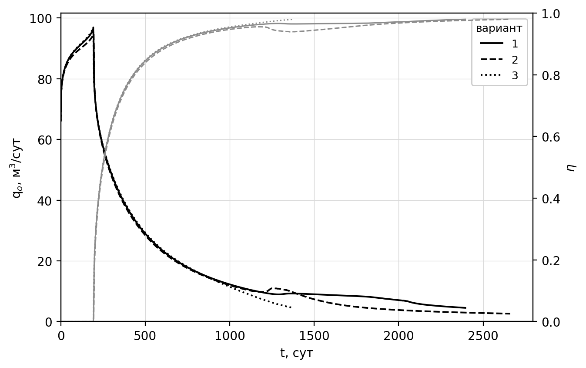
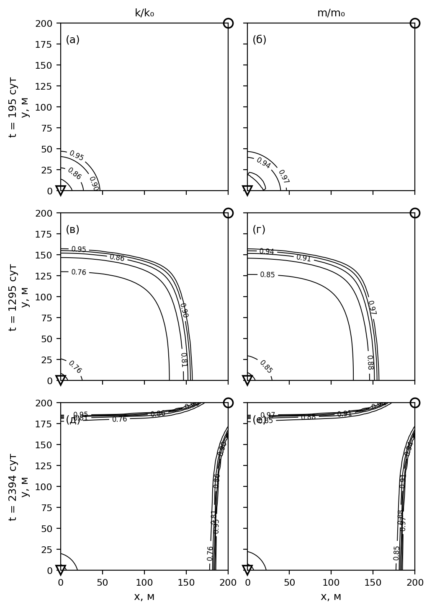
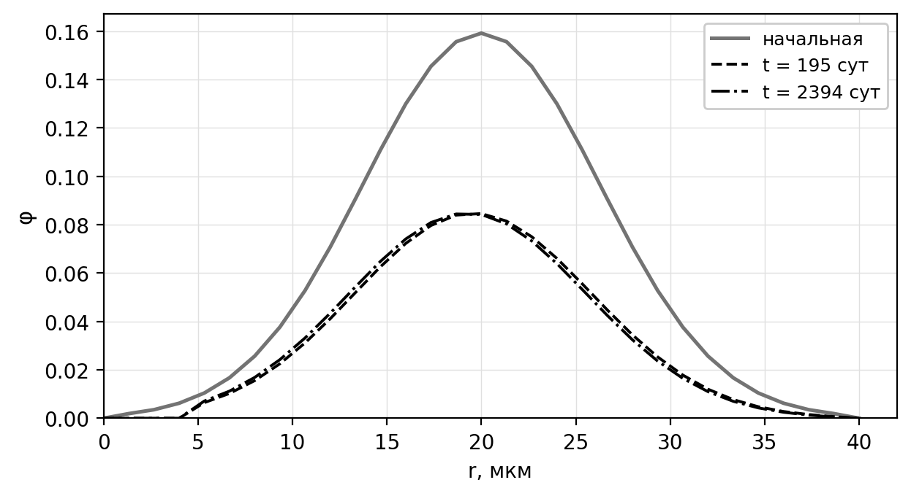
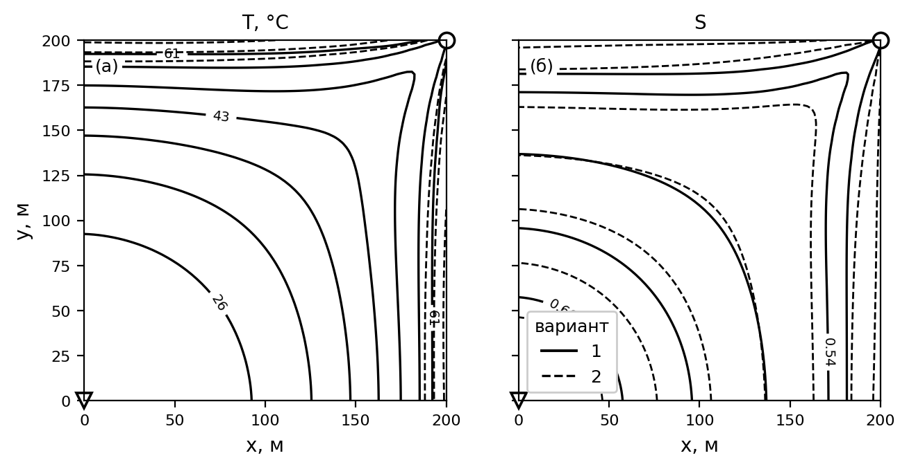
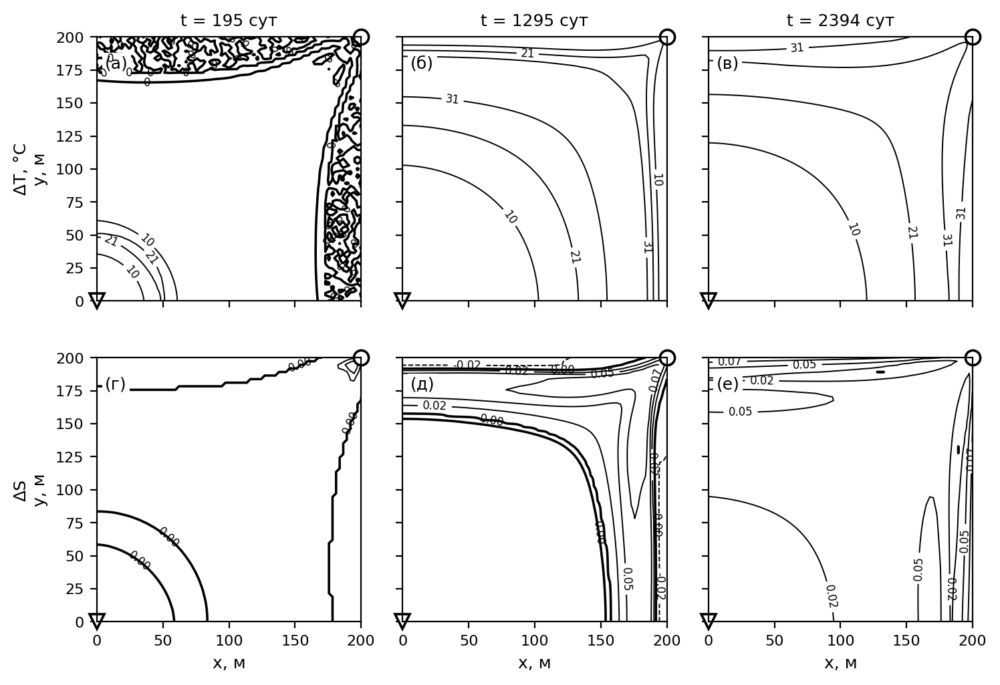
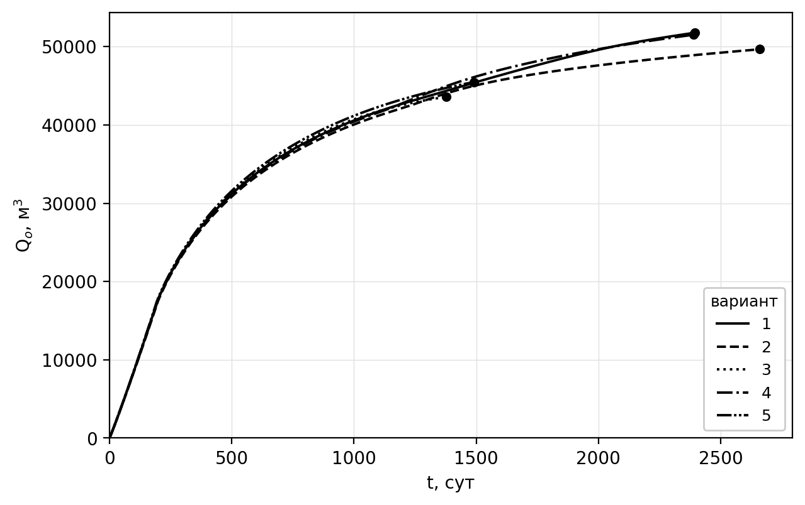

*УДК [TODO: указать]*

# ВЛИЯНИЕ ТЕПЛОПОТЕРЬ ЧЕРЕЗ КРОВЛЮ И ПОДОШВУ ПЛАСТА И СОДЕРЖАНИЯ РАСТВОРЕННОГО ПАРАФИНА НА ПОКАЗАТЕЛИ РАЗРАБОТКИ ПРИ ЗАВОДНЕНИИ ХОЛОДНОЙ ВОДОЙ

**[TODO: И. О. Фамилия]**

*[TODO: полное название учреждения без сокращений]*

*[TODO: почтовый адрес, город, страна, индекс]*

*E-mail: [TODO]*

Поступила в редакцию [TODO: дата]

Численно исследовано влияние теплообмена через кровлю и подошву пласта и содержания растворенного парафина на показатели разработки нефтяной залежи при заводнении холодной водой. Использована модель двухфазной неизотермической многокомпонентной фильтрации, в которой нефтяная фаза представлена бинарной смесью нефти и парафина, равновесие между растворенным и кристаллическим парафином описано теорией идеального раствора, а кольматация порового пространства — эволюцией функции распределения пор по размерам. Вязкость нефтяной фазы учитывает как температурную зависимость жидкой основы, так и вклад взвешенных кристаллов по соотношению Кригера—Догерти. Теплообмен с вмещающими породами учитывается полуаналитически методом Винсома—Вестервельда и, для сопоставления, по схеме Ловерье. Уравнения дискретизированы методом контрольных объемов, для давления и насыщенности применен метод IMPES. Установлено, что при закачке воды с температурой ниже пластовой вмещающие породы служат для пласта источником теплоты, поэтому пренебрежение теплообменом занижает среднюю температуру пласта на 18.6°C, коэффициент извлечения нефти — на 4.1% и завышает длительность разработки на 11.1%. По полному факторному плану разделены вклады теплообмена и парафина: по коэффициенту извлечения они практически аддитивны, причем содержание парафина влияет втрое сильнее, а по длительности разработки эффект теплообмена меняет знак в зависимости от наличия парафина. Расхождение между двумя моделями теплообмена не превышает 0.5%, что на порядок меньше исследуемого эффекта.

**Ключевые слова:** неизотермическая фильтрация, теплопотери в кровлю и подошву, парафиновые отложения, кольматация, численное моделирование

# ВВЕДЕНИЕ

Заводнение остается основным способом поддержания пластового давления при разработке нефтяных месторождений. Температура закачиваемой воды, как правило, ниже пластовой, поэтому вытеснение сопровождается формированием температурного поля, существенно неоднородного по площади залежи. Для нефтей, содержащих растворенный парафин, охлаждение имеет прямые технологические последствия: при снижении температуры ниже точки насыщения парафин кристаллизуется, твердые частицы осаждаются на поверхности пор и блокируют поровые каналы, что ухудшает фильтрационно-емкостные свойства коллектора [1–3].

С термодинамической точки зрения продуктивный пласт представляет собой открытую систему, обменивающуюся энергией с окружением по трем каналам. Первый — конвективный перенос тепла фильтрационным потоком, определяющий скорость продвижения температурного фронта. Второй — кондуктивный отвод тепла во вмещающие породы кровли и подошвы, представляющие собой практически неограниченные тепловые резервуары. Третий — выделение и поглощение скрытой теплоты фазового перехода при кристаллизации и растворении парафина. Соотношение этих механизмов определяет температурное поле, а через сильную зависимость вязкости нефти от температуры — подвижность фаз и, в конечном счете, все показатели разработки.

Второй из перечисленных каналов в моделях фильтрации нередко опускается: кровля и подошва считаются теплоизолированными, а уравнение энергии решается только в пределах продуктивного интервала. Между тем для маломощных пластов отношение площади теплообмена с вмещающими породами к объему залежи велико, и теплообмен с ними сопоставим по величине с конвективным переносом [4]. Существенно, что при закачке холодной воды знак этого теплообмена противоположен привычному для тепловых методов увеличения нефтеотдачи: вмещающие породы, сохраняющие начальную пластовую температуру, служат для остывающего пласта не стоком, а источником тепла. Пренебрежение ими поэтому занижает расчетную температуру пласта и смещает прогноз показателей разработки.

Классическое решение задачи о переносе тепла в пласте с учетом потерь во вмещающие породы получено Ловерье [5]; оно основано на представлении кровли и подошвы полубесконечными массивами, прогреваемыми одномерной теплопроводностью, и приводит к потоку, убывающему как $t^{-1/2}$. Тот же подход использован при расчете температурного поля пласта для плоского фильтрационного течения [6]. Точный учет теплопотерь требует свертки всей истории температуры на границе пласта, что при численном решении означает рост объема вычислений и памяти пропорционально времени. Винсом и Вестервельд [7] предложили заменить свертку пробным профилем температуры во вмещающих породах с двумя свободными параметрами; метод хранит одно поле состояния на ячейку и получил широкое распространение в симуляторах неизотермической фильтрации [8].

Моделированию выпадения парафина при заводнении посвящен ряд работ [9–14]. Для описания равновесия между растворенным и кристаллическим парафином применяются как теория реальных растворов, так и более простая модель идеального раствора бинарной смеси [12, 13]. Интенсивность отложения частиц обычно представляется комбинацией трех независимых факторов: осаждения частиц на стенках пор, выноса отложений потоком и блокирования поровых каналов [9–11, 14]. Изменение проницаемости при этом связывается с пористостью степенной зависимостью типа Козени—Кармана [15] либо рассчитывается непосредственно по функции распределения пор по размерам [16, 17].

Цель настоящей работы — количественно оценить погрешность прогноза показателей разработки, вносимую пренебрежением теплопотерями через кровлю и подошву пласта и содержанием растворенного парафина в нефти, а также разделить вклады этих двух факторов.

# МАТЕМАТИЧЕСКАЯ МОДЕЛЬ

Рассматривается двухфазная неизотермическая многокомпонентная фильтрация. Жидкость в пласте представлена двумя фазами и тремя псевдокомпонентами. Нефть и вода образуют две несмешивающиеся фазы; нефтяная фаза состоит из двух псевдокомпонентов — нефти и парафина. Жидкости считаются несжимаемыми, массообмен между водной и нефтяной фазами отсутствует.

Уравнения баланса массы записываются для каждого псевдокомпонента. Для воды и нефтяного компонента они имеют вид

$$\frac{\partial}{\partial t}\left(m \mathrm{\rho}_w S_w\right) + \nabla\cdot\left(\mathrm{\rho}_w \mathbf{U}_w\right) = q_w \mathrm{\rho}_w, \qquad (1)$$

$$\frac{\partial}{\partial t}\left(w_o m \mathrm{\rho}_o S_o\right) + \nabla\cdot\left(w_o \mathrm{\rho}_o \mathbf{U}_o\right) = w_o q_o \mathrm{\rho}_o, \qquad (2)$$

где $w_o$ — массовая доля нефтяного компонента в нефтяной фазе; $\mathbf{U}_w$, $\mathbf{U}_o$ — скорости фильтрации водной и нефтяной фаз; $S_w$, $S_o$ — водо- и нефтенасыщенность; $\mathrm{\rho}_w$, $\mathrm{\rho}_o$ — плотности фаз; $q_w$, $q_o$ — дебиты скважин по воде и нефти; $m$ — пористость.

Парафин может находиться в растворенном состоянии, во взвешенном состоянии в виде частиц и в отложенном на поверхности пор виде. Уравнение баланса его массы записывается как [11]

$$\frac{\partial}{\partial t}\left(w_{ps} m \mathrm{\rho}_p S_o + w_p m \mathrm{\rho}_o S_o\right) + \nabla\cdot\left(w_{ps}\mathrm{\rho}_p \mathbf{U}_o + w_p \mathrm{\rho}_o \mathbf{U}_o\right) = q_p \mathrm{\rho}_p + q_o\left(w_p \mathrm{\rho}_o + w_{ps}\mathrm{\rho}_p\right), \qquad (3)$$

где $w_{ps}$ — массовая доля взвешенного парафина в нефтяной фазе; $w_p$ — массовая доля растворенного парафина; $\mathrm{\rho}_p$ — плотность парафина; $q_p$ — скорость отложения парафина в объеме пористой среды.

Движение фаз описывается законом Дарси; капиллярные и гравитационные силы не учитываются:

$$\mathbf{U}_i = -\frac{k f_i}{\mathrm{\mu}_i}\nabla P, \qquad i = o,\, w, \qquad (4)$$

где $k$ — абсолютная проницаемость; $f_o$, $f_w$ — относительные фазовые проницаемости; $\mathrm{\mu}_o$, $\mathrm{\mu}_w$ — динамические вязкости; $P$ — давление.

В рамках однотемпературной модели баланс полной энергии системы имеет вид

$$\begin{aligned}
\frac{\partial}{\partial t}&\Big[m\mathrm{\rho}_w S_w C_w T + (1-w_{ps})m\mathrm{\rho}_o S_o C_o T + w_{ps} m \mathrm{\rho}_p S_o C_p T + (1-m)\mathrm{\rho}_f C_f T\Big] +\\
&+ \nabla\cdot\Big[\mathrm{\rho}_w \mathbf{U}_w C_w T + (1-w_{ps})\mathrm{\rho}_o \mathbf{U}_o C_o T + w_{ps}\mathrm{\rho}_p \mathbf{U}_o C_p T\Big] =\\
&= \nabla\cdot\Big[\big(m S_w K_w + (1-w_{ps}) m S_o K_o + w_{ps} m S_o K_p + (1-m)K_f\big)\nabla T\Big] +\\
&\quad + q_o \mathrm{\rho}_o C_o T + q_w \mathrm{\rho}_w C_w T + q_l,
\end{aligned} \qquad (5)$$

где $C_w$, $C_o$, $C_p$, $C_f$ — удельные теплоемкости воды, нефти, кристаллического парафина и породы; $K_w$, $K_o$, $K_p$, $K_f$ — соответствующие теплопроводности; $\mathrm{\rho}_f$ — плотность породы; $T$ — температура; $q_l$ — объемная плотность потерь тепла через кровлю и подошву пласта.

Равновесие между растворенным и кристаллическим парафином описывается уравнением теории идеального раствора для бинарной смеси [9]:

$$w_{ps} = w_p \exp\left[\frac{\mathrm{\alpha}}{R}\left(\frac{1}{T} - \frac{1}{T_m}\right)\right], \qquad (6)$$

где $\mathrm{\alpha}$ — скрытая теплота плавления парафина; $T_m$ — температура кристаллизации; $R$ — универсальная газовая постоянная.

## Теплопотери через кровлю и подошву пласта

Боковые границы области считаются непроницаемыми и теплоизолированными. Кровля и подошва непроницаемы, но не теплоизолированы: через них происходит кондуктивный отвод тепла во вмещающие породы. Прямое моделирование вмещающих толщ требует расширения расчетной области в вертикальном направлении и существенно увеличивает объем вычислений, поэтому теплообмен учитывается полуаналитически, через объемный сток $q_l$ в уравнении (5).

Вмещающие породы представляются полубесконечными массивами с постоянными теплофизическими свойствами: плотностью $\mathrm{\rho}_{ff}$, теплоемкостью $C_{ff}$ и теплопроводностью $K_{ff}$; температуропроводность $\mathrm{\alpha}_{ff} = K_{ff}/(C_{ff}\mathrm{\rho}_{ff})$. Теплоперенос в них считается одномерным и направленным по нормали к границам пласта, что оправдано при малом отношении толщины пласта к характерному размеру области.

В приближении Ловерье температура на границе пласта считается постоянной, а отклик полубесконечного массива на ступенчатое воздействие дает плотность теплового потока с единицы площади $K_{ff}(T - T_0)\big/\sqrt{\mathrm{\pi}\mathrm{\alpha}_{ff}t}$. Переход к единице объема пласта дает

$$q_l = \frac{2 K_{ff}\left(T - T_0\right)}{h\sqrt{\mathrm{\pi}\mathrm{\alpha}_{ff}t}}, \qquad (7)$$

где $h$ — толщина пласта, $T_0$ — начальная температура; множитель 2 учитывает кровлю и подошву. Приближение не хранит информации о предыстории и завышает длительность прогрева пород под уже пройденными температурным фронтом ячейками.

Точное выражение для потока представляет собой свертку истории температуры границы с ядром $\left(t-\mathrm{\tau}\right)^{-1/2}$, вычисление которой требует объема памяти и работы, растущих пропорционально времени счета. Метод Винсома—Вестервельда заменяет свертку пробным профилем температуры во вмещающих породах

$$T(z) - T_0 = \left(\Delta T_b + p z + q z^2\right)\exp\left(-z/d\right), \qquad d = \tfrac{1}{2}\sqrt{\mathrm{\alpha}_{ff}t}, \qquad (8)$$

где $z$ — расстояние от границы пласта вглубь вмещающих пород, $\Delta T_b = T - T_0$ — перегрев на границе. Параметры $p$ и $q$ определяются из двух условий: выполнения уравнения теплопроводности на границе

$$\frac{\Delta T_b}{d^2} - \frac{2p}{d} + 2q = \frac{1}{\mathrm{\alpha}_{ff}}\frac{\partial T}{\partial t} \qquad (9)$$

и равенства интеграла профиля фактически накопленной во вмещающих породах энергии

$$\Delta T_b\, d + p\, d^2 + 2 q\, d^3 = E_{ff}. \qquad (10)$$

Величина $E_{ff}$ — единственная переменная состояния метода, накапливаемая независимо в каждой ячейке. Исключение $q$ из (9), (10) дает замкнутое выражение для $p$, после чего объемный сток тепла определяется как

$$q_l = \frac{2 K_{ff}}{h}\left(\frac{\Delta T_b}{d} - p\right). \qquad (11)$$

Случай теплоизолированных кровли и подошвы соответствует $q_l \equiv 0$.

## Модель пористой среды

Пористая среда рассматривается как система цилиндрических капилляров разного диаметра с фиктивными сужениями — горлами. Приняты следующие допущения: отношение радиуса горла к радиусу канала $\mathrm{\gamma}$ одинаково для всех капилляров и сохраняется в процессе кольматации; частицы парафина имеют шарообразную форму одинакового диаметра $d_p$; количество оседающих частиц пропорционально их долям в движущейся фазе; капилляр полностью блокируется, если размер частиц не меньше диаметра горловины $\mathrm{\gamma} r$; собственная пористость осевших частиц пренебрежимо мала; доля капилляров, занятых фазой, пропорциональна насыщенности этой фазой [18]. Вынос осевших частиц потоком (суффозия) не учитывается.

Скорость сужения порового канала, вызванного оседанием частиц, и скорость его блокирования принимаются в виде [13]

$$\mathrm{\upsilon}_r = -w_{ps}\left(S_o - S_o^*\right)^2 \mathrm{\upsilon}_{mo}\left(\frac{D_p^2}{r L_k}\right)^{1/3}, \qquad (12)$$

$$\mathrm{\upsilon}_b = \begin{cases} \left(S_o - S_o^*\right)\dfrac{6\mathrm{\beta} r^2 w_{ps}\mathrm{\upsilon}_{mo}\mathrm{\varphi}}{d_p^3}, & r \le d_p/(2\mathrm{\gamma}),\\[2mm] 0, & r > d_p/(2\mathrm{\gamma}), \end{cases} \qquad (13)$$

где $L_k$ — средняя длина порового канала; $D_p$ — коэффициент диффузии частиц; $\mathrm{\upsilon}_{mo}$ — средняя скорость движения нефти в канале; $\mathrm{\beta}$ — доля блокируемых каналов; $S_o^*$ — остаточная нефтенасыщенность.

Распределение капилляров по радиусам задается функцией $\mathrm{\varphi}(r,t)$ — долей капилляров радиуса $r$ в момент времени $t$; ее начальное распределение $\mathrm{\varphi}(r,0)=\mathrm{\varphi}_0(r)$ считается известным. Эволюция функции описывается уравнением [18]

$$\frac{\partial \mathrm{\varphi}}{\partial t} + \frac{\partial\left(\mathrm{\upsilon}_r \mathrm{\varphi}\right)}{\partial r} + \mathrm{\upsilon}_b = 0. \qquad (14)$$

Структурные изменения порового пространства меняют динамическую пористость и абсолютную проницаемость. Текущие значения представляются в виде $m = m_f m_0$ и $k = k_f k_0$, где $m_0$, $k_0$ — начальные значения, а коэффициенты определяются через просветность и модель параллельных капилляров с законом Пуазейля [13]:

$$m_f = \frac{\int_0^{\infty} r^2 \mathrm{\varphi}(r)\,dr}{\int_0^{\infty} r^2 \mathrm{\varphi}_0(r)\,dr}, \qquad k_f = \frac{\int_0^{\infty} r^4 \mathrm{\varphi}(r)\,dr}{\int_0^{\infty} r^4 \mathrm{\varphi}_0(r)\,dr}. \qquad (15)$$

Скорость массообмена парафина в пористой среде складывается из оседания частиц на поверхности пор и блокирования поровых каналов [9]:

$$q_p = 2m\frac{\int_0^{\infty} r\,\mathrm{\upsilon}_r(r)\mathrm{\varphi}(r)\,dr}{\int_0^{\infty} r^2\mathrm{\varphi}(r)\,dr} + w_{ps}m\frac{\int_0^{\infty} r\,\mathrm{\upsilon}_b(r)\mathrm{\varphi}(r)\,dr}{\int_0^{\infty} r^2\mathrm{\varphi}(r)\,dr}. \qquad (16)$$

# ПОСТАНОВКА ЗАДАЧИ И ПАРАМЕТРЫ РАСЧЕТОВ

Рассматривается прямоугольная область $\Omega = [0, L_x]\times[0, L_y]\times[0, L_z]$, представляющая собой элемент симметрии пятиточечной системы заводнения. Пласт однородный. Нагнетательная и добывающая скважины расположены в точках $(0,\, 0)$ и $(L_x, L_y)$ соответственно, вертикальны и совершенны по степени и характеру вскрытия, имеют радиус $r_w$ и работают в режиме заданных забойных давлений $p_{inj}$ и $p_{prod}$. Начальная температура пласта $T = T_0$, температура нагнетаемой воды $T = T_{inj}$. Расчет ведется до достижения предельной обводненности добывающей скважины 98%.

Температура кристаллизации парафина вычисляется по корреляции [19]

$$T_m = 101.35 + 0.02617 M_r - \frac{20172}{M_r}, \qquad (17)$$

а вязкость воды — по корреляции Фогеля [20]

$$\mathrm{\mu}_w = 2.414\times 10^{-5}\cdot 10^{\,247.8/(T + 133.15)}. \qquad (18)$$

Вязкость нефтяной фазы складывается из двух вкладов. Вязкость жидкой основы задается уравнением Аррениуса, записанным через опорную точку, что разделяет уровень вязкости при пластовой температуре и крутизну ее температурной зависимости. Выпавшие кристаллы парафина образуют в жидкой основе суспензию и дополнительно повышают вязкость; этот вклад учитывается соотношением Кригера—Догерти [21]:

$$\mathrm{\mu}_o = \mathrm{\mu}_o^{ref}\exp\left[\frac{E_a}{R}\left(\frac{1}{T} - \frac{1}{T_{ref}}\right)\right]\left(1 - \frac{\mathrm{\phi}_w}{\mathrm{\phi}_{max}}\right)^{-2.5\,\mathrm{\phi}_{max}}, \qquad (19)$$

где $E_a$ — энергия активации вязкого течения; $\mathrm{\mu}_o^{ref}$ — вязкость нефти при опорной температуре $T_{ref}$; $\mathrm{\phi}_{max}$ — предельная объемная доля кристаллов, отвечающая плотной упаковке; $\mathrm{\phi}_w$ — текущая объемная доля кристаллов, связанная с их массовой долей соотношением

$$\mathrm{\phi}_w = \frac{w_{ps}/\mathrm{\rho}_p}{w_{ps}/\mathrm{\rho}_p + \left(1 - w_{ps}\right)/\mathrm{\rho}_o}. \qquad (20)$$

Учет этого вклада замыкает связь между тепловой и парафиновой частями модели: охлаждение пласта вызывает кристаллизацию согласно (6), а кристаллы, помимо кольматации порового пространства, снижают подвижность нефтяной фазы. При принятом содержании парафина 5% масс. объемная доля кристаллов не превышает 0.05, поэтому множитель Кригера—Догерти не превосходит 1.13, и определяющим остается температурный вклад: при охлаждении с 70 до 20°C вязкость нефти возрастает в 4.5 раза.

Значения параметров пласта, флюидов и вмещающих пород приведены в табл. 1.

Таблица 1. Параметры расчетов

| Параметр | Обозначение | Значение |
|---|---|---|
| Размеры области | $L_x \times L_y$ | 200 × 200 м |
| Толщина пласта | $h$ | 10 м |
| Число узлов сетки | $N_x \times N_y$ | 75 × 75 |
| Число узлов по радиусам капилляров | $N_r$ | 31 |
| Давление на нагнетательной скважине | $p_{inj}$ | 200 бар |
| Давление на добывающей скважине | $p_{prod}$ | 50 бар |
| Радиус скважин | $r_w$ | 0.1 м |
| Начальная температура пласта | $T_0$ | 70°C |
| Температура нагнетаемой воды | $T_{inj}$ | 20°C |
| Начальная пористость | $m_0$ | 0.3 |
| Начальная проницаемость | $k_0$ | 200 мД |
| Плотность воды | $\mathrm{\rho}_w$ | 1000 кг/м³ |
| Плотность нефти | $\mathrm{\rho}_o$ | 860 кг/м³ |
| Плотность парафина | $\mathrm{\rho}_p$ | 900 кг/м³ |
| Плотность породы пласта | $\mathrm{\rho}_f$ | 2700 кг/м³ |
| Плотность вмещающих пород | $\mathrm{\rho}_{ff}$ | 2400 кг/м³ |
| Теплоемкость воды | $C_w$ | 4200 Дж/(кг °C) |
| Теплоемкость нефти | $C_o$ | 2000 Дж/(кг °C) |
| Теплоемкость парафина | $C_p$ | 2200 Дж/(кг °C) |
| Теплоемкость породы пласта | $C_f$ | 1000 Дж/(кг °C) |
| Теплоемкость вмещающих пород | $C_{ff}$ | 1000 Дж/(кг °C) |
| Теплопроводность воды | $K_w$ | 0.6 Вт/(м °C) |
| Теплопроводность нефти | $K_o$ | 0.12 Вт/(м °C) |
| Теплопроводность парафина | $K_p$ | 0.2 Вт/(м °C) |
| Теплопроводность породы пласта | $K_f$ | 1.8 Вт/(м °C) |
| Теплопроводность вмещающих пород | $K_{ff}$ | 2.0 Вт/(м °C) |
| Вязкость нефти в опорной точке | $\mathrm{\mu}_o^{ref}$ | 5.77 сП |
| Опорная температура для вязкости | $T_{ref}$ | 70°C |
| Энергия активации вязкого течения | $E_a$ | 25 кДж/моль |
| Предельная объемная доля кристаллов | $\mathrm{\phi}_{max}$ | 0.6 |
| Молекулярная масса парафина | $M_r$ | 350 г/моль |
| Отношение радиуса горла к радиусу канала | $\mathrm{\gamma}$ | 0.4 |
| Доля блокируемых каналов | $\mathrm{\beta}$ | 0.01 |
| Средняя длина порового канала | $L_k$ | 3 × 10⁻⁵ м |
| Диаметр частиц парафина | $d_p$ | 4 × 10⁻⁶ м |
| Коэффициент диффузии частиц | $D_p$ | 10⁻¹⁹ м²/с |
| Остаточная водонасыщенность | $S_w^*$ | 0.18 |
| Предельная водонасыщенность | $S_w^{max}$ | 0.70 |
| Показатель степени в модели Кори | $n$ | 2 |

Сопоставляются три основных варианта расчета, различающихся учетом теплопотерь и содержанием растворенного парафина, и дополнительный вариант, отличающийся от базового способом расчета теплопотерь (табл. 2).

Таблица 2. Варианты расчета

| Вариант | Теплопотери через кровлю и подошву | Модель теплопотерь | Содержание растворенного парафина $w_p$ |
|---|---|---|---|
| 1 | учитываются | Винсом—Вестервельд, (8)–(11) | 0.05 |
| 2 | не учитываются | $q_l \equiv 0$ | 0.05 |
| 3 | не учитываются | $q_l \equiv 0$ | 0 |
| 4 | учитываются | Ловерье, (7) | 0.05 |

## Метод решения

Дискретизация системы (1)—(5) выполнена методом контрольных объемов: исходные уравнения интегрируются по каждой ячейке сетки, внутри которой фильтрационно-емкостные свойства и термодинамические параметры считаются постоянными. Конвективные слагаемые аппроксимируются схемой против потока, что обеспечивает устойчивость решения и исключает нефизичные осцилляции вблизи скачков насыщенности.

Для уравнений давления и насыщенности применен метод IMPES: поле давления определяется неявно из решения системы линейных алгебраических уравнений, а насыщенность, температура и характеристики парафина рассчитываются явно по найденному полю давления. Шаг по времени подбирается на каждой итерации из фактического числа Куранта, что позволяет вести счет с максимально допустимым по условию устойчивости шагом. Матрица системы для давления при пятиточечном шаблоне является ленточной с полушириной $N_x$; она разлагается по Холецкому, причем фактор пересобирается не на каждом шаге, а промежуточные шаги досчитываются методом сопряженных градиентов с этим фактором в роли предобуславливателя. Уравнение (14) эволюции функции распределения пор по размерам решается по полностью неявной схеме, что снимает жесткие ограничения на шаг по времени. Общее описание применяемых численных подходов к моделированию гидродинамических процессов разработки приведено в [22].

# РЕЗУЛЬТАТЫ И ОБСУЖДЕНИЕ

## Заводнение с учетом теплообмена через кровлю и подошву

При принятой молекулярной массе парафина корреляция (17) дает температуру начала кристаллизации $T_m = 52.9$°C, то есть на 17.1°C ниже начальной пластовой и на 32.9°C выше температуры нагнетаемой воды. Кристаллизация начинается поэтому не у забоя нагнетательной скважины, а на некотором удалении от него — там, где температурный фронт успел охладить породу ниже $T_m$, но нефть еще не вытеснена водой.

В базовом варианте выделены три характерных момента: прорыв воды в добывающую скважину $t_1 = 195$ сут, достижение предельной обводненности 98% $t_3 = 2394$ сут и середина интервала между ними $t_2 = 1295$ сут, которой отвечает обводненность 0.967. Поля температуры, водонасыщенности и давления на эти моменты приведены на рис. 1.



Рис. 1. Поля температуры (а, г, ж), водонасыщенности (б, д, з) и давления (в, е, и) для варианта 1 на моменты времени t₁ = 195 сут (а–в), t₂ = 1295 сут (г–е) и t₃ = 2394 сут (ж–и). Треугольник — нагнетательная скважина, круг — добывающая. Числа на изолиниях — значения соответствующей величины; набор уровней единый для всех трех моментов времени.

Температурное поле (рис. 1а, 1г, 1ж) отстает от поля водонасыщенности (рис. 1б, 1д, 1з), причем отставание нарастает. На момент прорыва изолиния $S = 0.5$ продвинута вдоль диагонали области на 40.5 м, а изотерма $T = T_m$ — на 35.1 м; к моменту $t_2$ это соответственно 194.6 и 129.7 м, то есть разрыв между фронтами вырастает с 5 до 65 м. Причина в том, что часть теплоты закачиваемой воды расходуется на прогрев скелета породы, объемная теплоемкость которого сопоставима с теплоемкостью флюидов, а также в теплопритоке из вмещающих пород, возвращающем теплоту в остывшие ячейки. Средняя температура пласта снижается с 67.8°C на момент прорыва до 48.7°C к моменту $t_2$ и 39.7°C к моменту $t_3$.

Поле давления (рис. 1в, 1е, 1и) сохраняет монотонный характер на всем протяжении расчета: изобары располагаются приблизительно перпендикулярно диагонали, соединяющей скважины. Перепад составляет 8.58–19.39 МПа на момент $t_1$ и 7.40–18.45 МПа на момент $t_3$; снижение давления в окрестности нагнетательной скважины отражает падение приемистости из-за кольматации.

До прорыва воды дебит добывающей скважины по нефти растет и достигает максимума 96.4 м³/сут на 193 сут, после чего резко падает; к концу разработки он составляет 4.5 м³/сут (рис. 2). Коэффициент извлечения нефти на момент $t_3$ равен 0.5262 при накопленной добыче 51781 м³.



Рис. 2. Дебит добывающей скважины по нефти (черные линии, левая ось) и обводненность (серые линии, правая ось): 1 — теплообмен учитывается, wₚ = 0.05; 2 — теплообмен не учитывается, wₚ = 0.05; 3 — теплообмен не учитывается, wₚ = 0.

Выпадение парафина происходит в полосе между температурным и гидродинамическим фронтами: там температура уже ниже $T_m$, а нефть еще не вытеснена. Зона деградации фильтрационно-емкостных свойств поэтому не остается на месте, а перемещается вслед за фронтом вытеснения (рис. 3): минимум множителя проницаемости приходится на точку с координатами (14, 14) м на момент $t_1$, (81, 81) м на момент $t_2$ и (184, 184) м на момент $t_3$, а сам множитель снижается с 0.849 до 0.747 и далее до 0.712. Множитель пористости изменяется в тех же точках с 0.910 до 0.822.



Рис. 3. Множители проницаемости k/k₀ (а, в, д) и пористости m/m₀ (б, г, е) для варианта 1 на моменты времени t₁ = 195 сут (а, б), t₂ = 1295 сут (в, г) и t₃ = 2394 сут (д, е).

Это отличает рассматриваемую задачу от кольматации призабойной зоны нагнетательной скважины: у ее забоя нефть вытесняется раньше, чем порода успевает остыть ниже температуры кристаллизации, и отложения там не накапливаются. К моменту $t_3$ область с пониженной проницаемостью охватывает почти всю расчетную зону, кроме полосы у добывающей скважины, куда температурный фронт приходит последней.

Механизм кольматации на уровне отдельных капилляров показывает эволюция функции распределения пор по размерам в ячейке у нагнетательной скважины (рис. 4). Первыми выбывают капилляры с радиусом менее 5 мкм — те, что удовлетворяют условию блокирования $r \le d_p/(2\mathrm{\gamma})$; распределение при этом теряет левую ветвь. Одновременно уменьшается доля капилляров всех радиусов за счет сужения. Существенно, что кривые на моменты $t_1$ и $t_3$ практически совпадают: в этой ячейке структура порового пространства перестает меняться уже к 195 сут, поскольку нефть здесь вытеснена и источник частиц исчерпан.



Рис. 4. Функция распределения пор по размерам в ячейке у нагнетательной скважины: начальное распределение и распределения на моменты t₁ = 195 сут и t₃ = 2394 сут.

## Влияние учета теплообмена через кровлю и подошву

Расчет, отличающийся от базового только отсутствием теплообмена с вмещающими породами, дает существенно более холодный пласт: средняя температура на момент достижения предельной обводненности составляет 21.1°C против 39.7°C в базовом варианте, то есть занижена на 18.6°C. Причина в том, что при закачке холодной воды вмещающие породы, сохраняющие начальную пластовую температуру, служат для остывающего пласта источником теплоты, а не стоком. Пренебрежение этим теплопритоком эквивалентно предположению об идеальной теплоизоляции кровли и подошвы, физически не выполняющемуся для маломощных пластов.

Наложение изолиний обоих вариантов на момент $t_3$ (рис. 5) показывает масштаб расхождения. В базовом варианте температурное поле сохраняет выраженную структуру с диапазоном 20.0–66.5°C, тогда как без теплообмена пласт практически изотермичен и охлажден до температуры закачки: изотермы варианта 2 сжаты в узкую полосу у добывающей скважины. Фронт водонасыщенности при этом в варианте 2 продвинут дальше, что отражает более раннее обводнение.



Рис. 5. Изолинии температуры (а) и водонасыщенности (б) на момент t₃: 1 — теплообмен учитывается; 2 — теплообмен не учитывается. Отсутствие изотерм варианта 2 в основной части области означает, что пласт там охлажден до температуры закачки.

Пространственное распределение вносимой погрешности дают поля разности (рис. 6), вычисленные на одни и те же моменты физического времени. На момент прорыва варианты почти неразличимы: средняя разность температур составляет 1.1°C при максимальной 22.4°C в окрестности нагнетательной скважины. К моменту $t_2$ расхождение охватывает всю область — средняя разность 20.6°C при максимальной 41.5°C, — а к моменту $t_3$ несколько снижается до 18.3 и 33.7°C соответственно, поскольку базовый вариант к этому времени также успевает остыть. Разность водонасыщенности достигает 0.099.



Рис. 6. Разность полей температуры (а–в) и водонасыщенности (г–е) между вариантом 1 и вариантом 2 на моменты времени t₁ = 195 сут (а, г), t₂ = 1295 сут (б, д) и t₃ = 2394 сут (в, е). Положительные значения отвечают более высоким температуре и водонасыщенности при учете теплообмена; штриховые изолинии — отрицательным значениям, жирная линия — нулевому.

Занижение температуры влечет за собой завышение вязкости нефти. Согласно (19), при охлаждении с 70 до 20°C вязкость нефтяной фазы возрастает в 4.5 раза, тогда как вязкость воды по (18) увеличивается лишь в 2.5 раза. Отношение вязкостей, определяющее устойчивость вытеснения, при этом ухудшается: расчетное значение $\mathrm{\mu}_o/\mathrm{\mu}_w$ повышается с 14.4 при 70°C до 29.1 при 20°C. Следствием является менее полное вытеснение и заниженный коэффициент извлечения.

Количественно (табл. 3) пренебрежение теплообменом занижает коэффициент извлечения на 0.0215, или на 4.1% относительно базового значения, и завышает длительность разработки на 266 сут, или на 11.1%. Время прорыва воды при этом смещается лишь на 2 сут (1.3%): к моменту прорыва пласт остыть еще не успевает, и оба варианта в этот период практически неразличимы (рис. 2, 6а). Расхождение накапливается на поздней стадии, когда охлаждение охватывает большую часть области.

Таблица 3. Сопоставление показателей разработки

| Вариант | $t_1$, сут | $t_3$, сут | КИН | Накопленная добыча нефти, м³ | Средняя температура на $t_3$, °C | $\Delta$КИН, % | $\Delta t_3$, % |
|---|---|---|---|---|---|---|---|
| 1. Теплообмен учитывается, $w_p = 0.05$ | 195 | 2394 | 0.5262 | 51781 | 39.7 | — | — |
| 2. Теплообмен не учитывается, $w_p = 0.05$ | 198 | 2660 | 0.5048 | 49668 | 21.1 | −4.1 | +11.1 |
| 3. Теплообмен не учитывается, $w_p = 0$ | 195 | 1379 | 0.4430 | 43592 | 25.7 | −15.8 | −42.4 |
| 4. Теплообмен по схеме Ловерье, $w_p = 0.05$ | 195 | 2389 | 0.5236 | 51524 | 37.4 | −0.5 | −0.2 |
| 5. Теплообмен учитывается, $w_p = 0$ | 193 | 1491 | 0.4623 | 45488 | 44.0 | −12.2 | −37.7 |

## Разделение вкладов теплообмена и содержания парафина

Сопоставление базового варианта с расчетом без теплообмена и без парафина (вариант 3) дает суммарное смещение: коэффициент извлечения занижается на 0.0832, или на 15.8%, а длительность разработки сокращается на 1016 сут. Однако такое сопоставление не позволяет разделить вклады двух факторов, поскольку разность вариантов, различающихся сразу по двум признакам, допускает произвольное разложение. Для разделения вкладов рассчитан недостающий вариант полного факторного плана — с учетом теплообмена, но без парафина (вариант 5). Результаты разложения приведены в табл. 4, динамика накопленной добычи по всем вариантам — на рис. 7.



Рис. 7. Накопленная добыча нефти: 1 — теплообмен учитывается, wₚ = 0.05; 2 — теплообмен не учитывается, wₚ = 0.05; 3 — теплообмен не учитывается, wₚ = 0; 4 — теплообмен по схеме Ловерье, wₚ = 0.05; 5 — теплообмен учитывается, wₚ = 0. Маркер отмечает момент достижения предельной обводненности.

Таблица 4. Разложение эффектов по полному факторному плану

| Показатель | Эффект теплообмена при наличии парафина | Эффект теплообмена без парафина | Эффект парафина при учете теплообмена | Эффект парафина без учета теплообмена | Взаимодействие |
|---|---|---|---|---|---|
| КИН | +0.0215 | +0.0193 | +0.0640 | +0.0617 | +0.0022 |
| $t_3$, сут | −266 | +113 | +903 | +1282 | −379 |

По коэффициенту извлечения эффекты близки к аддитивным: сумма главных эффектов составляет 0.0810 при суммарном изменении 0.0832, то есть на взаимодействие приходится 0.0022, или 2.7%. Содержание растворенного парафина влияет на коэффициент извлечения примерно втрое сильнее, чем теплообмен с вмещающими породами: 0.062–0.064 против 0.019–0.022.

По длительности разработки картина принципиально иная: эффект теплообмена меняет знак в зависимости от наличия парафина. При $w_p = 0.05$ учет теплообмена сокращает срок разработки на 266 сут, а при $w_p = 0$ — удлиняет его на 113 сут; взаимодействие достигает 379 сут и превосходит по модулю оба главных эффекта. Это объясняется тем, что теплоприток из вмещающих пород действует по двум конкурирующим каналам. Первый существует независимо от парафина: прогрев снижает отношение вязкостей, вытеснение становится более устойчивым, обводненность нарастает медленнее и предельное значение достигается позже. Второй возможен только при наличии парафина: прогрев уменьшает долю выпавших кристаллов, ослабляет кольматацию, восстанавливает проницаемость и тем самым ускоряет процесс. При принятом содержании парафина второй канал преобладает, и результирующий эффект меняет знак.

Отдельного пояснения требует направление влияния самого парафина. При фиксированной отсечке по обводненности наличие парафина повышает расчетный коэффициент извлечения: 0.5262 против 0.4623 при учете теплообмена. Это не свидетельствует о благоприятном влиянии парафинизации. Кольматация замедляет продвижение воды, и предельная обводненность достигается существенно позже — через 2394 сут вместо 1491, то есть процесс растягивается в 1.6 раза. Дополнительные 6.3 тыс. м³ нефти отбираются на поздней, высокообводненной стадии, когда дебит по нефти падает до 4.5 м³/сут, а на каждый кубометр нефти приходятся десятки кубометров попутно добываемой воды. Прирост коэффициента извлечения оплачивается сроком разработки и объемом подготовки воды, а не является преимуществом.

## Сопоставление моделей теплообмена с вмещающими породами

Расчет по схеме Ловерье (вариант 4) дает коэффициент извлечения 0.5236 против 0.5262 по методу Винсома—Вестервельда, то есть расхождение составляет 0.5%; длительность разработки различается на 5 сут (0.2%), средняя температура на момент $t_3$ — на 2.3°C. Схема Ловерье систематически занижает теплоприток из вмещающих пород, поскольку отсчитывает время их прогрева от начала расчета, а не от момента прихода температурного фронта в данную ячейку; в результате расчетный пласт оказывается несколько холоднее, а показатели разработки — ниже.

Существенно, что расхождение между двумя моделями теплообмена (0.5% по коэффициенту извлечения) на порядок меньше самого исследуемого эффекта учета теплообмена (4.1%). Следовательно, вывод о необходимости учитывать теплообмен с вмещающими породами не является следствием выбора конкретного приближения и сохраняется при любом из двух рассмотренных.

## Ограничения модели

Полученные оценки следует рассматривать с учетом принятых допущений.

Вклад кристаллов парафина в вязкость нефтяной фазы описан соотношением Кригера—Догерти для разбавленной суспензии. При содержании парафина 5% масс. объемная доля кристаллов не превышает 0.048 при предельной упаковке 0.6, поэтому соответствующий множитель не превосходит 1.13. Модель принципиально не воспроизводит гелеобразование, наблюдаемое для парафинистых нефтей ниже температуры застывания, где вязкость возрастает на порядки. Для нефтей с более высоким содержанием парафина и при температурах закачки, близких к температуре застывания, эффект парафина будет заметно сильнее полученного.

Энергия активации вязкого течения нефти принята равной 25 кДж/моль по типичному для парафинистых нефтей диапазону. Поскольку именно она определяет чувствительность подвижности нефти к температуре, а значит и величину эффекта теплообмена, уточнение этого параметра по замерам вязкости конкретной нефти изменит количественные оценки, оставляя качественные выводы в силе.

Вынос осевших частиц потоком (суффозия) не учитывался ввиду недостатка экспериментальных данных о взаимодействии частиц парафина с поверхностью пор. Его учет ослабил бы кольматацию и, следовательно, уменьшил бы вклад парафина.

Зависимость вязкости от давления не учитывалась. При перепаде 150 бар пьезовязкий эффект для нефти оценивается в 15–60% и, таким образом, сопоставим по величине с температурным; его включение требует отдельного обоснования выбора коэффициента пьезовязкости.

# ЗАКЛЮЧЕНИЕ

1. Численно исследовано влияние теплообмена через кровлю и подошву пласта и содержания растворенного парафина на показатели разработки при заводнении холодной водой. Показано, что при закачке воды с температурой ниже пластовой вмещающие породы служат для пласта источником теплоты, а не стоком, вследствие чего пренебрежение теплообменом занижает расчетную температуру пласта — в рассмотренной постановке на 18.6°C по среднему значению к моменту достижения предельной обводненности, а локально до 41.5°C в середине срока разработки.

2. Занижение температуры завышает вязкость нефти и ухудшает отношение подвижностей фаз. В результате пренебрежение теплообменом с вмещающими породами занижает расчетный коэффициент извлечения нефти на 4.1% и завышает длительность разработки на 11.1%. До прорыва воды оба варианта неразличимы; расхождение накапливается на поздней стадии.

3. Зона выпадения парафина не локализована у забоя нагнетательной скважины, а перемещается вслед за фронтом вытеснения, оставаясь в полосе между температурным и гидродинамическим фронтами. К концу разработки область пониженной проницаемости охватывает почти весь пласт, а множитель проницаемости снижается до 0.712.

4. Содержание растворенного парафина влияет на коэффициент извлечения примерно втрое сильнее теплообмена. По коэффициенту извлечения вклады обоих факторов практически аддитивны — на взаимодействие приходится 2.7% суммарного изменения.

5. По длительности разработки факторы существенно неаддитивны, причем эффект теплообмена меняет знак в зависимости от наличия парафина: при $w_p = 0.05$ учет теплообмена сокращает срок разработки на 266 сут, а при $w_p = 0$ — удлиняет на 113 сут. Причина — конкуренция двух каналов влияния температуры: улучшения отношения подвижностей и ослабления кольматации.

6. Сопоставление схемы Ловерье и метода Винсома—Вестервельда дает расхождение 0.5% по коэффициенту извлечения, что на порядок меньше исследуемого эффекта. Полученные выводы поэтому не зависят от выбора конкретной модели теплообмена с вмещающими породами.

7. При проектировании разработки парафинистых залежей маломощных пластов учет теплообмена через кровлю и подошву и содержания растворенного парафина необходим: без них прогноз коэффициента извлечения оказывается заниженным на 4% при пренебрежении теплообменом и на 16% при пренебрежении обоими факторами, а прогноз длительности разработки смещается на десятки процентов.

# СПИСОК ЛИТЕРАТУРЫ

1. *Коробов Г.Ю., Парфенов Д.В., Нгуен Ван Тханг.* Механизмы образования асфальтосмолопарафиновых отложений и факторы интенсивности их формирования // Известия Томского политехнического университета. Инжиниринг георесурсов. 2023. Т. 334. № 4. С. 103. https://doi.org/10.18799/24131830/2023/4/3940
2. *Mozes G.Y.* Paraffin Products: Properties, Technology, Applications. New York: Elsevier Scientific Publishing, 1982.
3. *Sandyga M.S., Struchkov I.A., Rogachev M.K.* Formation Damage Induced by Wax Deposition: Laboratory Investigations and Modeling // J. Petroleum Exploration and Production Technology. 2020. V. 10. P. 2541.
4. [TODO: источник — публикация в ТВТ по неизотермической фильтрации или тепломассопереносу в пористых средах; обязательна по правилам журнала, подобрать в архиве http://www.mathnet.ru/tvt]
5. *Lauwerier H.A.* The Transport of Heat in an Oil Layer Caused by the Injection of Hot Fluid // Appl. Sci. Res. Sect. A. 1955. V. 5. P. 145. [TODO: проверить выходные данные]
6. *Алишаев М.Г.* Расчет температурного поля пласта при инжекции жидкости для плоского фильтрационного течения // Изв. АН СССР. Механика жидкости и газа. 1979. № 1. С. 67.
7. *Vinsome P.K.W., Westerveld J.* A Simple Method for Predicting Cap and Base Rock Heat Losses in Thermal Reservoir Simulators // J. Canadian Petroleum Technology. 1980. V. 19. № 3. P. 87. [TODO: проверить выходные данные]
8. *Pruess K., Oldenburg C., Moridis G.* TOUGH2 User's Guide, Version 2. Report LBNL-43134. Berkeley: Lawrence Berkeley National Laboratory, 1999.
9. *Nikiforov A.I., Sadovnikov R.V., Nikiforov G.A.* Modeling of Paraffin Deposition During Oil Production by Cold Water Injection // Lobachevskii J. Math. 2022. V. 43. P. 1178.
10. *Wang Sh., Civan F.* Modeling Formation Damage by Asphaltene Deposition During Primary Oil Recovery // J. Energy Resour. Technol. 2005. V. 127. № 4. P. 310.
11. *Wang Sh., Civan F.* Model-Assisted Analysis of Simultaneous Paraffin and Asphaltene Deposition in Laboratory Core Tests // J. Energy Resour. Technol. 2005. V. 127. № 4. P. 318.
12. *Weingarten J.S., Euchner J.A.* Methods for Predicting Wax Precipitation and Deposition // SPE Production Engineering. 1988. V. 3. № 1. P. 121.
13. *Ring J.N., Wattenbarger R.A., Keating J.F., Peddibhotla S.* Simulation of Paraffin Deposition in Reservoirs // SPE Production & Facilities. 1994. V. 9. № 1. P. 36.
14. *Adeyanju O.A., Oyekunle L.O.* Simulation of Paraffin Deposition in Petroleum Reservoirs // Advanced Studies in Petroleum Engineering Science. 2010. V. 2. № 3. P. 1.
15. *Kozeny J.* Ueber kapillare Leitung des Wassers im Boden // Sitzungsber. Akad. Wiss. Wien. 1927. V. 136. № 2a. P. 271.
16. *Nikiforov A.I., Zakirov T.R., Nikiforov G.A.* Model for Treatment of Oil Reservoirs with Polymer-Dispersed Systems // Chem. Technol. Fuels Oils. 2015. V. 51. № 1. P. 105.
17. *Burdine N.T.* Relative Permeability Calculations from Pore Size Distribution Data // Petroleum Transactions AIME. 1953. V. 198. P. 71.
18. *Никифоров А.И., Никаньшин Д.П.* Перенос частиц двухфазным фильтрационным потоком // Математическое моделирование. 1998. Т. 10. № 6. С. 42.
19. *Mousavi Dehghani S.A., Vafaie Sefti M., Mehdizadeh H., Shirkhanloo H.* Solid Phase Equation of State Application for Wax Formation Prediction in Petroleum Mixtures // Iranian J. Chem. Eng. 2008. V. 5. № 2. P. 3.
20. *Чекалин А.Н., Конюхов В.М., Костерин А.В.* Двухфазная многокомпонентная фильтрация в нефтяных пластах сложной структуры. Казань: Казан. гос. ун-т, 2009. 180 с.
21. *Krieger I.M., Dougherty T.J.* A Mechanism for Non-Newtonian Flow in Suspensions of Rigid Spheres // Trans. Soc. Rheol. 1959. V. 3. P. 137. [TODO: проверить выходные данные]
22. *Каневская Р.Д.* Математическое моделирование гидродинамических процессов разработки месторождений углеводородов. М.–Ижевск: Институт компьютерных исследований, 2003. 128 с.

```{=openxml}
<w:p><w:r><w:br w:type="page"/></w:r></w:p>
```

# ПОДПИСИ К РИСУНКАМ


Рис. 1. Поля температуры (а, г, ж), водонасыщенности (б, д, з) и давления (в, е, и) для варианта 1 на моменты времени t₁ = 195 сут (а–в), t₂ = 1295 сут (г–е) и t₃ = 2394 сут (ж–и). Треугольник — нагнетательная скважина, круг — добывающая. Числа на изолиниях — значения соответствующей величины; набор уровней единый для всех трех моментов времени.


Рис. 2. Дебит добывающей скважины по нефти (черные линии, левая ось) и обводненность (серые линии, правая ось): 1 — теплообмен учитывается, wₚ = 0.05; 2 — теплообмен не учитывается, wₚ = 0.05; 3 — теплообмен не учитывается, wₚ = 0.


Рис. 3. Множители проницаемости k/k₀ (а, в, д) и пористости m/m₀ (б, г, е) для варианта 1 на моменты времени t₁ = 195 сут (а, б), t₂ = 1295 сут (в, г) и t₃ = 2394 сут (д, е).


Рис. 4. Функция распределения пор по размерам в ячейке у нагнетательной скважины: начальное распределение и распределения на моменты t₁ = 195 сут и t₃ = 2394 сут.


Рис. 5. Изолинии температуры (а) и водонасыщенности (б) на момент t₃: 1 — теплообмен учитывается; 2 — теплообмен не учитывается. Отсутствие изотерм варианта 2 в основной части области означает, что пласт там охлажден до температуры закачки.


Рис. 6. Разность полей температуры (а–в) и водонасыщенности (г–е) между вариантом 1 и вариантом 2 на моменты времени t₁ = 195 сут (а, г), t₂ = 1295 сут (б, д) и t₃ = 2394 сут (в, е). Положительные значения отвечают более высоким температуре и водонасыщенности при учете теплообмена; штриховые изолинии — отрицательным значениям, жирная линия — нулевому.


Рис. 7. Накопленная добыча нефти: 1 — теплообмен учитывается, wₚ = 0.05; 2 — теплообмен не учитывается, wₚ = 0.05; 3 — теплообмен не учитывается, wₚ = 0; 4 — теплообмен по схеме Ловерье, wₚ = 0.05; 5 — теплообмен учитывается, wₚ = 0. Маркер отмечает момент достижения предельной обводненности.
