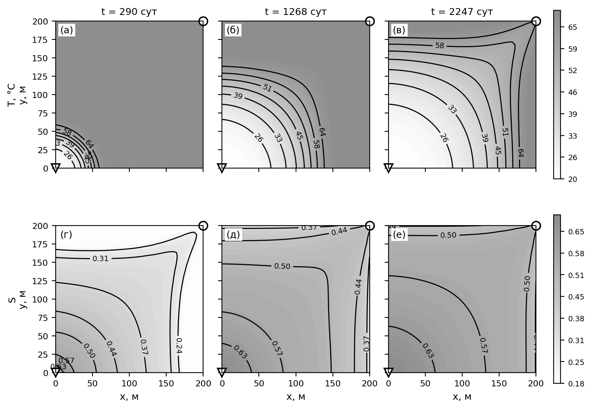
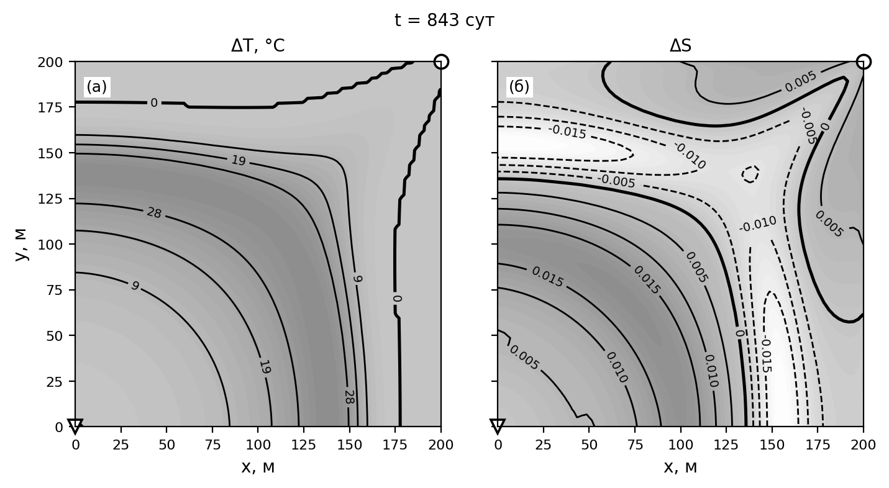

*УДК 532.546*

# ВЛИЯНИЕ ТЕПЛОПОТЕРЬ ЧЕРЕЗ КРОВЛЮ И ПОДОШВУ ПЛАСТА И СОДЕРЖАНИЯ РАСТВОРЕННОГО ПАРАФИНА НА ПОКАЗАТЕЛИ РАЗРАБОТКИ ПРИ ЗАВОДНЕНИИ ХОЛОДНОЙ ВОДОЙ

**А.И. Никифоров, И.С. Лазарев**

*Институт механики и машиностроения ФИЦ КазНЦ РАН, г.Казань, 420111,Россия*

*E-mail:  Lazarevigor1234@yandex.ru*

Поступила в редакцию 

Численно исследовано влияние теплообмена через кровлю и подошву пласта и содержания растворенного парафина на показатели разработки нефтяной залежи при заводнении холодной водой. Использована модель двухфазной неизотермической многокомпонентной фильтрации, в которой нефтяная фаза представлена бинарной смесью нефти и парафина, равновесие между растворенным и кристаллическим парафином описано теорией идеального раствора, а кольматация порового пространства — эволюцией функции распределения пор по размерам. Вязкость нефтяной фазы учитывает как температурную зависимость жидкой основы, так и вклад взвешенных кристаллов по соотношению Кригера—Догерти. Теплообмен с вмещающими породами учитывается полуаналитически методом Винсома—Вестервельда и, для сопоставления, по схеме Ловерье. Уравнения дискретизированы методом контрольных объемов, для давления и насыщенности применен метод IMPES. Установлено, что при закачке воды с температурой ниже пластовой вмещающие породы служат для пласта источником теплоты, поэтому пренебрежение теплообменом занижает среднюю температуру пласта на 17.2°C, коэффициент извлечения нефти — на 4.7% и длительность разработки — на 10.2%. По полному факторному плану разделены вклады теплообмена и парафина: при содержании парафина 20% масс. и температуре закачки 20°C его вклад в коэффициент извлечения не превышает 0.5%, поскольку зона кристаллизации отстает от фронта вытеснения и лежит в уже промытой водой части пласта, а кольматация локализована у нагнетательной скважины и снижает проницаемость не более чем на 9%. Схема Ловерье занижает теплоприток и воспроизводит около половины эффекта теплообмена, не меняя его знака и качественных выводов.

**Ключевые слова:** неизотермическая фильтрация, теплопотери в кровлю и подошву, парафиновые отложения, кольматация, численное моделирование

# ВВЕДЕНИЕ

Заводнение остается основным способом поддержания пластового давления при разработке нефтяных месторождений. Температура закачиваемой воды, как правило, ниже пластовой, поэтому вытеснение сопровождается формированием температурного поля, существенно неоднородного по площади залежи. Для нефтей, содержащих растворенный парафин, охлаждение имеет прямые технологические последствия: при снижении температуры ниже точки насыщения парафин кристаллизуется, твердые частицы осаждаются на поверхности пор и блокируют поровые каналы, что ухудшает фильтрационно-емкостные свойства коллектора [1–3].

С термодинамической точки зрения продуктивный пласт представляет собой открытую систему, обменивающуюся энергией с окружением по трем каналам. Первый — конвективный перенос тепла фильтрационным потоком, определяющий скорость продвижения температурного фронта. Второй — кондуктивный отвод тепла во вмещающие породы кровли и подошвы, представляющие собой практически неограниченные тепловые резервуары. Третий — выделение и поглощение скрытой теплоты фазового перехода при кристаллизации и растворении парафина. Соотношение этих механизмов определяет температурное поле, а через сильную зависимость вязкости нефти от температуры — подвижность фаз и, в конечном счете, все показатели разработки.

Второй из перечисленных каналов в моделях фильтрации нередко опускается: кровля и подошва считаются теплоизолированными, а уравнение энергии решается только в пределах продуктивного интервала. Между тем для маломощных пластов отношение площади теплообмена с вмещающими породами к объему залежи велико, и теплообмен с ними сопоставим по величине с конвективным переносом [4]. Существенно, что при закачке холодной воды знак этого теплообмена противоположен привычному для тепловых методов увеличения нефтеотдачи: вмещающие породы, сохраняющие начальную пластовую температуру, служат для остывающего пласта не стоком, а источником тепла. Пренебрежение ими поэтому занижает расчетную температуру пласта и смещает прогноз показателей разработки.

Классическое решение задачи о переносе тепла в пласте с учетом потерь во вмещающие породы получено Ловерье [5]; оно основано на представлении кровли и подошвы полубесконечными массивами, прогреваемыми одномерной теплопроводностью, и приводит к потоку, убывающему как $t^{-1/2}$. Тот же подход использован при расчете температурного поля пласта для плоского фильтрационного течения [6]. Точный учет теплопотерь требует свертки всей истории температуры на границе пласта, что при численном решении означает рост объема вычислений и памяти пропорционально времени. Винсом и Вестервельд [7] предложили заменить свертку пробным профилем температуры во вмещающих породах с двумя свободными параметрами; метод хранит одно поле состояния на ячейку и получил широкое распространение в симуляторах неизотермической фильтрации [8].

Моделированию выпадения парафина при заводнении посвящен ряд работ [9–14]. Для описания равновесия между растворенным и кристаллическим парафином применяются как модели реальных растворов [15–17], так и более простая модель идеального раствора бинарной смеси [12, 13]. Интенсивность отложения частиц обычно представляется комбинацией трех независимых факторов: осаждения частиц на стенках пор, выноса отложений потоком и блокирования поровых каналов [9–11, 14]. Изменение проницаемости при этом связывается с пористостью степенной зависимостью типа Козени—Кармана [18] либо рассчитывается непосредственно по функции распределения пор по размерам [19, 20].

Цель настоящей работы — количественно оценить погрешность прогноза показателей разработки, вносимую пренебрежением теплопотерями через кровлю и подошву пласта и содержанием растворенного парафина в нефти, а также разделить вклады этих двух факторов.

# МАТЕМАТИЧЕСКАЯ МОДЕЛЬ

Рассматривается двухфазная неизотермическая многокомпонентная фильтрация. Жидкость в пласте представлена двумя фазами и тремя псевдокомпонентами. Нефть и вода образуют две несмешивающиеся фазы; нефтяная фаза состоит из двух псевдокомпонентов — нефти и парафина. Жидкости считаются несжимаемыми, массообмен между водной и нефтяной фазами отсутствует.

Уравнения баланса массы записываются для каждого псевдокомпонента. Для воды и нефтяного компонента они имеют вид

$$\frac{\partial}{\partial t}\left(m \mathrm{\rho}_w S_w\right) + \nabla\cdot\left(\mathrm{\rho}_w \mathbf{U}_w\right) = q_w \mathrm{\rho}_w, \qquad (1)$$

$$\frac{\partial}{\partial t}\left(w_o m \mathrm{\rho}_o S_o\right) + \nabla\cdot\left(w_o \mathrm{\rho}_o \mathbf{U}_o\right) = w_o q_o \mathrm{\rho}_o - w_o \mathrm{\rho}_o q_{p2}, \qquad (2)$$

где $w_o$ — массовая доля нефтяного компонента в нефтяной фазе; $\mathbf{U}_w$, $\mathbf{U}_o$ — скорости фильтрации водной и нефтяной фаз; $S_w$, $S_o$ — водо- и нефтенасыщенность; $\mathrm{\rho}_w$, $\mathrm{\rho}_o$ — плотности фаз; $q_w$, $q_o$ — дебиты скважин по воде и нефти; $m$ — пористость; $q_{p2}$ — скорость блокирования поровых каналов, занятых нефтью (см. (16)): вместе с объемом канала из подвижной нефти уходят все ее компоненты в тех же долях $w_o$, $w_p$, $w_{ps}$.

Парафин может находиться в растворенном состоянии, во взвешенном состоянии в виде частиц и в отложенном на поверхности пор виде. Обе подвижные формы переносятся нефтяной фазой с одной и той же скоростью, поэтому для них достаточно одного уравнения баланса; в накоплении и потоке используется плотность нефтяной фазы $\mathrm{\rho}_o$ — та же, что и в (2), поскольку $w_o+w_p+w_{ps}=1$ являются массовыми долями одной и той же фазы. Уравнение баланса записывается как [11]

$$\frac{\partial}{\partial t}\left[m S_o\left(w_p+w_{ps}\right)\mathrm{\rho}_o\right] + \nabla\cdot\left[\left(w_p+w_{ps}\right)\mathrm{\rho}_o \mathbf{U}_o\right] = q_o\left(w_p+w_{ps}\right)\mathrm{\rho}_o - q_{p2}\left(w_p+w_{ps}\right)\mathrm{\rho}_o - q_{p1}\mathrm{\rho}_p, \qquad (3)$$

где $w_{ps}$ — массовая доля взвешенного парафина в нефтяной фазе; $w_p$ — массовая доля растворенного парафина; $\mathrm{\rho}_p$ — плотность кристаллического парафина; $q_{p1}$ — скорость отложения парафина на стенках пор (см. (16)): отлагается чистый парафин, поэтому этот сток несет его собственную плотность $\mathrm{\rho}_p$, тогда как блокирование каналов ($q_{p2}$) выводит из фильтрации весь объем канала вместе с нефтью плотности $\mathrm{\rho}_o$.

Движение фаз описывается законом Дарси; капиллярные и гравитационные силы не учитываются:

$$\mathbf{U}_i = -\frac{k f_i}{\mathrm{\mu}_i}\nabla P, \qquad i = o,\, w, \qquad (4)$$

где $k$ — абсолютная проницаемость; $f_o$, $f_w$ — относительные фазовые проницаемости; $\mathrm{\mu}_o$, $\mathrm{\mu}_w$ — динамические вязкости; $P$ — давление.

В рамках однотемпературной модели баланс полной энергии системы имеет вид

$$\begin{aligned}
\frac{\partial}{\partial t}&\Big[m\mathrm{\rho}_w S_w C_w T + m\mathrm{\rho}_o S_o c_o T + m\mathrm{\rho}_o S_o w_p\frac{\mathrm{\alpha}}{M_r} + \big((1-m_0)\mathrm{\rho}_f C_f + (m_0-m)\mathrm{\rho}_p C_p\big) T\Big] +\\
&+ \nabla\cdot\Big[\mathrm{\rho}_w \mathbf{U}_w C_w T + \mathrm{\rho}_o \mathbf{U}_o c_o T + \mathrm{\rho}_o \mathbf{U}_o w_p\frac{\mathrm{\alpha}}{M_r}\Big] =\\
&= \nabla\cdot\left(\mathrm{\Lambda}\nabla T\right) + q_w \mathrm{\rho}_w C_w T + q_o \mathrm{\rho}_o\left(c_o T + w_p\frac{\mathrm{\alpha}}{M_r}\right) + q_l,
\end{aligned} \qquad (5)$$

где в скважинных слагаемых для нагнетательной скважины вместо $T$ берется температура закачиваемой воды $T_{inj}$; $c_o = w_o C_o + (w_p+w_{ps})C_p$ — эффективная удельная теплоемкость нефтяной фазы: оба псевдокомпонента парафина, растворенный и взвешенный, несут теплоемкость кристаллического парафина $C_p$, а не $C_o$, поскольку это одно и то же вещество, различающееся лишь агрегатным состоянием; $\mathrm{\Lambda} = mS_wK_w + mS_o\big(w_oK_o+(w_p+w_{ps})K_p\big) + (1-m_0)K_f + (m_0-m)K_p$ — эффективная теплопроводность единицы объема пласта; $C_w$, $C_o$, $C_p$, $C_f$ — удельные теплоемкости воды, нефти, кристаллического парафина и породы; $K_w$, $K_o$, $K_p$, $K_f$ — соответствующие теплопроводности; $\mathrm{\rho}_f$ — плотность породы; $m_0$ — начальная пористость; $T$ — температура; $q_l$ — объемная плотность потерь тепла через кровлю и подошву пласта. Слагаемые с $(m_0-m)$ описывают выведенный из фильтрации объем — осевший парафин и содержимое заблокированных каналов, теплофизические свойства которого приняты равными свойствам кристаллического парафина, тогда как объем самой породы $(1-m_0)$ во времени не меняется. Третье слагаемое в квадратных скобках — скрытая теплота кристаллизации: удельная энтальпия растворенного парафина содержит теплоту плавления $\mathrm{\alpha}/M_r$ сверх энтальпии кристаллического, поэтому при растворении парафина теплота поглощается, а при кристаллизации выделяется автоматически, без отдельного источникового члена.

Равновесие между растворенным и кристаллическим парафином описывается моделью идеального раствора бинарной смеси нефть – твердый парафин [9, 13]: коэффициент распределения парафина между твердой и жидкой фазами берется по Вону [17] без слагаемых, связанных с изменением теплоемкости и удельного объема при плавлении, а коэффициенты активности приняты равными единице. Поскольку выпадающий парафин образует чистую твердую фазу [21], эта модель задает не прямую пропорцию между растворенным и взвешенным парафином, а предел растворимости — мольную долю парафина в насыщенном растворе, определяемую уравнением идеальной растворимости Шредера—ван Лаара [22]:

$$x_{sat}(T) = \min\left\{1,\ \exp\left[-\frac{\mathrm{\alpha}}{R}\left(\frac{1}{T} - \frac{1}{T_m}\right)\right]\right\}, \qquad T,\, T_m\ \text{— абсолютные}, \qquad (6.1)$$

где $\mathrm{\alpha}$ — скрытая теплота плавления парафина; $T_m$ — температура кристаллизации; $R$ — универсальная газовая постоянная. Мольная доля переводится в массовую через молярные массы парафина $M_r$ и нефтяного псевдокомпонента $M_o$; обозначив суммарную массовую долю парафина $w_{\mathrm{\Sigma}} = w_p + w_{ps}$, предел растворимости относится к сумме $w_o+w_p=1-w_{ps}$, поскольку взвешенные частицы в раствор не входят:

$$w_p^{sat} = \frac{\hat w}{1-\hat w}\left(1-w_{\mathrm{\Sigma}}\right), \qquad \hat w = \frac{x_{sat}M_r}{x_{sat}M_r+(1-x_{sat})M_o}. \qquad (6.2)$$

Избыток суммарной доли парафина $w_{\mathrm{\Sigma}}$ над пределом растворимости $w_p^{sat}$ переходит во взвешенное состояние, при недосыщении взвешенные частицы растворяются: $w_p=\min(w_{\mathrm{\Sigma}},\, w_p^{sat})$, $w_{ps}=w_{\mathrm{\Sigma}}-w_p$.

## Теплопотери через кровлю и подошву пласта

Боковые границы области считаются непроницаемыми и теплоизолированными. Кровля и подошва непроницаемы, но не теплоизолированы: через них происходит кондуктивный отвод тепла во вмещающие породы. Прямое моделирование вмещающих толщ требует расширения расчетной области в вертикальном направлении и существенно увеличивает объем вычислений, поэтому теплообмен учитывается полуаналитически, через объемный сток $q_l$ в уравнении (5).

Вмещающие породы представляются полубесконечными массивами с постоянными теплофизическими свойствами: плотностью $\mathrm{\rho}_{ff}$, теплоемкостью $C_{ff}$ и теплопроводностью $K_{ff}$; температуропроводность $\mathrm{\alpha}_{ff} = K_{ff}/(C_{ff}\mathrm{\rho}_{ff})$. Теплоперенос в них считается одномерным и направленным по нормали к границам пласта, что оправдано при малом отношении толщины пласта к характерному размеру области.

В приближении Ловерье температура на границе пласта считается постоянной, а отклик полубесконечного массива на ступенчатое воздействие дает плотность теплового потока с единицы площади $K_{ff}(T - T_0)\big/\sqrt{\mathrm{\pi}\mathrm{\alpha}_{ff}t}$. Переход к единице объема пласта дает

$$q_l = \frac{2 K_{ff}\left(T - T_0\right)}{h\sqrt{\mathrm{\pi}\mathrm{\alpha}_{ff}t}}, \qquad (7)$$

где $h$ — толщина пласта, $T_0$ — начальная температура; множитель 2 учитывает кровлю и подошву. Приближение не хранит информации о предыстории и завышает длительность прогрева пород под уже пройденными температурным фронтом ячейками.

Точное выражение для потока представляет собой свертку истории температуры границы с ядром $\left(t-\mathrm{\tau}\right)^{-1/2}$, вычисление которой требует объема памяти и работы, растущих пропорционально времени счета. Метод Винсома—Вестервельда заменяет свертку пробным профилем температуры во вмещающих породах

$$T(z) - T_0 = \left(\Delta T_b + p z + q z^2\right)\exp\left(-z/d\right), \qquad d = \tfrac{1}{2}\sqrt{\mathrm{\alpha}_{ff}t}, \qquad (8)$$

где $z$ — расстояние от границы пласта вглубь вмещающих пород, $\Delta T_b = T - T_0$ — перегрев на границе. Параметры $p$ и $q$ определяются из двух условий: выполнения уравнения теплопроводности на границе

$$\frac{\Delta T_b}{d^2} - \frac{2p}{d} + 2q = \frac{1}{\mathrm{\alpha}_{ff}}\frac{\partial T}{\partial t} \qquad (9)$$

и равенства интеграла профиля фактически накопленной во вмещающих породах энергии

$$\Delta T_b\, d + p\, d^2 + 2 q\, d^3 = E_{ff}. \qquad (10)$$

Величина $E_{ff}$ — единственная переменная состояния метода, накапливаемая независимо в каждой ячейке. Исключение $q$ из (9), (10) дает замкнутое выражение для $p$, после чего объемный сток тепла определяется как

$$q_l = \frac{2 K_{ff}}{h}\left(\frac{\Delta T_b}{d} - p\right). \qquad (11)$$

Случай теплоизолированных кровли и подошвы соответствует $q_l \equiv 0$.

## Модель пористой среды

Пористая среда рассматривается как система цилиндрических капилляров разного диаметра с фиктивными сужениями — горлами. Приняты следующие допущения: отношение радиуса горла к радиусу канала $\mathrm{\gamma}$ одинаково для всех капилляров и сохраняется в процессе кольматации; частицы парафина имеют шарообразную форму одинакового диаметра $d_p$; количество оседающих частиц пропорционально их долям в движущейся фазе; капилляр полностью блокируется, если размер частиц не меньше диаметра горловины $2\mathrm{\gamma} r$; собственная пористость осевших частиц пренебрежимо мала; доля капилляров, занятых фазой, пропорциональна насыщенности этой фазой [23]. Вынос осевших частиц потоком (суффозия) не учитывается.

Скорость сужения порового канала, вызванного оседанием частиц, и скорость его блокирования принимаются в виде [13]

$$\mathrm{\upsilon}_r = -w_{ps}\max\left(0,\, S_o - S_o^*\right)\left(\frac{2\mathrm{\upsilon}_{mo}D_p^2}{r L_k}\right)^{1/3}, \qquad (12)$$

$$\mathrm{\upsilon}_b = \begin{cases} \max\left(0,\, S_o - S_o^*\right)\dfrac{6\mathrm{\beta} r^2 w_{ps}\mathrm{\upsilon}_{mo}\mathrm{\varphi}}{d_p^3}, & r \le d_p/(2\mathrm{\gamma}),\\[2mm] 0, & r > d_p/(2\mathrm{\gamma}), \end{cases} \qquad (13)$$

где $L_k$ — средняя длина порового канала; $D_p$ — коэффициент диффузии частиц; $\mathrm{\upsilon}_{mo}$ — средняя скорость движения нефти в канале; $\mathrm{\beta}$ — доля блокируемых каналов; $S_o^*$ — остаточная нефтенасыщенность; функция $\max(0,\cdot)$ исключает нефизичное расширение каналов при $S_o<S_o^*$. Массовая доля взвешенных частиц $w_{ps}$ играет здесь роль их объемной концентрации в приближении $\mathrm{\rho}_p\approx\mathrm{\rho}_o$.

Распределение капилляров по радиусам задается функцией $\mathrm{\varphi}(r,t)$ — долей капилляров радиуса $r$ в момент времени $t$; ее начальное распределение $\mathrm{\varphi}(r,0)=\mathrm{\varphi}_0(r)$ считается известным. Эволюция функции описывается уравнением [23]

$$\frac{\partial \mathrm{\varphi}}{\partial t} + \frac{\partial\left(\mathrm{\upsilon}_r \mathrm{\varphi}\right)}{\partial r} + \mathrm{\upsilon}_b = 0. \qquad (14)$$

Структурные изменения порового пространства меняют динамическую пористость и абсолютную проницаемость. Текущие значения представляются в виде $m = m_f m_0$ и $k = k_f k_0$, где $m_0$, $k_0$ — начальные значения, а коэффициенты определяются через просветность и модель параллельных капилляров с законом Пуазейля [13]:

$$m_f = \frac{\int_0^{\infty} r^2 \mathrm{\varphi}(r)\,dr}{\int_0^{\infty} r^2 \mathrm{\varphi}_0(r)\,dr}, \qquad k_f = \frac{\int_0^{\infty} r^4 \mathrm{\varphi}(r)\,dr}{\int_0^{\infty} r^4 \mathrm{\varphi}_0(r)\,dr}. \qquad (15)$$

Скорость убыли порового объема складывается из двух вкладов — оседания частиц на поверхности пор ($q_{p1}$) и блокирования поровых каналов ($q_{p2}$) [9]:

$$q_{p1} = -2m\frac{\int_0^{\infty} r\,\mathrm{\upsilon}_r(r)\mathrm{\varphi}(r)\,dr}{\int_0^{\infty} r^2\mathrm{\varphi}(r)\,dr}, \qquad q_{p2} = m\frac{\int_0^{d_p/(2\mathrm{\gamma})} r^2\,\mathrm{\upsilon}_b(r)\,dr}{\int_0^{\infty} r^2\mathrm{\varphi}(r)\,dr}. \qquad (16)$$

Обе величины неотрицательны ($\mathrm{\upsilon}_r\le 0$, отсюда знак у $q_{p1}$; $\mathrm{\upsilon}_b\ge 0$, а множитель $w_{ps}$ уже учтен в (13) и не дублируется) и по построению в сумме равны скорости убыли пористости, $q_{p1}+q_{p2}=-\partial m/\partial t$, что следует из (14)–(15); разделять их необходимо потому, что осаждение выводит из фильтрации чистый парафин, а блокирование — весь объем канала вместе с нефтью (см. (2), (3)).

# ПОСТАНОВКА ЗАДАЧИ И ПАРАМЕТРЫ РАСЧЕТОВ

Рассматривается прямоугольная область $\Omega = [0, L_x]\times[0, L_y]\times[0, L_z]$, представляющая собой элемент симметрии пятиточечной системы заводнения. Пласт однородный. Нагнетательная и добывающая скважины расположены в точках $(0,\, 0)$ и $(L_x, L_y)$ соответственно, вертикальны и совершенны по степени и характеру вскрытия, имеют радиус $r_w$ и работают в режиме заданных забойных давлений $p_{inj}$ и $p_{prod}$. Начальная температура пласта $T = T_0$, температура нагнетаемой воды $T = T_{inj}$. Расчет ведется до достижения предельной обводненности добывающей скважины 98%.

Температура кристаллизации и скрытая теплота плавления парафина вычисляются по корреляциям Вона [17, 24]

$$T_m = 101.35 + 0.02617 M_r - \frac{20172}{M_r}\ [^\circ\text{C}], \qquad \mathrm{\alpha} = 0.1426\cdot M_r\cdot\left(T_m+273.15\right)\cdot 4.1868\ \left[\text{Дж/моль}\right], \qquad (17)$$

где температура кристаллизации в правой части второй формулы взята абсолютной, а множитель 4.1868 переводит теплоту плавления из калорий на моль (единицы исходной корреляции) в джоули; вязкость воды — по корреляции Фогеля [25]

$$\mathrm{\mu}_w = 2.414\times 10^{-5}\cdot 10^{\,247.8/(T + 133.15)}. \qquad (18)$$

Вязкость нефтяной фазы складывается из двух вкладов. Вязкость жидкой основы задается уравнением Аррениуса, записанным через опорную точку, что разделяет уровень вязкости при пластовой температуре и крутизну ее температурной зависимости. Выпавшие кристаллы парафина образуют в жидкой основе суспензию и дополнительно повышают вязкость; этот вклад учитывается соотношением Кригера—Догерти [26]:

$$\mathrm{\mu}_o = \mathrm{\mu}_o^{ref}\exp\left[\frac{E_a}{R}\left(\frac{1}{T} - \frac{1}{T_{ref}}\right)\right]\left(1 - \frac{\mathrm{\phi}_w}{\mathrm{\phi}_{max}}\right)^{-2.5\,\mathrm{\phi}_{max}}, \qquad (19)$$

где $E_a$ — энергия активации вязкого течения; $\mathrm{\mu}_o^{ref}$ — вязкость нефти при опорной температуре $T_{ref}$; $\mathrm{\phi}_{max}$ — предельная объемная доля кристаллов, отвечающая плотной упаковке; $\mathrm{\phi}_w$ — текущая объемная доля кристаллов, связанная с их массовой долей соотношением

$$\mathrm{\phi}_w = \frac{w_{ps}/\mathrm{\rho}_p}{w_{ps}/\mathrm{\rho}_p + \left(1 - w_{ps}\right)/\mathrm{\rho}_o}. \qquad (20)$$

Учет этого вклада замыкает связь между тепловой и парафиновой частями модели: охлаждение пласта вызывает кристаллизацию согласно (6.1)–(6.2), а кристаллы, помимо кольматации порового пространства, снижают подвижность нефтяной фазы. Содержание растворенного парафина принято равным 20% масс.: при принятой молекулярной массе нефтяного псевдокомпонента $M_o$ предел растворимости (6.2) при температуре закачки 20°C — самой низкой достижимой в задаче — составляет около 8% масс., и при меньшем содержании парафин нигде в пласте не пересыщается и кристаллизация не происходит. При $w_p = 0.20$ порог кристаллизации, получаемый обращением (6.1)–(6.2) относительно температуры, составляет $T^*\approx30.1$°C — между температурой закачки и температурой $T_m$, при которой парафин растворим полностью (при $w_p = 0.10$ порог составил бы 22.2°C). В расчетах массовая доля взвешенных кристаллов не превышает 0.106, множитель Кригера—Догерти — 1.34, и определяющим остается температурный вклад: при охлаждении с 70 до 20°C вязкость нефти возрастает в 4.5 раза.

Значения параметров пласта, флюидов и вмещающих пород приведены в табл. 1.

Таблица 1. Параметры расчетов

| Параметр | Обозначение | Значение |
|---|---|---|
| Размеры области | $L_x \times L_y$ | 200 × 200 м |
| Толщина пласта | $h$ | 10 м |
| Число узлов сетки | $N_x \times N_y$ | 75 × 75 |
| Число узлов по радиусам капилляров | $N_r$ | 31 |
| Давление на нагнетательной скважине | $p_{inj}$ | 200 бар |
| Давление на добывающей скважине | $p_{prod}$ | 50 бар |
| Радиус скважин | $r_w$ | 0.1 м |
| Начальная температура пласта | $T_0$ | 70°C |
| Температура нагнетаемой воды | $T_{inj}$ | 20°C |
| Начальная пористость | $m_0$ | 0.3 |
| Начальная проницаемость | $k_0$ | 200 мД |
| Плотность воды | $\mathrm{\rho}_w$ | 1000 кг/м³ |
| Плотность нефти | $\mathrm{\rho}_o$ | 860 кг/м³ |
| Плотность парафина | $\mathrm{\rho}_p$ | 900 кг/м³ |
| Плотность породы пласта | $\mathrm{\rho}_f$ | 2700 кг/м³ |
| Плотность вмещающих пород | $\mathrm{\rho}_{ff}$ | 2400 кг/м³ |
| Теплоемкость воды | $C_w$ | 4200 Дж/(кг °C) |
| Теплоемкость нефти | $C_o$ | 2000 Дж/(кг °C) |
| Теплоемкость парафина | $C_p$ | 2200 Дж/(кг °C) |
| Теплоемкость породы пласта | $C_f$ | 1000 Дж/(кг °C) |
| Теплоемкость вмещающих пород | $C_{ff}$ | 1000 Дж/(кг °C) |
| Теплопроводность воды | $K_w$ | 0.6 Вт/(м °C) |
| Теплопроводность нефти | $K_o$ | 0.12 Вт/(м °C) |
| Теплопроводность парафина | $K_p$ | 0.2 Вт/(м °C) |
| Теплопроводность породы пласта | $K_f$ | 1.8 Вт/(м °C) |
| Теплопроводность вмещающих пород | $K_{ff}$ | 2.0 Вт/(м °C) |
| Вязкость нефти в опорной точке | $\mathrm{\mu}_o^{ref}$ | 5.77 сП |
| Опорная температура для вязкости | $T_{ref}$ | 70°C |
| Энергия активации вязкого течения | $E_a$ | 25 кДж/моль |
| Предельная объемная доля кристаллов | $\mathrm{\phi}_{max}$ | 0.6 |
| Молекулярная масса парафина | $M_r$ | 350 г/моль |
| Молярная масса нефтяного псевдокомпонента | $M_o$ | 250 г/моль |
| Отношение радиуса горла к радиусу канала | $\mathrm{\gamma}$ | 0.4 |
| Доля блокируемых каналов | $\mathrm{\beta}$ | 0.01 |
| Средняя длина порового канала | $L_k$ | 3 × 10⁻⁵ м |
| Диаметр частиц парафина | $d_p$ | 4 × 10⁻⁶ м |
| Коэффициент диффузии частиц | $D_p$ | 10⁻¹⁹ м²/с |
| Остаточная водонасыщенность | $S_w^*$ | 0.18 |
| Предельная водонасыщенность | $S_w^{max}$ | 0.70 |
| Показатель степени в модели Кори | $n$ | 2 |

Сопоставляются три основных варианта расчета, различающихся учетом теплопотерь и содержанием растворенного парафина, и дополнительный вариант, отличающийся от базового способом расчета теплопотерь (табл. 2).

Таблица 2. Варианты расчета

| Вариант | Теплопотери через кровлю и подошву | Модель теплопотерь | Содержание растворенного парафина $w_p$ |
|---|---|---|---|
| 1 | учитываются | Винсом—Вестервельд, (8)–(11) | 0.20 |
| 2 | не учитываются | $q_l \equiv 0$ | 0.20 |
| 3 | не учитываются | $q_l \equiv 0$ | 0 |
| 4 | учитываются | Ловерье, (7) | 0.20 |

## Метод решения

Дискретизация системы (1)—(5) выполнена методом контрольных объемов: исходные уравнения интегрируются по каждой ячейке сетки, внутри которой фильтрационно-емкостные свойства и термодинамические параметры считаются постоянными. Конвективные слагаемые аппроксимируются схемой против потока, что обеспечивает устойчивость решения и исключает нефизичные осцилляции вблизи скачков насыщенности.

Для уравнений давления и насыщенности применен метод IMPES: поле давления определяется неявно из решения системы линейных алгебраических уравнений, а насыщенность, температура и характеристики парафина рассчитываются явно по найденному полю давления. Шаг по времени подбирается на каждой итерации из фактического числа Куранта, что позволяет вести счет с максимально допустимым по условию устойчивости шагом. Матрица системы для давления при пятиточечном шаблоне является ленточной с полушириной $N_x$; она разлагается по Холецкому, причем фактор пересобирается не на каждом шаге, а промежуточные шаги досчитываются методом сопряженных градиентов с этим фактором в роли предобуславливателя. Уравнение (14) эволюции функции распределения пор по размерам решается по полностью неявной схеме, что снимает жесткие ограничения на шаг по времени. Общее описание применяемых численных подходов к моделированию гидродинамических процессов разработки приведено в [27].

# РЕЗУЛЬТАТЫ И ОБСУЖДЕНИЕ

## Заводнение с учетом теплообмена через кровлю и подошву

При принятой молекулярной массе парафина корреляция (17) дает температуру полной растворимости $T_m = 52.9$°C. Однако при заданном содержании парафина $w_p = 0.20$ фактический порог начала кристаллизации ниже: он определяется температурой $T^*$, при которой предел растворимости (6.2) сравнивается с $w_p$, и составляет $T^*\approx30.1$°C — на 39.9°C ниже начальной пластовой температуры и лишь на 10.1°C выше температуры нагнетаемой воды. Кристаллизация поэтому возможна только в той части пласта, которую температурный фронт успел охладить на 40°C и более.

В базовом варианте выделены три характерных момента: прорыв воды в добывающую скважину $t_1 = 195$ сут, достижение предельной обводненности 98% $t_3 = 1522$ сут и середина интервала между ними $t_2 = 858$ сут, которой отвечает обводненность 0.942. Поля температуры, водонасыщенности и давления на эти моменты приведены на рис. 1.



Рис. 1. Поля температуры (а–в) и водонасыщенности (г–е) для варианта 1 на моменты времени t₁ = 195 сут (а, г), t₂ = 858 сут (б, д) и t₃ = 1522 сут (в, е). Треугольник — нагнетательная скважина, круг — добывающая. Числа на изолиниях — значения соответствующей величины; набор уровней единый для всех трех моментов времени.

Температурное поле (рис. 1а–1в) отстает от поля водонасыщенности (рис. 1г–1е), причем отставание нарастает. На момент прорыва изолиния $S = 0.5$ продвинута вдоль диагонали области на 57.8 м, а изотерма $T = T^*$ — на 33.5 м; к моменту $t_2$ это соответственно 208.8 и 85.8 м, то есть разрыв между фронтами вырастает с 24 до 123 м, а к моменту $t_3$ изотерма $T^*$ проходит 116 м, тогда как водонасыщенность на всей диагонали уже превышает 0.5. Причина в том, что часть теплоты закачиваемой воды расходуется на прогрев скелета породы, объемная теплоемкость которого сопоставима с теплоемкостью флюидов, а также в теплопритоке из вмещающих пород, возвращающем теплоту в остывшие ячейки. Средняя температура пласта снижается с 67.8°C на момент прорыва до 56.0°C к моменту $t_2$ и 44.2°C к моменту $t_3$; область с температурой ниже $T^*$ занимает к этим моментам 2.5, 14.6 и 25.6% площади элемента.

Поле давления сохраняет монотонный характер на всем протяжении расчета: изобары располагаются приблизительно перпендикулярно диагонали, соединяющей скважины. Давление в ячейках лежит в пределах 8.62–19.36 МПа на момент $t_1$ и 7.02–17.97 МПа на момент $t_3$. Рост перепада между забоями скважин и соседними ячейками связан не с кольматацией, а с ростом приемистости: по мере замещения нефти менее вязкой водой суммарный расход через элемент возрастает втрое, и в варианте без парафина (вариант 5) максимум давления на момент $t_3$ отличается лишь на 0.1 МПа.

До прорыва воды дебит добывающей скважины по нефти растет и достигает максимума 97.6 м³/сут на 193 сут, после чего резко падает; к концу разработки он составляет 6.0 м³/сут (рис. 2). Коэффициент извлечения нефти на момент $t_3$ равен 0.4624 при накопленной добыче 45498 м³.


Рис. 2. Дебит добывающей скважины по нефти (черные линии, левая ось) и обводненность (серые линии, правая ось): 1 — теплообмен учитывается, wₚ = 0.20; 2 — теплообмен не учитывается, wₚ = 0.20; 3 — теплообмен не учитывается, wₚ = 0.

Выпадение парафина происходит только в области, охлажденной ниже $T^*$, а она целиком лежит позади фронта вытеснения. Здесь необходимо различать два процесса. Кристаллизация по (6.1)–(6.2) равновесна и от движения нефти не зависит: остаточная нефть содержит тот же парафин, что и подвижная, остывает вместе с породой и при $T<T^*$ отдает часть его во взвесь, поэтому область с $w_{ps}>0$ в точности совпадает с областью $T<T^*$. Осаждение же на стенки и блокирование каналов по (12), (13) требуют и избытка нефтенасыщенности над остаточной, и движения нефти, доставляющего частицы к стенкам. Промытая зона в расчете не является строго остаточной: водонасыщенность в ней не опускается ниже 0.55, а к моменту $t_3$ в среднем составляет 0.63 при предельной 0.70, так что нефть сохраняет малую, но ненулевую подвижность, и осаждение продолжается, хотя идет медленно — множитель проницаемости на периферии охлажденной зоны составляет 0.96–0.99. Зона деградации фильтрационно-емкостных свойств поэтому не сопровождает фронт вытеснения, а повторяет форму изотермы $T^*$ и расширяется вместе с ней: ее внешняя граница (множитель проницаемости 0.99) проходит по диагонали 31 м на момент $t_1$, 81 м на момент $t_2$ и 110 м на момент $t_3$ — на 2–6 м позади изотермы $T^*$.

Основной осадок у нагнетательной скважины формируется в первые сутки закачки, пока нефть там еще подвижна. Оба фронта стартуют из одной точки, и отставание температурного фронта от гидродинамического еще не накопилось: ближайшие к забою ячейки остывают ниже $T^*$ за считаные сутки, когда нефть в них вытеснена лишь частично. Холодная и еще движущаяся нефть дает максимальную массовую долю взвешенных кристаллов 0.106, и осаждение именно этих кристаллов создает минимум множителя проницаемости — 0.917 на момент $t_1$, 0.914 на момент $t_2$ и 0.913 на момент $t_3$ при множителе пористости 0.951–0.949. Показательно, что минимум лежит не в ячейке скважины, а в 5 м от нее: у самого забоя нефть вытесняется раньше, чем порода успевает остыть, тогда как в нескольких метрах интервал, в течение которого порода уже холодна, а нефть еще подвижна, достаточен для заметного осадка. Дальше от скважины отставание фронтов растет (24 м на момент $t_1$, 123 м на момент $t_2$), и к моменту, когда ячейка остывает ниже $T^*$, ее нефть уже почти вытеснена.

По мере того как водонасыщенность у забоя достигает предельной, нефть становится неподвижной, множители в (12), (13) обращаются в нуль и осаждение прекращается: минимум множителя проницаемости после момента $t_1$ практически не углубляется. Кристаллы, выпавшие в неподвижной остаточной нефти, остаются в ней во взвешенном состоянии: осесть на стенки без потока, доставляющего их к поверхности, они в рамках модели не могут, а повышение вязкости этой нефти по (19) уже ни на что не влияет. Их доля невелика — к моменту прорыва максимальная доля взвешенных кристаллов не превышает 0.024, а к концу разработки — 0.006, — поскольку большая часть парафина осела раньше, пока нефть еще двигалась, а притока новой нефти в промытую зону нет.

Это отличает рассматриваемую задачу от кольматации призабойной зоны при закачке частиц извне: источником частиц здесь служит сама пластовая нефть, и отложения накапливаются только там, где охлаждение застает нефть на месте. При температуре закачки 20°C и пороге $T^* = 30.1$°C такое совпадение достигается лишь в узком слое у забоя нагнетательной скважины в начале закачки, а далее температурный фронт отстает от фронта вытеснения все сильнее.

## Влияние учета теплообмена через кровлю и подошву

Расчет, отличающийся от базового только отсутствием теплообмена с вмещающими породами, дает существенно более холодный пласт: средняя температура на момент достижения предельной обводненности составляет 27.0°C против 44.2°C в базовом варианте, то есть занижена на 17.2°C. Причина в том, что при закачке холодной воды вмещающие породы, сохраняющие начальную пластовую температуру, служат для остывающего пласта источником теплоты, а не стоком. Пренебрежение этим теплопритоком эквивалентно предположению об идеальной теплоизоляции кровли и подошвы, физически не выполняющемуся для маломощных пластов.

Пространственное распределение вносимой погрешности дает поле разности (рис. 3), вычисленное на один и тот же момент физического времени. На момент прорыва варианты почти неразличимы: средняя разность температур составляет 1.0°C при максимальной 21.2°C в окрестности нагнетательной скважины. К моменту $t_2$ расхождение охватывает всю область — средняя разность 11.9°C при максимальной 35.4°C в полосе, куда температурный фронт варианта 2 уже пришел, а базового еще нет, — а к концу разработки средняя разность достигает 17.1°C при максимальной 33.8°C. Разность водонасыщенности не превышает 0.05 и меняет знак: в промытой зоне у нагнетательной скважины водонасыщенность при учете теплообмена выше, а впереди фронта вытеснения — ниже, то есть в более холодном пласте вода быстрее прорывается вперед, оставляя позади больше невытесненной нефти.



Рис. 3. Разность полей температуры (а) и водонасыщенности (б) между вариантом 1 и вариантом 2 на момент t₂ = 858 сут, отвечающий максимальному расхождению. Положительные значения соответствуют более высоким температуре и водонасыщенности при учете теплообмена; штриховые изолинии — отрицательным значениям, жирная линия — нулевому.

Занижение температуры влечет за собой завышение вязкости нефти. Согласно (19), при охлаждении с 70 до 20°C вязкость нефтяной фазы возрастает в 4.5 раза, тогда как вязкость воды по (18) увеличивается лишь в 2.5 раза. Отношение вязкостей, определяющее устойчивость вытеснения, при этом ухудшается: расчетное значение $\mathrm{\mu}_o/\mathrm{\mu}_w$ повышается с 14.4 при 70°C до 25.7 при 20°C, а с учетом взвешенных кристаллов — до 34. Следствием является менее полное вытеснение и заниженный коэффициент извлечения.

Количественно (табл. 3) пренебрежение теплообменом занижает коэффициент извлечения на 0.0215, или на 4.7% относительно базового значения, и занижает длительность разработки на 155 сут, или на 10.2%: в более холодном пласте обводненность нарастает быстрее, и предельное значение достигается раньше при меньшей накопленной добыче. Время прорыва воды при этом не меняется: к моменту прорыва пласт остыть еще не успевает, и оба варианта в этот период практически неразличимы (рис. 2). Расхождение накапливается на поздней стадии, когда охлаждение охватывает большую часть области.

Таблица 3. Сопоставление показателей разработки

| Вариант | $t_1$, сут | $t_3$, сут | КИН | Накопленная добыча нефти, м³ | Средняя температура на $t_3$, °C | $\Delta$КИН, % | $\Delta t_3$, % |
|---|---|---|---|---|---|---|---|
| 1. Теплообмен учитывается, $w_p = 0.20$ | 195 | 1522 | 0.4624 | 45498 | 44.2 | — | — |
| 2. Теплообмен не учитывается, $w_p = 0.20$ | 195 | 1366 | 0.4408 | 43379 | 27.0 | −4.7 | −10.2 |
| 3. Теплообмен не учитывается, $w_p = 0$ | 195 | 1379 | 0.4430 | 43592 | 25.7 | −4.2 | −9.4 |
| 4. Теплообмен по схеме Ловерье, $w_p = 0.20$ | 195 | 1473 | 0.4526 | 44538 | 38.2 | −2.1 | −3.2 |
| 5. Теплообмен учитывается, $w_p = 0$ | 193 | 1491 | 0.4623 | 45488 | 44.0 | −0.0 | −2.0 |

## Разделение вкладов теплообмена и содержания парафина

Сопоставление базового варианта с расчетом без теплообмена и без парафина (вариант 3) дает суммарное смещение: коэффициент извлечения занижается на 0.0194, или на 4.2%, а длительность разработки — на 143 сут. Однако такое сопоставление не позволяет разделить вклады двух факторов, поскольку разность вариантов, различающихся сразу по двум признакам, допускает произвольное разложение. Для разделения вкладов рассчитан недостающий вариант полного факторного плана — с учетом теплообмена, но без парафина (вариант 5). Результаты разложения приведены в табл. 4, динамика накопленной добычи по всем вариантам — на рис. 4.


Рис. 4. Накопленная добыча нефти: 1 — теплообмен учитывается, wₚ = 0.20; 2 — теплообмен не учитывается, wₚ = 0.20; 3 — теплообмен не учитывается, wₚ = 0; 4 — теплообмен по схеме Ловерье, wₚ = 0.20; 5 — теплообмен учитывается, wₚ = 0. Маркер отмечает момент достижения предельной обводненности.

Таблица 4. Разложение эффектов по полному факторному плану

| Показатель | Эффект теплообмена при наличии парафина | Эффект теплообмена без парафина | Эффект парафина при учете теплообмена | Эффект парафина без учета теплообмена | Взаимодействие |
|---|---|---|---|---|---|
| КИН | +0.0215 | +0.0193 | +0.0001 | −0.0022 | +0.0023 |
| $t_3$, сут | +155 | +113 | +30 | −12 | +43 |

Эффект теплообмена на порядок превосходит эффект парафина. Учет теплообмена повышает коэффициент извлечения на 0.0193 без парафина и на 0.0215 при его наличии, а длительность разработки — на 113 и 155 сут соответственно. Вклад парафина при этом не выходит за пределы 0.5% по коэффициенту извлечения и 2% по длительности разработки: при учете теплообмена коэффициент извлечения практически не меняется (+0.0001), а срок разработки увеличивается на 30 сут за счет снижения приемистости нагнетательной скважины; без теплообмена коэффициент извлечения снижается на 0.0022, а срок разработки сокращается на 12 сут. Различие в знаке объясняется размерами охлажденной зоны: при учете теплообмена область $T<T^*$ к концу разработки занимает четверть площади элемента и целиком лежит в промытой зоне, где нефть почти неподвижна, тогда как без теплообмена она охватывает почти весь пласт, и кристаллы, повышающие вязкость нефти по (19), оказываются в зоне подвижной нефти впереди фронта вытеснения.

Взаимодействие факторов невелико и одного знака с эффектом теплообмена: +0.0023 по коэффициенту извлечения и +43 сут по длительности разработки, то есть 11 и 28% от соответствующих эффектов теплообмена при наличии парафина. Теплоприток из вмещающих пород при наличии парафина действует по двум каналам сразу: помимо улучшения отношения подвижностей, прогрев сдерживает продвижение изотермы $T^*$ и тем самым сужает зону кристаллизации, так что оба слагаемых работают в одну сторону.

Слабое влияние парафина на интегральные показатели не означает отсутствия кольматации: проницаемость у нагнетательной скважины снижена на 9%, а область пониженной проницаемости к концу разработки охватывает четверть площади элемента. Однако это снижение реализуется в уже промытой зоне и сказывается на приемистости, а не на полноте вытеснения. Отсюда следует, что величина эффекта парафина определяется не столько его содержанием, сколько соотношением между порогом кристаллизации $T^*$ и температурой закачки: пока изотерма $T^*$ отстает от фронта вытеснения, кристаллизация остается позади него. При более низкой температуре закачки или более высоком содержании парафина (порог $T^*$ растет с $w_p$: 22.2°C при $w_p = 0.10$, 30.1°C при 0.20) зона кристаллизации приближается к фронту вытеснения, и вклад парафина будет возрастать.

## Сопоставление моделей теплообмена с вмещающими породами

Расчет по схеме Ловерье (вариант 4) дает коэффициент извлечения 0.4526 против 0.4624 по методу Винсома—Вестервельда, то есть расхождение составляет 2.1%; длительность разработки различается на 49 сут (3.2%), средняя температура на момент $t_3$ — на 6.0°C. Схема Ловерье систематически занижает теплоприток из вмещающих пород, поскольку отсчитывает время их прогрева от начала расчета, а не от момента прихода температурного фронта в данную ячейку; в результате расчетный пласт оказывается холоднее, а показатели разработки — ниже, хотя и выше, чем без учета теплообмена: по коэффициенту извлечения схема Ловерье воспроизводит около половины эффекта (0.0118 из 0.0215).

Существенно, что обе модели дают эффект одного знака, а расхождение между ними (2.1% по коэффициенту извлечения) вдвое меньше самого эффекта учета теплообмена (4.7%). Следовательно, вывод о необходимости учитывать теплообмен с вмещающими породами не является следствием выбора конкретного приближения и сохраняется при любом из двух рассмотренных; для количественного прогноза предпочтителен метод Винсома—Вестервельда, учитывающий предысторию прогрева вмещающих пород.

# ЗАКЛЮЧЕНИЕ

1. Численно исследовано влияние теплообмена через кровлю и подошву пласта и содержания растворенного парафина на показатели разработки при заводнении холодной водой. Показано, что при закачке воды с температурой ниже пластовой вмещающие породы служат для пласта источником теплоты, а не стоком, вследствие чего пренебрежение теплообменом занижает расчетную температуру пласта — в рассмотренной постановке на 17.2°C по среднему значению к моменту достижения предельной обводненности, а локально до 35°C в середине срока разработки.

2. Занижение температуры завышает вязкость нефти и ухудшает отношение подвижностей фаз. В результате пренебрежение теплообменом с вмещающими породами занижает расчетный коэффициент извлечения нефти на 4.7% и длительность разработки на 10.2%. До прорыва воды оба варианта неразличимы; расхождение накапливается на поздней стадии.

3. Зона выпадения парафина ограничена областью, охлажденной ниже порога кристаллизации $T^*$, которая при температуре закачки 20°C целиком лежит позади фронта вытеснения и расширяется вместе с изотермой $T^*$. Нефть в ней близка к остаточной, поэтому кольматация локализована у нагнетательной скважины: множитель проницаемости снижается не более чем до 0.91, а к концу разработки область пониженной проницаемости занимает четверть площади элемента.

4. По полному факторному плану эффект теплообмена на порядок превосходит эффект парафина: при содержании парафина 20% масс. его вклад в коэффициент извлечения не превышает 0.5%, а в длительность разработки — 2%, и сводится к снижению приемистости нагнетательной скважины. Взаимодействие факторов невелико и усиливает эффект теплообмена, поскольку прогрев из вмещающих пород сужает зону кристаллизации.

5. Величина эффекта парафина определяется не только его содержанием, но и соотношением порога кристаллизации с температурой закачки: пока изотерма $T^*$ отстает от фронта вытеснения, кристаллы образуются в промытой зоне и на полноту вытеснения не влияют. При более низкой температуре закачки или более высоком содержании парафина зона кристаллизации приближается к фронту вытеснения, и вклад парафина возрастает.

6. Сопоставление схемы Ловерье и метода Винсома—Вестервельда дает расхождение 2.1% по коэффициенту извлечения — вдвое меньше исследуемого эффекта; схема Ловерье занижает теплоприток и воспроизводит около половины эффекта, не меняя его знака. Полученные выводы поэтому не зависят от выбора конкретной модели теплообмена с вмещающими породами.

7. При проектировании разработки маломощных пластов заводнением холодной водой учет теплообмена через кровлю и подошву необходим: без него прогноз коэффициента извлечения оказывается заниженным на 4–5%, а длительности разработки — на 10%. Учет парафина при пороге кристаллизации, превышающем температуру закачки лишь на 10°C, важен для прогноза приемистости и состояния призабойной зоны нагнетательной скважины, но не интегральных показателей разработки.

# СПИСОК ЛИТЕРАТУРЫ

1. *Коробов Г.Ю., Парфенов Д.В., Нгуен Ван Тханг.* Механизмы образования асфальтосмолопарафиновых отложений и факторы интенсивности их формирования // Известия Томского политехнического университета. Инжиниринг георесурсов. 2023. Т. 334. № 4. С. 103. https://doi.org/10.18799/24131830/2023/4/3940
2. *Mozes G.Y.* Paraffin Products: Properties, Technology, Applications. New York: Elsevier Scientific Publishing, 1982.
3. *Sandyga M.S., Struchkov I.A., Rogachev M.K.* Formation Damage Induced by Wax Deposition: Laboratory Investigations and Modeling // J. Petroleum Exploration and Production Technology. 2020. V. 10. P. 2541.
4. [TODO: источник — публикация в ТВТ по неизотермической фильтрации или тепломассопереносу в пористых средах; обязательна по правилам журнала, подобрать в архиве http://www.mathnet.ru/tvt]
5. *Lauwerier H.A.* The Transport of Heat in an Oil Layer Caused by the Injection of Hot Fluid // Appl. Sci. Res. Sect. A. 1955. V. 5. P. 145. [TODO: проверить выходные данные]
6. *Алишаев М.Г.* Расчет температурного поля пласта при инжекции жидкости для плоского фильтрационного течения // Изв. АН СССР. Механика жидкости и газа. 1979. № 1. С. 67.
7. *Vinsome P.K.W., Westerveld J.* A Simple Method for Predicting Cap and Base Rock Heat Losses in Thermal Reservoir Simulators // J. Canadian Petroleum Technology. 1980. V. 19. № 3. P. 87. [TODO: проверить выходные данные]
8. *Pruess K., Oldenburg C., Moridis G.* TOUGH2 User's Guide, Version 2. Report LBNL-43134. Berkeley: Lawrence Berkeley National Laboratory, 1999.
9. *Nikiforov A.I., Sadovnikov R.V., Nikiforov G.A.* Modeling of Paraffin Deposition During Oil Production by Cold Water Injection // Lobachevskii J. Math. 2022. V. 43. P. 1178.
10. *Wang Sh., Civan F.* Modeling Formation Damage by Asphaltene Deposition During Primary Oil Recovery // J. Energy Resour. Technol. 2005. V. 127. № 4. P. 310.
11. *Wang Sh., Civan F.* Model-Assisted Analysis of Simultaneous Paraffin and Asphaltene Deposition in Laboratory Core Tests // J. Energy Resour. Technol. 2005. V. 127. № 4. P. 318.
12. *Weingarten J.S., Euchner J.A.* Methods for Predicting Wax Precipitation and Deposition // SPE Production Engineering. 1988. V. 3. № 1. P. 121.
13. *Ring J.N., Wattenbarger R.A., Keating J.F., Peddibhotla S.* Simulation of Paraffin Deposition in Reservoirs // SPE Production & Facilities. 1994. V. 9. № 1. P. 36.
14. *Adeyanju O.A., Oyekunle L.O.* Simulation of Paraffin Deposition in Petroleum Reservoirs // Advanced Studies in Petroleum Engineering Science. 2010. V. 2. № 3. P. 1.
15. *Hansen J.H., Fredenslund Aa., Pedersen K.S., Rønningsen H.P.* A Thermodynamic Model for Predicting Wax Formation in Crude Oils // AIChE J. 1988. V. 34. № 12. P. 1937.
16. *Pedersen K.S., Skovborg P., Rønningsen H.P.* Wax Precipitation from North Sea Crude Oils. 4. Thermodynamic Modeling // Energy & Fuels. 1991. V. 5. № 6. P. 924.
17. *Won K.W.* Thermodynamics for Solid Solution-Liquid-Vapor Equilibria: Wax Phase Formation from Heavy Hydrocarbon Mixtures // Fluid Phase Equilibria. 1986. V. 30. P. 265.
18. *Kozeny J.* Ueber kapillare Leitung des Wassers im Boden // Sitzungsber. Akad. Wiss. Wien. 1927. V. 136. № 2a. P. 271.
19. *Nikiforov A.I., Zakirov T.R., Nikiforov G.A.* Model for Treatment of Oil Reservoirs with Polymer-Dispersed Systems // Chem. Technol. Fuels Oils. 2015. V. 51. № 1. P. 105.
20. *Burdine N.T.* Relative Permeability Calculations from Pore Size Distribution Data // Petroleum Transactions AIME. 1953. V. 198. P. 71.
21. *Lira-Galeana C., Firoozabadi A., Prausnitz J.M.* Thermodynamics of Wax Precipitation in Petroleum Mixtures // AIChE J. 1996. V. 42. № 1. P. 239.
22. *Prausnitz J.M., Lichtenthaler R.N., de Azevedo E.G.* Molecular Thermodynamics of Fluid-Phase Equilibria. 3rd ed. Upper Saddle River: Prentice Hall, 1999.
23. *Никифоров А.И., Никаньшин Д.П.* Перенос частиц двухфазным фильтрационным потоком // Математическое моделирование. 1998. Т. 10. № 6. С. 42.
24. *Mousavi Dehghani S.A., Vafaie Sefti M., Mehdizadeh H., Shirkhanloo H.* Solid Phase Equation of State Application for Wax Formation Prediction in Petroleum Mixtures // Iranian J. Chem. Eng. 2008. V. 5. № 2. P. 3.
25. *Чекалин А.Н., Конюхов В.М., Костерин А.В.* Двухфазная многокомпонентная фильтрация в нефтяных пластах сложной структуры. Казань: Казан. гос. ун-т, 2009. 180 с.
26. *Krieger I.M., Dougherty T.J.* A Mechanism for Non-Newtonian Flow in Suspensions of Rigid Spheres // Trans. Soc. Rheol. 1959. V. 3. P. 137. [TODO: проверить выходные данные]
27. *Каневская Р.Д.* Математическое моделирование гидродинамических процессов разработки месторождений углеводородов. М.–Ижевск: Институт компьютерных исследований, 2003. 128 с.

```{=openxml}
<w:p><w:r><w:br w:type="page"/></w:r></w:p>
```# ПОДПИСИ К РИСУНКАМ


Рис. 1. Поля температуры (а–в) и водонасыщенности (г–е) для варианта 1 на моменты времени t₁ = 195 сут (а, г), t₂ = 858 сут (б, д) и t₃ = 1522 сут (в, е). Треугольник — нагнетательная скважина, круг — добывающая. Числа на изолиниях — значения соответствующей величины; набор уровней единый для всех трех моментов времени.


Рис. 2. Дебит добывающей скважины по нефти (черные линии, левая ось) и обводненность (серые линии, правая ось): 1 — теплообмен учитывается, wₚ = 0.20; 2 — теплообмен не учитывается, wₚ = 0.20; 3 — теплообмен не учитывается, wₚ = 0.


Рис. 3. Разность полей температуры (а) и водонасыщенности (б) между вариантом 1 и вариантом 2 на момент t₂ = 858 сут, отвечающий максимальному расхождению. Положительные значения соответствуют более высоким температуре и водонасыщенности при учете теплообмена; штриховые изолинии — отрицательным значениям, жирная линия — нулевому.


Рис. 4. Накопленная добыча нефти: 1 — теплообмен учитывается, wₚ = 0.20; 2 — теплообмен не учитывается, wₚ = 0.20; 3 — теплообмен не учитывается, wₚ = 0; 4 — теплообмен по схеме Ловерье, wₚ = 0.20; 5 — теплообмен учитывается, wₚ = 0. Маркер отмечает момент достижения предельной обводненности.
