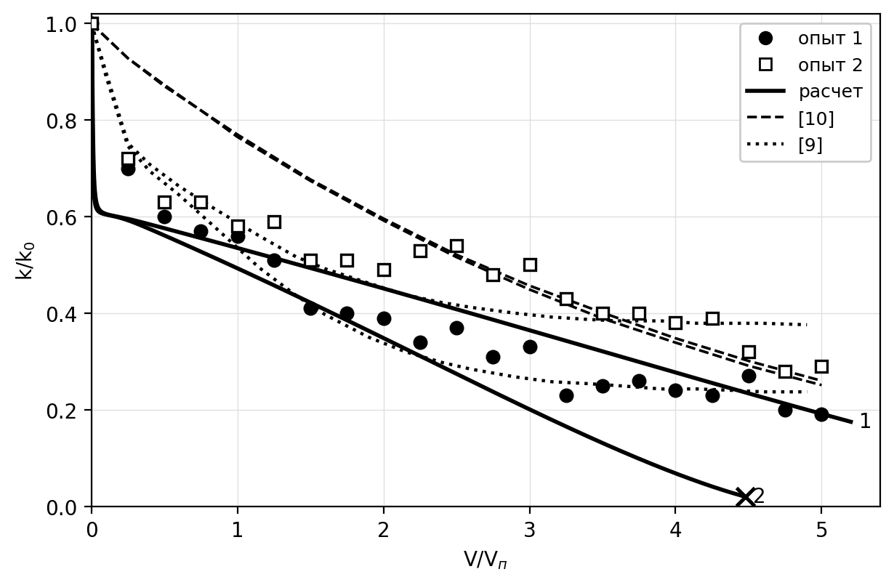

*УДК 532.546*

# ВЛИЯНИЕ ТЕПЛОПОТЕРЬ ЧЕРЕЗ КРОВЛЮ И ПОДОШВУ ПЛАСТА И СОДЕРЖАНИЯ РАСТВОРЕННОГО ПАРАФИНА НА ПОКАЗАТЕЛИ РАЗРАБОТКИ ПРИ ЗАВОДНЕНИИ ХОЛОДНОЙ ВОДОЙ

**А.И. Никифоров, И.С. Лазарев**

*Институт механики и машиностроения ФИЦ КазНЦ РАН, г.Казань, 420111,Россия*

*E-mail:  Lazarevigor1234@yandex.ru*

Поступила в редакцию 

Численно исследовано влияние теплообмена через кровлю и подошву пласта и содержания растворенного парафина на показатели разработки при заводнении холодной водой. Использована модель двухфазной неизотермической многокомпонентной фильтрации с бинарной нефтяной фазой (нефть — парафин), равновесием идеального раствора и кольматацией порового пространства, описываемой функцией распределения пор по размерам; теплообмен с вмещающими породами учитывается методом Винсома—Вестервельда и по схеме Ловерье. Параметры равновесия подобраны по измеренной кривой выпадения парафина, параметры кинетики кольматации — по керновому опыту, снижение проницаемости в котором модель описывает со среднеквадратичным отклонением 0.06. Установлено, что при закачке воды с температурой ниже пластовой вмещающие породы служат для пласта источником теплоты, поэтому пренебрежение теплообменом при содержании парафина 25% масс. занижает среднюю температуру пласта на 14°C, коэффициент извлечения нефти — на 8.3% и длительность разработки — на 24%. При учете теплообмена кольматация охватывает 36% площади элемента, а вклад парафина в коэффициент извлечения не превышает 0.1%; без учета теплообмена кристаллы оказываются в подвижной нефти и снижают коэффициент извлечения на 3.9%, так что взаимодействие факторов составляет 80% их суммарного эффекта. Схема Ловерье воспроизводит около 70% эффекта теплообмена.

**Ключевые слова:** неизотермическая фильтрация, теплопотери в кровлю и подошву, парафиновые отложения, кольматация, численное моделирование

# ВВЕДЕНИЕ

Заводнение остается основным способом поддержания пластового давления при разработке нефтяных месторождений. Температура закачиваемой воды, как правило, ниже пластовой, поэтому вытеснение сопровождается формированием температурного поля, существенно неоднородного по площади залежи. Для нефтей, содержащих растворенный парафин, охлаждение имеет прямые технологические последствия: при снижении температуры ниже точки насыщения парафин кристаллизуется, твердые частицы осаждаются на поверхности пор и блокируют поровые каналы, что ухудшает фильтрационно-емкостные свойства коллектора [1, 2].

С термодинамической точки зрения продуктивный пласт представляет собой открытую систему, обменивающуюся энергией с окружением по трем каналам. Первый — конвективный перенос тепла фильтрационным потоком, определяющий скорость продвижения температурного фронта. Второй — кондуктивный отвод тепла во вмещающие породы кровли и подошвы, представляющие собой практически неограниченные тепловые резервуары. Третий — выделение и поглощение скрытой теплоты фазового перехода при кристаллизации и растворении парафина. Соотношение этих механизмов определяет температурное поле, а через сильную зависимость вязкости нефти от температуры — подвижность фаз и, в конечном счете, все показатели разработки.

Второй из перечисленных каналов в моделях фильтрации нередко опускается: кровля и подошва считаются теплоизолированными, а уравнение энергии решается только в пределах продуктивного интервала. Между тем для маломощных пластов отношение площади теплообмена с вмещающими породами к объему залежи велико, и теплообмен с ними сопоставим по величине с конвективным переносом; в моделях неизотермической фильтрации парафинистой нефти тепловое взаимодействие пласта с окружающими породами и фазовые переходы парафина учитываются совместно [3]. Существенно, что при закачке холодной воды знак этого теплообмена противоположен привычному для тепловых методов увеличения нефтеотдачи: вмещающие породы, сохраняющие начальную пластовую температуру, служат для остывающего пласта не стоком, а источником тепла. Пренебрежение ими поэтому занижает расчетную температуру пласта и смещает прогноз показателей разработки.

Классическое решение задачи о переносе тепла в пласте с учетом потерь во вмещающие породы получено Ловерье [4]; оно основано на представлении кровли и подошвы полубесконечными массивами, прогреваемыми одномерной теплопроводностью, и приводит к потоку, убывающему как $t^{-1/2}$. Тот же подход использован при расчете температурного поля пласта для плоского фильтрационного течения [5]. Точный учет теплопотерь требует свертки всей истории температуры на границе пласта, что при численном решении означает рост объема вычислений и памяти пропорционально времени. Винсом и Вестервельд [6] предложили заменить свертку пробным профилем температуры во вмещающих породах с двумя свободными параметрами; метод хранит одно поле состояния на ячейку и получил широкое распространение в симуляторах неизотермической фильтрации [7].

Моделированию выпадения парафина при заводнении посвящен ряд работ [8–10]. Для описания равновесия между растворенным и кристаллическим парафином применяются как модели реальных растворов [11, 12], так и более простая модель идеального раствора бинарной смеси [10]. Интенсивность отложения частиц обычно представляется комбинацией трех независимых факторов: осаждения частиц на стенках пор, выноса отложений потоком и блокирования поровых каналов [8, 9]. Изменение проницаемости при этом связывается с пористостью степенной зависимостью типа Козени—Кармана [13], точность которой существенно зависит от геометрии скелета [14], либо рассчитывается непосредственно по функции распределения пор по размерам [15].

Цель настоящей работы — количественно оценить погрешность прогноза показателей разработки, вносимую пренебрежением теплопотерями через кровлю и подошву пласта и содержанием растворенного парафина в нефти, а также разделить вклады этих двух факторов.

# МАТЕМАТИЧЕСКАЯ МОДЕЛЬ

Рассматривается двухфазная неизотермическая многокомпонентная фильтрация. Жидкость в пласте представлена двумя фазами и тремя псевдокомпонентами. Нефть и вода образуют две несмешивающиеся фазы; нефтяная фаза состоит из двух псевдокомпонентов — нефти и парафина. Жидкости считаются несжимаемыми, массообмен между водной и нефтяной фазами отсутствует.

Уравнения баланса массы записываются для каждого псевдокомпонента. Для воды и нефтяного компонента они имеют вид

$$\frac{\partial}{\partial t}\left(m \mathrm{\rho}_w S_w\right) + \nabla\cdot\left(\mathrm{\rho}_w \mathbf{U}_w\right) = q_w \mathrm{\rho}_w, \qquad (1)$$

$$\frac{\partial}{\partial t}\left(w_o m \mathrm{\rho}_o S_o\right) + \nabla\cdot\left(w_o \mathrm{\rho}_o \mathbf{U}_o\right) = w_o q_o \mathrm{\rho}_o - w_o \mathrm{\rho}_o q_{p2}, \qquad (2)$$

где $w_o$ — массовая доля нефтяного компонента в нефтяной фазе; $\mathbf{U}_w$, $\mathbf{U}_o$ — скорости фильтрации водной и нефтяной фаз; $S_w$, $S_o$ — водо- и нефтенасыщенность; $\mathrm{\rho}_w$, $\mathrm{\rho}_o$ — плотности фаз; $q_w$, $q_o$ — дебиты скважин по воде и нефти; $m$ — пористость; $q_{p2}$ — скорость блокирования поровых каналов, занятых нефтью (см. (16)): вместе с объемом канала из подвижной нефти уходят все ее компоненты в тех же долях $w_o$, $w_p$, $w_{ps}$.

Парафин может находиться в растворенном состоянии, во взвешенном состоянии в виде частиц и в отложенном на поверхности пор виде. Обе подвижные формы переносятся нефтяной фазой с одной и той же скоростью, поэтому для них достаточно одного уравнения баланса; в накоплении и потоке используется плотность нефтяной фазы $\mathrm{\rho}_o$ — та же, что и в (2), поскольку $w_o+w_p+w_{ps}=1$ являются массовыми долями одной и той же фазы. Уравнение баланса записывается как [9]

$$\begin{aligned}
\frac{\partial}{\partial t}\left[m S_o\left(w_p+w_{ps}\right)\mathrm{\rho}_o\right] + \nabla\cdot\left[\left(w_p+w_{ps}\right)\mathrm{\rho}_o \mathbf{U}_o\right] =\\
&= q_o\left(w_p+w_{ps}\right)\mathrm{\rho}_o - q_{p2}\left(w_p+w_{ps}\right)\mathrm{\rho}_o - q_{p1}\mathrm{\rho}_p, 
\end{aligned} \qquad (3)$$

где $w_{ps}$ — массовая доля взвешенного парафина в нефтяной фазе; $w_p$ — массовая доля растворенного парафина; $\mathrm{\rho}_p$ — плотность кристаллического парафина; $q_{p1}$ — скорость отложения парафина на стенках пор (см. (16)): выпадает чистый парафин, поэтому этот сток несет его собственную плотность $\mathrm{\rho}_p$, тогда как блокирование каналов ($q_{p2}$) выводит из фильтрации весь объем канала вместе с нефтью плотности $\mathrm{\rho}_o$.

Движение фаз описывается законом Дарси; капиллярные и гравитационные силы не учитываются:

$$\mathbf{U}_i = -\frac{k f_i}{\mathrm{\mu}_i}\nabla P, \qquad i = o,\, w, \qquad (4)$$

где $k$ — абсолютная проницаемость; $f_o$, $f_w$ — относительные фазовые проницаемости; $\mathrm{\mu}_o$, $\mathrm{\mu}_w$ — динамические вязкости; $P$ — давление.

В рамках однотемпературной модели баланс полной энергии системы имеет вид

$$\begin{aligned}
\frac{\partial}{\partial t}&\Big[m\mathrm{\rho}_w S_w C_w T + m\mathrm{\rho}_o S_o c_o T + m\mathrm{\rho}_o S_o w_p L_p + \big((1-m_0)\mathrm{\rho}_f C_f + (m_0-m)\mathrm{\rho}_p C_p\big) T\Big] +\\
&+ \nabla\cdot\Big[\mathrm{\rho}_w \mathbf{U}_w C_w T + \mathrm{\rho}_o \mathbf{U}_o c_o T + \mathrm{\rho}_o \mathbf{U}_o w_p L_p\Big] =\\
&= \nabla\cdot\left(\mathrm{\Lambda}\nabla T\right) + q_w \mathrm{\rho}_w C_w T + q_o \mathrm{\rho}_o\left(c_o T + w_p L_p\right) + q_l,
\end{aligned} \qquad (5)$$

где в скважинных слагаемых для нагнетательной скважины вместо $T$ берется температура закачиваемой воды $T_{inj}$; $c_o = w_o C_o + (w_p+w_{ps})C_p$ — эффективная удельная теплоемкость нефтяной фазы: оба псевдокомпонента парафина, растворенный и взвешенный, несут теплоемкость кристаллического парафина $C_p$, а не $C_o$, поскольку это одно и то же вещество, различающееся лишь агрегатным состоянием; $\mathrm{\Lambda} = mS_wK_w + mS_o\big(w_oK_o+(w_p+w_{ps})K_p\big) + (1-m_0)K_f + (m_0-m)K_p$ — эффективная теплопроводность единицы объема пласта; $C_w$, $C_o$, $C_p$, $C_f$ — удельные теплоемкости воды, нефти, кристаллического парафина и породы; $K_w$, $K_o$, $K_p$, $K_f$ — соответствующие теплопроводности; $\mathrm{\rho}_f$ — плотность породы; $m_0$ — начальная пористость; $T$ — температура; $q_l$ — объемная плотность потерь тепла через кровлю и подошву пласта. Слагаемые с $(m_0-m)$ описывают выведенный из фильтрации объем — осевший парафин и содержимое заблокированных каналов, теплофизические свойства которого приняты равными свойствам кристаллического парафина, тогда как объем самой породы $(1-m_0)$ во времени не меняется. Третье слагаемое в квадратных скобках — скрытая теплота кристаллизации: удельная энтальпия растворенного парафина содержит удельную теплоту кристаллизации $L_p$ сверх энтальпии кристаллического, поэтому при растворении парафина теплота поглощается, а при кристаллизации выделяется автоматически, без отдельного источникового члена.

Равновесие между растворенным и кристаллическим парафином описывается моделью идеального раствора бинарной смеси нефть – твердый парафин [8, 10]: коэффициент распределения парафина между твердой и жидкой фазами берется по Вону [12] без слагаемых, связанных с изменением теплоемкости и удельного объема при плавлении, а коэффициенты активности приняты равными единице. Поскольку выпадающий парафин образует чистую твердую фазу [16], эта модель задает не прямую пропорцию между растворенным и взвешенным парафином, а предел растворимости — мольную долю парафина в насыщенном растворе, определяемую уравнением идеальной растворимости Шредера—ван Лаара [17]:

$$x_{sat}(T) = \min\left\{1,\ \exp\left[-\frac{\mathrm{\alpha}}{R}\left(\frac{1}{T} - \frac{1}{T_m}\right)\right]\right\}, \qquad T,\, T_m\ \text{— абсолютные}, \qquad (6.1)$$

где $\mathrm{\alpha}$ — скрытая теплота плавления парафина; $T_m$ — температура кристаллизации; $R$ — универсальная газовая постоянная. Для чистого вещества $\mathrm{\alpha}$ и $T_m$ — его теплота и температура плавления. Парафин нефти представляет собой смесь н-алканов широкого фракционного состава, и при описании его одним псевдокомпонентом кривая выпадения по (6.1) с теплотой плавления чистого вещества оказывается круче измеренной; поэтому $\mathrm{\alpha}$ и $T_m$ в (6.1) рассматриваются как эффективные параметры и определяются по измеренной кривой выпадения парафина (см. ниже). Мольная доля переводится в массовую через молярные массы парафина $M_r$ и нефтяного псевдокомпонента $M_o$; обозначив суммарную массовую долю парафина $w_{\mathrm{\Sigma}} = w_p + w_{ps}$, предел растворимости относится к сумме $w_o+w_p=1-w_{ps}$, поскольку взвешенные частицы в раствор не входят:

$$w_p^{sat} = \frac{\hat w}{1-\hat w}\left(1-w_{\mathrm{\Sigma}}\right), \qquad \hat w = \frac{x_{sat}M_r}{x_{sat}M_r+(1-x_{sat})M_o}. \qquad (6.2)$$

Избыток суммарной доли парафина $w_{\mathrm{\Sigma}}$ над пределом растворимости $w_p^{sat}$ переходит во взвешенное состояние, при недосыщении взвешенные частицы растворяются: $w_p=\min(w_{\mathrm{\Sigma}},\, w_p^{sat})$, $w_{ps}=w_{\mathrm{\Sigma}}-w_p$.

## Теплопотери через кровлю и подошву пласта

Боковые границы области считаются непроницаемыми и теплоизолированными. Кровля и подошва непроницаемы, но не теплоизолированы: через них происходит кондуктивный отвод тепла во вмещающие породы. Прямое моделирование вмещающих толщ требует расширения расчетной области в вертикальном направлении и существенно увеличивает объем вычислений, поэтому теплообмен учитывается полуаналитически, через объемный сток $q_l$ в уравнении (5).

Вмещающие породы представляются полубесконечными массивами с постоянными теплофизическими свойствами: плотностью $\mathrm{\rho}_{ff}$, теплоемкостью $C_{ff}$ и теплопроводностью $K_{ff}$; температуропроводность $\mathrm{\alpha}_{ff} = K_{ff}/(C_{ff}\mathrm{\rho}_{ff})$. Теплоперенос в них считается одномерным и направленным по нормали к границам пласта, что оправдано при малом отношении толщины пласта к характерному размеру области.

В приближении Ловерье температура на границе пласта считается постоянной, а отклик полубесконечного массива на ступенчатое воздействие дает плотность теплового потока с единицы площади $K_{ff}(T - T_0)\big/\sqrt{\mathrm{\pi}\mathrm{\alpha}_{ff}t}$. Переход к единице объема пласта дает

$$q_l = \frac{2 K_{ff}\left(T - T_0\right)}{h\sqrt{\mathrm{\pi}\mathrm{\alpha}_{ff}t}}, \qquad (7)$$

где $h$ — толщина пласта, $T_0$ — начальная температура; множитель 2 учитывает кровлю и подошву. Приближение не хранит информации о предыстории и завышает длительность прогрева пород под уже пройденными температурным фронтом ячейками.

Точное выражение для потока представляет собой свертку истории температуры границы с ядром $\left(t-\mathrm{\tau}\right)^{-1/2}$, вычисление которой требует объема памяти и работы, растущих пропорционально времени счета. Метод Винсома—Вестервельда заменяет свертку пробным профилем температуры во вмещающих породах

$$T(z) - T_0 = \left(\Delta T_b + p z + q z^2\right)\exp\left(-z/d\right), \qquad d = \tfrac{1}{2}\sqrt{\mathrm{\alpha}_{ff}t}, \qquad (8)$$

где $z$ — расстояние от границы пласта вглубь вмещающих пород, $\Delta T_b = T - T_0$ — перегрев на границе. Параметры $p$ и $q$ определяются из двух условий: выполнения уравнения теплопроводности на границе

$$\frac{\Delta T_b}{d^2} - \frac{2p}{d} + 2q = \frac{1}{\mathrm{\alpha}_{ff}}\frac{\partial T}{\partial t} \qquad (9)$$

и равенства интеграла профиля фактически накопленной во вмещающих породах энергии

$$\Delta T_b\, d + p\, d^2 + 2 q\, d^3 = E_{ff}. \qquad (10)$$

Величина $E_{ff}$ — единственная переменная состояния метода, накапливаемая независимо в каждой ячейке. Исключение $q$ из (9), (10) дает замкнутое выражение для $p$, после чего объемный сток тепла определяется как

$$q_l = \frac{2 K_{ff}}{h}\left(\frac{\Delta T_b}{d} - p\right). \qquad (11)$$

Случай теплоизолированных кровли и подошвы соответствует $q_l \equiv 0$.

## Модель пористой среды

Пористая среда рассматривается как система цилиндрических капилляров разного диаметра с фиктивными сужениями — горлами. Приняты следующие допущения: отношение радиуса горла к радиусу канала $\mathrm{\gamma}$ одинаково для всех капилляров и сохраняется в процессе кольматации; частицы парафина имеют шарообразную форму одинакового диаметра $d_p$; количество оседающих частиц пропорционально их долям в движущейся фазе; капилляр полностью блокируется, если размер частиц не меньше диаметра горловины $2\mathrm{\gamma} r$; собственная пористость осевших частиц пренебрежимо мала; доля капилляров, занятых фазой, пропорциональна насыщенности этой фазой [18]. Вынос осевших частиц потоком (суффозия) не учитывается.

Скорость сужения порового канала, вызванного оседанием частиц, и скорость его блокирования принимаются в виде [8, 18]

$$\mathrm{\upsilon}_r = -w_{ps}(S_o - S_o^*)\left(\frac{2\mathrm{\upsilon}_{mo}D_p^2}{r L_k}\right)^{1/3}, \qquad (12)$$

$$\mathrm{\upsilon}_b = \begin{cases} (S_o - S_o^*)\dfrac{6\mathrm{\beta} r^2 w_{ps}\mathrm{\upsilon}_{mo}\mathrm{\varphi}}{d_p^3}, & r \le d_p/(2\mathrm{\gamma}),\\[2mm] 0, & r > d_p/(2\mathrm{\gamma}), \end{cases} \qquad (13)$$

где $L_k$ — средняя длина порового канала; $D_p = k_B T/(3\mathrm{\pi}\mathrm{\mu}_o d_p)$ — коэффициент броуновской диффузии частиц по Стоксу—Эйнштейну, $k_B$ — постоянная Больцмана; $\mathrm{\upsilon}_{mo} = |\nabla P|\, r^2/(8\mathrm{\eta}\mathrm{\mu}_o)$ — средняя скорость нефти в канале радиуса $r$ по закону Пуазейля, $\mathrm{\eta}$ — коэффициент извилистости каналов; $\mathrm{\beta}$ — доля блокируемых каналов; $S_o^*$ — остаточная нефтенасыщенность. Массовая доля взвешенных частиц $w_{ps}$ играет здесь роль их объемной концентрации в приближении $\mathrm{\rho}_p\approx\mathrm{\rho}_o$.

Распределение капилляров по радиусам задается функцией $\mathrm{\varphi}(r,t)$ — долей капилляров радиуса $r$ в момент времени $t$; ее начальное распределение $\mathrm{\varphi}(r,0)=\mathrm{\varphi}_0(r)$ задается логнормальной моделью Косуги [19]: $\mathrm{\varphi}_0(r) = \dfrac{1}{\sqrt{2\mathrm{\pi}}\,\mathrm{\sigma}_r r}\exp\left[-\dfrac{\ln^2(r/r_m)}{2\mathrm{\sigma}_r^2}\right]$, где $r_m$ — медианный радиус капилляров; $\mathrm{\sigma}_r$ — стандартное отклонение $\ln r$. Изменение функции пор по размерам описывается уравнением [18]

$$\frac{\partial \mathrm{\varphi}}{\partial t} + \frac{\partial\left(\mathrm{\upsilon}_r \mathrm{\varphi}\right)}{\partial r} + \mathrm{\upsilon}_b = 0. \qquad (14)$$

Структурные изменения порового пространства меняют динамическую пористость и абсолютную проницаемость. Текущие значения представляются в виде $m = m_f m_0$ и $k = k_f k_0$, где $m_0$, $k_0$ — начальные значения, а коэффициенты определяются через просветность и модель параллельных капилляров с законом Пуазейля [8]:

$$m_f = \frac{\int_0^{\infty} r^2 \mathrm{\varphi}(r)\,dr}{\int_0^{\infty} r^2 \mathrm{\varphi}_0(r)\,dr}, \qquad k_f = \frac{\int_0^{\infty} r^4 \mathrm{\varphi}(r)\,dr}{\int_0^{\infty} r^4 \mathrm{\varphi}_0(r)\,dr}. \qquad (15)$$

Коэффициент извилистости $\mathrm{\eta}$ в выражении для $\mathrm{\upsilon}_{mo}$ выбирается так, чтобы пучок капилляров с начальным распределением $\mathrm{\varphi}_0$ имел начальную проницаемость пласта, $k_0 = m_0\int_0^{\infty} r^4\mathrm{\varphi}_0\,dr\big/\big(8\mathrm{\eta}^2\int_0^{\infty} r^2\mathrm{\varphi}_0\,dr\big)$; тогда средняя скорость нефти в каналах согласована со скоростью фильтрации. При $\mathrm{\eta} = 1$ пучок с медианным радиусом в десятки микрометров имел бы проницаемость в десятки раз больше $k_0$, и во столько же раз были бы завышены скорости (12), (13).

Скорость убыли порового объема складывается из двух вкладов — оседания частиц на поверхности пор ($q_{p1}$) и блокирования поровых каналов ($q_{p2}$) [8]:

$$q_{p1} = -2m\frac{\int_0^{\infty} r\,\mathrm{\upsilon}_r(r)\mathrm{\varphi}(r)\,dr}{\int_0^{\infty} r^2\mathrm{\varphi}(r)\,dr}, \qquad q_{p2} = m\frac{\int_0^{d_p/(2\mathrm{\gamma})} r^2\,\mathrm{\upsilon}_b(r)\,dr}{\int_0^{\infty} r^2\mathrm{\varphi}(r)\,dr}. \qquad (16)$$

Обе величины неотрицательны ($\mathrm{\upsilon}_r\le 0$, отсюда знак у $q_{p1}$; $\mathrm{\upsilon}_b\ge 0$, а множитель $w_{ps}$ уже учтен в (13) и не дублируется) и по построению в сумме равны скорости убыли пористости, $q_{p1}+q_{p2}=-\partial m/\partial t$, что следует из (14)–(15); разделять их необходимо потому, что осаждение выводит из фильтрации чистый парафин, а блокирование — весь объем канала вместе с нефтью (см. (2), (3)).

При броуновском коэффициенте диффузии частиц кинетика осаждения по (12), (13) оказывается быстрее переноса взвеси, и за время шага из нефтяной фазы могло бы выпасть больше парафина, чем в ней содержится. Поэтому скорости (12), (13) ограничиваются подводом: сток парафина из фазы $(\mathrm{\rho}_p/\mathrm{\rho}_o)q_{p1} + (w_p+w_{ps})q_{p2}$ не превышает $mS_ow_{ps}/\Delta t$. В таком режиме интенсивность отложения определяется подводом частиц потоком, а кинетика — лишь протяженностью зоны осаждения.

# ПОСТАНОВКА ЗАДАЧИ И ПАРАМЕТРЫ РАСЧЕТОВ

Рассматривается прямоугольная область $\Omega = [0, L_x]\times[0, L_y]\times[0, L_z]$, представляющая собой элемент симметрии пятиточечной системы заводнения. Пласт однородный. Нагнетательная и добывающая скважины расположены в точках $(0,\, 0)$ и $(L_x, L_y)$ соответственно, вертикальны и совершенны по степени и характеру вскрытия, имеют радиус $r_w$ и работают в режиме заданных забойных давлений $p_{inj}$ и $p_{prod}$. Начальная температура пласта $T = T_0$, температура нагнетаемой воды $T = T_{inj}$. Расчет ведется до достижения предельной обводненности добывающей скважины 98%.

Температура и теплота плавления чистого парафинового псевдокомпонента с молекулярной массой $M_r$ вычисляются по корреляциям Вона [12]

$$ \begin{aligned}
T_m^W = 101.35 + 0.02617 M_r - \frac{20172}{M_r}\ [^\circ\text{C}], \\
\qquad \mathrm{\alpha}^W = 0.1426\cdot M_r\cdot\left(T_m^W+273.15\right)\cdot 4.1868\ \left[\text{Дж/моль}\right],
\end{aligned} \qquad (17)$$

где температура в правой части второй формулы взята абсолютной, а множитель 4.1868 переводит теплоту плавления из калорий на моль (единицы исходной корреляции) в джоули. По ним определяется удельная теплота кристаллизации в (5), $L_p = \mathrm{\alpha}^W/M_r$; эффективные $T_m$ и $\mathrm{\alpha}$ в (6.1) подбираются по кривой выпадения. Вязкость воды задается корреляцией Фогеля [20]

$$\mathrm{\mu}_w = 2.414\times 10^{-5}\cdot 10^{\,247.8/(T + 133.15)}. \qquad (18)$$

Вязкость нефтяной фазы складывается из двух вкладов. Вязкость жидкой основы задается уравнением Аррениуса, записанным через опорную точку, что разделяет уровень вязкости при пластовой температуре и крутизну ее температурной зависимости. Выпавшие кристаллы парафина образуют в жидкой основе суспензию и дополнительно повышают вязкость; этот вклад учитывается соотношением Кригера—Догерти [21]:

$$\mathrm{\mu}_o = \mathrm{\mu}_o^{ref}\exp\left[\frac{E_a}{R}\left(\frac{1}{T} - \frac{1}{T_{ref}}\right)\right]\left(1 - \frac{\mathrm{\phi}_w}{\mathrm{\phi}_{max}}\right)^{-2.5\,\mathrm{\phi}_{max}}, \qquad (19)$$

где $E_a$ — энергия активации вязкого течения; $\mathrm{\mu}_o^{ref}$ — вязкость нефти при опорной температуре $T_{ref}$; $\mathrm{\phi}_{max}$ — предельная объемная доля кристаллов, отвечающая плотной упаковке; $\mathrm{\phi}_w$ — текущая объемная доля кристаллов, связанная с их массовой долей соотношением

$$\mathrm{\phi}_w = \frac{w_{ps}/\mathrm{\rho}_p}{w_{ps}/\mathrm{\rho}_p + \left(1 - w_{ps}\right)/\mathrm{\rho}_o}. \qquad (20)$$

Учет этого вклада замыкает связь между тепловой и парафиновой частями модели: охлаждение пласта вызывает кристаллизацию согласно (6.1)–(6.2), а кристаллы, помимо кольматации порового пространства, снижают подвижность нефтяной фазы. Содержание парафина принято равным 25% масс., как в нефти месторождения Жетыбай [22], по измеренной кривой выпадения которой подобраны эффективные параметры равновесия (см. следующий раздел). При этом порог кристаллизации, получаемый обращением (6.1)–(6.2) относительно температуры, составляет $T^*\approx38.9$°C, а предел растворимости при температуре закачки 20°C — самой низкой достижимой в задаче — равен 0.105, то есть в охлажденной до нее нефти более половины парафина находится во взвеси. В расчетах массовая доля взвешенных кристаллов достигает 0.159, а множитель Кригера—Догерти — 1.55; температурный вклад при охлаждении с 70 до 20°C повышает вязкость нефти в 4.5 раза.

Сопоставляются три основных варианта расчета, различающихся учетом теплопотерь и содержанием растворенного парафина, и дополнительный вариант, отличающийся от базового способом расчета теплопотерь (табл. 1).

Таблица 1. Варианты расчета

| Вариант | Теплопотери через кровлю и подошву | Модель теплопотерь | Содержание растворенного парафина $w_p$ |
|---|---|---|---|
| 1 | учитываются | Винсом—Вестервельд, (8)–(11) | 0.25 |
| 2 | не учитываются | $q_l \equiv 0$ | 0.25 |
| 3 | не учитываются | $q_l \equiv 0$ | 0 |
| 4 | учитываются | Ловерье, (7) | 0.25 |

## Метод решения

Дискретизация системы (1)—(5) выполнена методом контрольных объемов: исходные уравнения интегрируются по каждой ячейке сетки, внутри которой фильтрационно-емкостные свойства и термодинамические параметры считаются постоянными. Конвективные слагаемые аппроксимируются схемой против потока, что обеспечивает устойчивость решения и исключает нефизичные осцилляции вблизи скачков насыщенности.

Для уравнений давления и насыщенности применен метод IMPES: поле давления определяется неявно из решения системы линейных алгебраических уравнений, а насыщенность, температура и характеристики парафина рассчитываются явно по найденному полю давления. Шаг по времени подбирается на каждой итерации из фактического числа Куранта, что позволяет вести счет с максимально допустимым по условию устойчивости шагом. Матрица системы для давления при пятиточечном шаблоне является ленточной с полушириной $N_x$; она разлагается по Холецкому, причем фактор пересобирается не на каждом шаге, а промежуточные шаги досчитываются методом сопряженных градиентов с этим фактором в роли предобуславливателя. Уравнение (14) изменения функции распределения пор по размерам решается по полностью неявной схеме, что снимает жесткие ограничения на шаг по времени.

# ПРОВЕРКА МОДЕЛИ ПО ЛАБОРАТОРНЫМ ДАННЫМ

## Растворимость парафина

Li и др. [22] измерили калориметрически кривую выпадения парафина из нефти месторождения Жетыбай (24.93% масс. парафина, начало кристаллизации 45.65°C). Корреляции Вона (17) при $M_r = 410$ г/моль завышают количество выпавшего парафина в 2–3 раза (15.7% против 5.0% при 35°C), тогда как эффективные $T_m = 82.8$°C и $\mathrm{\alpha} = 37.4$ кДж/моль, подобранные в интервале 10–45°C, описывают кривую с отклонением не более 1.5% масс. Эти параметры и $w_p = 0.25$ приняты в расчетах пласта; теплота кристаллизации в (5) остается калориметрической, $L_p = 201$ Дж/г.

## Кольматация керна

Для проверки описания кольматации использованы опыты Sutton и Roberts [23] с прокачкой парафинистой нефти через керн песчаника Berea ниже точки помутнения, моделировавшиеся ранее в [9, 10]. Длина керна 30.5 см, пористость 0.25, проницаемость 405 и 314 мД; содержание парафина 4.1 и 6.1% масс., точки помутнения 37.8 и 35°C, температура 21.1°C, расход (по [10]) 7.5 и 5.9 см³/мин.

Как и в [10], керн считался изотермическим, а нефть на входе и в керне — содержащей равновесную взвесь; с параметрами псевдокомпонентов из [10] (6.1)–(6.2) дают точки помутнения 36.5 и 35.0°C. Задача решалась в одномерной постановке для однофазной фильтрации при постоянном расходе; сопоставлялось отношение начального перепада давления к текущему. Распределение пор принято, как в расчетах пласта, коэффициент извилистости определялся по $k_0$, вязкость нефти — 3 мПа·с.

Не измерявшиеся в опытах параметры кинетики — диаметр кристаллов $d_p$ и длина порового канала $L_k$ — подбирались по опыту 1 перебором на сетке $d_p = 10$–20 мкм, $L_k = 0.03$–1 мм. Доля блокируемых каналов $\mathrm{\beta}$ не подбиралась: при любом значении из интервала 0.003–0.3 блокирование завершается за секунды, много быстрее переноса взвеси, и на $k/k_0$ не влияет. Наилучшее согласие (среднеквадратичное отклонение 0.058) получено при $d_p = 15$ мкм и $L_k = 0.3$ мм — величине порядка размера зерна песчаника; опыт 2 рассчитан с теми же значениями без подбора.

Рис. 1. Отношение проницаемости к начальной в зависимости от объема прокачанной нефти в опытах Sutton и Roberts [23]: точки — опыт 1 (закрашенные) и опыт 2 (светлые); сплошные линии — расчет по настоящей модели (опыт 1 — подбор $d_p$ и $L_k$, опыт 2 — прогноз с теми же значениями); штриховые — модель [10]; пунктирные — модель [9]. Цифры у кривых — номера опытов.

Модель воспроизводит двухстадийный характер снижения проницаемости в опыте 1 (рис. 1): быстрое падение до 0.61 за первые 0.1 порового объема и последующее постепенное снижение до 0.20 к пяти поровым объемам (в опыте 0.70 при 0.25 и 0.19 при 5 поровых объемах). Первая стадия — блокирование каналов с $r \le d_p/(2\mathrm{\gamma}) = 18.75$ мкм сразу по всей длине керна, поскольку взвесь в нем уже есть; эти каналы составляют 63% порового объема, но лишь 34% проводимости пучка. Вторая стадия — сужение широких каналов в зоне у входа, куда поток подводит новую взвесь: к концу опыта множитель пористости у входа снижается до 0.04, на выходе — до 0.23. Модель [10], в которой осаждение описывается фильтрационным стоком с коэффициентом, общим для обоих опытов, а проницаемость — зависимостью $k/k_i = (1-\mathrm{\sigma})^8$ от доли занятого осадком порового объема, начального провала не воспроизводит, и ее отклонение от опыта 1 составляет 0.18. Модель [9] с коэффициентом поверхностного осаждения, подобранным отдельно для каждого опыта, дает отклонения 0.040 и 0.060.

Прогноз опыта 2 менее точен (отклонение 0.23): начальный провал воспроизводится, но темп дальнейшего снижения переоценен, и к 4.5 порового объема вход закупоривается, тогда как в опыте $k/k_0 = 0.29$. Отчасти это связано с равновесием: по (6.1)–(6.2) взвеси в опыте 2 на 40% больше, чем в опыте 1, а по расчету [10] доли почти равны; с долей взвеси по [10] отклонение составляет 0.17. Значения $d_p = 15$ мкм и $L_k = 0.3$ мм приняты в расчетах пласта с оговоркой, что параметры кинетики переносятся на другую нефть лишь приближенно.

# РЕЗУЛЬТАТЫ И ОБСУЖДЕНИЕ

Расчеты выполнены при следующих значениях параметров. Область имеет размеры $L_x \times L_y = 200 \times 200$ м при толщине пласта $h = 10$ м; сетка $N_x \times N_y = 75 \times 75$ узлов, по радиусам капилляров $N_r = 31$ узел. Забойные давления нагнетательной и добывающей скважин $p_{inj} = 150$ бар и $p_{prod} = 50$ бар, радиус скважин $r_w = 0.1$ м. Начальная температура пласта $T_0 = 70$°C, температура нагнетаемой воды $T_{inj} = 20$°C. Начальные пористость и проницаемость $m_0 = 0.3$ и $k_0 = 200$ мД. Плотности воды, нефти, парафина, породы пласта и вмещающих пород $\mathrm{\rho}_w = 1000$, $\mathrm{\rho}_o = 860$, $\mathrm{\rho}_p = 900$, $\mathrm{\rho}_f = 2700$ и $\mathrm{\rho}_{ff} = 2400$ кг/м³; их теплоемкости $C_w = 4200$, $C_o = 2000$, $C_p = 2200$, $C_f = 1000$ и $C_{ff} = 1000$ Дж/(кг °C); теплопроводности $K_w = 0.6$, $K_o = 0.12$, $K_p = 0.2$, $K_f = 1.8$ и $K_{ff} = 2.0$ Вт/(м °C). Вязкость нефти в опорной точке $\mathrm{\mu}_o^{ref} = 5.77$ сП при $T_{ref} = 70$°C, энергия активации вязкого течения $E_a = 25$ кДж/моль, предельная объемная доля кристаллов $\mathrm{\phi}_{max} = 0.6$. Молекулярная масса парафина $M_r = 410$ г/моль, молярная масса нефтяного псевдокомпонента $M_o = 250$ г/моль, эффективные параметры равновесия $T_m = 82.8$°C и $\mathrm{\alpha} = 37.4$ кДж/моль, удельная теплота кристаллизации $L_p = 201$ Дж/г. Параметры модели пористой среды: отношение радиуса горла к радиусу канала $\mathrm{\gamma} = 0.4$, доля блокируемых каналов $\mathrm{\beta} = 0.01$, средняя длина порового канала $L_k = 3\times10^{-4}$ м, диаметр частиц парафина $d_p = 1.5\times10^{-5}$ м; параметры начального распределения капилляров по радиусам $r_m = 12$ мкм и $\mathrm{\sigma}_r = 0.4$, сетка по радиусам покрывает интервал 0–40 мкм, коэффициент извилистости $\mathrm{\eta} = 8.2$. Остаточная и предельная водонасыщенности $S_w^* = 0.18$ и $S_w^{max} = 0.70$, показатель степени в модели Кори $n = 2$.

## Заводнение с учетом теплообмена через кровлю и подошву

В базовом варианте выделены три характерных момента: прорыв воды в добывающую скважину $t_1 = 288$ сут, достижение предельной обводненности 98% $t_3 = 2315$ сут и середина интервала между ними $t_2 = 1300$ сут, которой отвечает обводненность 0.942. Поля температуры и водонасыщенности на эти моменты приведены на рис. 2.

Рис. 2. Поля температуры (а–в) и водонасыщенности (г–е) для варианта 1 на моменты времени t₁ = 288 сут (а, г), t₂ = 1300 сут (б, д) и t₃ = 2315 сут (в, е). Треугольник — нагнетательная скважина, круг — добывающая. Числа на изолиниях — значения соответствующей величины; набор уровней единый для всех трех моментов времени. Поле водонасыщенности дополнительно показано заливкой: более темный тон отвечает большему значению.

Температурное поле (рис. 2а–2в) отстает от поля водонасыщенности (рис. 2г–2е), причем отставание нарастает. На момент прорыва изолиния $S = 0.5$ продвинута вдоль диагонали области на 56.8 м, а изотерма $T = T^*$ — на 38.5 м; к моменту $t_2$ это соответственно 208.1 и 102.3 м, то есть разрыв между фронтами вырастает с 18 до 106 м, а к моменту $t_3$ изотерма $T^*$ проходит 144.1 м, тогда как водонасыщенность на всей диагонали уже превышает 0.5. Причина в том, что часть теплоты закачиваемой воды расходуется на прогрев скелета породы, объемная теплоемкость которого сопоставима с теплоемкостью флюидов, а также в теплопритоке из вмещающих пород, возвращающем теплоту в остывшие ячейки. Средняя температура пласта снижается с 68.0°C на момент прорыва до 57.4°C к моменту $t_2$ и 46.8°C к моменту $t_3$; область с температурой ниже $T^*$ занимает к этим моментам 3.3, 20.0 и 36.5% площади элемента.

До прорыва воды дебит добывающей скважины по нефти растет и достигает максимума 65.2 м³/сут на 288 сут, после чего резко падает; к концу разработки он составляет 4.0 м³/сут (рис. 3). Коэффициент извлечения нефти на момент $t_3$ равен 0.4638 при накопленной добыче 45642 м³.

Рис. 3. Дебит добывающей скважины по нефти (черные линии, левая ось) и обводненность (серые линии, правая ось): 1 — теплообмен учитывается, wₚ = 0.25; 2 — теплообмен не учитывается, wₚ = 0.25; 3 — теплообмен не учитывается, wₚ = 0. Маркеры расставлены для различения кривых и не отмечают расчетные точки.

Выпадение парафина происходит только в области, охлажденной ниже $T^*$. Кристаллизация по (6.1)–(6.2) равновесна и от движения нефти не зависит, тогда как осаждение на стенки и блокирование каналов по (12), (13) требуют движения нефти, доставляющего частицы к стенкам. Зона деградации фильтрационно-емкостных свойств поэтому следует за изотермой $T^*$: ее внешняя граница (множитель проницаемости 0.99) проходит по диагонали 41.5 м на момент $t_1$, 102.8 м на момент $t_2$ и 144.8 м на момент $t_3$, практически совпадая с изотермой $T^*$, и к концу разработки охватывает 36.4% площади элемента; такое же отставание холодного фронта от фронта вытеснения и отсутствие потери приемистости при остаточной нефтенасыщенности получены в [24]. Проницаемость внутри зоны снижается на 4–15%, а минимум множителя проницаемости — 0.770 при множителе пористости 0.675 — достигается у нагнетательной скважины уже к моменту прорыва и далее не меняется.

## Влияние учета теплообмена через кровлю и подошву

Расчет, отличающийся от базового только отсутствием теплообмена с вмещающими породами, дает существенно более холодный пласт: средняя температура к концу разработки составляет 32.5°C против 46.8°C в базовом варианте. Причина в том, что при закачке холодной воды вмещающие породы, сохраняющие начальную пластовую температуру, служат для остывающего пласта источником теплоты, а не стоком. Пренебрежение этим теплопритоком эквивалентно предположению об идеальной теплоизоляции кровли и подошвы, физически не выполняющемуся для маломощных пластов.

Пространственное распределение вносимой погрешности дает поле разности (рис. 4), вычисленное на один и тот же момент физического времени; ниже приведены и средние по пласту разности на три момента. На момент прорыва варианты почти неразличимы: средняя разность температур составляет 1.2°C при максимальной 23.9°C в окрестности нагнетательной скважины. К моменту $t_2$ расхождение охватывает всю область — средняя разность 13.9°C при максимальной 41.1°C, — а к концу разработки средняя разность составляет 14.2°C при максимальной 33.6°C. Разность водонасыщенности не превышает 0.05.

Рис. 4. Разность полей температуры (а) и водонасыщенности (б) между вариантом 1 и вариантом 2 на момент t₂ = 1300 сут. Положительные значения соответствуют более высоким температуре и водонасыщенности при учете теплообмена; штриховые изолинии — отрицательным значениям, жирная линия — нулевому. Заливка: более темный тон отвечает большей разности.

Занижение температуры влечет за собой завышение вязкости нефти. Согласно (19), при охлаждении с 70 до 20°C вязкость жидкой основы нефти возрастает в 4.5 раза, тогда как вязкость воды по (18) — лишь в 2.5 раза, и отношение вязкостей повышается с 14.4 до 25.7. Без теплообмена к этому добавляется вклад кристаллов: область $T<T^*$ к концу разработки охватывает 72% площади элемента, и кристаллы оказываются в подвижной нефти впереди фронта вытеснения — средняя по пласту массовая доля взвеси растет с 0.007 на момент прорыва до 0.100 к концу разработки, а множитель Кригера—Догерти достигает 1.55. Кольматация при этом охватывает 34% площади к моменту $t_2$ и 72% к концу разработки при минимальном множителе проницаемости 0.739.

Количественно (табл. 2) пренебрежение теплообменом занижает коэффициент извлечения на 0.0385, или на 8.3% относительно базового значения, и длительность разработки на 559 сут, или на 24.2%: в более холодном пласте с более вязкой нефтью обводненность нарастает быстрее, и предельное значение достигается раньше при меньшей накопленной добыче. Время прорыва воды при этом почти не меняется (288 и 290 сут): к моменту прорыва пласт остыть еще не успевает. Расхождение накапливается на поздней стадии, когда охлаждение охватывает большую часть области.

Таблица 2. Сопоставление показателей разработки

| Вариант | $t_1$, сут | $t_3$, сут | КИН | Накопленная добыча нефти, м³ | Средняя температура на $t_3$, °C | $\Delta$КИН, % | $\Delta t_3$, % |
|---|---|---|---|---|---|---|---|
| 1. Теплообмен учитывается, $w_p = 0.25$ | 288 | 2315 | 0.4638 | 45642 | 46.8 | — | — |
| 2. Теплообмен не учитывается, $w_p = 0.25$ | 290 | 1756 | 0.4254 | 41856 | 32.5 | −8.3 | −24.2 |
| 3. Теплообмен не учитывается, $w_p = 0$ | 293 | 2066 | 0.4427 | 43563 | 25.8 | −4.6 | −10.8 |
| 4. Теплообмен по схеме Ловерье, $w_p = 0.25$ | 290 | 2209 | 0.4526 | 44538 | 40.7 | −2.4 | −4.6 |
| 5. Теплообмен учитывается, $w_p = 0$ | 288 | 2248 | 0.4642 | 45679 | 46.3 | +0.1 | −2.9 |

## Разделение вкладов теплообмена и содержания парафина

Сопоставление базового варианта с расчетом без теплообмена и без парафина (вариант 3) дает суммарное смещение: коэффициент извлечения занижается на 0.0211, или на 4.6%, а длительность разработки — на 249 сут. Однако такое сопоставление не позволяет разделить вклады двух факторов. Для разделения рассчитан недостающий вариант полного факторного плана — с учетом теплообмена, но без парафина (вариант 5). Результаты разложения приведены в табл. 3.

Таблица 3. Разложение эффектов по полному факторному плану

| Показатель | Эффект теплообмена при наличии парафина | Эффект теплообмена без парафина | Эффект парафина при учете теплообмена | Эффект парафина без учета теплообмена | Взаимодействие |
|---|---|---|---|---|---|
| КИН | +0.0385 | +0.0215 | −0.0004 | −0.0173 | +0.0170 |
| $t_3$, сут | +559 | +182 | +67 | −310 | +377 |

Эффекты двух факторов не аддитивны: эффект парафина определяется тем, учитывается ли теплообмен. При учете теплообмена зона кристаллизации следует за изотермой $T^*$ позади фронта вытеснения, в почти неподвижной нефти, и парафин практически не меняет коэффициент извлечения (−0.0004), а длительность разработки увеличивает на 67 сут за счет снижения приемистости нагнетательной скважины. Без учета теплообмена тот же парафин снижает коэффициент извлечения на 0.0173 (3.9%) и сокращает длительность разработки на 310 сут: кристаллы в подвижной нефти впереди фронта повышают ее вязкость и снижают проницаемость, ухудшая отношение подвижностей. В результате взаимодействие факторов (+0.0170) составляет 80% суммарного изменения коэффициента извлечения, а эффект теплообмена при наличии парафина (0.0385) почти вдвое больше, чем без него (0.0215). Иными словами, заметный эффект парафина в расчете без теплообмена в значительной мере порожден самим пренебрежением теплообменом, и пренебрежение им тем опаснее, чем больше парафина в нефти.

## Сопоставление моделей теплообмена с вмещающими породами

Расчет по схеме Ловерье (вариант 4) дает коэффициент извлечения 0.4526 против 0.4638 по методу Винсома—Вестервельда, то есть расхождение составляет 2.4%; длительность разработки различается на 106 сут (4.6%), средняя температура на момент $t_3$ — на 6.1°C. Схема Ловерье систематически занижает теплоприток из вмещающих пород, поскольку отсчитывает время их прогрева от начала расчета, а не от момента прихода температурного фронта в данную ячейку; в результате расчетный пласт оказывается холоднее, а показатели разработки — ниже, хотя и выше, чем без учета теплообмена: по коэффициенту извлечения схема Ловерье воспроизводит около 70% эффекта (0.0272 из 0.0385).

Полученные оценки следует рассматривать с учетом принятых допущений. Параметры кинетики кольматации подобраны по керновому опыту с другой нефтью и переносятся на пласт лишь приближенно. Вклад кристаллов в вязкость описан соотношением Кригера—Догерти (множитель до 1.55) и не воспроизводит гелеобразование ниже температуры застывания, где эффект парафина будет сильнее полученного. Энергия активации вязкого течения принята равной 25 кДж/моль по типичному для парафинистых нефтей диапазону, и ее уточнение изменит количественные оценки, оставляя качественные выводы в силе. Вынос осевших частиц потоком, осаждение без потока и зависимость вязкости от давления не учитывались.

# ЗАКЛЮЧЕНИЕ

1. Модель проверена по лабораторным данным. Кривая выпадения парафина из высокопарафинистой нефти описывается моделью идеального раствора с эффективными параметрами равновесия с отклонением не более 1.5% масс. Двухстадийное снижение проницаемости в керновом опыте с прокачкой парафинистой нефти — быстрый провал за счет блокирования узких каналов и последующее постепенное снижение за счет сужения широких — воспроизводится со среднеквадратичным отклонением 0.06 при диаметре кристаллов 15 мкм и длине порового канала 0.3 мм, тогда как модель фильтрации с постоянным коэффициентом осаждения дает 0.18. Прогноз второго опыта с другой нефтью без подбора параметров менее точен (0.23), главным образом из-за неопределенности равновесной доли взвеси.

2. При закачке воды с температурой ниже пластовой вмещающие породы служат для пласта источником теплоты, а не стоком, вследствие чего пренебрежение теплообменом занижает расчетную температуру пласта — в рассмотренной постановке на 14°C по среднему значению к концу разработки и локально до 41°C в середине срока разработки.

3. Занижение температуры завышает вязкость нефти и ухудшает отношение подвижностей фаз. При содержании парафина 25% масс. пренебрежение теплообменом с вмещающими породами занижает расчетный коэффициент извлечения нефти на 8.3% и длительность разработки на 24%. До прорыва воды варианты неразличимы; расхождение накапливается на поздней стадии.

4. При учете теплообмена зона выпадения парафина следует за изотермой начала кристаллизации позади фронта вытеснения, в почти неподвижной нефти. Кольматация охватывает к концу разработки 36% площади элемента и снижает проницаемость на 4–23%; наибольшее снижение формируется у нагнетательной скважины до прорыва воды. Вклад парафина в коэффициент извлечения при этом не превышает 0.1%.

5. Эффекты теплообмена и парафина не аддитивны: без учета теплообмена пласт охлаждается сильнее, кристаллы оказываются в подвижной нефти впереди фронта, и парафин снижает коэффициент извлечения на 3.9%, а длительность разработки — на 15%. Взаимодействие факторов составляет 80% их суммарного эффекта, то есть заметное влияние парафина в расчете без теплообмена в значительной мере порождено самим пренебрежением теплообменом.

6. Сопоставление схемы Ловерье и метода Винсома—Вестервельда дает расхождение 2.4% по коэффициенту извлечения — втрое меньше исследуемого эффекта; схема Ловерье занижает теплоприток и воспроизводит около 70% эффекта, не меняя его знака. Полученные выводы поэтому не зависят от выбора конкретной модели теплообмена с вмещающими породами.

7. При проектировании разработки маломощных пластов заводнением холодной водой учет теплообмена через кровлю и подошву необходим, и тем более — для парафинистых нефтей: без него прогноз коэффициента извлечения оказывается заниженным на 8%, длительности разработки — на 24%, а влияние парафина на вытеснение — существенно завышенным.

# БЛАГОДАРНОСТИ

Работа выполнена за счет предоставленного в 2026 году Фондом науки и технологий Республики Татарстан гранта на осуществление фундаментальных и поисковых исследований в научных и образовательных организациях, предприятиях и организациях реального сектора экономики Республики Татарстан.

# СПИСОК ЛИТЕРАТУРЫ

1. *Коробов Г.Ю., Парфенов Д.В., Нгуен Ван Тханг.* Механизмы образования асфальтосмолопарафиновых отложений и факторы интенсивности их формирования // Известия Томского политехнического университета. Инжиниринг георесурсов. 2023. Т. 334. № 4. С. 103. https://doi.org/10.18799/24131830/2023/4/3940
2. *Sandyga M.S., Struchkov I.A., Rogachev M.K.* Formation Damage Induced by Wax Deposition: Laboratory Investigations and Modeling // J. Petroleum Exploration and Production Technology. 2020. V. 10. P. 2541.
3. *Филиппов А.И., Михайлов П.Н., Филиппов К.А., Салихов Р.Ф., Ковальский А.А.* Использование баротермического эффекта для нагрева нефтяного пласта // ТВТ. 2009. Т. 47. № 5. С. 752.
4. *Lauwerier H.A.* The Transport of Heat in an Oil Layer Caused by the Injection of Hot Fluid // Appl. Sci. Res. Sect. A. 1955. V. 5. P. 145.
5. *Алишаев М.Г.* Расчет температурного поля пласта при инжекции жидкости для плоского фильтрационного течения // Изв. АН СССР. Механика жидкости и газа. 1979. № 1. С. 67.
6. *Vinsome P.K.W., Westerveld J.* A Simple Method for Predicting Cap and Base Rock Heat Losses in Thermal Reservoir Simulators // J. Canadian Petroleum Technology. 1980. V. 19. № 3. P. 87.
7. *Pruess K., Oldenburg C., Moridis G.* TOUGH2 User's Guide, Version 2. Report LBNL-43134. Berkeley: Lawrence Berkeley National Laboratory, 1999.
8. *Nikiforov A.I., Sadovnikov R.V., Nikiforov G.A.* Modeling of Paraffin Deposition During Oil Production by Cold Water Injection // Lobachevskii J. Math. 2022. V. 43. P. 1178.
9. *Wang Sh., Civan F.* Model-Assisted Analysis of Simultaneous Paraffin and Asphaltene Deposition in Laboratory Core Tests // J. Energy Resour. Technol. 2005. V. 127. № 4. P. 318.
10. *Ring J.N., Wattenbarger R.A., Keating J.F., Peddibhotla S.* Simulation of Paraffin Deposition in Reservoirs // SPE Production & Facilities. 1994. V. 9. № 1. P. 36.
11. *Pedersen K.S., Skovborg P., Rønningsen H.P.* Wax Precipitation from North Sea Crude Oils. 4. Thermodynamic Modeling // Energy & Fuels. 1991. V. 5. № 6. P. 924.
12. *Won K.W.* Thermodynamics for Solid Solution-Liquid-Vapor Equilibria: Wax Phase Formation from Heavy Hydrocarbon Mixtures // Fluid Phase Equilibria. 1986. V. 30. P. 265.
13. *Kozeny J.* Ueber kapillare Leitung des Wassers im Boden // Sitzungsber. Akad. Wiss. Wien. 1927. V. 136. № 2a. P. 271.
14. *Губайдуллин А.А., Игошин Д.Е., Хромова Н.А.* Обобщение подхода Козени к определению проницаемости модельных пористых сред из твердых шаровых сегментов // Вестник Тюменского государственного университета. Физико-математическое моделирование. Нефть, газ, энергетика. 2016. Т. 2. № 2. С. 105.
15. *Nikiforov A.I., Zakirov T.R., Nikiforov G.A.* Model for Treatment of Oil Reservoirs with Polymer-Dispersed Systems // Chem. Technol. Fuels Oils. 2015. V. 51. № 1. P. 105.
16. *Lira-Galeana C., Firoozabadi A., Prausnitz J.M.* Thermodynamics of Wax Precipitation in Petroleum Mixtures // AIChE J. 1996. V. 42. № 1. P. 239.
17. *Prausnitz J.M., Lichtenthaler R.N., de Azevedo E.G.* Molecular Thermodynamics of Fluid-Phase Equilibria. 3rd ed. Upper Saddle River: Prentice Hall, 1999.
18. *Никифоров А.И., Никаньшин Д.П.* Перенос частиц двухфазным фильтрационным потоком // Математическое моделирование. 1998. Т. 10. № 6. С. 42.
19. *Kosugi K.* Lognormal Distribution Model for Unsaturated Soil Hydraulic Properties // Water Resour. Res. 1996. V. 32. № 9. P. 2697.
20. *Чекалин А.Н., Конюхов В.М., Костерин А.В.* Двухфазная многокомпонентная фильтрация в нефтяных пластах сложной структуры. Казань: Казан. гос. ун-т, 2009. 180 с.
21. *Krieger I.M., Dougherty T.J.* A Mechanism for Non-Newtonian Flow in Suspensions of Rigid Spheres // Trans. Soc. Rheol. 1959. V. 3. P. 137.
22. *Li X., Zhao L., Fei R., Zhou F., Yuan S. et al.* Cooling Damage Characterization and Chemical-Enhanced Oil Recovery in Low-Permeable and High-Waxy Oil Reservoirs // Processes. 2024. V. 12. № 2. P. 421. https://doi.org/10.3390/pr12020421
23. *Sutton G.D., Roberts L.D.* Paraffin Precipitation During Fracture Stimulation // J. Petroleum Technology. 1974. V. 26. № 9. P. 997.
24. *Maloney D., Oesthus A.* Effects of Paraffin Wax Precipitation During Cold Water Injection in a Fractured Carbonate Reservoir // Proc. Int. Symp. Society of Core Analysts. Abu Dhabi, 2004. Paper SCA2004-28.

# ПОДПИСИ К РИСУНКАМ

Рис. 1. Отношение проницаемости к начальной в зависимости от объема прокачанной нефти в опытах Sutton и Roberts [23]: точки — опыт 1 (закрашенные) и опыт 2 (светлые); сплошные линии — расчет по настоящей модели (опыт 1 — подбор $d_p$ и $L_k$, опыт 2 — прогноз с теми же значениями); штриховые — модель [10]; пунктирные — модель [9]. Цифры у кривых — номера опытов.

Рис. 2. Поля температуры (а–в) и водонасыщенности (г–е) для варианта 1 на моменты времени t₁ = 288 сут (а, г), t₂ = 1300 сут (б, д) и t₃ = 2315 сут (в, е). Треугольник — нагнетательная скважина, круг — добывающая. Числа на изолиниях — значения соответствующей величины; набор уровней единый для всех трех моментов времени. Поле водонасыщенности дополнительно показано заливкой: более темный тон отвечает большему значению.

Рис. 3. Дебит добывающей скважины по нефти (черные линии, левая ось) и обводненность (серые линии, правая ось): 1 — теплообмен учитывается, wₚ = 0.25; 2 — теплообмен не учитывается, wₚ = 0.25; 3 — теплообмен не учитывается, wₚ = 0. Маркеры расставлены для различения кривых и не отмечают расчетные точки.

Рис. 4. Разность полей температуры (а) и водонасыщенности (б) между вариантом 1 и вариантом 2 на момент t₂ = 1300 сут. Положительные значения соответствуют более высоким температуре и водонасыщенности при учете теплообмена; штриховые изолинии — отрицательным значениям, жирная линия — нулевому. Заливка: более темный тон отвечает большей разности.
