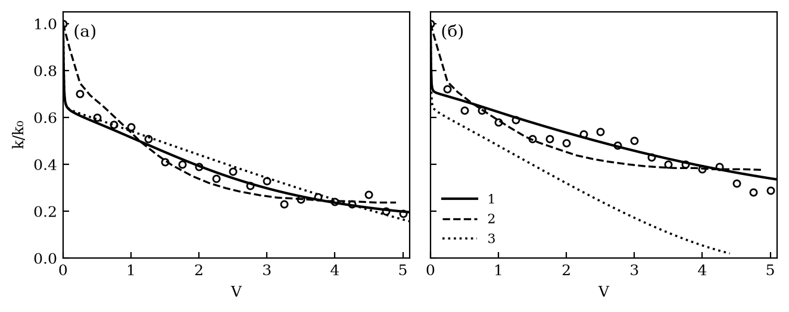
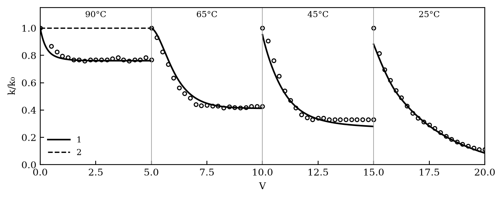
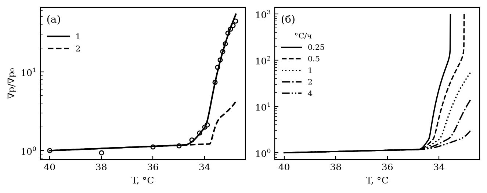
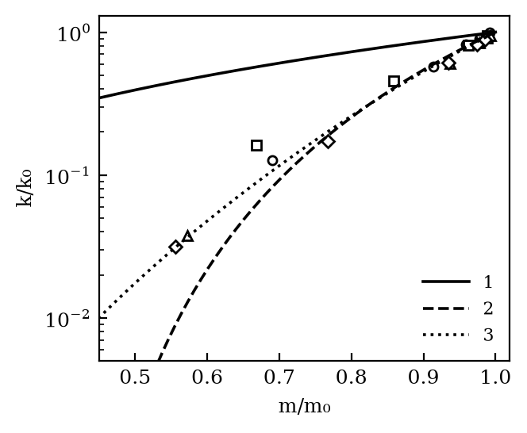
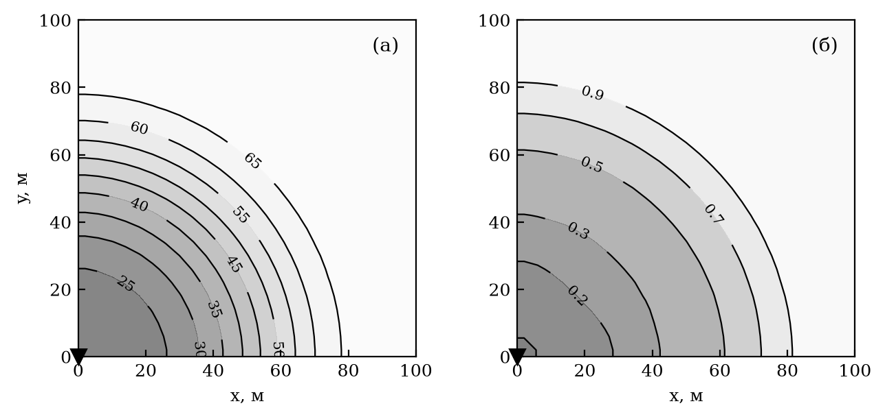
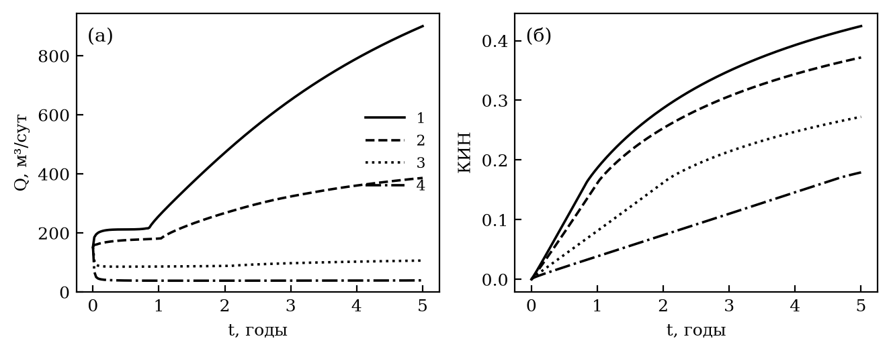

*УДК 532.546:536.42*

# ТЕРМИЧЕСКИЕ ПРОЦЕССЫ ПРИ ОСАЖДЕНИИ ПАРАФИНОВ, СМОЛ И АСФАЛЬТЕНОВ В ПЛАСТЕ: МОДЕЛЬ С ДЕТАЛЬНЫМ СОСТАВОМ НЕФТИ И СОПОСТАВЛЕНИЕ С ЭКСПЕРИМЕНТАМИ

**А.И. Никифоров, И.С. Лазарев**

*Институт механики и машиностроения — обособленное структурное подразделение Федерального государственного бюджетного учреждения науки «Федеральный исследовательский центр «Казанский научный центр Российской академии наук», г. Казань, 420111, Россия*

*E-mail: Lazarevigor1234@yandex.ru*

Поступила в редакцию

Построена модель неизотермической двухфазной фильтрации нефти с детальным составом — четырьмя группами н-алканов, асфальтенами и смолами. Модель учитывает фазовое равновесие парафина с поправкой на давление и растворенный газ, кинетику кристаллизации в объеме нефти и на стенках пор, удержание смол и асфальтенов породой с константой равновесия, зависящей от температуры, и теплообмен пласта с вмещающими породами. Поровое пространство описывается пучком капилляров или сетью пор и горл в приближении эффективной среды. Модель проверена по четырем сериям керновых экспериментов: прокачке парафинистой нефти ниже точки помутнения, ступенчатому охлаждению керна от 90 до 25°C, охлаждению керна с постоянной скоростью и измерениям пористости и проницаемости после отложения. Среднеквадратичное отклонение проницаемости от опытных данных составило {{RMS_MIN}}–{{RMS_MAX}}; прежняя модель давала {{LEG_MIN}}–{{LEG_MAX}} или закупорку керна. Показано, что при охлаждении керна со скоростью 1°C/ч число Дамкелера кристаллизации близко к единице, поэтому результат опыта зависит от скорости охлаждения: к концу охлаждения градиент давления вырастает в {{SD_FIN_0_25}} раз при 0.25°C/ч и в {{SD_FIN_4}} раза при 4°C/ч. В пласте это число около {{F_DA}}, и кристаллизация равновесна. Расчет заводнения элемента пласта с нефтью Жетыбая показал, что закачка воды при 20°C снижает коэффициент извлечения нефти за 5 лет на {{F_COOL_LOSS}} (с {{F_T70_RF}} до {{F_BASE_RF}}) по сравнению с изотермической закачкой. Снижение вызвано потерей приемистости нагнетательной скважины (скин-фактор {{F_BASE_SKIN}}), и {{F_RET_SHARE}}% его дает удержание смол и асфальтенов в охлажденной призабойной зоне, а не парафин. Теплообмен с вмещающими породами уменьшает массу отложений парафина в {{F_HL0_WAXRATIO}} раза, тогда как скрытая теплота кристаллизации и тепловое неравновесие флюидов и породы на показатели разработки не влияют.

**Ключевые слова:** неизотермическая фильтрация, парафиновые отложения, асфальтены, кинетика кристаллизации, повреждение пласта, теплообмен с вмещающими породами

# ВВЕДЕНИЕ

Охлаждение пласта ниже температуры начала кристаллизации парафина (WAT) при заводнении холодной водой приводит к выпадению твердой фазы в поровом пространстве и снижению проницаемости коллектора [1, 2]. Температурное поле пласта определяется конвективным переносом тепла фильтрационным потоком, теплообменом с вмещающими породами кровли и подошвы и выделением скрытой теплоты кристаллизации [3]. Эти процессы задают, где и когда нефть пересекает WAT, а значит — положение и интенсивность отложений.

Асфальтосмолопарафиновые отложения (АСПО) образуются не только парафином. Смолы и асфальтены удерживаются породой (адсорбция и механическое удержание в горлах пор), а их удержание зависит от температуры через константу равновесия адсорбции [4]. Кристаллизация парафина идет с конечной скоростью, и при быстром охлаждении пересыщение раствора отстает от равновесного [5]. Поэтому модель, претендующая на количественный прогноз, должна описывать детальный состав нефти, кинетику кристаллизации, удержание смол и асфальтенов и связь проницаемости с отложением. И ее параметры должны быть проверены по керновым экспериментам, в которых температурный режим задан и измерен.

Модели осаждения парафина в пласте [6–8] калибруются, как правило, по одному керновому опыту, а связь проницаемости с отложением задается пучком капилляров или степенной корреляцией [9]. Пучок капилляров не описывает перекрытия проводящих путей: проницаемость в нем исчезает лишь при закрытии всех каналов, тогда как в реальной породе она теряется на пороге протекания сети пор и горл [10].

Цель работы — построить модель неизотермической фильтрации с детальным составом нефти и кинетикой осаждения парафинов, смол и асфальтенов, проверить ее по четырем независимым сериям керновых опытов и на этой основе оценить влияние термических процессов — температуры закачки, теплообмена с вмещающими породами, скрытой теплоты, кинетики кристаллизации и теплового неравновесия — на повреждение пласта и показатели разработки.

# МАТЕМАТИЧЕСКАЯ МОДЕЛЬ

## Фильтрация и перенос компонентов

Рассматривается двухфазная неизотермическая фильтрация воды и нефти в приближении несжимаемых фаз без капиллярных и гравитационных сил; давление находится неявно, насыщенность, состав и температура — явно [7]. Нефтяная фаза состоит из групп н-алканов $k = 1, \ldots, N_w$ (парафины и воски), растворенных и флокулированных асфальтенов, смол и остатка. Массовая доля $w_c$ каждого компонента переносится уравнением

$$\frac{\partial}{\partial t}\left(m S_o \rho_o w_c\right) + \nabla\cdot\left(\rho_o w_c \mathbf{U}_o\right) = q_o \rho_o w_c - \rho_o s_c, \qquad (1)$$

где $m$ — пористость, $S_o$ — нефтенасыщенность, $\rho_o$ — плотность нефти, $\mathbf{U}_o$ — скорость фильтрации нефти, $q_o$ — дебит скважин, $s_c$ — сток компонента в отложения (кристаллизация, удержание, осаждение флокул асфальтенов). Состав нефти Жетыбая задан распределением н-алканов C17–C60 по числу атомов углерода, разбитым на четыре группы (C17–22, C23–30, C31–40, C41–60), и долями SARA; свойства групп — по корреляциям Вона [11].

## Равновесие и кинетика кристаллизации

Предел растворимости группы — уравнение идеальной растворимости с поправкой на давление:

$$\ln x_k^{sat} = -\frac{\Delta H_{eff}}{R}\left(\frac{1}{T} - \frac{1}{T_{m,k}}\right) - \frac{\Delta v_k\,(P - P_{ref})}{R T}, \qquad (2)$$

где $x_k^{sat}$ — мольная доля группы в насыщенном растворе, $T_{m,k}$ — температура плавления группы, $\Delta H_{eff}$ — эффективная теплота растворения, подобранная по кривой выпадения парафина нефти Жетыбая [12], $\Delta v_k$ — изменение молярного объема при плавлении, $P_{ref}$ — давление измерения кривой. Каждая группа выпадает в собственную твердую фазу; растворенный газ разбавляет раствор и понижает WAT.

Равновесная доля взвеси $w_{s,k}^{eq}$ достигается с конечной скоростью [5]:

$$\frac{d w_{s,k}}{dt} = k_{cr}\left(w_{s,k}^{eq} - w_{s,k}\right). \qquad (3)$$

Пересыщение снимается двумя конкурирующими путями — кристаллизацией в объеме нефти (константа $k_{cr}$) и на стенках пор (константа $k_w$). Кристаллы в объеме переносятся к стенкам конвективной диффузией; скорость сужения капилляра радиуса $r$ по решению Левека

$$u(r) = -S_o^* w_s\left(\frac{2 u_m D_p^2}{r L_k}\right)^{1/3}, \qquad u_m = \frac{|\nabla p|\,r^2}{8\eta\mu}, \qquad D_p = f_D\frac{k_B T}{3\pi\mu d_p}, \qquad (4)$$

где $S_o^*$ — подвижная нефтенасыщенность, $L_k$ — длина порового канала, $\eta$ — извилистость, $\mu$ — вязкость нефти, $d_p$ — диаметр кристалла, $f_D$ — множитель броуновской диффузии. Канал с горлом $\gamma r < d_p/2$ блокируется кристаллом [7].

## Удержание смол и асфальтенов

Растворенные асфальтены и смолы удерживаются породой по кинетической изотерме Ленгмюра с константой равновесия, зависящей от температуры по Вант-Гоффу:

$$\frac{d\Gamma}{dt} = k_{ads}\left(\Gamma_{eq} - \Gamma\right), \qquad \Gamma_{eq} = \Gamma_{max}\frac{K c}{1 + K c}, \qquad K = K_{ref}\exp\left[-\frac{\Delta H_{ads}}{R}\left(\frac{1}{T} - \frac{1}{T_{ref}}\right)\right], \qquad (5)$$

где $\Gamma$ — удержанная масса на единицу объема породы (ее прирост — сток $s_c$ в (1)), $c$ — массовая доля в нефти, $\Delta H_{ads} < 0$ — энтальпия адсорбции. Емкость $\Gamma_{max}$ отнесена к удельной поверхности породы, а скорость массообмена к стенке $k_{ads} \propto D_m \propto T/\mu$ растет с температурой по Уилки—Чангу [13]. Удержанный объем $\sigma = (\Gamma_a + \Gamma_r)/\rho_{ad}$ снижает проницаемость по функции повреждения Сивана [4]:

$$\frac{k}{k_0} = \frac{k_b}{k_0}\left(1 - \beta\frac{\sigma}{\sigma_{max} m_0}\right)^{\gamma_d}, \qquad (6)$$

где $k_b$ — проницаемость порового пространства с отложениями парафина. В поле нефть и порода контактируют геологическое время, поэтому начальное удержание $\sigma_0$ принимается равновесным при пластовой температуре, а повреждение отсчитывается от него.

При заводнении в промытой зоне остается мало нефти, и масса растворенных асфальтенов в ячейке оказывается меньше емкости удержания. Явная запись (5) за шаг выбирает всю растворенную фракцию, а на следующем шаге при $c = 0$ десорбирует, и шаги колеблются. Поэтому шаг (5) записан неявно по концентрации в нефти ячейки: $\Delta\Gamma = f\,[\Gamma_{eq}(c - \Delta\Gamma/a) - \Gamma]$, где $f = 1 - e^{-k_{ads}\Delta t}$, $a$ — масса нефти в ячейке. Это квадратное уравнение; его положительный корень не пересекает равновесия и не делает концентрацию отрицательной.

## Поровое пространство

Поровое пространство описывается функцией распределения капилляров по радиусам $\varphi(r, t)$ с начальным логнормальным распределением Косуги [14]. Сужение и блокирование каналов меняют ее по уравнению [15]

$$\frac{\partial \varphi}{\partial t} + \frac{\partial (u\varphi)}{\partial r} = -b(r)\varphi, \qquad (7)$$

где $b(r)$ — скорость блокирования. Пористость и проницаемость пучка — моменты решения (7) $\int r^2\varphi\,dr$ и $\int r^4\varphi\,dr$, отнесенные к начальным.

В сети пор и горл [10, 16] проводимость дают горла радиуса $r_t = \gamma_t(r + h) - h$, где $h$ — толщина слоя отложений, а горла соединены с координационным числом $z$. Эффективная проводимость горла $g_m$ сети находится по приближению эффективной среды Киркпатрика [10]:

$$\sum_i w_i\frac{g_m - g_i}{g_i + (z/2 - 1)\,g_m} + \frac{w_b}{z/2 - 1} = 0, \qquad \frac{k}{k_0} = \frac{g_m}{g_m^0}, \qquad (8)$$

где $w_i$ — доли открытых горл с проводимостью $g_i \propto r_t^4$, $w_b$ — доля закрытых. Проницаемость сети исчезает на пороге протекания $p_c = 2/z$, а не при закрытии всех каналов.

## Уравнение энергии

Температура находится из баланса энергии в однотемпературном приближении:

$$\frac{\partial}{\partial t}\Big[\left(C_{eff} + m S_o \rho_o L_0 H_l\right) T\Big] + \nabla\cdot\Big[\left(\rho_w C_w \mathbf{U}_w + \rho_o c_o \mathbf{U}_o\right) T + \rho_o L_0 H_l \mathbf{U}_o\Big] = \nabla\cdot\left(\Lambda\nabla T\right) + Q_w - q_l, \qquad (9)$$

где $H_l = \sum_k (L_k/L_0)\, w_k^d$ — носитель скрытой теплоты, $C_{eff}$ — объемная теплоемкость пласта с флюидами и отложениями, $\Lambda$ — эффективная теплопроводность, $Q_w$ — источник тепла скважин, $L_k$ — калориметрическая теплота кристаллизации группы, $L_0$ — ее опорное значение, $w_k^d$ — растворенная доля группы. Растворенный парафин несет теплоту кристаллизации сверх энтальпии твердого, поэтому она выделяется при выпадении и поглощается при растворении без отдельного источника.

Сток $q_l$ — теплообмен с полубесконечными вмещающими породами через кровлю и подошву. Он рассчитывается методом Винсома—Вестервельда [17] с пробным профилем температуры в породах или по схеме Ловерье [18]:

$$q_l = \frac{2 K_{ff}\left(T - T_0\right)}{h\sqrt{\pi \alpha_{ff} t}}, \qquad (10)$$

где $K_{ff}$ и $\alpha_{ff}$ — теплопроводность и температуропроводность вмещающих пород, $h$ — толщина пласта, $T_0$ — начальная температура. В варианте с тепловым неравновесием температура породы $T_s$ отделена от температуры флюидов и обменивается с ней через межфазный коэффициент теплоотдачи зернистого слоя [19].

# ОПЫТЫ И ПОДБОР ПАРАМЕТРОВ

Модель проверялась по четырем сериям керновых опытов, в которых температурный режим задан явно:

- прокачка парафинистой нефти через керн Berea ниже точки помутнения, два опыта с разными нефтями (Sutton и Roberts [20], данные — по [6, 8]);
- ступенчатое охлаждение керна с прокачкой нефти Жетыбая, 90 → 65 → 45 → 25°C (Li и др. [12]);
- охлаждение керна со скоростью 1°C/ч при прокачке раствора парафина с измерением градиента давления и томографией пор до и после опыта (Sandyga и др. [2]);
- пары пористость — проницаемость кернов после отложения парафина (He и др. [21]).

Керн рассчитывается той же программой, что и пласт, на одномерной сетке. Точность модели оценивается среднеквадратичным отклонением (СКО) $k/k_0$ по точкам опыта. Собственный разброс точек опыта (шумовой порог) оценен по вторым разностям, а для опыта Sandyga и др. — по точности оцифровки. Модель, проходящая к точкам ближе порога, подогнана под шум, поэтому целью служит больший из порога и 0.05.

Параметры подбирались по семействам опытов, а калибровка и прогноз разделены. Термодинамика групп парафина, вязкость и предел текучести геля определены по независимым измерениям свойств нефти [12]. По опытам Sutton и Roberts подбирались диаметр кристалла $d_p$ и множитель диффузии $f_D$ в (4) и параметры выноса отложений. По ступеням 90, 65 и 45°C опыта Li и др. — параметры удержания смол и асфальтенов в (5) и (6), а по ступени 25°C — константа кристаллизации в (3) и $d_p$, $f_D$. По опыту Sandyga и др. — кинетика кристаллизации на стенках и WAT пористой среды; распределение пор после опыта служило проверкой. Пары He и др. не подбирались.

В постановке опытов учтены две детали протокола. Перед каждой ступенью опыта Li и др. керн выдерживался без прокачки {{LI_HOLD}} ч до выравнивания температуры, и за это время поровая нефть приходит к равновесию. Без выдержки выпадение взвеси после нормировки проницаемости принималось бы за повреждение. В опыте Sandyga и др. WAT раствора в пористой среде (подобрано {{SD_WAT}}°C) выше измеренной в объеме ({{SD_WAT_AUTH}}°C): стенки пор служат центрами кристаллизации.

# СОПОСТАВЛЕНИЕ С ЭКСПЕРИМЕНТАМИ

Сводка СКО по всем опытам приведена в табл. 1, кривые — на рис. 1–4.

Таблица 1. Среднеквадратичное отклонение $k/k_0$ от опытных точек

{{T1}}

Для He и др. в столбце «Настоящая модель» указана сеть пор и горл, в столбце «Другие модели» — степенная зависимость $k/k_0 = (m/m_0)^n$ с подобранным $n = {{HE_POWER_N}}$.

**Опыты Sutton и Roberts** (рис. 1). Пучок капилляров с выносом отложений описывает оба опыта с СКО {{SR_OWN1}} и {{SR_OWN2}} при шумовом пороге {{SR_NOISE1}} и {{SR_NOISE2}}; модель Wang и Civan [8] с тем же числом подбираемых коэффициентов дает {{SR_WC1}} и {{SR_WC2}}. Начальный провал проницаемости дает блокирование узких каналов кристаллами, последующий медленный спад — сужение широких. Плато опыта 2 воспроизводится только с выносом отложений потоком. Если кинетика осаждения общая для обеих нефтей, а различается только их вязкость, СКО составляет {{SR_VISC1}} и {{SR_VISC2}}.

**Опыт Li и др.** (рис. 2). Ступени 90, 65 и 45°C лежат выше WAT нефти (45.3°C) или у самой WAT, парафин на них растворен, и проницаемость теряется за счет удержания смол и асфальтенов. Удержание растет при охлаждении: подобранная энтальпия адсорбции ${-\Delta H_{ads}} = {{LI_DH}}$ кДж/моль. Прежняя модель без удержания на ступени 90°C повреждения не дает, а на следующей закупоривает керн. Ступени описаны с СКО {{LI_90}}, {{LI_65}}, {{LI_45}}. На ступени 25°C к удержанию добавляется кристаллизация: при диаметре кристалла {{LI_DCR}} мкм и времени кристаллизации в объеме $1/k_{cr} = {{LI_TCR}}$ с СКО ступени составляет {{LI_25}}. Пленочная форма кинетики удержания описывает ступени выше WAT хуже (СКО {{LI_FILM}}): в опыте проницаемость выходит на плато плавно, как при массообмене со стороны твердой фазы.

**Опыт Sandyga и др.** (рис. 3а). Градиент давления при охлаждении с 40 до 32.8°C вырос в 44 раза. Модель с кристаллизацией пересыщенного раствора на стенках пор описывает рост с СКО {{SD_RMS}} в шкале $k/k_0$ ({{SD_RMSLG}} в шкале $\lg(\nabla p/\nabla p_0)$ при пороге оцифровки {{SD_NOISE}}), прежняя модель — {{SD_LEG}}. Отложение в подборе — сплошной осадок, а не гель. Проводящая пористость после опыта в модели {{SD_MCOND}} от начальной против {{SD_MEXP}} по томографии, немного ниже диапазона ее погрешности (±0.03): равномерный слой отложений заполняет узкие поры в большей доле, чем широкие, а томография показывает близкие потери во всех классах пор.

**Пары пористость — проницаемость** (рис. 4). Пучок капилляров теряет проницаемость много медленнее пористости (СКО {{HE_BUNDLE}}): сужение каналов почти не отнимает проводимости, пока каналы не закрылись. Сеть пор и горл с одним подобранным параметром — отношением горла к поре — дает {{HE_NET}}, пучок с сужениями — {{HE_CONSTR}}, степенная зависимость — {{HE_POWER}}. Приближение эффективной среды совпадает с прямым расчетом случайной решетки $14^3$ с той же геометрией до {{HE_LATTICE}} по $k/k_0$, поэтому сеть рассчитывается по (8) без решения сетевой задачи в каждой ячейке. Однако в опытах, где проницаемость теряется из-за блокирования горл кристаллами (Sutton и Roberts, Sandyga и др.), сеть хуже пучка: она рано переходит порог протекания.

Таким образом, во всех четырех сериях отклонение модели не превышает 0.05 или шумового порога опыта, причем параметры удержания, найденные выше WAT, переносятся на ступень ниже WAT, а параметры кинетики — на распределение пор после опыта.

# ВЛИЯНИЕ ТЕРМИЧЕСКИХ ПРОЦЕССОВ

## Керн: скорость охлаждения

Конечная скорость кристаллизации делает результат кернового опыта зависящим от скорости охлаждения. Отношение времени охлаждения на 1°C к времени кристаллизации — число Дамкелера $\mathrm{Da} = k_{cr}/v_T$, где $v_T$ — скорость охлаждения. В опыте Sandyga и др. подобранное время кристаллизации $1/k_{cr} = {{SD_TCR}}$ мин, и при скорости опыта $\mathrm{Da} = {{SD_DA_1}}$ — режим, в котором результат наиболее чувствителен к скорости. Прогноз модели с теми же параметрами при скоростях 0.25–4°C/ч показан на рис. 3б. При 0.25°C/ч ($\mathrm{Da} = {{SD_DA_0_25}}$) пересыщение успевает сняться на стенках пор у самой WAT, и к 32.8°C градиент вырастает в {{SD_FIN_0_25}} раз — керн практически закупорен. При 4°C/ч ($\mathrm{Da} = {{SD_DA_4}}$) пересыщение отстает от равновесия, и градиент вырастает лишь в {{SD_FIN_4}} раза. Температура десятикратного роста градиента между скоростями {{SD_DT10_LO}} и {{SD_DT10_HI}}°C/ч смещается на {{SD_DT10}}°C. Опыт при двух скоростях охлаждения позволил бы отделить кинетику кристаллизации от равновесной модели.

## Пласт: постановка

Рассматривается элемент симметрии пятиточечной системы заводнения 200 × 200 м толщиной 10 м (сетка 50 × 50). Нагнетательная и добывающая скважины расположены в противоположных углах и работают при забойных давлениях 17 и 7 МПа. Начальные давление 12 МПа и температура 70°C, расчет — на 5 лет. Нефть — нефть Жетыбая с детальным составом, содержание парафина {{F_WAX0}}% масс. Давление начала осаждения асфальтенов 11 МПа, давление насыщения 9.5 МПа. Параметры удержания смол и асфальтенов и кинетики кристаллизации взяты из подбора по опыту Li и др. на той же нефти. Базовый вариант — закачка воды при 20°C с теплообменом с вмещающими породами по методу Винсома—Вестервельда. Остальные варианты отличаются от базового одним фактором (табл. 2).

Таблица 2. Показатели вариантов через 5 лет

{{T2}}

Прирост удержания отсчитан от начального равновесного. Отрицательный прирост — десорбция: при снижении давления асфальтены флокулируют, их растворенная доля падает, а с ней и равновесное удержание. Скин-фактор нагнетательной скважины рассчитан по проницаемости ее ячейки.

## Базовый вариант

За 5 лет охлаждается лишь зона у нагнетательной скважины (рис. 5а): температура ниже середины перепада — на {{F_BASE_COLD}}% площади элемента, ниже местной WAT — на {{F_BASE_BELOW}}%. Тепловой фронт отстает от фронта вытеснения: через год вода продвинулась по диагонали на {{F_FRONT_W}} м, фронт охлаждения — на {{F_FRONT_T}} м. Тепловой фронт движется со скоростью $U\rho_w C_w/C_{eff}$, то есть в $m\rho_w C_w/C_{eff} = {{F_VT_RATIO}}$ от средней скорости воды в порах, а фронт вытеснения — быстрее средней скорости. Тепловое число Пекле радиального течения у скважины $\mathrm{Pe} = Q\rho_w C_w/(2\pi h\Lambda) = {{F_PE}}$, где $Q$ — приемистость: тепло переносится конвекцией. Фронт охлаждения при этом размыт — перепад от 10 до 90% занимает около {{F_WIDTH}} м — теплообменом с вмещающими породами и теплопроводностью.

В остывшей зоне растет удержание смол и асфальтенов. При подобранной энтальпии адсорбции константа Ленгмюра при охлаждении с 70 до 20°C возрастает в {{F_KRATIO}} раз, и удержание приближается к предельному. Начальное равновесное удержание при 70°C составляет {{F_SIG0}} от предельного по функции повреждения (6), то есть пласт уже работает у края этой функции. Поэтому даже небольшой прирост удержания у скважины резко снижает проницаемость (рис. 5б): в ячейке нагнетательной скважины $k/k_0 = {{F_BASE_KINJ}}$, скин-фактор {{F_BASE_SKIN}}. Парафин выпадает в той же зоне, до {{F_BASE_WAXMAX}}% порового объема. Всего осело {{F_BASE_WAX}} т парафина, по группам C17–22 / C23–30 / C31–40 / C41–60 — {{F_GROUPS}}%: оседают в основном тяжелые парафины и воски. Приемистость скважины за первые месяцы падает с {{F_BASE_Q0}} до {{F_BASE_QMIN}} м³/сут и к концу расчета восстанавливается лишь до {{F_BASE_QEND}} м³/сут (рис. 6а) — за счет роста водонасыщенности и подвижности воды.

## Температура закачки

Температура закачиваемой воды — главный фактор (рис. 6, табл. 2). При изотермической закачке (70°C) повреждения у нагнетательной скважины нет, и за 5 лет закачано {{F_T70_INJ}} тыс. м³ воды, коэффициент извлечения нефти (КИН) {{F_T70_RF}}. При 40°C парафин не выпадает: WAT живой нефти при пластовом давлении {{F_WAT0}}°C ниже температуры закачки. Но удержание смол и асфальтенов дает скин {{F_T40_SKIN}}, и КИН снижается до {{F_T40_RF}}. При 20°C КИН {{F_BASE_RF}}, при 5°C — {{F_T5_RF}}. При 20°C воды закачано на {{F_INJ_LOSS}}% меньше, чем при изотермической закачке, и во столько же раз меньше отобрано жидкости: фазы несжимаемы, и отбор равен закачке.

Потеря приемистости имеет и вторичное следствие. Закачка перестает поддерживать давление, и к концу расчета среднее давление в пласте {{F_BASE_PMEAN}} МПа против {{F_T70_PMEAN}} МПа при изотермической закачке. Давление по всей площади опускается ниже давления начала осаждения асфальтенов, флокулы образуются во всем пласте, и в осадок уходит {{F_BASE_ASPH}} т асфальтенов и смол против {{F_T70_ASPH}} т. При изотермической закачке осадок асфальтенов сосредоточен у добывающей скважины ({{F_T70_ASPHPROD}}% порового объема ее ячейки, $k/k_0 = {{F_T70_KPROD}}$). Давление в базовом варианте опускается и ниже давления насыщения, где модель не описывает свободную газовую фазу. Поэтому КИН базового варианта — оценка. Вывод о потере приемистости от этого не зависит: приемистость падает за {{F_QDROP_DAYS}} сут, а на большей части площади давление опускается ниже давления насыщения лишь через {{F_PB_YEARS}} года.

## Теплообмен, скрытая теплота, тепловое неравновесие

При закачке воды холоднее пласта вмещающие породы служат для него источником теплоты. Без теплообмена с кровлей и подошвой средняя температура пласта через 5 лет {{F_HL0_TMEAN}}°C против {{F_BASE_TMEAN}}°C, остывшая зона шире ({{F_HL0_COLD}}% площади), и парафина выпадает в {{F_HL0_WAXRATIO}} раза больше ({{F_HL0_WAX}} т). КИН при этом снижается лишь на {{F_HL0_DRF_ABS}}: закачку ограничивает повреждение в зоне у скважины, а она охлаждается до температуры закачки конвекцией при любом теплообмене. Схема Ловерье (10) занижает теплоприток: парафина выпадает на {{F_HL1_WAXPCT}}% больше, чем по методу Винсома—Вестервельда, КИН ниже на {{F_HL1_DRF_ABS}}.

Скрытая теплота кристаллизации на температурное поле практически не влияет. Число Стефана — отношение ощутимой теплоты охлаждения пласта с 70 до 20°C к скрытой теплоте выпадающего при этом парафина ({{F_WPREC}}% масс.) — даже при начальной нефтенасыщенности составляет $\mathrm{Ste} = C_{eff}\Delta T/(m S_o \rho_o \Delta w L) = {{F_STE}}$. Без скрытой теплоты (слагаемых с $H_l$ в (9)) КИН меняется на {{F_NOLATENT_DRF}}.

Тепловое неравновесие флюидов и породы также пренебрежимо. Время релаксации их температур для зерна {{F_DG}} мм даже при наименьшем числе Нуссельта ($\mathrm{Nu} = 2$) — {{F_TAU_LTNE}} с, много меньше шага по времени (десятки минут) и времени прохождения теплового фронта. Расчет с отдельной температурой породы совпадает с однотемпературным с относительной точностью {{F_LTNE_REL}}.

## Кинетика кристаллизации и давление в равновесии

В пласте кинетика кристаллизации не проявляется. Время кристаллизации в объеме, подобранное по ступени 25°C опыта Li и др., $1/k_{cr} = {{LI_TCR}}$ с, а частица нефти охлаждается за время прохождения размытого теплового фронта — около {{F_TPASS}} сут, так что число Дамкелера $k_{cr} t$ около {{F_DA}}. Пересыщение снимается за один шаг по времени, и равновесная кристаллизация дает те же показатели с относительной точностью {{F_EQUIL_REL}}. В керне же $\mathrm{Da} \sim 1$ (рис. 3б): кинетика, без которой не описать опыты, при переносе на пласт вырождается в равновесие.

Давление и растворенный газ в (2) понижают WAT живой нефти до {{F_WAT0}}°C против 45.3°C у дегазированной. Без их учета парафина выпадает {{F_NOPRESS_WAX}} т вместо {{F_BASE_WAX}}, скин нагнетательной скважины {{F_NOPRESS_SKIN}} вместо {{F_BASE_SKIN}}, КИН ниже на {{F_NOPRESS_DRF_ABS}}. Вместе с газом из равновесия уходит и флокуляция асфальтенов при снижении давления, поэтому этот вариант завышает осаждение парафина и не видит осаждения асфальтенов.

## Удержание смол и асфальтенов и парафин

Вклад двух механизмов повреждения разделяет вариант без удержания смол и асфальтенов. Без него скин нагнетательной скважины при закачке 20°C составляет лишь {{F_NORET_SKIN}}, а КИН — {{F_NORET_RF}}. Парафина при этом выпадает в {{F_NORET_WAXRATIO}} раза больше ({{F_NORET_WAX}} т): воды закачано втрое больше, и остывшая зона шире. Однако парафин оседает по всей остывшей зоне, а не в ячейке скважины, и приемистость почти не снижает. Снижение КИН за 5 лет от охлаждения составляет {{F_COOL_LOSS}} (20°C против 70°C). Из него {{F_RET_SHARE}}% приходится на удержание смол и асфальтенов, а оставшиеся {{F_COOL_LOSS_NORET}} — на рост вязкости охлажденной нефти и отложения парафина. Для нефти Жетыбая термическое повреждение призабойной зоны определяется поэтому не парафином, а смолами и асфальтенами. Удержание их при охлаждении подтверждено опытом Li и др. выше WAT, где парафин растворен.

# ЗАКЛЮЧЕНИЕ

1. Модель с детальным составом нефти, кинетикой кристаллизации и удержанием смол и асфальтенов описывает четыре серии керновых опытов с разным температурным режимом со среднеквадратичным отклонением проницаемости {{RMS_MIN}}–{{RMS_MAX}}, не выше 0.05 или шумового порога опыта. Параметры удержания, подобранные выше температуры кристаллизации, переносятся на ступень ниже нее. Проводящая пористость после охлаждения керна занижена ({{SD_MCOND}} против {{SD_MEXP}} по томографии): равномерный слой отложений не заполняет широкие поры в той же доле, что узкие.

2. Связь проницаемости с пористостью при отложении требует учета горл: пучок капилляров дает отклонение {{HE_BUNDLE}}, сеть пор и горл — {{HE_NET}}. Приближение эффективной среды совпадает с прямым расчетом решетки до {{HE_LATTICE}} и позволяет рассчитывать сеть без решения сетевой задачи в каждой ячейке. В опытах с блокированием горл кристаллами сеть уступает пучку, и эти два механизма требуют раздельного описания.

3. Удержание смол и асфальтенов растет при охлаждении с эффективной энтальпией адсорбции −{{LI_DH}} кДж/моль и объясняет потерю проницаемости керна выше температуры кристаллизации парафина. При заводнении холодной водой оно определяет повреждение призабойной зоны нагнетательной скважины: без него снижение коэффициента извлечения от охлаждения составило бы {{F_COOL_LOSS_NORET}} вместо {{F_COOL_LOSS}}.

4. Кинетика кристаллизации проявляется в керновых опытах, где число Дамкелера близко к единице, и делает их результат зависящим от скорости охлаждения: при {{SD_DT10_LO}}–{{SD_DT10_HI}}°C/ч температура десятикратного роста градиента давления смещается на {{SD_DT10}}°C, а рост к концу охлаждения при 0.25–4°C/ч меняется от {{SD_FIN_4}} до {{SD_FIN_0_25}} раз. Это проверяемое предсказание модели. В пласте время охлаждения на порядки больше времени кристаллизации, и равновесная кристаллизация дает те же результаты.

5. Главный термический фактор — температура закачиваемой воды: коэффициент извлечения за 5 лет составляет {{F_T70_RF}}, {{F_T40_RF}}, {{F_BASE_RF}} и {{F_T5_RF}} при 70, 40, 20 и 5°C. Теплообмен с вмещающими породами уменьшает отложения парафина в {{F_HL0_WAXRATIO}} раза, но коэффициент извлечения меняет лишь на {{F_HL0_DRF_ABS}}: закачку ограничивает зона у скважины, которая охлаждается конвекцией. Схема Ловерье занижает теплоприток и завышает отложения на {{F_HL1_WAXPCT}}%. Скрытая теплота кристаллизации (число Стефана {{F_STE}}) и тепловое неравновесие флюидов и породы (время релаксации {{F_TAU_LTNE}} с) влияния не оказывают.

6. Термические и барические процессы связаны: потеря приемистости снижает пластовое давление ниже давления начала осаждения асфальтенов по всей площади, и асфальтены оседают во всем пласте, а не только у добывающей скважины.

Работа выполнена за счет предоставленного в 2026 году Фондом науки и технологий Республики Татарстан гранта на осуществление фундаментальных и поисковых исследований в научных и образовательных организациях, предприятиях и организациях реального сектора экономики Республики Татарстан.

# СПИСОК ЛИТЕРАТУРЫ

1. *Коробов Г.Ю., Парфенов Д.В., Нгуен Ван Тханг.* Механизмы образования асфальтосмолопарафиновых отложений и факторы интенсивности их формирования // Известия Томского политехнического университета. Инжиниринг георесурсов. 2023. Т. 334. № 4. С. 103.
2. *Sandyga M.S., Struchkov I.A., Rogachev M.K.* Formation Damage Induced by Wax Deposition: Laboratory Investigations and Modeling // J. Pet. Explor. Prod. Technol. 2020. V. 10. P. 2541.
3. *Филиппов А.И., Михайлов П.Н., Филиппов К.А., Салихов Р.Ф., Ковальский А.А.* Использование баротермического эффекта для нагрева нефтяного пласта // ТВТ. 2009. Т. 47. № 5. С. 752.
4. *Civan F.* Reservoir Formation Damage. 3rd ed. Waltham: Gulf Professional Publishing, 2015. 1042 p.
5. *Huang Z., Lee H.S., Senra M., Fogler H.S.* A Fundamental Model of Wax Deposition in Subsea Oil Pipelines // AIChE J. 2011. V. 57. № 11. P. 2955.
6. *Ring J.N., Wattenbarger R.A., Keating J.F., Peddibhotla S.* Simulation of Paraffin Deposition in Reservoirs // SPE Prod. Facil. 1994. V. 9. № 1. P. 36.
7. *Nikiforov A.I., Sadovnikov R.V., Nikiforov G.A.* Modeling of Paraffin Deposition During Oil Production by Cold Water Injection // Lobachevskii J. Math. 2022. V. 43. P. 1178.
8. *Wang Sh., Civan F.* Model-Assisted Analysis of Simultaneous Paraffin and Asphaltene Deposition in Laboratory Core Tests // J. Energy Resour. Technol. 2005. V. 127. № 4. P. 318.
9. *Kozeny J.* Ueber kapillare Leitung des Wassers im Boden // Sitzungsber. Akad. Wiss. Wien. 1927. V. 136. № 2a. P. 271.
10. *Kirkpatrick S.* Percolation and Conduction // Rev. Mod. Phys. 1973. V. 45. № 4. P. 574.
11. *Won K.W.* Thermodynamics for Solid Solution-Liquid-Vapor Equilibria: Wax Phase Formation from Heavy Hydrocarbon Mixtures // Fluid Phase Equilib. 1986. V. 30. P. 265.
12. *Li X., Zhao L., Fei R., Zhou F., Yuan S. et al.* Cooling Damage Characterization and Chemical-Enhanced Oil Recovery in Low-Permeable and High-Waxy Oil Reservoirs // Processes. 2024. V. 12. № 2. P. 421.
13. *Wilke C.R., Chang P.* Correlation of Diffusion Coefficients in Dilute Solutions // AIChE J. 1955. V. 1. № 2. P. 264.
14. *Kosugi K.* Lognormal Distribution Model for Unsaturated Soil Hydraulic Properties // Water Resour. Res. 1996. V. 32. № 9. P. 2697.
15. *Никифоров А.И., Никаньшин Д.П.* Перенос частиц двухфазным фильтрационным потоком // Матем. моделирование. 1998. Т. 10. № 6. С. 42.
16. *Fatt I.* The Network Model of Porous Media // Trans. AIME. 1956. V. 207. P. 144.
17. *Vinsome P.K.W., Westerveld J.* A Simple Method for Predicting Cap and Base Rock Heat Losses in Thermal Reservoir Simulators // J. Can. Pet. Technol. 1980. V. 19. № 3. P. 87.
18. *Lauwerier H.A.* The Transport of Heat in an Oil Layer Caused by the Injection of Hot Fluid // Appl. Sci. Res. Sect. A. 1955. V. 5. P. 145.
19. *Wakao N., Kaguei S.* Heat and Mass Transfer in Packed Beds. N.Y.: Gordon and Breach, 1982. 364 p.
20. *Sutton G.D., Roberts L.D.* Paraffin Precipitation During Fracture Stimulation // J. Pet. Technol. 1974. V. 26. № 9. P. 997.
21. *He Y., Pu W., Chen X. et al.* Cold Damage from Wax Deposition in a Shallow, Low-Temperature, and High-Wax Reservoir in Changchunling Oilfield // Sci. Rep. 2020. V. 10. P. 14223.

# ПОДПИСИ К РИСУНКАМ

Рис. 1. Проницаемость керна Berea в зависимости от объема прокачанной нефти $V$ (в поровых объемах керна) в опытах Sutton и Roberts [20]: (а) — опыт 1, (б) — опыт 2; точки — опыт; 1 — настоящая модель (пучок капилляров с выносом отложений); 2 — модель Wang и Civan [8]; 3 — прежняя модель [7].

Рис. 2. Проницаемость керна на ступенях охлаждения опыта Li и др. [12], отнесенная к проницаемости в начале ступени, в зависимости от объема прокачанной нефти $V$ (в поровых объемах): точки — опыт; 1 — настоящая модель (удержание смол и асфальтенов, кинетика кристаллизации парафина); 2 — прежняя модель (после ступени 90°C керн закупорен). Числа над графиком — температура ступени.

Рис. 3. Отношение градиента давления к начальному при охлаждении керна в опыте Sandyga и др. [2]: (а) — скорость охлаждения 1°C/ч, точки — опыт, 1 — настоящая модель, 2 — прежняя модель; (б) — прогноз настоящей модели при скоростях охлаждения 0.25–4°C/ч (числа у линий — скорость охлаждения).

Рис. 4. Проницаемость кернов в зависимости от пористости после отложения парафина в опытах He и др. [21] (точки, символы — керны четырех скважин): 1 — пучок капилляров; 2 — сеть пор и горл, приближение эффективной среды, z = 6; 3 — пучок капилляров с сужениями.

Рис. 5. Поля температуры, °C (а), и проницаемости $k/k_0$ (б) базового варианта через 5 лет в четверти элемента у нагнетательной скважины (треугольник). Числа на изолиниях — значения величины; более темная заливка отвечает меньшему значению.

Рис. 6. Приемистость нагнетательной скважины (а) и коэффициент извлечения нефти (б) при температуре закачиваемой воды 70 (1), 40 (2), 20 (3) и 5°C (4).
