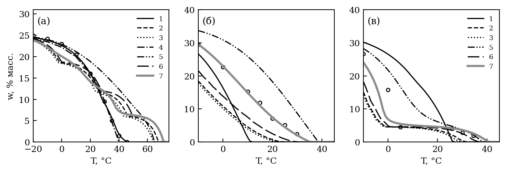
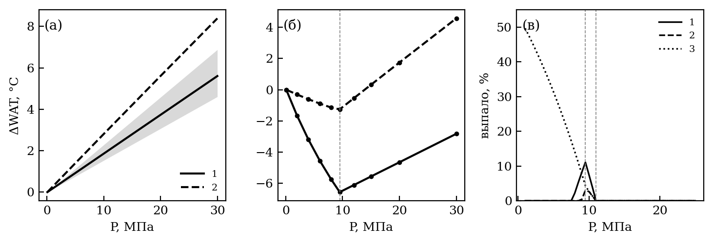
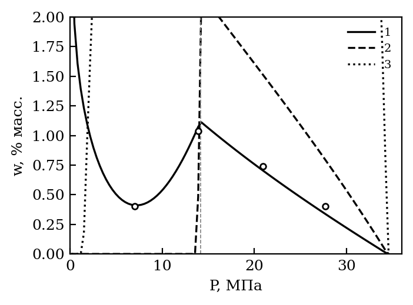
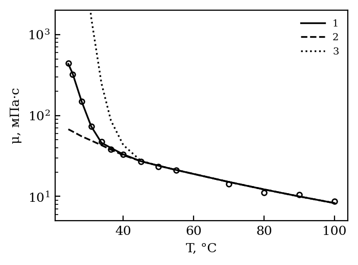
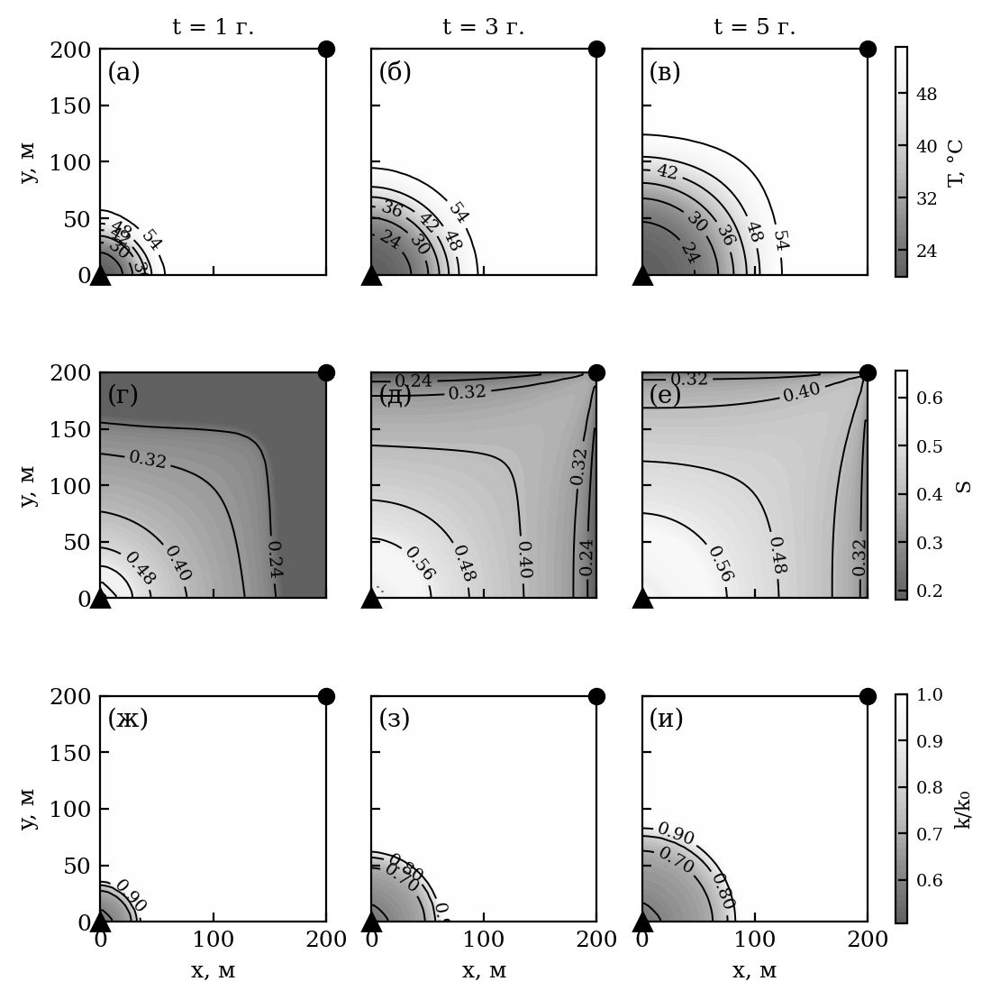
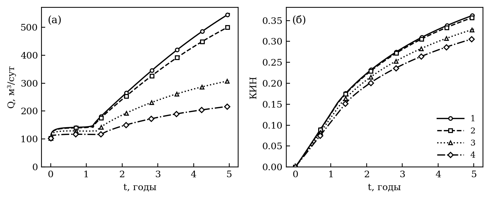

*УДК 532.546:536.42*

# ТЕПЛООБМЕН С ВМЕЩАЮЩИМИ ПОРОДАМИ И ОСАЖДЕНИЕ ПАРАФИНОВ, СМОЛ И АСФАЛЬТЕНОВ ПРИ ЗАВОДНЕНИИ ХОЛОДНОЙ ВОДОЙ: МОДЕЛЬ С ДЕТАЛЬНЫМ СОСТАВОМ НЕФТИ И СОПОСТАВЛЕНИЕ С ЭКСПЕРИМЕНТАМИ

**А.И. Никифоров, И.С. Лазарев**

*Институт механики и машиностроения — обособленное структурное подразделение Федерального государственного бюджетного учреждения науки «Федеральный исследовательский центр «Казанский научный центр Российской академии наук», г. Казань, 420111, Россия*

*E-mail: Lazarevigor1234@yandex.ru*

Поступила в редакцию

<!-- полная -->
Построена модель неизотермической двухфазной фильтрации нефти с детальным составом — четырьмя группами н-алканов, асфальтенами и смолами, — учитывающая кинетику кристаллизации парафина в объеме нефти и на стенках пор, удержание смол и асфальтенов породой, гелеобразование и теплообмен пласта с вмещающими породами по методу Винсома—Вестервельда. Модель проверена по четырем сериям керновых опытов с заданным температурным режимом: среднеквадратичное отклонение проницаемости от опытных данных составило {{RMS_MIN}}–{{RMS_MAX}}, упрощенная модель давала {{LEG_MIN}}–{{LEG_MAX}} или закупорку керна. Сеть пор и горл лучше пучка капилляров описывает связь проницаемости с пористостью, но с кинетикой, подобранной по керну, закупоривает его, поэтому в расчетах пласта использован пучок. Расчет заводнения элемента пласта с нефтью Жетыбая при пластовой температуре {{F_T0}}°C показал, что закачка воды при 20°C снижает коэффициент извлечения нефти за 5 лет на {{F_COOL_LOSS}} по сравнению с изотермической, и {{F_WAX_SHARE}}% этого снижения дает парафин — главным образом через потерю приемистости нагнетательной скважины. По полному факторному плану эффекты теплообмена с вмещающими породами и парафина не аддитивны: пренебрежение теплообменом завышает отложения парафина в {{F_HL0_WAXRATIO}} раза, и {{F_FX_INTER_PCT}}% эффекта теплообмена обусловлено парафином. Кинетика кристаллизации в пласте проявляется разделом пересыщения между объемом нефти и стенками пор, а скрытая теплота кристаллизации и тепловое неравновесие флюидов и породы на показатели разработки не влияют. Удержание смол и асфальтенов, подобранное по керну выше температуры кристаллизации, при переносе на пласт дает скин-фактор {{F_RET_SKIN}} и заслоняет влияние парафина. Термодинамика и реология нефти сопоставлены с независимыми измерениями. Кривая выпадения парафина описывается с отклонением {{TH_RMS_GROUPS}}% масс. Сдвиг температуры начала кристаллизации с давлением составляет {{PRESS_SL_EFF}}°C/МПа при опытных {{PRESS_SANDYGA}}°C/МПа. Вязкость при охлаждении описывается с отклонением {{VISC_RMS}} по логарифму. Вариант с уравнением состояния Пенга—Робинсона и калориметрическими свойствами н-алканов без подбора завышает температуру начала кристаллизации нефти на {{EOS_LI_DWAT}}°C. На синтетических смесях н-алканов он занижает ее на {{EOS_SYN_DPR_ABS}}°C, поскольку не учитывает твердо-твердого перехода. С переходом и неидеальным твердым раствором UNIQUAC температура исчезновения парафина в синтетических смесях воспроизводится без подбора с точностью {{EOS_SYN_DUQ_ABS}}°C, но на нефти без хроматографического распределения н-алканов это преимущество не сохраняется. Калибровка модели твердой фазы асфальтенов по кривой количества выпавших асфальтенов вместо одной точки начала осаждения снижает отклонение от опыта с живой нефтью с {{TZ_ONSET_RMS}} до {{TZ_RMS}}% масс. Для каждого опыта указаны подбираемые параметры и разобраны причины оставшихся расхождений.
<!-- /полная -->
<!-- журнальная -->
Построена модель неизотермической фильтрации нефти с детальным составом (четыре группы н-алканов, асфальтены, смолы), кинетикой кристаллизации парафина, удержанием смол и асфальтенов породой, гелеобразованием и теплообменом пласта с вмещающими породами. По четырем сериям керновых опытов среднеквадратичное отклонение проницаемости составило {{RMS_MIN}}–{{RMS_MAX}} против {{LEG_MIN}}–{{LEG_MAX}} или закупорки керна у упрощенной модели; сеть пор и горл с подобранной по керну кинетикой закупоривает керн, поэтому в пласте использован пучок капилляров. Расчет заводнения элемента пласта с нефтью Жетыбая при {{F_T0}}°C показал, что закачка воды при 20°C снижает коэффициент извлечения нефти за 5 лет на {{F_COOL_LOSS}}, и {{F_WAX_SHARE}}% этого снижения дает парафин — главным образом через потерю приемистости. Эффекты теплообмена с вмещающими породами и парафина не аддитивны: их взаимодействие составляет {{F_FX_INTER_PCT}}% эффекта теплообмена, а без теплообмена отложения парафина больше в {{F_HL0_WAXRATIO}} раза. Кинетика кристаллизации в пласте проявляется разделом пересыщения между объемом нефти и стенками пор; скрытая теплота и тепловое неравновесие флюидов и породы не влияют. Удержание смол и асфальтенов, подобранное выше температуры кристаллизации, дает скин-фактор {{F_RET_SKIN}} и заслоняет парафин.
<!-- /журнальная -->

**Ключевые слова:** неизотермическая фильтрация, теплообмен с вмещающими породами, парафиновые отложения, асфальтены, кинетика кристаллизации, повреждение пласта

# ВВЕДЕНИЕ

Заводнение остается основным способом поддержания пластового давления, а температура закачиваемой воды, как правило, ниже пластовой. Для нефтей с высоким содержанием парафина охлаждение имеет прямые технологические последствия: ниже температуры начала кристаллизации парафина (WAT) выпадает твердая фаза, кристаллы осаждаются на стенках пор и закупоривают поровые каналы, а нефть становится вязкопластичной [1, 2]. Асфальтосмолопарафиновые отложения (АСПО) образуются не только парафином: смолы и асфальтены удерживаются породой, и их удержание зависит от температуры через константу равновесия адсорбции [3].

С термодинамической точки зрения пласт — открытая система, обменивающаяся энергией с окружением по трем каналам: конвективный перенос тепла фильтрационным потоком, кондуктивный теплообмен с вмещающими породами кровли и подошвы и выделение и поглощение скрытой теплоты кристаллизации [4]. Их соотношение задает температурное поле, а значит — где и когда нефть пересекает WAT, и через сильную зависимость вязкости от температуры — подвижность фаз.

Теплообмен с вмещающими породами в моделях фильтрации нередко опускается. Между тем для маломощных пластов он сопоставим с конвективным переносом, а при закачке холодной воды знак его противоположен привычному для тепловых методов: вмещающие породы, сохраняющие пластовую температуру, служат для остывающего пласта не стоком, а источником теплоты. <!-- полная -->Классическое решение задачи о переносе тепла в пласте с потерями во вмещающие породы получено Ловерье [5] и использовано для плоского фильтрационного течения [6]. Точный учет требует свертки всей истории температуры на границе пласта; Винсом и Вестервельд [7] заменили ее пробным профилем температуры в породах с одним полем состояния на ячейку, и метод получил распространение в симуляторах неизотермической фильтрации [8].<!-- /полная --><!-- журнальная -->Классическое решение задачи получено Ловерье [5, 6]; Винсом и Вестервельд [7] заменили свертку истории температуры на границе пласта пробным профилем температуры в породах [8].<!-- /журнальная -->

Модели осаждения парафина в пласте [9–11] калибруются, как правило, по одному керновому опыту. Кристаллизация в них равновесна, хотя при быстром охлаждении пересыщение раствора отстает от равновесного [12]<!-- полная -->, а связь проницаемости с отложением задается степенной зависимостью типа Козени—Кармана [13], точность которой зависит от геометрии скелета [14], или рассчитывается по функции распределения пор по размерам [15]<!-- /полная --><!-- журнальная -->, а проницаемость связана с отложением степенной зависимостью [13, 14] или функцией распределения пор [15]<!-- /журнальная -->. Пучок капилляров не описывает перекрытия проводящих путей: проницаемость в нем исчезает лишь при закрытии всех каналов, тогда как в породе она теряется на пороге протекания сети пор и горл [16].

<!-- полная -->
Термодинамическая часть таких моделей тоже неоднозначна. В модели нескольких чистых твердых фаз (multi-solid) [18] каждый н-алкан выпадает отдельно, в моделях твердого раствора [17, 37] — совместно. Летучести жидкости берутся из идеального раствора или из уравнения состояния [31]. Асфальтены описываются полимерным раствором [20] или моделью твердой фазы на уравнении состояния [33]. Модели сравнивают, как правило, только по температуре начала кристаллизации. Между тем калориметрия дает температуру появления кристаллов при охлаждении, а термодинамическая модель — температуру их исчезновения при нагреве, и вторая выше первой [38]. Поэтому модель стоит проверять и по количеству выпавшего парафина, и по независимым свойствам — сдвигу WAT с давлением, вязкости при охлаждении, синтетическим смесям известного состава [30].

Цель работы — построить модель неизотермической фильтрации нефти с детальным составом, кинетикой осаждения парафинов, смол и асфальтенов и теплообменом с вмещающими породами. Модель проверяется по четырем независимым сериям керновых опытов с заданным температурным режимом, а ее термодинамика и реология — по независимым измерениям свойств нефти и синтетических смесей. Для каждого опыта описано, какие параметры подбираются и по каким данным, и разобраны причины оставшихся расхождений. На этой основе оценивается влияние термических процессов — температуры закачки, теплообмена с вмещающими породами, скрытой теплоты, кинетики кристаллизации и теплового неравновесия — и содержания парафина на повреждение пласта и показатели разработки, с разделением вкладов теплообмена и парафина.
<!-- /полная -->
<!-- журнальная -->
Цель работы — построить модель неизотермической фильтрации нефти с детальным составом, кинетикой осаждения парафинов, смол и асфальтенов и теплообменом с вмещающими породами, проверить ее по четырем независимым сериям керновых опытов с заданным температурным режимом и на этой основе оценить влияние термических процессов — температуры закачки, теплообмена с вмещающими породами, скрытой теплоты, кинетики кристаллизации и теплового неравновесия — и содержания парафина на повреждение пласта и показатели разработки, разделив вклады теплообмена и парафина.
<!-- /журнальная -->

# МАТЕМАТИЧЕСКАЯ МОДЕЛЬ

## Фильтрация и перенос компонентов

<!-- полная -->
Рассматривается двухфазная неизотермическая многокомпонентная фильтрация. Нефть и вода образуют две несмешивающиеся несжимаемые фазы; массообмена между ними нет, капиллярные и гравитационные силы не учитываются. Нефтяная фаза состоит из групп н-алканов $k = 1, \ldots, N_w$ (парафины и воски), каждая из которых находится в растворенном ($w_k^d$) и взвешенном ($w_k^s$) состоянии, растворенных и флокулированных асфальтенов, смол и остатка — изо- и циклоалканов и ароматики, служащих растворителем. Все доли массовые и относятся к одной фазе плотности $\rho_o$, поэтому их сумма равна единице.
<!-- /полная -->
<!-- журнальная -->
Рассматривается двухфазная неизотермическая фильтрация несжимаемых воды и нефти без капиллярных и гравитационных сил. Нефтяная фаза состоит из групп н-алканов $k = 1, \ldots, N_w$ в растворенном ($w_k^d$) и взвешенном ($w_k^s$) состоянии, асфальтенов, смол и остатка; все доли массовые. Балансы массы воды (1) и компонента $c$ нефтяной фазы (2):
<!-- /журнальная -->

<!-- полная -->
Уравнения баланса массы воды (1) и компонента $c$ нефтяной фазы (2) имеют вид
<!-- /полная -->

$$\frac{\partial}{\partial t}\left(m \rho_w S_w\right) + \nabla\cdot\left(\rho_w \mathbf{U}_w\right) = q_w \rho_w, \qquad (1)$$

$$\frac{\partial}{\partial t}\left(m S_o \rho_o w_c\right) + \nabla\cdot\left(\rho_o w_c \mathbf{U}_o\right) = q_o \rho_o w_c - \rho_o s_c, \qquad (2)$$

<!-- полная -->
где $m$ — пористость; $S_w$, $S_o$ — водо- и нефтенасыщенность; $\rho_w$, $\rho_o$ — плотности фаз; $\mathbf{U}_w$, $\mathbf{U}_o$ — скорости фильтрации; $q_w$, $q_o$ — дебиты скважин; $s_c$ — сток компонента в отложения. Подвижные формы компонента движутся с нефтью с одной скоростью, поэтому растворенная и взвешенная доли группы парафина переносятся одним уравнением (2) для их суммы $w_k = w_k^d + w_k^s$, а разделяются алгебраически (см. (12)) или кинетически (см. (13)). Сток выражается через скорости потери порового объема: $q_{p1}$ — осаждение кристаллов на стенках пор, $q_{p2}$ — пробки в горлах заблокированных каналов, $q_w$ — кристаллизация на стенках, $q_{pa}$ и $q_{ad}$ — осадок флокул асфальтенов и удержание смол и асфальтенов породой. Для группы парафина
<!-- /полная -->
<!-- журнальная -->
где $m$ — пористость; $S_w$, $S_o$ — насыщенности; $\mathbf{U}_w$, $\mathbf{U}_o$ — скорости фильтрации; $q_w$, $q_o$ — дебиты скважин; $s_c$ — сток в отложения, выраженный через скорости потери порового объема: осаждения кристаллов на стенках $q_{p1}$, пробок в горлах $q_{p2}$, кристаллизации на стенках $q_w$, осадка флокул $q_{pa}$ и удержания смол и асфальтенов $q_{ad}$. Для группы парафина
<!-- /журнальная -->

$$s_k = \frac{\rho_p}{\rho_o}\left[\left(q_{p1} + q_{p2}\right)\frac{w_k^s}{\sum_j w_j^s} + q_{w,k}\right], \qquad (3)$$

<!-- полная -->
где $\rho_p$ — плотность кристаллического парафина в (3): оседают кристаллы собственной плотности, а (2) записано в долях фазы плотности $\rho_o$. Сумма скоростей по построению равна скорости убыли пористости,
<!-- /полная -->
<!-- журнальная -->
где $\rho_p$ — плотность кристаллического парафина в (3). Сумма скоростей равна скорости убыли пористости (4):
<!-- /журнальная -->

$$q_{p1} + q_{p2} + q_w + q_{pa} + q_{ad} = -\frac{\partial m}{\partial t}, \qquad (4)$$

<!-- полная -->
так что объем отложений каждого вещества замыкается на изменение пористости, и уравнения насыщенности, переноса компонентов и энергии сохраняют массу.
<!-- /полная -->

Движение фаз описывается законом Дарси (5):

$$\mathbf{U}_i = -\frac{k f_i}{\mu_i}\nabla P, \qquad i = o,\, w, \qquad (5)$$

где $k$ — абсолютная проницаемость; $f_o$, $f_w$ — относительные фазовые проницаемости (модель Кори); $\mu_o$, $\mu_w$ — вязкости; $P$ — давление.

## Уравнение энергии

В однотемпературном приближении баланс энергии (6) имеет вид

$$\begin{aligned}
\frac{\partial}{\partial t}&\Big[\big(m\rho_w S_w C_w + m\rho_o S_o c_o + (1-m_0)\rho_f C_f + (m_0-m)\rho_p C_p\big) T + m\rho_o S_o L_0 H_l\Big] +\\
&+ \nabla\cdot\Big[\rho_w \mathbf{U}_w C_w T + \rho_o \mathbf{U}_o\left(c_o T + L_0 H_l\right)\Big] =\\
&= \nabla\cdot\left(\Lambda\nabla T\right) + q_w \rho_w C_w T + q_o \rho_o\left(c_o T + L_0 H_l\right) - q_l,
\end{aligned} \qquad (6)$$

<!-- полная -->
где в скважинных слагаемых для нагнетательной скважины вместо $T$ берется температура закачиваемой воды $T_{inj}$; $C_w$, $C_f$, $C_p$ — удельные теплоемкости воды, породы и кристаллического парафина; $c_o$ — эффективная теплоемкость нефтяной фазы (группы парафина в обоих состояниях несут теплоемкость $C_p$); $\rho_f$ — плотность породы; $m_0$ — начальная пористость; $\Lambda$ — эффективная теплопроводность; $q_l$ — объемная плотность потерь тепла через кровлю и подошву. Слагаемые с $(m_0 - m)$ описывают выведенный из фильтрации объем — отложения и содержимое заблокированных каналов. Носитель скрытой теплоты
<!-- /полная -->
<!-- журнальная -->
где $C_w$, $C_f$, $C_p$ — теплоемкости воды, породы и кристаллического парафина; $c_o$ — эффективная теплоемкость нефтяной фазы; $\rho_f$ — плотность породы; $m_0$ — начальная пористость; $\Lambda$ — эффективная теплопроводность; $q_l$ — потери тепла через кровлю и подошву; для нагнетательной скважины берется температура закачки $T_{inj}$. Носитель скрытой теплоты (7)
<!-- /журнальная -->

$$H_l = \sum_k \frac{L_k}{L_0}\, w_k^d \qquad (7)$$

— растворенный парафин, взвешенный калориметрической теплотой кристаллизации своей группы $L_k$ [17]; $L_0$ — ее опорное значение.<!-- полная --> Энтальпия растворенного парафина больше энтальпии кристаллического на $L_k$, поэтому теплота выделяется при кристаллизации — в объеме или на стенках — и поглощается при растворении без отдельного источника.<!-- /полная -->

<!-- полная -->
В варианте с тепловым неравновесием температура породы $T_s$ отделена от температуры флюидов: уравнение (6) расщепляется на два, связанных объемным межфазным теплообменом $h_v (T_s - T)$, где коэффициент $h_v$ находится по корреляции Вакао—Кагеи для зернистого слоя. Обмен за шаг берется точной экспонентой, поэтому шаг по времени не ограничивается временем релаксации.
<!-- /полная -->

## Теплообмен с вмещающими породами

<!-- полная -->
Боковые границы элемента пласта непроницаемы и теплоизолированы. Кровля и подошва непроницаемы, но через них идет кондуктивный теплообмен с вмещающими породами — полубесконечными массивами с плотностью $\rho_{ff}$, теплоемкостью $C_{ff}$, теплопроводностью $K_{ff}$ и температуропроводностью $\alpha_{ff} = K_{ff}/(C_{ff}\rho_{ff})$; теплоперенос в них одномерен и направлен по нормали к пласту. В приближении Ловерье [5] температура на границе пласта считается постоянной с начала расчета:
<!-- /полная -->
<!-- журнальная -->
Кровля и подошва непроницаемы и обмениваются теплом с полубесконечными вмещающими породами (теплопроводность $K_{ff}$, температуропроводность $\alpha_{ff}$). По Ловерье [5]
<!-- /журнальная -->

$$q_l = \frac{2 K_{ff}\left(T - T_0\right)}{h\sqrt{\pi \alpha_{ff}t}}, \qquad (8)$$

где $h$ — толщина пласта, $T_0$ — начальная температура, множитель 2 учитывает кровлю и подошву.<!-- полная --> Приближение не хранит предыстории: время прогрева пород отсчитывается от начала расчета, а не от прихода теплового фронта в ячейку.<!-- /полная -->

<!-- полная -->
Точный поток — свертка истории температуры границы с ядром $(t-\tau)^{-1/2}$, объем вычислений которой растет со временем. Метод Винсома—Вестервельда [7] заменяет свертку пробным профилем температуры во вмещающих породах (9)
<!-- /полная -->
<!-- журнальная -->
Метод Винсома—Вестервельда [7] учитывает предысторию прогрева пробным профилем температуры в породах (9)
<!-- /журнальная -->

$$T(z) - T_0 = \left(\Delta T_b + p z + q z^2\right)\exp\left(-z/d\right), \qquad d = \tfrac{1}{2}\sqrt{\alpha_{ff}t}, \qquad (9)$$

<!-- полная -->
где $z$ — расстояние от границы пласта, $\Delta T_b = T - T_0$. Параметры $p$ и $q$ определяются из уравнения теплопроводности на границе и равенства интеграла профиля накопленной в породах энергии $E_{ff}$ (10):
<!-- /полная -->
<!-- журнальная -->
где $z$ — расстояние от границы пласта, $\Delta T_b = T - T_0$; $p$ и $q$ находятся из уравнения теплопроводности на границе и баланса накопленной в породах энергии $E_{ff}$ (10):
<!-- /журнальная -->

$$\frac{\Delta T_b}{d^2} - \frac{2p}{d} + 2q = \frac{1}{\alpha_{ff}}\frac{\partial T}{\partial t}, \qquad \Delta T_b\, d + p\, d^2 + 2 q\, d^3 = E_{ff}, \qquad q_l = \frac{2 K_{ff}}{h}\left(\frac{\Delta T_b}{d} - p\right). \qquad (10)$$

<!-- полная -->Величина $E_{ff}$ — единственная переменная состояния метода, она накапливается в каждой ячейке независимо. <!-- /полная -->Теплоизолированным кровле и подошве отвечает $q_l \equiv 0$. При закачке воды холоднее пласта $q_l < 0$: теплота поступает из вмещающих пород.

## Равновесие парафина и асфальтенов

<!-- полная -->
Распределение н-алканов C17–C60 по числу атомов углерода $n$ задано законом $z_n \propto e^{-sn}$ и разбито на четыре группы (C17–22, C23–30, C31–40, C41–60); молярная масса $M_k$, температура плавления $T_{m,k}$ и теплота $L_k$ групп осреднены по корреляциям Вона [17]. Каждая группа выпадает в собственную чистую твердую фазу [18], и предел ее растворимости — уравнение идеальной растворимости с поправкой Пойнтинга:
<!-- /полная -->
<!-- журнальная -->
Н-алканы C17–C60 ($z_n \propto e^{-sn}$) разбиты на четыре группы со свойствами по Вону [17]; каждая выпадает в собственную твердую фазу [18] с пределом растворимости (11)
<!-- /журнальная -->

$$\ln x_k^{sat} = -\frac{\Delta H_{eff}}{R}\left(\frac{1}{T} - \frac{1}{T_{m,k}}\right) - \frac{\Delta v_k\,(P - P_{ref})}{R T}, \qquad x_k^{sat} \le 1, \qquad (11)$$

<!-- полная -->
где $x_k^{sat}$ — мольная доля группы в насыщенном растворе; $R$ — универсальная газовая постоянная; $\Delta v_k > 0$ — скачок молярного объема при плавлении; $P_{ref}$ — давление, при котором измерена кривая выпадения. Реальная нефть — неидеальный растворитель, поэтому $\Delta H_{eff}$ и сдвиг $T_{m,k}$ относительно корреляции Вона — эффективные параметры, подобранные вместе с наклоном $s$ по кривой выпадения нефти Жетыбая [19]; калориметрическая теплота $L_k$ в (7) от них не зависит.
<!-- /полная -->
<!-- журнальная -->
где $\Delta v_k$ — скачок молярного объема при плавлении; $\Delta H_{eff}$ и сдвиг $T_{m,k}$ — эффективные параметры, подобранные по кривой выпадения нефти Жетыбая [19]. С растворителем молярной массы $M_o$ и растворенным газом $n_g(P)$ растворенная доля группы
<!-- /журнальная -->

<!-- полная -->
Раствор — все, что не выпало: растворитель молярной массы $M_o$, растворенный газ $n_g(P)$ (линейно по давлению до давления насыщения $P_b$) и растворенные группы. Число молей раствора на единицу массы фазы и растворенная доля группы:
<!-- /полная -->

$$n_L = \frac{1 - \sum_k w_k}{M_o} + n_g(P) + \sum_k \frac{w_k^d}{M_k}, \qquad w_k^d = \min\left(w_k,\ x_k^{sat}\, n_L\, M_k\right), \qquad w_k^s = w_k - w_k^d. \qquad (12)$$

<!-- полная -->
Для множества насыщенных групп система (12) решается явно; насыщение группы только уменьшает $n_L$, поэтому множество набирается по убыванию порога $w_k/(M_k x_k^{sat})$ не более чем за $N_w$ шагов. Давление понижает растворимость, а растворенный газ добавляет моли в раствор и понижает WAT живой нефти. При одной группе (12) переходит в модель бинарного идеального раствора [9, 10]. Растворимость асфальтенов описывается моделью Хиршберга [20] с параметром растворимости мальтенов, зависящим от состава, давления и растворенного газа; избыток переходит во флокулы с конечной скоростью.
<!-- /полная -->
<!-- журнальная -->
Растворенный газ понижает WAT живой нефти; при одной группе (12) переходит в модель бинарного идеального раствора [9, 10]. Растворимость асфальтенов описывается моделью Хиршберга [20].
<!-- /журнальная -->

<!-- полная -->
В модели Хиршберга предельная объемная доля растворенных асфальтенов $\phi_a^{max} = \exp\left[v_a/v_m - 1 - v_a(\delta_a - \delta_m)^2/(RT)\right]$, где $v_a$, $v_m$ — мольные объемы асфальтенов и мальтенов, $\delta_a$, $\delta_m$ — их параметры растворимости. Параметр мальтенов смешивается по долям SARA-фракций и растворенного газа, поэтому растворимость асфальтенов минимальна у давления насыщения. Параметр $\delta_a$ определяется из условия, что при давлении начала осаждения асфальтенов и пластовой температуре начальная доля асфальтенов насыщающая. Доля флокул релаксирует к равновесной с константами флокуляции и более медленного обратного растворения; на шаге берется точное экспоненциальное решение.
<!-- /полная -->

<!-- полная -->
## Вариант на уравнении состояния

Для сравнения реализован вариант равновесия без эффективных параметров. Летучести компонентов жидкости в нем берутся из уравнения Пенга—Робинсона [31], а твердая фаза каждой группы — чистый компонент [18]. Его летучесть отсчитывается от чистой переохлажденной жидкости того же уравнения состояния, и к ней добавлена поправка Пойнтинга на скачок объема при кристаллизации [32]:

$$\ln x_k^{sat} = \ln\frac{\varphi_k^{L,0}(T, P)}{\varphi_k^{L}(\mathbf{x}, T, P)} - \frac{\Delta H_k}{R}\left(\frac{1}{T} - \frac{1}{T_{m,k}}\right) - \frac{\Delta v_k\,(P - P_{ref})}{R T},$$

где $\varphi_k^{L,0}$ и $\varphi_k^{L}$ — коэффициенты летучести группы в чистой жидкости и в нефти. При отношении коэффициентов, равном единице, это (11). Температуры и теплоты плавления здесь калориметрические, по Вону [17], без сдвига. Скачок объема физический: $\Delta v_k = M_k(1/\rho_{wl} - 1/\rho_p)$, где $\rho_{wl} = 780$ кг/м³ — плотность расплава н-алканов; это {{PRESS_DV_EOS}} мольного объема жидкости. Псевдокомпоненты — растворитель с молярной массой $M_o$, группы парафина, метан в количестве, отвечающем газосодержанию, и асфальтены. Их критические свойства найдены по корреляциям Риази—Дауберта [41] и Кеслера—Ли. Коэффициент взаимодействия метана с нефтью подобран так, чтобы давление насыщения при $T_0$ равнялось 9.5 МПа; получилось $k_{ij} = {{PRESS_KIJ}}$. Растворенный газ находится расчетом равновесия жидкость—пар с анализом устойчивости фаз по Михельсену [42]. Ищется только газовая фаза: при большом коэффициенте взаимодействия асфальтенов с легкими компонентами уравнение Пенга—Робинсона делит нефть выше давления насыщения на две жидкости, а это расслоение в модели описывает твердая фаза асфальтенов.

Свойства плавления групп можно брать и по Coutinho и др. [43], с переходом н-алканов в ротаторную фазу; тогда ниже температуры перехода $T_{tr,k}$ к правой части добавляется $\Delta H_{tr,k}(1 - T/T_{tr,k})/(RT)$. Для сравнения реализован и неидеальный твердый раствор — предсказательная модель UNIQUAC [37], параметры которой выражаются через теплоты сублимации н-алканов и не подбираются; в расчет пласта она не включена (см. разд. о термодинамике). Газосодержание, объемные коэффициенты нефти и газа, плотность и вязкость газа [44] вычисляются тем же расчетом равновесия, но служат диагностикой: в уравнениях фильтрации газ растворен в нефти.

Асфальтены в этом варианте описываются моделью твердой фазы Нгхайема [33]: $\ln f_s = \ln f_s^* + V_s(P - P^*)/(RT)$. Опорная летучесть $f_s^*$ калибруется по той же точке начала осаждения, что и $\delta_a$ в модели Хиршберга. Коэффициент взаимодействия асфальтенов с газом взят 0.4, как у Tabzar и др. [34]: газ — осадитель, и при его уходе ниже давления насыщения асфальтены снова растворяются. Если измерена кривая количества выпавших асфальтенов от давления, по ней подбираются $V_s$ и этот коэффициент (в модели Хиршберга — мольный объем $v_a$), а давление начала осаждения по-прежнему задает опорную точку. В расчете пласта пределы растворимости из уравнения состояния табулируются по температуре и давлению. Состав нефти в коэффициентах летучести при этом фиксирован начальным.
<!-- /полная -->

## Кинетика кристаллизации и осаждение

Равновесная взвесь $w_{s,k}^{eq}$ из (12) достигается с конечной скоростью [12]. Пересыщение $\Delta_k = w_{s,k}^{eq} - w_{s,k} > 0$ снимается двумя параллельными путями первого порядка — ростом кристаллов в объеме нефти (константа $k_{cr}$) и кристаллизацией на стенках пор (константа $k_w$):

$$\frac{d w_{s,k}}{dt} = k_{cr}\,\Delta_k, \qquad \Delta_k^{wall} = \frac{k_w}{k_w + k_{cr}}\left(1 - e^{-(k_w + k_{cr})\Delta t}\right)\Delta_k, \qquad (13)$$

где $\Delta_k^{wall}$ — часть пересыщения, уходящая на стенки за шаг $\Delta t$. Кристаллизация на стенках сужает все проводящие каналы одинаково, со скоростью $u_w = -q_w/a$, где $a$ — удельная поверхность каналов. Равновесной кристаллизации отвечают $k_{cr} \to \infty$, $k_w = 0$.

<!-- полная -->Взвешенные кристаллы переносятся к стенкам конвективной диффузией. Поровое пространство представлено системой цилиндрических капилляров с горлами [21]: отношение радиуса горла к радиусу канала $\gamma$ одинаково для всех капилляров, кристаллы — шары диаметра $d_p$, капилляр блокируется, если кристалл не проходит горло, а доля капилляров, занятых фазой, пропорциональна ее насыщенности.<!-- /полная --><!-- журнальная -->Взвешенные кристаллы диаметра $d_p$ переносятся к стенкам капилляров конвективной диффузией и блокируют капилляр, если не проходят его горло (отношение радиусов горла и канала $\gamma$) [21].<!-- /журнальная --> Скорость сужения канала радиуса $r$ по решению Левека и скорость его блокирования [11, 21]:

$$\upsilon_r = -w_s S_o^*\left(\frac{2 u_m D_p^2}{r L_k}\right)^{1/3} + u_w, \qquad \upsilon_b = \begin{cases} S_o^*\dfrac{6\beta r^2 w_s u_m\varphi}{d_p^3}, & r \le d_p/(2\gamma),\\[2mm] 0, & r > d_p/(2\gamma), \end{cases} \qquad (14)$$

$$u_m = \frac{|\nabla P|\, r^2}{8\eta\mu_p}, \qquad D_p = f_D\frac{k_B T}{3\pi\mu_p d_p}, \qquad (15)$$

<!-- полная -->
где $w_s = \sum_k w_k^s$; $S_o^*$ — подвижная нефтенасыщенность; $L_k$ — длина порового канала; $\beta$ — доля блокируемых каналов; $u_m$ — средняя скорость нефти в канале; $\eta$ — извилистость; $D_p$ — броуновская диффузия кристалла по Стоксу—Эйнштейну с множителем $f_D$; $k_B$ — постоянная Больцмана; $\mu_p$ — вязкость жидкости с кристаллами (см. (18)); $\varphi$ — функция распределения каналов по радиусам (см. (20)). Флокулы асфальтенов оседают по той же формуле со своим диаметром.
<!-- /полная -->
<!-- журнальная -->
где $S_o^*$ — подвижная нефтенасыщенность; $L_k$ — длина порового канала; $\beta$ — доля блокируемых каналов; $\eta$ — извилистость; $f_D$ — множитель броуновской диффузии в (15); $\mu_p$ — вязкость жидкости с кристаллами (18).
<!-- /журнальная -->

<!-- полная -->Кинетика (14) при броуновской диффузии быстрее переноса взвеси, и за шаг из нефти могло бы выпасть больше кристаллов, чем в ней есть. Поэтому скорости (14) ограничены подводом: за шаг оседает не больше взвеси, чем останется в ячейке после оттока нефти через грани и скважину. В этом режиме интенсивность отложения задает подвод, а кинетика — протяженность зоны осаждения.<!-- /полная --><!-- журнальная -->Скорости (14) ограничены подводом: за шаг оседает не больше взвеси, чем есть в ячейке.<!-- /журнальная -->

## Удержание смол и асфальтенов

Растворенные асфальтены и смолы удерживаются породой (адсорбция и механическое удержание в горлах) по кинетической изотерме Ленгмюра с константой равновесия, зависящей от температуры по Вант-Гоффу:

$$\frac{d\Gamma}{dt} = k_{ads}\left(\Gamma_{eq} - \Gamma\right), \qquad \Gamma_{eq} = \Gamma_{max}\frac{K c}{1 + K c}, \qquad K = K_{ref}\exp\left[-\frac{\Delta H_{ads}}{R}\left(\frac{1}{T} - \frac{1}{T_{ref}}\right)\right], \qquad (16)$$

<!-- полная -->
где $\Gamma$ — удержанная масса на единицу объема породы (ее прирост — сток $q_{ad}$ в (4)); $c$ — массовая доля в нефти; $\Delta H_{ads} < 0$ — эффективная энтальпия. Емкость $\Gamma_{max}$ отнесена к удельной поверхности породы, скорость массообмена $k_{ads} \propto T/\mu$ растет с температурой по Уилки—Чангу [22]. Удержанный объем $\sigma$ снижает проницаемость по функции повреждения Сивана [3]:
<!-- /полная -->
<!-- журнальная -->
где $\Gamma$ — удержанная масса на единицу объема породы; $c$ — доля в нефти; $\Delta H_{ads} < 0$ — эффективная энтальпия; $k_{ads} \propto T/\mu$ [22]. Удержанный объем $\sigma$ снижает проницаемость по Сивану [3]:
<!-- /журнальная -->

$$\frac{k}{k_0} = \frac{k_b}{k_0}\left(1 - \frac{\sigma}{\sigma_{max} m_0}\right), \qquad (17)$$

где $k_b$ — проницаемость порового пространства с отложениями парафина. В пласте нефть и порода контактируют геологическое время, поэтому начальное удержание $\sigma_0$ принимается равновесным при пластовой температуре, а повреждение отсчитывается от него.

<!-- полная -->
При заводнении в промытой зоне остается мало нефти, и масса растворенных асфальтенов в ячейке оказывается меньше емкости удержания. Явная запись (16) за шаг выбирает всю растворенную фракцию, а на следующем шаге при $c = 0$ десорбирует, и шаги колеблются. Поэтому шаг (16) записан неявно по концентрации в нефти ячейки: $\Delta\Gamma = f\,[\Gamma_{eq}(c - \Delta\Gamma/a_o) - \Gamma]$, где $f = 1 - e^{-k_{ads}\Delta t}$, $a_o$ — масса нефти в ячейке. Это квадратное уравнение; его положительный корень не пересекает равновесия и не делает концентрацию отрицательной.
<!-- /полная -->

## Вязкость и гель

Вязкость нефти с кристаллами — ньютоновская часть формулы Педерсена—Рённингсена [23]:

$$\mu_p = \mu_L(T)\, e^{D \phi_s}, \qquad \mu_L = \mu_{ref}\exp\left[\frac{E_a}{R}\left(\frac{1}{T} - \frac{1}{T_{ref}}\right)\right], \qquad (18)$$

<!-- полная -->
где $\phi_s$ — объемная доля взвешенных кристаллов; $E_a$ — энергия активации вязкого течения; $\mu_{ref}$ — вязкость при $T_{ref}$. Ниже точки гелеобразования кристаллы сцепляются в сетку, и нефть становится вязкопластичной с пределом текучести $\tau_y = \tau_{ref}\left[(\phi - \phi_{gel})/(\phi_{ref} - \phi_{gel})\right]^{n_g}$, где $\phi$ — доля твердого парафина в поровом объеме нефти вместе с осадком: осадок на стенках — это гель с захваченной нефтью. Расход бингамовской жидкости в капилляре радиуса $r$ с напряжением на стенке $\tau_w = r|\nabla P|/(2\eta)$ отличается от пуазейлевского множителем Букингема—Райнера $F(\xi) = 1 - \tfrac{4}{3}\xi + \tfrac{1}{3}\xi^4$, $\xi = \tau_y/\tau_w < 1$ ($F = 0$ при $\xi \ge 1$), и подвижность нефти умножается на
<!-- /полная -->
<!-- журнальная -->
где $\phi_s$ — объемная доля взвешенных кристаллов. Ниже точки гелеобразования нефть вязкопластична с пределом текучести $\tau_y(\phi)$, где $\phi$ — доля твердого парафина в поре вместе с осадком, и подвижность нефти умножается на множитель Букингема—Райнера $F(\tau_y/\tau_w)$, осредненный по капиллярам:
<!-- /журнальная -->

$$\Phi = \frac{\int r^4 \varphi\, F\left(\tau_y/\tau_w(r)\right) dr}{\int r^4 \varphi\, dr}, \qquad \mu_o = \frac{\mu_p}{\max(\Phi,\ \Phi_{min})}. \qquad (19)$$

<!-- полная -->$\Phi$ падает от 1 до 0 по мере того, как перестают течь сначала узкие, а затем широкие капилляры, — так возникает начальный градиент давления. Через $\mu_o$ гель входит в уравнение давления, продуктивность скважин и перетоки; $\Phi$ берется по градиенту давления прошлого шага и релаксирует к равновесному значению с тиксотропным временем $t_{gel}$.<!-- /полная --><!-- журнальная -->Через $\mu_o$ гель входит в уравнение давления, продуктивность скважин и перетоки.<!-- /журнальная -->

## Поровое пространство

Функция распределения капилляров по радиусам $\varphi(r,t)$ с начальным логнормальным распределением Косуги [24] $\varphi_0(r) = \exp\left[-\ln^2(r/r_m)/(2\sigma_r^2)\right]/(\sqrt{2\pi}\sigma_r r)$, где $r_m$ — медианный радиус, $\sigma_r$ — стандартное отклонение $\ln r$, меняется по уравнению [21]

$$\frac{\partial \varphi}{\partial t} + \frac{\partial\left(\upsilon_r \varphi\right)}{\partial r} + \upsilon_b = 0. \qquad (20)$$

<!-- полная -->Сужение отражается переносом $\varphi$ по оси радиусов, так что канал сам переходит из режима оседания в режим блокирования. <!-- /полная -->Пористость и проницаемость пучка — моменты решения (20):

$$m = m_0\frac{\int r^2 \varphi\,dr}{\int r^2 \varphi_0\,dr} + m_d, \qquad k_b = k_0\frac{\int r^4 \varphi\,dr}{\int r^4 \varphi_0\,dr}, \qquad (21)$$

<!-- полная -->
где $m_d$ в (21) — тупиковая пористость: канал с пробкой выходит из проводимости, но его объем с нефтью остается в пласте. Извилистость $\eta$ в (15) выбирается так, чтобы пучок с $\varphi_0$ имел проницаемость $k_0$, $k_0 = m_0\int r^4\varphi_0\,dr\big/\big(8\eta^2\int r^2\varphi_0\,dr\big)$; тогда скорость нефти в каналах согласована со скоростью фильтрации.
<!-- /полная -->
<!-- журнальная -->
где $m_d$ в (21) — тупиковая пористость заблокированных каналов; извилистость $\eta$ выбрана так, чтобы пучок имел проницаемость $k_0$.
<!-- /журнальная -->

В сети пор и горл [16, 25] проводимость дают горла радиуса $r_t = \gamma(r + h) - h$, где $h$ — толщина слоя отложений, соединенные с координационным числом $z$. Эффективная проводимость горла $g_m$ находится по приближению эффективной среды Киркпатрика [16]:

$$\sum_i w_i\frac{g_m - g_i}{g_i + (z/2 - 1)\,g_m} + \frac{w_b}{z/2 - 1} = 0, \qquad \frac{k_b}{k_0} = \frac{g_m}{g_m^0}, \qquad (22)$$

где $w_i$ — доли открытых горл с проводимостью $g_i \propto r_t^4$, $w_b$ — доля закрытых и заблокированных. Проницаемость сети исчезает на пороге протекания $2/z$, а не при закрытии всех каналов.

## Метод решения

<!-- полная -->Уравнения дискретизированы методом контрольных объемов на прямоугольной сетке, конвективные слагаемые — разностью против потока. Давление находится неявно, насыщенность, состав и температура — явно (метод IMPES). Матрица уравнения давления при пятиточечном шаблоне ленточная; она разлагается по Холецкому раз в несколько шагов, а промежуточные шаги решаются методом сопряженных градиентов с этим фактором в роли предобуславливателя. Шаг по времени подбирается на каждой итерации по фактическому числу Куранта уравнений переноса. Скважины неявны по давлению (формула Писмана с текущей проницаемостью ячейки). Уравнение (20) решается неявной прогонкой по радиусам, кинетика (13), флокуляция и удержание (16) — точными экспонентами или неявно за шаг, поэтому жесткие константы шаг не ограничивают. Балансы массы групп парафина, асфальтенов и смол выполняются с точностью $10^{-16}$. Межфазный теплообмен в варианте с тепловым неравновесием рассчитывается по корреляции Вакао—Кагеи для зернистого слоя [26].<!-- /полная --><!-- журнальная -->Уравнения дискретизированы методом контрольных объемов; давление находится неявно, насыщенность, состав и температура — явно (IMPES) с шагом по числу Куранта, уравнение (20) — неявной прогонкой по радиусам, кинетика и удержание — неявно за шаг. Балансы массы компонентов выполняются с точностью $10^{-16}$. Межфазный теплообмен в варианте с тепловым неравновесием рассчитывается по корреляции Вакао—Кагеи для зернистого слоя [26].<!-- /журнальная -->

# ОПЫТЫ И ПОДБОР ПАРАМЕТРОВ

<!-- полная -->
Модель проверялась по четырем сериям керновых опытов, в которых температурный режим задан явно:
<!-- /полная -->
<!-- журнальная -->
Модель проверялась по четырем сериям керновых опытов с заданным температурным режимом: прокачка парафинистой нефти через керн Berea ниже точки помутнения (Sutton и Roberts [27], данные — по [9, 11]), ступенчатое охлаждение керна с нефтью Жетыбая 90 → 65 → 45 → 25°C (Li и др. [19]), охлаждение керна со скоростью 1°C/ч (Sandyga и др. [2]) и пары пористость — проницаемость после отложения парафина (He и др. [28]).
<!-- /журнальная -->

<!-- полная -->
- прокачка парафинистой нефти через керн Berea ниже точки помутнения, два опыта с разными нефтями (Sutton и Roberts [27], данные — по [9, 11]);
- ступенчатое охлаждение керна с прокачкой нефти Жетыбая, 90 → 65 → 45 → 25°C (Li и др. [19]);
- охлаждение керна со скоростью 1°C/ч при прокачке раствора парафина с измерением градиента давления и томографией пор до и после опыта (Sandyga и др. [2]);
- пары пористость — проницаемость кернов после отложения парафина (He и др. [28]).

Кроме того, без подбора рассчитан опыт с закачкой холодной воды в керн с остаточной нефтью (Maloney и Oesthus [29]), а кинетика кристаллизации проверена по WAT раствора парафина при разных скоростях охлаждения (Struchkov и Rogachev [46]).
<!-- /полная -->

Керн рассчитывается той же программой, что и пласт, на одномерной сетке. Точность модели оценивается среднеквадратичным отклонением (СКО) $k/k_0$ по точкам опыта. Собственный разброс точек опыта (шумовой порог) оценен по вторым разностям, а для опыта Sandyga и др. — по точности оцифровки. Модель, проходящая к точкам ближе порога, подогнана под шум, поэтому целью служит больший из порога и 0.05.

<!-- полная -->
Параметры подбирались по семействам опытов, калибровка и прогноз разделены. Термодинамика групп парафина, вязкость и предел текучести геля определены по независимым измерениям свойств нефти Жетыбая [19]: кривой выпадения парафина (дифференциальная сканирующая калориметрия, содержание парафина 24.93% масс., WAT 45.65°C) и вязкости при охлаждении. По опытам Sutton и Roberts подбирались диаметр кристалла $d_p$ и множитель диффузии $f_D$ в (15) и параметры выноса отложений. По ступеням 90, 65 и 45°C опыта Li и др. — параметры удержания смол и асфальтенов в (16), (17), а по ступени 25°C — константа кристаллизации в (13), $d_p$ и $f_D$. По опыту Sandyga и др. — кинетика кристаллизации на стенках и WAT пористой среды; распределение пор после опыта служило проверкой. Пары He и др. не подбирались.
<!-- /полная -->
<!-- журнальная -->
Параметры подбирались по семействам опытов, калибровка и прогноз разделены: по опытам Sutton и Roberts — диаметр кристалла $d_p$, множитель диффузии $f_D$ в (15) и вынос отложений; по ступеням 90–45°C опыта Li и др. — удержание (16), (17), по ступени 25°C — кинетика (13); по опыту Sandyga и др. — кристаллизация на стенках. Термодинамика групп, вязкость и гель определены по независимым измерениям свойств нефти [19], пары He и др. не подбирались.
<!-- /журнальная -->

<!-- полная -->В постановке опытов учтены две детали протокола. Перед каждой ступенью опыта Li и др. керн выдерживался без прокачки {{LI_HOLD}} ч до выравнивания температуры, и за это время поровая нефть приходит к равновесию; без выдержки выпадение взвеси после нормировки проницаемости принималось бы за повреждение. В опыте Sandyga и др. WAT раствора подобрана ({{SD_WAT}}°C) выше и указанной авторами для пористой среды ({{SD_WAT_AUTH}}°C), и измеренной реометром в объеме ({{SD_WAT_BULK}}°C) [47]. Объемная WAT снята при охлаждении на два порядка быстрее, чем у керна, а с замедлением охлаждения она растет [46]; эту разницу воспроизводит кинетика кристаллизации (см. ниже).<!-- /полная -->

<!-- полная -->
## Что подбирается и как

Подбор устроен одинаково для всех опытов (табл. 5). Варьируются только параметры, которые не измерены в опыте и от которых измеряемая величина действительно зависит. Остальные берутся из независимых измерений или из подбора по другому семейству опытов и при подборе не меняются. Положительные параметры, пределы которых охватывают порядки, — коэффициенты диффузии, скорости, константы равновесия — варьируются в логарифме. Минимизируется сумма квадратов отклонений измеряемой величины в точках опыта методом наименьших квадратов (least squares) с ограничениями. Каждая оценка невязки — полный расчет керна той же программой, что и пласт; якобиан находится параллельными расчетами с приращением каждого параметра. Дискретные варианты — WAT пористой среды, тиксотропное время геля, модель порового пространства — перебираются сеткой, и для каждого узла подбор повторяется. Результаты расчетов кэшируются по входным данным, поэтому перебор многих стартовых точек дешев: подбор начинают с нескольких стартов и берут лучший результат.

Таблица 5. Подбор параметров по опытам

{{T5}}

Термодинамика групп парафина определяется по кривой выпадения: наклон распределения н-алканов $s$, эффективная теплота $\Delta H_{eff}$ и общий сдвиг температур плавления. Сюда добавлена невязка WAT с весом 0.002 на 1°C, что соответствует точности оцифровки кривой. Разбиения на группы перебирались, и выбрано разбиение C17–22, C23–30, C31–40, C41–60, отвечающее классам парафинов по кристаллической структуре. Скачок объема в (11) задан так, чтобы наклон dWAT/dP совпал со средним наклоном регрессий Struchkov и Rogachev [46]. Вязкость жидкой основы подобрана по точкам выше 40°C, где нефть ньютоновская. Ниже 40°C вязкость при скорости сдвига реометра 150 с⁻¹ разложена на пластическую вязкость и вклад предела текучести $\tau_y/\dot\gamma$, и по ней подобраны параметры $D$, $\phi_{gel}$, $\tau_{ref}$, $n_g$.

По опытам Sutton и Roberts подбираются диаметр кристалла, множитель броуновской диффузии и параметры выноса отложений. Диаметр задает порог блокирования $d_p/(2\gamma)$, то есть глубину начального провала проницаемости. Множитель диффузии задает интенсивность сужения каналов и протяженность зоны осаждения, вынос — плато опыта 2. Доля блокируемых каналов $\beta$ не подбирается: при любом значении из 0.003–0.3 блокирование заканчивается за секунды, много быстрее переноса взвеси, и на результат не влияет. Подбор выполнялся тремя способами: общий набор на оба опыта, свой набор на каждый опыт (как у Wang и Civan [11]) и перекрестный прогноз одного опыта по набору другого. Перекрестный прогноз показывает, насколько параметры переносятся между нефтями.

Параметры удержания смол и асфальтенов подбирались в два этапа. Плато трех ступеней 90, 65 и 45°C опыта Li и др. определяют три параметра равновесия — емкость, константу Ленгмюра и энтальпию — однозначно. Затем все четыре параметра, включая скорость удержания, уточнялись по кривым ступеней. Обе формы кинетики (16) подбирались независимо, и выбрана лучшая. По ступени 25°C подбираются только параметры кристаллизации; удержание берется из подбора выше WAT, то есть ступень 25°C служит проверкой его переноса ниже WAT. В опыте Sandyga и др. подбирались константы кристаллизации на стенках и в объеме и доля кристалла в отложении $C_0$ при трех значениях WAT пористой среды. Проводящая пористость и потери объема по классам пор после опыта не подбирались и служат проверкой. Пары He и др. используются только для выбора модели порового пространства; единственный подбираемый параметр сети — отношение радиусов горла и поры.
<!-- /полная -->

<!-- полная -->
# ТЕРМОДИНАМИКА И РЕОЛОГИЯ НЕФТИ: СОПОСТАВЛЕНИЕ С НЕЗАВИСИМЫМИ ИЗМЕРЕНИЯМИ

Прежде чем сопоставлять с опытами повреждение керна, проверим замыкающие соотношения модели — равновесие парафина и асфальтенов и вязкость — по измерениям, в которых нет фильтрации. Сводка приведена в табл. 4, кривые — на рис. 9–12.

Таблица 4. Термодинамика и реология: модели против независимых измерений

{{T4}}

## Кривая выпадения и температура начала кристаллизации

Li и др. [19] измерили методом дифференциальной сканирующей калориметрии (ДСК) кривую выпадения парафина из нефти Жетыбая, содержащей 24.93% масс. парафина: WAT {{TH_WAT_EXP}}°C, 5.0% выпавшего при 35°C, 13.0% при 25°C. Один псевдокомпонент с температурой и теплотой плавления по Вону [17] без подбора воспроизводит WAT ({{TH_WON1_WAT}}°C), но завышает количество выпавшего в 2–3 раза: {{TH_WON1_35}}% при 35°C и {{TH_WON1_25}}% при 25°C. С подобранными эффективными параметрами отклонение один псевдокомпонент снижает до {{TH_RMS_LEGACY}}% масс., но смещает WAT к {{TH_WAT_LEGACY}}°C: первые 1.5% парафина, выпадающие при 39–46°C, одним компонентом не описываются. Четыре группы с эффективными параметрами описывают кривую с отклонением {{TH_RMS_GROUPS}}% масс. и дают WAT {{TH_WAT_GROUPS}}°C (рис. 9а, кривая 1). Ранний участок кривой создает самая тяжелая группа C41–60.

Модели с калориметрическими свойствами Вона без подбора завышают WAT. Идеальный раствор дает {{EOS_LI_WAT_IDEAL}}°C, уравнение состояния — {{EOS_LI_WAT_PR}}°C, твердый раствор — {{EOS_LI_WAT_SS}}°C. Отклонение кривой у них {{EOS_LI_RMS_IDEAL}}–{{EOS_LI_RMS_SS}}% масс. (рис. 9а, кривые 2, 3). Неидеальность жидкости по уравнению Пенга—Робинсона ошибки не исправляет, а увеличивает на {{EOS_LI_PR_IDEAL}}°C. Не помогают и модели, лучшие на синтетических смесях (см. ниже): с твердо-твердым переходом WAT {{EOS_LI_WAT_MSC}}°C и отклонение {{EOS_LI_RMS_MSC}}% масс., с твердым раствором UNIQUAC — {{EOS_LI_WAT_UQ}}°C и {{EOS_LI_RMS_UQ}}% масс. (рис. 9а, кривая 7). Переход делает твердую фазу устойчивее и еще повышает WAT. Даже при подобранном распределении н-алканов (наклон $s = {{EOS_LI_UQFIT_S}}$, последний компонент C{{EOS_LI_UQFIT_LAST}}) UNIQUAC дает {{EOS_LI_UQFIT_RMS}}% масс. и WAT {{EOS_LI_UQFIT_WAT}}°C против {{TH_RMS_GROUPS}}% у эффективной модели. Расхождение имеет по меньшей мере три причины.

Во-первых, распределение н-алканов задано законом $z_n \propto e^{-sn}$, а не измерено хроматографически. Расчетная WAT определяется долей самой тяжелой группы, а ее хвост распределения задает сам закон. Во-вторых, «парафин» калориметрии — не только н-алканы, но и изо- и циклоалканы с меньшими температурами и теплотами плавления. Пологая кривая (1.5% при 40°C и 24.9% при −20°C) указывает на их вклад. Корреляции Вона построены для н-алканов и такую фракцию описывают неверно. В-третьих, ДСК дает температуру появления кристаллов при охлаждении, а термодинамическая модель — температуру их исчезновения при нагреве. Вторая выше первой на величину переохлаждения [38]. Эффективные параметры поглощают все три причины, но за это привязаны к выбранному разбиению на группы и к конкретной нефти.

## Синтетические смеси н-алканов

Чтобы отделить погрешность термодинамики от погрешности характеризации нефти, модели сопоставлены с синтетическими смесями известного состава. Это пять смесей н-алканов C18–C36 в н-декане (64–66% масс. растворителя) — одна с непрерывным распределением и четыре бимодальных [30]. Для них измерены температура исчезновения парафина (WDT) и доля твердого при охлаждении (рис. 9б, 9в). Свойства компонентов в расчете те же, что в модели нефти, поэтому сравнение проверяет именно термодинамическую модель. Уравнение состояния с несколькими чистыми твердыми фазами занижает WDT в среднем на {{EOS_SYN_DPR_ABS}}°C, идеальный раствор — на {{EOS_SYN_DIDEAL_ABS}}°C. Оба дают заметно меньше твердого, чем в опыте, особенно при 5–25°C: отклонение доли твердого {{EOS_SYN_RMS_PR}}% масс. Неидеальность жидкости сдвигает WDT вверх лишь на {{EOS_SYN_SHIFT}}°C: смесь н-алканов почти атермична. Эффективные параметры настоящей модели, подобранные по нефти Жетыбая, на смеси не переносятся: с ними WDT отклоняется от опыта на {{EOS_SYN_DEFF_RNG}}°C, доля твердого — на {{EOS_SYN_RMS_EFF}}% масс. (рис. 9б, 9в, кривая 1). Сдвиг температур плавления на {{TH_SHIFT}} K и заниженная общая теплота {{TH_DH}} кДж/моль компенсируют то, чего в модели нефти нет, — неизмеренный хвост распределения н-алканов, изо- и циклоалканы, разницу температур появления и исчезновения кристаллов, — а в смеси чистых н-алканов этих факторов нет. У da Silva и др. [30] та же модель с чистыми твердыми фазами занижает WDT лишь на {{EOS_SYN_DAUTH_MS_ABS}}°C.

Разница с их результатом — в свойствах плавления. Корреляция Вона не содержит твердо-твердого перехода н-алканов в ротаторную фазу. Для н-C24 она дает {{BR_C24_WON}} кДж/моль против {{BR_C24_F}} + {{BR_C24_T}} = {{BR_C24_TOT}} кДж/моль теплоты плавления и перехода [36]; на переход приходится {{BR_C24_TR_PCT}}% полной теплоты. da Silva и др. брали свойства с переходами по Coutinho и др. [37]. Вторая причина — допущение о чистых твердых фазах: соседние н-алканы образуют общий твердый раствор. Идеальный твердый раствор попадает в WDT ({{EOS_SYN_DSS_RNG}}°C от опыта), но в середине интервала дает в 1.5–2 раза больше твердого, чем в опыте. Лучше всего опыт описывает неидеальный твердый раствор: модель UNIQUAC с жидкостью по уравнению Пенга—Робинсона дает {{EOS_SYN_DAUTH_UQ}}°C по WDT и {{EOS_SYN_AAD_UQ}}% масс. по доле твердого [30, 37].

Оба уточнения реализованы в настоящей работе с прежними свойствами компонентов и без подбора (рис. 9б, 9в). Переход по Coutinho и др. [43] сокращает занижение WDT чистыми твердыми фазами до {{EOS_SYN_DMSC_RNG}}°C, отклонение доли твердого — до {{EOS_SYN_RMS_MSC}}% масс. (по Вону {{EOS_SYN_DPR_RNG}}°C и {{EOS_SYN_RMS_PR}}%, кривые 6 и 2). Скачок теплоемкости при плавлении по корреляции Педерсена и др. [45] поверх перехода ухудшает WDT до {{EOS_SYN_DMSCP_RNG}}°C: корреляция получена для модели без перехода и частично учитывает ту же теплоту, поэтому в модель не включена. Твердый раствор UNIQUAC с жидкостью по уравнению Пенга—Робинсона воспроизводит WDT с отклонением {{EOS_SYN_DUQ_RNG}}°C (у da Silva и др. {{EOS_SYN_DAUTH_UQ_RNG}}°C), долю твердого — с отклонением {{EOS_SYN_RMS_UQ}}% масс., среднее абсолютное отклонение {{EOS_SYN_AAD_UQ_OWN}}% против {{EOS_SYN_AAD_UQ}}% у авторов (кривая 7). Хуже всего описываются бимодальные смеси с глубоким провалом распределения (Bim 9, Bim 13; рис. 9в): в них твердая фаза может расслаиваться на несколько твердых растворов [43], а модель допускает один. С идеальной жидкостью WDT ниже на 1–2°C ({{EOS_SYN_DUQID_RNG}}°C) — в пределах поправки на неидеальность жидкости, найденной выше.

## Давление и растворенный газ

У дегазированной нефти WAT растет с давлением. Struchkov и Rogachev [46] получили наклон {{PRESS_SANDYGA}}°C/МПа для растворов с 10–60% парафина в керосине — того же раствора, что в опыте Sandyga и др. [2]. Дифференцирование (11) при постоянном составе дает уравнение Клапейрона—Клаузиуса $dT/dP = T\,\Delta v/\Delta H$: наклон задает отношение скачка объема к теплоте плавления. В настоящей модели скачок подобран по этому опыту: $\Delta v/v_L = {{PRESS_DV_EFF}}$, наклон {{PRESS_SL_EFF}}°C/МПа (рис. 10а, кривая 1). Малый скачок здесь компенсирует малую эффективную теплоту. Вариант на уравнении состояния с калориметрической теплотой и физическим скачком объема {{PRESS_DV_EOS}} $v_L$ без подбора дает {{PRESS_SL_PR}}°C/МПа (рис. 10а, кривая 2). Это тот же порядок и на 20–90% больше опыта: корреляция Вона, как показано выше, занижает теплоту плавления. Если же летучесть твердого отсчитывать от чистой жидкости при давлении системы без поправки Пойнтинга, твердая фаза неявно получает объем жидкости, и наклон падает до {{PRESS_SL_PR0}}°C/МПа — на порядок меньше опыта.

Растворенный газ действует противоположно: добавляет моли в раствор и снижает WAT. Ниже давления насыщения газ уходит, и WAT живой нефти зависит от давления V-образно (рис. 10б). При линейной зависимости газосодержания от давления WAT к давлению насыщения снижается на {{PRESS_DROP_EFF}}°C, по уравнению состояния — на {{PRESS_DROP_PR}}°C. В уравнении состояния метан повышает коэффициенты летучести тяжелых компонентов и частично снимает эффект разбавления. Pan и др. [32] у живых нефтей наблюдали снижение до 15°C, но при большем газосодержании. Для нефти Жетыбая замеров WAT живой нефти нет, и этот эффект остается оценкой.

Сам закон растворения газа уравнение состояния подтверждает: газосодержание отличается от линейного не более чем на {{PVT_RS_DEV}}% (при {{PVT_RS_DEV_P}} МПа, где газа в нефти мало), объемный коэффициент нефти при давлении насыщения {{PVT_BO_B}}. Ниже давления насыщения выделившийся газ быстро набирает объем: при 6 МПа он составил бы {{PVT_FREE6}} объема нефти. Этот объем выводится в результатах расчета как диагностическое поле; там, где он заметен, допущение о растворенном газе ограничивает точность расчета подвижности фаз.

## Асфальтены

Модели растворимости асфальтенов калибруются по одной точке — давлению начала осаждения при пластовой температуре. Поэтому сравнивать их можно только между собой и с качественной картиной опытов. При одинаковых давлениях начала осаждения (11 МПа) и насыщения (9.5 МПа) при 70°C обе модели дают колокол с максимумом у давления насыщения (рис. 10в). Выше него асфальтены выпадают при расширении нефти, ниже растворяются вновь, поскольку уходит газ-осадитель. Так и в опытах [34, 35]. Амплитуды колокола разные: {{ASPH_H_MAX}}% содержания по Хиршбергу и {{ASPH_N_MAX}}% по Нгхайему. Одна точка начала осаждения их не задает, для калибровки нужна кривая количества выпавших асфальтенов от давления на глубинной пробе. Колокол модели Нгхайема держится на коэффициенте взаимодействия асфальтенов с газом. Без него выпадение растет монотонно до {{ASPH_N0_MAX}}% при {{ASPH_N0_P}} МПа, и растворения ниже давления насыщения нет, что противоречит опытам.

Калибровка по кривой проверена на опыте с живой нефтью, приведенном Tabzar и др. [34]: 16 псевдокомпонентов, асфальтены — часть фракции C31+ ({{TZ_ASPH_WT}}% масс.), {{TZ_T}}°C, давление начала осаждения {{TZ_PON}} МПа, насыщения {{TZ_PB}} МПа, выпавшие асфальтены при четырех давлениях — {{TZ_EXP_RNG}}% масс. (рис. 11). Уравнение Пенга—Робинсона без подбора дает давление насыщения {{TZ_PB_PR0}} МПа, поэтому коэффициент взаимодействия метана с фракциями C7+ подобран по опыту. С параметрами авторов (коэффициент взаимодействия асфальтенов с легкими компонентами {{TZ_KIJ_AUTH}}, $V_s = {{TZ_VS_AUTH}}$ л/моль) и калибровкой по точке начала осаждения выпадает {{TZ_ONSET_RNG}}% масс., на порядок больше опыта (рис. 11, кривая 3). Количество выпавших задает не сам $V_s$, а его разность с парциальным мольным объемом асфальтенов в нефти $\bar v_a$: снижение давления на $\Delta P$ от точки начала осаждения пересыщает нефть в $\exp[(\bar v_a - V_s)\Delta P/(RT)]$ раз. Эта разность зависит от уравнения состояния и набора коэффициентов взаимодействия, поэтому $V_s$ одной модели в другую не переносится. Подбор $V_s$ по кривой при прежнем коэффициенте {{TZ_KIJ_AUTH}} описывает выпадение выше давления насыщения, но ниже него асфальтены растворяются слишком быстро: при 7 МПа их нет, а в опыте 0.40% (кривая 2). Совместный подбор дает коэффициент {{TZ_KIJ}} и $V_s = {{TZ_VS}}$ л/моль, на {{TZ_VS_DEV_PCT}}% больше $\bar v_a$, и воспроизводит все четыре точки с отклонением {{TZ_RMS}}% масс. (кривая 1); рост выпадения ниже 2 МПа — экстраполяция, замеров там нет. Подбор по кривой выпавших реализован для обеих моделей асфальтенов; для нефти Жетыбая такой кривой нет.

Модель асфальтенов объясняет и опыт Li и др. выше WAT. Керн там насыщен дегазированной нефтью при низком давлении, и в этих условиях асфальтены по модели не выпадают ни при одной температуре ступеней 25–90°C (выпадает {{ASPH_LAB_DEAD}}%). Между тем проницаемость на ступенях 90–45°C снижается до {{ASPH_LAB_PLATEAU}}. Повреждение выше WAT, таким образом, дает не выпадение асфальтенов, а их удержание вместе со смолами породой (см. (16), (17)).

## Вязкость и гель

Вязкость нефти Жетыбая измерена при охлаждении от 100 до 24°C при скорости сдвига 150 с⁻¹ [19]. Ниже 34°C она растет на порядок: от 47.5 до 443 мПа·с. Модель (18), (19) описывает ее с отклонением {{VISC_RMS}} по $\ln\mu$ (рис. 12, кривая 1). Энергия активации жидкой основы {{VISC_E}} кДж/моль, параметр суспензии $D = {{VISC_D}}$, гель образуется при объемной доле кристаллов {{GEL_PHI}}%. Соотношение Кригера—Догерти [39] упрощенной модели занижает вязкость при {{VISC_T0}}°C в {{VISC_KD_UNDER}} раза (отклонение {{VISC_RMS_KD}} по $\ln\mu$, кривая 2). Это суспензия твердых сфер, а парафин при нескольких процентах кристаллов образует сетку. Полная формула Педерсена—Рённингсена [23] завышает вязкость в {{VISC_PR_OVER}} раз (кривая 3): ее слагаемые с $\phi^4/\dot\gamma$ расходятся при малых скоростях сдвига. Поэтому структура геля в модели описана пределом текучести, а не вязкостью.

Предел текучести измерен в объеме при сдвиге, а в поре он может быть другим, поэтому закон (19) проверен на кернах. Для нефти Жетыбая на ступени 25°C опыта Li и др. гель с пределом текучести, перенесенным из объема без изменений, согласуется с опытом: отклонение {{GEL_LI_1}} против {{GEL_LI_COMP}} без геля. Для легких нефтей Sutton и Roberts тот же закон дает отклонение {{GEL_SR_1}} против {{GEL_SR_LEG}}. Опыт допускает предел текучести не более чем в 30 раз меньший ({{GEL_SR_003}} при множителе 0.03). В опыте Sandyga и др. гель с порогом 6.9% не образуется вовсе. Со статическим порогом 2% [40] градиент давления к концу опыта растет в {{GEL_SD_STATIC}} раза вместо {{GEL_SD_LEG}} — это около трети расхождения с опытом в логарифме. Причин две. Реометр при 150 с⁻¹ частично разрушает гель, поэтому порог по вязкости выше статического. А предел текучести зависит от состава парафина и для каждой нефти свой. Для пласта, где нефть течет медленно, ближе статический порог.

<!-- /полная -->

# СОПОСТАВЛЕНИЕ С ЭКСПЕРИМЕНТАМИ

Сводка СКО по всем опытам приведена в табл. 1, кривые — на рис. 1–4.

Таблица 1. Среднеквадратичное отклонение $k/k_0$ от опытных точек

{{T1}}

Для He и др. в столбце «Настоящая модель» указана сеть пор и горл, в столбце «Другие модели» — степенная зависимость $k/k_0 = (m/m_0)^n$ с подобранным $n = {{HE_POWER_N}}$; упрощенная модель — модель с одним псевдокомпонентом парафина и равновесной кристаллизацией [10].

<!-- полная -->
**Опыты Sutton и Roberts** (рис. 1). Пучок капилляров с выносом отложений описывает оба опыта с СКО {{SR_OWN1}} и {{SR_OWN2}} при шумовом пороге {{SR_NOISE1}} и {{SR_NOISE2}}; модель Wang и Civan [11] с тем же числом подбираемых коэффициентов дает {{SR_WC1}} и {{SR_WC2}}. Начальный провал проницаемости дает блокирование узких каналов кристаллами, последующий медленный спад — сужение широких. Плато опыта 2 воспроизводится только с выносом отложений потоком. Если кинетика осаждения общая для обеих нефтей, а различается только их вязкость, СКО составляет {{SR_VISC1}} и {{SR_VISC2}}.
<!-- /полная -->
<!-- журнальная -->
**Опыты Sutton и Roberts** (рис. 1). Пучок капилляров с выносом отложений описывает оба опыта с СКО {{SR_OWN1}} и {{SR_OWN2}} при шумовом пороге {{SR_NOISE1}} и {{SR_NOISE2}} (модель Wang и Civan [11] — {{SR_WC1}} и {{SR_WC2}}): начальный провал проницаемости дает блокирование узких каналов кристаллами, медленный спад — сужение широких.
<!-- /журнальная -->

<!-- полная -->
**Опыт Li и др.** (рис. 2). Ступени 90, 65 и 45°C лежат выше WAT нефти или у самой WAT, парафин на них растворен, и проницаемость теряется за счет удержания смол и асфальтенов. Удержание растет при охлаждении: подобранная энтальпия ${-\Delta H_{ads}} = {{LI_DH}}$ кДж/моль. Упрощенная модель без удержания на ступени 90°C повреждения не дает, а на следующей закупоривает керн. Ступени описаны с СКО {{LI_90}}, {{LI_65}}, {{LI_45}}. На ступени 25°C к удержанию добавляется кристаллизация: при диаметре кристалла {{LI_DCR}} мкм и времени кристаллизации в объеме $1/k_{cr} = {{LI_TCR}}$ с СКО ступени составляет {{LI_25}}. Пленочная форма кинетики удержания описывает ступени выше WAT хуже (СКО {{LI_FILM}}): в опыте проницаемость выходит на плато плавно, как при массообмене со стороны твердой фазы.
<!-- /полная -->
<!-- журнальная -->
**Опыт Li и др.** (рис. 2). Выше WAT (90, 65 и 45°C) парафин растворен, и проницаемость теряется из-за удержания смол и асфальтенов, растущего при охлаждении (${-\Delta H_{ads}} = {{LI_DH}}$ кДж/моль): СКО ступеней {{LI_90}}, {{LI_65}}, {{LI_45}}, тогда как упрощенная модель закупоривает керн. На ступени 25°C добавляется кристаллизация ($d_p = {{LI_DCR}}$ мкм, $1/k_{cr} = {{LI_TCR}}$ с), СКО {{LI_25}}.
<!-- /журнальная -->

<!-- полная -->
**Опыт Sandyga и др.** (рис. 3а). Градиент давления при охлаждении с 40 до 32.8°C вырос в 44 раза. Модель с кристаллизацией пересыщенного раствора на стенках пор описывает рост с СКО {{SD_RMS}} в шкале $k/k_0$ ({{SD_RMSLG}} в шкале $\lg(\nabla p/\nabla p_0)$ при пороге оцифровки {{SD_NOISE}}), упрощенная модель — {{SD_LEG}}. Проводящая пористость после опыта в модели {{SD_MCOND}} от начальной против {{SD_MEXP}} по томографии, немного ниже диапазона ее погрешности (±0.03): равномерный слой отложений заполняет узкие поры в большей доле, чем широкие, а томография показывает близкие потери во всех классах пор. Отношение {{SD_MEXP}} отсчитано от скана сухого керна (открытая пористость 9.0%); тот же керн, насыщенный водой перед опытом, дал 5.3% [47], и от этого скана отношение составляет 0.40.
<!-- /полная -->
<!-- журнальная -->
**Опыт Sandyga и др.** (рис. 3а). Рост градиента давления в 44 раза при охлаждении с 40 до 32.8°C модель с кристаллизацией на стенках пор описывает с СКО {{SD_RMS}} ({{SD_RMSLG}} в шкале $\lg(\nabla p/\nabla p_0)$ при пороге оцифровки {{SD_NOISE}}), упрощенная модель — {{SD_LEG}}.
<!-- /журнальная -->

<!-- полная -->
**Пары пористость — проницаемость** (рис. 4). Пучок капилляров теряет проницаемость много медленнее пористости (СКО {{HE_BUNDLE}}): сужение каналов почти не отнимает проводимости, пока каналы не закрылись. Сеть пор и горл с одним подобранным параметром — отношением горла к поре — дает {{HE_NET}}, пучок с сужениями — {{HE_CONSTR}}, степенная зависимость — {{HE_POWER}}. Приближение эффективной среды совпадает с прямым расчетом случайной решетки $14^3$ с той же геометрией до {{HE_LATTICE}} по $k/k_0$, поэтому сеть рассчитывается по (22) без решения сетевой задачи в каждой ячейке. Пары после осаждения асфальтенов, не участвовавшие в подборе, показывают, что связь $k(m)$ задает место осадка, а не его объем. У Lin и др. [48] флокулы закупорили крупные поры ($m/m_0 = {{ASPH_LIN_M}}$, $k/k_0 = {{ASPH_LIN_K}}$), и пара ложится на кривую сети ({{ASPH_LIN_NET}}, решетка — {{ASPH_LIN_LAT}}). У Struchkov и др. [49] осадок занял поры мельче 12 мкм ({{ASPH_ST_M}}, {{ASPH_ST_K}}), и пара лежит выше всех кривых, ближе всего к пучку ({{ASPH_ST_BUNDLE}}): мелкие поры почти не несут проводимости.
<!-- /полная -->
<!-- журнальная -->
**Пары пористость — проницаемость** (рис. 4). Пучок теряет проницаемость много медленнее пористости (СКО {{HE_BUNDLE}}); сеть пор и горл с одним подобранным параметром дает {{HE_NET}}, степенная зависимость — {{HE_POWER}}, а приближение эффективной среды (22) совпадает с расчетом случайной решетки $14^3$ до {{HE_LATTICE}}.
<!-- /журнальная -->

**Сеть пор и горл в опыте Li и др.** <!-- полная -->Сеть лучше пучка описывает связь проницаемости с пористостью, но с кинетикой кристаллизации, подобранной для пучка, она закупоривает керн Li и др. уже на ступени 45°C (СКО {{LI_NET_FIT45}}): кристаллы диаметром {{LI_DCR}} мкм блокируют горла, и сеть переходит порог протекания. При кристаллах {{LI_NET_D}} мкм ступень 45°C описывается (СКО {{LI_NET45}}), но на ступени 25°C, где выпадает основная масса парафина, керн закупоривается при любом диаметре кристалла от {{LI_NET_DALL}} мкм (СКО {{LI_NET25}}), чего в опыте нет. Так же сеть уступает пучку в опытах Sutton и Roberts и Sandyga и др.: когда проницаемость теряется из-за блокирования горл кристаллами и сужения их отложением у входа, сеть рано переходит порог протекания.<!-- /полная --><!-- журнальная -->С кинетикой, подобранной для пучка, сеть закупоривает керн Li и др. на ступени 45°C (СКО {{LI_NET_FIT45}}), а с кристаллами {{LI_NET_DALL}} мкм — на ступени 25°C (СКО {{LI_NET25}}), чего в опыте нет: при блокировании горл кристаллами сеть рано переходит порог протекания, как и в опытах Sutton и Roberts и Sandyga и др.<!-- /журнальная --> Поэтому в расчетах пласта поровое пространство описывается пучком капилляров, согласованным со всеми ступенями опыта на той же нефти.

<!-- полная -->
**Закачка воды при остаточной нефти.** Все четыре серии — прокачка нефти, а повреждение пласта ниже получено при заводнении. Поэтому без подбора рассчитан опыт Maloney и Oesthus [29]. Керн мела (пористость 35%, проницаемость 1.5 мД) заводнен при 66°C до водонасыщенности 0.62, затем вода закачивалась при ступенчатом охлаждении до 10°C и еще 3 сут при 10°C; точка помутнения нефти 25°C. Относительная проницаемость по воде выше точки помутнения росла из-за усадки нефти, а ниже нее не менялась: 0.10 при 26°C, 0.09 сразу после охлаждения до 10°C и 0.10 через 3 сут. Состав нефти в опыте не приведен. Поэтому взята модель пласта — нефть Жетыбая с кинетикой из опыта Li и др. — с температурами плавления групп, сдвинутыми под WAT 25°C, и содержанием парафина {{ML_WAX_HI}}% (как у нефти Жетыбая) и {{ML_WAX_LO}}%; поровое пространство — пучок с медианным радиусом 0.5 мкм. Отношение проницаемости по воде при 10 и 26°C в модели {{ML_K_HI}} и {{ML_K_LO}}, в пределах опыта. Остаточная нефть неподвижна и не подводит взвесь к каналам, а выпавший из нее парафин отнимает не больше {{ML_M_HI}}% порового объема. Усадки нефти модель не учитывает (фазы несжимаемы), поэтому рост проницаемости выше точки помутнения не воспроизводится.
<!-- /полная -->

<!-- полная -->
## Причины оставшихся расхождений

**Опыты Sutton и Roberts: механизм и перенос между нефтями.** Двухстадийное снижение проницаемости в опыте 1 модель объясняет так. Ранний провал за первые десятые доли порового объема — блокирование каналов радиусом $r \le d_p/(2\gamma) = {{SR_RPASS}}$ мкм сразу по всей длине керна: взвесь есть уже во втекающей и в начальной поровой нефти. Эти каналы составляют {{SR_VOL_BLOCK}}% порового объема, но лишь {{SR_COND_BLOCK}}% проводимости пучка, поэтому провал неглубокий. Медленный спад после него — сужение широких каналов у входа, куда поток приносит новую взвесь. Поэтому кривые настоящей модели и модели Wang и Civan [11] на рис. 1 различаются по форме в начале опыта. Керн в начале уже заполнен холодной нефтью с равновесной взвесью кристаллов, и узкие каналы закупориваются за секунды сразу по всей длине керна: к 0.02 порового объема $k/k_0$ = {{SR_EARLY_OWN}}. В модели Wang и Civan скорость закупорки пропорциональна объему прокачанной взвеси, и проницаемость снижается плавно: {{SR_WC_01}} при 0.1 и {{SR_WC_025}} при 0.25 порового объема. Опыт эти формы не различает: первая точка после начала прокачки получена при {{SR_EXP_PV1}} порового объема ($k/k_0$ = {{SR_EXP_K1}}), и обе кривые проходят близко к ней. С набором параметров на каждый опыт модель проходит у шумового порога: {{SR_OWN1}} и {{SR_OWN2}} при пороге {{SR_NOISE1}} и {{SR_NOISE2}}. Общий набор на обе нефти дает {{SR_JOINT}}, перекрестный прогноз одного опыта по набору другого — {{SR_CROSS}}. Опыт 2 теряет проницаемость медленнее опыта 1, хотя взвеси в нем больше, то есть кинетика осаждения у двух нефтей разная. Вязкость ни одной из нефтей в опыте не измерена: 3 мПа·с — допущение Ring и др. [9]. При заданном расходе вязкость входит только в коэффициент диффузии $D_p \propto 1/\mu$ в (15). Если оставить общими диаметр кристалла и параметры выноса, а множитель диффузии взять свой для каждой нефти ({{SR_MULT1}} и {{SR_MULT2}}, что отвечает вязкости около {{SR_MU1}} и {{SR_MU2}} мПа·с), отклонения составляют {{SR_VISC1}} и {{SR_VISC2}}. Десятикратная разница вязкостей нефтей разных пластов правдоподобна. Остаток расхождения означает, что размер кристаллов зависит от состава нефти и условий охлаждения, и прогноз для новой нефти без хотя бы одного кернового опыта ненадежен. Упрощенная модель предсказывала для опыта 2 закупорку к 4.4 порового объема (отклонение {{GEL_SR2_LEG}}). Отклик модели на количество взвеси сверхлинеен, а равновесной взвеси в нефти опыта 2 по модели на 40% больше, чем в нефти опыта 1.

**Опыт Li и др.: протокол и природа повреждения выше WAT.** Перед ступенью керн и нефть охлаждались без прокачки, и начальная проницаемость ступени измерялась уже по охлажденной нефти. В модели это выдержка {{LI_HOLD}} ч перед нормировкой. Без нее 11% взвеси выпадали в поровой нефти после нормировки, рост вязкости принимался за повреждение, и при 25°C модель сразу теряла две трети проницаемости. Выдержка — поправка постановки, а не параметр подбора. Выше WAT парафин растворен, а асфальтены при давлении опыта не выпадают (см. выше), поэтому единственный механизм повреждения на ступенях 90–45°C — удержание смол и асфальтенов. Подобранная энтальпия удержания ${-\Delta H_{ads}} = {{LI_DH}}$ кДж/моль заметно больше энтальпии физической адсорбции асфальтенов (десятки кДж/моль). Она описывает и ассоциацию смол и асфальтенов при охлаждении, и их удержание в горлах, то есть это параметр температурной зависимости, а не калориметрическая величина. Пленочная форма кинетики удержания описывает ступени хуже ({{LI_FILM}}): в опыте проницаемость выходит на плато плавно, как при массообмене со стороны твердой фазы.

**Опыт Sandyga и др.: начало роста и распределение пор после опыта.** Подобранная WAT {{SD_WAT}}°C выше указанной авторами для пористой среды ({{SD_WAT_AUTH}}°C). Градиент давления в опыте растет уже при 34.5°C (в 1.4 раза), а на крутой кривой начало роста решает все: с WAT {{SD_WAT_AUTH}}°C лучший набор отклоняется от опыта в десять раз больше. Авторы объясняют разницу с объемной WAT ({{SD_WAT_BULK}}°C) кристаллизацией на стенках пор [47]. Особого механизма она не требует: та же кинетика кристаллизации, что подобрана по керну, дает для раствора в объеме {{SD_BULK20_RHEO}}°C при скорости охлаждения реометра и {{SD_BULK20_CORE}}°C при 1°C/ч (см. ниже), если объемная WAT снята при стандартной для лаборатории скорости 0.042°C/с [46]. Поправку того же порядка дают и минеральные частицы: песчаник и кальцит повышают WAT раствора на 2.6–3.4°C [46]. Опыты эти причины не разделяют. Подбор выбрал отложение из сплошного кристалла ($C_0 = 1$): рыхлое гель-отложение рост градиента не улучшает. Остается расхождение в распределении пор после опыта: проводящая пористость {{SD_MCOND}} против {{SD_MEXP}} по томографии. Узкие и средние классы пор теряют в модели {{SD_LOSS_NARROW}} объема, широкие — {{SD_LOSS_WIDE}}, тогда как томография показывает {{SD_LOSS_EXP}} во всех классах. Равномерный слой одной толщины заполняет широкие поры в меньшей доле, чем узкие. Опыт указывает на неоднородное отложение — гель во всем объеме поры, а не слой на стенке. Вывод зависит от исходного скана. Томограф видит поры по заполняющей их фазе: одно насыщение керна водой снизило открытую пористость с 9.0 до 5.3% [47], а после опыта керн снова был насыщен водой. Если отсчитывать от насыщенного скана, опыт теряет 0.60 порового объема, и модель ({{SD_MCOND}}) теряет его больше опыта. Выбор между двумя отсчетами требует сегментации исходных томограмм. Кроме того, в опыте прокачивался раствор парафина в керосине без смол и асфальтенов, поэтому механизмы удержания в нем не проверяются.

**Пары He и др. и выбор модели порового пространства.** Пучок капилляров отклоняется от пар пористость — проницаемость на {{HE_BUNDLE}}: равномерное сужение каналов почти не отнимает проводимости, пока каналы не закрылись. Проницаемость падает быстрее пористости, только если проводимость задают горла, которые тот же слой закрывает раньше пор. Отношение радиусов горла и поры, подобранное по этим парам, — 0.40, ровно $\gamma$ из порога блокирования, подобранного по опытам Sutton и Roberts: две независимые серии опытов дают одну геометрию. Однако в опытах, где проницаемость теряется из-за блокирования горл кристаллами, сеть рано переходит порог протекания. Блокирование горл частицами и сужение горл отложением требуют раздельного описания, и до этого в расчетах пласта используется пучок.
<!-- /полная -->

Таким образом, во всех четырех сериях отклонение модели не превышает 0.05 или шумового порога опыта, причем параметры удержания, найденные выше WAT, переносятся на ступень ниже WAT, а параметры кинетики — на распределение пор после опыта.

# ВЛИЯНИЕ ТЕРМИЧЕСКИХ ПРОЦЕССОВ

## Керн: скорость охлаждения

<!-- полная -->
Конечная скорость кристаллизации делает результат кернового опыта зависящим от скорости охлаждения. Отношение времени охлаждения на 1°C к времени кристаллизации — число Дамкелера $\mathrm{Da} = k_{cr}/v_T$, где $v_T$ — скорость охлаждения. В опыте Sandyga и др. подобранное время кристаллизации $1/k_{cr} = {{SD_TCR}}$ мин, и при скорости опыта $\mathrm{Da} = {{SD_DA_1}}$ — режим, в котором результат наиболее чувствителен к скорости. Прогноз модели с теми же параметрами при скоростях 0.25–4°C/ч показан на рис. 3б. При 0.25°C/ч ($\mathrm{Da} = {{SD_DA_0_25}}$) пересыщение успевает сняться на стенках пор у самой WAT, и к 32.8°C градиент вырастает в {{SD_FIN_0_25}} раз — керн практически закупорен. При 4°C/ч ($\mathrm{Da} = {{SD_DA_4}}$) пересыщение отстает от равновесия, и градиент вырастает лишь в {{SD_FIN_4}} раза. Температура десятикратного роста градиента между скоростями {{SD_DT10_LO}} и {{SD_DT10_HI}}°C/ч смещается на {{SD_DT10}}°C.

Ту же кинетику без керна проверяет опыт Struchkov и Rogachev [46] с тем же раствором парафина в керосине. WAT 30%-го раствора, измеренная реометром, при замедлении охлаждения с 0.042 до 0.001°C/с растет на {{SD_RATE_SPAN}}°C. Кинетика первого порядка с $k_{cr}$, подобранной по керну, воспроизводит эту зависимость с отклонением {{SD_RATE_RMS}}°C, если реометр замечает кристаллы при их доле {{SD_RATE_THR}}% массы раствора. Равновесная WAT 30%-го раствора при этом подбирается: одна группа парафина в идеальном растворе завышает ее рост с концентрацией. Запаздывание WAT растет как $\sqrt{v_T/k_{cr}}$, поэтому опыт задает отношение порога видимости к $k_{cr}$, и проверка состоит в правдоподобии порога. С $k_{cr}$ нефти Жетыбая, подобранной по опыту Li и др. и в 40 раз большей, порог должен быть не меньше {{SD_RATE_LI_THR}}% — трети парафина раствора. Та же модель дает объемную WAT 20%-го раствора опыта Sandyga и др. {{SD_BULK20_RHEO}}°C при скорости реометра против измеренных {{SD_WAT_BULK}}°C. Керновый опыт при двух скоростях охлаждения позволил бы проверить кинетику и в пористой среде.
<!-- /полная -->
<!-- журнальная -->
Конечная скорость кристаллизации делает результат кернового опыта зависящим от скорости охлаждения $v_T$. В опыте Sandyga и др. ($1/k_{cr} = {{SD_TCR}}$ мин) число Дамкелера $\mathrm{Da} = k_{cr}/v_T = {{SD_DA_1}}$ — режим наибольшей чувствительности к скорости. По прогнозу модели (рис. 3б) к 32.8°C градиент давления вырастает в {{SD_FIN_0_25}} раз при 0.25°C/ч ($\mathrm{Da} = {{SD_DA_0_25}}$), когда пересыщение снимается на стенках у самой WAT, и лишь в {{SD_FIN_4}} раза при 4°C/ч ($\mathrm{Da} = {{SD_DA_4}}$). Опыт при двух скоростях охлаждения позволил бы отделить кинетику кристаллизации от равновесной модели.
<!-- /журнальная -->

## Пласт: постановка

<!-- полная -->
Рассматривается элемент симметрии пятиточечной системы заводнения 200 × 200 м толщиной $h = 10$ м (сетка 50 × 50, по радиусам капилляров 31 узел). Нагнетательная и добывающая скважины радиусом 0.1 м расположены в противоположных углах и работают при забойных давлениях 17 и 7 МПа; начальное давление 12 МПа, расчет — на 5 лет. Нефть — нефть Жетыбая с детальным составом, содержание парафина {{F_WAX0}}% масс., смол 5.52%, асфальтенов 0.91%; давление начала осаждения асфальтенов 11 МПа, давление насыщения 9.5 МПа. Начальная температура пласта $T_0 = {{F_T0}}$°C выше WAT живой нефти не менее чем на 15°C (WAT {{F_WAT0}}°C в диапазоне давлений элемента 7–17 МПа), так что закачиваемая вода с температурой 20°C переводит нефть через WAT уже в середине перепада температур. Базовый вариант — закачка воды при 20°C с теплообменом с вмещающими породами по методу Винсома—Вестервельда, кинетикой кристаллизации из подбора по ступени 25°C опыта Li и др. на той же нефти и пучком капилляров.
<!-- /полная -->
<!-- журнальная -->
Рассматривается элемент симметрии пятиточечной системы заводнения 200 × 200 × 10 м (сетка 50 × 50) с нагнетательной и добывающей скважинами в противоположных углах при забойных давлениях 17 и 7 МПа; начальное давление 12 МПа, расчет — на 5 лет. Нефть Жетыбая: парафин {{F_WAX0}}% масс., смолы 5.52%, асфальтены 0.91%, давление насыщения 9.5 МПа. Пластовая температура $T_0 = {{F_T0}}$°C выше WAT живой нефти ({{F_WAT0}}°C) не менее чем на 15°C. Базовый вариант — закачка воды при 20°C, теплообмен по методу Винсома—Вестервельда, кинетика кристаллизации из подбора по опыту Li и др., пучок капилляров.
<!-- /журнальная -->

<!-- полная -->
Начальные пористость и проницаемость $m_0 = 0.3$ и $k_0 = 200$ мД; начальное распределение капилляров $r_m = 12$ мкм, $\sigma_r = 0.4$, $\gamma = 0.4$, $L_k = 0.3$ мм. Плотности воды, нефти, кристаллического парафина, породы пласта и вмещающих пород 1000, 860, 900, 2700 и 2400 кг/м³; их теплоемкости 4200, 2000, 2200, 1000 и 1000 Дж/(кг·°C); теплопроводности воды, нефти, парафина, породы пласта и вмещающих пород 0.6, 0.12, 0.2, 1.8 и 2.0 Вт/(м·°C). Вязкость жидкой основы нефти 5.77 мПа·с при 70°C, энергия активации вязкого течения 25 кДж/моль. Остаточная и предельная водонасыщенности 0.18 и 0.70, показатель модели Кори 2.
<!-- /полная -->

<!-- полная -->
Удержание смол и асфальтенов в базовый вариант не включено и рассматривается отдельным вариантом. Его параметры подобраны по керну выше WAT, а в пласте начальное удержание равновесно при $T_0$ и составляет {{F_SIG0}} от предельного по функции повреждения (17): пласт работает у края этой функции, и охлаждение призабойной зоны дает повреждение, которое заслоняет остальные факторы (см. ниже). Остальные варианты отличаются от базового одним фактором, а варианты с нефтью без парафина вместе с базовым и вариантом без теплообмена с вмещающими породами образуют полный факторный план по двум факторам (табл. 2, 3).
<!-- /полная -->
<!-- журнальная -->
Удержание смол и асфальтенов рассматривается отдельным вариантом, остальные варианты отличаются от базового одним фактором; варианты с нефтью без парафина вместе с базовым и вариантом без теплообмена образуют полный факторный план (табл. 2, 3).
<!-- /журнальная -->

Таблица 2. Показатели вариантов через 5 лет

{{T2}}

## Базовый вариант

<!-- полная -->
Тепловой фронт отстает от фронта вытеснения (рис. 5а, рис. 8): через год вода продвинулась по диагонали на {{F_FRONT_W}} м, а изотерма середины перепада температур — на {{F_FRONT_T}} м. Тепловой фронт движется со скоростью $U\rho_w C_w/C_{eff}$, то есть составляет $m\rho_w C_w/C_{eff} = {{F_VT_RATIO}}$ средней скорости воды в порах, а фронт вытеснения — быстрее нее; то же отставание холодного фронта наблюдалось в опытах с закачкой холодной воды в пласт с парафинистой нефтью [29]. Тепловое число Пекле радиального течения у скважины $\mathrm{Pe} = Q\rho_w C_w/(2\pi h\Lambda) = {{F_PE}}$, где $Q$ — приемистость: тепло переносится конвекцией, а размывают фронт охлаждения (перепад от 10 до 90% занимает около {{F_WIDTH}} м) теплообмен с вмещающими породами и теплопроводность. Через 5 лет ниже WAT охлаждено {{F_BASE_BELOW}}% площади элемента, средняя температура пласта {{F_BASE_TMEAN}}°C.
<!-- /полная -->
<!-- журнальная -->
Тепловой фронт отстает от фронта вытеснения (рис. 5а): через год вода продвинулась по диагонали на {{F_FRONT_W}} м, изотерма середины перепада температур — на {{F_FRONT_T}} м, поскольку скорость теплового фронта составляет лишь $m\rho_w C_w/C_{eff} = {{F_VT_RATIO}}$ средней скорости воды в порах [29]. Через 5 лет ниже WAT охлаждено {{F_BASE_BELOW}}% площади элемента.
<!-- /журнальная -->

<!-- полная -->
Парафин выпадает в охлажденной зоне позади фронта вытеснения. Всего осело {{F_BASE_WAX}} т, до {{F_BASE_WAXMAX}}% порового объема, по группам C17–22 / C23–30 / C31–40 / C41–60 — {{F_GROUPS}}%: оседают в основном тяжелые парафины и воски. Проницаемость снижена в зоне у нагнетательной скважины (рис. 5б), в ее ячейке $k/k_0 = {{F_BASE_KINJ}}$ и скин-фактор {{F_BASE_SKIN}}: через ячейку скважины проходит вся нефть, охлажденная в первые месяцы закачки, и отложения набираются в ней раньше, чем нефть вытесняется. Гель занимает {{F_BASE_GEL}}% площади — ячейки с наибольшим осадком. Приемистость за 5 лет растет с {{F_BASE_Q0}} до {{F_BASE_QEND}} м³/сут (рис. 6а) по мере замещения нефти водой, но медленнее, чем при изотермической закачке (до {{F_TISO_QEND}} м³/сут). У добывающей скважины проницаемость снижают флокулы асфальтенов, выпадающие при снижении давления ниже давления начала осаждения ($k/k_0 = {{F_BASE_KPROD}}$).

Глубину повреждения ограничивает геометрия пор. Кристаллы диаметром $d_p$, подобранным по ступени 25°C опыта Li и др., блокируют каналы радиусом до $d_p/(2\gamma) = {{F_RPASS}}$ мкм. Такие каналы составляют {{F_VOL_BLOCK}}% порового объема, но лишь {{F_COND_BLOCK}}% проводимости пучка. Поэтому даже их полное блокирование снизило бы проницаемость не более чем на {{F_COND_BLOCK}}%, а дальше ее снижают только сужение широких каналов и гель. Широкие каналы, сужаясь, переходят в область блокирования: функция распределения теряет каналы у порога $d_p/(2\gamma)$ и приобретает провал. К моменту, когда изотерма WAT достигает ячейки, большая часть нефти в ней обычно уже вытеснена, и кристаллы в остаточной нефти остаются неподвижной взвесью. Опыт Maloney и Oesthus [29] это подтверждает: при остаточной нефти охлаждение ниже точки помутнения проницаемость по воде не снижало, и модель воспроизводит это без подбора (см. выше). Повреждение у нагнетательной скважины набирается, пока через охлажденную зону еще течет нефть.
<!-- /полная -->
<!-- журнальная -->
Парафин выпадает в охлажденной зоне позади фронта вытеснения: осело {{F_BASE_WAX}} т (по группам C17–22 / C23–30 / C31–40 / C41–60 — {{F_GROUPS}}%), до {{F_BASE_WAXMAX}}% порового объема. Наибольшее повреждение — у нагнетательной скважины (рис. 5б): $k/k_0 = {{F_BASE_KINJ}}$, скин-фактор {{F_BASE_SKIN}}; гель занимает {{F_BASE_GEL}}% площади.
<!-- /журнальная -->

<!-- полная -->

<!-- /полная -->

## Теплообмен с вмещающими породами и содержание парафина

При закачке воды холоднее пласта вмещающие породы служат для него источником теплоты. Без теплообмена с кровлей и подошвой средняя температура пласта через 5 лет {{F_HL0_TMEAN}}°C против {{F_BASE_TMEAN}}°C, ниже WAT охлаждено {{F_HL0_BELOW}}% площади против {{F_BASE_BELOW}}%, парафина выпадает в {{F_HL0_WAXRATIO}} раза больше ({{F_HL0_WAX}} т), и гель занимает {{F_HL0_GEL}}% площади. Разделить вклады теплообмена и парафина позволяет полный факторный план: к этим двум вариантам добавлены те же расчеты для нефти без парафина (табл. 3, рис. 6).

Таблица 3. Разложение эффектов по полному факторному плану через 5 лет

{{T3}}

<!-- полная -->
Эффекты двух факторов не аддитивны. Для нефти без парафина пренебрежение теплообменом снижает КИН на {{F_FX_HL_NOWAX}} — только через рост вязкости охлажденной нефти, а для парафинистой — на {{F_FX_HL_WAX}}: взаимодействие факторов {{F_FX_INTER_SIGNED}} составляет {{F_FX_INTER_PCT}}% эффекта теплообмена. Парафин снижает КИН на {{F_FX_WAX_HL}} при учете теплообмена и на {{F_FX_WAX_NOHL}} без него — на {{F_WAX_EFF_PCT}}% относительно нефти без парафина — и дает {{F_WAX_SHARE}}% всей потери КИН от охлаждения ({{F_COOL_LOSS}}: закачка при 20°C против изотермической). Основной канал его влияния — приемистость: с парафином закачано на {{F_WAX_INJ_PCT}}% меньше воды (рис. 6а). Рост отложений без теплообмена в {{F_HL0_WAXRATIO}} раза снижает КИН меньше, чем можно было бы ожидать: дополнительный парафин оседает в промытой зоне позади фронта вытеснения, где нефть почти неподвижна, а зону у скважины, определяющую приемистость, конвекция охлаждает до температуры закачки при любом теплообмене.
<!-- /полная -->
<!-- журнальная -->
Эффекты не аддитивны: для нефти без парафина теплообмен меняет КИН на {{F_FX_HL_NOWAX}} (через вязкость), для парафинистой — на {{F_FX_HL_WAX}}; взаимодействие составляет {{F_FX_INTER_PCT}}% эффекта теплообмена. Парафин снижает КИН на {{F_FX_WAX_HL}} с теплообменом и на {{F_FX_WAX_NOHL}} без него и дает {{F_WAX_SHARE}}% потери КИН от охлаждения ({{F_COOL_LOSS}}), главным образом через приемистость (закачка меньше на {{F_WAX_INJ_PCT}}%). Дополнительный парафин без теплообмена оседает в промытой зоне, где нефть почти неподвижна, поэтому КИН снижается мало.
<!-- /журнальная -->

Схема Ловерье (8) отсчитывает прогрев вмещающих пород от начала расчета, а не от прихода теплового фронта в ячейку, и занижает теплоприток: ниже WAT охлаждено {{F_HL1_BELOW}}% площади, парафина выпадает на {{F_HL1_WAXPCT}}% больше, чем по методу Винсома—Вестервельда, а КИН ниже на {{F_HL1_DRF_ABS}}. По КИН она воспроизводит {{F_HL1_SHARE}}% эффекта теплообмена, не меняя его знака.<!-- полная --> Расхождение двух схем меньше самого эффекта теплообмена, поэтому вывод о необходимости его учитывать не зависит от выбора приближения. Для количественного прогноза предпочтителен метод Винсома—Вестервельда, учитывающий предысторию прогрева пород.

С упрощенной моделью [10] разложение эффектов выглядело иначе. В ней один псевдокомпонент парафина кристаллизуется равновесно, вязкость нефти с кристаллами задана соотношением Кригера—Догерти, геля и удержания нет. Расчет велся при пластовой температуре 70°C до обводненности 98%. При учете теплообмена парафин снижал КИН лишь на {{OLD_FX_WAX_HL}}, а без него — на {{OLD_FX_WAX_NOHL}}, и взаимодействие факторов составляло {{OLD_FX_INTER_PCT}}% их суммарного эффекта. В той модели кристаллы влияли на вытеснение через вязкость подвижной нефти. Без теплообмена они оказывались впереди фронта вытеснения, а с теплообменом — в промытой зоне, где нефть почти неподвижна. В настоящей модели главный канал влияния парафина — потеря приемистости нагнетательной скважины: кристаллизация на стенках, блокирование каналов и гель в призабойной зоне. Эту зону конвекция охлаждает до температуры закачки при любом теплообмене. Поэтому эффект парафина почти не зависит от теплообмена ({{F_FX_WAX_HL}} и {{F_FX_WAX_NOHL}}), а вывод о сильном взаимодействии факторов, полученный с упрощенной моделью, отражает ее механизм, а не свойство пласта.<!-- /полная -->

## Температура закачки

Температура закачиваемой воды — главный термический фактор (табл. 2<!-- полная -->, рис. 7<!-- /полная -->). При изотермической закачке ({{F_T0}}°C) за 5 лет закачано {{F_TISO_INJ}} тыс. м³ воды, КИН {{F_TISO_RF}}. При 40°C нефть не охлаждается ниже WAT живой нефти ({{F_WAT0}}°C), парафин не выпадает, и КИН снижается лишь до {{F_T40_RF}} — за счет роста вязкости охлажденной нефти. Ниже WAT потери растут резко: при 20°C КИН {{F_BASE_RF}}, при 5°C — {{F_T5_RF}}, скин-фактор нагнетательной скважины {{F_BASE_SKIN}} и {{F_T5_SKIN}}. При 20°C воды закачано на {{F_INJ_LOSS}}% меньше, чем при изотермической закачке, и на столько же меньше отобрано жидкости: фазы несжимаемы, и отбор равен закачке.

<!-- полная -->

<!-- /полная -->

## Удержание смол и асфальтенов

<!-- полная -->
Удержание смол и асфальтенов с параметрами, подобранными по керну выше WAT, рассмотрено отдельным вариантом. Начальное удержание при $T_0$ составляет {{F_SIG0}} от предельного по функции повреждения (17), а константа Ленгмюра при охлаждении с {{F_T0}} до 20°C растет в {{F_KRATIO}} раз. Поэтому даже небольшой прирост удержания в охлажденной призабойной зоне резко снижает проницаемость: в ячейке нагнетательной скважины $k/k_0 = {{F_RET_KINJ}}$, скин-фактор {{F_RET_SKIN}}, и приемистость падает за {{F_RET_QDROP}} сут. За 5 лет закачано {{F_RET_INJ}} тыс. м³ воды против {{F_BASE_INJ}} тыс. м³ в базовом варианте, КИН {{F_RET_RF}} против {{F_BASE_RF}}. Остывшая зона при этом меньше, и парафина осаждается лишь {{F_RET_WAX}} т: повреждение смолами и асфальтенами у скважины заслоняет парафин. Потеря приемистости снижает и пластовое давление — к концу расчета в среднем до {{F_RET_PMEAN}} МПа против {{F_BASE_PMEAN}} МПа, — и асфальтены флокулируют по всей площади: в осадок уходит {{F_RET_ASPH}} т асфальтенов и смол против {{F_BASE_ASPH}} т. Удержание при охлаждении подтверждено опытом Li и др. выше WAT, но его величина в пласте определяется экстраполяцией температурной зависимости до температуры закачки и начальным равновесием с нефтью, поэтому этот вариант следует считать оценкой сверху.
<!-- /полная -->
<!-- журнальная -->
Начальное удержание смол и асфальтенов при $T_0$ составляет {{F_SIG0}} от предельного по (17), а константа Ленгмюра при охлаждении до 20°C растет в {{F_KRATIO}} раз, поэтому прирост удержания в призабойной зоне резко снижает проницаемость: $k/k_0 = {{F_RET_KINJ}}$, скин-фактор {{F_RET_SKIN}}; закачано {{F_RET_INJ}} тыс. м³ против {{F_BASE_INJ}}, КИН {{F_RET_RF}} против {{F_BASE_RF}}, и влияние парафина заслонено. Вывод опирается на экстраполяцию удержания ниже 45°C, поэтому этот вариант — оценка сверху.
<!-- /журнальная -->

## Гель, кинетика кристаллизации, давление, скрытая теплота и тепловое неравновесие

Без предела текучести геля ($\Phi = 1$ в (19)) КИН {{F_NOGEL_RF}} против {{F_BASE_RF}}: гель дает {{F_GEL_SHARE}}% эффекта парафина, остальное — отложения у нагнетательной скважины и вязкость нефти с кристаллами.

<!-- полная -->
Кинетика кристаллизации проявляется в пласте не запаздыванием, а разделом пересыщения между объемом нефти и стенками пор. Частица нефти охлаждается за время прохождения размытого теплового фронта около {{F_TPASS}} сут, и число Дамкелера $k_{cr} t \sim {{F_DA}}$: пересыщение снимается за один шаг. Но по (13) {{F_WALL_SHARE}}% его кристаллизуется на стенках и равномерно сужает все каналы, что мало снижает проницаемость пучка. При равновесной кристаллизации весь избыток уходит во взвесь, и кристаллы блокируют узкие каналы у нагнетательной скважины: скин-фактор {{F_EQUIL_SKIN}} против {{F_BASE_SKIN}}, КИН ниже на {{F_EQUIL_DRF_ABS}}. В керне же $\mathrm{Da} \sim 1$ (рис. 3б), и кинетика проявляется и запаздыванием.
<!-- /полная -->
<!-- журнальная -->
Кинетика кристаллизации проявляется в пласте не запаздыванием ($k_{cr} t \sim {{F_DA}}$), а разделом пересыщения: {{F_WALL_SHARE}}% его кристаллизуется на стенках и равномерно сужает каналы, почти не снижая проницаемости пучка, тогда как при равновесной кристаллизации кристаллы блокируют каналы у скважины (скин-фактор {{F_EQUIL_SKIN}} против {{F_BASE_SKIN}}, КИН ниже на {{F_EQUIL_DRF_ABS}}).
<!-- /журнальная -->

<!-- полная -->
Давление и растворенный газ в (11) понижают WAT живой нефти до {{F_WAT0}}°C против {{F_NOPRESS_WAT0}}°C у дегазированной. Без их учета ниже WAT охлаждено {{F_NOPRESS_BELOW}}% площади, парафина выпадает {{F_NOPRESS_WAX}} т вместо {{F_BASE_WAX}}, скин-фактор {{F_NOPRESS_SKIN}}. Однако вместе с газом из равновесия уходит и флокуляция асфальтенов при снижении давления: у добывающей скважины нет их осадка ($k/k_0 = {{F_NOPRESS_KPROD}}$ против {{F_BASE_KPROD}}), и КИН оказывается выше базового на {{F_NOPRESS_DRF_ABS}}. Давление и газ, таким образом, нельзя исключать из равновесия парафина, сохранив их в равновесии асфальтенов, и наоборот.
<!-- /полная -->
<!-- журнальная -->
Без давления и газа в равновесии WAT повышается до {{F_NOPRESS_WAT0}}°C и парафина выпадает {{F_NOPRESS_WAX}} т, но вместе с газом уходит и флокуляция асфальтенов у добывающей скважины, и КИН выше на {{F_NOPRESS_DRF_ABS}}.
<!-- /журнальная -->

<!-- полная -->
Скрытая теплота кристаллизации на температурное поле практически не влияет. Число Стефана — отношение ощутимой теплоты охлаждения пласта с {{F_T0}} до 20°C к скрытой теплоте выпадающего при этом парафина ({{F_WPREC}}% масс.) — даже при начальной нефтенасыщенности составляет $\mathrm{Ste} = C_{eff}\Delta T/(m S_o \rho_o \Delta w L) = {{F_STE}}$, и без скрытой теплоты (слагаемых с $H_l$ в (6)) КИН меняется на {{F_NOLATENT_DRF}}. Тепловое неравновесие флюидов и породы также пренебрежимо: время релаксации их температур для зерна {{F_DG}} мм даже при наименьшем числе Нуссельта ($\mathrm{Nu} = 2$) — {{F_TAU_LTNE}} с, много меньше шага по времени, и расчет с отдельной температурой породы совпадает с однотемпературным с относительной точностью {{F_LTNE_REL}}.
<!-- /полная -->
<!-- журнальная -->
Скрытая теплота кристаллизации (число Стефана {{F_STE}}) меняет КИН на {{F_NOLATENT_DRF}}, тепловое неравновесие флюидов и породы (время релаксации {{F_TAU_LTNE}} с) — на относительную величину {{F_LTNE_REL}}.
<!-- /журнальная -->

<!-- полная -->
# ОГРАНИЧЕНИЯ МОДЕЛИ

Полученные оценки следует рассматривать с учетом принятых допущений.

Параметры удержания смол и асфальтенов подобраны по керну при 90–45°C и в поле экстраполируются до температуры закачки. Эффективная энтальпия ${-\Delta H_{ads}} = {{LI_DH}}$ кДж/моль заметно больше характерной для физической адсорбции: она описывает не только адсорбцию, но и механическое удержание в горлах, и ее экстраполяция ниже 45°C не проверена опытом. Начальное удержание в пласте принято равновесным при пластовой температуре; при другой предыстории пласта повреждение от охлаждения было бы иным.

Параметры кинетики кристаллизации подобраны по керну при скоростях фильтрации на порядки выше пластовых, а размер кристаллов зависит от состава нефти и условий охлаждения. В пласте кинетика задает раздел пересыщения между объемом нефти и стенками пор (см. выше), а константа кристаллизации на стенках в поле, как и при подборе по опыту Li и др., принята оценочной; от нее, от диаметра кристалла и множителя диффузии зависит повреждение у нагнетательной скважины.

Связь проницаемости с отложениями описана пучком капилляров. Опыт He и др. показывает, что при равномерном отложении проницаемость падает быстрее, чем в пучке, и лучше описывается сетью пор и горл; опыты с блокированием горл кристаллами — что сеть переходит порог протекания раньше, чем в опыте. Разделение блокирования горл частицами и сужения горл отложением в одной модели — задача дальнейшей работы; до ее решения повреждение пласта парафином, полученное с пучком, следует считать оценкой снизу.

Давление начала осаждения асфальтенов задано демонстрационным: замеров для нефти Жетыбая нет, как нет и кривой количества выпавших асфальтенов, по которой калибруется их количество. При давлении ниже давления насыщения модель не описывает свободную газовую фазу; ее объем по уравнению состояния выводится только как диагностика. Пластовая температура 55°C выбрана так, чтобы охлаждение переводило нефть через WAT в пределах перепада температур, и не отнесена к конкретному месторождению. Тиксотропное время геля в пласте (сутки) принято больше подобранного по керну (минуты — час), поскольку оно отражает разрушение структуры сдвигом, а скорости сдвига в пласте меньше.

Термодинамика групп парафина описана идеальным раствором с эффективными параметрами, подобранными по кривой выпадения одной нефти. Они поглощают неидеальность раствора, вклад изо- и циклоалканов и разницу между температурами появления и исчезновения кристаллов, но привязаны к разбиению на группы и к этой нефти. Вариант на уравнении состояния с калориметрическими свойствами н-алканов этого не заменяет: без подбора он завышает WAT нефти на {{EOS_LI_DWAT}}°C, а на синтетических смесях занижает на {{EOS_SYN_DPR_ABS}}°C. Неидеальный твердый раствор UNIQUAC с твердо-твердым переходом [37, 43] описывает синтетические смеси н-алканов с точностью опыта, но на нефти без хроматографического распределения н-алканов не превосходит эффективную модель ({{EOS_LI_UQFIT_RMS}} против {{TH_RMS_GROUPS}}% масс. даже при подобранном распределении) и в расчете пласта не используется. Предел текучести геля в поре для каждой нефти свой и подтвержден керном только для нефти Жетыбая.

Энергия активации вязкого течения в расчете пласта принята 25 кДж/моль, а по вязкости нефти Жетыбая подобрано {{VISC_E}} кДж/моль. При охлаждении от {{F_T0}} до 20°C вязкость жидкой основы растет в первом случае в {{F_MU_RATIO_25}} раза, во втором — в {{F_MU_RATIO_FIT}} раза. Эффект охлаждения через вязкость, таким образом, несколько завышен; эффект парафина, который действует через приемистость, от этого не зависит. Зависимость вязкости от давления и снижение вязкости растворенным газом в расчете пласта не учитывались.

Расчет двумерный по площади: неоднородность по толщине, гравитационное разделение фаз и капиллярные силы не учитываются. Теплообмен с вмещающими породами при этом описывается средней по толщине температурой; для пласта толщиной 10 м это оправдано, для более мощных пластов распределение температуры по толщине потребовало бы трехмерной постановки.
<!-- /полная -->

# ЗАКЛЮЧЕНИЕ

1. Модель с детальным составом нефти, кинетикой кристаллизации, удержанием смол и асфальтенов и гелеобразованием описывает четыре серии керновых опытов с разным температурным режимом со среднеквадратичным отклонением проницаемости {{RMS_MIN}}–{{RMS_MAX}}, не выше 0.05 или шумового порога опыта. Параметры удержания, подобранные выше температуры кристаллизации, переносятся на ступень ниже нее.

<!-- полная -->
2. Сеть пор и горл описывает связь проницаемости с пористостью после отложения парафина лучше пучка капилляров (отклонение {{HE_NET}} против {{HE_BUNDLE}}), но с кинетикой кристаллизации, подобранной для пучка, закупоривает керн при 25°C при любом диаметре кристалла от {{LI_NET_DALL}} мкм. Блокирование горл кристаллами и их сужение отложением требуют раздельного описания.
<!-- /полная -->
<!-- журнальная -->
2. Сеть пор и горл лучше пучка описывает связь проницаемости с пористостью ({{HE_NET}} против {{HE_BUNDLE}}), но с кинетикой, подобранной для пучка, закупоривает керн при 25°C; блокирование горл кристаллами и их сужение отложением требуют раздельного описания.
<!-- /журнальная -->

<!-- полная -->
3. В керне число Дамкелера кристаллизации близко к единице, и результат опыта зависит от скорости охлаждения: к концу охлаждения градиент давления вырастает в {{SD_FIN_4}}–{{SD_FIN_0_25}} раз при 4–0.25°C/ч. В пласте пересыщение снимается за шаг по времени, но раздел его между объемом нефти и стенками пор определяет повреждение у нагнетательной скважины: равновесная кристаллизация дает скин-фактор {{F_EQUIL_SKIN}} против {{F_BASE_SKIN}} и занижает коэффициент извлечения на {{F_EQUIL_DRF_ABS}}.
<!-- /полная -->
<!-- журнальная -->
3. В керне число Дамкелера кристаллизации близко к единице, и результат опыта зависит от скорости охлаждения; в пласте кинетика проявляется разделом пересыщения между объемом и стенками пор, и равновесная кристаллизация завышает скин-фактор ({{F_EQUIL_SKIN}} против {{F_BASE_SKIN}}).
<!-- /журнальная -->

4. Главный термический фактор — температура закачиваемой воды: коэффициент извлечения нефти за 5 лет составляет {{F_TISO_RF}}, {{F_T40_RF}}, {{F_BASE_RF}} и {{F_T5_RF}} при {{F_T0}}, 40, 20 и 5°C. Выше WAT охлаждение снижает его только через вязкость нефти; ниже WAT парафин дает {{F_WAX_SHARE}}% потери, главным образом через приемистость (закачка меньше на {{F_WAX_INJ_PCT}}%), и {{F_GEL_SHARE}}% эффекта парафина приходится на гель.

5. При закачке холодной воды вмещающие породы служат для пласта источником теплоты. Без теплообмена с ними отложения парафина больше в {{F_HL0_WAXRATIO}} раза, а коэффициент извлечения ниже на {{F_FX_HL_WAX}}; эффекты теплообмена и парафина не аддитивны, их взаимодействие составляет {{F_FX_INTER_PCT}}% эффекта теплообмена. Схема Ловерье занижает теплоприток и воспроизводит {{F_HL1_SHARE}}% эффекта. Скрытая теплота кристаллизации (число Стефана {{F_STE}}) и тепловое неравновесие флюидов и породы (время релаксации {{F_TAU_LTNE}} с) влияния не оказывают.

6. Удержание смол и асфальтенов с параметрами, подобранными по керну выше WAT, дает нагнетательной скважине скин-фактор {{F_RET_SKIN}} и снижает коэффициент извлечения до {{F_RET_RF}}, заслоняя влияние парафина. Этот вывод опирается на экстраполяцию удержания ниже 45°C и требует проверки опытами при температуре закачки.

<!-- полная -->
7. Замыкающие соотношения модели проверены по независимым измерениям. Четыре группы н-алканов с эффективными параметрами описывают кривую выпадения нефти Жетыбая с отклонением {{TH_RMS_GROUPS}}% масс. и WAT с точностью 0.5°C; модель вязкости и геля — вязкость при охлаждении с отклонением {{VISC_RMS}} по $\ln\mu$; сдвиг WAT с давлением ({{PRESS_SL_EFF}}°C/МПа) лежит в диапазоне опыта {{PRESS_SANDYGA}}°C/МПа. Повреждение керна выше WAT не может быть выпадением асфальтенов, которые при давлении опыта по модели растворены, и объясняется их удержанием вместе со смолами.

8. Уравнение состояния Пенга—Робинсона с калориметрическими свойствами н-алканов без подбора завышает WAT нефти на {{EOS_LI_DWAT}}°C и занижает WDT синтетических смесей н-алканов на {{EOS_SYN_DPR_ABS}}°C. В синтетических смесях причина — отсутствие твердо-твердого перехода в корреляции Вона и допущение о чистых твердых фазах: с переходом по Coutinho и неидеальным твердым раствором UNIQUAC без подбора отклонение WDT составляет {{EOS_SYN_DUQ_RNG}}°C, доли твердого — {{EOS_SYN_RMS_UQ}}% масс., на уровне лучшей из опубликованных моделей. В нефти сказываются распределение н-алканов, не измеренное хроматографически, и вклад изо- и циклоалканов: те же модели дают {{EOS_LI_RMS_UQ}}% масс. против {{TH_RMS_GROUPS}}% у эффективной модели. Скачок объема при кристаллизации в такой модели обязателен: с физическим скачком наклон dWAT/dP без подбора составляет {{PRESS_SL_PR}}°C/МПа, без него — {{PRESS_SL_PR0}}°C/МПа. Колокол выпадения асфальтенов по модели Нгхайема появляется только при взаимодействии асфальтенов с газом, а количество выпавших задает разность мольного объема твердой фазы и парциального объема асфальтенов в нефти: калибровка по одной точке начала осаждения ошибается на порядок, по кривой выпавших — воспроизводит опыт с живой нефтью с отклонением {{TZ_RMS}}% масс. Для нефти Жетыбая такой кривой нет.

9. Главный источник оставшихся расхождений с керновыми опытами — перенос параметров кинетики между нефтями. Набор на каждый опыт Sutton и Roberts описывает его у шумового порога, общий набор — с отклонением {{SR_JOINT}}. Различие снимается собственным коэффициентом диффузии для каждой нефти, то есть их вязкостью, не измеренной в опыте. Распределение пор после опыта Sandyga и др. при отсчете от сухого керна указывает на неоднородное отложение в широких порах, при отсчете от насыщенного водой — на меньшую потерю пор, чем в модели; выбор требует сегментации томограмм. Подобранная по керну WAT раствора выше объемной на величину, которую дает кинетика кристаллизации при разнице скоростей охлаждения керна и реометра.
<!-- /полная -->

Работа выполнена за счет предоставленного в 2026 году Фондом науки и технологий Республики Татарстан гранта на осуществление фундаментальных и поисковых исследований в научных и образовательных организациях, предприятиях и организациях реального сектора экономики Республики Татарстан.

# СПИСОК ЛИТЕРАТУРЫ

1. *Коробов Г.Ю., Парфенов Д.В., Нгуен Ван Тханг.* Механизмы образования асфальтосмолопарафиновых отложений и факторы интенсивности их формирования // Известия Томского политехнического университета. Инжиниринг георесурсов. 2023. Т. 334. № 4. С. 103.
2. *Sandyga M.S., Struchkov I.A., Rogachev M.K.* Formation Damage Induced by Wax Deposition: Laboratory Investigations and Modeling // J. Pet. Explor. Prod. Technol. 2020. V. 10. P. 2541.
3. *Civan F.* Reservoir Formation Damage. 3rd ed. Waltham: Gulf Professional Publishing, 2015. 1042 p.
4. *Филиппов А.И., Михайлов П.Н., Филиппов К.А., Салихов Р.Ф., Ковальский А.А.* Использование баротермического эффекта для нагрева нефтяного пласта // ТВТ. 2009. Т. 47. № 5. С. 752.
5. *Lauwerier H.A.* The Transport of Heat in an Oil Layer Caused by the Injection of Hot Fluid // Appl. Sci. Res. Sect. A. 1955. V. 5. P. 145.
6. *Алишаев М.Г.* Расчет температурного поля пласта при инжекции жидкости для плоского фильтрационного течения // Изв. АН СССР. МЖГ. 1979. № 1. С. 67.
7. *Vinsome P.K.W., Westerveld J.* A Simple Method for Predicting Cap and Base Rock Heat Losses in Thermal Reservoir Simulators // J. Can. Pet. Technol. 1980. V. 19. № 3. P. 87.
8. *Pruess K., Oldenburg C., Moridis G.* TOUGH2 User's Guide, Version 2. Report LBNL-43134. Berkeley: Lawrence Berkeley National Laboratory, 1999.
9. *Ring J.N., Wattenbarger R.A., Keating J.F., Peddibhotla S.* Simulation of Paraffin Deposition in Reservoirs // SPE Prod. Facil. 1994. V. 9. № 1. P. 36.
10. *Nikiforov A.I., Sadovnikov R.V., Nikiforov G.A.* Modeling of Paraffin Deposition During Oil Production by Cold Water Injection // Lobachevskii J. Math. 2022. V. 43. P. 1178.
11. *Wang Sh., Civan F.* Model-Assisted Analysis of Simultaneous Paraffin and Asphaltene Deposition in Laboratory Core Tests // J. Energy Resour. Technol. 2005. V. 127. № 4. P. 318.
12. *Huang Z., Lee H.S., Senra M., Fogler H.S.* A Fundamental Model of Wax Deposition in Subsea Oil Pipelines // AIChE J. 2011. V. 57. № 11. P. 2955.
13. *Kozeny J.* Ueber kapillare Leitung des Wassers im Boden // Sitzungsber. Akad. Wiss. Wien. 1927. V. 136. № 2a. P. 271.
14. *Губайдуллин А.А., Игошин Д.Е., Хромова Н.А.* Обобщение подхода Козени к определению проницаемости модельных пористых сред из твердых шаровых сегментов // Вестник Тюменского государственного университета. Физико-математическое моделирование. Нефть, газ, энергетика. 2016. Т. 2. № 2. С. 105.
15. *Nikiforov A.I., Zakirov T.R., Nikiforov G.A.* Model for Treatment of Oil Reservoirs with Polymer-Dispersed Systems // Chem. Technol. Fuels Oils. 2015. V. 51. № 1. P. 105.
16. *Kirkpatrick S.* Percolation and Conduction // Rev. Mod. Phys. 1973. V. 45. № 4. P. 574.
17. *Won K.W.* Thermodynamics for Solid Solution-Liquid-Vapor Equilibria: Wax Phase Formation from Heavy Hydrocarbon Mixtures // Fluid Phase Equilib. 1986. V. 30. P. 265.
18. *Lira-Galeana C., Firoozabadi A., Prausnitz J.M.* Thermodynamics of Wax Precipitation in Petroleum Mixtures // AIChE J. 1996. V. 42. № 1. P. 239.
19. *Li X., Zhao L., Fei R., Zhou F., Yuan S. et al.* Cooling Damage Characterization and Chemical-Enhanced Oil Recovery in Low-Permeable and High-Waxy Oil Reservoirs // Processes. 2024. V. 12. № 2. P. 421.
20. *Hirschberg A., deJong L.N.J., Schipper B.A., Meijer J.G.* Influence of Temperature and Pressure on Asphaltene Flocculation // SPE J. 1984. V. 24. № 3. P. 283.
21. *Никифоров А.И., Никаньшин Д.П.* Перенос частиц двухфазным фильтрационным потоком // Матем. моделирование. 1998. Т. 10. № 6. С. 42.
22. *Wilke C.R., Chang P.* Correlation of Diffusion Coefficients in Dilute Solutions // AIChE J. 1955. V. 1. № 2. P. 264.
23. *Pedersen K.S., Rønningsen H.P.* Effect of Precipitated Wax on Viscosity — A Model for Predicting Non-Newtonian Viscosity of Crude Oils // Energy Fuels. 2000. V. 14. № 1. P. 43.
24. *Kosugi K.* Lognormal Distribution Model for Unsaturated Soil Hydraulic Properties // Water Resour. Res. 1996. V. 32. № 9. P. 2697.
25. *Fatt I.* The Network Model of Porous Media // Trans. AIME. 1956. V. 207. P. 144.
26. *Wakao N., Kaguei S.* Heat and Mass Transfer in Packed Beds. N.Y.: Gordon and Breach, 1982. 364 p.
27. *Sutton G.D., Roberts L.D.* Paraffin Precipitation During Fracture Stimulation // J. Pet. Technol. 1974. V. 26. № 9. P. 997.
28. *He Y., Pu W., Chen X. et al.* Cold Damage from Wax Deposition in a Shallow, Low-Temperature, and High-Wax Reservoir in Changchunling Oilfield // Sci. Rep. 2020. V. 10. P. 14223.
29. *Maloney D., Oesthus A.* Effects of Paraffin Wax Precipitation During Cold Water Injection in a Fractured Carbonate Reservoir // Proc. Int. Symp. Society of Core Analysts. Abu Dhabi, 2004. Paper SCA2004-28.
<!-- полная -->
30. *da Silva V.M., do Carmo R.P., Fleming F.P., Daridon J.-L., Pauly J., Tavares F.W.* Paraffin Solubility and Calorimetric Data Calculation Using Peng-Robinson EoS and Modified UNIQUAC Models // J. Pet. Sci. Eng. 2017. V. 156. P. 945.
31. *Peng D.-Y., Robinson D.B.* A New Two-Constant Equation of State // Ind. Eng. Chem. Fundam. 1976. V. 15. № 1. P. 59.
32. *Pan H., Firoozabadi A., Fotland P.* Pressure and Composition Effect on Wax Precipitation: Experimental Data and Model Results // SPE Prod. Facil. 1997. V. 12. № 4. P. 250.
33. *Nghiem L.X., Hassam M.S., Nutakki R., George A.E.D.* Efficient Modelling of Asphaltene Precipitation // SPE Annual Technical Conference and Exhibition. Houston, 1993. Paper SPE 26642.
34. *Tabzar A. et al.* Multiphase Flow Modeling of Asphaltene Precipitation and Deposition // Oil Gas Sci. Technol. 2018. V. 73. P. 51.
35. *Burke N.E., Hobbs R.E., Kashou S.F.* Measurement and Modeling of Asphaltene Precipitation // J. Pet. Technol. 1990. V. 42. № 11. P. 1440.
36. *Broadhurst M.G.* An Analysis of the Solid Phase Behavior of the Normal Paraffins // J. Res. Natl. Bur. Stand. A. 1962. V. 66A. № 3. P. 241.
37. *Coutinho J.A.P., Mirante F., Pauly J.* A New Predictive UNIQUAC for Modeling of Wax Formation in Hydrocarbon Fluids // Fluid Phase Equilib. 2006. V. 247. P. 8.
38. *Hansen A.B., Larsen E., Pedersen W.B., Nielsen A.B., Rønningsen H.P.* Wax Precipitation from North Sea Crude Oils. 3. Precipitation and Dissolution of Wax Studied by Differential Scanning Calorimetry // Energy Fuels. 1991. V. 5. № 6. P. 914.
39. *Krieger I.M., Dougherty T.J.* A Mechanism for Non-Newtonian Flow in Suspensions of Rigid Spheres // Trans. Soc. Rheol. 1959. V. 3. P. 137.
40. *Létoffé J.M., Claudy P., Kok M.V., Garcin M., Volle J.L.* Crude Oils: Characterization of Waxes Precipitated on Cooling by d.s.c. and Thermomicroscopy // Fuel. 1995. V. 74. № 6. P. 810.
41. *Riazi M.R., Daubert T.E.* Characterization Parameters for Petroleum Fractions // Ind. Eng. Chem. Res. 1987. V. 26. № 4. P. 755.
42. *Michelsen M.L.* The Isothermal Flash Problem. Part I. Stability // Fluid Phase Equilib. 1982. V. 9. № 1. P. 1.
43. *Coutinho J.A.P., Edmonds B., Moorwood T., Szczepanski R., Zhang X.* Reliable Wax Predictions for Flow Assurance // SPE European Petroleum Conference. Aberdeen, 2002. Paper SPE 78324.
44. *Lee A.L., Gonzalez M.H., Eakin B.E.* The Viscosity of Natural Gases // J. Pet. Technol. 1966. V. 18. № 8. P. 997.
45. *Pedersen K.S., Skovborg P., Rønningsen H.P.* Wax Precipitation from North Sea Crude Oils. 4. Thermodynamic Modeling // Energy Fuels. 1991. V. 5. № 6. P. 924.
46. *Struchkov I.A., Rogachev M.K.* Wax Precipitation in Multicomponent Hydrocarbon System // J. Pet. Explor. Prod. Technol. 2017. V. 7. № 2. P. 543.
47. *Рогачев М.К., Сандыга М.С.* Породы-коллекторы. Исследование условий образования органических отложений в поровом пространстве // Neftegaz.RU. 2019. № 7.
48. *Lin Q., Akai T., Blunt M.J., Bijeljic B., Iwama H., Takabayashi K., Onaka Y., Yonebayashi H.* Pore-Scale Imaging of Asphaltene-Induced Pore Clogging in Carbonate Rocks // Fuel. 2021. V. 283. P. 118871.
49. *Struchkov I.A., Rogachev M.K., Kalinin E.S., Roschin P.V.* Laboratory Investigation of Asphaltene-Induced Formation Damage // J. Pet. Explor. Prod. Technol. 2019. V. 9. № 2. P. 1443.
<!-- /полная -->

# ПОДПИСИ К РИСУНКАМ

Рис. 1. Проницаемость керна Berea в зависимости от объема прокачанной нефти $V$ (в поровых объемах керна) в опытах Sutton и Roberts [27]: (а) — опыт 1, (б) — опыт 2; точки — опыт; 1 — настоящая модель (пучок капилляров с выносом отложений); 2 — модель Wang и Civan [11]; 3 — упрощенная модель [10].

Рис. 2. Проницаемость керна на ступенях охлаждения опыта Li и др. [19], отнесенная к проницаемости в начале ступени, в зависимости от объема прокачанной нефти $V$ (в поровых объемах): точки — опыт; линия — настоящая модель (удержание смол и асфальтенов, кинетика кристаллизации парафина); упрощенная модель не показана: после ступени 90°C она закупоривает керн. Числа над графиком — температура ступени.

Рис. 3. Отношение градиента давления к начальному при охлаждении керна в опыте Sandyga и др. [2]: (а) — скорость охлаждения 1°C/ч, точки — опыт, 1 — настоящая модель, 2 — упрощенная модель; (б) — прогноз настоящей модели при скоростях охлаждения 0.25–4°C/ч (числа у линий — скорость охлаждения).

Рис. 4. Проницаемость кернов в зависимости от пористости после отложения парафина в опытах He и др. [28] (точки, символы — керны четырех скважин): 1 — пучок капилляров; 2 — сеть пор и горл, приближение эффективной среды, z = 6; 3 — пучок капилляров с сужениями.

Рис. 5. Поля температуры, °C (а), и проницаемости $k/k_0$ (б) базового варианта через 5 лет: треугольник — нагнетательная скважина, круг — добывающая. Числа на изолиниях — значения величины; шкала справа от поля — заливка, более темный тон отвечает меньшему значению.

Рис. 6. Приемистость нагнетательной скважины (а) и коэффициент извлечения нефти (б): 1 — изотермическая закачка ({{F_T0}}°C); 2 — базовый вариант (20°C, теплообмен по методу Винсома—Вестервельда); 3 — без теплообмена с вмещающими породами; 4 — нефть без парафина; 5 — с удержанием смол и асфальтенов. Маркеры расставлены для различения кривых.

<!-- полная -->

Рис. 7. Приемистость нагнетательной скважины (а) и коэффициент извлечения нефти (б) при температуре закачиваемой воды {{F_T0}} (1), 40 (2), 20 (3) и 5°C (4).

Рис. 8. Поля температуры, °C (а–в), водонасыщенности (г–е) и проницаемости $k/k_0$ (ж–и) базового варианта в моменты $t$ = {{F_MAP_YEARS}} лет (столбцы). Шкала заливки одна на строку; более темный тон отвечает меньшему значению.

Рис. 9. Доля выпавшего парафина $w$ в зависимости от температуры: (а) нефть Жетыбая [19], % масс. нефти; (б), (в) синтетические смеси Bim 0 и Bim 13 [30] — н-алканы C18–C36 в н-декане, % масс. смеси; точки — опыт; 1 — настоящая модель (идеальный раствор, эффективные параметры); 2 — уравнение Пенга—Робинсона, чистые твердые фазы, свойства плавления по Вону; 3 — идеальный раствор, свойства плавления по Вону; 4 — упрощенная модель (один псевдокомпонент, эффективные параметры); 5 — идеальный твердый раствор; 6 — уравнение Пенга—Робинсона, чистые твердые фазы, свойства плавления с твердо-твердым переходом по Coutinho; 7 (серая линия) — уравнение Пенга—Робинсона, твердый раствор UNIQUAC. На панелях (б), (в) кривая 1 — та же модель с эффективными параметрами нефти Жетыбая; кривая 4 (один псевдокомпонент нефти) для смесей не строится.

Рис. 10. (а) Сдвиг WAT дегазированной нефти с давлением $P$ относительно 0.1 МПа: серая полоса — регрессии Struchkov и Rogachev [46]; 1 — настоящая модель; 2 — уравнение Пенга—Робинсона с физическим скачком объема при кристаллизации. (б) То же для живой нефти с газосодержанием 40 м³/м³ (штриховая линия — давление насыщения): 1 — газосодержание линейно по давлению; 2 — по уравнению состояния. (в) Доля выпавших асфальтенов при 70°C (штриховые линии — давления насыщения и начала осаждения): 1 — модель Хиршберга; 2 — модель Нгхайема с коэффициентом взаимодействия асфальтенов с газом 0.4; 3 — то же без взаимодействия.

Рис. 11. Доля выпавших асфальтенов $w$ (% масс. живой нефти) в зависимости от давления $P$ при {{TZ_T}}°C, модель Нгхайема на уравнении Пенга—Робинсона; точки — опыт, приведенный Tabzar и др. [34]; штриховая линия — давление насыщения; 1 — коэффициент взаимодействия асфальтенов с легкими компонентами и мольный объем твердой фазы подобраны по кривой; 2 — мольный объем подобран по кривой, коэффициент 0.4; 3 — калибровка по точке начала осаждения с параметрами авторов (выпадает {{TZ_ONSET_RNG}}%, выше границы рисунка).

Рис. 12. Вязкость нефти Жетыбая при охлаждении, скорость сдвига 150 с⁻¹ [19]: точки — опыт; 1 — настоящая модель (18), (19) с пределом текучести геля; 2 — соотношение Кригера—Догерти [39] (упрощенная модель); 3 — полная формула Педерсена—Рённингсена [23].
<!-- /полная -->
